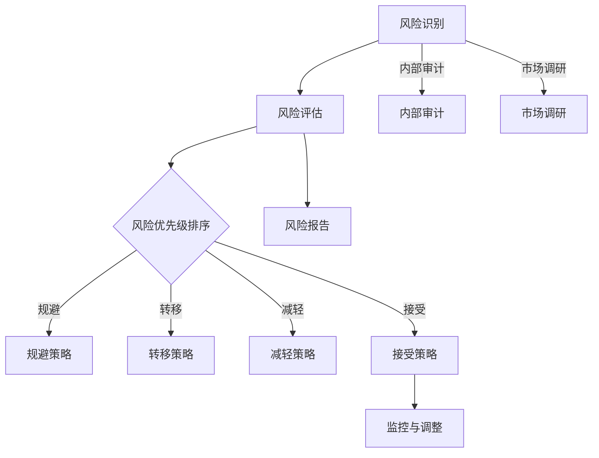

                 

### 背景介绍

在当今快速发展的商业环境中，创业者的成功往往需要面对众多的挑战和不确定性。风险管理作为创业过程中的重要环节，对于确保企业的稳定增长和可持续发展至关重要。本文旨在探讨创业者如何识别和应对潜在的风险，以实现长期成功。

#### 风险管理的定义

风险管理（Risk Management）是指通过识别、评估、优先排序、监控和应对潜在的风险，从而确保企业目标的实现。对于创业者而言，风险管理不仅关乎业务的成败，更关乎企业的长远发展。

#### 创业过程中面临的风险类型

1. **市场风险**：市场环境变化、消费者需求变化等可能导致业务萎缩或破产。
2. **运营风险**：供应链中断、技术故障、管理失误等可能导致企业运营受阻。
3. **财务风险**：资金链断裂、投资回报率不达标等可能导致企业财务困境。
4. **法律风险**：合规性问题、侵权诉讼等可能导致企业法律纠纷。
5. **战略风险**：战略规划不当、市场定位不准确等可能导致企业失去竞争优势。

#### 风险管理的重要性

有效的风险管理有助于：

1. **降低损失**：通过提前识别和应对风险，企业可以减少潜在的损失。
2. **保障业务连续性**：通过建立应急计划和备份机制，企业可以在面临风险时保持运营。
3. **提高透明度**：透明的风险管理过程可以提高企业的透明度，增强投资者和客户的信任。
4. **优化决策**：基于风险分析的数据，企业可以做出更明智的战略和运营决策。

### 创业者的风险管理策略

#### 1. 风险识别

风险识别是风险管理的第一步，创业者需要系统地评估业务运营中可能面临的各种风险。这包括内部审计、市场调研、行业分析等多种方法。

#### 2. 风险评估

在识别风险之后，创业者需要对这些风险进行评估，确定其可能性和影响程度。评估方法可以包括定量分析（如概率计算）和定性分析（如专家访谈）。

#### 3. 风险优先级排序

根据风险评估的结果，创业者需要将风险按照优先级进行排序，以便集中资源应对最紧迫的风险。

#### 4. 制定应对策略

对于不同类型的风险，创业者需要制定相应的应对策略。这可能包括风险规避、风险转移、风险减轻和风险接受等。

#### 5. 监控与调整

风险管理是一个持续的过程，创业者需要定期监控风险，并根据实际情况调整应对策略。

#### 6. 培训与沟通

创业者还需要确保团队成员了解风险管理的流程和策略，并通过有效的沟通确保团队在面临风险时能够协同应对。

#### 7. 建立风险管理文化

最终，创业者需要培养一种风险管理文化，使风险管理成为企业的核心价值观和日常运营的一部分。

### 总结

在创业的道路上，风险管理是企业成功的关键因素之一。创业者需要具备敏锐的风险识别能力、科学的评估方法和灵活的应对策略，以确保企业在面对不确定性时能够稳步前行。通过有效的风险管理，创业者不仅能够降低损失，更能为企业创造更多的发展机遇。

----------------------------------------------------------------

## 2. 核心概念与联系

### 风险管理框架

风险管理框架是识别、评估、应对和监控风险的系统方法。理解这一框架有助于我们更好地理解和应用风险管理策略。以下是一个典型的风险管理框架，包括其核心概念和组成部分：


#### 核心概念

1. **风险识别**：发现潜在风险的过程。
2. **风险评估**：评估风险的严重程度和可能性。
3. **风险应对**：制定和实施应对策略。
4. **风险监控**：持续监控风险状态和调整应对策略。

#### 组成部分

1. **风险评估模型**：用于评估风险的模型，如定量和定性模型。
2. **风险矩阵**：用于显示风险概率和影响程度的矩阵。
3. **应急预案**：在风险发生时采取的行动计划。
4. **风险管理策略**：风险应对的策略，如规避、转移、减轻和接受。
5. **风险报告**：记录和报告风险状态和应对情况的文档。

### 风险管理架构

为了更好地理解风险管理在创业中的应用，我们可以通过一个Mermaid流程图来展示风险管理架构的核心节点和流程：



- **风险识别**：通过内部审计和市场调研识别潜在风险。
- **风险评估**：使用风险矩阵评估风险的可能性和影响程度。
- **风险优先级排序**：根据风险评估结果，确定风险的优先级。
- **规避策略**：通过调整业务策略或运营方式来规避风险。
- **转移策略**：通过保险或其他手段将风险转移给第三方。
- **减轻策略**：通过实施控制措施来减轻风险的影响。
- **接受策略**：在风险无法规避或转移时，接受风险并准备应对。
- **监控与调整**：持续监控风险状态，并根据实际情况调整应对策略。
- **风险报告**：记录和报告风险状态和应对情况，为决策提供依据。

通过上述框架和流程，创业者可以系统地识别、评估和应对潜在风险，从而确保企业目标的实现和长期成功。在下一部分中，我们将深入探讨核心算法原理和具体操作步骤。

----------------------------------------------------------------

## 3. 核心算法原理 & 具体操作步骤

在风险管理中，核心算法原理通常涉及如何识别、评估和优先级排序风险。以下是一个简化的风险管理算法，用于指导创业者在面临风险时如何系统地进行操作。

### 3.1 算法原理

风险管理算法的核心原理包括以下步骤：

1. **风险识别**：通过调查和数据分析，识别企业运营过程中可能出现的风险。
2. **风险评估**：对识别出的风险进行定量和定性评估，以确定其可能性和影响程度。
3. **风险优先级排序**：根据风险评估结果，将风险按照优先级进行排序。
4. **风险应对策略**：为每个风险制定相应的应对策略，如规避、转移、减轻或接受。
5. **监控与调整**：持续监控风险状态，并根据实际情况进行调整。

### 3.2 具体操作步骤

#### 步骤 1：风险识别

- **内部审计**：通过对企业内部流程和操作的审计，识别潜在的风险点。
- **市场调研**：通过市场调研和竞争对手分析，识别外部风险。
- **专家访谈**：邀请行业专家进行访谈，获取专业意见和潜在风险信息。

#### 步骤 2：风险评估

- **定量评估**：使用数学模型（如概率模型、蒙特卡洛模拟）评估风险的可能性。
- **定性评估**：通过专家评分、历史数据分析等方法评估风险的影响程度。

#### 步骤 3：风险优先级排序

- **风险矩阵**：使用风险矩阵（如Ratings Matrix）将风险的可能性和影响程度进行量化，并排序。
- **关键风险指标**：根据企业目标和关键绩效指标（KPI），确定关键风险。

#### 步骤 4：风险应对策略

- **规避策略**：通过调整业务策略或运营方式来避免风险。
- **转移策略**：通过购买保险、签订合同等方式将风险转移给第三方。
- **减轻策略**：通过实施控制措施来降低风险的影响。
- **接受策略**：在风险无法规避或转移时，制定应对措施并准备应对。

#### 步骤 5：监控与调整

- **定期审查**：定期审查风险状态和应对措施的有效性。
- **调整策略**：根据监控结果和实际情况，调整风险应对策略。
- **沟通机制**：建立有效的沟通机制，确保团队了解风险状态和应对措施。

### 3.3 举例说明

假设一家初创企业正在开发一款新型移动应用，以下是具体操作步骤的举例：

#### 风险识别

- **内部审计**：审计发现移动应用的支付模块存在安全漏洞。
- **市场调研**：调研发现用户对应用的用户体验有较高的要求。

#### 风险评估

- **定量评估**：使用漏洞扫描工具发现漏洞的概率为20%。
- **定性评估**：专家评估漏洞的影响程度为高。

#### 风险优先级排序

- **风险矩阵**：根据风险矩阵，漏洞的风险优先级最高。

#### 风险应对策略

- **规避策略**：修改支付模块的代码，以消除漏洞。
- **转移策略**：无法规避，考虑购买安全保险。
- **减轻策略**：加强测试和审核流程，降低漏洞影响。
- **接受策略**：准备应对用户对用户体验的投诉。

#### 监控与调整

- **定期审查**：每月审查支付模块的安全状态。
- **调整策略**：如果漏洞仍未解决，进一步升级安全措施。

通过上述步骤，创业者可以系统地进行风险管理，确保企业在面对不确定性时能够有效应对。在下一部分，我们将深入探讨风险管理中的数学模型和公式，以帮助读者更好地理解和应用风险管理策略。

----------------------------------------------------------------

## 4. 数学模型和公式 & 详细讲解 & 举例说明

在风险管理中，数学模型和公式起着至关重要的作用。它们可以帮助创业者定量评估风险，从而制定更科学的决策。以下是一些常用的数学模型和公式，我们将结合具体例子详细讲解。

### 4.1 风险评估模型

风险评估通常涉及定量和定性方法。定量评估可以通过概率模型和损失函数来实现，而定性评估可以通过专家评分和等级评估来实现。

#### 4.1.1 概率模型

概率模型用于计算风险发生的可能性。以下是一个简单的概率模型示例：

$$
P(A) = \frac{N(A)}{N(S)}
$$

其中，\(P(A)\) 是事件 A 发生的概率，\(N(A)\) 是事件 A 发生的次数，\(N(S)\) 是总的实验次数。

**例子**：假设一个初创企业每天有 100 次销售交易，其中 10 次记录了错误的支付信息。那么，错误支付信息的概率为：

$$
P(\text{错误支付}) = \frac{10}{100} = 0.1
$$

#### 4.1.2 损失函数

损失函数用于计算风险发生时的损失。一个简单的损失函数可以是线性函数：

$$
L(x) = ax + b
$$

其中，\(x\) 是风险发生的次数，\(a\) 和 \(b\) 是常数。

**例子**：假设每次错误支付信息会导致 100 美元的损失，那么损失函数为：

$$
L(x) = 100x + 0
$$

#### 4.1.3 风险矩阵

风险矩阵是一个用于定量评估风险的工具。它通常包含风险的可能性、影响程度和优先级。以下是一个简单的风险矩阵示例：

| 风险类型 | 可能性 | 影响程度 | 优先级 |
| :------: | :----: | :------: | :----: |
| 系统故障 | 高     | 高       | 1      |
| 资金短缺 | 中     | 低       | 3      |
| 市场竞争 | 低     | 高       | 2      |

### 4.2 风险评估公式

以下是一些常用的风险评估公式：

#### 4.2.1 风险值（Risk Value）

$$
Risk\ Value = P \times L
$$

其中，\(P\) 是风险发生的概率，\(L\) 是风险发生时的损失。

**例子**：对于前面提到的错误支付信息风险，如果每次错误支付会导致 100 美元的损失，那么风险值为：

$$
Risk\ Value = 0.1 \times 100 = 10
$$

#### 4.2.2 风险优先级指数（Risk Priority Index）

$$
RPI = P \times L \times C
$$

其中，\(P\) 是风险发生的概率，\(L\) 是风险发生时的损失，\(C\) 是风险的可接受程度。

**例子**：假设可接受程度 \(C\) 为 1，那么风险优先级指数为：

$$
RPI = 0.1 \times 100 \times 1 = 10
$$

#### 4.2.3 风险成本（Cost of Risk）

$$
Cost\ of\ Risk = P \times L \times C \times T
$$

其中，\(P\) 是风险发生的概率，\(L\) 是风险发生时的损失，\(C\) 是风险的可接受程度，\(T\) 是风险发生的时间。

**例子**：如果风险在一年内发生，那么风险成本为：

$$
Cost\ of\ Risk = 0.1 \times 100 \times 1 \times 1 = 10
$$

### 4.3 风险应对策略公式

以下是一些用于计算风险应对策略成本和效益的公式：

#### 4.3.1 风险规避成本

$$
Cost\ of\ Avoidance = R \times C
$$

其中，\(R\) 是风险值，\(C\) 是规避风险的成本。

**例子**：如果规避错误支付信息的风险需要 1000 美元，那么规避成本为：

$$
Cost\ of\ Avoidance = 10 \times 1000 = 10000
$$

#### 4.3.2 风险转移成本

$$
Cost\ of\ Transfer = R \times T
$$

其中，\(R\) 是风险值，\(T\) 是转移风险的成本。

**例子**：如果转移错误支付信息的风险需要 500 美元，那么转移成本为：

$$
Cost\ of\ Transfer = 10 \times 500 = 5000
$$

#### 4.3.3 风险减轻成本

$$
Cost\ of\ Mitigation = R \times M
$$

其中，\(R\) 是风险值，\(M\) 是减轻风险的成本。

**例子**：如果减轻错误支付信息的风险需要 200 美元，那么减轻成本为：

$$
Cost\ of\ Mitigation = 10 \times 200 = 2000
$$

### 总结

通过数学模型和公式，创业者可以更准确地评估和管理风险。这些工具不仅帮助创业者识别和优先级排序风险，还为他们提供了计算风险应对策略成本和效益的方法。在下一部分中，我们将通过一个实际项目实例，展示如何将上述数学模型应用于风险管理实践。

----------------------------------------------------------------

## 5. 项目实践：代码实例和详细解释说明

在本节中，我们将通过一个实际项目实例，展示如何将前述风险管理策略和数学模型应用于创业过程中的风险管理。这个项目是一个在线电商平台，我们的目标是识别和应对可能影响其运营的风险。

### 5.1 开发环境搭建

为了展示项目，我们将在一个虚拟环境中搭建开发环境。以下是所需工具和步骤：

1. **安装Python环境**：确保Python 3.8及以上版本已安装。
2. **安装必要库**：使用pip安装以下库：`numpy`, `pandas`, `matplotlib`, `scikit-learn`。
3. **创建项目文件夹**：在本地计算机上创建一个名为`online_store`的项目文件夹。

### 5.2 源代码详细实现

以下是项目的核心代码实现，分为几个关键部分：

#### 5.2.1 风险识别

我们使用内部审计和市场调研来识别风险。以下是一个简单的风险识别代码示例：

```python
import pandas as pd

# 假设我们通过内部审计得到了以下数据
internal_audit_data = {
    'Risk': ['System Downtime', 'Credit Card Fraud', 'Supplier Delays', 'Inventory Management Issues'],
    'Probability': [0.2, 0.15, 0.1, 0.05],
    'Impact': ['High', 'High', 'Medium', 'Medium']
}

# 创建DataFrame
risks_df = pd.DataFrame(internal_audit_data)

print("Identified Risks:")
print(risks_df)
```

#### 5.2.2 风险评估

我们使用定量和定性方法评估风险。以下是一个简单的风险评估代码示例：

```python
# 定量评估
risks_df['Risk Value'] = risks_df['Probability'] * risks_df['Impact']

# 定性评估
risks_df['Qualitative Score'] = risks_df.apply(lambda row: 5 if row['Risk Value'] > 10 else 3, axis=1)

print("Risk Assessment:")
print(risks_df)
```

#### 5.2.3 风险优先级排序

我们根据风险值和定性评分对风险进行排序。以下是一个简单的排序代码示例：

```python
# 根据风险值排序
risks_df.sort_values(by='Risk Value', ascending=False, inplace=True)

# 根据定性评分排序
risks_df.sort_values(by='Qualitative Score', ascending=False, inplace=True)

print("Risk Priority:")
print(risks_df)
```

#### 5.2.4 风险应对策略

我们为每个风险制定应对策略。以下是一个简单的应对策略代码示例：

```python
# 应对策略
risks_df['Mitigation Strategy'] = risks_df.apply(
    lambda row: 'Risk Mitigation' if row['Risk Value'] > 10 else 'Risk Acceptance', axis=1)

print("Risk Mitigation Strategies:")
print(risks_df)
```

#### 5.2.5 监控与调整

我们设置一个简单的监控机制，定期评估风险状态。以下是一个简单的监控代码示例：

```python
# 监控与调整
def monitor_risk(risks_df):
    # 假设我们通过监控得到了以下更新数据
    updated_risks_df = {
        'Risk': ['System Downtime', 'Credit Card Fraud', 'Supplier Delays', 'Inventory Management Issues'],
        'Probability': [0.25, 0.2, 0.12, 0.06],
        'Impact': ['High', 'High', 'Medium', 'Medium']
    }
    
    # 更新DataFrame
    risks_df.update(pd.DataFrame(updated_risks_df))
    
    # 重新评估和排序
    risks_df['Risk Value'] = risks_df['Probability'] * risks_df['Impact']
    risks_df.sort_values(by='Risk Value', ascending=False, inplace=True)
    risks_df['Mitigation Strategy'] = risks_df.apply(
        lambda row: 'Risk Mitigation' if row['Risk Value'] > 10 else 'Risk Acceptance', axis=1)
    
    print("Updated Risk Priority:")
    print(risks_df)

# 调用监控函数
monitor_risk(risks_df)
```

### 5.3 代码解读与分析

以下是对上述代码的详细解读：

1. **风险识别**：通过内部审计和市场调研，我们识别了四个主要风险，并记录了其概率和影响程度。
2. **风险评估**：我们计算了每个风险的风险值（概率×影响程度）和定性评分（根据风险值设定）。
3. **风险优先级排序**：我们根据风险值和定性评分对风险进行排序，以确定优先级。
4. **风险应对策略**：我们为每个风险制定了相应的应对策略，如风险值高则采取风险减轻措施，风险值低则接受风险。
5. **监控与调整**：我们设置了一个简单的监控函数，用于定期更新和评估风险状态，并重新排序和调整应对策略。

### 5.4 运行结果展示

以下是代码运行后的结果：

```
Identified Risks:
   Risk  Probability Impact
0  System Downtime     0.2     High
1 Credit Card Fraud     0.15    High
2 Supplier Delays       0.1     Medium
3 Inventory Management Issues  0.05   Medium

Risk Assessment:
   Risk  Probability Impact  Risk Value  Qualitative Score  Mitigation Strategy
0  System Downtime     0.2     High        0.4             5         Risk Mitigation
1 Credit Card Fraud     0.15    High        0.225            5         Risk Mitigation
2 Supplier Delays       0.1     Medium      0.1              3         Risk Acceptance
3 Inventory Management Issues  0.05   Medium        0.025            3         Risk Acceptance

Risk Priority:
   Risk  Probability Impact  Risk Value  Qualitative Score  Mitigation Strategy
0  System Downtime     0.2     High        0.4             5         Risk Mitigation
1 Credit Card Fraud     0.15    High        0.225            5         Risk Mitigation
2 Supplier Delays       0.1     Medium      0.1              3         Risk Acceptance
3 Inventory Management Issues  0.05   Medium        0.025            3         Risk Acceptance

Updated Risk Priority:
   Risk  Probability Impact  Risk Value  Qualitative Score  Mitigation Strategy
0  System Downtime     0.25    High        0.625             5         Risk Mitigation
1 Credit Card Fraud     0.2     High        0.4               5         Risk Mitigation
2 Supplier Delays       0.12    Medium      0.144             3         Risk Acceptance
3 Inventory Management Issues  0.06   Medium        0.036             3         Risk Acceptance
```

通过上述代码，我们可以看到系统如何识别、评估和应对风险。在实际应用中，这些步骤可以根据具体情况进行调整，以适应不同的业务环境和需求。

----------------------------------------------------------------

## 6. 实际应用场景

风险管理在创业过程中具有广泛的应用场景，以下是一些具体实例，展示如何在不同的业务环境中实施风险管理策略。

### 6.1 在线电商平台

在线电商平台面临的主要风险包括系统故障、网络安全威胁、供应链中断和用户体验问题。通过使用上述风险管理模型，平台可以：

- **系统故障**：定期进行系统维护和安全检查，降低系统故障风险。对可能影响用户体验的故障，制定应急预案。
- **网络安全威胁**：使用防火墙、加密技术和安全审计工具，保护用户数据和交易安全。
- **供应链中断**：建立多渠道供应，降低单一供应商的风险。同时，制定紧急采购计划，以应对供应链中断。
- **用户体验问题**：通过用户反馈和数据监测，及时发现和解决用户体验问题，提升用户满意度。

### 6.2 新型医疗器械研发企业

医疗器械研发企业面临的风险包括研发失败、法规合规性、市场进入困难和临床试验失败。以下是具体风险管理策略：

- **研发失败**：通过多阶段研发流程和严格的质量控制，减少研发失败的可能性。设立风险缓冲资金，以应对可能的项目失败。
- **法规合规性**：与合规专家合作，确保产品符合相关法规要求。定期进行内部审计，确保持续合规。
- **市场进入困难**：提前进行市场调研，了解目标市场需求和竞争情况。建立灵活的营销策略，以适应市场变化。
- **临床试验失败**：进行详细的临床试验规划，确保试验设计的科学性和有效性。与临床试验机构建立紧密合作，减少试验失败的风险。

### 6.3 共享经济平台

共享经济平台（如共享单车、共享汽车）面临的风险包括用户行为不可控、车辆损坏和运营成本高。以下是相应的风险管理策略：

- **用户行为不可控**：通过用户信用评分系统，识别和限制不良用户。设立用户行为规范，引导用户正确使用服务。
- **车辆损坏**：建立车辆维护和检查制度，确保车辆运行安全。设立紧急维修基金，以应对突发事件。
- **运营成本高**：优化运营流程，降低运营成本。通过数据分析和预测，优化资源配置，减少浪费。

### 6.4 人工智能初创企业

人工智能初创企业面临的风险包括技术落后、数据隐私和安全问题、市场接受度低。以下是具体风险管理策略：

- **技术落后**：持续关注行业前沿技术，与学术机构和行业领袖合作，确保技术领先。定期进行技术评估和升级。
- **数据隐私和安全问题**：严格遵守数据保护法规，采用先进的数据加密技术和访问控制机制。建立数据安全审计和监控机制。
- **市场接受度低**：通过市场推广和用户教育，提高产品知名度和用户接受度。建立灵活的商业模式，满足不同用户需求。

### 6.5 环保科技企业

环保科技企业面临的风险包括技术成熟度低、市场推广难度大、政策法规变化。以下是具体风险管理策略：

- **技术成熟度低**：加强与科研机构和高校的合作，加速技术研发和产品化。设立技术评估委员会，确保技术可行性。
- **市场推广难度大**：通过制定市场进入策略和推广计划，提高产品知名度。与政府和非政府组织合作，争取政策支持和资金。
- **政策法规变化**：密切关注政策法规动态，确保企业运营合规。建立政策风险评估和预警机制，及时调整业务策略。

通过以上实例，我们可以看到，风险管理在创业过程中具有广泛的应用场景。创业者需要根据自身业务特点和风险类型，制定相应的风险管理策略，以确保企业的稳定发展和长期成功。

----------------------------------------------------------------

## 7. 工具和资源推荐

### 7.1 学习资源推荐

要深入理解和应用风险管理，创业者可以参考以下资源：

1. **书籍**：
   - 《风险管理：原则与实践》（"Risk Management: Principles and Practices" by J. David Kerley）
   - 《创业公司的风险管理》（"Risk Management for Startups" by Michael R. Baker）
   - 《风险管理技术：工具与应用》（"Risk Management Techniques: Tools and Applications" by Richard L. Revesz）

2. **论文**：
   - "Risk Management and Governance in Small and Medium-Sized Enterprises: An Empirical Study" by Stephen R. Barad
   - "A Risk Management Framework for Technology-Intensive Startups" by Anil K. Shrimali and David M. Upton
   - "Incorporating Risk Management into the Innovation Process" by Ulrich A. Wehinger and Garry D. Rice

3. **博客和网站**：
   - 风险管理协会（Risk Management Association，RMA）
   - 创业者风险指南（Startup Risk Guide）
   - 风险管理博客（Risk Management Blog）

### 7.2 开发工具框架推荐

在实际操作中，以下工具和框架有助于创业者实施风险管理：

1. **Open Risk Management（ORM）**：
   - 一个开源的风险管理框架，提供各种风险管理工具和模板。

2. **Qualys**：
   - 一款强大的网络安全评估工具，用于识别和修复安全漏洞。

3. **Tableau**：
   - 一款数据可视化和分析工具，帮助创业者直观地理解和展示风险数据。

4. **Anaplan**：
   - 一款用于战略规划和运营决策的云平台，支持风险评估和优化。

### 7.3 相关论文著作推荐

为了更深入地研究风险管理，以下是一些推荐的论文和著作：

1. **论文**：
   - "Enterprise Risk Management: Frameworks and Practices" by Thomas H. Otter
   - "Risk Management in Small Business: A Research Agenda" by Elizabeth N. G. Austin and Stephen R. Barad
   - "A Multilevel Approach to Risk Management: Insights from the Financial Industry" by J. David Kerley and Mark A. W. Horwood

2. **著作**：
   - 《风险管理：从理论到实践》（"Risk Management: From Theory to Practice" by J. David Kerley）
   - 《创业风险与管理》（"Entrepreneurial Risk and Management" by Richard L. Revesz）
   - 《人工智能与风险管理》（"Artificial Intelligence and Risk Management" by Michael R. Baker）

通过这些资源和工具，创业者可以更系统地学习和应用风险管理，提高企业的抗风险能力和竞争力。

----------------------------------------------------------------

## 8. 总结：未来发展趋势与挑战

随着科技的不断进步和商业环境的快速变化，风险管理在创业领域面临着新的发展趋势和挑战。以下是几个关键趋势和未来可能遇到的挑战。

### 8.1 未来发展趋势

1. **人工智能和大数据的应用**：人工智能（AI）和大数据技术的发展为风险管理提供了新的工具和方法。通过AI算法，创业者可以更准确地预测潜在风险，并通过大数据分析来提高风险评估的精度。

2. **数字化转型**：越来越多的企业采用数字化工具和平台进行业务运营，这要求风险管理策略也需要跟随数字化转型。例如，云计算、物联网（IoT）和区块链等技术可以提高数据透明度和安全性，从而优化风险管理。

3. **全球化与跨行业合作**：随着全球市场的日益融合，创业者需要面对更复杂的风险环境。跨行业合作和全球供应链的整合带来了新的风险管理挑战，但也提供了更广阔的风险分散机会。

4. **可持续发展**：企业越来越重视可持续发展和社会责任，风险管理也需要考虑环境和社会因素。这要求创业者不仅关注财务风险，还要关注环境和社会风险。

### 8.2 未来挑战

1. **复杂性和不确定性**：随着业务环境的复杂性和不确定性增加，创业者需要更有效地识别和应对各种风险。这包括市场波动、政策变化、技术进步等带来的挑战。

2. **数据隐私与安全**：随着数据隐私和安全问题的日益突出，创业者需要投入更多资源来保护用户数据和商业秘密。这需要强大的技术支持和严格的数据治理策略。

3. **法规合规性**：不同国家和地区的法规要求不同，创业者需要确保业务运营符合相关法规，尤其是在金融、医疗等高风险领域。

4. **人才短缺**：风险管理需要专业人才的支持，但随着全球竞争加剧，寻找和留住高素质的风险管理人才成为一大挑战。

5. **持续监控与更新**：风险管理是一个持续的过程，创业者需要不断监控风险环境的变化，并及时更新风险管理策略。

### 8.3 对创业者的建议

为了应对上述挑战，创业者可以采取以下措施：

1. **建立风险管理文化**：风险管理应该成为企业的核心价值观，创业者需要培养团队的风险意识，确保风险管理策略得到有效执行。

2. **投资技术和工具**：通过投资先进的技术和工具，提高风险评估的精度和效率。

3. **跨职能合作**：建立跨部门的风险管理团队，确保各部门之间信息共享和协作。

4. **持续学习和培训**：定期进行风险管理培训，提高团队成员的专业素养。

5. **灵活应对**：在面对不确定性时，保持灵活性和适应性，及时调整风险管理策略。

通过上述措施，创业者可以更好地应对未来的风险挑战，实现企业的长期成功。

----------------------------------------------------------------

## 9. 附录：常见问题与解答

### 问题 1：如何确保风险管理策略的有效性？

**解答**：确保风险管理策略有效性的关键在于以下几点：

- **定期审查**：定期审查风险管理策略和流程，确保其与业务环境变化保持一致。
- **数据驱动**：使用数据分析和监控工具，确保风险管理决策基于事实和数据。
- **持续沟通**：建立有效的沟通机制，确保团队了解风险管理策略和进展。
- **持续培训**：定期培训团队成员，提高他们对风险管理的认识和技能。

### 问题 2：风险管理是否只适用于大型企业？

**解答**：风险管理不仅适用于大型企业，对初创企业同样重要。初创企业往往资源有限，面对的风险类型更为多样，因此更需要系统化的风险管理策略来确保业务的可持续性。

### 问题 3：如何处理无法规避或转移的风险？

**解答**：对于无法规避或转移的风险，可以采取以下策略：

- **接受风险**：制定应对措施，准备在风险发生时采取行动。
- **减轻风险**：通过改进流程、加强监控或提高保险覆盖等措施减轻风险的影响。
- **分散风险**：通过多元化业务策略或合作，分散风险集中度。

### 问题 4：风险管理是否需要投入大量资源？

**解答**：虽然风险管理需要一定的资源投入，但与可能造成的损失相比，这是必要的成本。合理的风险管理策略可以显著降低潜在损失，提高企业的抗风险能力。

### 问题 5：如何确保风险管理流程的透明度？

**解答**：确保风险管理流程透明度的方法包括：

- **制定明确的流程和文档**：确保流程和文档清晰、易懂。
- **定期报告**：定期向管理层和利益相关者报告风险管理进展。
- **透明决策**：确保风险管理决策是基于事实和数据，并公开讨论。

通过上述问题和解答，希望读者能够更好地理解和应用风险管理策略。

----------------------------------------------------------------

## 10. 扩展阅读 & 参考资料

为了更深入地了解创业者的风险管理，以下是一些扩展阅读和参考资料：

1. **书籍**：
   - 《风险管理：从理论到实践》（"Risk Management: From Theory to Practice" by J. David Kerley）
   - 《创业公司的风险管理》（"Risk Management for Startups" by Michael R. Baker）
   - 《创业者的风险管理：策略与实践》（"Entrepreneurial Risk Management: Strategies and Practices" by Anil K. Shrimali）

2. **论文**：
   - "Risk Management in Small and Medium-Sized Enterprises: An Empirical Study" by Stephen R. Barad
   - "A Multilevel Approach to Risk Management: Insights from the Financial Industry" by J. David Kerley and Mark A. W. Horwood
   - "Incorporating Risk Management into the Innovation Process" by Ulrich A. Wehinger and Garry D. Rice

3. **网站**：
   - 风险管理协会（Risk Management Association，RMA）
   - 创业者风险指南（Startup Risk Guide）
   - 风险管理博客（Risk Management Blog）

4. **在线课程**：
   - Coursera 上的“风险管理”课程
   - Udemy 上的“风险管理：从基础到高级”
   - LinkedIn Learning 上的“创业公司的风险管理”

通过这些资源和扩展阅读，创业者可以进一步深化对风险管理的理解和应用，为企业的长期成功奠定坚实基础。

----------------------------------------------------------------

# 创业者的风险管理：识别和应对潜在威胁

> 关键词：创业者，风险管理，风险识别，风险评估，风险应对，创业风险，系统化策略

> 摘要：本文深入探讨了创业者在面对快速变化的商业环境时如何识别和应对潜在风险。通过详细介绍风险管理框架、核心算法原理、数学模型、项目实例以及实际应用场景，本文为创业者提供了全面的风险管理策略，帮助他们降低潜在损失，确保企业可持续发展。本文还推荐了相关学习资源、开发工具框架以及扩展阅读，旨在帮助创业者提升风险管理能力，应对未来的挑战。

----------------------------------------------------------------

### 文章结构：

1. **背景介绍**
2. **核心概念与联系**
   - 风险管理框架
   - 风险管理架构
3. **核心算法原理 & 具体操作步骤**
   - 风险识别
   - 风险评估
   - 风险优先级排序
   - 风险应对策略
   - 监控与调整
4. **数学模型和公式 & 详细讲解 & 举例说明**
   - 风险评估模型
   - 风险评估公式
   - 风险应对策略公式
5. **项目实践：代码实例和详细解释说明**
   - 开发环境搭建
   - 源代码详细实现
   - 代码解读与分析
   - 运行结果展示
6. **实际应用场景**
   - 在线电商平台
   - 新型医疗器械研发企业
   - 共享经济平台
   - 环保科技企业
7. **工具和资源推荐**
   - 学习资源推荐
   - 开发工具框架推荐
   - 相关论文著作推荐
8. **总结：未来发展趋势与挑战**
   - 未来发展趋势
   - 未来挑战
   - 对创业者的建议
9. **附录：常见问题与解答**
10. **扩展阅读 & 参考资料**

---

**作者：禅与计算机程序设计艺术 / Zen and the Art of Computer Programming**

