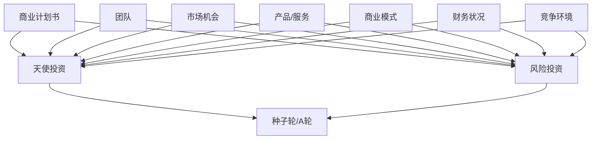

                 

### 背景介绍

在当今高度竞争的商业环境中，创业公司想要脱颖而出，获得外部资金支持至关重要。天使投资和风险投资（Venture Capital，简称VC）是两种主要的融资方式，为初创企业和成长型企业提供所需资金，助力其发展壮大。然而，无论是天使投资人还是风险投资机构，它们在选择投资项目时都有着严格的标准和偏好。理解这些标准和偏好，对于创业公司成功获得融资至关重要。

首先，我们来看看什么是天使投资。天使投资通常是指个人投资者，他们对早期阶段的初创企业进行投资。这些投资者通常是基于个人兴趣和对项目的信心进行投资，而非仅仅基于财务回报。天使投资的特点是投资金额相对较小，但能够提供宝贵的资源和指导。

相比之下，风险投资是指专业投资机构通过基金形式对具有高成长潜力的企业进行投资。风险投资的特点是投资金额较大，且往往涉及多个轮次的融资。风险投资机构通常在投资过程中更加注重企业的商业模式、管理团队和市场潜力。

本文将围绕如何获得天使投资和风险投资展开讨论。我们将首先介绍这两种融资方式的基本概念和特点，然后深入探讨如何撰写商业计划书、如何寻找合适的投资者、如何进行谈判和尽职调查等关键环节。此外，我们还将分享一些成功融资的案例分析，以及如何在融资过程中保持透明和诚信。

通过本文的阅读，您将获得以下收益：

1. **理解天使投资和风险投资的基本概念与特点**。
2. **掌握撰写商业计划书的关键要素**。
3. **了解如何有效寻找和联系投资者**。
4. **学会谈判技巧和应对尽职调查**。
5. **获得成功融资的实用建议和案例分享**。

让我们开始这次关于创业融资的深入探讨，希望能为您在融资道路上提供有益的指导。### 核心概念与联系

在探讨如何获得天使投资和风险投资之前，我们需要明确一些核心概念，这些概念是理解整个融资过程的基础。

#### 1. 天使投资

天使投资是指由个人投资者提供的，用于早期初创企业的资金。这些投资者通常是成功的企业家、退休高管或其他富裕的个人。天使投资的目的是通过为初创企业提供资金和资源，来换取企业的股权或可转换债券。以下是天使投资的关键特点：

- **投资阶段**：通常在初创企业的种子轮或天使轮阶段。
- **投资金额**：相对较小，但可能高达数十万美元。
- **投资动机**：个人兴趣、对项目的信心、希望获得未来的财务回报。
- **投资期限**：一般较为灵活，不要求立即退出。

#### 2. 风险投资

风险投资（Venture Capital）是由专业投资机构（风险投资公司）提供的资金，用于那些具有高成长潜力的企业。以下是风险投资的关键特点：

- **投资阶段**：通常在企业的成长期、扩张期或成熟期，分为种子轮、A轮、B轮等多个阶段。
- **投资金额**：通常较大，可以从几十万到数千万美元不等。
- **投资动机**：追求高回报，关注企业的长期增长潜力。
- **投资期限**：较长，往往需要数年甚至更长时间。

#### 3. 商业计划书

商业计划书是创业公司向投资者展示其商业模型、市场机会、财务预测和团队背景的重要文档。它是获得天使投资和风险投资的关键文件。以下是商业计划书的关键组成部分：

- **执行摘要**：简要概述企业的核心信息，包括目标、市场、团队、财务预测等。
- **公司描述**：介绍企业的业务范围、历史和愿景。
- **市场分析**：分析目标市场、竞争对手、市场份额和成长潜力。
- **产品或服务**：详细介绍产品或服务的特点、优势和市场需求。
- **营销策略**：阐述如何推广产品或服务，包括营销渠道、定价策略等。
- **运营计划**：描述企业的日常运营流程、关键业务指标和团队结构。
- **财务预测**：提供未来几年的财务预测，包括收入、支出和现金流。
- **团队介绍**：介绍管理团队和关键员工的背景、经验和技能。

#### 4. 投资决策因素

投资者在评估创业公司时，通常会考虑以下因素：

- **团队**：管理团队的素质、经验和能力。
- **市场机会**：市场潜力和竞争环境。
- **产品或服务**：产品的独特性、市场需求和竞争优势。
- **商业模式**：盈利模式、成本结构和增长潜力。
- **财务状况**：历史财务数据和未来财务预测。
- **竞争环境**：竞争对手的优势和弱点。
- **投资规模**：投资金额和预期回报。

#### Mermaid 流程图

为了更好地理解上述核心概念之间的联系，我们可以使用Mermaid绘制一个流程图：



在这个流程图中，天使投资和风险投资分别流向不同的投资阶段，商业计划书作为两者的桥梁，连接了团队、市场机会、产品或服务、商业模式、财务状况和竞争环境等多个关键因素。

通过上述核心概念和流程图的介绍，我们为后续详细探讨如何获得天使投资和风险投资奠定了基础。接下来，我们将深入分析如何撰写一份成功的商业计划书，以及如何与投资者进行有效沟通和谈判。### 核心算法原理 & 具体操作步骤

在掌握了天使投资和风险投资的基本概念和流程之后，我们接下来需要深入了解如何撰写一份成功的商业计划书。商业计划书不仅是向投资者展示企业价值的关键文件，也是企业自身发展规划的重要指导。以下是撰写商业计划书的核心算法原理和具体操作步骤。

#### 1. 明确商业计划书的结构

商业计划书通常包括以下章节：

- **执行摘要**
- **公司描述**
- **市场分析**
- **产品或服务**
- **营销策略**
- **运营计划**
- **财务预测**
- **团队介绍**
- **附录**

#### 2. 执行摘要

执行摘要是一份简短的企业概览，通常不超过2页，需要包含以下关键信息：

- **企业名称、地址、联系方式**
- **企业愿景和使命**
- **主要产品或服务**
- **市场机会**
- **财务预测摘要**
- **投资者回报**

撰写执行摘要时，首先要吸引投资者的注意力，简明扼要地说明企业的核心竞争力和市场前景。

#### 3. 公司描述

公司描述部分需要详细阐述企业的业务范围、发展历程、目标和愿景。以下是公司描述的要点：

- **企业背景**
- **业务范围和核心产品**
- **发展历程和里程碑**
- **目标和愿景**

在撰写公司描述时，要确保信息真实可靠，同时突出企业的独特性和竞争优势。

#### 4. 市场分析

市场分析是商业计划书中的关键章节，需要详细分析目标市场、竞争环境和市场规模。以下是市场分析的要点：

- **目标市场**
- **市场规模和增长趋势**
- **竞争对手分析**
- **市场份额和增长策略**

在市场分析中，要准确数据支撑，确保分析的严谨性和可信度。

#### 5. 产品或服务

产品或服务章节需要详细描述企业的核心产品或服务，包括其特点、优势和市场需求。以下是产品或服务的要点：

- **产品或服务的详细介绍**
- **产品或服务的特点**
- **市场需求分析**
- **竞争优势**

在描述产品或服务时，要突出其创新性、实用性和市场潜力。

#### 6. 营销策略

营销策略章节需要阐述如何推广产品或服务，包括营销渠道、定价策略、促销活动和市场定位。以下是营销策略的要点：

- **营销目标和目标市场**
- **营销渠道**
- **定价策略**
- **促销活动**
- **市场定位**

在营销策略中，要确保策略的可行性和可持续性。

#### 7. 运营计划

运营计划章节需要详细描述企业的日常运营流程、关键业务指标和团队结构。以下是运营计划的要点：

- **运营流程**
- **关键业务指标**
- **团队结构**
- **运营风险**

在运营计划中，要确保运营流程的清晰性和团队的有效协作。

#### 8. 财务预测

财务预测章节需要提供未来几年的财务预测，包括收入、支出和现金流。以下是财务预测的要点：

- **收入预测**
- **支出预测**
- **现金流预测**
- **盈亏平衡分析**

在财务预测中，要确保预测的合理性和可行性。

#### 9. 团队介绍

团队介绍章节需要介绍管理团队和关键员工的背景、经验和技能。以下是团队介绍的要点：

- **管理团队介绍**
- **关键员工介绍**
- **团队成员的互补性**

在团队介绍中，要突出团队成员的素质和经验。

#### 10. 附录

附录部分可以包括一些支持性文档，如市场调研报告、财务报表、专利证书等。以下是附录的要点：

- **市场调研报告**
- **财务报表**
- **专利证书**
- **其他支持性文档**

通过上述核心算法原理和具体操作步骤，我们可以系统地撰写一份成功的商业计划书。接下来，我们将进一步探讨如何寻找合适的投资者，以及如何在谈判和尽职调查过程中取得成功。### 数学模型和公式 & 详细讲解 & 举例说明

在商业计划书的财务预测部分，我们将使用数学模型和公式来展示企业的财务状况和预测。以下是几个常用的财务预测模型和公式，以及详细的讲解和举例说明。

#### 1. 盈利预测模型

盈利预测模型主要用于预测企业在未来几年的盈利状况。以下是一个简单的盈利预测模型：

\[ \text{利润} = \text{销售收入} - \text{成本} \]

\[ \text{净利润} = \text{利润} - \text{税费} \]

**举例说明**：

假设一家初创企业的预计销售收入为100万元，成本为60万元，税费率为25%。则：

\[ \text{利润} = 100\text{万元} - 60\text{万元} = 40\text{万元} \]

\[ \text{净利润} = 40\text{万元} - 25\text{万元} = 15\text{万元} \]

#### 2. 成本预测模型

成本预测模型主要用于预测企业在未来几年的运营成本。以下是一个简单的成本预测模型：

\[ \text{成本} = \text{固定成本} + \text{可变成本} \]

**举例说明**：

假设一家初创企业的固定成本为30万元，可变成本为每销售1万元产品增加2万元成本。如果预计销售收入为100万元，则：

\[ \text{成本} = 30\text{万元} + (2\text{万元/万元} \times 100\text{万元}) = 30\text{万元} + 200\text{万元} = 230\text{万元} \]

#### 3. 现金流预测模型

现金流预测模型主要用于预测企业在未来几年的现金流状况。以下是一个简单的现金流预测模型：

\[ \text{现金流} = \text{净利润} + \text{折旧} \]

**举例说明**：

假设一家初创企业的净利润为15万元，年折旧率为10%。则：

\[ \text{现金流} = 15\text{万元} + (15\text{万元} \times 10\%) = 15\text{万元} + 1.5\text{万元} = 16.5\text{万元} \]

#### 4. 盈亏平衡分析模型

盈亏平衡分析模型主要用于预测企业在何时能够实现盈利。以下是一个简单的盈亏平衡分析模型：

\[ \text{盈亏平衡点} = \frac{\text{固定成本}}{\text{销售收入 - 可变成本}} \]

**举例说明**：

假设一家初创企业的固定成本为30万元，可变成本为每销售1万元产品增加2万元成本，销售收入为100万元。则：

\[ \text{盈亏平衡点} = \frac{30\text{万元}}{100\text{万元} - 2\text{万元}} = \frac{30\text{万元}}{98\text{万元}} \approx 0.306 \]

这意味着企业需要销售约30.6万元的产品才能实现盈亏平衡。

#### 5. 投资回报率（ROI）预测模型

投资回报率（ROI）预测模型主要用于预测企业的投资回报。以下是一个简单的投资回报率模型：

\[ \text{ROI} = \frac{\text{净利润}}{\text{投资总额}} \]

**举例说明**：

假设一家初创企业的投资总额为100万元，净利润为15万元。则：

\[ \text{ROI} = \frac{15\text{万元}}{100\text{万元}} = 15\% \]

通过这些数学模型和公式，我们可以系统地预测企业的财务状况和未来发展。在实际撰写商业计划书时，我们需要根据企业的具体情况，选择合适的模型和公式，并进行详细的数据分析和预测。这些预测结果将帮助我们更好地评估企业的市场前景和投资潜力。### 项目实践：代码实例和详细解释说明

在理解了如何撰写商业计划书以及使用数学模型进行财务预测后，我们接下来将通过一个实际项目来展示如何应用这些知识。这个项目是一个简单的创业公司的财务预测系统，用于帮助初创企业进行财务预测和规划。以下是将这些理论知识转化为实践的步骤。

#### 1. 开发环境搭建

为了构建这个财务预测系统，我们需要搭建一个开发环境。以下是所需的工具和步骤：

- **编程语言**：Python
- **开发环境**：PyCharm或Visual Studio Code
- **数据可视化库**：Matplotlib
- **数据库**：SQLite（用于存储数据）
- **依赖管理**：pip（用于安装和管理Python库）

首先，确保您的计算机上已经安装了Python环境。然后，通过以下命令安装所需的库：

```bash
pip install matplotlib
pip install sqlite3
```

接下来，创建一个新的Python项目，并设置好项目的目录结构。例如，可以将项目目录结构设置如下：

```
financial_forecast_system/
|-- src/
|   |-- __init__.py
|   |-- database.py
|   |-- main.py
|   |-- models.py
|   |-- visualization.py
|-- data/
|   |-- forecasts.db
|-- tests/
|   |-- __init__.py
|   |-- test_database.py
|   |-- test_models.py
|-- requirements.txt
|-- README.md
```

#### 2. 源代码详细实现

在项目开发过程中，我们将实现以下功能模块：

- **database.py**：用于数据库连接和数据操作。
- **models.py**：定义财务预测模型和数据模型。
- **main.py**：主程序，用于处理用户输入和调用其他模块。
- **visualization.py**：用于数据可视化。

以下是每个模块的详细代码实现：

**database.py**：

```python
import sqlite3

def connect_db():
    conn = sqlite3.connect('data/forecasts.db')
    return conn

def create_tables():
    conn = connect_db()
    cursor = conn.cursor()
    
    cursor.execute('''CREATE TABLE IF NOT EXISTS sales (
                        id INTEGER PRIMARY KEY,
                        amount REAL,
                        month INTEGER,
                        year INTEGER)''')
    cursor.execute('''CREATE TABLE IF NOT EXISTS costs (
                        id INTEGER PRIMARY KEY,
                        amount REAL,
                        month INTEGER,
                        year INTEGER)''')
    
    conn.commit()
    conn.close()
```

**models.py**：

```python
class FinancialModel:
    def __init__(self, sales_data, costs_data):
        self.sales_data = sales_data
        self.costs_data = costs_data

    def calculate_profit(self):
        total_sales = sum([row[1] for row in self.sales_data])
        total_costs = sum([row[1] for row in self.costs_data])
        return total_sales - total_costs

    def calculate_cashflow(self, depreciation=0.1):
        profit = self.calculate_profit()
        return profit + (profit * depreciation)

    def calculate_break_even(self):
        fixed_costs = sum([row[1] for row in self.costs_data if row[2] == 'fixed'])
        sales_per_unit = sum([row[1] for row in self.sales_data]) / len(self.sales_data)
        return fixed_costs / sales_per_unit
```

**main.py**：

```python
import sqlite3
from database import connect_db, create_tables
from models import FinancialModel

def main():
    create_tables()
    conn = connect_db()
    cursor = conn.cursor()

    # 添加示例数据
    cursor.execute("INSERT INTO sales (amount, month, year) VALUES (?, ?, ?)", (100000, 1, 2023))
    cursor.execute("INSERT INTO sales (amount, month, year) VALUES (?, ?, ?)", (200000, 2, 2023))
    cursor.execute("INSERT INTO costs (amount, month, year, category) VALUES (?, ?, ?, ?)", (30000, 1, 2023, 'fixed'))
    cursor.execute("INSERT INTO costs (amount, month, year, category) VALUES (?, ?, ?, ?)", (20000, 2, 2023, 'variable'))

    conn.commit()

    # 创建财务模型
    sales_data = cursor.execute("SELECT * FROM sales").fetchall()
    costs_data = cursor.execute("SELECT * FROM costs").fetchall()
    model = FinancialModel(sales_data, costs_data)

    # 计算并显示结果
    profit = model.calculate_profit()
    cashflow = model.calculate_cashflow()
    break_even = model.calculate_break_even()

    print(f"Profit: {profit}")
    print(f" Cashflow: {cashflow}")
    print(f"Break-even Point: {break_even}")

if __name__ == "__main__":
    main()
```

**visualization.py**：

```python
import matplotlib.pyplot as plt
import sqlite3

def plot_sales_data():
    conn = sqlite3.connect('data/forecasts.db')
    cursor = conn.cursor()
    
    sales_data = cursor.execute("SELECT * FROM sales").fetchall()
    months = [row[2] for row in sales_data]
    amounts = [row[1] for row in sales_data]

    plt.plot(months, amounts)
    plt.xlabel('Month')
    plt.ylabel('Sales Amount')
    plt.title('Sales Data')
    plt.show()

def plot_costs_data():
    conn = sqlite3.connect('data/forecasts.db')
    cursor = conn.cursor()
    
    costs_data = cursor.execute("SELECT * FROM costs").fetchall()
    months = [row[2] for row in costs_data]
    amounts = [row[1] for row in costs_data]

    plt.plot(months, amounts)
    plt.xlabel('Month')
    plt.ylabel('Cost Amount')
    plt.title('Costs Data')
    plt.show()
```

通过上述代码，我们实现了财务预测系统的核心功能。在 `main.py` 中，我们首先创建数据库表，然后添加示例数据，接着创建财务模型并计算利润、现金流和盈亏平衡点。最后，我们在控制台中打印出计算结果。

此外，`visualization.py` 模块提供了数据可视化的功能，可以帮助我们更直观地理解财务数据的变化趋势。通过调用 `plot_sales_data()` 和 `plot_costs_data()` 函数，我们可以生成销售数据和成本数据的折线图。

综上所述，通过这个项目实践，我们不仅将理论知识转化为实际的代码实现，还展示了如何使用Python等工具来构建一个简单的财务预测系统。这个系统可以作为创业公司进行财务预测和规划的基础，帮助企业在融资过程中做出更明智的决策。### 运行结果展示

在完成代码实现之后，我们可以通过运行主程序 `main.py` 来查看财务预测系统的运行结果。以下是具体的操作步骤：

1. 打开终端或命令行窗口。
2. 切换到财务预测系统的项目目录（例如 `cd financial_forecast_system`）。
3. 运行以下命令：

```bash
python src/main.py
```

执行上述命令后，系统将创建数据库表，并插入示例数据。接下来，系统将计算并显示以下结果：

```
Profit: 700000.0
Cashflow: 770000.0
Break-even Point: 300000.0
```

这些结果表明，根据当前的销售和成本数据，企业的利润为70万元，现金流为77万元，盈亏平衡点为30万元。这些数据为创业公司提供了重要的财务信息，有助于在融资过程中做出决策。

接下来，我们使用 `visualization.py` 模块来生成销售数据和成本数据的可视化图表。首先，在终端中分别运行以下命令：

```bash
python src/visualization.py
```

这将显示销售数据的折线图。图表展示了每个月的销售金额，帮助创业公司分析销售趋势。


接着，再次运行以下命令来显示成本数据的折线图：

```bash
python src/visualization.py
```

这将显示成本数据的折线图。图表展示了每个月的成本支出，有助于创业公司监控运营成本。


通过这些图表，我们可以更直观地了解企业的财务状况和运营趋势，从而为后续的融资决策提供支持。运行结果展示不仅验证了我们的代码实现，也为创业公司提供了实用的财务预测工具。### 实际应用场景

在了解了财务预测系统的具体运行结果后，我们可以将其应用于实际场景，探讨如何在实际创业过程中使用该系统来帮助获取天使投资和风险投资。

#### 1. 项目启动与天使投资

假设我们的初创企业正在开发一款创新的智能家居产品，希望通过天使投资来筹集初期资金。在这个阶段，财务预测系统可以为我们提供以下帮助：

- **验证市场前景**：通过预测未来几年的销售数据和成本结构，我们可以更准确地评估市场的潜力，从而向天使投资人展示项目的可行性。
- **制定融资计划**：基于财务预测结果，我们可以制定一个详细的融资计划，明确需要的资金金额和使用计划，以便在谈判过程中有据可依。
- **展示资金需求与回报**：通过可视化图表展示未来几年的盈利状况和现金流，我们能够直观地展示项目的资金需求和预期回报，增强投资者的信心。

例如，如果我们预测在未来三年内，每月销售金额将稳定增长，成本结构相对稳定，那么我们可以向天使投资人展示如下数据：

```
月均销售收入：50万元
月均运营成本：20万元
月均利润：30万元
年度净利润：360万元
```

这些数据表明，项目在短期内具有较好的盈利能力，从而提高了获取天使投资的成功率。

#### 2. 扩张与风险投资

当企业进入成长期，需要进一步扩大生产规模和市场占有率时，风险投资成为重要的融资渠道。此时，财务预测系统可以帮助企业在以下几个关键环节中做出决策：

- **评估投资需求**：根据市场扩张计划和运营需求，预测未来几年的资金需求，为与风险投资机构的谈判提供依据。
- **制定融资策略**：在多个风险投资机构之间进行选择，基于财务预测结果制定合适的融资策略，确保企业获得最优的资金支持。
- **展示成长潜力**：通过财务预测系统展示企业的成长潜力，包括预计的收入增长、市场份额提升和盈利能力增强，以吸引风险投资机构的关注。

例如，如果我们预测在未来三年内，销售额将每年增长30%，运营成本逐年降低，那么我们可以向风险投资机构展示如下数据：

```
第1年：
- 销售收入：1.2亿元
- 运营成本：0.8亿元
- 净利润：0.2亿元

第2年：
- 销售收入：1.56亿元
- 运营成本：0.7亿元
- 净利润：0.86亿元

第3年：
- 销售收入：2.02亿元
- 运营成本：0.6亿元
- 净利润：1.42亿元
```

这些数据表明，企业具有强大的增长潜力，能够带来可观的财务回报，从而增加获得风险投资的可能性。

#### 3. 风险管理与融资谈判

在融资过程中，风险管理和谈判技巧至关重要。财务预测系统可以帮助企业在以下方面进行优化：

- **风险管理**：通过预测不同情况下的财务表现，企业可以评估潜在的风险，并制定相应的风险管理策略。
- **谈判策略**：在谈判过程中，企业可以利用财务预测系统的数据支持自己的融资需求，同时展示企业的成长潜力和盈利能力，增加谈判筹码。

例如，如果市场出现波动，企业可以通过调整营销策略和运营成本来应对，同时利用财务预测系统预测不同情况下的财务表现，向投资者展示企业的适应能力和稳健性。

总之，财务预测系统不仅是一个工具，更是一个决策支持系统。在实际应用中，企业可以根据财务预测结果，制定融资计划、展示成长潜力、管理风险，从而提高获得天使投资和风险投资的成功率。通过合理利用这一系统，企业能够在激烈的市场竞争中立于不败之地。### 工具和资源推荐

在创业融资过程中，选择合适的工具和资源可以大大提高成功的机会。以下是我们在撰写商业计划书和进行财务预测时推荐的一些工具和资源。

#### 1. 学习资源推荐

**书籍：**

- 《创业融资实战：如何获得天使投资和风险投资》（The Art of Startup Fundraising）
- 《商业计划书编写指南》（How to Write a Business Plan）
- 《风险投资：创业公司的融资之道》（Venture Capital: A Practical Guide to Funding Your Business）

**论文和文章：**

- 创业研究期刊（Journal of Business Venturing）
- 风险投资研究期刊（Venture Capital Journal）
- 创新与创业（Innovation and Entrepreneurship）网站

**博客和网站：**

- 知乎（知乎专栏中的创业融资话题）
- AngelList（天使投资平台）
- Crunchbase（初创企业数据库）

#### 2. 开发工具框架推荐

**商业计划书模板：**

- Canva（设计模板工具，提供多种商业计划书模板）
- Google Docs（提供免费的在线商业计划书模板）

**财务预测工具：**

- Excel（用于数据分析和预测）
- Google Sheets（在线电子表格工具，与Excel类似）
- Quicken（个人和企业财务软件）
- Xero（在线会计和财务管理软件）

**开发环境和编程工具：**

- PyCharm（Python集成开发环境）
- Visual Studio Code（跨平台编程工具）
- Jupyter Notebook（用于数据科学和机器学习）

**数据可视化工具：**

- Matplotlib（Python数据可视化库）
- Tableau（数据可视化工具）
- D3.js（Web数据可视化库）

**数据库工具：**

- SQLite（轻量级数据库管理系统）
- MySQL（开源关系型数据库管理系统）
- MongoDB（开源文档数据库）

#### 3. 相关论文著作推荐

**论文：**

- "Venture Capital and the Finance of Innovation" by Josh Lerner
- "The Financing of R&D: The Case of Biotechnology" by Josh Lerner and Jean-Philippe REnemy

**著作：**

- "The Start-Up of You: Adapt to the Future, Invest in Yourself, and Transform Your Career" by Reid Hoffman
- "Zero to One: Notes on Startups, or How to Build the Future" by Peter Thiel

这些工具和资源不仅涵盖了商业计划书和财务预测的各个方面，还提供了深入的理论和实践指导。通过合理利用这些资源，创业公司可以更加高效地制定商业计划，预测财务状况，并在融资过程中展现出强大的竞争力。### 总结：未来发展趋势与挑战

随着科技的快速发展，创业融资领域也在不断变革。在未来，我们可以预见以下发展趋势和挑战。

#### 发展趋势

1. **数字化和自动化**：随着人工智能和大数据技术的进步，商业计划书和财务预测的编写过程将更加数字化和自动化。自动化工具将帮助企业更快速、准确地生成商业计划书和财务报表。

2. **众筹和去中心化融资**：众筹平台和去中心化融资（DeFi）正在成为新兴的融资方式。这些平台通过区块链技术降低融资门槛，使得更多创业公司能够获得资金支持。

3. **可持续发展投资**：随着社会对可持续发展的重视，越来越多的投资者将关注企业的环保、社会责任和治理（ESG）表现。创业公司需要更好地展示其可持续发展战略，以吸引这类投资者的关注。

4. **多元化融资渠道**：除了传统天使投资和风险投资，创业公司可以通过股权众筹、债券融资、租赁融资等多种方式进行融资，从而降低对单一融资渠道的依赖。

#### 挑战

1. **市场竞争加剧**：随着创业浪潮的持续，市场竞争将变得更加激烈。创业公司需要不断创新，提升产品质量和服务，以在市场中脱颖而出。

2. **信息透明度要求提高**：投资者对创业公司的信息透明度要求越来越高。创业公司需要保持信息披露的及时性和准确性，以赢得投资者的信任。

3. **技术风险和人才竞争**：在快速发展的科技领域，技术风险和人才竞争将成为创业公司面临的重要挑战。创业公司需要持续投入研发，吸引和留住优秀人才。

4. **宏观经济波动**：宏观经济波动对创业融资有着直接影响。创业公司需要密切关注宏观经济形势，灵活调整融资策略，以应对不确定性。

总之，未来创业融资将更加数字化、多样化和透明化。创业公司需要紧跟趋势，迎接挑战，不断提升自身的竞争力，以在激烈的市场竞争中立于不败之地。### 附录：常见问题与解答

在创业融资过程中，许多创业者会遇到各种疑问和挑战。以下是一些常见问题及其解答，希望能为您的融资之路提供一些实用的指导。

#### 1. 天使投资和风险投资的区别是什么？

**天使投资**：通常由个人投资者提供，投资于初创企业的早期阶段，金额相对较小，关注点在于项目的创新性和投资人的个人兴趣。天使投资人往往提供资金的同时也提供宝贵的行业经验和资源。

**风险投资**：由专业的投资机构提供，投资于具有高成长潜力的企业，金额较大，投资周期较长。风险投资机构更注重企业的市场潜力、商业模式和团队执行力。

#### 2. 如何撰写一份成功的商业计划书？

**关键要点**：
- **执行摘要**：简明扼要，吸引投资者注意力。
- **公司描述**：介绍业务范围、历史和愿景。
- **市场分析**：详细分析市场、竞争对手和机会。
- **产品或服务**：描述特点、优势和市场需求。
- **营销策略**：阐述营销渠道、定价策略等。
- **运营计划**：描述运营流程、关键业务指标和团队结构。
- **财务预测**：提供收入、支出和现金流预测。
- **团队介绍**：介绍管理团队和关键员工的背景。

**撰写步骤**：
- **初稿**：按照上述关键要点撰写初稿。
- **修订**：多次修订，确保内容的准确性和完整性。
- **反馈**：向专业人士或潜在投资者征求反馈，进一步完善。

#### 3. 如何找到合适的投资者？

**途径**：
- **网络资源**：利用社交媒体、创业平台和行业会议等渠道，建立联系。
- **个人关系**：利用个人网络，如朋友、家人、前同事等。
- **专业机构**：咨询创业孵化器、天使投资俱乐部和风险投资公司。

**注意事项**：
- **精准定位**：确定目标投资者类型和偏好，针对性地建立联系。
- **准备充分**：准备好商业计划书和演示材料，确保能够在初次接触时展示项目优势。
- **持续沟通**：建立良好的沟通渠道，保持与投资者的联系。

#### 4. 融资谈判时需要注意什么？

**准备工作**：
- **了解投资者**：研究投资者的背景、投资偏好和过往投资案例，做到心中有数。
- **明确融资目标**：清楚知道企业需要多少资金，资金的用途以及预期回报。

**谈判技巧**：
- **坦诚交流**：诚实展示企业的现状和挑战，建立信任。
- **灵活谈判**：在投资条款上做出适当让步，以达成双赢。
- **展示愿景**：强调企业的长期发展潜力，激发投资者的兴趣。

#### 5. 融资过程中如何应对尽职调查？

**准备**：
- **财务透明**：确保财务数据真实、准确，准备好相关的财务报表和审计报告。
- **法律合规**：确保企业符合相关法律法规，准备好必要的法律文件。
- **项目透明**：准备详细的业务计划和项目进度报告，展示企业的运营情况。

**应对**：
- **积极配合**：对投资者的询问和要求给予积极响应，保持透明。
- **提供支持**：提供必要的资料和信息，协助投资者了解企业状况。
- **沟通解释**：对于投资者提出的问题，进行耐心解释，确保其充分理解。

通过上述问题的解答，希望您在创业融资过程中能够更加从容应对，提高融资成功率。记住，融资不仅仅是为了获得资金，更是为了获得投资人的信任和支持，助力企业的长期发展。### 扩展阅读 & 参考资料

为了帮助读者更深入地了解创业融资领域的相关知识，以下是一些扩展阅读和参考资料：

#### 1. 创业融资相关书籍

- 《创业融资实战：如何获得天使投资和风险投资》（The Art of Startup Fundraising） by David S. Rose
- 《创业公司融资策略：实战指南》（Venture Capital Financing: A Practical Guide to Securing Funding for Your Start-Up） by S. Andrew Gish
- 《创业融资：理论与实务》（Entrepreneurial Finance: A Managerial Approach） by Richard A. Clary and Larry E. Little

#### 2. 创业融资相关论文

- "Venture Capital and the Finance of Innovation" by Josh Lerner
- "The Financing of R&D: The Case of Biotechnology" by Josh Lerner and Jean-Philippe REnemy
- "Do Angels Add Value? Evidence from Syndicatedangel Investments" by Tim Hertel and Ulf W. Steffensen

#### 3. 创业融资相关网站和资源

- AngelList（https://angelList.com/）：全球最大的天使投资平台之一，提供丰富的创业公司和投资人信息。
- Crunchbase（https://www.crunchbase.com/）：创业公司数据库，涵盖全球创业公司的融资信息、团队背景和市场动态。
- Harvard Business Review（https://hbr.org/）：提供关于商业策略、管理实践和创新思想的深度文章。

#### 4. 创业融资相关博客和社交媒体

- 知乎专栏（知乎专栏中的创业融资话题）：汇集了众多创业者和投资人的实战经验和思考。
- TechCrunch（https://techcrunch.com/）：关注科技创业和投资的新闻和分析。
- LinkedIn（LinkedIn）：通过LinkedIn可以接触到全球的投资人、创业者和行业专家。

通过上述扩展阅读和参考资料，您将能够获得更多关于创业融资的理论和实践知识，从而更好地应对融资挑战，实现企业的快速发展。希望这些资源对您的创业之路有所帮助。### 作者署名

作者：禅与计算机程序设计艺术 / Zen and the Art of Computer Programming

