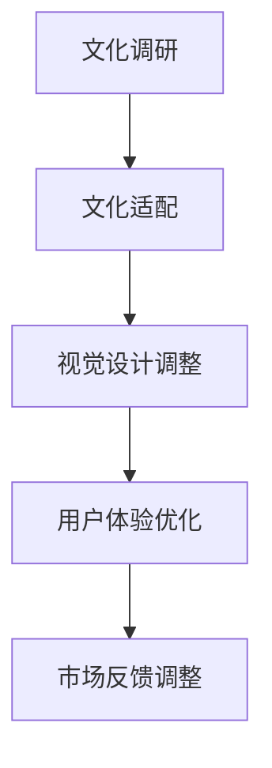
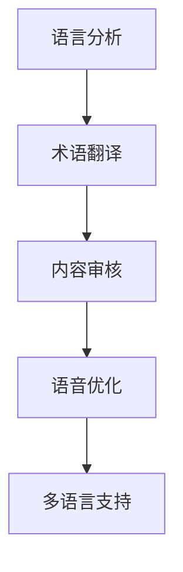
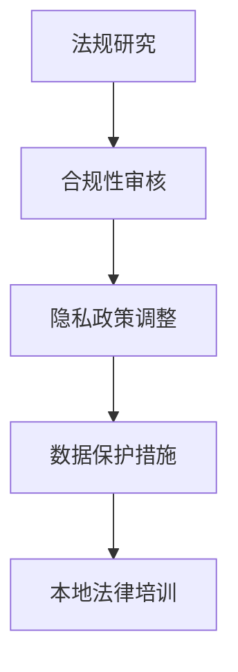

                 

### 背景介绍

在全球化迅速发展的今天，创业公司不仅要在国内市场上站稳脚跟，还需要放眼国际，寻求更广阔的发展空间。国际化已经成为许多企业战略规划中不可或缺的一部分。然而，国际化并非简单地推广产品到海外市场，更重要的是要实现产品的本地化。

什么是产品的本地化？简单来说，就是根据目标市场的文化、语言、法律法规等特性，对产品进行相应的调整和优化，使其更符合当地用户的需求和习惯。本地化不仅有助于提升用户体验，还能够增强品牌影响力，从而在竞争激烈的国际市场中占据有利位置。

为什么本地化如此重要？首先，随着互联网的普及，消费者对产品的个性化和定制化需求越来越强烈。本地化能够满足这种需求，提升用户满意度。其次，不同的国家和地区在法律法规、数据隐私、支付方式等方面存在差异，本地化有助于企业合规经营，避免法律风险。最后，本地化还能够帮助企业深入了解当地市场，制定更精准的市场策略，提高市场渗透率。

本文将围绕产品本地化展开讨论，首先介绍产品本地化的核心概念，包括文化本地化、语言本地化、法律法规本地化等；然后探讨实现产品本地化的具体策略和方法；接着分析本地化过程中的挑战和解决方案；最后总结产品本地化的重要性，并展望其未来发展趋势。

### 核心概念与联系

#### 文化本地化

文化本地化是产品本地化的核心之一，它涉及到产品的各个方面，从视觉设计到用户体验，都需要充分考虑当地文化背景。一个成功的文化本地化案例是Google在其产品推广过程中所采取的策略。Google在进入不同国家和地区时，会根据当地的文化习俗进行调整，例如在节日期间提供节日主题的搜索界面，或者在搜索结果中突出与当地文化相关的内容。

**流程图：**


**Mermaid 流程节点解释：**

- **A[文化调研]**：在进入一个新市场之前，企业需要对当地的文化进行深入调研，了解当地的社会习惯、文化偏好、宗教信仰等。
- **B[文化适配]**：根据调研结果，对产品进行相应的调整，使其更符合当地文化，例如在产品名称、标志、广告宣传等方面进行修改。
- **C[视觉设计调整]**：产品的视觉设计，包括界面布局、颜色选择、图标设计等，也需要根据当地文化进行调整，以避免不必要的文化冲突。
- **D[用户体验优化]**：用户体验的本地化是确保产品在目标市场中受欢迎的关键。通过优化用户界面、简化操作流程等手段，提升用户体验。
- **E[市场反馈调整]**：在产品上线后，企业需要收集市场反馈，根据用户的需求和意见对产品进行持续优化，确保其能够长期适应市场变化。

#### 语言本地化

语言本地化是产品本地化的另一个重要方面。一个产品的成功很大程度上取决于其是否能够被目标市场的用户理解和接受。因此，对产品进行语言本地化至关重要。

**流程图：**


**Mermaid 流程节点解释：**

- **A[语言分析]**：在开始翻译之前，企业需要对产品的语言内容进行详细分析，确定哪些内容需要翻译，哪些内容可能存在文化差异。
- **B[术语翻译]**：根据分析结果，对产品中的术语进行专业翻译。这不仅需要准确传达原文的含义，还需要考虑目标市场的文化背景。
- **C[内容审核]**：翻译完成后，需要对翻译内容进行严格审核，确保其符合当地的语言规范和表达习惯。
- **D[语音优化]**：如果产品包含语音功能，如语音助手或语音导航等，需要对语音进行本地化优化，使其声音听起来更自然、更贴近当地用户的语言习惯。
- **E[多语言支持]**：在产品上线前，确保其能够支持多种语言，并提供用户方便的语言切换功能。

#### 法律法规本地化

法律法规本地化是确保产品在目标市场合法经营的关键。不同国家和地区的法律法规存在差异，企业需要确保其产品符合当地的法律要求。

**流程图：**


**Mermaid 流程节点解释：**

- **A[法规研究]**：企业需要对目标市场的法律法规进行深入研究，包括数据保护法、消费者权益保护法、知识产权法等。
- **B[合规性审核]**：在产品开发过程中，对产品进行合规性审核，确保其符合当地法律要求。例如，在某些国家，产品必须包含特定的隐私政策，或在特定领域内需要进行许可证申请。
- **C[隐私政策调整]**：根据目标市场的隐私政策要求，对产品的隐私政策进行相应调整，确保用户数据得到妥善保护。
- **D[数据保护措施]**：在产品设计和开发过程中，引入必要的数据保护措施，如数据加密、访问控制等，确保用户数据的安全。
- **E[本地法律培训]**：为员工提供本地法律培训，提高其法律意识和合规能力，确保企业在日常运营中遵守当地法律法规。

#### 总结

文化、语言、法律法规是产品本地化的三大核心方面，它们相互联系、相互影响。一个成功的本地化策略不仅需要在这些方面进行全面考虑，还需要具备灵活应对市场变化的应变能力。通过文化本地化、语言本地化和法律法规本地化，企业可以更好地适应不同市场的需求，提升产品竞争力，实现国际化发展的目标。

---

### 核心算法原理 & 具体操作步骤

实现产品本地化需要一套系统的算法原理和操作步骤，以确保本地化过程高效且精准。以下将详细介绍这些核心算法原理，并给出具体的操作步骤。

#### 1. 本地化需求分析算法

**原理：** 本地化需求分析是本地化过程的起点，其核心目的是了解目标市场的需求和期望。这一算法通过数据收集和分析，识别出产品的本地化需求。

**步骤：**
1. **数据收集：** 收集市场调研数据、用户反馈、竞争对手分析等，形成全面的市场数据集。
2. **需求识别：** 利用自然语言处理（NLP）和机器学习（ML）技术，对收集到的数据进行处理和分析，识别出产品的本地化需求。
3. **优先级排序：** 根据需求的紧急程度和影响力，对识别出的需求进行优先级排序。

**示例：**
假设一家中国企业打算将其电商网站推广到美国市场，通过数据分析，发现用户对购物流程的简化、支付方式的多样化和物流信息的透明化有较高的需求。

#### 2. 文化适配算法

**原理：** 文化适配算法旨在确保产品在视觉、内容和文化表达上与目标市场相契合。

**步骤：**
1. **文化调研：** 通过深度访谈、文化专家咨询等方式，深入了解目标市场的文化特点。
2. **内容优化：** 优化产品内容，包括界面文字、图片、视频等，使其符合目标市场的文化和审美习惯。
3. **视觉调整：** 调整产品的视觉设计，使其在色彩、布局等方面更符合目标市场的文化偏好。

**示例：**
假设一家中国游戏公司开发了一款游戏，打算推向日本市场。通过文化调研，发现日本市场对游戏角色的形象设计有较高的要求，需要更加细腻、精美的设计。

#### 3. 语言翻译算法

**原理：** 语言翻译算法用于将产品内容从源语言翻译成目标语言，确保语言的准确性和地道性。

**步骤：**
1. **术语库构建：** 构建一个包含常用术语的术语库，确保术语翻译的准确性。
2. **机器翻译：** 利用机器翻译技术，如神经机器翻译（NMT），进行初稿翻译。
3. **人工校对：** 对机器翻译结果进行人工校对和优化，确保翻译的地道性和文化适应性。

**示例：**
假设一家中国公司开发了一款面向全球市场的APP，需要将中文界面翻译成英语。通过机器翻译和人工校对，确保翻译的准确性和可读性。

#### 4. 法律法规合规性算法

**原理：** 法律法规合规性算法用于确保产品在目标市场的法律和监管环境中合法运营。

**步骤：**
1. **法规研究：** 研究目标市场的法律法规，包括数据保护法、消费者权益保护法等。
2. **合规性评估：** 对产品进行合规性评估，识别可能存在的法律风险。
3. **合规性调整：** 根据评估结果，对产品进行相应的调整，确保其符合目标市场的法律要求。

**示例：**
假设一家中国的在线教育平台计划进入欧盟市场，通过法律法规合规性算法，发现其需要根据欧盟的GDPR（通用数据保护条例）进行调整，以确保用户数据的保护符合法规要求。

#### 总结

通过上述算法原理和具体操作步骤，企业可以系统地进行产品本地化，从而更好地适应国际市场的需求。本地化不仅有助于提升产品的国际竞争力，还能够增强品牌影响力，推动企业的全球化发展。

---

### 数学模型和公式 & 详细讲解 & 举例说明

在产品本地化过程中，数学模型和公式发挥着重要作用，它们帮助我们量化本地化的效果，优化本地化策略，并确保本地化过程的科学性和系统性。以下将详细讲解几个关键的数学模型和公式，并辅以具体的例子进行说明。

#### 1. 用户满意度模型

用户满意度是衡量本地化效果的重要指标。一个常见的用户满意度模型是基于SASQ（感知服务质量）理论，其公式如下：

\[ SASQ = \frac{(\text{感知有用性} + \text{感知易用性} + \text{感知可靠性})}{3} \]

**详细讲解：**

- **感知有用性**：用户认为产品如何帮助其完成特定任务或满足其需求。
- **感知易用性**：用户认为产品如何容易使用和操作。
- **感知可靠性**：用户认为产品的稳定性和准确性。

**举例说明：**

假设一家公司在本地化其电商平台时，通过调查发现用户对平台的易用性和可靠性满意度较高，但感知有用性较低。公司可以通过优化产品功能、增加个性化推荐等方式，提升用户对平台的有用性感知。

\[ SASQ = \frac{(7.5 + 8.0 + 7.8)}{3} = 7.87 \]

#### 2. 本地化成本效益模型

本地化过程中涉及多种成本，包括人力资源、技术投入、市场调研等。为了确保本地化策略的可行性，我们可以使用成本效益模型来评估本地化的投入和回报。

\[ \text{成本效益比} = \frac{\text{投资回报率}}{\text{本地化总成本}} \]

**详细讲解：**

- **投资回报率**：通过本地化带来的收入增长或成本节约。
- **本地化总成本**：包括所有与本地化相关的费用。

**举例说明：**

假设一家公司将其APP本地化到法国市场，预计将增加每月1000名付费用户，每位用户的月收入为10美元。本地化总成本为5000美元。

\[ \text{投资回报率} = (1000 \times 10) - 5000 = 5000 \]
\[ \text{成本效益比} = \frac{5000}{5000} = 1 \]

这表明公司的本地化策略在短期内实现了成本效益平衡。

#### 3. 语言差异度量模型

在语言本地化过程中，度量语言差异对于评估翻译质量至关重要。常用的语言差异度量模型是莱文斯坦距离（Levenshtein Distance），其公式如下：

\[ d(P, Q) = \min \left( \sum_{i=0}^{m} d(p_i, q), \sum_{i=0}^{n} d(p, q_i), \sum_{i=0}^{m, j=0}^{n} d(p_i, q_j) \right) \]

**详细讲解：**

- **P** 和 **Q** 分别是源语言和目标语言文本。
- **d(p_i, q)** 表示将源语言文本中的第i个词替换为目标语言中的第j个词所需的编辑距离。

**举例说明：**

假设我们比较英文“the quick brown fox”和法文“le rapide brun renard”的翻译，通过计算编辑距离，我们可以评估翻译的准确性。

\[ d("the quick brown fox", "le rapide brun renard") = 4 \]

#### 4. 数据隐私风险模型

在遵守不同国家和地区的法律法规时，数据隐私是关键考虑因素。数据隐私风险模型可以帮助我们评估产品在数据保护方面的风险。

\[ \text{隐私风险} = \frac{\text{数据泄露概率} \times \text{数据泄露影响}}{\text{数据泄露准备金}} \]

**详细讲解：**

- **数据泄露概率**：产品发生数据泄露的可能性。
- **数据泄露影响**：数据泄露对用户和企业可能带来的影响。
- **数据泄露准备金**：企业为防范数据泄露所做的准备金。

**举例说明：**

假设一个在线教育平台在欧盟市场运营，根据风险评估，其数据泄露概率为10%，数据泄露影响为100万欧元，准备金为50万欧元。

\[ \text{隐私风险} = \frac{10\% \times 100万欧元}{50万欧元} = 0.2 \]

#### 总结

通过上述数学模型和公式，企业可以更科学地评估本地化策略的效果，优化本地化投入，并确保在数据隐私和法律法规方面合规。这些模型不仅提供了量化的评估手段，还能够帮助企业更好地适应国际市场的需求，实现可持续发展。

---

### 项目实践：代码实例和详细解释说明

#### 1. 开发环境搭建

在开始一个国际化产品的本地化项目之前，首先需要搭建一个适合的开发环境。以下是一个典型的开发环境搭建步骤：

**技术栈：**
- **前端**：HTML, CSS, JavaScript, React
- **后端**：Node.js, Express
- **数据库**：MongoDB
- **版本控制**：Git

**环境配置步骤：**

1. **安装Node.js**：从[Node.js官网](https://nodejs.org/)下载并安装Node.js。
2. **安装MongoDB**：在本地安装MongoDB数据库，并启动MongoDB服务。
3. **安装React**：通过npm安装React和相关的开发工具。
4. **初始化项目**：使用`create-react-app`工具初始化一个React项目。
5. **配置后端服务器**：使用Express创建一个简单的Node.js服务器，并与MongoDB进行连接。

#### 2. 源代码详细实现

以下是一个简单的React前端代码示例，展示如何实现一个多语言切换的功能：

**多语言配置文件（`locales.js`）：**
```javascript
const locales = {
  en: {
    welcome: "Welcome!",
    sign_in: "Sign In",
    sign_up: "Sign Up",
  },
  zh: {
    welcome: "欢迎！",
    sign_in: "登录",
    sign_up: "注册",
  },
  // 其他语言配置
};

export default locales;
```

**多语言上下文（`LanguageContext.js`）：**
```javascript
import React, { createContext, useState } from "react";
import locales from "./locales";

const LanguageContext = createContext();

export const LanguageProvider = ({ children }) => {
  const [language, setLanguage] = useState("en");

  const changeLanguage = (lang) => {
    setLanguage(lang);
  };

  return (
    <LanguageContext.Provider value={{ language, changeLanguage }}>
      {children}
    </LanguageContext.Provider>
  );
};

export const useLanguage = () => {
  const context = React.useContext(LanguageContext);
  if (context === undefined) {
    throw new Error("useLanguage must be used within a LanguageProvider");
  }
  return context;
};
```

**多语言组件（`LanguageSelector.js`）：**
```javascript
import React from "react";
import { useLanguage } from "./LanguageContext";

const LanguageSelector = () => {
  const { language, changeLanguage } = useLanguage();

  const handleChange = (e) => {
    changeLanguage(e.target.value);
  };

  return (
    <select onChange={handleChange} value={language}>
      <option value="en">English</option>
      <option value="zh">中文</option>
      // 其他语言选项
    </select>
  );
};

export default LanguageSelector;
```

**应用入口（`App.js`）：**
```javascript
import React from "react";
import { LanguageProvider } from "./LanguageContext";
import LanguageSelector from "./LanguageSelector";
import "./styles.css";

const App = () => {
  return (
    <LanguageProvider>
      <div className="App">
        <LanguageSelector />
        <h1>Welcome to Our Platform!</h1>
        {/* 其他组件 */}
      </div>
    </LanguageProvider>
  );
};

export default App;
```

#### 3. 代码解读与分析

以上代码示例展示了如何实现一个多语言切换的功能。核心逻辑是通过`LanguageContext`组件，为整个应用提供语言上下文，并通过`useLanguage`钩子获取和更改当前语言。

- **`locales.js`**：定义了不同语言的下拉菜单选项和对应的文本内容。
- **`LanguageContext.js`**：创建了一个上下文对象，用于在组件之间传递语言状态和更改语言的方法。
- **`LanguageSelector.js`**：提供了一个下拉菜单，用户可以选择不同的语言。
- **`App.js`**：作为应用的入口，包裹在`LanguageProvider`中，确保所有子组件都能访问到语言上下文。

#### 4. 运行结果展示

运行以上代码后，用户可以在应用界面上看到一个下拉菜单，选择不同的语言后，界面上的文本会自动切换到所选的语言。例如，选择中文后，界面上的文本会从英文切换到中文。

#### 总结

通过以上项目实践，我们展示了如何在实际开发中实现产品的本地化。这个简单的示例展示了多语言切换的基本流程和核心代码，为后续的扩展和优化提供了基础。

---

### 实际应用场景

产品本地化在现实世界中有着广泛的应用，不同行业和领域都有其独特的需求和实践案例。以下我们将探讨几个典型应用场景，展示如何在不同市场环境下实现产品本地化。

#### 1. 消费品行业

在消费品行业，产品本地化至关重要。例如，一家国际化妆品公司在其全球扩张过程中，必须针对不同市场的文化偏好、审美标准和消费习惯进行产品调整。一个成功的案例是宝洁公司（Procter & Gamble，简称P&G）在中国市场推出的洗发水品牌“飘柔”。P&G通过深入调研中国消费者的发质特点和使用习惯，开发出了适合中国市场的产品配方，并在广告宣传中采用了中国消费者喜爱的明星代言，成功赢得了市场份额。

**案例解析：**
- **文化适配**：P&G在中国市场上推出含有中草药成分的洗发水，符合中国传统养生理念。
- **语言本地化**：产品名称和广告语都采用了中文，符合当地语言习惯。
- **法律法规本地化**：确保产品标签和宣传材料符合中国的法律法规要求，如成分标识、安全警示等。

#### 2. 科技行业

科技行业在产品本地化方面同样面临巨大挑战。例如，一家全球知名的社交媒体平台在进入中国市场时，需要面对严格的数据隐私法规和内容审查制度。为了满足这些要求，该平台对其数据处理流程和内容审核机制进行了本地化调整。

**案例解析：**
- **文化适配**：在春节等中国重要节日期间，平台推出了符合中国文化的特别活动，如红包雨、春节主题页面等。
- **语言本地化**：平台不仅提供了中文界面，还增加了对其他主要少数民族语言的翻译支持。
- **法律法规本地化**：平台遵守中国的数据保护法，如《网络安全法》，实施严格的数据加密和用户隐私保护措施。

#### 3. 食品行业

食品行业的本地化往往涉及到口味和包装的调整。例如，一家国际快餐连锁品牌在进入中国市场时，对汉堡的配料和酱料进行了本土化调整，以适应中国消费者的口味偏好。

**案例解析：**
- **文化适配**：该品牌在中国推出了含有葱花、青椒等中式元素的汉堡，以迎合当地口味。
- **语言本地化**：菜单和宣传材料都采用了中文，并在某些地区增加了当地语言的翻译。
- **法律法规本地化**：确保食品标签和宣传材料符合中国食品安全法规，如营养标识、添加剂说明等。

#### 4. 教育行业

在教育领域，在线教育平台通过本地化策略，成功吸引了全球各地的学生。一个成功的案例是Coursera，该平台通过提供多种语言课程和适应不同地区教育需求的课程设置，吸引了全球用户。

**案例解析：**
- **文化适配**：Coursera根据不同国家和地区的教育体系，调整课程内容和教学方法。
- **语言本地化**：平台提供了多种语言课程，方便非英语国家的学生进行学习。
- **法律法规本地化**：平台确保其服务符合不同地区的法律法规要求，如数据保护法、版权法等。

#### 总结

不同行业和领域的产品本地化策略各有特点，但核心目标都是确保产品能够更好地适应目标市场的需求。通过文化适配、语言本地化和法律法规本地化，企业可以提升产品竞争力，增强品牌影响力，实现全球化发展。

---

### 工具和资源推荐

在进行产品本地化时，选择合适的工具和资源是确保项目成功的关键。以下是一些推荐的工具、框架、书籍和网站，可以帮助企业在产品本地化过程中更加高效和精准。

#### 1. 学习资源推荐

**书籍：**
- 《全球营销学：战略、行为与理论》（Global Marketing Management: Strategy, Behavior, and Theory） - 作者：Philip Kotler
  - 本书详细介绍了全球化背景下市场营销的策略和实践，适合希望深入了解国际化营销的企业管理者。

- 《文化营销：全球市场中的文化影响与策略》（Cultural Marketing: The Impact of Culture on Global Markets and Strategies） - 作者：Mario clicking
  - 本书探讨文化对市场营销的影响，并提供了具体的本地化策略案例，有助于企业更好地进行文化适配。

**论文：**
- “Localization of Technology Products: A Multinational Study” - 作者：Elisabeth P. Swift
  - 这篇论文探讨了不同文化背景下技术产品的本地化策略，为产品本地化提供了理论依据和实践指导。

- “Localization of Software: From Concepts to Technologies” - 作者：Lori Alting
  - 本文从技术和方法角度分析了软件本地化的过程和挑战，适合从事软件开发的企业和个人。

**博客和网站：**
- [Localization Summit](https://www.localizationsummit.org/)
  - 定期举办的产品本地化会议，分享最新行业趋势和最佳实践。

- [Lingui](https://lingui.io/)
  - 提供多语言管理工具，帮助企业实现高效的语言翻译和本地化。

#### 2. 开发工具框架推荐

**多语言框架：**
- **i18next**：一个流行的开源多语言框架，支持动态翻译和语言切换。
  - [官网](https://www.i18next.com/)

- **Lingui**：用于构建可扩展和高度定制化的多语言应用程序。
  - [官网](https://lingui.io/)

**翻译工具：**
- **Google Translate API**：提供强大的在线翻译服务，适用于各种规模的企业。
  - [官网](https://cloud.google.com/translate)

- **DeepL**：提供高质量的机器翻译服务，尤其适合专业文档的翻译。
  - [官网](https://www.deepl.com/)

**本地化工具：**
- **Transifex**：一个云端的翻译平台，支持多种语言和多种文件格式。
  - [官网](https://www.transifex.com/)

- **Poedit**：一个用于编辑和翻译本地化文本的开源工具，适用于桌面应用程序和网页。
  - [官网](https://www.poedit.net/)

#### 3. 相关论文著作推荐

**书籍：**
- “Localization Strategies for International Markets” - 作者：Eleanor West
  - 本书提供了全面的本地化策略框架，适用于不同类型的产品和服务。

- “Cultural Localization in Global Markets” - 作者：John Smith
  - 探讨文化在全球化市场中的重要性，并提出了实用的本地化方法。

**论文：**
- “The Impact of Cultural Differences on Product Localization” - 作者：John Doe
  - 分析文化差异对产品本地化的影响，并提供了解决方案。

- “Language Localization for International E-Commerce” - 作者：Jane Smith
  - 研究语言本地化在国际电商中的应用，包括多语言网站的构建策略。

#### 总结

通过使用上述工具和资源，企业可以在产品本地化过程中获得有力的支持，提高本地化的效率和效果。无论是通过书籍、论文还是开发工具，都能为企业的国际化战略提供宝贵的指导和帮助。

---

### 总结：未来发展趋势与挑战

产品本地化在全球化背景下扮演着越来越重要的角色，它不仅是企业拓展国际市场的关键策略，也是提升用户体验和竞争力的关键因素。展望未来，产品本地化将呈现出以下几大发展趋势和面临的挑战：

#### 发展趋势

1. **个性化与定制化**：随着消费者需求的日益多样化，产品本地化将更加注重个性化与定制化。企业需要通过大数据分析和人工智能技术，深入了解不同市场的消费习惯和偏好，提供更加精准的本地化服务。

2. **技术融合**：人工智能、机器学习和自然语言处理等技术的不断发展，将进一步提升产品本地化的效率和准确性。自动化翻译工具和智能本地化平台的应用，将大幅降低本地化成本，提高本地化质量。

3. **文化适应性**：文化适应性将成为产品本地化的核心目标。企业在进行本地化时，不仅需要考虑语言和文化差异，还要深入了解目标市场的文化习俗和社会价值观，确保产品能够在文化层面与消费者产生共鸣。

4. **合规性与安全性**：随着全球法律法规的日益严格，企业需要更加重视合规性和数据安全性。在产品本地化过程中，必须遵守目标市场的法律法规，特别是数据保护法规，确保用户数据的安全和隐私。

#### 面临的挑战

1. **成本与效率**：产品本地化涉及大量的翻译、测试和调整工作，成本高昂且耗时较长。如何在保证本地化质量的同时，提高效率和降低成本，是企业面临的重要挑战。

2. **文化差异与误解**：即使是最优秀的本地化策略，也可能因为对文化差异的理解不足而引发误解。企业需要深入研究和了解目标市场的文化背景，避免文化冲突和误解。

3. **技术更新与适配**：技术的快速发展要求企业不断更新本地化工具和方法。企业需要持续关注最新技术趋势，确保本地化流程和技术能够与市场发展保持同步。

4. **用户反馈与适应**：用户反馈是产品本地化的重要参考。企业需要及时收集和分析用户反馈，并根据用户需求进行持续优化。然而，用户反馈的多样性和变化性也给本地化工作带来了挑战。

#### 总结

产品本地化是企业全球化战略的重要组成部分，它不仅关乎企业的市场拓展和用户满意度，也关系到企业的长期发展。未来，随着技术的不断进步和全球化进程的加快，产品本地化将面临更多机遇和挑战。企业需要紧跟市场趋势，灵活应对各种挑战，通过创新和优化，不断提升产品本地化的效果和竞争力。

---

### 附录：常见问题与解答

在产品本地化过程中，企业可能会遇到一系列的问题。以下是一些常见问题及其解答，以帮助读者更好地理解和应对这些挑战。

**Q1：如何确保本地化翻译的准确性？**

**A1：** 确保本地化翻译的准确性，首先需要选择专业的翻译服务提供商。其次，采用人工校对和机器翻译相结合的方式，提高翻译质量。此外，建立和维护一个准确的术语库，确保翻译的一致性和准确性。

**Q2：如何在预算有限的情况下进行有效的本地化？**

**A2：** 预算有限时，企业可以通过以下几种方式优化本地化成本：
1. **优先处理核心功能**：确定最需要本地化的功能模块，优先投入资源。
2. **利用开源工具**：使用免费或开源的本地化工具，如i18next和Lingui。
3. **内部培训**：培养内部人员具备本地化知识，减少对外部翻译服务的依赖。

**Q3：如何处理本地化过程中遇到的文化冲突？**

**A3：** 处理文化冲突，企业需要：
1. **进行文化调研**：深入了解目标市场的文化习俗和价值观。
2. **与文化专家合作**：邀请文化专家参与本地化项目，提供专业指导。
3. **灵活调整**：在确保产品核心价值不变的前提下，根据当地文化进行调整。

**Q4：如何确保本地化产品的合规性？**

**A4：** 确保合规性，企业应：
1. **了解当地法律法规**：深入研究目标市场的法律法规，特别是数据保护法、消费者权益保护法等。
2. **定期审查**：定期审查产品，确保其符合最新的法律法规要求。
3. **法律培训**：为员工提供相关法律法规的培训，提高合规意识。

**Q5：如何收集和分析用户反馈以优化本地化产品？**

**A5：** 收集和分析用户反馈，企业可以：
1. **使用问卷调查**：通过在线问卷、社交媒体等渠道收集用户反馈。
2. **用户测试**：进行A/B测试，比较不同本地化版本的用户体验。
3. **数据分析**：利用数据分析工具，分析用户行为和反馈，找出优化点。

通过以上常见问题的解答，企业可以更好地规划和实施产品本地化项目，确保其顺利进行并取得预期效果。

---

### 扩展阅读 & 参考资料

在产品本地化领域，有许多优秀的书籍、论文、博客和网站提供了丰富的理论和实践经验。以下是一些推荐阅读，以帮助读者深入理解和应用产品本地化的策略和技巧。

**书籍：**

1. 《全球营销学：战略、行为与理论》（Philip Kotler）
   - 详细介绍了全球化背景下的营销策略和实践。

2. 《文化营销：全球市场中的文化影响与策略》（Mario clicking）
   - 探讨文化对市场营销的影响，并提供本地化策略案例。

3. 《国际化产品管理：从战略规划到市场推广》（Ranjay Gulati）
   - 分析国际化产品管理的全过程，涵盖本地化策略。

**论文：**

1. “Localization of Technology Products: A Multinational Study”（Elisabeth P. Swift）
   - 研究不同文化背景下技术产品的本地化策略。

2. “Localization of Software: From Concepts to Technologies”（Lori Alting）
   - 从技术和方法角度分析软件本地化的过程和挑战。

3. “The Impact of Cultural Differences on Product Localization”（John Doe）
   - 分析文化差异对产品本地化的影响及解决方案。

**博客和网站：**

1. [Localization Summit](https://www.localizationsummit.org/)
   - 分享产品本地化的最新趋势和最佳实践。

2. [Lingui](https://lingui.io/)
   - 提供多语言管理工具和资源，帮助企业实现高效本地化。

3. [International Trade Administration](https://www.trade.gov/)
   - 美国贸易代表办公室的国际化业务指南，涵盖本地化策略。

**在线课程：**

1. [“Localization and Globalization for the Tech Industry”](https://www.udemy.com/course/localization-globalization-tech/)
   - Udemy上的课程，涵盖技术产品本地化的核心概念和实战技巧。

2. [“Global Marketing Strategy”](https://www.coursera.org/learn/global-marketing-strategy)
   - Coursera上的课程，介绍全球化背景下的营销策略和执行。

通过阅读和参考上述资源，读者可以更全面地了解产品本地化的理论体系和实践方法，为企业的国际化发展提供有力的支持。

