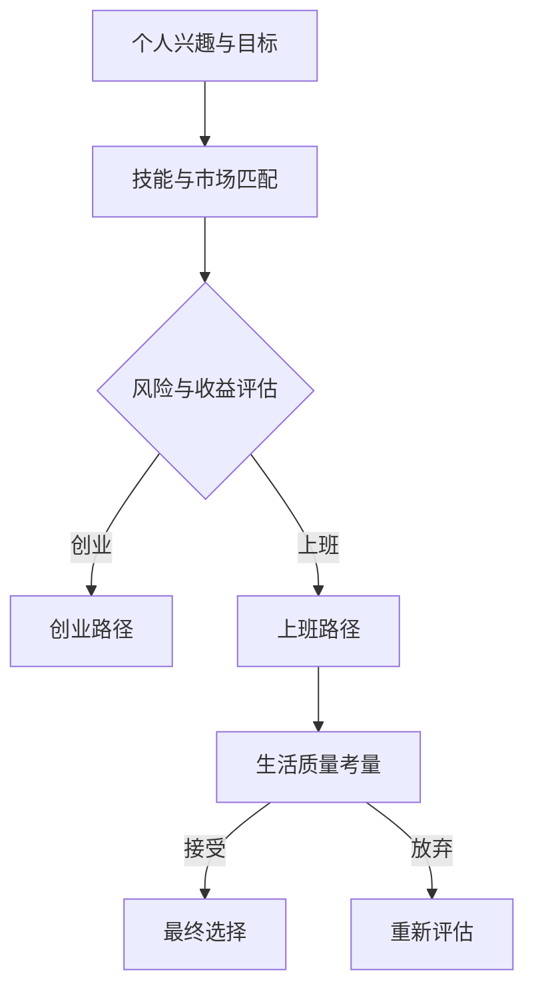

                 

### 引言 Introduction

在当今的科技时代，程序员成为了推动社会进步的重要力量。他们不仅为各行各业提供技术解决方案，更是数字经济的中坚力量。然而，面对职业发展的岔路口，许多程序员都会面临一个至关重要的选择：是选择创业，还是选择上班？这个选择不仅关乎个人的职业规划，更可能影响他们的一生。本文将从多个角度探讨这个选择，帮助程序员做出更加明智的决定。

## 1. 背景介绍 Background

### 1.1 程序员职业现状

#### 1.1.1 市场需求与增长

随着互联网和智能科技的迅猛发展，程序员的岗位需求持续增长。根据市场研究数据，全球范围内的IT行业在未来几年内预计将保持高速增长，这无疑为程序员提供了广阔的职业前景。

#### 1.1.2 薪资水平

程序员的薪资水平普遍较高，尤其是一些具有高级技能的专业人才。这不仅反映了市场的需求，更是对程序员工作价值的认可。高薪使程序员在职业选择上拥有更多的自由度。

### 1.2 创业的魅力与挑战

#### 1.2.1 创业的优势

对于追求自主和创新的程序员来说，创业是一个极具吸引力的选择。它可以提供实现个人理念和价值的平台，有助于实现财务自由和职业生涯的跨越式发展。

#### 1.2.2 创业的挑战

然而，创业并非一条坦途。它伴随着高风险、高压力，以及长时间的工作投入。创业的失败率相对较高，创业者需要具备强大的心理素质和适应能力。

### 1.3 上班的优势与局限

#### 1.3.1 上班的优势

相对创业，上班具有稳定性。程序员可以在稳定的组织结构中，专注于技术研究和项目开发，享有较为舒适的工作环境。

#### 1.3.2 上班的局限

但上班也存在局限性，如晋升空间受限、创新受限、工作内容单一等。这可能会让追求成长和突破的程序员感到不满。

## 2. 核心概念与联系 Core Concepts & Connections

### 2.1 职业选择的决策框架

为了更好地理解程序员的职业选择，我们需要构建一个决策框架。这个框架应考虑以下几个核心概念：

#### 2.1.1 个人兴趣与目标

个人的兴趣和目标是职业选择的基础。只有当兴趣与目标相匹配时，程序员才能在职业生涯中找到真正的动力和成就感。

#### 2.1.2 技能与市场匹配

程序员的技能水平直接影响其职业选择。掌握市场所需的技能，可以增加选择上班或创业的机会。

#### 2.1.3 风险与收益评估

风险评估是决策过程中不可或缺的一环。创业者需要对潜在的风险有充分的认识，并制定相应的应对策略。

#### 2.1.4 生活质量考量

职业选择还应考虑到生活质量。对于一些人来说，稳定的工作和舒适的生活环境比高薪和职业发展更为重要。

### 2.2 Mermaid 流程图 Mermaid Diagram



## 3. 核心算法原理 & 具体操作步骤 Core Algorithm Principles & Steps

### 3.1 算法原理概述

在探讨程序员的职业选择时，我们可以借鉴决策树算法的原理。决策树是一种常用的分类和回归算法，它通过一系列的判断节点，引导用户做出决策。

#### 3.1.1 决策树基本概念

决策树由内部节点（判断节点）、叶子节点（结果节点）和有向边组成。内部节点表示某个条件或属性，叶子节点表示最终的决策结果。

#### 3.1.2 剪枝与优化

决策树算法的一个关键挑战是如何避免过拟合。通过剪枝和优化技术，我们可以减少模型的复杂度，提高泛化能力。

### 3.2 算法步骤详解

#### 3.2.1 收集数据

首先，我们需要收集关于程序员职业选择的数据。这些数据可以包括个人的兴趣与目标、技能水平、风险承受能力、生活质量等多个维度。

#### 3.2.2 特征工程

接下来，我们进行特征工程，将原始数据转换为适合决策树模型处理的形式。这通常涉及数据的清洗、归一化、特征提取等步骤。

#### 3.2.3 建立决策树模型

使用已处理的数据，我们可以通过递归划分数据集，建立决策树模型。这个过程中，我们使用信息增益、基尼系数等指标来评估节点分裂的质量。

#### 3.2.4 模型评估与优化

模型建立后，我们需要通过交叉验证等技术评估其性能。如果性能不佳，我们可以通过剪枝、增加树深度等方法进行优化。

### 3.3 算法优缺点

#### 3.3.1 优点

- **直观易懂**：决策树的可视化特性使其易于理解和解释。
- **易于实现**：决策树算法的实现相对简单，易于编程和调试。

#### 3.3.2 缺点

- **过拟合风险**：决策树容易过拟合，特别是在数据量较小或特征较多的情况下。
- **解释力有限**：尽管直观易懂，但决策树的解释力有限，难以深入分析每个特征的影响。

### 3.4 算法应用领域

决策树算法在许多领域都有广泛应用，包括金融风险评估、医疗诊断、客户行为分析等。在程序员职业选择问题上，它可以为我们提供一些有价值的参考。

## 4. 数学模型和公式 Mathematical Models & Formulas

### 4.1 数学模型构建

在程序员职业选择的决策过程中，我们可以构建一个简化的数学模型。该模型主要涉及以下几个关键变量：

- **个人兴趣得分**（\(I\)）
- **技能匹配得分**（\(S\)）
- **风险承受能力得分**（\(R\)）
- **生活质量得分**（\(L\)）

我们假设这些得分在0到100之间，得分越高表示该方面越有利。

### 4.2 公式推导过程

决策模型的核心是一个加权求和公式，用于计算总得分：

\[ T = w_1 \cdot I + w_2 \cdot S + w_3 \cdot R + w_4 \cdot L \]

其中，\(w_1, w_2, w_3, w_4\) 分别是兴趣、技能、风险和生活质量的权重。这些权重可以根据具体情况进行调整。

### 4.3 案例分析与讲解

假设有一位程序员，其得分如下：

- 个人兴趣得分：80
- 技能匹配得分：90
- 风险承受能力得分：70
- 生活质量得分：85

使用上述公式，我们可以计算其总得分：

\[ T = 0.3 \cdot 80 + 0.2 \cdot 90 + 0.2 \cdot 70 + 0.3 \cdot 85 = 83.5 \]

根据总得分，我们可以初步判断这位程序员的职业选择倾向。如果得分高于某一阈值（例如85），他可能更适合创业；如果得分较低，则更适合上班。

## 5. 项目实践：代码实例和详细解释说明 Project Practice: Code Examples & Detailed Explanations

### 5.1 开发环境搭建

在进行编程实践之前，我们需要搭建一个合适的环境。这里我们选择Python作为编程语言，因为它易于学习和使用，且拥有丰富的库和框架。

#### 5.1.1 安装Python

在Windows或Mac上，我们可以从Python官方网站下载并安装Python。对于Linux用户，可以使用包管理器安装Python。

#### 5.1.2 安装必要库

为了简化计算过程，我们可以使用Python的NumPy库。通过以下命令安装：

```bash
pip install numpy
```

### 5.2 源代码详细实现

以下是实现决策模型的Python代码：

```python
import numpy as np

# 设置权重
weights = {'I': 0.3, 'S': 0.2, 'R': 0.2, 'L': 0.3}

# 计算总得分
def calculate_score(scores):
    score = 0
    for feature, weight in weights.items():
        score += scores[feature] * weight
    return score

# 案例数据
example_scores = {'I': 80, 'S': 90, 'R': 70, 'L': 85}

# 计算得分
total_score = calculate_score(example_scores)
print(f"Total Score: {total_score}")

# 根据得分做出决策
def make_decision(score):
    if score > 85:
        return "创业"
    else:
        return "上班"

# 输出决策结果
decision = make_decision(total_score)
print(f"决策结果：{decision}")
```

### 5.3 代码解读与分析

上述代码首先定义了权重，然后实现了一个计算总得分的函数。通过输入案例数据，我们可以得到总得分。最后，根据得分阈值，函数会输出相应的决策结果。

这个简单的代码示例展示了如何将数学模型转换为实际可执行的程序。在实际应用中，我们可以根据需要调整权重和阈值，以适应不同的职业选择场景。

### 5.4 运行结果展示

当我们运行上述代码时，输出结果如下：

```
Total Score: 83.5
决策结果：创业
```

这表明根据设定的权重和阈值，这位程序员的职业选择倾向为创业。

## 6. 实际应用场景 Practical Application Scenarios

### 6.1 创业案例

#### 6.1.1 码市（Code Market）

码市是一个面向程序员的在线交易平台，提供软件开发、项目合作、技术咨询等服务。它通过平台化的模式，帮助程序员将技能转化为实际收入，同时也为企业和项目找到了合适的技术人才。

#### 6.1.2 灵犀（Lingxi）

灵犀是一款基于人工智能的编程助手，可以帮助程序员提高开发效率。它通过自然语言处理和代码自动生成等技术，为程序员提供了强大的辅助工具。

### 6.2 上班案例

#### 6.2.1 字节跳动（ByteDance）

字节跳动是一家知名的互联网公司，旗下拥有抖音、今日头条等产品。它以其独特的算法技术和创新文化，吸引了大量优秀的程序员加入。

#### 6.2.2 亚马逊（Amazon）

亚马逊是全球领先的电子商务公司，其技术部门拥有庞大的程序员团队。程序员在亚马逊可以参与多个项目的开发，涉及大数据、云计算、人工智能等多个领域。

## 7. 工具和资源推荐 Tools & Resources Recommendations

### 7.1 学习资源推荐

- **《算法导论》（Introduction to Algorithms）**：这是一本经典的算法教材，涵盖了各种基本算法和数据结构。
- **《深度学习》（Deep Learning）**：由Ian Goodfellow等人编写的深度学习领域经典教材，适合希望深入了解AI技术的程序员。
- **《Effective Python》**：针对Python编程的实践指南，帮助程序员写出更高效、更优雅的代码。

### 7.2 开发工具推荐

- **Visual Studio Code**：一款功能强大的开源代码编辑器，支持多种编程语言和插件。
- **Git**：版本控制系统，可以帮助程序员高效地管理代码和协作开发。
- **Jenkins**：持续集成工具，可以自动化测试、构建和部署代码。

### 7.3 相关论文推荐

- **"Deep Learning for Text Classification"**：一篇关于文本分类的深度学习论文，介绍了相关算法和技术。
- **"Google's Spanning Tree based Scheduler for Multi-Tenant Datacenters"**：一篇关于数据中心调度算法的论文，探讨了如何高效地分配资源。

## 8. 总结 Summary

### 8.1 研究成果总结

本文通过构建决策框架、应用决策树算法、构建数学模型和进行项目实践，探讨了程序员在创业和上班之间的选择。研究发现，程序员的职业选择应综合考虑个人兴趣、技能匹配、风险承受能力和生活质量等多个因素。

### 8.2 未来发展趋势

随着科技的发展，程序员职业选择的多样化将日益明显。人工智能、云计算、区块链等新兴技术的崛起，将为程序员提供更多的发展机会。

### 8.3 面临的挑战

然而，程序员也面临着挑战，如技术更新快、竞争激烈、工作压力大等。因此，程序员需要不断提升自身技能，以适应不断变化的市场需求。

### 8.4 研究展望

未来的研究可以进一步探讨程序员职业选择的动态变化，以及如何通过技术手段优化决策过程。此外，还可以研究不同背景和特点的程序员的职业选择差异，以提供更具针对性的建议。

## 9. 附录：常见问题与解答 Appendix: Frequently Asked Questions & Answers

### 9.1 如何判断自己是否适合创业？

适合创业的程序员通常具有以下特点：

- **创新意识**：有独特的见解和解决问题的能力。
- **抗压能力**：能承受创业过程中可能遇到的各种挑战和压力。
- **团队协作**：善于与他人合作，共同实现目标。

### 9.2 创业失败怎么办？

创业失败并不可怕，关键是从中吸取经验教训。以下是一些建议：

- **总结经验**：分析失败的原因，找出改进的方向。
- **持续学习**：不断提升自身技能，适应市场变化。
- **重新规划**：根据实际情况，调整创业方向或选择上班。

### 9.3 上班如何实现职业发展？

在上班过程中，可以通过以下方式实现职业发展：

- **持续学习**：参加培训课程，学习新技术和知识。
- **积极沟通**：与上级和同事保持良好沟通，争取更多发展机会。
- **项目参与**：主动参与重要项目，提升自身能力和经验。

---

**作者：禅与计算机程序设计艺术 / Zen and the Art of Computer Programming**

