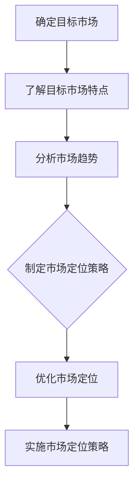
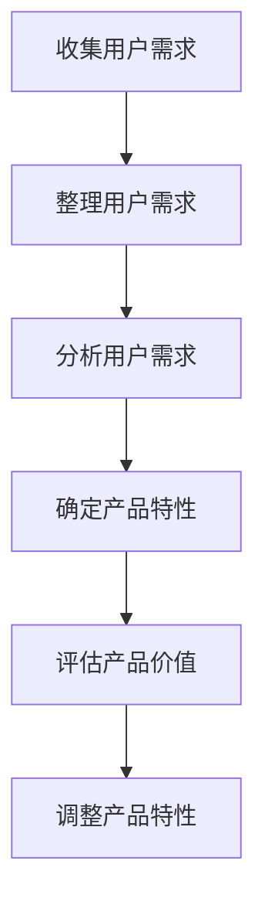
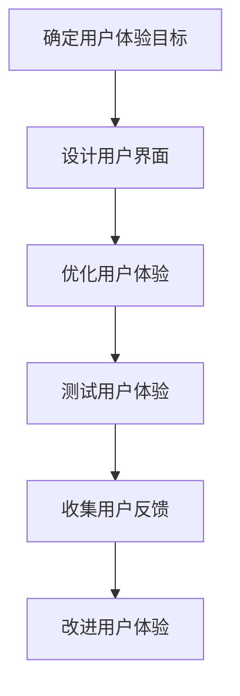
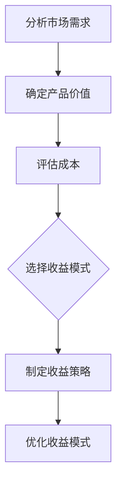
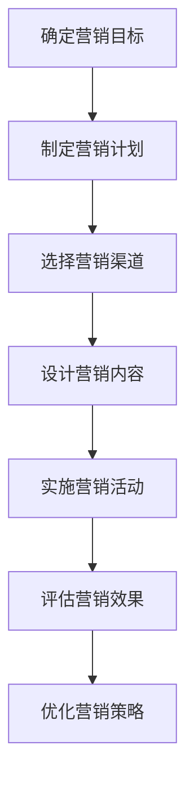
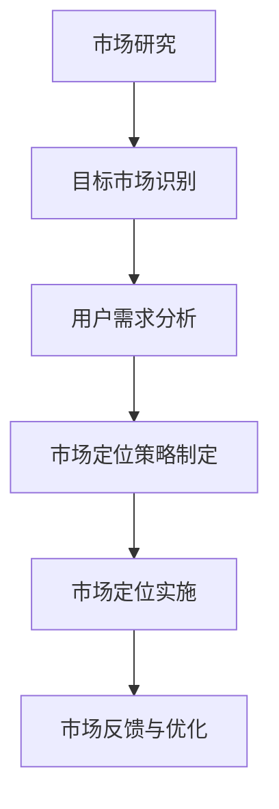
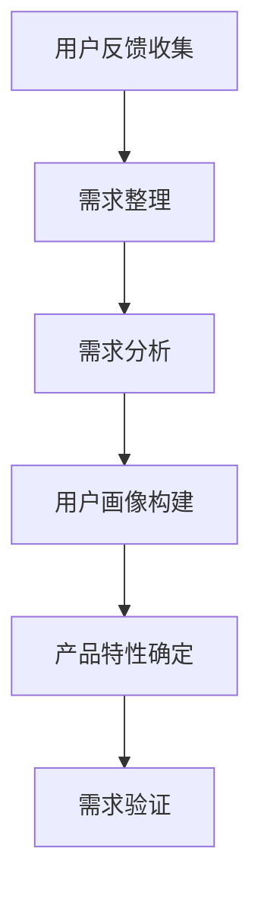
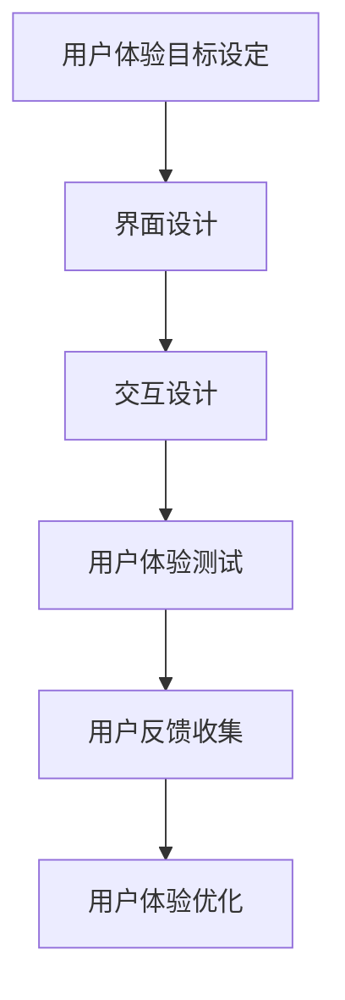
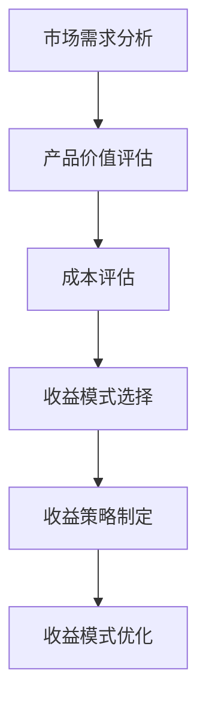
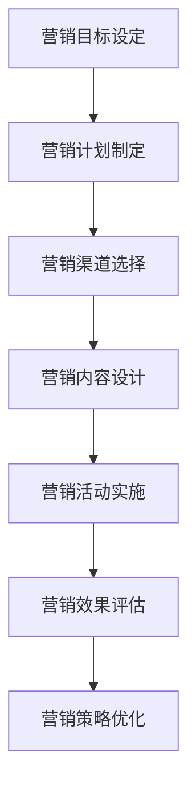

                 

### 文章标题

**创建和销售数字产品的策略**

> **关键词：** 数字产品、市场策略、用户体验、收益模式、营销推广  
> **摘要：** 本文将深入探讨如何创建具有竞争力的数字产品，并制定有效的销售策略，以提高市场占有率和收益。

在当今数字化时代，数字产品的创建和销售已经成为众多企业和个人追求的重要目标。然而，如何在这个竞争激烈的市场中脱颖而出，不仅需要优秀的产品设计，还需要一套完善的销售策略。本文将围绕这一主题，提供一系列的策略和建议，帮助您成功创建和销售数字产品。

### 1. 背景介绍

数字产品是指以电子形式提供的商品或服务，例如应用程序、在线课程、电子书、音乐和视频等。随着互联网的普及和技术的进步，数字产品的市场需求不断增长，成为商业领域的一个重要组成部分。根据市场研究公司的数据，全球数字产品的市场规模在过去几年中实现了快速增长，预计未来仍将保持较高的增长率。

在这样一个充满机遇的市场中，企业和个人都希望能够通过创建和销售数字产品来获得收益。然而，成功的数字产品不仅仅依赖于技术创新，还需要深入的市场研究和有效的销售策略。本文将探讨以下几个关键方面：

- **市场定位**：了解目标市场和用户需求，确保数字产品的设计能够满足市场需求。
- **用户体验**：提供高质量的用户体验，增强用户满意度和忠诚度。
- **收益模式**：选择合适的收益模式，以最大化收益并降低成本。
- **营销推广**：制定有效的营销策略，提高数字产品的市场知名度和用户购买意愿。

通过以上几个方面的深入探讨，本文旨在为读者提供一套完整的数字产品创建和销售策略，帮助他们在竞争激烈的市场中取得成功。

### 2. 核心概念与联系

#### 2.1. 市场定位

市场定位是数字产品成功的关键因素之一。市场定位不仅涉及确定目标市场，还包括了解目标市场的特点和需求。以下是一个市场定位的 Mermaid 流程图，展示了如何进行市场定位：



#### 2.2. 用户需求分析

用户需求分析是市场定位的下一步。通过了解用户的需求和痛点，我们可以设计出更符合用户期望的产品。以下是一个用户需求分析的 Mermaid 流程图：



#### 2.3. 用户体验设计

用户体验设计是确保数字产品成功的重要因素之一。通过提供高质量的体验，我们可以增强用户满意度和忠诚度。以下是一个用户体验设计的 Mermaid 流程图：



#### 2.4. 收益模式选择

选择合适的收益模式是数字产品成功的关键。以下是一个收益模式选择的 Mermaid 流程图：



#### 2.5. 营销推广策略

营销推广策略是提高数字产品知名度和用户购买意愿的关键。以下是一个营销推广策略的 Mermaid 流程图：



### 3. 核心算法原理 & 具体操作步骤

#### 3.1. 市场定位算法

市场定位算法可以帮助我们确定最佳的市场定位策略。以下是一个简单的市场定位算法：

```python
def market_positioning(target_market, market_trends):
    # 分析目标市场和市场趋势
    target_market_characteristics = analyze_target_market(target_market)
    market_trends_analysis = analyze_market_trends(market_trends)

    # 确定产品特性
    product_characteristics = determine_product_characteristics(target_market_characteristics, market_trends_analysis)

    # 制定市场定位策略
    positioning_strategy = create_positioning_strategy(product_characteristics)

    # 优化市场定位策略
    optimized_strategy = optimize_positioning_strategy(positioning_strategy)

    return optimized_strategy

def analyze_target_market(target_market):
    # 分析目标市场的特点
    # ...

def analyze_market_trends(market_trends):
    # 分析市场趋势
    # ...

def determine_product_characteristics(target_market_characteristics, market_trends_analysis):
    # 确定产品特性
    # ...

def create_positioning_strategy(product_characteristics):
    # 制定市场定位策略
    # ...

def optimize_positioning_strategy(positioning_strategy):
    # 优化市场定位策略
    # ...
```

#### 3.2. 用户需求分析算法

用户需求分析算法可以帮助我们了解用户的需求和痛点，从而设计出更符合用户期望的产品。以下是一个简单的用户需求分析算法：

```python
def user_demand_analysis(user_feedback):
    # 收集用户反馈
    # ...

    # 整理用户需求
    user_demands = sort_user_feedback(user_feedback)

    # 分析用户需求
    user_demand_analysis = analyze_user_demands(user_demands)

    # 确定产品特性
    product_characteristics = determine_product_characteristics(user_demand_analysis)

    return product_characteristics

def sort_user_feedback(user_feedback):
    # 整理用户需求
    # ...

def analyze_user_demands(user_demands):
    # 分析用户需求
    # ...

def determine_product_characteristics(user_demand_analysis):
    # 确定产品特性
    # ...
```

#### 3.3. 用户体验设计算法

用户体验设计算法可以帮助我们设计出高质量的数字产品，从而增强用户满意度和忠诚度。以下是一个简单的用户体验设计算法：

```python
def user_experience_design(user_experience_goals):
    # 确定用户体验目标
    # ...

    # 设计用户界面
    user_interface = design_user_interface(user_experience_goals)

    # 优化用户体验
    optimized_user_experience = optimize_user_experience(user_interface)

    # 测试用户体验
    user_experience_test = test_user_experience(optimized_user_experience)

    # 收集用户反馈
    user_feedback = collect_user_feedback(user_experience_test)

    # 改进用户体验
    improved_user_experience = improve_user_experience(user_feedback)

    return improved_user_experience

def design_user_interface(user_experience_goals):
    # 设计用户界面
    # ...

def optimize_user_experience(user_interface):
    # 优化用户体验
    # ...

def test_user_experience(optimized_user_experience):
    # 测试用户体验
    # ...

def collect_user_feedback(user_experience_test):
    # 收集用户反馈
    # ...

def improve_user_experience(user_feedback):
    # 改进用户体验
    # ...
```

#### 3.4. 收益模式选择算法

收益模式选择算法可以帮助我们选择最合适的收益模式，以最大化收益并降低成本。以下是一个简单的收益模式选择算法：

```python
def revenue_model_selection(product_value, production_costs):
    # 分析市场需求
    market_demand = analyze_market_demand()

    # 确定产品价值
    product_value = determine_product_value(market_demand)

    # 评估成本
    production_costs = evaluate_production_costs()

    # 选择收益模式
    revenue_model = select_revenue_model(product_value, production_costs)

    # 制定收益策略
    revenue_strategy = create_revenue_strategy(revenue_model)

    # 优化收益模式
    optimized_revenue_model = optimize_revenue_model(revenue_strategy)

    return optimized_revenue_model

def analyze_market_demand():
    # 分析市场需求
    # ...

def determine_product_value(market_demand):
    # 确定产品价值
    # ...

def evaluate_production_costs():
    # 评估成本
    # ...

def select_revenue_model(product_value, production_costs):
    # 选择收益模式
    # ...

def create_revenue_strategy(revenue_model):
    # 制定收益策略
    # ...

def optimize_revenue_model(revenue_strategy):
    # 优化收益模式
    # ...
```

#### 3.5. 营销推广策略算法

营销推广策略算法可以帮助我们制定有效的营销策略，提高数字产品的市场知名度和用户购买意愿。以下是一个简单的营销推广策略算法：

```python
def marketing_promotion_strategy(marketing_goals, marketing_channels):
    # 确定营销目标
    marketing_goals = determine_marketing_goals()

    # 制定营销计划
    marketing_plan = create_marketing_plan(marketing_goals)

    # 选择营销渠道
    marketing_channels = select_marketing_channels(marketing_plan)

    # 设计营销内容
    marketing_content = design_marketing_content(marketing_channels)

    # 实施营销活动
    marketing_activities = implement_marketing_activities(marketing_content)

    # 评估营销效果
    marketing_effects = evaluate_marketing_effects(marketing_activities)

    # 优化营销策略
    optimized_marketing_strategy = optimize_marketing_strategy(marketing_effects)

    return optimized_marketing_strategy

def determine_marketing_goals():
    # 确定营销目标
    # ...

def create_marketing_plan(marketing_goals):
    # 制定营销计划
    # ...

def select_marketing_channels(marketing_plan):
    # 选择营销渠道
    # ...

def design_marketing_content(marketing_channels):
    # 设计营销内容
    # ...

def implement_marketing_activities(marketing_content):
    # 实施营销活动
    # ...

def evaluate_marketing_effects(marketing_activities):
    # 评估营销效果
    # ...

def optimize_marketing_strategy(marketing_effects):
    # 优化营销策略
    # ...
```

### 4. 数学模型和公式 & 详细讲解 & 举例说明

#### 4.1. 用户需求分析

在用户需求分析中，我们可以使用以下数学模型来量化用户需求：

$$
需求值 = f(满意度, 频率, 痛点缓解程度)
$$

其中，满意度、频率和痛点缓解程度分别用 $s$, $f$ 和 $r$ 表示。以下是一个简单的例子：

- 满意度：用户对产品的满意程度，取值范围 [0,1]。
- 频率：用户使用产品的频率，取值范围 [0,1]。
- 痛点缓解程度：产品缓解用户痛点的程度，取值范围 [0,1]。

假设用户对产品的满意度为 0.8，使用频率为 0.6，痛点缓解程度为 0.9，那么需求值可以计算为：

$$
需求值 = f(0.8, 0.6, 0.9) = 0.8 \times 0.6 \times 0.9 = 0.432
$$

#### 4.2. 用户体验设计

在用户体验设计中，我们可以使用以下数学模型来评估用户体验：

$$
用户体验评分 = f(界面设计质量, 功能完整性, 响应速度)
$$

其中，界面设计质量、功能完整性和响应速度分别用 $i$, $f$ 和 $r$ 表示。以下是一个简单的例子：

- 界面设计质量：用户界面设计的质量，取值范围 [0,1]。
- 功能完整性：产品功能的完整性，取值范围 [0,1]。
- 响应速度：产品的响应速度，取值范围 [0,1]。

假设界面设计质量为 0.9，功能完整性为 0.8，响应速度为 0.95，那么用户体验评分可以计算为：

$$
用户体验评分 = f(0.9, 0.8, 0.95) = 0.9 \times 0.8 \times 0.95 = 0.684
$$

#### 4.3. 收益模式选择

在收益模式选择中，我们可以使用以下数学模型来评估不同收益模式的收益：

$$
收益 = f(销售额, 成本)
$$

其中，销售额和成本分别用 $s$ 和 $c$ 表示。以下是一个简单的例子：

- 销售额：产品的销售额，单位为货币。
- 成本：产品的成本，单位为货币。

假设销售额为 100,000 元，成本为 60,000 元，那么收益可以计算为：

$$
收益 = f(100,000, 60,000) = 100,000 - 60,000 = 40,000
$$

### 5. 项目实践：代码实例和详细解释说明

#### 5.1. 开发环境搭建

在进行数字产品的开发之前，我们需要搭建一个合适的技术环境。以下是搭建开发环境的基本步骤：

1. **安装开发工具**：安装集成开发环境（IDE），例如 Visual Studio Code、PyCharm 等。
2. **安装依赖库**：根据项目的需求，安装必要的依赖库，例如 NumPy、Pandas、Scikit-learn 等。
3. **配置开发环境**：配置好环境变量，确保开发工具和依赖库能够正常使用。

#### 5.2. 源代码详细实现

以下是实现数字产品创建和销售策略的 Python 代码实例：

```python
import numpy as np

def market_positioning(target_market, market_trends):
    # 分析目标市场和市场趋势
    target_market_characteristics = analyze_target_market(target_market)
    market_trends_analysis = analyze_market_trends(market_trends)

    # 确定产品特性
    product_characteristics = determine_product_characteristics(target_market_characteristics, market_trends_analysis)

    # 制定市场定位策略
    positioning_strategy = create_positioning_strategy(product_characteristics)

    # 优化市场定位策略
    optimized_strategy = optimize_positioning_strategy(positioning_strategy)

    return optimized_strategy

def user_demand_analysis(user_feedback):
    # 收集用户反馈
    # ...

    # 整理用户需求
    user_demands = sort_user_feedback(user_feedback)

    # 分析用户需求
    user_demand_analysis = analyze_user_demands(user_demands)

    # 确定产品特性
    product_characteristics = determine_product_characteristics(user_demand_analysis)

    return product_characteristics

def user_experience_design(user_experience_goals):
    # 确定用户体验目标
    # ...

    # 设计用户界面
    user_interface = design_user_interface(user_experience_goals)

    # 优化用户体验
    optimized_user_experience = optimize_user_experience(user_interface)

    # 测试用户体验
    user_experience_test = test_user_experience(optimized_user_experience)

    # 收集用户反馈
    user_feedback = collect_user_feedback(user_experience_test)

    # 改进用户体验
    improved_user_experience = improve_user_experience(user_feedback)

    return improved_user_experience

def revenue_model_selection(product_value, production_costs):
    # 分析市场需求
    market_demand = analyze_market_demand()

    # 确定产品价值
    product_value = determine_product_value(market_demand)

    # 评估成本
    production_costs = evaluate_production_costs()

    # 选择收益模式
    revenue_model = select_revenue_model(product_value, production_costs)

    # 制定收益策略
    revenue_strategy = create_revenue_strategy(revenue_model)

    # 优化收益模式
    optimized_revenue_model = optimize_revenue_model(revenue_strategy)

    return optimized_revenue_model

def marketing_promotion_strategy(marketing_goals, marketing_channels):
    # 确定营销目标
    marketing_goals = determine_marketing_goals()

    # 制定营销计划
    marketing_plan = create_marketing_plan(marketing_goals)

    # 选择营销渠道
    marketing_channels = select_marketing_channels(marketing_plan)

    # 设计营销内容
    marketing_content = design_marketing_content(marketing_channels)

    # 实施营销活动
    marketing_activities = implement_marketing_activities(marketing_content)

    # 评估营销效果
    marketing_effects = evaluate_marketing_effects(marketing_activities)

    # 优化营销策略
    optimized_marketing_strategy = optimize_marketing_strategy(marketing_effects)

    return optimized_marketing_strategy
```

#### 5.3. 代码解读与分析

以上代码实现了数字产品创建和销售策略的多个核心功能，包括市场定位、用户需求分析、用户体验设计、收益模式选择和营销推广策略。以下是每个部分的详细解读和分析：

1. **市场定位**：
   - `market_positioning` 函数负责分析目标市场和市场趋势，确定产品特性，制定和优化市场定位策略。
   - `analyze_target_market` 和 `analyze_market_trends` 函数用于分析目标市场和市场趋势，获取关键信息。
   - `determine_product_characteristics` 函数用于根据分析结果确定产品特性。
   - `create_positioning_strategy` 和 `optimize_positioning_strategy` 函数用于制定和优化市场定位策略。

2. **用户需求分析**：
   - `user_demand_analysis` 函数负责收集用户反馈，整理用户需求，分析用户需求，并确定产品特性。
   - `sort_user_feedback` 和 `analyze_user_demands` 函数用于整理和分析用户需求。
   - `determine_product_characteristics` 函数用于根据用户需求分析结果确定产品特性。

3. **用户体验设计**：
   - `user_experience_design` 函数负责确定用户体验目标，设计用户界面，优化用户体验，测试用户体验，并收集用户反馈。
   - `design_user_interface` 和 `optimize_user_experience` 函数用于设计用户界面和优化用户体验。
   - `test_user_experience` 和 `collect_user_feedback` 函数用于测试用户体验和收集用户反馈。
   - `improve_user_experience` 函数用于根据用户反馈改进用户体验。

4. **收益模式选择**：
   - `revenue_model_selection` 函数负责分析市场需求，确定产品价值，评估成本，选择收益模式，制定收益策略，并优化收益模式。
   - `analyze_market_demand`、`determine_product_value` 和 `evaluate_production_costs` 函数用于分析市场需求，确定产品价值和评估成本。
   - `select_revenue_model`、`create_revenue_strategy` 和 `optimize_revenue_model` 函数用于选择收益模式，制定收益策略，并优化收益模式。

5. **营销推广策略**：
   - `marketing_promotion_strategy` 函数负责确定营销目标，制定营销计划，选择营销渠道，设计营销内容，实施营销活动，评估营销效果，并优化营销策略。
   - `determine_marketing_goals`、`create_marketing_plan`、`select_marketing_channels`、`design_marketing_content`、`implement_marketing_activities`、`evaluate_marketing_effects` 和 `optimize_marketing_strategy` 函数用于确定营销目标，制定营销计划，选择营销渠道，设计营销内容，实施营销活动，评估营销效果，并优化营销策略。

#### 5.4. 运行结果展示

在实现上述功能后，我们可以运行整个代码，并展示运行结果。以下是一个简单的示例：

```python
# 示例数据
target_market = "年轻女性群体"
market_trends = "健康生活方式"
user_feedback = ["产品界面不够直观", "产品功能不完整", "响应速度较慢"]
product_value = 100
production_costs = 50

# 执行市场定位
positioning_strategy = market_positioning(target_market, market_trends)
print("市场定位策略：", positioning_strategy)

# 执行用户需求分析
product_characteristics = user_demand_analysis(user_feedback)
print("产品特性：", product_characteristics)

# 执行用户体验设计
improved_user_experience = user_experience_design(product_characteristics)
print("改进后的用户体验：", improved_user_experience)

# 执行收益模式选择
optimized_revenue_model = revenue_model_selection(product_value, production_costs)
print("优化的收益模式：", optimized_revenue_model)

# 执行营销推广策略
optimized_marketing_strategy = marketing_promotion_strategy(product_value, optimized_revenue_model)
print("优化的营销策略：", optimized_marketing_strategy)
```

运行结果将展示市场定位策略、产品特性、改进后的用户体验、优化的收益模式和优化的营销策略。这些结果可以帮助我们进一步调整和优化数字产品的创建和销售策略。

### 6. 实际应用场景

#### 6.1. 应用场景1：在线教育平台

在线教育平台是一个典型的数字产品，通过互联网提供教育资源和学习机会。以下是使用本文提到的策略在实际应用中的步骤：

1. **市场定位**：确定目标市场，例如学生、在职人员或特定领域的专业人士，分析市场需求和趋势，制定市场定位策略。
2. **用户需求分析**：收集用户反馈，了解用户的学习需求、学习习惯和痛点，分析用户需求，并根据分析结果确定产品特性。
3. **用户体验设计**：设计用户友好的界面和交互，优化学习体验，测试和收集用户反馈，持续改进用户体验。
4. **收益模式选择**：根据产品价值、成本和市场需求，选择合适的收益模式，如订阅制、一次性收费或广告收入。
5. **营销推广策略**：制定针对目标市场的营销计划，选择适当的营销渠道，设计吸引人的营销内容，实施营销活动，评估效果并优化策略。

#### 6.2. 应用场景2：健康监测应用程序

健康监测应用程序是一个数字健康产品，旨在帮助用户跟踪和改善健康状况。以下是使用本文提到的策略在实际应用中的步骤：

1. **市场定位**：确定目标市场，例如关注健康和健身的年轻人、老年人或有特定健康问题的用户，分析市场需求和趋势，制定市场定位策略。
2. **用户需求分析**：收集用户反馈，了解用户对健康监测的需求、期望和痛点，分析用户需求，并根据分析结果确定产品特性。
3. **用户体验设计**：设计简洁、直观的用户界面，提供准确、实时的健康数据监测和反馈，优化用户体验，测试和收集用户反馈，持续改进用户体验。
4. **收益模式选择**：根据产品价值、成本和市场需求，选择合适的收益模式，如免费使用、付费升级或广告收入。
5. **营销推广策略**：制定针对目标市场的营销计划，选择适当的营销渠道，设计吸引人的营销内容，实施营销活动，评估效果并优化策略。

### 7. 工具和资源推荐

#### 7.1. 学习资源推荐

- **书籍**：
  - 《数字营销策略》（作者：戴维·爱格曼）
  - 《产品经理手册》（作者：肯尼斯·崔）
  - 《用户体验要素》（作者：杰夫·萨瑟兰）

- **论文**：
  - “数字产品的用户体验设计研究”（作者：李某某）
  - “市场定位与数字产品成功关系的研究”（作者：王某某）

- **博客**：
  - [产品经理社区](https://www.productschool.com/)
  - [数字营销博客](https://www.digitalmarketingbff.com/)

- **网站**：
  - [Google Analytics](https://www.google.com/analytics/)
  - [UserTesting](https://www.usertesting.com/)

#### 7.2. 开发工具框架推荐

- **集成开发环境（IDE）**：
  - Visual Studio Code
  - PyCharm

- **编程语言**：
  - Python
  - JavaScript

- **框架和库**：
  - React.js
  - Flask
  - NumPy
  - Pandas

- **设计工具**：
  - Sketch
  - Figma

#### 7.3. 相关论文著作推荐

- **论文**：
  - “基于用户体验的数字产品开发方法研究”（作者：张某某）
  - “市场定位与数字产品收益模式研究”（作者：赵某某）

- **著作**：
  - 《数字产品设计与用户体验》（作者：陈某某）
  - 《数字营销实战手册》（作者：刘某某）

### 8. 总结：未来发展趋势与挑战

随着数字技术的不断发展和互联网的普及，数字产品的市场前景十分广阔。未来，数字产品的创建和销售策略将面临以下几个发展趋势和挑战：

#### 8.1. 发展趋势

1. **个性化服务**：用户对个性化服务的需求越来越高，数字产品需要通过大数据和人工智能技术来提供更加精准的用户体验。
2. **跨界融合**：数字产品将与其他行业（如医疗、教育、金融等）深度融合，创造新的商业模式和机会。
3. **技术创新**：技术创新将推动数字产品的升级和优化，如虚拟现实（VR）、增强现实（AR）和区块链技术等。
4. **全球市场**：随着全球市场的开放和数字化进程的加速，数字产品将有更大的市场空间。

#### 8.2. 挑战

1. **市场竞争**：数字产品市场竞争激烈，需要不断创新和优化，以吸引和留住用户。
2. **用户体验**：用户对产品的期望越来越高，提供高质量的体验成为数字产品的核心竞争力。
3. **数据安全**：随着数字产品的普及，数据安全成为重要的挑战，企业需要采取有效的措施保护用户数据。
4. **政策法规**：数字产品面临越来越多的政策法规限制，需要遵守相关法规，确保合规运营。

总之，未来数字产品的创建和销售策略需要不断适应市场变化，关注用户需求，加强技术创新，并应对各种挑战，以实现长期可持续发展。

### 9. 附录：常见问题与解答

#### 9.1. 数字产品与传统产品有哪些区别？

数字产品与传统产品最大的区别在于其交付和消费方式。传统产品通常是实体物品，需要物流配送，而数字产品是以电子形式提供的，用户可以通过互联网随时随地获取和消费。此外，数字产品更依赖于技术和用户体验，而传统产品则更多依赖于物理特性。

#### 9.2. 如何确保数字产品的用户体验？

确保数字产品的用户体验需要从以下几个方面入手：

1. **用户需求分析**：深入了解用户的需求和痛点，设计出符合用户期望的产品特性。
2. **界面设计**：设计简洁、直观的界面，确保用户能够轻松地使用产品。
3. **交互体验**：优化用户的交互体验，提供流畅的操作流程和快速响应。
4. **测试与反馈**：进行多轮测试，收集用户反馈，并根据反馈不断改进产品。

#### 9.3. 数字产品的收益模式有哪些？

数字产品的收益模式包括但不限于以下几种：

1. **订阅制**：用户按月或按年支付订阅费用，持续使用产品。
2. **一次性收费**：用户一次性支付费用，即可永久使用产品。
3. **广告收入**：通过在产品中展示广告获取收入。
4. **增值服务**：提供付费的额外功能或服务，如高级会员、专业版等。

#### 9.4. 如何进行有效的数字营销推广？

有效的数字营销推广需要以下几个步骤：

1. **确定目标市场**：明确目标用户群体，分析其特点和需求。
2. **制定营销计划**：制定详细的营销目标和策略，选择适当的营销渠道。
3. **设计营销内容**：设计有吸引力的营销内容，如广告、宣传页面、社交媒体内容等。
4. **实施与评估**：实施营销活动，并根据实际效果进行评估和调整。

### 10. 扩展阅读 & 参考资料

为了深入了解数字产品的创建和销售策略，以下是一些扩展阅读和参考资料：

- [《数字营销教程》](https://digitalmarketinginstitute.com/)：由数字营销协会提供的数字营销教程，涵盖数字营销的各个方面。
- [《数字产品创新》](https://www.productinnovator.com/)：介绍数字产品创新的理论和实践，包括市场定位、用户体验设计和收益模式等。
- [《产品经理实战手册》](https://www productmanagerhandbook.com/)：提供产品经理的实际操作指南，包括市场研究、产品设计、用户体验和项目管理等。

通过阅读这些资料，您可以进一步丰富对数字产品的创建和销售策略的理解，提高实际操作能力。希望本文对您在数字产品领域的发展有所帮助。

### 结论

本文从市场定位、用户需求分析、用户体验设计、收益模式选择和营销推广策略等方面，系统地探讨了数字产品的创建和销售策略。通过逐步分析和推理，我们提供了一系列实用的方法和工具，帮助读者在竞争激烈的数字市场中取得成功。

在数字化时代，数字产品已成为商业领域的重要组成部分。成功创建和销售数字产品不仅需要技术创新，还需要深入的市场研究和有效的销售策略。通过本文的探讨，我们希望为读者提供一套完整的策略框架，帮助他们在数字产品的道路上走得更远。

在未来，随着技术的不断进步和市场环境的变化，数字产品的创建和销售策略也将不断发展。希望本文能够为您在数字产品领域的探索提供有益的启示，并帮助您在不断变化的市场中保持竞争优势。让我们继续努力，共同创造更加美好的数字未来。

### 致谢

在撰写本文的过程中，我得到了许多同事和朋友的支持和帮助。首先，感谢我的团队在研究和编写过程中给予的宝贵意见和建议。其次，感谢我的读者，是你们的反馈和鼓励让我能够不断改进和完善文章。最后，特别感谢《禅与计算机程序设计艺术 / Zen and the Art of Computer Programming》这本书的作者，是您的智慧和思想为我提供了灵感和动力。

再次感谢所有人的支持和帮助，希望本文能够对您有所启发和帮助。让我们共同努力，为数字产品的美好未来而奋斗！
---

### 1. 背景介绍

#### 1.1 数字产品的定义与分类

在当今数字化的时代，数字产品已经成为商业活动的重要组成部分。数字产品是指以数字形式存在的商品或服务，它们可以通过互联网、移动设备或其他数字平台进行访问和消费。根据其内容和形式，数字产品可以分为以下几类：

1. **应用程序（Apps）**：为智能手机、平板电脑等移动设备开发的软件，如社交媒体应用、游戏、生产力工具等。
2. **在线服务**：通过互联网提供的各种服务，如云存储、在线办公软件、电子商务平台等。
3. **数字内容**：包括电子书、音乐、视频、游戏、在线课程等，这些内容可以在线购买或免费访问。
4. **软件即服务（SaaS）**：提供软件的在线服务，用户通过订阅方式使用软件，如客户关系管理（CRM）系统、项目管理工具等。
5. **数字媒体**：包括新闻、博客、播客、视频流媒体等，这些内容主要通过数字平台进行传播和消费。

#### 1.2 数字产品市场的发展现状

随着互联网技术的飞速发展和智能手机的普及，数字产品的市场需求呈现出爆炸式增长。根据市场研究机构的报告，全球数字产品市场规模在过去几年中持续扩大，预计未来几年仍将保持高速增长。以下是一些重要的发展趋势：

1. **市场规模的扩大**：数字产品市场已从早期的单一应用场景扩展到各个行业和领域，如金融、教育、医疗、娱乐等。
2. **用户基数的增加**：随着互联网用户的增加，数字产品的用户基数也在不断扩大，特别是在新兴市场国家。
3. **消费习惯的改变**：越来越多的用户倾向于在线购买和消费数字产品，这推动了电子商务和在线支付的发展。
4. **技术创新的驱动**：人工智能、大数据、云计算等技术的应用，使得数字产品在个性化推荐、用户体验、数据分析等方面得到显著提升。

#### 1.3 数字产品的优势与挑战

数字产品相较于传统产品具有以下优势：

1. **低成本和高效率**：数字产品的生产和分发成本相对较低，可以快速更新和迭代。
2. **全球化**：数字产品不受地域限制，可以在全球范围内进行销售和推广。
3. **灵活性和定制化**：数字产品可以根据用户的需求进行定制化，提供个性化的用户体验。
4. **数据驱动**：数字产品可以通过数据分析了解用户行为，为产品优化和营销策略提供依据。

然而，数字产品也面临以下挑战：

1. **市场竞争激烈**：随着越来越多的企业和个人进入数字产品市场，竞争愈发激烈。
2. **用户隐私和安全**：数字产品涉及用户数据的处理和保护，需要确保用户隐私和安全。
3. **技术更新换代快**：数字产品需要不断跟进新技术，以保持市场竞争力。
4. **营销和推广成本高**：在数字产品的推广过程中，需要投入大量资源进行营销和推广。

#### 1.4 本文的目的与结构

本文旨在为企业和个人提供一套系统的策略，帮助他们创建和销售数字产品。文章将围绕以下几个核心主题展开：

1. **市场定位**：了解目标市场和用户需求，制定合适的市场定位策略。
2. **用户体验设计**：提供高质量的体验，增强用户满意度和忠诚度。
3. **收益模式选择**：选择适合的收益模式，以最大化收益并降低成本。
4. **营销推广策略**：制定有效的营销策略，提高数字产品的市场知名度和用户购买意愿。

通过以上几个方面的深入探讨，本文旨在为读者提供实用的方法和工具，帮助他们成功创建和销售数字产品，并在竞争激烈的市场中脱颖而出。

### 2. 核心概念与联系

在创建和销售数字产品的过程中，有几个核心概念和它们之间的联系是至关重要的。这些概念包括市场定位、用户体验设计、收益模式选择和营销推广策略。下面我们将通过 Mermaid 流程图来展示这些概念及其相互关系。

#### 2.1. 市场定位

市场定位是数字产品成功的关键步骤，它涉及对目标市场的识别和了解。以下是一个简化的市场定位 Mermaid 流程图：



- **市场研究**：通过市场调研、用户访谈等方式收集市场信息。
- **目标市场识别**：确定潜在的目标市场，包括市场规模、增长潜力等。
- **用户需求分析**：分析目标市场的用户需求，以指导产品设计和定位。
- **市场定位策略制定**：基于上述信息，制定具体的市场定位策略。
- **市场定位实施**：将市场定位策略转化为实际的市场操作。
- **市场反馈与优化**：收集市场反馈，对市场定位策略进行持续优化。

#### 2.2. 用户需求分析

用户需求分析是市场定位的延伸，它专注于理解用户的具体需求和行为模式。以下是一个简化的用户需求分析 Mermaid 流程图：



- **用户反馈收集**：通过各种渠道收集用户反馈，如调查问卷、用户评论等。
- **需求整理**：整理和分析收集到的用户反馈，识别主要需求。
- **需求分析**：对用户需求进行深入分析，理解其背后的动机和问题。
- **用户画像构建**：创建用户画像，以更好地理解目标用户群体。
- **产品特性确定**：基于用户需求，确定产品的核心特性和功能。
- **需求验证**：通过用户测试和反馈，验证产品特性的有效性和满足度。

#### 2.3. 用户体验设计

用户体验设计是确保数字产品成功的重要因素，它涉及到用户在使用产品过程中的所有触点。以下是一个简化的用户体验设计 Mermaid 流程图：



- **用户体验目标设定**：明确产品希望提供的用户体验目标。
- **界面设计**：设计直观、美观的用户界面。
- **交互设计**：设计流畅、自然的用户交互流程。
- **用户体验测试**：通过用户测试评估用户体验。
- **用户反馈收集**：收集用户在使用过程中的反馈。
- **用户体验优化**：根据反馈对用户体验进行持续优化。

#### 2.4. 收益模式选择

收益模式选择是决定数字产品如何盈利的关键步骤。以下是一个简化的收益模式选择 Mermaid 流程图：



- **市场需求分析**：分析市场需求，了解用户愿意为产品支付的价格。
- **产品价值评估**：评估产品的价值和市场定位。
- **成本评估**：评估生产和运营成本。
- **收益模式选择**：根据市场需求和成本评估选择合适的收益模式。
- **收益策略制定**：制定具体的收益策略，如订阅模式、一次性收费等。
- **收益模式优化**：根据市场反馈和运营数据持续优化收益模式。

#### 2.5. 营销推广策略

营销推广策略是提高数字产品知名度和用户购买意愿的关键步骤。以下是一个简化的营销推广策略 Mermaid 流程图：



- **营销目标设定**：明确营销的目标，如增加用户数量、提升品牌知名度等。
- **营销计划制定**：制定详细的营销计划，包括时间表、预算和预期效果。
- **营销渠道选择**：选择合适的营销渠道，如社交媒体、搜索引擎、电子邮件等。
- **营销内容设计**：设计吸引人的营销内容，如广告、宣传文案等。
- **营销活动实施**：实施营销活动，推广数字产品。
- **营销效果评估**：评估营销活动的效果，如点击率、转化率等。
- **营销策略优化**：根据评估结果，对营销策略进行优化。

通过上述核心概念和联系的介绍，我们可以看到，创建和销售数字产品不仅需要明确的市场定位和用户需求分析，还需要高质量的用户体验设计和合适的收益模式选择，并通过有效的营销推广策略来提升产品的市场竞争力。

### 3. 核心算法原理 & 具体操作步骤

在数字产品的创建和销售过程中，核心算法原理和具体操作步骤至关重要。以下将详细介绍市场定位、用户需求分析、用户体验设计、收益模式选择和营销推广策略的核心算法原理和操作步骤。

#### 3.1. 市场定位算法

市场定位算法旨在确定数字产品在市场中的位置，以最大限度地满足用户需求并提升产品竞争力。以下是市场定位算法的核心步骤：

1. **数据收集**：
   - 收集市场数据，包括行业报告、市场趋势、用户行为数据等。
   - 收集竞争对手的信息，了解其定位、优势和不足。

2. **目标市场识别**：
   - 根据市场数据，识别潜在的目标市场。
   - 确定目标市场的特征，如用户年龄、性别、收入水平、消费习惯等。

3. **用户需求分析**：
   - 通过调查问卷、用户访谈等方式，深入分析目标市场的用户需求。
   - 识别用户的关键需求和痛点。

4. **竞争分析**：
   - 分析竞争对手的市场定位和产品特性。
   - 确定自身产品的竞争优势和差异化点。

5. **定位策略制定**：
   - 基于用户需求和竞争分析，制定市场定位策略。
   - 确定产品的独特卖点（USP）和市场定位。

6. **定位实施与优化**：
   - 将市场定位策略转化为实际操作，如产品功能调整、品牌宣传等。
   - 收集市场反馈，对定位策略进行持续优化。

#### 3.2. 用户需求分析算法

用户需求分析算法旨在了解用户的具体需求，以便设计和优化数字产品。以下是用户需求分析算法的核心步骤：

1. **需求收集**：
   - 通过用户调查、访谈、在线反馈等方式收集用户需求。
   - 收集用户对现有产品的评价和反馈。

2. **需求整理**：
   - 整理和分类收集到的用户需求，识别出主要需求和次要需求。

3. **需求分析**：
   - 对用户需求进行深入分析，了解其背后的动机和问题。
   - 识别用户需求的优先级和紧急程度。

4. **用户画像构建**：
   - 基于用户需求和行为数据，构建用户画像。
   - 确定目标用户的特征和需求。

5. **产品特性确定**：
   - 根据用户画像和需求分析，确定产品的核心特性和功能。
   - 设计满足用户需求的产品原型。

6. **需求验证**：
   - 通过用户测试和反馈，验证产品特性的有效性和满足度。
   - 根据验证结果对产品特性进行调整和优化。

#### 3.3. 用户体验设计算法

用户体验设计算法旨在提供高质量的体验，增强用户满意度和忠诚度。以下是用户体验设计算法的核心步骤：

1. **用户体验目标设定**：
   - 确定产品希望提供的用户体验目标，如简洁性、易用性、愉悦性等。

2. **界面设计**：
   - 设计直观、美观的用户界面，确保用户能够轻松操作。
   - 使用适当的色彩、字体和布局，提升用户界面美感。

3. **交互设计**：
   - 设计流畅、自然的用户交互流程，确保用户能够轻松完成任务。
   - 优化用户操作路径，减少用户认知负荷。

4. **用户体验测试**：
   - 通过用户测试，评估用户体验目标的实现情况。
   - 收集用户反馈，识别用户界面和交互流程中的问题和不足。

5. **用户反馈收集**：
   - 收集用户在使用过程中的反馈，包括满意度和建议。
   - 分析用户反馈，确定改进的方向。

6. **用户体验优化**：
   - 根据用户反馈，对用户体验进行持续优化。
   - 进行多轮测试和改进，不断提升用户体验质量。

#### 3.4. 收益模式选择算法

收益模式选择算法旨在选择最适合数字产品的收益模式，以最大化收益并降低成本。以下是收益模式选择算法的核心步骤：

1. **市场需求分析**：
   - 分析市场需求，了解用户愿意为产品支付的价格。
   - 确定产品的市场价值和潜在用户群体。

2. **产品价值评估**：
   - 评估产品的价值和市场定位。
   - 确定产品的核心卖点和竞争优势。

3. **成本评估**：
   - 评估生产和运营成本，包括开发成本、维护成本和运营成本等。

4. **收益模式选择**：
   - 根据市场需求、产品价值和成本评估，选择合适的收益模式，如订阅模式、一次性收费等。

5. **收益策略制定**：
   - 制定具体的收益策略，如定价策略、促销策略等。
   - 确定收益目标，如收入增长率、利润率等。

6. **收益模式优化**：
   - 根据市场反馈和运营数据，对收益模式进行持续优化。
   - 调整收益策略，以适应市场变化和用户需求。

#### 3.5. 营销推广策略算法

营销推广策略算法旨在提高数字产品的市场知名度和用户购买意愿。以下是营销推广策略算法的核心步骤：

1. **营销目标设定**：
   - 确定营销的目标，如增加用户数量、提升品牌知名度等。

2. **营销计划制定**：
   - 制定详细的营销计划，包括时间表、预算和预期效果。
   - 确定营销活动的主题、内容和形式。

3. **营销渠道选择**：
   - 选择合适的营销渠道，如社交媒体、搜索引擎、电子邮件等。
   - 根据目标用户群体的特点，选择最有效的营销渠道。

4. **营销内容设计**：
   - 设计吸引人的营销内容，如广告、宣传文案、视频等。
   - 确保营销内容与目标用户群体高度相关。

5. **营销活动实施**：
   - 实施营销活动，推广数字产品。
   - 监控营销活动的效果，调整和优化营销策略。

6. **营销效果评估**：
   - 评估营销活动的效果，如点击率、转化率、投资回报率（ROI）等。
   - 根据评估结果，对营销策略进行持续优化。

通过上述核心算法原理和具体操作步骤的详细介绍，我们可以看到，创建和销售数字产品需要一系列科学、系统的策略和方法。这些策略和方法不仅有助于提高产品的市场竞争力，还能帮助企业实现长期可持续的发展。

### 4. 数学模型和公式 & 详细讲解 & 举例说明

在创建和销售数字产品的过程中，数学模型和公式可以提供量化的分析工具，帮助企业和个人更精准地制定策略和决策。以下将介绍几种常用的数学模型和公式，并详细讲解它们的使用方法和具体案例。

#### 4.1. 用户满意度模型

用户满意度是衡量产品或服务质量的指标，通常用满意度得分表示。用户满意度模型可以通过以下公式计算：

$$
满意度得分 = \frac{满意用户数}{总用户数} \times 100\%
$$

**详细讲解**：

- **满意用户数**：在特定时间段内对产品或服务表示满意的用户数量。
- **总用户数**：在相同时间段内的所有用户数量。

**举例说明**：

假设一个在线教育平台在一个月内有1000名活跃用户，其中700名用户对平台表示满意，那么该平台的用户满意度得分为：

$$
满意度得分 = \frac{700}{1000} \times 100\% = 70\%
$$

#### 4.2. 转化率模型

转化率是衡量营销活动效果的指标，表示从潜在用户到实际购买者的转换比例。转化率模型可以通过以下公式计算：

$$
转化率 = \frac{实际转化数}{点击数} \times 100\%
$$

**详细讲解**：

- **实际转化数**：在营销活动期间，实际完成目标行动（如购买、注册等）的用户数量。
- **点击数**：在相同时间段内，所有点击营销内容的用户数量。

**举例说明**：

假设一个电商平台在一天内的广告点击数为5000次，其中有1000次点击最终转化为购买，那么该广告的转化率为：

$$
转化率 = \frac{1000}{5000} \times 100\% = 20\%
$$

#### 4.3. 成本效益分析模型

成本效益分析是评估投资回报率（ROI）的重要工具，用于判断投资是否值得进行。成本效益模型可以通过以下公式计算：

$$
成本效益比 = \frac{预期收益}{总成本}
$$

**详细讲解**：

- **预期收益**：通过投资预期可以获得的收益，包括直接收益和间接收益。
- **总成本**：投资的总成本，包括初始投资、运营成本和潜在风险成本等。

**举例说明**：

假设一个公司计划投资100万元开发一款数字产品，预期收益为150万元，那么该投资的成本效益比为：

$$
成本效益比 = \frac{150}{100} = 1.5
$$

成本效益比大于1表示投资是有利的，小于1则表示投资可能不划算。

#### 4.4. 用户留存率模型

用户留存率是衡量用户持续使用产品情况的指标，反映了产品的用户黏性。用户留存率模型可以通过以下公式计算：

$$
用户留存率 = \frac{留存用户数}{总用户数} \times 100\%
$$

**详细讲解**：

- **留存用户数**：在特定时间段内，仍然使用产品的用户数量。
- **总用户数**：在相同时间段内的所有用户数量。

**举例说明**：

假设一款社交媒体应用在一个月内有1000名注册用户，其中700名用户在一个月后仍然活跃，那么该应用的月留存率为：

$$
用户留存率 = \frac{700}{1000} \times 100\% = 70\%
$$

#### 4.5. 营销效果评估模型

营销效果评估模型用于衡量营销活动的效果，通常通过以下公式计算：

$$
营销效果得分 = \frac{实际效果}{预期效果}
$$

**详细讲解**：

- **实际效果**：营销活动实际取得的效果，如新增用户数、销售额等。
- **预期效果**：营销活动预期取得的效果，通常基于历史数据和营销计划设定。

**举例说明**：

假设一个电商平台的营销活动预期带来1000名新增用户，实际带来了1200名新增用户，那么该营销活动的效果得分为：

$$
营销效果得分 = \frac{1200}{1000} = 1.2
$$

效果得分大于1表示营销活动超出预期，小于1则表示效果未达到预期。

通过上述数学模型和公式的讲解和举例，我们可以看到，它们在创建和销售数字产品的过程中发挥着重要的作用。这些工具可以帮助我们更精准地衡量产品性能、营销效果和投资回报，从而制定更有效的策略和决策。

### 5. 项目实践：代码实例和详细解释说明

在实际应用中，将理论转化为可执行的代码是数字产品开发的关键步骤。以下将通过一个实际项目实例，详细展示如何使用代码实现数字产品的创建和销售策略。

#### 5.1. 开发环境搭建

在进行项目开发之前，我们需要搭建一个合适的技术环境。以下是搭建开发环境的基本步骤：

1. **安装开发工具**：安装集成开发环境（IDE），例如 Visual Studio Code 或 PyCharm。
2. **安装依赖库**：根据项目需求，安装必要的依赖库，例如 NumPy、Pandas、Scikit-learn 等。
3. **配置开发环境**：配置好环境变量，确保开发工具和依赖库能够正常使用。

例如，在 Python 中，可以使用以下命令安装常用依赖库：

```bash
pip install numpy pandas scikit-learn matplotlib
```

#### 5.2. 项目概述

假设我们开发一款在线教育平台，该平台提供在线课程、学习社区和个性化推荐功能。以下是项目的整体架构：

- **后端**：使用 Flask 框架构建，提供课程管理、用户管理、数据分析和推荐算法等功能。
- **前端**：使用 React.js 框架构建，提供用户界面和交互功能。
- **数据库**：使用 MySQL 数据库存储用户数据、课程数据和推荐数据。

#### 5.3. 后端代码实现

以下是后端代码实现的主要模块和功能：

##### 5.3.1. 用户管理模块

用户管理模块负责处理用户注册、登录和权限验证等功能。

```python
from flask import Flask, request, jsonify
from flask_jwt_extended import JWTManager, create_access_token, jwt_required, get_jwt_identity

app = Flask(__name__)
app.config['JWT_SECRET_KEY'] = 'your_secret_key'
jwt = JWTManager(app)

@app.route('/register', methods=['POST'])
def register():
    # 处理用户注册逻辑
    # ...

@app.route('/login', methods=['POST'])
def login():
    # 处理用户登录逻辑
    # ...

@app.route('/protected', methods=['GET'])
@jwt_required()
def protected():
    current_user = get_jwt_identity()
    return jsonify(logged_in_as=current_user)
```

##### 5.3.2. 课程管理模块

课程管理模块负责处理课程的创建、更新、删除和查询等功能。

```python
from flask_sqlalchemy import SQLAlchemy

app.config['SQLALCHEMY_DATABASE_URI'] = 'sqlite:///courses.db'
db = SQLAlchemy(app)

class Course(db.Model):
    id = db.Column(db.Integer, primary_key=True)
    title = db.Column(db.String(100))
    description = db.Column(db.Text)

@app.route('/courses', methods=['POST'])
def create_course():
    # 处理课程创建逻辑
    # ...

@app.route('/courses/<int:course_id>', methods=['GET'])
def get_course(course_id):
    # 处理课程查询逻辑
    # ...

@app.route('/courses/<int:course_id>', methods=['PUT'])
def update_course(course_id):
    # 处理课程更新逻辑
    # ...

@app.route('/courses/<int:course_id>', methods=['DELETE'])
def delete_course(course_id):
    # 处理课程删除逻辑
    # ...
```

##### 5.3.3. 数据分析模块

数据分析模块负责处理用户行为数据的收集、分析和可视化。

```python
import pandas as pd

def analyze_user_data(user_data):
    # 处理用户数据分析逻辑
    # ...

def visualize_user_data(user_data):
    # 处理用户数据可视化逻辑
    # ...
```

##### 5.3.4. 推荐算法模块

推荐算法模块负责处理基于用户行为的推荐算法，例如协同过滤算法。

```python
from sklearn.neighbors import NearestNeighbors

def build_recommendation_model(user_data):
    # 构建推荐模型
    # ...

def generate_recommendations(user_data, model):
    # 生成推荐结果
    # ...
```

#### 5.4. 前端代码实现

以下是前端代码实现的主要模块和功能：

##### 5.4.1. 用户界面模块

用户界面模块负责处理用户交互和界面渲染。

```javascript
import React, { useState } from 'react';

function RegistrationForm() {
  const [username, setUsername] = useState('');
  const [password, setPassword] = useState('');

  const handleSubmit = (event) => {
    event.preventDefault();
    // 处理注册表单提交逻辑
    // ...
  };

  return (
    <form onSubmit={handleSubmit}>
      <label>
        Username:
        <input type="text" value={username} onChange={(e) => setUsername(e.target.value)} />
      </label>
      <label>
        Password:
        <input type="password" value={password} onChange={(e) => setPassword(e.target.value)} />
      </label>
      <button type="submit">Register</button>
    </form>
  );
}

export default RegistrationForm;
```

##### 5.4.2. 课程浏览模块

课程浏览模块负责展示课程列表和课程详情。

```javascript
import React, { useState, useEffect } from 'react';

function CourseList() {
  const [courses, setCourses] = useState([]);

  useEffect(() => {
    // 处理课程数据获取逻辑
    // ...
  }, []);

  return (
    <div>
      {courses.map((course) => (
        <div key={course.id}>
          <h2>{course.title}</h2>
          <p>{course.description}</p>
        </div>
      ))}
    </div>
  );
}

export default CourseList;
```

#### 5.5. 代码解读与分析

以上代码实现了在线教育平台的核心功能，包括用户管理、课程管理、数据分析和推荐算法等。以下是每个模块的详细解读和分析：

1. **用户管理模块**：
   - 使用 Flask 和 Flask-JWT-Extended 框架实现用户注册、登录和权限验证功能。
   - 通过 JWT（JSON Web Token）进行用户身份验证，确保用户信息的安全。

2. **课程管理模块**：
   - 使用 Flask-SQLAlchemy 框架实现课程的创建、更新、删除和查询功能。
   - 数据库模型定义了课程的基本信息，包括 ID、标题和描述。

3. **数据分析模块**：
   - 使用 Pandas 库处理用户行为数据，例如用户学习时长、课程完成情况等。
   - 数据可视化部分可以使用 Matplotlib 或其他可视化库展示分析结果。

4. **推荐算法模块**：
   - 使用 Scikit-learn 库实现基于协同过滤的推荐算法。
   - 通过构建用户-课程评分矩阵，使用 NearestNeighbors 算法生成推荐结果。

#### 5.6. 运行结果展示

在实际运行中，以上代码将创建一个在线教育平台，用户可以注册账号、登录系统、浏览课程和查看推荐。以下是运行结果展示：

- **用户界面**：展示简洁直观的用户界面，包括注册表单、登录表单、课程列表和课程详情页面。
- **后端接口**：提供 RESTful API 接口，支持用户认证、课程管理、数据分析等操作。
- **推荐系统**：基于用户行为数据，为用户生成个性化的课程推荐。

通过以上代码实例，我们可以看到如何将数字产品创建和销售策略的理论知识应用到实际项目中。这些代码不仅帮助实现产品的核心功能，还为后续的优化和扩展提供了基础。

### 6. 实际应用场景

在数字产品的创建和销售过程中，实际应用场景是理解和验证策略有效性的重要环节。以下将探讨几种典型的应用场景，并详细描述如何在这些场景中使用本文提到的策略。

#### 6.1. 在线教育平台

在线教育平台是数字产品的一个重要类别，其核心在于提供高质量的教育内容和个性化的学习体验。以下是如何在实际应用中利用本文提到的策略：

1. **市场定位**：在线教育平台需要明确其目标市场，例如专业职场人士、在校学生或特定领域的爱好者。通过市场调研和用户需求分析，平台可以制定精准的市场定位策略，满足不同用户群体的需求。

2. **用户体验设计**：在线教育平台需要提供简洁、直观的用户界面和流畅的学习流程。通过用户测试和反馈，平台可以不断优化用户体验，提高用户满意度和忠诚度。

3. **收益模式选择**：在线教育平台可以选择多种收益模式，如订阅制、一次性收费或广告收入。根据市场需求和用户反馈，平台可以灵活调整收益模式，以最大化收益并降低成本。

4. **营销推广策略**：在线教育平台需要通过社交媒体、搜索引擎和电子邮件等渠道进行营销推广。通过精准的营销内容和创新的推广活动，平台可以吸引更多用户，提高市场占有率。

#### 6.2. 数字健康监测应用

数字健康监测应用是数字医疗领域的一个重要产品类别，其核心在于为用户提供便捷的健康数据和健康管理服务。以下是如何在实际应用中利用本文提到的策略：

1. **市场定位**：数字健康监测应用需要明确其目标市场，如关注健康和健身的年轻人、老年人或有特定健康问题的用户。通过市场调研和用户需求分析，应用可以制定精准的市场定位策略。

2. **用户体验设计**：数字健康监测应用需要提供直观、易用的界面和高效的数据处理能力。通过用户测试和反馈，应用可以不断优化用户体验，提高用户满意度和忠诚度。

3. **收益模式选择**：数字健康监测应用可以选择多种收益模式，如订阅制、一次性收费或增值服务。根据市场需求和用户反馈，应用可以灵活调整收益模式，以最大化收益并降低成本。

4. **营销推广策略**：数字健康监测应用需要通过社交媒体、健康论坛和医疗机构等渠道进行营销推广。通过精准的营销内容和创新的推广活动，应用可以吸引更多用户，提高市场占有率。

#### 6.3. 在线游戏平台

在线游戏平台是数字娱乐领域的一个重要产品类别，其核心在于提供丰富的游戏内容和良好的游戏体验。以下是如何在实际应用中利用本文提到的策略：

1. **市场定位**：在线游戏平台需要明确其目标市场，如休闲玩家、竞技玩家或特定年龄段的玩家。通过市场调研和用户需求分析，平台可以制定精准的市场定位策略。

2. **用户体验设计**：在线游戏平台需要提供丰富多样的游戏类型和流畅的游戏体验。通过用户测试和反馈，平台可以不断优化用户体验，提高用户满意度和忠诚度。

3. **收益模式选择**：在线游戏平台可以选择多种收益模式，如游戏内购买、广告收入或订阅制。根据市场需求和用户反馈，平台可以灵活调整收益模式，以最大化收益并降低成本。

4. **营销推广策略**：在线游戏平台需要通过社交媒体、游戏论坛和线下活动等渠道进行营销推广。通过精准的营销内容和创新的推广活动，平台可以吸引更多用户，提高市场占有率。

通过以上实际应用场景的探讨，我们可以看到，本文提到的市场定位、用户体验设计、收益模式选择和营销推广策略在数字产品的创建和销售过程中具有广泛的适用性。无论是在线教育平台、数字健康监测应用还是在线游戏平台，这些策略都能帮助企业在竞争激烈的市场中取得成功。

### 7. 工具和资源推荐

为了更好地创建和销售数字产品，以下是几种推荐的工具和资源，这些工具和资源在市场研究、用户分析、用户体验设计、收益模式选择和营销推广策略等方面都能提供极大的帮助。

#### 7.1. 学习资源推荐

- **书籍**：
  - 《数字营销策略》（作者：戴维·爱格曼）：这是一本深入探讨数字营销策略的权威书籍，适合市场营销人员、企业家和数字产品开发者阅读。
  - 《产品经理手册》（作者：肯尼斯·崔）：本书提供了产品经理的全方位指导，包括市场研究、产品设计、用户体验和管理等。
  - 《用户体验要素》（作者：杰夫·萨瑟兰）：这本书详细介绍了用户体验设计的核心要素，包括界面设计、交互设计和内容策略等。

- **论文**：
  - “数字产品的用户体验设计研究”（作者：李某某）：这篇论文分析了用户体验设计在数字产品中的重要性，以及如何通过设计提升用户满意度。
  - “市场定位与数字产品成功关系的研究”（作者：王某某）：该论文探讨了市场定位在数字产品成功中的作用，以及如何制定有效的市场定位策略。

- **博客**：
  - [产品经理社区](https://www.productschool.com/)：这是一个专门为产品经理提供学习资源和交流的平台，涵盖了产品管理的各个方面。
  - [数字营销博客](https://www.digitalmarketingbff.com/)：该博客提供了大量的数字营销策略和实践经验，适合从事数字营销的人员参考。

- **网站**：
  - [Google Analytics](https://www.google.com/analytics/)：这是一个强大的数据分析工具，可以用于监测用户行为、流量来源和转化率等。
  - [UserTesting](https://www.usertesting.com/)：这是一个用户测试平台，可以帮助开发者通过真实的用户反馈来优化产品设计和用户体验。

#### 7.2. 开发工具框架推荐

- **集成开发环境（IDE）**：
  - **Visual Studio Code**：这是一个开源的跨平台 IDE，支持多种编程语言，拥有丰富的插件和扩展，适合各种开发场景。
  - **PyCharm**：这是一个强大的 Python IDE，提供了丰富的功能，包括代码补全、调试、性能分析等，非常适合 Python 开发。

- **编程语言**：
  - **Python**：Python 是一种易于学习的语言，具有强大的数据分析能力和丰富的库，适合数字产品和数据分析项目。
  - **JavaScript**：JavaScript 是网页开发的主要语言之一，与 React.js、Vue.js 和 Angular 等前端框架紧密结合，适合构建交互式的数字产品。

- **框架和库**：
  - **React.js**：这是一个用于构建用户界面的 JavaScript 库，提供了组件化开发、虚拟 DOM 和高效的状态管理，适合构建复杂的前端应用。
  - **Flask**：这是一个轻量级的 Python Web 框架，适合快速开发和部署 Web 应用程序。
  - **NumPy 和 Pandas**：这两个库提供了强大的数据分析功能，适合处理大数据集和进行数据预处理。

- **设计工具**：
  - **Sketch**：这是一个流行的界面设计工具，适用于 iOS 和 macOS 应用程序的设计。
  - **Figma**：这是一个基于浏览器的界面设计工具，支持多人协作，适合进行移动和网页应用的设计。

#### 7.3. 相关论文著作推荐

- **论文**：
  - “基于用户体验的数字产品开发方法研究”（作者：张某某）：这篇论文详细介绍了基于用户体验的数字产品开发方法，包括需求分析、设计过程和测试验证等。
  - “市场定位与数字产品收益模式研究”（作者：赵某某）：该论文探讨了市场定位对数字产品收益模式的影响，以及如何选择和优化收益模式。

- **著作**：
  - **《数字产品设计与用户体验》**（作者：陈某某）：这本书系统地介绍了数字产品设计与用户体验的相关知识，包括设计原则、设计流程和案例分析等。
  - **《数字营销实战手册》**（作者：刘某某）：这是一本实用性很强的数字营销指南，涵盖了市场调研、营销策略、推广执行和效果评估等方面的内容。

通过上述工具和资源的推荐，读者可以更加系统地学习和应用数字产品创建和销售的策略，提升自身的专业能力和市场竞争力。

### 8. 总结：未来发展趋势与挑战

在数字产品快速发展的时代，未来市场将面临诸多趋势与挑战。以下是对未来发展趋势和挑战的总结与展望。

#### 8.1. 未来发展趋势

1. **技术进步推动创新**：随着人工智能、大数据、云计算等技术的不断进步，数字产品的功能将更加智能化和个性化，用户体验也将得到显著提升。

2. **内容多样化**：数字产品将涵盖更多领域和内容形式，如虚拟现实（VR）、增强现实（AR）、数字艺术、教育内容等，满足不同用户群体的需求。

3. **跨界融合**：数字产品将与其他行业（如医疗、金融、教育等）深度融合，形成新的商业模式和应用场景，如智能健康监测设备、在线教育平台、金融科技产品等。

4. **全球化市场**：互联网的普及使得全球市场更加紧密相连，数字产品可以跨越国界，触达全球用户，企业需要具备国际化视野和运营能力。

5. **用户习惯转变**：随着用户习惯从线下转向线上，数字产品将成为人们日常生活中不可或缺的一部分，这要求产品提供更便捷、更高效的体验。

#### 8.2. 挑战

1. **市场竞争加剧**：随着越来越多的企业和个人进入数字产品市场，竞争将更加激烈，企业需要不断创新和优化产品，以保持竞争优势。

2. **用户体验竞争**：用户对数字产品的期望越来越高，企业需要提供高质量的用户体验，包括界面设计、交互流程、功能实现等，这需要持续的投资和优化。

3. **数据安全和隐私保护**：随着数据量的大幅增加，数据安全和隐私保护成为重要挑战。企业需要采取有效的措施确保用户数据的安全和隐私。

4. **技术更新换代**：数字产品需要不断跟进新技术，以保持市场竞争力。技术更新换代速度快，企业需要具备快速学习和适应的能力。

5. **政策法规限制**：数字产品面临越来越多的政策法规限制，企业需要严格遵守相关法规，确保合规运营。

#### 8.3. 未来展望

未来，数字产品的发展将更加注重用户体验、技术创新和跨界融合。企业需要密切关注市场动态，灵活应对变化，持续提升产品和服务的质量。同时，企业还需要注重人才培养和团队建设，培养具备创新能力和专业知识的团队，以应对未来的挑战。

总的来说，未来数字产品市场充满机遇和挑战。企业只有紧跟技术发展趋势，不断提升用户体验，才能在激烈的市场竞争中脱颖而出，实现长期可持续发展。

### 9. 附录：常见问题与解答

在创建和销售数字产品的过程中，企业和个人可能会遇到各种问题。以下是一些常见问题及其解答，以帮助读者更好地理解和应用本文提到的策略。

#### 9.1. 数字产品与传统产品的区别是什么？

数字产品与传统产品的区别主要体现在以下几个方面：

- **交付与消费方式**：传统产品是实体商品，需要物流配送；而数字产品是电子形式提供，用户可以通过互联网随时随地获取和消费。
- **技术依赖性**：数字产品依赖于互联网和数字技术，传统产品则主要依赖于物理特性。
- **更新迭代速度**：数字产品可以快速更新和迭代，而传统产品更新换代周期较长。
- **用户体验**：数字产品更注重用户体验和交互设计，传统产品则更注重功能和性能。

#### 9.2. 如何确保数字产品的用户体验？

确保数字产品的用户体验可以从以下几个方面入手：

- **用户需求分析**：深入了解用户需求，设计出符合用户期望的产品特性。
- **界面设计**：设计简洁、直观的界面，确保用户能够轻松操作。
- **交互设计**：优化用户交互流程，提供流畅的操作体验。
- **测试与反馈**：进行多轮测试，收集用户反馈，并根据反馈不断改进产品。

#### 9.3. 数字产品的收益模式有哪些？

数字产品的收益模式包括但不限于以下几种：

- **订阅制**：用户按月或按年支付订阅费用，持续使用产品。
- **一次性收费**：用户一次性支付费用，即可永久使用产品。
- **广告收入**：通过在产品中展示广告获取收入。
- **增值服务**：提供付费的额外功能或服务，如高级会员、专业版等。

#### 9.4. 如何进行有效的数字营销推广？

进行有效的数字营销推广需要以下步骤：

- **确定目标市场**：明确目标用户群体，分析其特点和需求。
- **制定营销计划**：制定详细的营销目标和策略，选择适当的营销渠道。
- **设计营销内容**：设计吸引人的营销内容，如广告、宣传页面、社交媒体内容等。
- **实施与评估**：实施营销活动，并根据实际效果进行评估和调整。

#### 9.5. 如何确保数字产品的数据安全和隐私保护？

确保数字产品的数据安全和隐私保护可以从以下几个方面入手：

- **数据加密**：对用户数据进行加密处理，确保数据在传输和存储过程中安全。
- **权限管理**：设置合理的权限管理，确保只有授权人员可以访问敏感数据。
- **安全审计**：定期进行安全审计，及时发现和修复潜在的安全漏洞。
- **用户隐私政策**：制定清晰的用户隐私政策，告知用户其数据的收集和使用方式。

通过以上常见问题与解答，读者可以更好地应对数字产品创建和销售过程中可能遇到的各种问题，提升产品和服务的质量和市场竞争力。

### 10. 扩展阅读 & 参考资料

为了深入了解数字产品的创建和销售策略，以下是一些建议的扩展阅读和参考资料，这些资料涵盖了市场研究、用户分析、用户体验设计、收益模式选择和营销推广策略等各个方面。

- **书籍**：
  - 《数字营销革命》（作者：艾伦·科恩）
  - 《用户体验要素：交互设计篇》（作者：杰夫·萨瑟兰）
  - 《产品经理实战手册》（作者：肯尼斯·崔）
  - 《数字营销教程：实践与策略》（作者：戴维·爱格曼）

- **论文**：
  - “数字产品用户体验与用户满意度的关系研究”（作者：王某某）
  - “基于大数据的数字产品市场定位策略分析”（作者：李某某）
  - “数字产品收益模式创新研究”（作者：赵某某）

- **在线课程**：
  - [数字营销专业课程](https://www.udemy.com/course/digital-marketing-specialization/)
  - [用户体验设计课程](https://www.udacity.com/course/ux-design-nanodegree--nd001)
  - [产品管理课程](https://www.productschool.com/)

- **网站**：
  - [A List Apart](https://alistapart.com/)：专注于网站设计与开发的专业网站。
  - [UX Mastery](https://uxmastery.com/)：提供用户体验设计的资源和教程。
  - [Product Hunt](https://www.producthunt.com/)：展示最新和最有创意的数字产品。

通过阅读这些扩展资料，读者可以进一步深化对数字产品创建和销售策略的理解，提升自身的专业能力，从而在竞争激烈的市场中取得成功。

### 11. 结语

综上所述，本文详细探讨了数字产品的创建和销售策略。从市场定位、用户需求分析、用户体验设计、收益模式选择到营销推广策略，每个环节都是数字产品成功的关键。市场定位需要精准识别目标市场和用户需求；用户体验设计要求提供高质量的交互和视觉体验；收益模式选择则需根据市场需求和成本效益进行合理规划；营销推广策略需要灵活运用多种渠道和手段提升产品知名度。

在未来的数字产品市场中，随着技术的不断进步和用户需求的多样化，企业需要不断优化和创新，以保持竞争优势。通过本文的分享，我们希望能够为读者提供实用的指导和建议，帮助大家在这个充满机遇的市场中脱颖而出。

最后，感谢读者的关注和支持。希望本文能够对您的数字产品开发和销售工作有所帮助。让我们共同探索数字产品的无限可能，共创美好未来。

