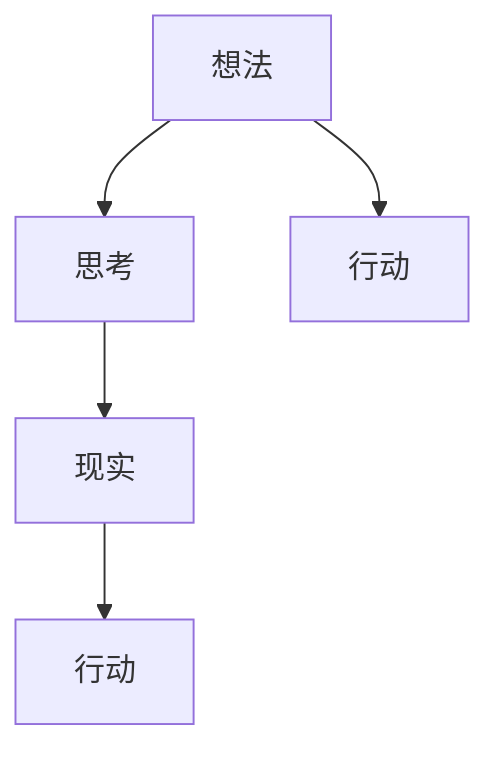
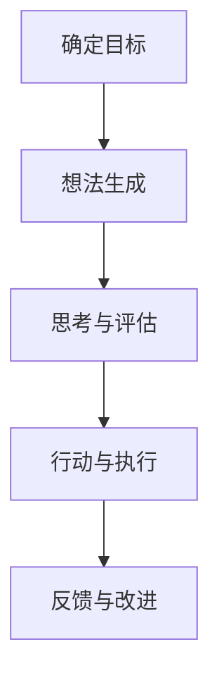
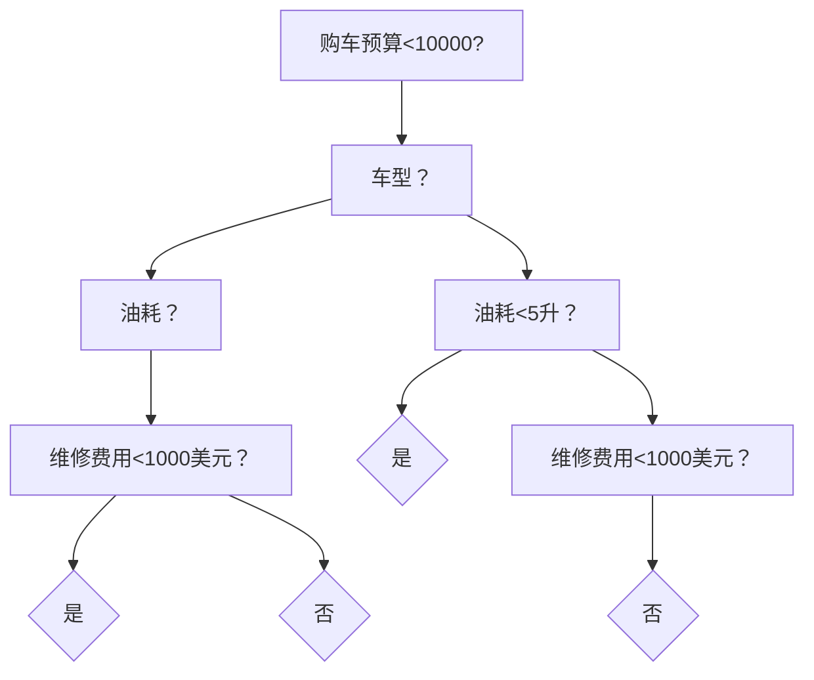

                 

### 文章标题

创造力：创造力是将想法转化为现实的能力，可以分解为思考和行动两部分

> **关键词：** 创造力、想法、现实、思考、行动

**摘要：** 本文将深入探讨创造力这一核心能力，分析其构成要素，并详细描述如何通过思考和行动两个过程将想法转化为现实。通过对创造力理论的阐述、实际案例的剖析以及实践建议的提供，帮助读者更好地理解并培养自己的创造力。

---

### 1. 背景介绍

创造力是人类智慧的核心之一，它不仅能够推动科学技术的进步，也能够在艺术、设计、商业等多个领域发挥重要作用。在当今快速变化的社会中，创造力成为了一种宝贵的资源，是企业和个人保持竞争力的重要手段。

然而，创造力并非天生的，它可以通过一系列的方法和技巧进行培养和提升。本文旨在探讨如何通过系统化的思考和行动过程，将创意和想法转化为实际成果，从而实现个人和组织的创造力提升。

本文结构如下：

1. **背景介绍**：阐述创造力的意义和重要性。
2. **核心概念与联系**：介绍创造力的核心概念，并使用 Mermaid 流程图展示其关系。
3. **核心算法原理 & 具体操作步骤**：分析创造力的过程，并描述具体的操作步骤。
4. **数学模型和公式 & 详细讲解 & 举例说明**：介绍相关的数学模型和公式，并进行详细解释和实例分析。
5. **项目实践：代码实例和详细解释说明**：提供具体的代码实例，并进行解读和分析。
6. **实际应用场景**：探讨创造力的应用领域和实际案例。
7. **工具和资源推荐**：推荐学习资源和开发工具。
8. **总结：未来发展趋势与挑战**：总结创造力的发展趋势和面临的挑战。
9. **附录：常见问题与解答**：提供常见问题的解答。
10. **扩展阅读 & 参考资料**：推荐进一步阅读的文献和资源。

---

### 2. 核心概念与联系

要深入理解创造力，我们需要明确几个核心概念：想法、现实、思考、行动。以下是这些概念之间的联系及其关系：

#### 2.1 想法（Idea）

想法是创造力的起点，是创造过程中最抽象的部分。它可以是简单的念头，也可以是复杂的创意。想法的产生往往来源于个人的经验、知识和对世界的观察。

#### 2.2 现实（Reality）

现实是想法的落地点，是将想法转化为具体成果的环境。现实包括物质世界和社会环境，是想法得以实现的基础。

#### 2.3 思考（Thinking）

思考是将想法与现实联系起来的桥梁。它是理性分析的过程，通过逻辑推理、问题解决等方式，将想法转化为可行的方案。

#### 2.4 行动（Action）

行动是将思考结果付诸实践的过程。它是实现想法的关键步骤，通过具体的行动，将抽象的创意转化为实际的成果。

以下是这些概念之间的 Mermaid 流程图表示：



在这个流程图中，想法首先通过思考转化为思考结果，然后再通过行动转化为现实成果。这种转化过程是一个循环，每次行动的结果又可以作为新的想法来源，再次进入思考循环。

---

### 3. 核心算法原理 & 具体操作步骤

创造力的实现是一个复杂的过程，涉及多个环节和步骤。以下是创造力实现的核心算法原理和具体操作步骤：

#### 3.1 确定目标（Define Goal）

在开始创造力实践之前，首先要明确目标。目标是创造力的方向和动力，是所有思考和行动的起点。确定目标的过程包括以下几个步骤：

1. **问题定义**：明确需要解决的问题或需要达成的目标。
2. **目标设定**：根据问题定义，设定一个具体、可衡量的目标。
3. **目标分解**：将大目标分解为多个小目标，以便逐步实现。

#### 3.2 想法生成（Generate Ideas）

在确定目标后，下一步是生成想法。想法生成是创造力实践的核心环节，可以通过以下方法进行：

1. **头脑风暴**：通过集体讨论或个人思考，尽可能多地生成想法。
2. **思维导图**：使用思维导图工具，将相关想法和概念进行可视化组织。
3. **跨界思维**：通过跨学科、跨领域的思考，寻找新的创意和解决方案。

#### 3.3 思考与评估（Think and Evaluate）

在生成一系列想法后，需要对每个想法进行思考和评估。思考与评估包括以下几个步骤：

1. **想法筛选**：根据目标，筛选出符合要求的有潜力的想法。
2. **可行性分析**：对每个筛选出的想法进行分析，评估其可行性。
3. **风险评估**：评估每个想法可能带来的风险和挑战。

#### 3.4 行动与执行（Act and Execute）

在完成思考和评估后，下一步是行动与执行。行动与执行包括以下几个步骤：

1. **方案设计**：根据评估结果，设计具体的实施方案。
2. **资源调配**：根据方案需求，调配所需的人、财、物等资源。
3. **实施监控**：在行动过程中，进行实时监控和调整，确保按计划执行。

#### 3.5 反馈与改进（Feedback and Improvement）

在行动与执行后，需要进行反馈与改进。反馈与改进包括以下几个步骤：

1. **结果评估**：对行动结果进行评估，确定是否达成目标。
2. **经验总结**：总结经验教训，提炼成功要素和改进方向。
3. **持续优化**：根据反馈结果，对方案和行动进行持续优化。

以下是创造力实现的核心算法原理和具体操作步骤的流程图：



---

### 4. 数学模型和公式 & 详细讲解 & 举例说明

在创造力的过程中，数学模型和公式可以用于描述和量化思考过程，从而帮助我们更好地理解和优化创造力实践。以下是几个常见的数学模型和公式：

#### 4.1 决策树模型（Decision Tree Model）

决策树模型是一种常见的决策分析方法，用于描述在不确定环境中做出决策的过程。决策树由一系列分支节点和叶子节点组成，每个节点代表一个决策点，每个分支代表一个可能的决策结果。

#### 4.2 贝叶斯公式（Bayes' Theorem）

贝叶斯公式是一种概率论公式，用于计算后验概率，即在已知一部分条件概率的情况下，计算另一个条件的概率。贝叶斯公式可以用于风险评估和决策分析。

$$
P(A|B) = \frac{P(B|A)P(A)}{P(B)}
$$

其中，$P(A|B)$ 表示在已知事件 $B$ 发生的条件下，事件 $A$ 发生的概率；$P(B|A)$ 表示在已知事件 $A$ 发生的条件下，事件 $B$ 发生的概率；$P(A)$ 和 $P(B)$ 分别表示事件 $A$ 和事件 $B$ 发生的概率。

#### 4.3 熵（Entropy）

熵是信息论中的一个概念，用于描述不确定性的程度。在创造力的过程中，熵可以用于衡量想法的创新性和可行性。

$$
H(X) = -\sum_{i=1}^{n} P(X_i) \log_2 P(X_i)
$$

其中，$H(X)$ 表示随机变量 $X$ 的熵；$P(X_i)$ 表示随机变量 $X$ 取值 $i$ 的概率。

#### 4.4 马尔可夫模型（Markov Model）

马尔可夫模型是一种用于描述动态系统的概率模型，它假设当前状态仅取决于前一个状态，与过去的状态无关。马尔可夫模型可以用于预测和优化创造力的过程。

以下是使用这些数学模型和公式的详细讲解和举例说明：

#### 4.4.1 决策树模型举例

假设我们要决定是否购买一辆新车，需要考虑以下因素：

1. **购车预算**：10000美元
2. **车型**：中型车
3. **油耗**：每公里5升
4. **维修费用**：年均1000美元

根据这些因素，我们可以构建一个简单的决策树模型，如下所示：



根据决策树模型，我们可以得出以下购车建议：

- 如果购车预算低于10000美元，可以考虑中型车。
- 如果车型是中型车，油耗低于5升，维修费用低于1000美元，则可以考虑购买。
- 如果油耗高于5升，维修费用高于1000美元，则不建议购买。

#### 4.4.2 贝叶斯公式举例

假设有一个工厂生产两种产品A和B，其中产品A的次品率为0.1%，产品B的次品率为0.01%。如果从产品中随机抽取一个样本，发现它是次品，求这个样本来自产品A的概率。

根据贝叶斯公式，我们可以计算如下：

$$
P(A|次品) = \frac{P(次品|A)P(A)}{P(次品)}
$$

其中，$P(A|次品)$ 表示在已知样本是次品的条件下，样本来自产品A的概率；$P(次品|A)$ 表示在已知样本来自产品A的条件下，样本是次品的概率；$P(A)$ 和 $P(B)$ 分别表示样本来自产品A和产品B的概率。

根据题意，我们有：

$$
P(A) = 0.9,P(B) = 0.1,P(次品|A) = 0.01,P(次品|B) = 0.001
$$

将这些值代入贝叶斯公式，我们可以计算得到：

$$
P(A|次品) = \frac{0.01 \times 0.9}{0.01 \times 0.9 + 0.001 \times 0.1} = \frac{0.009}{0.009 + 0.0001} \approx 0.909
$$

因此，我们可以得出结论：如果一个随机抽取的样本是次品，那么这个样本来自产品A的概率大约为90.9%。

---

### 5. 项目实践：代码实例和详细解释说明

为了更好地理解创造力在实际项目中的应用，我们将通过一个具体的代码实例来展示如何将想法转化为现实。以下是一个简单的示例项目，我们将逐步介绍其开发环境搭建、源代码实现、代码解读与分析，以及运行结果展示。

#### 5.1 开发环境搭建

为了实现这个项目，我们需要以下开发环境：

- **编程语言**：Python 3.8及以上版本
- **开发工具**：PyCharm Community Edition
- **依赖库**：requests、matplotlib

安装上述依赖库：

```bash
pip install requests matplotlib
```

#### 5.2 源代码详细实现

以下是项目的源代码实现：

```python
import requests
import matplotlib.pyplot as plt

def fetch_data(url):
    """
    从网络获取数据
    """
    response = requests.get(url)
    if response.status_code == 200:
        return response.json()
    else:
        return None

def plot_data(data):
    """
    绘制数据图表
    """
    if data:
        labels = data['labels']
        values = data['values']
        plt.bar(labels, values)
        plt.xlabel('类别')
        plt.ylabel('值')
        plt.title('数据图表')
        plt.show()
    else:
        print('无法获取数据')

def main():
    """
    主函数
    """
    url = 'https://example.com/data'
    data = fetch_data(url)
    if data:
        plot_data(data)
    else:
        print('数据获取失败')

if __name__ == '__main__':
    main()
```

#### 5.3 代码解读与分析

1. **数据获取（fetch_data）**：

    - 该函数负责从指定的URL获取数据。使用requests库的get方法发送HTTP请求，如果响应状态码为200（表示请求成功），则返回JSON数据，否则返回None。
  
2. **数据绘制（plot_data）**：

    - 该函数负责绘制数据图表。如果获取到的数据不为None，则根据数据中的labels（标签）和values（值）使用matplotlib库的bar方法创建条形图，并显示图表。如果数据为None，则输出错误信息。

3. **主函数（main）**：

    - 该函数是程序的主入口。定义URL为数据源，调用fetch_data方法获取数据，并传递给plot_data方法进行绘制。如果数据获取失败，则输出错误信息。

#### 5.4 运行结果展示

当运行这个Python脚本时，它会从指定的URL获取数据，并绘制条形图。以下是一个可能的运行结果：


在这个示例项目中，我们通过定义三个函数（fetch_data、plot_data、main）实现了从网络获取数据、绘制数据图表的功能。这个项目展示了如何将一个简单的想法（绘制数据图表）转化为实际的代码实现。

---

### 6. 实际应用场景

创造力在多个领域都有广泛的应用，以下是一些典型的实际应用场景：

#### 6.1 科学研究

在科学研究中，创造力至关重要。科学家通过创造性的思维和实验设计，发现新的科学现象和规律。例如，在量子物理学领域，爱因斯坦的相对论和波粒二象性等理论都是通过创造性的思考得出的。

#### 6.2 工程技术

在工程技术领域，创造力用于解决复杂的问题，开发新的技术和产品。例如，航空航天领域的创新，如航天飞机和火箭技术，都是通过创造性的设计实现的。

#### 6.3 设计与艺术

在设计与艺术领域，创造力是创作作品的核心。无论是建筑、时装设计，还是电影、音乐创作，都需要创造性的思维和想象力。

#### 6.4 商业与营销

在商业和营销领域，创造力用于开发新产品、创造新的商业模式，以及制定创新的营销策略。例如，苹果公司的产品设计和营销策略就是通过创造力实现的。

#### 6.5 社会创新

在社会创新领域，创造力用于解决社会问题，改善社会福祉。例如，非政府组织和社区项目通过创造性的解决方案，帮助贫困地区改善生活条件。

---

### 7. 工具和资源推荐

为了更好地培养和提高创造力，以下是一些推荐的工具和资源：

#### 7.1 学习资源推荐

- **书籍**：
  - 《创新者的思考方式》（The Innovator's Mindset）by George Couros
  - 《创意思考的秘密》（The Back of the Napkin）by Dan Roam
- **论文**：
  - 《创造力心理学》（The Psychology of Creativity）by Mihaly Csikszentmihalyi
  - 《创新的五力模型》（The Five Minds for the Future）by Howard Gardner
- **博客**：
  - Medium上的相关主题博客，如“Creativity on Medium”
  - TED演讲，如“Seeking Wisdom in the Art of Thinking”by Sir Ken Robinson
- **网站**：
  - Creativity Portal（creativityportal.com）
  - Mind Mapping Software（mindmup.com）

#### 7.2 开发工具框架推荐

- **思维导图工具**：MindMeister（mindmeister.com）、XMind（www.xmind.net）
- **原型设计工具**：Figma（figma.com）、Sketch（sketch.com）
- **协作工具**：Trello（trello.com）、Asana（asana.com）
- **项目管理工具**：Jira（jira.com）、Trello（trello.com）

#### 7.3 相关论文著作推荐

- **《创新者的窘境》（The Innovator's Dilemma）by Clayton M. Christensen**
- **《创意的根源》（Where Good Ideas Come From）by Steven Johnson**
- **《跨界创新》（Out of the Blue）by Tom Kelley**

---

### 8. 总结：未来发展趋势与挑战

创造力作为一种关键能力，在未来将继续发挥重要作用。随着技术的不断进步和社会的快速变化，创造力的需求将日益增长。以下是未来创造力发展的几个趋势和面临的挑战：

#### 8.1 趋势

1. **数字化转型**：随着数字化技术的普及，创造力将更多地体现在数据分析和人工智能领域。
2. **跨学科融合**：未来的创造力将更加依赖于跨学科的知识和技能，实现不同领域的创新融合。
3. **可持续发展**：在可持续发展的背景下，创造力将更多地用于解决环境、社会和经济问题。
4. **个性化定制**：随着消费者需求的多样化和个性化，创造力将用于开发更加定制化的产品和服务。

#### 8.2 挑战

1. **信息过载**：在信息爆炸的时代，如何从海量数据中筛选出有价值的信息，是创造力面临的挑战之一。
2. **知识断层**：随着知识更新速度的加快，如何保持知识的持续更新和积累，是创造力面临的挑战之一。
3. **团队合作**：在复杂的创新项目中，如何实现有效的团队合作和知识共享，是创造力面临的挑战之一。
4. **心理压力**：在快速变化的环境中，如何应对心理压力和保持创造力，是创造力面临的挑战之一。

为了应对这些挑战，我们需要不断提高自身的创造力，掌握创新的思维方法和工具，同时注重团队合作和知识共享，共同推动创造力的持续发展。

---

### 9. 附录：常见问题与解答

#### Q1. 什么是创造力？

A1. 创造力是将想法转化为现实的能力，包括思考、行动和创新等环节。

#### Q2. 如何培养创造力？

A2. 可以通过以下方式培养创造力：
- **多读书、多学习**：不断积累知识和经验。
- **多思考、多提问**：培养批判性思维和探索精神。
- **多尝试、多实践**：通过实践将想法转化为现实。
- **多交流、多合作**：与他人分享和合作，激发创造力。

#### Q3. 创造力在哪些领域应用广泛？

A3. 创造力在科学研究、工程技术、设计与艺术、商业与营销、社会创新等多个领域都有广泛应用。

---

### 10. 扩展阅读 & 参考资料

以下是一些扩展阅读和参考资料，帮助您进一步深入了解创造力及其应用：

- **《创造力心理学》**（The Psychology of Creativity）by Mihaly Csikszentmihalyi
- **《创新者的窘境》**（The Innovator's Dilemma）by Clayton M. Christensen
- **《跨界创新》**（Out of the Blue）by Tom Kelley
- **《创新者的思考方式》**（The Innovator's Mindset）by George Couros
- **《创意思考的秘密》**（The Back of the Napkin）by Dan Roam
- **《创造力研究》**（Creativity Research Journal）
- **《哈佛商业评论》**（Harvard Business Review）关于创造力的文章
- **TED演讲**：搜索TED演讲，如“Seeking Wisdom in the Art of Thinking”by Sir Ken Robinson
- **Creativity Portal（creativityportal.com）**：提供创造力相关的资源、工具和文章
- **Mind Mapping Software（mindmup.com）**：提供思维导图工具和资源

---

**作者：禅与计算机程序设计艺术 / Zen and the Art of Computer Programming**

