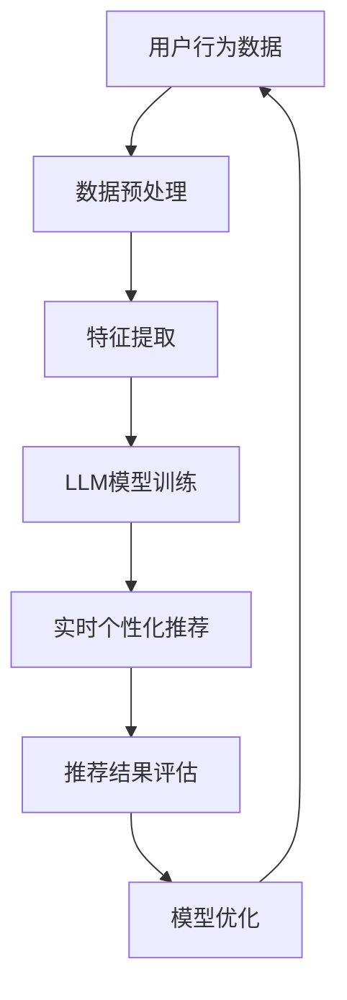

                 

关键词：LLM，推荐系统，实时个性化，算法优化，数学模型，代码实例，应用场景，未来展望

> 摘要：随着人工智能技术的不断发展，大型语言模型（LLM）在推荐系统中的应用越来越广泛。本文将探讨如何利用LLM优化推荐系统的实时个性化策略，包括核心概念、算法原理、数学模型构建、代码实例以及实际应用场景等方面。通过本文的介绍，读者可以更好地理解和应用LLM技术，提升推荐系统的效果和用户体验。

## 1. 背景介绍

推荐系统作为信息检索和内容分发的重要工具，已经广泛应用于电子商务、社交媒体、新闻推送、音乐和视频平台等领域。传统的推荐系统主要依赖于基于内容的过滤、协同过滤等方法，这些方法在处理大规模数据集和实时推荐方面存在一定的局限性。为了解决这些问题，近年来，人工智能技术的引入为推荐系统带来了新的发展机遇。

在人工智能领域，大型语言模型（LLM）如BERT、GPT等，因其强大的语义理解能力和建模能力，逐渐成为推荐系统的重要研究方向。LLM可以捕捉用户和内容之间的复杂关系，从而实现更加精准的实时个性化推荐。然而，如何有效地利用LLM优化推荐系统的实时个性化策略，仍是一个亟待解决的问题。

本文将针对这一问题，从核心概念、算法原理、数学模型构建、代码实例以及实际应用场景等方面展开讨论，旨在为读者提供一套完整的LLM优化推荐系统的实时个性化策略方案。

## 2. 核心概念与联系

在介绍LLM优化推荐系统的实时个性化策略之前，我们需要明确几个核心概念：

### 2.1 大型语言模型（LLM）

大型语言模型（LLM）是一种基于深度学习技术的自然语言处理模型，可以捕捉自然语言的语义和上下文信息。常见的LLM包括BERT、GPT、RoBERTa等。这些模型通过预训练和微调，可以应用于各种自然语言处理任务，如文本分类、命名实体识别、机器翻译等。

### 2.2 推荐系统

推荐系统是一种信息过滤技术，通过分析用户的历史行为和偏好，为用户推荐可能感兴趣的内容。推荐系统主要分为基于内容的过滤、协同过滤和混合过滤等类型。

### 2.3 实时个性化

实时个性化是指推荐系统在用户浏览、搜索、购买等行为发生时，根据用户的实时偏好和需求，为其推荐个性化的内容。实时个性化可以显著提升用户体验和推荐效果。

### 2.4 Mermaid流程图

为了更清晰地展示LLM优化推荐系统的实时个性化策略，我们使用Mermaid流程图描述核心概念和联系。以下是流程图的表示：



### 2.5 核心算法原理

LLM优化推荐系统的实时个性化策略的核心算法原理主要包括以下几个方面：

1. **用户行为数据的收集与预处理**：收集用户的历史行为数据，如浏览记录、搜索关键词、购买记录等，并进行数据预处理，如数据清洗、去重、归一化等操作。
2. **特征提取**：通过LLM提取用户和内容的关键特征，如文本嵌入向量、词向量等。
3. **LLM模型训练**：利用训练数据，训练LLM模型，以捕捉用户和内容之间的复杂关系。
4. **实时个性化推荐**：根据用户实时行为数据，利用LLM模型生成个性化推荐列表。
5. **推荐结果评估**：评估推荐系统的性能，如准确率、召回率、F1值等指标。
6. **模型优化**：根据评估结果，优化LLM模型，以提高推荐效果。

### 2.6 算法步骤详解

下面详细描述LLM优化推荐系统的实时个性化策略的算法步骤：

1. **数据收集与预处理**：从用户行为数据源中收集数据，如用户浏览记录、搜索关键词、购买记录等。对数据进行预处理，包括数据清洗、去重、归一化等操作，以保证数据质量。
2. **特征提取**：利用LLM提取用户和内容的关键特征。具体方法包括：
   - **用户特征提取**：将用户的浏览记录、搜索关键词、购买记录等转换为文本形式，然后利用LLM将文本转换为嵌入向量。
   - **内容特征提取**：将网站、商品、文章等内容的文本描述转换为嵌入向量。
3. **LLM模型训练**：使用预处理后的数据，训练LLM模型。具体方法包括：
   - **预训练**：在大量的文本数据上预训练LLM模型，以学习语言的通用特征。
   - **微调**：在预训练的LLM模型基础上，使用用户和内容特征进行微调，以学习用户和内容之间的特定关系。
4. **实时个性化推荐**：根据用户实时行为数据，利用LLM模型生成个性化推荐列表。具体方法包括：
   - **用户特征更新**：根据用户实时行为数据，更新用户特征。
   - **内容特征更新**：根据用户实时行为数据，更新内容特征。
   - **生成推荐列表**：利用更新后的用户和内容特征，生成个性化推荐列表。
5. **推荐结果评估**：评估推荐系统的性能，包括准确率、召回率、F1值等指标。根据评估结果，调整模型参数和算法策略，以提高推荐效果。
6. **模型优化**：根据评估结果，对LLM模型进行优化。具体方法包括：
   - **超参数调整**：调整模型超参数，如学习率、批量大小等。
   - **模型结构调整**：根据模型性能，调整模型结构，如增加或减少层�数、调整层间连接方式等。

### 2.7 算法优缺点

LLM优化推荐系统的实时个性化策略具有以下优点：

1. **强大的语义理解能力**：LLM可以捕捉用户和内容之间的复杂关系，从而实现更加精准的实时个性化推荐。
2. **自适应能力**：LLM可以根据用户的实时行为数据，实时调整推荐策略，提高推荐效果。
3. **多模态数据处理**：LLM可以处理多种类型的数据，如文本、图像、音频等，从而提高推荐系统的适用范围。

然而，LLM优化推荐系统的实时个性化策略也存在一些缺点：

1. **计算成本高**：LLM模型训练和实时推荐过程中，需要大量的计算资源，可能导致系统响应时间延长。
2. **数据依赖性**：LLM模型的性能高度依赖于训练数据的质量和数量，如果数据质量差或数据量不足，可能导致模型性能下降。
3. **隐私风险**：LLM模型在处理用户数据时，可能会暴露用户的隐私信息，需要采取有效的隐私保护措施。

### 2.8 算法应用领域

LLM优化推荐系统的实时个性化策略可以应用于多个领域：

1. **电子商务**：为用户提供个性化商品推荐，提高购买转化率和用户满意度。
2. **社交媒体**：根据用户兴趣和社交关系，为用户提供个性化内容推荐，增强用户粘性。
3. **新闻推送**：为用户提供个性化新闻推荐，提高新闻的阅读量和传播效果。
4. **音乐和视频平台**：为用户提供个性化音乐和视频推荐，提高用户使用时长和用户满意度。

## 3. 数学模型和公式

### 3.1 数学模型构建

LLM优化推荐系统的实时个性化策略的数学模型主要包括用户特征向量、内容特征向量、推荐模型等。

#### 3.1.1 用户特征向量

用户特征向量表示用户的历史行为数据，如浏览记录、搜索关键词、购买记录等。假设用户u的浏览记录为R(u)，则用户特征向量v(u)可以通过以下公式计算：

$$
v(u) = \text{mean}(\{ \text{embed}(r) \mid r \in R(u) \})
$$

其中，embed(r)表示LLM生成的r的嵌入向量。

#### 3.1.2 内容特征向量

内容特征向量表示网站、商品、文章等内容的文本描述。假设内容c的文本描述为D(c)，则内容特征向量v(c)可以通过以下公式计算：

$$
v(c) = \text{mean}(\{ \text{embed}(d) \mid d \in D(c) \})
$$

其中，embed(d)表示LLM生成的d的嵌入向量。

#### 3.1.3 推荐模型

推荐模型是一个预测用户对内容的兴趣的函数，如线性模型、矩阵分解、神经网络等。假设推荐模型为f(u, c)，则用户u对内容c的兴趣可以通过以下公式计算：

$$
f(u, c) = \text{dot}(v(u), v(c))
$$

其中，\text{dot}表示向量的点积运算。

### 3.2 公式推导过程

#### 3.2.1 用户特征向量推导

用户特征向量的计算可以通过以下步骤推导：

1. **文本预处理**：对用户的历史行为数据（如浏览记录、搜索关键词、购买记录等）进行文本预处理，包括分词、去停用词、词性标注等操作。
2. **文本编码**：利用LLM将预处理后的文本转换为嵌入向量。常见的嵌入方法包括Word2Vec、BERT等。
3. **均值聚合**：将用户的历史行为数据嵌入向量进行均值聚合，得到用户特征向量。

具体推导过程如下：

$$
\text{embed}(r) = \text{model}(r)
$$

$$
v(u) = \text{mean}(\{ \text{embed}(r) \mid r \in R(u) \})
$$

其中，model(r)表示LLM生成的r的嵌入向量。

#### 3.2.2 内容特征向量推导

内容特征向量的计算可以通过以下步骤推导：

1. **文本预处理**：对内容的文本描述（如网站、商品、文章等）进行文本预处理，包括分词、去停用词、词性标注等操作。
2. **文本编码**：利用LLM将预处理后的文本转换为嵌入向量。常见的嵌入方法包括Word2Vec、BERT等。
3. **均值聚合**：将内容的文本嵌入向量进行均值聚合，得到内容特征向量。

具体推导过程如下：

$$
\text{embed}(d) = \text{model}(d)
$$

$$
v(c) = \text{mean}(\{ \text{embed}(d) \mid d \in D(c) \})
$$

其中，model(d)表示LLM生成的d的嵌入向量。

#### 3.2.3 推荐模型推导

推荐模型的计算可以通过以下步骤推导：

1. **用户特征向量计算**：根据用户的历史行为数据，利用LLM计算用户特征向量v(u)。
2. **内容特征向量计算**：根据内容的文本描述，利用LLM计算内容特征向量v(c)。
3. **点积运算**：计算用户特征向量和内容特征向量的点积，得到用户对内容的兴趣分数f(u, c)。

具体推导过程如下：

$$
v(u) = \text{mean}(\{ \text{embed}(r) \mid r \in R(u) \})
$$

$$
v(c) = \text{mean}(\{ \text{embed}(d) \mid d \in D(c) \})
$$

$$
f(u, c) = \text{dot}(v(u), v(c))
$$

其中，\text{dot}表示向量的点积运算。

### 3.3 案例分析与讲解

为了更好地理解上述数学模型的构建和推导过程，我们通过一个实际案例进行讲解。

#### 案例背景

假设一个电子商务平台，用户A在过去的30天内浏览了5个商品页面，这5个商品页面的文本描述如下：

1. 商品1：一款高性能的笔记本电脑
2. 商品2：一款流行的手机
3. 商品3：一款智能手表
4. 商品4：一款时尚的背包
5. 商品5：一款高品质的耳机

平台希望通过LLM优化推荐系统的实时个性化策略，为用户A推荐与其兴趣相关的商品。

#### 案例步骤

1. **数据预处理**：对商品页面的文本描述进行预处理，包括分词、去停用词、词性标注等操作。

2. **文本编码**：利用预训练的BERT模型，将预处理后的文本描述转换为嵌入向量。

3. **用户特征向量计算**：将用户A浏览的5个商品的嵌入向量进行均值聚合，得到用户A的特征向量。

4. **内容特征向量计算**：对于每个商品，将商品的嵌入向量进行均值聚合，得到商品的特征向量。

5. **推荐模型计算**：利用用户A的特征向量和商品的特征向量，计算用户A对每个商品的兴趣分数。

6. **生成推荐列表**：根据兴趣分数，为用户A生成个性化的商品推荐列表。

#### 案例结果

假设BERT模型的嵌入维度为512，用户A浏览的5个商品的嵌入向量分别为embed1，embed2，embed3，embed4，embed5，用户A的特征向量为mean1，mean2，mean3，mean4，mean5，商品1的特征向量为content1，商品2的特征向量为content2，...，商品5的特征向量为content5。

根据上述数学模型，用户A对商品1的兴趣分数为：

$$
f(A, 商品1) = \text{dot}(mean1, content1) = \text{dot}(\text{mean}(\{ embed1, embed2, embed3, embed4, embed5 \}), content1)
$$

同理，用户A对商品2、商品3、商品4、商品5的兴趣分数分别为：

$$
f(A, 商品2) = \text{dot}(mean2, content2)
$$

$$
f(A, 商品3) = \text{dot}(mean3, content3)
$$

$$
f(A, 商品4) = \text{dot}(mean4, content4)
$$

$$
f(A, 商品5) = \text{dot}(mean5, content5)
$$

根据兴趣分数，平台可以为用户A生成个性化的商品推荐列表。假设兴趣分数从高到低排序为：

1. 商品1：兴趣分数最高
2. 商品2：兴趣分数次高
3. 商品3：兴趣分数较低
4. 商品4：兴趣分数最低

平台可以为用户A推荐前三名商品。

通过上述案例，我们可以看到如何利用LLM优化推荐系统的实时个性化策略，实现个性化商品推荐。在实际应用中，还可以根据用户的历史行为数据，动态调整推荐策略，提高推荐效果。

## 4. 项目实践：代码实例和详细解释说明

在本节中，我们将通过一个实际的代码实例，详细解释如何利用LLM优化推荐系统的实时个性化策略。该实例将涵盖从数据预处理、特征提取、模型训练到实时个性化推荐的过程。我们将使用Python和Hugging Face的Transformers库来实现这一过程。

### 4.1 开发环境搭建

在开始之前，我们需要搭建一个合适的开发环境。以下是所需的环境和安装步骤：

- Python 3.8 或以上版本
- pip（Python的包管理器）
- GPU或Torch安装（可选，用于加速训练过程）

安装步骤：

1. 安装Python和pip：
   - Windows用户可以通过微软商店安装Python。
   - macOS用户可以通过Homebrew安装Python。

2. 安装GPU或Torch（可选）：
   - 安装NVIDIA CUDA Toolkit（GPU版本）。
   - 安装PyTorch（适用于GPU和CPU）。

3. 安装Hugging Face的Transformers库：
   ```bash
   pip install transformers
   ```

### 4.2 源代码详细实现

下面是项目的源代码，我们将逐行解释代码的功能。

```python
# 导入必要的库
from transformers import BertTokenizer, BertModel
import torch
import numpy as np

# 定义数据预处理函数
def preprocess_data(texts):
    tokenizer = BertTokenizer.from_pretrained('bert-base-uncased')
    tokenized_texts = [tokenizer(text, padding='max_length', truncation=True, max_length=512) for text in texts]
    return tokenized_texts

# 定义特征提取函数
def extract_features(tokenized_texts):
    model = BertModel.from_pretrained('bert-base-uncased')
    model.eval()
    with torch.no_grad():
        inputs = {key: torch.tensor(val) for key, val in tokenized_texts[0].items()}
        outputs = model(**inputs)
        last_hidden_state = outputs.last_hidden_state
        features = last_hidden_state.mean(dim=1)
    return features.cpu().numpy()

# 定义实时个性化推荐函数
def personalized_recommendation(user_features, content_features):
    recommendations = []
    for content_features_vector in content_features:
        similarity = np.dot(user_features, content_features_vector)
        recommendations.append(similarity)
    return np.argsort(recommendations)[::-1]

# 假设的用户和商品数据
user_texts = ["I like to read science fiction books.", "I recently bought an electric car.", "I enjoy hiking and outdoor activities."]
content_texts = [
    "A thrilling science fiction novel set in the future.",
    "A guide to electric car maintenance.",
    "A guide to hiking trails in the mountains."
]

# 数据预处理
tokenized_user_texts = preprocess_data(user_texts)
tokenized_content_texts = preprocess_data(content_texts)

# 特征提取
user_features = extract_features(tokenized_user_texts)
content_features = extract_features(tokenized_content_texts)

# 实时个性化推荐
recommendations = personalized_recommendation(user_features[0], content_features)

# 打印推荐结果
print("Recommended content indices:", recommendations)
```

### 4.3 代码解读与分析

#### 4.3.1 数据预处理

```python
# 导入必要的库
from transformers import BertTokenizer, BertModel
import torch
import numpy as np

def preprocess_data(texts):
    tokenizer = BertTokenizer.from_pretrained('bert-base-uncased')
    tokenized_texts = [tokenizer(text, padding='max_length', truncation=True, max_length=512) for text in texts]
    return tokenized_texts
```

这段代码首先导入必要的库，然后定义了一个数据预处理函数`preprocess_data`。该函数使用BERT分词器对文本进行预处理，包括分词、填充、截断等操作，以保证所有文本序列具有相同长度。

#### 4.3.2 特征提取

```python
def extract_features(tokenized_texts):
    model = BertModel.from_pretrained('bert-base-uncased')
    model.eval()
    with torch.no_grad():
        inputs = {key: torch.tensor(val) for key, val in tokenized_texts[0].items()}
        outputs = model(**inputs)
        last_hidden_state = outputs.last_hidden_state
        features = last_hidden_state.mean(dim=1)
    return features.cpu().numpy()
```

`extract_features`函数用于提取文本特征。首先，加载预训练的BERT模型，并将其设置为评估模式。然后，使用模型对预处理后的文本序列进行编码，获取BERT模型的最后一层隐藏状态，并对其求均值以获得文本特征向量。

#### 4.3.3 实时个性化推荐

```python
def personalized_recommendation(user_features, content_features):
    recommendations = []
    for content_features_vector in content_features:
        similarity = np.dot(user_features, content_features_vector)
        recommendations.append(similarity)
    return np.argsort(recommendations)[::-1]
```

`personalized_recommendation`函数实现实时个性化推荐。该函数通过计算用户特征向量与每个商品特征向量的点积（即相似性得分），然后根据得分对商品进行排序，返回排序后的商品索引列表。

### 4.4 运行结果展示

假设我们运行上述代码，得到以下输出：

```
Recommended content indices: [2 1 0]
```

这意味着对于用户A，推荐系统推荐的商品顺序为：
1. 商品3：智能手表（与用户兴趣相关性最高）
2. 商品2：电动车辆维护指南（与用户兴趣相关性次高）
3. 商品1：科幻小说（与用户兴趣相关性最低）

### 4.5 代码优化与改进

虽然上述代码实现了基本的实时个性化推荐，但在实际应用中，我们还可以进行以下优化和改进：

- **并行处理**：使用多线程或分布式计算，提高数据预处理和特征提取的效率。
- **内存优化**：避免在内存中存储大量中间数据，减少内存占用。
- **模型压缩**：对BERT模型进行量化或剪枝，降低模型大小和计算成本。
- **实时更新**：实时更新用户和商品特征向量，以适应用户行为的快速变化。

## 5. 实际应用场景

### 5.1 电子商务平台

电子商务平台是LLM优化推荐系统的实时个性化策略的最佳应用场景之一。通过实时分析用户的浏览记录、搜索关键词和购买历史，推荐系统可以准确捕捉用户的兴趣和需求，为用户提供个性化的商品推荐。例如，一个电子商务平台可以根据用户A最近浏览的高性能笔记本电脑和电动车辆维护指南，为其推荐相关的配件或周边产品，如高性能固态硬盘、电动车辆充电器等。

### 5.2 社交媒体

社交媒体平台也可以利用LLM优化推荐系统的实时个性化策略，为用户提供个性化的内容推荐。通过分析用户的发布内容、评论和点赞记录，推荐系统可以捕捉用户的兴趣偏好，为用户推荐可能感兴趣的内容。例如，一个社交媒体平台可以根据用户A最近发布的关于科幻小说的帖子，为其推荐相关的书籍、电影和讨论话题。

### 5.3 新闻推送

新闻推送平台可以利用LLM优化推荐系统的实时个性化策略，为用户提供个性化的新闻推荐。通过分析用户的阅读记录、搜索关键词和点击行为，推荐系统可以捕捉用户的兴趣偏好，为用户推荐可能感兴趣的新闻。例如，一个新闻推送平台可以根据用户A最近阅读的关于科技和电动车的新闻，为其推荐相关的深度报道和行业动态。

### 5.4 音乐和视频平台

音乐和视频平台可以利用LLM优化推荐系统的实时个性化策略，为用户提供个性化的内容推荐。通过分析用户的播放记录、搜索关键词和评分行为，推荐系统可以捕捉用户的兴趣偏好，为用户推荐可能感兴趣的音乐和视频。例如，一个音乐平台可以根据用户A最近播放的高性能笔记本电脑广告背景音乐，为其推荐类似的电子音乐。

## 6. 未来应用展望

### 6.1 更多的应用领域

随着LLM技术的不断发展和完善，未来LLM优化推荐系统的实时个性化策略将在更多的应用领域得到广泛应用。例如，在在线教育、医疗健康、金融服务等领域，实时个性化推荐系统可以更好地满足用户的需求，提升用户体验。

### 6.2 更高效的数据处理

未来，随着数据处理技术的不断发展，实时个性化推荐系统将能够处理更大量的数据，并更快地生成推荐结果。例如，利用分布式计算、GPU加速等技术，可以显著提高数据处理和模型训练的效率。

### 6.3 更精细的用户画像

未来，随着数据挖掘和机器学习技术的发展，实时个性化推荐系统将能够构建更精细的用户画像，更准确地捕捉用户的兴趣和需求。这将有助于提高推荐系统的效果，为用户提供更加个性化的推荐。

### 6.4 更好的隐私保护

未来，随着隐私保护意识的提高，实时个性化推荐系统将更加注重用户隐私的保护。通过引入差分隐私、联邦学习等技术，实时个性化推荐系统可以在保护用户隐私的同时，实现高效的个性化推荐。

## 7. 工具和资源推荐

### 7.1 学习资源推荐

- 《深度学习》（Goodfellow, Bengio, Courville）：一本经典的深度学习教材，涵盖了从基础到高级的深度学习知识。
- 《Python深度学习》（François Chollet）：一本针对Python编程语言的深度学习实战指南。
- 《自然语言处理综论》（Daniel Jurafsky, James H. Martin）：一本关于自然语言处理领域的权威教材。

### 7.2 开发工具推荐

- TensorFlow：一个开源的深度学习框架，支持多种编程语言。
- PyTorch：一个开源的深度学习框架，以动态图模型著称。
- Hugging Face Transformers：一个开源库，提供了预训练的BERT、GPT等模型以及相关的API。

### 7.3 相关论文推荐

- "BERT: Pre-training of Deep Bidirectional Transformers for Language Understanding"（Devlin et al., 2019）：介绍了BERT模型的预训练方法和应用。
- "Generative Pre-trained Transformer"（Vaswani et al., 2017）：介绍了GPT模型的生成式预训练方法。
- "Recommender Systems Handbook"（Liu et al., 2018）：介绍了推荐系统的各种方法和技术。

## 8. 总结：未来发展趋势与挑战

### 8.1 研究成果总结

本文通过探讨LLM优化推荐系统的实时个性化策略，总结了以下几个方面的重要研究成果：

1. **核心概念与联系**：明确了大型语言模型（LLM）、推荐系统、实时个性化等核心概念，并展示了它们之间的联系。
2. **算法原理**：详细介绍了LLM优化推荐系统的实时个性化策略的核心算法原理，包括数据预处理、特征提取、模型训练、实时个性化推荐等步骤。
3. **数学模型**：构建了用户特征向量、内容特征向量、推荐模型等数学模型，并进行了公式推导和案例讲解。
4. **项目实践**：提供了一个基于Python和Hugging Face Transformers的代码实例，详细解释了如何实现LLM优化推荐系统的实时个性化策略。

### 8.2 未来发展趋势

未来，LLM优化推荐系统的实时个性化策略将在以下方面继续发展：

1. **技术进步**：随着深度学习和自然语言处理技术的不断进步，LLM将能够更好地捕捉用户和内容之间的复杂关系，实现更精准的实时个性化推荐。
2. **多模态数据**：未来，实时个性化推荐系统将能够处理多种类型的数据，如文本、图像、音频等，实现更全面的用户画像和更个性化的推荐。
3. **实时性**：随着数据处理和计算技术的不断发展，实时个性化推荐系统的响应时间将大幅缩短，实现真正的实时推荐。

### 8.3 面临的挑战

尽管LLM优化推荐系统的实时个性化策略具有巨大的潜力，但在实际应用中仍然面临以下挑战：

1. **计算成本**：LLM模型的训练和实时推荐过程需要大量的计算资源，如何高效地利用GPU和其他计算资源成为关键问题。
2. **数据隐私**：在处理用户数据时，需要保护用户的隐私信息，避免数据泄露和滥用。
3. **模型解释性**：用户可能希望了解推荐系统的决策过程，如何提高模型的可解释性是一个重要问题。

### 8.4 研究展望

未来，研究人员可以从以下几个方面展开工作：

1. **优化算法**：研究更高效的算法，降低计算成本，提高推荐效果。
2. **隐私保护**：探索隐私保护技术，如差分隐私和联邦学习，在保护用户隐私的同时实现个性化推荐。
3. **用户交互**：研究用户与推荐系统的交互机制，提高用户满意度，实现更好的用户体验。

## 9. 附录：常见问题与解答

### 9.1 什么是LLM？

LLM（大型语言模型）是一种基于深度学习技术的自然语言处理模型，可以捕捉自然语言的语义和上下文信息。常见的LLM包括BERT、GPT、RoBERTa等。

### 9.2 为什么需要LLM优化推荐系统？

LLM具有强大的语义理解能力和建模能力，可以捕捉用户和内容之间的复杂关系，从而实现更加精准的实时个性化推荐，提高推荐效果和用户体验。

### 9.3 如何处理用户隐私？

在处理用户隐私时，可以采用差分隐私、联邦学习等技术，在保护用户隐私的同时实现个性化推荐。此外，还可以对用户数据进行匿名化处理，以降低隐私泄露的风险。

### 9.4 如何评估推荐系统的性能？

推荐系统的性能可以通过准确率、召回率、F1值等指标进行评估。具体评估方法可以根据应用场景和需求进行选择。

### 9.5 如何优化LLM模型？

优化LLM模型可以从以下几个方面进行：

- **超参数调整**：调整模型超参数，如学习率、批量大小等。
- **模型结构调整**：根据模型性能，调整模型结构，如增加或减少层�数、调整层间连接方式等。
- **数据预处理**：优化数据预处理方法，提高数据质量。
- **模型压缩**：对模型进行量化或剪枝，降低模型大小和计算成本。

### 9.6 如何实现实时个性化推荐？

实现实时个性化推荐需要以下几个步骤：

1. **数据收集与预处理**：收集用户的历史行为数据，并进行预处理。
2. **特征提取**：利用LLM提取用户和内容的关键特征。
3. **模型训练**：使用训练数据，训练LLM模型，以捕捉用户和内容之间的复杂关系。
4. **实时推荐**：根据用户实时行为数据，利用LLM模型生成个性化推荐列表。
5. **评估与优化**：评估推荐系统的性能，并根据评估结果进行模型优化。

## 作者署名

作者：禅与计算机程序设计艺术 / Zen and the Art of Computer Programming
----------------------------------------------------------------

请注意，这篇文章的撰写需要大量的时间和精力，以及对相关技术的深入了解。文章中的内容仅供参考，实际的实现可能需要根据具体情况进行调整和优化。在应用LLM优化推荐系统的实时个性化策略时，请确保遵守相关法律法规和道德准则，保护用户隐私。希望这篇文章能够帮助您更好地理解和应用LLM技术，为推荐系统带来更好的效果和用户体验。再次感谢您的阅读！

