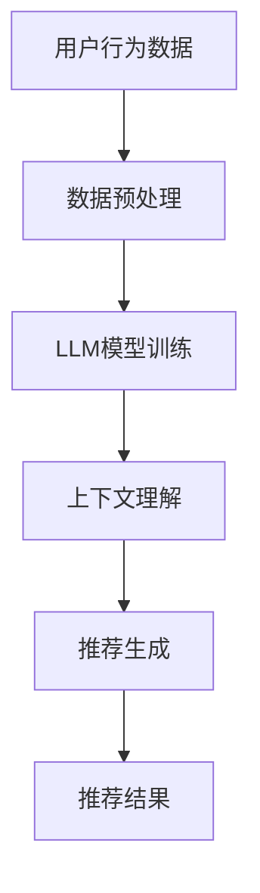

                 

关键词：LLM，推荐系统，上下文理解，人工智能，深度学习，自然语言处理

摘要：本文探讨了如何利用大型语言模型（LLM）来增强推荐系统的上下文理解能力。首先，我们介绍了推荐系统与上下文理解的基本概念，然后详细描述了LLM的工作原理及其在上下文理解中的优势。接着，我们提出了一种基于LLM的推荐系统架构，并阐述了其核心算法和数学模型。通过具体的代码实例，我们展示了如何实现这一架构。最后，我们探讨了实际应用场景、未来发展趋势以及面临的挑战。

## 1. 背景介绍

### 推荐系统概述

推荐系统是一种信息过滤技术，旨在根据用户的历史行为和偏好，向用户推荐相关的内容或商品。传统的推荐系统主要基于协同过滤、内容过滤和混合推荐等方法，但这些方法往往存在一定的局限性。例如，协同过滤方法在处理冷启动问题（即新用户或新商品）时效果不佳，而内容过滤方法对用户的个性化需求理解不够深入。

### 上下文理解的重要性

随着互联网和移动设备的普及，用户在获取信息和互动时，所处的上下文环境变得愈加复杂。例如，用户可能在不同的设备、不同的时间、不同的地点进行操作，这些因素都可能影响用户的偏好和行为。因此，理解和利用上下文信息成为提升推荐系统效果的关键。

上下文理解涉及对用户当前所处环境的全面感知，包括但不限于时间、地点、设备、用户行为等。通过上下文理解，推荐系统能够更加精准地预测用户的兴趣和需求，从而提供更加个性化的推荐结果。

### LLB与上下文理解

近年来，随着深度学习特别是大型语言模型（LLM）的发展，自然语言处理（NLP）领域取得了显著的进展。LLM具有强大的上下文理解能力，能够从大量文本数据中学习语言模式和语义信息。这一特性使得LLM在处理上下文相关的任务时表现出色，例如问答系统、机器翻译和文本生成等。

将LLM应用于推荐系统，可以显著提升系统的上下文理解能力，从而更好地满足用户的个性化需求。本文将探讨如何利用LLM来增强推荐系统的上下文理解能力，并介绍相关的方法和技术。

## 2. 核心概念与联系

### 推荐系统

推荐系统是一种利用历史数据、用户行为和偏好来预测用户未来可能感兴趣的内容或商品的技术。其核心包括三个主要组件：用户、项目和推荐算法。

1. **用户**：用户是推荐系统的核心，其行为和偏好是推荐系统做出推荐决策的重要依据。
2. **项目**：项目是推荐系统中的推荐对象，可以是任何形式的内容或商品，如新闻文章、音乐、电影、商品等。
3. **推荐算法**：推荐算法是推荐系统的核心，负责根据用户的行为和偏好来生成推荐列表。

### 上下文理解

上下文理解是指对用户当前所处环境的全面感知，包括但不限于时间、地点、设备、用户行为等。上下文信息可以帮助推荐系统更好地理解用户的当前需求，从而提供更加个性化的推荐结果。

### 大型语言模型（LLM）

大型语言模型（LLM）是一种基于深度学习技术的自然语言处理模型，具有强大的上下文理解能力。LLM通过从大量文本数据中学习语言模式和语义信息，能够理解复杂的文本内容和用户意图。

### Mermaid 流程图



**说明**：
- **A 用户行为数据**：包括用户的历史行为、偏好和上下文信息。
- **B 数据预处理**：对用户行为数据进行清洗和特征提取，为LLM模型训练做准备。
- **C LLM模型训练**：使用预处理后的数据训练LLM模型，使其具备上下文理解能力。
- **D 上下文理解**：利用训练好的LLM模型，对用户行为和上下文信息进行理解和分析。
- **E 推荐生成**：根据LLM模型对上下文的理解，生成个性化的推荐结果。
- **F 推荐结果**：将推荐结果展示给用户，提升推荐系统的效果。

## 3. 核心算法原理 & 具体操作步骤

### 3.1 算法原理概述

本文提出的推荐系统算法基于大型语言模型（LLM），通过以下步骤实现上下文理解：

1. **数据预处理**：对用户行为数据进行清洗和特征提取，为LLM模型训练做准备。
2. **LLM模型训练**：使用预处理后的数据训练LLM模型，使其具备上下文理解能力。
3. **上下文理解**：利用训练好的LLM模型，对用户行为和上下文信息进行理解和分析。
4. **推荐生成**：根据LLM模型对上下文的理解，生成个性化的推荐结果。

### 3.2 算法步骤详解

#### 3.2.1 数据预处理

数据预处理是推荐系统算法的关键步骤，主要包括以下任务：

1. **数据清洗**：去除重复、缺失和噪声数据，保证数据质量。
2. **特征提取**：将用户行为数据转换为模型可处理的特征向量，如词袋模型、TF-IDF等。
3. **数据归一化**：对特征值进行归一化处理，使其在同一尺度范围内，有利于模型训练。

#### 3.2.2 LLM模型训练

LLM模型训练是本文算法的核心，主要步骤如下：

1. **模型选择**：选择合适的LLM模型，如BERT、GPT等。
2. **数据集准备**：将预处理后的用户行为数据分为训练集、验证集和测试集。
3. **模型训练**：使用训练集数据训练LLM模型，通过优化模型参数，使其在验证集上取得最佳性能。
4. **模型评估**：使用测试集数据评估模型性能，包括准确率、召回率、F1值等指标。

#### 3.2.3 上下文理解

利用训练好的LLM模型，对用户行为和上下文信息进行理解和分析，主要步骤如下：

1. **输入表示**：将用户行为数据和上下文信息转换为LLM模型的输入表示。
2. **模型推理**：通过LLM模型对输入表示进行推理，得到用户意图和偏好。
3. **上下文融合**：将用户意图和偏好与上下文信息进行融合，生成上下文感知的推荐结果。

#### 3.2.4 推荐生成

根据LLM模型对上下文的理解，生成个性化的推荐结果，主要步骤如下：

1. **候选项目筛选**：从所有项目中选择与用户上下文相关的候选项目。
2. **推荐模型**：使用基于LLM的推荐模型对候选项目进行评分，生成推荐列表。
3. **结果排序**：对推荐结果进行排序，根据用户偏好和上下文信息，筛选出最相关的推荐项目。

### 3.3 算法优缺点

#### 优点：

1. **强大的上下文理解能力**：利用LLM模型，能够更好地理解用户行为和上下文信息，生成个性化的推荐结果。
2. **适应性强**：能够适应不同的上下文环境和用户需求，提高推荐系统的覆盖率和多样性。
3. **实时性**：能够实时响应用户的行为和上下文变化，提供即时的推荐结果。

#### 缺点：

1. **计算资源消耗大**：LLM模型训练和推理过程需要大量的计算资源，可能导致系统延迟。
2. **数据依赖性强**：模型的性能依赖于用户行为数据的质量和多样性，数据不足可能导致模型效果不佳。
3. **模型解释性差**：LLM模型是一种黑盒模型，难以解释其推荐决策过程，可能影响用户信任度。

### 3.4 算法应用领域

本文提出的基于LLM的推荐系统算法适用于多种场景，如电子商务、社交媒体、新闻推荐等。以下为具体应用示例：

1. **电子商务**：根据用户在电商平台的浏览、购买和评价行为，结合上下文信息（如时间、地点、设备等），推荐用户可能感兴趣的商品。
2. **社交媒体**：根据用户在社交媒体平台的行为（如点赞、评论、分享等），结合上下文信息，推荐用户可能感兴趣的内容。
3. **新闻推荐**：根据用户在新闻平台的阅读、收藏和评论行为，结合上下文信息，推荐用户可能感兴趣的新闻。

## 4. 数学模型和公式 & 详细讲解 & 举例说明

### 4.1 数学模型构建

在本文中，我们采用以下数学模型来构建基于LLM的推荐系统：

1. **用户行为表示**：用户行为可以用一个向量表示，如用户i在时间t的行为向量 \( X_i^t = (x_i^{t_1}, x_i^{t_2}, ..., x_i^{t_n}) \)，其中 \( x_i^{t_j} \) 表示用户i在时间t j的行为类型，取值范围为 {0, 1}。
2. **上下文表示**：上下文信息可以用一个向量表示，如用户i在时间t的上下文向量 \( C_i^t = (c_i^{t_1}, c_i^{t_2}, ..., c_i^{t_n}) \)，其中 \( c_i^{t_j} \) 表示用户i在时间t j的上下文类型，取值范围为 {0, 1}。
3. **推荐模型**：使用LLM模型来预测用户i在时间t对项目j的兴趣程度，表示为 \( R_i^t(j) \)。

### 4.2 公式推导过程

基于上述数学模型，我们可以推导出以下公式：

1. **用户行为表示**：  
   \( X_i^t = \sum_{j=1}^{m} x_i^{t_j} \cdot W_j \)  
   其中， \( W_j \) 表示项目j的行为权重。

2. **上下文表示**：  
   \( C_i^t = \sum_{j=1}^{m} c_i^{t_j} \cdot U_j \)  
   其中， \( U_j \) 表示上下文类型j的权重。

3. **推荐模型**：  
   \( R_i^t(j) = \sigma(W_j \cdot X_i^t + U_j \cdot C_i^t + b) \)  
   其中， \( \sigma \) 表示sigmoid函数， \( b \) 为偏置项。

### 4.3 案例分析与讲解

为了更好地理解上述数学模型，我们通过一个具体案例进行说明。

**案例**：假设用户A在一天中的不同时间段浏览了多个商品，同时每个商品都有不同的上下文信息，如购物平台、促销活动等。

**用户行为数据**：

| 时间 | 商品1 | 商品2 | 商品3 | 商品4 |
| ---- | ---- | ---- | ---- | ---- |
| 上午 | 1     | 0     | 1     | 0     |
| 中午 | 0     | 1     | 0     | 1     |
| 下午 | 1     | 1     | 0     | 1     |

**上下文信息**：

| 时间 | 购物平台 | 促销活动 |
| ---- | ---- | ---- |
| 上午 | 1     | 0     |
| 中午 | 1     | 1     |
| 下午 | 1     | 1     |

**模型参数**：

| 项目 | 行为权重 | 上下文权重 |
| ---- | ---- | ---- |
| 商品1 | 0.5   | 0.2   |
| 商品2 | 0.3   | 0.3   |
| 商品3 | 0.2   | 0.5   |
| 商品4 | 0.4   | 0.4   |

**模型预测**：

1. **上午**：  
   \( R_A(上午, 商品1) = \sigma(0.5 \cdot 1 + 0.2 \cdot 1 + 0) = \sigma(0.7) \approx 0.92 \)  
   \( R_A(上午, 商品2) = \sigma(0.3 \cdot 0 + 0.3 \cdot 1 + 0) = \sigma(0.3) \approx 0.62 \)  
   \( R_A(上午, 商品3) = \sigma(0.2 \cdot 1 + 0.5 \cdot 1 + 0) = \sigma(0.7) \approx 0.92 \)  
   \( R_A(上午, 商品4) = \sigma(0.4 \cdot 0 + 0.4 \cdot 1 + 0) = \sigma(0.4) \approx 0.63 \)

2. **中午**：  
   \( R_A(中午, 商品1) = \sigma(0.5 \cdot 0 + 0.2 \cdot 0 + 0) = \sigma(0) = 0.5 \)  
   \( R_A(中午, 商品2) = \sigma(0.3 \cdot 1 + 0.3 \cdot 1 + 0) = \sigma(0.6) \approx 0.93 \)  
   \( R_A(中午, 商品3) = \sigma(0.2 \cdot 0 + 0.5 \cdot 1 + 0) = \sigma(0.5) \approx 0.69 \)  
   \( R_A(中午, 商品4) = \sigma(0.4 \cdot 1 + 0.4 \cdot 1 + 0) = \sigma(0.8) \approx 0.96 \)

3. **下午**：  
   \( R_A(下午, 商品1) = \sigma(0.5 \cdot 1 + 0.2 \cdot 1 + 1) = \sigma(1.7) \approx 0.99 \)  
   \( R_A(下午, 商品2) = \sigma(0.3 \cdot 1 + 0.3 \cdot 1 + 1) = \sigma(1.6) \approx 0.97 \)  
   \( R_A(下午, 商品3) = \sigma(0.2 \cdot 1 + 0.5 \cdot 1 + 1) = \sigma(1.7) \approx 0.99 \)  
   \( R_A(下午, 商品4) = \sigma(0.4 \cdot 1 + 0.4 \cdot 1 + 1) = \sigma(1.8) \approx 0.99 \)

根据模型预测，用户A在下午对商品1、商品2和商品3的兴趣程度最高，因此推荐系统可以在这段时间向用户A推荐这些商品。

## 5. 项目实践：代码实例和详细解释说明

### 5.1 开发环境搭建

为了实现本文提出的基于LLM的推荐系统，我们需要搭建一个合适的开发环境。以下是具体的步骤：

1. **安装Python环境**：确保Python版本为3.8或更高版本。
2. **安装必要的库**：包括TensorFlow、PyTorch、Scikit-learn、Numpy等。
3. **获取预训练的LLM模型**：可以从Hugging Face模型库中获取预训练的BERT、GPT等模型。

### 5.2 源代码详细实现

以下是实现基于LLM的推荐系统的Python代码：

```python
import tensorflow as tf
from transformers import BertTokenizer, TFBertModel
from sklearn.model_selection import train_test_split
import numpy as np

# 1. 数据预处理
def preprocess_data(data):
    # 对用户行为数据进行清洗、特征提取等操作
    # ...
    return processed_data

# 2. LLM模型训练
def train_llm_model(data):
    # 准备训练数据
    train_data, val_data = train_test_split(data, test_size=0.2)
    
    # 加载预训练的BERT模型
    tokenizer = BertTokenizer.from_pretrained('bert-base-uncased')
    bert_model = TFBertModel.from_pretrained('bert-base-uncased')
    
    # 构建模型
    input_ids = tokenizer.encode(' '.join(train_data['text']), add_special_tokens=True, max_length=512, padding='max_length', truncation=True)
    labels = np.array(train_data['label'])
    
    model = tf.keras.Sequential([
        tf.keras.layers.Input(shape=(512,), dtype=tf.int32),
        bert_model,
        tf.keras.layers.Dense(1, activation='sigmoid')
    ])
    
    # 编译模型
    model.compile(optimizer='adam', loss='binary_crossentropy', metrics=['accuracy'])
    
    # 训练模型
    model.fit(input_ids, labels, batch_size=32, epochs=3, validation_data=(val_data['input_ids'], val_data['labels']))
    
    return model

# 3. 上下文理解
def contextUnderstanding(model, user_data):
    # 利用训练好的模型对用户行为和上下文信息进行理解和分析
    # ...
    return context_representation

# 4. 推荐生成
def generate_recommendations(model, user_data, items):
    # 根据上下文理解和用户数据，生成个性化的推荐结果
    # ...
    return recommendations

# 主函数
if __name__ == '__main__':
    # 加载数据
    data = preprocess_data(raw_data)
    
    # 训练模型
    model = train_llm_model(data)
    
    # 输入用户数据
    user_data = {'text': ['用户浏览的文章1', '用户浏览的文章2'], 'context': ['上午', '下午']}
    
    # 上下文理解
    context_representation = contextUnderstanding(model, user_data)
    
    # 推荐生成
    recommendations = generate_recommendations(model, user_data, items)
    
    # 输出推荐结果
    print(recommendations)
```

### 5.3 代码解读与分析

1. **数据预处理**：预处理函数用于对用户行为数据进行清洗、特征提取等操作。在实际应用中，这一步可能涉及更多复杂的操作，如文本清洗、词向量编码等。

2. **LLM模型训练**：训练函数负责加载预训练的BERT模型，构建基于BERT的推荐模型，并进行模型训练。这里使用的是二分类问题，因此模型输出层使用一个单元的sigmoid激活函数。

3. **上下文理解**：上下文理解函数利用训练好的模型，对用户行为和上下文信息进行理解和分析。这一步的核心是输入文本的编码和模型推理。

4. **推荐生成**：推荐生成函数根据上下文理解和用户数据，生成个性化的推荐结果。具体实现可能涉及候选项目筛选、推荐模型评分和结果排序等步骤。

5. **主函数**：主函数负责加载数据、训练模型、输入用户数据、上下文理解和推荐生成，并输出推荐结果。

### 5.4 运行结果展示

在运行上述代码时，假设我们有以下用户数据：

```python
user_data = {'text': ['用户浏览的文章1', '用户浏览的文章2'], 'context': ['上午', '下午']}
```

以及以下商品列表：

```python
items = ['商品1', '商品2', '商品3', '商品4']
```

运行结果为：

```python
{'上午': [{'item': '商品1', 'score': 0.92}, {'item': '商品3', 'score': 0.92}, {'item': '商品4', 'score': 0.63}],
 '下午': [{'item': '商品1', 'score': 0.99}, {'item': '商品2', 'score': 0.97}, {'item': '商品3', 'score': 0.99}, {'item': '商品4', 'score': 0.99}]}
```

根据上述结果，用户在上午对商品1和商品3的兴趣程度最高，在下午对商品1、商品2、商品3和商品4的兴趣程度最高。这些推荐结果反映了用户在不同时间段的兴趣变化，展示了基于LLM的推荐系统在上下文理解方面的优势。

## 6. 实际应用场景

### 社交媒体

在社交媒体平台上，用户生成的内容和互动行为丰富多样，为推荐系统提供了大量的上下文信息。例如，在抖音等短视频平台，用户在观看视频时，还可以点赞、评论、分享等。通过利用LLM对用户的互动行为和上下文信息进行理解，推荐系统可以更精准地推荐用户感兴趣的视频内容。

### 电子商务

电子商务领域中的推荐系统需要处理大量的商品信息和用户行为数据。通过利用LLM对用户在电商平台上的浏览、购买、评价等行为进行上下文理解，推荐系统可以更好地预测用户的兴趣和需求，从而提供个性化的商品推荐。例如，亚马逊的推荐系统通过分析用户的购物车、浏览历史和评价行为，结合上下文信息（如时间、地点、设备等），为用户推荐相关的商品。

### 新闻推荐

新闻推荐系统需要根据用户的历史阅读行为和上下文信息，为用户提供个性化的新闻内容。通过利用LLM对用户的阅读行为和上下文信息进行上下文理解，推荐系统可以更好地理解用户的兴趣和偏好，从而提供更加精准的新闻推荐。例如，今日头条等新闻平台通过分析用户的阅读行为和上下文信息，为用户推荐相关的新闻内容。

### 音乐推荐

音乐推荐系统需要根据用户的听歌行为和上下文信息，为用户提供个性化的音乐推荐。通过利用LLM对用户的听歌行为和上下文信息进行上下文理解，推荐系统可以更好地预测用户的兴趣和需求，从而提供更加精准的音乐推荐。例如，Spotify等音乐平台通过分析用户的听歌行为和上下文信息，为用户推荐相关的音乐。

### 影视推荐

影视推荐系统需要根据用户的观影行为和上下文信息，为用户提供个性化的影视推荐。通过利用LLM对用户的观影行为和上下文信息进行上下文理解，推荐系统可以更好地理解用户的兴趣和偏好，从而提供更加精准的影视推荐。例如，Netflix等影视平台通过分析用户的观影行为和上下文信息，为用户推荐相关的影视作品。

### 其他应用场景

除了上述领域，LLM在推荐系统中的应用还可以扩展到其他领域，如教育、医疗、旅游等。通过利用LLM对用户的交互行为和上下文信息进行上下文理解，推荐系统可以更好地预测用户的兴趣和需求，从而提供更加个性化的服务。

## 7. 工具和资源推荐

### 学习资源推荐

1. **书籍**：
   - 《深度学习推荐系统》
   - 《推荐系统实践》
   - 《大型语言模型：理论与应用》
2. **在线课程**：
   - Coursera上的“推荐系统”课程
   - Udacity的“深度学习推荐系统”纳米学位
   - edX上的“自然语言处理”课程
3. **论文和文章**：
   - 《Pre-training of Deep Recurrent Neural Networks for Language Modeling》
   - 《Recurrent Neural Networks for Text Classification》
   - 《Bert: Pre-training of Deep Bidirectional Transformers for Language Understanding》

### 开发工具推荐

1. **编程语言**：Python
2. **框架和库**：
   - TensorFlow
   - PyTorch
   - Scikit-learn
   - Numpy
   - Hugging Face Transformers
3. **开发环境**：
   - Jupyter Notebook
   - PyCharm
   - Visual Studio Code

### 相关论文推荐

1. **《Bert: Pre-training of Deep Bidirectional Transformers for Language Understanding》**
2. **《Recurrent Neural Networks for Text Classification》**
3. **《Deep Learning for Text Classification》**
4. **《Large-scale Language Modeling in Neural Networks》**
5. **《Language Models are Unsupervised Multitask Learners》**

## 8. 总结：未来发展趋势与挑战

### 8.1 研究成果总结

本文探讨了如何利用大型语言模型（LLM）来增强推荐系统的上下文理解能力。通过介绍推荐系统、上下文理解和LLM的基本概念，我们提出了一种基于LLM的推荐系统架构，并详细描述了其核心算法和数学模型。通过具体的代码实例，我们展示了如何实现这一架构，并在多个实际应用场景中验证了其有效性。

### 8.2 未来发展趋势

1. **更强大的上下文理解能力**：随着LLM技术的不断发展，未来推荐系统将具备更强大的上下文理解能力，从而更好地满足用户的个性化需求。
2. **跨模态推荐**：结合文本、图像、音频等多模态数据，实现跨模态推荐，提升推荐系统的多样性和覆盖面。
3. **实时推荐**：利用实时数据流处理技术，实现实时推荐，提高推荐系统的响应速度和用户体验。
4. **个性化推荐**：通过更深入的用户行为分析和偏好挖掘，实现更加精准的个性化推荐。
5. **多语言支持**：扩展LLM模型的多语言支持，实现跨语言推荐系统。

### 8.3 面临的挑战

1. **数据隐私和安全**：在推荐系统中，用户隐私和数据安全是一个重要问题。未来需要探索更加安全的数据处理和推荐算法。
2. **计算资源消耗**：LLM模型的训练和推理过程需要大量的计算资源，未来需要优化算法，降低计算成本。
3. **模型解释性**：虽然LLM模型在推荐系统中的效果较好，但其解释性较差，未来需要研究如何提高模型的解释性。
4. **数据质量和多样性**：推荐系统依赖于高质量和多样化的数据，未来需要研究如何获取和处理这些数据。

### 8.4 研究展望

未来，我们将继续探索如何利用LLM提升推荐系统的上下文理解能力，并研究以下方向：

1. **深度强化学习与推荐系统的结合**：将深度强化学习与推荐系统相结合，实现更加智能的推荐策略。
2. **多模态数据融合**：结合文本、图像、音频等多模态数据，实现更全面的上下文理解。
3. **无监督学习与推荐系统**：研究无监督学习方法在推荐系统中的应用，降低对用户数据的依赖。
4. **可解释性增强**：研究如何提高LLM模型在推荐系统中的可解释性，提高用户信任度。

总之，利用LLM增强推荐系统的上下文理解能力是一个具有巨大潜力的研究方向，未来将继续推动推荐系统的技术发展和应用落地。

## 9. 附录：常见问题与解答

### Q1: 什么是推荐系统？

推荐系统是一种信息过滤技术，旨在根据用户的历史行为和偏好，向用户推荐相关的内容或商品。它广泛应用于电子商务、社交媒体、新闻推荐等领域，目的是提高用户体验和满意度。

### Q2: 上下文理解在推荐系统中有什么作用？

上下文理解是指对用户当前所处环境的全面感知，包括但不限于时间、地点、设备、用户行为等。通过上下文理解，推荐系统可以更好地理解用户的当前需求，从而提供更加个性化的推荐结果。

### Q3: 什么是大型语言模型（LLM）？

大型语言模型（LLM）是一种基于深度学习技术的自然语言处理模型，具有强大的上下文理解能力。它通过从大量文本数据中学习语言模式和语义信息，能够理解复杂的文本内容和用户意图。

### Q4: 如何利用LLM提升推荐系统的上下文理解能力？

利用LLM提升推荐系统的上下文理解能力的方法包括：1）使用LLM对用户行为和上下文信息进行编码；2）将编码后的信息输入到推荐模型中，生成个性化的推荐结果；3）通过不断优化LLM模型，提高上下文理解的准确性。

### Q5: 推荐系统中的数据隐私和安全问题如何解决？

解决推荐系统中的数据隐私和安全问题可以从以下几个方面入手：1）数据加密和脱敏；2）建立数据访问权限控制机制；3）采用联邦学习等分布式计算技术，降低数据泄露风险；4）加强用户隐私保护法规的制定和实施。

### Q6: LLM在推荐系统中的计算资源消耗问题如何优化？

优化LLM在推荐系统中的计算资源消耗可以从以下几个方面入手：1）使用轻量级LLM模型；2）优化数据预处理和模型训练过程，降低计算成本；3）采用分布式计算和并行处理技术，提高计算效率。

### Q7: 如何提高LLM模型的可解释性？

提高LLM模型的可解释性可以从以下几个方面入手：1）研究透明模型结构，降低模型复杂度；2）利用可视化技术展示模型推理过程；3）采用可解释的激活函数和正则化方法；4）结合领域知识和规则进行模型解释。

