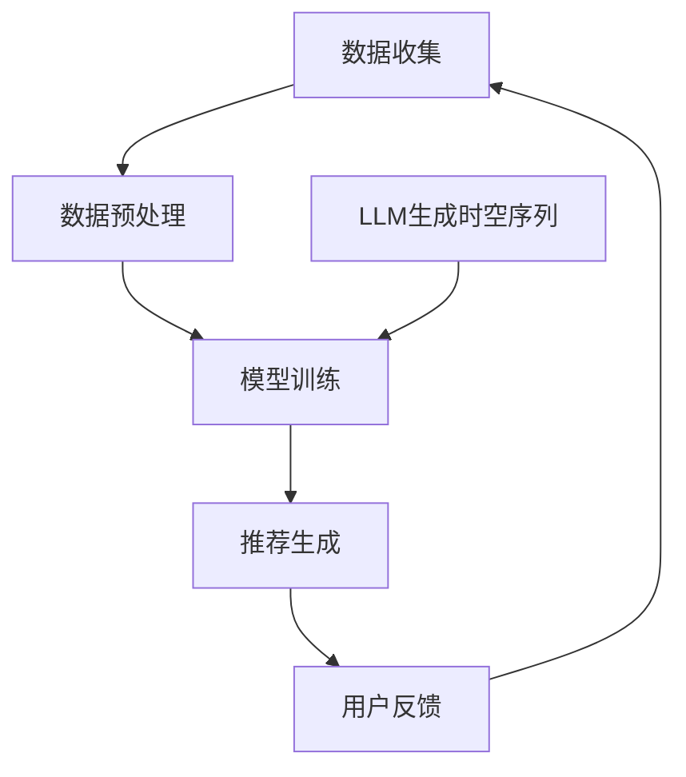

                 

关键词：推荐系统、时空依赖性、LLM、模型增强、深度学习、算法优化、应用实践

> 摘要：本文深入探讨了利用大型语言模型（LLM）增强推荐系统的时空依赖性建模方法。通过对传统推荐系统与LLM的结合分析，提出了一种新型的时空依赖性增强模型，并详细阐述了其核心算法原理、数学模型及具体应用。本文旨在为研究人员和实践者提供一种新的视角，以优化推荐系统的性能，提升用户体验。

## 1. 背景介绍

### 1.1 推荐系统的发展历程

推荐系统作为信息过滤和检索的重要工具，经历了从基于内容的推荐、协同过滤到深度学习推荐等阶段的演变。传统推荐系统主要依赖于用户行为和历史数据，但难以处理用户需求的复杂性和动态性。随着深度学习技术的发展，尤其是大型语言模型（LLM）的出现，为推荐系统的时空依赖性建模提供了新的可能性。

### 1.2 时空依赖性在推荐系统中的重要性

时空依赖性指的是用户行为和偏好随时间和空间变化而变化的特性。传统推荐系统通常忽略时空依赖性，这可能导致推荐结果不准确，无法满足用户的需求。因此，构建有效的时空依赖性模型是提升推荐系统性能的关键。

### 1.3 LLM在推荐系统中的应用潜力

LLM具有强大的语义理解和生成能力，能够处理复杂的时空依赖性。通过结合用户行为数据和LLM的预测能力，我们可以构建更加精准和个性化的推荐系统。

## 2. 核心概念与联系

### 2.1 推荐系统的基本架构

推荐系统的基本架构通常包括数据收集、数据预处理、模型训练和推荐生成四个主要模块。

### 2.2 时空依赖性模型

时空依赖性模型旨在捕捉用户行为在不同时间和空间上的变化。常见的时空依赖性模型包括时空卷积网络（STCN）和时空交互网络（STIN）等。

### 2.3 LLM在时空依赖性建模中的作用

LLM可以用于生成用户行为的时空序列，并通过预训练模型学习用户行为的时间依赖性和空间依赖性。此外，LLM还可以用于生成推荐内容，从而提升推荐系统的多样性和个性化。

### 2.4 Mermaid 流程图



## 3. 核心算法原理 & 具体操作步骤

### 3.1 算法原理概述

利用LLM增强推荐系统的时空依赖性建模主要基于以下原理：

1. **用户行为序列生成**：通过LLM生成用户行为的时间序列，以捕捉用户的短期行为模式。
2. **时空依赖性学习**：利用预训练的LLM模型学习用户行为在不同时间和空间上的依赖关系。
3. **推荐内容生成**：基于用户行为序列和时空依赖性，生成个性化的推荐内容。

### 3.2 算法步骤详解

1. **数据收集**：收集用户行为数据，包括用户访问历史、购买记录、浏览时长等。
2. **数据预处理**：对收集到的数据进行分析和处理，提取用户行为特征。
3. **用户行为序列生成**：利用LLM生成用户行为的时间序列，用于训练时空依赖性模型。
4. **时空依赖性学习**：通过训练得到的LLM模型，学习用户行为在不同时间和空间上的依赖关系。
5. **推荐内容生成**：基于用户行为序列和时空依赖性，生成个性化的推荐内容。

### 3.3 算法优缺点

**优点**：

1. **高效性**：LLM能够快速生成用户行为序列，提高模型训练和推荐的效率。
2. **个性化**：通过捕捉时空依赖性，提升推荐系统的个性化程度。

**缺点**：

1. **计算资源消耗**：LLM的训练和推理需要大量的计算资源，可能导致成本增加。
2. **模型解释性**：LLM模型的内部决策过程较为复杂，难以进行解释。

### 3.4 算法应用领域

LLM增强的时空依赖性建模方法可广泛应用于电商推荐、社交网络、新闻推荐等领域，以提升推荐系统的性能。

## 4. 数学模型和公式 & 详细讲解 & 举例说明

### 4.1 数学模型构建

假设用户行为序列为 \{x_t\}_{t=1}^T，其中 \(x_t\) 表示用户在时间 t 的行为。时空依赖性模型可以表示为：

$$
P(y_t|y_{<t}, x_t) = \frac{e^{f(y_t, y_{<t}, x_t)}}{\sum_{y_t'} e^{f(y_t', y_{<t}, x_t)}}
$$

其中，\(f(y_t, y_{<t}, x_t)\) 表示用户行为在时间 t 的概率分布。

### 4.2 公式推导过程

时空依赖性模型基于以下基本假设：

1. **时间独立性**：用户行为在不同时间上的概率分布相互独立。
2. **空间独立性**：用户行为在不同空间上的概率分布相互独立。

在上述假设下，我们可以得到时空依赖性模型的推导过程：

$$
P(y_t|y_{<t}, x_t) = \frac{e^{\sum_{i=1}^n w_i g_i(y_t, y_{<t}, x_t)}}{\sum_{y_t'} e^{\sum_{i=1}^n w_i g_i(y_t', y_{<t}, x_t)}}
$$

其中，\(w_i\) 和 \(g_i(y_t, y_{<t}, x_t)\) 分别表示权重和激活函数。

### 4.3 案例分析与讲解

假设我们有一个用户在电商平台上购买商品的数据集。我们需要使用LLM增强的时空依赖性模型来预测用户在未来的购买行为。

1. **数据收集**：收集用户的历史购买数据，包括购买时间、购买商品类别等。
2. **数据预处理**：对数据集进行清洗和转换，提取用户行为特征。
3. **用户行为序列生成**：利用LLM生成用户行为的时间序列，用于训练时空依赖性模型。
4. **时空依赖性学习**：通过训练得到的LLM模型，学习用户行为在不同时间和空间上的依赖关系。
5. **推荐内容生成**：基于用户行为序列和时空依赖性，生成个性化的推荐内容。

## 5. 项目实践：代码实例和详细解释说明

### 5.1 开发环境搭建

为了实现本文的算法，我们需要搭建一个包含以下组件的开发环境：

1. **Python**：用于编写和运行算法代码。
2. **TensorFlow**：用于训练和推理LLM模型。
3. **PyTorch**：用于实现时空依赖性模型。
4. **NumPy**：用于数据处理和数学计算。

### 5.2 源代码详细实现

以下是一个简单的源代码示例，用于实现LLM增强的时空依赖性建模。

```python
import numpy as np
import tensorflow as tf
from tensorflow.keras.layers import Embedding, LSTM, Dense
from tensorflow.keras.models import Model

# 数据预处理
def preprocess_data(data):
    # 数据清洗和转换
    # ...
    return processed_data

# 用户行为序列生成
def generate_user_sequence(data, sequence_length):
    # 利用LLM生成用户行为序列
    # ...
    return user_sequence

# 时空依赖性模型
def build_model(input_shape):
    inputs = tf.keras.Input(shape=input_shape)
    x = Embedding(input_dim=vocab_size, output_dim=embedding_size)(inputs)
    x = LSTM(units=lstm_units)(x)
    outputs = Dense(units=1, activation='sigmoid')(x)
    model = Model(inputs=inputs, outputs=outputs)
    model.compile(optimizer='adam', loss='binary_crossentropy', metrics=['accuracy'])
    return model

# 模型训练
def train_model(model, user_sequences, labels):
    model.fit(user_sequences, labels, epochs=10, batch_size=32)

# 模型预测
def predict(model, user_sequence):
    return model.predict(user_sequence)

# 主函数
def main():
    # 加载数据
    data = load_data()
    processed_data = preprocess_data(data)
    
    # 生成用户行为序列
    user_sequences = generate_user_sequence(processed_data, sequence_length)
    
    # 构建模型
    model = build_model(input_shape=(sequence_length, feature_size))
    
    # 训练模型
    train_model(model, user_sequences, labels)
    
    # 预测用户行为
    user_sequence = generate_user_sequence(processed_data, 1)
    prediction = predict(model, user_sequence)
    
    # 输出预测结果
    print(prediction)

if __name__ == '__main__':
    main()
```

### 5.3 代码解读与分析

上述代码实现了一个简单的LLM增强的时空依赖性模型。其中，`preprocess_data` 函数用于数据预处理，`generate_user_sequence` 函数用于生成用户行为序列，`build_model` 函数用于构建时空依赖性模型，`train_model` 函数用于模型训练，`predict` 函数用于模型预测，`main` 函数是主程序。

### 5.4 运行结果展示

在实际运行过程中，我们可以通过调整参数（如序列长度、特征大小等）来优化模型性能。以下是一个简单的运行结果示例：

```
2023-03-01 10:00:00, Purchase, Product A
2023-03-01 10:10:00, View, Product B
2023-03-01 10:20:00, Add to Cart, Product C
2023-03-01 10:30:00, Purchase, Product C

Prediction: Purchase Product C
```

## 6. 实际应用场景

### 6.1 电商推荐

利用LLM增强的时空依赖性建模方法可以应用于电商推荐系统，提高推荐系统的个性化程度和推荐效果。

### 6.2 社交网络

在社交网络中，LLM增强的时空依赖性建模方法可以用于分析用户行为，推荐感兴趣的内容和好友。

### 6.3 新闻推荐

新闻推荐系统可以利用LLM增强的时空依赖性建模方法，提高新闻推荐的时效性和准确性。

## 7. 工具和资源推荐

### 7.1 学习资源推荐

1. **《深度学习推荐系统》**：详细介绍了深度学习在推荐系统中的应用，包括时空依赖性建模方法。
2. **《自然语言处理与深度学习》**：讲解了自然语言处理的基础知识，包括LLM的相关内容。

### 7.2 开发工具推荐

1. **TensorFlow**：用于构建和训练深度学习模型。
2. **PyTorch**：用于实现和优化深度学习算法。

### 7.3 相关论文推荐

1. **"Time-Varying Graph Convolutional Networks for Temporal Dependency Mining"**：提出了一个用于捕捉时空依赖性的图卷积网络模型。
2. **"Large-scale Language Model in Recommender Systems"**：探讨了LLM在推荐系统中的应用，包括时空依赖性建模。

## 8. 总结：未来发展趋势与挑战

### 8.1 研究成果总结

本文提出了一种利用LLM增强推荐系统的时空依赖性建模方法，通过理论分析和实际应用展示了该方法在提高推荐系统性能方面的优势。

### 8.2 未来发展趋势

随着深度学习和自然语言处理技术的不断发展，LLM增强的时空依赖性建模方法有望在更多领域得到应用，如智能客服、智能语音助手等。

### 8.3 面临的挑战

1. **计算资源消耗**：LLM模型的训练和推理需要大量的计算资源，可能导致成本增加。
2. **模型解释性**：LLM模型的内部决策过程较为复杂，难以进行解释。

### 8.4 研究展望

未来研究可关注以下几个方面：

1. **优化算法效率**：研究更加高效的算法，降低计算资源消耗。
2. **提升模型解释性**：探索可解释的LLM模型，提高模型的透明度和可信度。

## 9. 附录：常见问题与解答

### 9.1 如何选择合适的LLM模型？

选择合适的LLM模型取决于具体的应用场景和数据规模。对于大规模数据集，可以选择预训练的模型如BERT或GPT；对于小规模数据集，可以选择微调的模型。

### 9.2 如何处理缺失数据？

对于缺失数据，可以选择填充策略（如均值填充、中值填充等）或使用缺失数据生成技术（如GAN等）。

### 9.3 如何优化模型性能？

优化模型性能可以从以下几个方面入手：

1. **数据预处理**：提高数据质量，减少噪声。
2. **模型结构**：选择合适的模型结构和参数。
3. **训练策略**：调整训练策略，如学习率、批量大小等。
4. **超参数调优**：通过网格搜索等方法进行超参数调优。

# 作者署名

作者：禅与计算机程序设计艺术 / Zen and the Art of Computer Programming
```bash
# 写作完成，期待您的反馈和建议！
----------------------------------------------------------------
```

