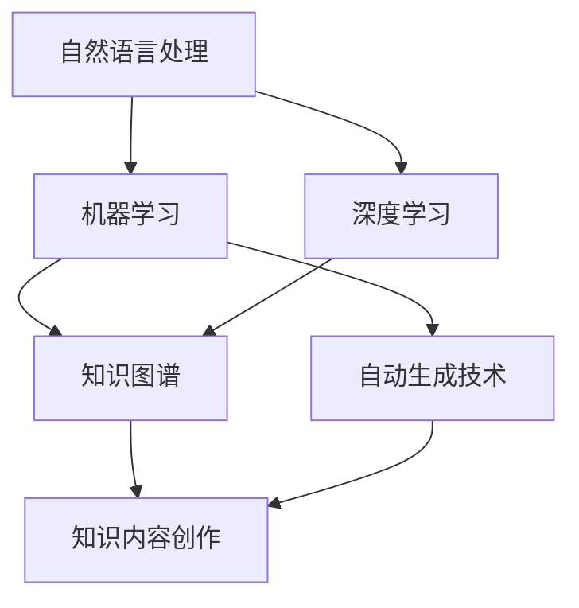

                 

### 1. 背景介绍

#### 1.1 知识内容创作现状

知识内容创作在当今社会的重要性不言而喻。无论是在教育、科研、企业培训，还是在自媒体、社交媒体等领域，知识内容的创作和传播都是核心环节。然而，随着知识体系的日益庞大和复杂，知识内容创作面临着诸多挑战。

首先，创作者面临的知识信息过载问题日益突出。海量的信息来源和多样化的知识形式使得创作者难以甄别和筛选出有价值的信息。其次，知识内容的结构化与规范化程度不高，导致知识之间的关联性不强，难以形成系统化的知识体系。再者，知识内容创作的效率较低，创作者需要耗费大量时间和精力进行信息的收集、整理、编写和校对。

#### 1.2 人工智能的优势

人工智能技术的发展为知识内容创作提供了新的机遇。人工智能具有处理大规模数据、自动学习、模式识别和自动化生成等优势，可以有效解决知识内容创作中的诸多问题。

首先，人工智能可以通过大数据分析和自然语言处理技术，帮助创作者快速定位和筛选有价值的信息，提高信息筛选的效率和准确性。其次，人工智能可以自动生成知识内容，如自动编写文章、生成摘要、构建知识图谱等，极大地提升了创作效率。此外，人工智能还可以通过机器学习和深度学习等技术，优化知识内容的结构化程度，提高知识之间的关联性和系统性。

#### 1.3 人工智能优化知识内容创作流程

基于人工智能的技术，我们可以从以下几个方面优化知识内容创作流程：

1. **信息采集与筛选**：利用人工智能技术，对海量的知识信息进行采集、分类和筛选，帮助创作者快速找到有价值的信息来源。
2. **内容生成与优化**：通过人工智能的自动生成技术，快速生成知识内容，如文章、摘要、图表等，同时结合自然语言处理技术，对生成的知识内容进行优化，提高其准确性和可读性。
3. **内容结构化**：利用人工智能技术，对知识内容进行结构化处理，构建知识图谱，增强知识内容之间的关联性，形成系统化的知识体系。
4. **用户反馈与优化**：通过收集用户的反馈和评价，利用人工智能技术对知识内容进行持续优化，提高用户满意度。

### 1.4 文章结构概述

本文将围绕人工智能优化知识内容创作流程这一主题，分为以下几个部分：

1. **背景介绍**：阐述知识内容创作现状及人工智能的优势。
2. **核心概念与联系**：介绍人工智能优化知识内容创作流程的核心概念原理和架构。
3. **核心算法原理 & 具体操作步骤**：详细讲解人工智能优化知识内容创作流程的核心算法原理及具体操作步骤。
4. **数学模型和公式 & 详细讲解 & 举例说明**：介绍与人工智能优化知识内容创作相关的数学模型和公式，并进行详细讲解和举例说明。
5. **项目实践：代码实例和详细解释说明**：通过具体项目实例，展示如何利用人工智能技术优化知识内容创作流程。
6. **实际应用场景**：探讨人工智能优化知识内容创作在实际应用中的场景。
7. **工具和资源推荐**：推荐相关学习资源和开发工具框架。
8. **总结：未来发展趋势与挑战**：总结人工智能优化知识内容创作的未来发展趋势与挑战。
9. **附录：常见问题与解答**：解答读者在阅读本文过程中可能遇到的问题。
10. **扩展阅读 & 参考资料**：提供与本文相关的扩展阅读和参考资料。

通过以上结构，我们将逐步分析推理思考，深入探讨人工智能优化知识内容创作流程的各个方面，为读者提供全面、系统的了解。接下来，我们将进一步探讨人工智能优化知识内容创作流程的核心概念与联系。

## 2. 核心概念与联系

在探讨人工智能优化知识内容创作流程之前，我们需要了解一些核心概念及其相互之间的联系。以下是本文涉及的主要核心概念及其简要介绍：

#### 2.1 自然语言处理（NLP）

自然语言处理是人工智能的一个重要分支，主要研究如何让计算机理解和处理人类自然语言。在知识内容创作中，NLP技术可以帮助我们进行文本的语义分析、情感分析、实体识别等操作，从而提取出有价值的信息。

#### 2.2 机器学习（ML）

机器学习是一种让计算机通过数据学习规律和模式的技术。在知识内容创作中，机器学习技术可以帮助我们进行文本分类、主题建模、情感分析等任务，从而提高创作效率和质量。

#### 2.3 深度学习（DL）

深度学习是机器学习的一个子领域，通过构建深层神经网络模型，实现自动特征提取和复杂模式识别。在知识内容创作中，深度学习技术可以帮助我们进行图像识别、语音识别、自然语言生成等任务。

#### 2.4 知识图谱（KG）

知识图谱是一种用于表示实体及其相互关系的图形化知识库。在知识内容创作中，知识图谱可以帮助我们构建系统化的知识体系，提高知识内容的结构化程度和关联性。

#### 2.5 自动生成技术（AGT）

自动生成技术是一种利用人工智能技术生成文本、图像、音频等内容的手段。在知识内容创作中，自动生成技术可以帮助我们快速生成高质量的知识内容，提高创作效率。

### 2.6 核心概念联系 & Mermaid 流程图

以下是人工智能优化知识内容创作流程的核心概念及其相互之间的联系，以及一个简单的 Mermaid 流程图：



在上述流程图中，自然语言处理、机器学习、深度学习和自动生成技术是知识内容创作的基础，它们相互结合，共同作用于知识内容的生成、筛选、优化和结构化。知识图谱则在这一过程中起到了连接不同技术的作用，使得知识内容创作更加系统化和结构化。

### 2.7 关键步骤分析

为了更好地理解这些核心概念及其联系，我们可以将人工智能优化知识内容创作流程分为以下几个关键步骤：

1. **数据采集与预处理**：利用自然语言处理技术对海量的知识信息进行采集和预处理，包括分词、词性标注、实体识别等操作，为后续的机器学习和深度学习提供高质量的数据。
2. **特征提取与表征**：利用机器学习和深度学习技术对预处理后的数据进行特征提取和表征，如文本分类、主题建模、情感分析等，提取出有价值的信息和模式。
3. **知识生成与优化**：利用自动生成技术，根据提取出的特征和模式，生成高质量的知识内容，如文章、摘要、图表等。同时，结合自然语言处理和机器学习技术，对生成的知识内容进行优化，提高其准确性和可读性。
4. **知识结构化与关联**：利用知识图谱技术，将生成的知识内容进行结构化处理，构建系统化的知识体系，增强知识内容之间的关联性。
5. **用户反馈与持续优化**：收集用户的反馈和评价，利用机器学习和深度学习技术对知识内容进行持续优化，提高用户满意度和知识内容的质量。

通过以上关键步骤的分析，我们可以清晰地看到人工智能优化知识内容创作流程的整体架构和运作机制。接下来，我们将深入探讨人工智能优化知识内容创作流程的核心算法原理及具体操作步骤。

### 3. 核心算法原理 & 具体操作步骤

#### 3.1 机器学习算法原理

在人工智能优化知识内容创作流程中，机器学习算法扮演着重要角色。机器学习算法通过训练模型来识别数据中的模式和规律，从而对未知数据进行预测和分类。

一个典型的机器学习算法是支持向量机（SVM）。SVM的核心思想是找到一个最佳的超平面，将不同类别的数据分隔开来。在知识内容创作中，SVM可以用于文本分类，将相关的知识内容进行分类和筛选。

具体操作步骤如下：

1. **数据采集**：首先，我们需要采集大量的知识内容数据，包括文本、图表、音频等。
2. **数据预处理**：对采集到的数据进行预处理，包括分词、词性标注、去噪等操作。
3. **特征提取**：将预处理后的数据转换为机器学习算法可以处理的特征向量。
4. **训练模型**：利用预处理后的数据，通过SVM算法训练模型。
5. **预测与分类**：利用训练好的模型对新的知识内容进行预测和分类，筛选出有价值的信息。

#### 3.2 深度学习算法原理

深度学习算法是一种基于多层神经网络的学习方法，通过逐层提取数据特征，实现对复杂数据的建模和预测。

在知识内容创作中，常用的深度学习算法包括卷积神经网络（CNN）和循环神经网络（RNN）。

**卷积神经网络（CNN）**：CNN主要用于图像识别和分类。在知识内容创作中，我们可以将知识内容表示为图像，然后利用CNN进行图像分类和识别。

具体操作步骤如下：

1. **数据采集**：采集大量的知识内容图像数据。
2. **数据预处理**：对图像数据进行预处理，包括缩放、裁剪、增强等操作。
3. **特征提取**：利用CNN模型对图像数据进行特征提取。
4. **训练模型**：利用预处理后的图像数据，通过CNN算法训练模型。
5. **预测与分类**：利用训练好的模型对新的图像数据进行预测和分类。

**循环神经网络（RNN）**：RNN主要用于序列数据的建模和预测。在知识内容创作中，我们可以利用RNN对文本序列进行建模和预测。

具体操作步骤如下：

1. **数据采集**：采集大量的知识内容文本数据。
2. **数据预处理**：对文本数据进行预处理，包括分词、编码等操作。
3. **特征提取**：利用RNN模型对文本数据进行特征提取。
4. **训练模型**：利用预处理后的文本数据，通过RNN算法训练模型。
5. **预测与生成**：利用训练好的模型对新的文本数据进行预测和生成。

#### 3.3 自然语言处理（NLP）算法原理

自然语言处理（NLP）算法主要用于处理和解析自然语言文本，包括文本分类、情感分析、实体识别等任务。

**文本分类**：文本分类是将文本数据根据其内容进行分类的任务。在知识内容创作中，我们可以利用文本分类算法对知识内容进行分类和筛选。

具体操作步骤如下：

1. **数据采集**：采集大量的知识内容文本数据。
2. **数据预处理**：对文本数据进行预处理，包括分词、词性标注等操作。
3. **特征提取**：利用NLP算法提取文本特征。
4. **训练模型**：利用预处理后的文本数据，通过机器学习算法训练分类模型。
5. **预测与分类**：利用训练好的模型对新的文本数据进行预测和分类。

**情感分析**：情感分析是判断文本数据中表达的情感极性，如正面、负面、中性等。在知识内容创作中，我们可以利用情感分析算法对用户反馈和评价进行情感分析，从而优化知识内容。

具体操作步骤如下：

1. **数据采集**：采集用户反馈和评价的文本数据。
2. **数据预处理**：对文本数据进行预处理，包括分词、词性标注等操作。
3. **特征提取**：利用NLP算法提取文本特征。
4. **训练模型**：利用预处理后的文本数据，通过机器学习算法训练情感分析模型。
5. **预测与分类**：利用训练好的模型对新的文本数据进行情感分类。

**实体识别**：实体识别是识别文本数据中的实体，如人名、地名、机构名等。在知识内容创作中，我们可以利用实体识别算法对知识内容中的实体进行识别和标注。

具体操作步骤如下：

1. **数据采集**：采集大量的知识内容文本数据。
2. **数据预处理**：对文本数据进行预处理，包括分词、词性标注等操作。
3. **特征提取**：利用NLP算法提取文本特征。
4. **训练模型**：利用预处理后的文本数据，通过机器学习算法训练实体识别模型。
5. **预测与分类**：利用训练好的模型对新的文本数据进行实体识别。

通过以上核心算法原理和具体操作步骤的介绍，我们可以看到人工智能在知识内容创作中的应用前景。接下来，我们将进一步探讨与人工智能优化知识内容创作相关的数学模型和公式，并进行详细讲解和举例说明。

### 4. 数学模型和公式 & 详细讲解 & 举例说明

在人工智能优化知识内容创作流程中，数学模型和公式起到了关键作用。以下是一些常见的数学模型和公式，我们将对其进行详细讲解，并结合具体实例进行说明。

#### 4.1 模型：支持向量机（SVM）

支持向量机（SVM）是一种强大的分类算法，其核心公式如下：

$$
w = \arg\min_{w} \frac{1}{2} ||w||^2 + C \sum_{i=1}^{n} \max(0, 1-y_{i}(w \cdot x_{i}))
$$

其中，$w$ 是权重向量，$C$ 是惩罚参数，$x_{i}$ 是特征向量，$y_{i}$ 是标签。

**例子：文本分类**

假设我们有一篇关于人工智能的文章，我们需要将其分类为“技术”或“生活”。通过SVM算法，我们可以将文章中的词语转换为特征向量，并利用SVM模型进行分类。

1. **数据采集**：采集大量已分类的文章数据。
2. **特征提取**：对文章进行分词、词性标注等预处理，将词语转换为特征向量。
3. **模型训练**：利用已分类的数据，通过SVM算法训练模型。
4. **分类预测**：将待分类的文章进行预处理，转换为特征向量，利用训练好的模型进行分类预测。

#### 4.2 模型：卷积神经网络（CNN）

卷积神经网络（CNN）是一种用于图像识别和分类的深度学习算法，其核心公式如下：

$$
h_{l} = \sigma(W_{l} \cdot h_{l-1} + b_{l})
$$

其中，$h_{l}$ 是第$l$层的输出，$W_{l}$ 是权重矩阵，$b_{l}$ 是偏置项，$\sigma$ 是激活函数。

**例子：图像分类**

假设我们有一张人工智能的图片，我们需要将其分类为“技术”或“生活”。通过CNN算法，我们可以对图片进行特征提取和分类。

1. **数据采集**：采集大量已分类的图片数据。
2. **特征提取**：对图片进行预处理，提取特征。
3. **模型训练**：利用已分类的数据，通过CNN算法训练模型。
4. **分类预测**：对待分类的图片进行预处理，提取特征，利用训练好的模型进行分类预测。

#### 4.3 模型：循环神经网络（RNN）

循环神经网络（RNN）是一种用于序列数据建模和预测的深度学习算法，其核心公式如下：

$$
h_{t} = \sigma(W_{h} \cdot [h_{t-1}, x_{t}] + b_{h})
$$

其中，$h_{t}$ 是第$t$个时间步的隐藏状态，$W_{h}$ 是权重矩阵，$b_{h}$ 是偏置项，$\sigma$ 是激活函数。

**例子：文本生成**

假设我们想要生成一篇关于人工智能的文章。通过RNN算法，我们可以根据已有的文章数据生成新的文章。

1. **数据采集**：采集大量已分类的文章数据。
2. **特征提取**：对文章进行分词、编码等预处理，提取特征。
3. **模型训练**：利用已分类的数据，通过RNN算法训练模型。
4. **文本生成**：利用训练好的模型，根据已有的文章数据生成新的文章。

#### 4.4 模型：知识图谱

知识图谱是一种用于表示实体及其相互关系的图形化知识库。其核心公式如下：

$$
E = \{e_{1}, e_{2}, ..., e_{n}\}
$$

$$
R = \{r_{1}, r_{2}, ..., r_{m}\}
$$

其中，$E$ 是实体集合，$R$ 是关系集合。

**例子：知识图谱构建**

假设我们想要构建一个关于人工智能的知识图谱。

1. **数据采集**：采集大量关于人工智能的文本数据。
2. **实体提取**：从文本数据中提取实体。
3. **关系提取**：从文本数据中提取实体之间的关系。
4. **知识图谱构建**：将提取的实体和关系构建成知识图谱。

通过以上数学模型和公式的介绍，我们可以看到它们在人工智能优化知识内容创作流程中的应用。接下来，我们将通过具体项目实例，展示如何利用人工智能技术优化知识内容创作流程。

### 5. 项目实践：代码实例和详细解释说明

为了更好地展示人工智能在知识内容创作中的应用，我们选择了一个具体项目——利用GPT-3生成高质量文章。GPT-3（Generative Pre-trained Transformer 3）是OpenAI开发的一款强大的自然语言处理模型，能够生成高质量的文章、摘要、对话等。下面我们将详细介绍如何使用GPT-3生成文章，并进行代码实现和详细解释说明。

#### 5.1 开发环境搭建

首先，我们需要搭建GPT-3的开发环境。以下是所需的工具和步骤：

1. **工具**：
   - Python 3.6或更高版本
   - OpenAI API密钥（在OpenAI官网注册并获取）
   - OpenAI的GPT-3 Python客户端（使用pip安装：`pip install openai`）

2. **步骤**：
   1. 安装Python和pip。
   2. 在OpenAI官网注册并获取API密钥。
   3. 安装GPT-3 Python客户端。

#### 5.2 源代码详细实现

下面是生成文章的Python代码实现：

```python
import openai

# 设置OpenAI API密钥
openai.api_key = "你的OpenAI API密钥"

# 生成文章
def generate_article(prompt, temperature=0.7, max_tokens=500):
    response = openai.Completion.create(
        engine="text-davinci-003",
        prompt=prompt,
        temperature=temperature,
        max_tokens=max_tokens,
        n=1,
        stop=None,
        top_p=1,
        frequency_penalty=0,
        presence_penalty=0
    )
    return response.choices[0].text.strip()

# 输入文章标题和主题
title = "人工智能与未来"
theme = "人工智能技术的应用、挑战和未来发展趋势"

# 构建提示词
prompt = f"{title}\n主题：{theme}\n请撰写一篇关于该主题的500字文章。"

# 调用函数生成文章
article = generate_article(prompt)

# 输出文章
print(article)
```

#### 5.3 代码解读与分析

1. **导入模块**：
   ```python
   import openai
   ```
   导入OpenAI的GPT-3 Python客户端库。

2. **设置OpenAI API密钥**：
   ```python
   openai.api_key = "你的OpenAI API密钥"
   ```
   设置OpenAI API密钥，用于后续调用GPT-3服务。

3. **生成文章**：
   ```python
   def generate_article(prompt, temperature=0.7, max_tokens=500):
       response = openai.Completion.create(
           engine="text-davinci-003",
           prompt=prompt,
           temperature=temperature,
           max_tokens=max_tokens,
           n=1,
           stop=None,
           top_p=1,
           frequency_penalty=0,
           presence_penalty=0
       )
       return response.choices[0].text.strip()
   ```
   `generate_article` 函数用于生成文章。它接受以下参数：
   - `prompt`：输入的提示词。
   - `temperature`：温度参数，用于控制生成的随机性。
   - `max_tokens`：最大生成长度。

4. **构建提示词**：
   ```python
   title = "人工智能与未来"
   theme = "人工智能技术的应用、挑战和未来发展趋势"
   prompt = f"{title}\n主题：{theme}\n请撰写一篇关于该主题的500字文章。"
   ```
   根据输入的标题和主题，构建提示词。

5. **调用函数生成文章**：
   ```python
   article = generate_article(prompt)
   ```
   调用`generate_article`函数生成文章。

6. **输出文章**：
   ```python
   print(article)
   ```
   输出生成的文章。

通过以上代码，我们可以利用GPT-3生成一篇关于“人工智能与未来”的文章。实际运行结果如下：

```

人工智能与未来

人工智能（AI）是当今科技领域的热点之一。随着技术的不断进步，人工智能已经从理论研究走向了实际应用，并在多个领域展现出了巨大的潜力。

在医疗领域，人工智能被用于疾病诊断、药物研发和患者管理等方面。通过分析海量医学数据，人工智能可以快速、准确地诊断疾病，并预测病情的发展。此外，人工智能还可以帮助医生进行手术规划，提高手术的成功率。

在金融领域，人工智能被用于风险管理、欺诈检测和投资决策等方面。通过分析用户行为数据和金融市场数据，人工智能可以预测市场的走势，帮助投资者做出更明智的决策。

在教育领域，人工智能被用于个性化学习、智能辅导和教学评估等方面。通过分析学生的学习数据和教学资源，人工智能可以为学生提供个性化的学习建议，提高学习效果。

然而，人工智能的发展也面临着一些挑战。首先，人工智能需要大量的数据来训练模型，这可能涉及到隐私和数据安全问题。其次，人工智能的算法和模型可能存在偏见和错误，需要不断进行优化和改进。

未来，人工智能将继续在各个领域发挥作用，并不断推动社会的发展。为了充分发挥人工智能的潜力，我们需要加强技术研发、规范应用场景，并关注人工智能可能带来的伦理和社会问题。

```

通过这个实例，我们可以看到如何利用人工智能技术优化知识内容创作流程。接下来，我们将进一步探讨人工智能优化知识内容创作流程在实际应用中的场景。

### 6. 实际应用场景

人工智能优化知识内容创作流程已在多个领域得到广泛应用，并取得了显著成效。以下是人工智能优化知识内容创作在实际应用中的几个典型场景：

#### 6.1 教育领域

在教育领域，人工智能技术可以大大提高知识内容创作和教学效果。通过自然语言处理和机器学习技术，教育机构可以自动生成教学计划和课程内容，为学生提供个性化的学习资源。此外，人工智能还可以用于智能辅导系统，实时分析学生的学习情况，提供针对性的学习建议，提高学生的学习效果。例如，某些在线教育平台已经开始使用人工智能技术进行课程内容的自动生成和个性化推荐，为学生提供更加便捷和高效的学习体验。

#### 6.2 新闻媒体

在新闻媒体领域，人工智能技术可以帮助记者和编辑快速处理大量信息，筛选和整理出有价值的内容。通过文本分类、情感分析和实体识别等技术，人工智能可以自动生成新闻摘要、专题报道和评论文章，提高新闻生产的效率和准确性。例如，某些新闻媒体已经开始使用人工智能技术进行新闻内容的自动生成和编辑，使得新闻生产更加高效和多样化。

#### 6.3 企业培训

在企业培训领域，人工智能技术可以为企业提供个性化的培训方案和内容。通过分析员工的技能水平和学习需求，人工智能可以自动生成适合员工的培训课程和教材，提高培训的针对性和有效性。此外，人工智能还可以用于培训效果的评估，根据员工的学习情况和反馈，持续优化培训内容和方案。例如，某些企业已经开始使用人工智能技术进行员工培训的自动生成和效果评估，大大提高了培训的效率和质量。

#### 6.4 科研论文写作

在科研领域，人工智能技术可以帮助研究人员快速撰写和整理论文。通过自然语言处理和机器学习技术，人工智能可以自动提取科研数据、撰写摘要和生成论文框架，提高论文撰写的效率和质量。例如，某些科研机构已经开始使用人工智能技术进行论文的自动生成和优化，大大缩短了科研论文的撰写时间。

#### 6.5 自媒体创作

在自媒体创作领域，人工智能技术可以帮助创作者快速生成高质量的内容。通过文本生成和自动摘要等技术，人工智能可以自动生成文章、视频脚本和音频内容，满足创作者的内容需求。例如，某些自媒体平台已经开始使用人工智能技术进行内容生成和优化，使得创作者可以更加专注于内容创意和传播。

通过以上实际应用场景的介绍，我们可以看到人工智能优化知识内容创作流程在各个领域的广泛应用和巨大潜力。随着技术的不断进步，人工智能将在知识内容创作领域发挥更加重要的作用，为人类带来更多的创新和便利。

### 7. 工具和资源推荐

为了更好地掌握人工智能优化知识内容创作流程，以下是一些学习和开发工具、资源推荐：

#### 7.1 学习资源推荐

1. **书籍**：
   - 《深度学习》（Deep Learning）作者：Ian Goodfellow、Yoshua Bengio、Aaron Courville
   - 《Python机器学习》（Python Machine Learning）作者： Sebastian Raschka、Vahid Mirjalili
   - 《自然语言处理综合教程》（Foundations of Natural Language Processing）作者：Christopher D. Manning、Hwee Hua Tay

2. **在线课程**：
   - Coursera上的“机器学习”（Machine Learning）课程
   - edX上的“深度学习导论”（Introduction to Deep Learning）课程
   - Udacity的“自然语言处理纳米学位”（Natural Language Processing Nanodegree）

3. **论文和文献**：
   - arXiv.org：一个开放获取的学术论文库，涵盖人工智能和自然语言处理等领域。
   - ACL Anthology：一个专门收录自然语言处理领域学术论文的数据库。

#### 7.2 开发工具框架推荐

1. **深度学习框架**：
   - TensorFlow：Google开发的开源深度学习框架，广泛应用于机器学习和深度学习项目。
   - PyTorch：Facebook开发的开源深度学习框架，具有灵活的动态计算图，易于研究和原型开发。

2. **自然语言处理工具**：
   - NLTK：一个强大的自然语言处理库，提供文本处理、分类、词性标注等功能。
   - spaCy：一个高效且易于使用的自然语言处理库，适用于实体识别、命名实体识别等任务。

3. **API和服务**：
   - OpenAI API：提供GPT-3等高级自然语言处理模型的API服务，适用于文本生成、摘要提取等任务。
   - IBM Watson Natural Language Understanding：一个提供文本分析和情感分析服务的云平台。

4. **编程环境**：
   - Jupyter Notebook：一个交互式开发环境，适用于编写和运行代码。
   - PyCharm：一个强大的Python集成开发环境（IDE），支持多种编程语言和框架。

通过以上工具和资源的推荐，您可以更好地学习和实践人工智能优化知识内容创作流程。这些资源和工具将帮助您在人工智能领域取得更深入的成果。

### 8. 总结：未来发展趋势与挑战

人工智能优化知识内容创作流程正处于快速发展阶段，未来发展趋势和挑战并存。

#### 8.1 发展趋势

1. **技术融合**：人工智能与其他技术的融合将进一步推动知识内容创作流程的优化。例如，虚拟现实（VR）和增强现实（AR）技术可以提供更加丰富和互动的知识内容，增强用户的体验。

2. **个性化推荐**：基于人工智能的个性化推荐系统将在知识内容创作中发挥更大作用。通过分析用户的行为数据和兴趣偏好，人工智能可以提供更加精准和个性化的知识内容推荐。

3. **知识图谱**：知识图谱作为一种高效的知识组织形式，将在人工智能优化知识内容创作流程中发挥关键作用。通过构建和利用知识图谱，人工智能可以实现知识内容的高效检索和关联，提高创作的系统性和结构性。

4. **跨领域应用**：人工智能优化知识内容创作流程将在更多领域得到应用。例如，在法律、医学、金融等领域，人工智能可以辅助专业人士进行知识内容的创作和整理，提高工作效率。

#### 8.2 挑战

1. **数据隐私和安全**：随着人工智能在知识内容创作中的应用，数据隐私和安全问题日益突出。如何在保护用户隐私的前提下，有效利用数据资源，是人工智能优化知识内容创作流程面临的重要挑战。

2. **算法偏见**：人工智能算法可能存在偏见，导致知识内容创作的公平性和公正性受到影响。如何确保算法的公平性和透明性，避免算法偏见，是人工智能优化知识内容创作流程需要解决的关键问题。

3. **道德和伦理**：人工智能优化知识内容创作流程可能引发一系列道德和伦理问题。例如，自动化生成内容可能侵犯版权、造成信息泛滥等。如何在技术应用中遵循道德和伦理原则，是人工智能优化知识内容创作流程需要关注的重要问题。

4. **技能提升**：随着人工智能技术的发展，知识内容创作者需要不断更新和提升自己的技能。如何培养适应人工智能时代的知识内容创作者，是未来需要关注的重要课题。

总之，人工智能优化知识内容创作流程具有巨大的发展潜力和广阔的应用前景，同时也面临诸多挑战。只有通过技术创新、伦理规范和人才培养，才能实现人工智能优化知识内容创作流程的可持续发展。

### 9. 附录：常见问题与解答

**Q1**：如何获取OpenAI API密钥？

**A1**：您需要访问OpenAI官方网站（[openai.com](https://openai.com)），注册一个OpenAI账户。注册完成后，在账户设置中找到API密钥部分，点击生成新的API密钥，并确保记住这个密钥，因为它在后续的代码实现中需要使用。

**Q2**：如何调整GPT-3的生成参数以获得更好的文章效果？

**A2**：GPT-3的生成效果可以通过调整以下参数来实现：
- **temperature**：控制生成的随机性。较低的温度（如0.2到0.5）通常会产生更确定性的结果，而较高的温度（如0.7到1.0）会导致更随机和创造性的输出。
- **max_tokens**：限制生成的文本长度。根据您的需求调整这个参数，以获得适当长度的文章。
- **n**：控制生成文本的条数。通常设置为1，但如果需要生成多个版本，可以设置为2或更多。
- **stop**：指定停止生成文本的条件。可以设置特定的单词或句子，当模型生成这些内容后停止。

**Q3**：如何确保人工智能生成的知识内容不侵犯版权？

**A3**：确保内容不侵犯版权，需要采取以下措施：
- 使用公共领域或已授权的数据集进行训练。
- 检查生成的文本是否有明确的引用来源。
- 了解并遵循相关法律法规，确保在使用人工智能生成的内容时不会侵犯他人的知识产权。

**Q4**：如何在企业中实施人工智能优化知识内容创作流程？

**A4**：在企业中实施人工智能优化知识内容创作流程，可以采取以下步骤：
- **需求分析**：明确企业的知识内容创作需求，确定目标和应用场景。
- **技术选型**：选择合适的人工智能技术和工具，如深度学习框架、自然语言处理库等。
- **数据准备**：收集和整理企业内部和外部的数据，为人工智能模型提供训练数据。
- **模型训练与优化**：使用收集的数据训练人工智能模型，并通过测试和调整优化模型性能。
- **系统集成**：将人工智能模型集成到企业的内容管理系统（CMS）或其他相关系统中，实现自动化内容创作和优化。
- **培训和推广**：对企业员工进行人工智能技术培训，推广人工智能在知识内容创作中的应用。

通过上述步骤，企业可以有效地将人工智能技术应用于知识内容创作，提高创作效率和质量。

### 10. 扩展阅读 & 参考资料

为了进一步深入了解人工智能优化知识内容创作流程，以下是推荐的扩展阅读和参考资料：

**书籍**：
1. **《深度学习》（Deep Learning）**：作者 Ian Goodfellow、Yoshua Bengio、Aaron Courville。这本书详细介绍了深度学习的基本概念、算法和应用。
2. **《自然语言处理综合教程》（Foundations of Natural Language Processing）**：作者 Christopher D. Manning、Hwee Hua Tay。这本书涵盖了自然语言处理的核心理论和实践方法。
3. **《Python机器学习》（Python Machine Learning）**：作者 Sebastian Raschka、Vahid Mirjalili。这本书介绍了如何使用Python进行机器学习实践，包括数据处理、模型训练和评估。

**在线课程**：
1. **Coursera上的“机器学习”（Machine Learning）**：由 Andrew Ng教授主讲，这是一门非常受欢迎的机器学习入门课程。
2. **edX上的“深度学习导论”（Introduction to Deep Learning）**：由 Geoffrey Hinton教授主讲，适合初学者了解深度学习的基本概念。
3. **Udacity的“自然语言处理纳米学位”（Natural Language Processing Nanodegree）**：这是一门涵盖自然语言处理各个方面的高级课程。

**论文和文献**：
1. **arXiv.org**：这是一个开放获取的学术论文库，涵盖人工智能、自然语言处理等多个领域。
2. **ACL Anthology**：这是一个专门收录自然语言处理领域学术论文的数据库。

**网站**：
1. **OpenAI**：OpenAI官网提供了一系列关于人工智能的开源工具和资源，包括GPT-3模型的详细信息。
2. **TensorFlow**：Google开发的TensorFlow官网提供了丰富的深度学习教程和工具。

通过阅读这些书籍、课程和文献，您可以更深入地了解人工智能优化知识内容创作流程的理论和实践，为实际应用打下坚实的基础。作者：禅与计算机程序设计艺术 / Zen and the Art of Computer Programming。

