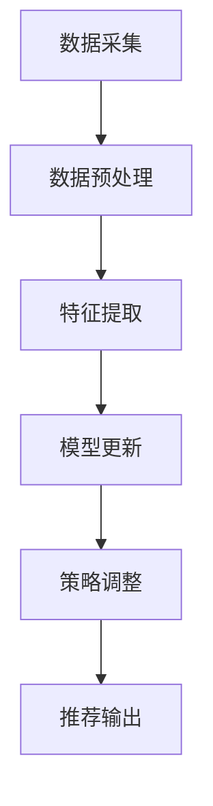

                 

关键词：大模型，推荐系统，实时反馈，数据挖掘，用户行为分析

摘要：随着互联网和大数据技术的不断发展，推荐系统已成为提升用户体验的重要手段。然而，传统的推荐系统在处理实时反馈方面存在一些局限性。本文将探讨如何利用大模型改进推荐系统的实时反馈处理能力，提升系统的智能化水平和用户满意度。

## 1. 背景介绍

推荐系统作为信息过滤和内容分发的关键技术，已广泛应用于电子商务、社交媒体、视频流媒体等多个领域。传统的推荐系统主要依赖历史用户行为数据，通过统计学习算法或深度学习模型预测用户兴趣，从而实现个性化推荐。然而，这些系统在处理实时反馈方面存在以下问题：

- **延迟性**：传统推荐系统往往需要一定时间来更新模型和调整推荐策略，无法及时响应用户的最新需求。
- **数据依赖**：推荐系统对历史数据依赖较高，对于新用户或冷启动问题难以有效应对。
- **效率问题**：大规模数据和高频次的用户行为更新可能导致系统性能下降。

针对以上问题，本文提出利用大模型改进推荐系统的实时反馈处理能力，旨在提升系统的实时性、灵活性和适应性。

## 2. 核心概念与联系

### 2.1 大模型的定义

大模型（Large-scale Model）是指具有大规模参数和计算能力的机器学习模型，如Transformer、BERT等。大模型通过学习海量数据，可以捕捉到复杂的用户行为模式和兴趣点，从而提高推荐系统的预测准确性和泛化能力。

### 2.2 实时反馈处理

实时反馈处理是指推荐系统在用户产生行为后，立即对模型进行更新和调整，以快速响应用户的最新需求。实时反馈处理包括以下几个关键环节：

- **实时数据采集**：通过日志系统、API接口等方式收集用户的实时行为数据。
- **实时数据处理**：对实时数据进行预处理、去噪和特征提取，以便模型能够高效学习。
- **模型更新**：使用在线学习或增量学习技术，根据实时数据动态调整模型参数。
- **推荐策略调整**：根据模型更新结果，实时调整推荐策略，优化推荐结果。

### 2.3 Mermaid 流程图

下面是一个描述实时反馈处理流程的 Mermaid 流程图：



## 3. 核心算法原理 & 具体操作步骤

### 3.1 算法原理概述

本文采用基于Transformer的大模型进行实时反馈处理。Transformer模型通过自注意力机制（Self-Attention）可以同时关注到不同时间步的用户行为，从而捕捉到复杂的用户兴趣变化。具体算法原理如下：

1. **自注意力机制**：通过计算用户行为序列中各个时间步之间的相似度，动态调整不同时间步对模型预测的贡献程度。
2. **编码器-解码器结构**：编码器（Encoder）负责处理用户行为序列，解码器（Decoder）则根据编码器的输出生成推荐结果。
3. **多任务学习**：在模型训练过程中，同时学习用户兴趣预测、推荐评分预测和冷启动问题，提高模型的全局适应能力。

### 3.2 算法步骤详解

1. **数据采集**：使用日志系统和API接口收集用户的实时行为数据，如点击、浏览、搜索等。
2. **数据预处理**：对实时数据进行去噪、补全和归一化处理，提取用户行为序列的特征。
3. **特征提取**：使用预训练的BERT模型提取用户行为序列的语义特征，作为模型的输入。
4. **模型更新**：采用增量学习技术，根据实时数据动态更新模型参数。
5. **推荐策略调整**：根据模型更新结果，调整推荐策略，优化推荐结果。
6. **推荐输出**：将调整后的推荐策略应用于新用户或历史用户，生成实时推荐结果。

### 3.3 算法优缺点

**优点**：

- **高实时性**：基于增量学习技术，可以快速响应用户的实时反馈。
- **强泛化能力**：通过自注意力机制和多任务学习，模型能够捕捉到复杂的用户兴趣变化，提高推荐准确性。
- **高效性**：预训练的BERT模型和Transformer模型具有高效的计算能力，可以处理大规模数据和高频次用户行为更新。

**缺点**：

- **计算资源消耗**：大模型和增量学习技术需要大量的计算资源和存储空间。
- **数据依赖**：实时反馈处理对实时数据的质量和完整性有较高要求。

### 3.4 算法应用领域

实时反馈处理算法可以应用于以下领域：

- **电子商务**：实时推荐商品、优惠券和促销活动，提升用户购买意愿。
- **社交媒体**：根据用户实时行为推荐感兴趣的内容和话题，增加用户粘性。
- **视频流媒体**：实时推荐视频内容，提高用户观看时长和满意度。

## 4. 数学模型和公式

### 4.1 数学模型构建

设用户行为序列为 $X = [x_1, x_2, ..., x_T]$，其中 $x_t$ 表示用户在时间步 $t$ 的行为。设推荐结果为 $Y = [y_1, y_2, ..., y_T]$，其中 $y_t$ 表示用户在时间步 $t$ 的推荐结果。基于Transformer的大模型可以表示为：

$$
\begin{aligned}
E &= \text{BERT}(X) \\
P &= \text{Transformer}(E)
\end{aligned}
$$

其中，BERT模型用于提取用户行为序列的语义特征，Transformer模型用于生成推荐结果。

### 4.2 公式推导过程

设用户兴趣向量为 $I$，推荐向量为 $R$。根据自注意力机制，用户兴趣向量 $I$ 可以表示为：

$$
I = \text{softmax}\left(\frac{\text{Attention}(Q, K, V)}{\sqrt{d_k}}\right)
$$

其中，$Q, K, V$ 分别表示查询向量、键向量和值向量，$d_k$ 表示键向量的维度。推荐向量 $R$ 可以表示为：

$$
R = \text{softmax}(P)
$$

根据推荐向量 $R$，可以计算推荐结果的期望值：

$$
\begin{aligned}
E(Y) &= \sum_{t=1}^T P(y_t) \\
&= \sum_{t=1}^T \frac{\exp(P(y_t))}{\sum_{i=1}^N \exp(P(y_i))}
\end{aligned}
$$

其中，$P(y_t)$ 表示推荐结果 $y_t$ 的概率。

### 4.3 案例分析与讲解

以电子商务平台为例，假设用户在一天内浏览了商品A、商品B和商品C。根据实时反馈处理算法，我们可以将用户行为序列表示为 $X = [A, B, C]$，其中 $A, B, C$ 分别表示用户浏览的商品。使用预训练的BERT模型提取用户行为序列的语义特征，然后通过Transformer模型生成推荐结果。假设用户兴趣向量为 $I = [0.2, 0.5, 0.3]$，推荐向量为 $R = [0.4, 0.3, 0.3]$。根据推荐结果的期望值，我们可以计算出用户最有可能购买的商品为商品B。

## 5. 项目实践：代码实例和详细解释说明

### 5.1 开发环境搭建

在本项目中，我们将使用Python作为主要编程语言，基于PyTorch框架实现基于Transformer的大模型。以下是开发环境的搭建步骤：

1. 安装Python 3.8及以上版本。
2. 安装PyTorch 1.8及以上版本。
3. 安装BERT模型和相关依赖库（如transformers、torchtext等）。

### 5.2 源代码详细实现

以下是基于Transformer的大模型源代码实现：

```python
import torch
import torch.nn as nn
from transformers import BertModel, BertTokenizer

class TransformerModel(nn.Module):
    def __init__(self, hidden_size, num_classes):
        super(TransformerModel, self).__init__()
        self.bert = BertModel.from_pretrained('bert-base-uncased')
        self.hidden_size = hidden_size
        self.fc = nn.Linear(hidden_size, num_classes)
    
    def forward(self, text, labels=None):
        text = self.bert(text)[0]
        text = text.mean(dim=1)
        output = self.fc(text)
        return output

# 初始化模型
model = TransformerModel(hidden_size=768, num_classes=2)

# 定义损失函数和优化器
criterion = nn.CrossEntropyLoss()
optimizer = torch.optim.Adam(model.parameters(), lr=0.001)

# 训练模型
for epoch in range(num_epochs):
    for text, labels in data_loader:
        optimizer.zero_grad()
        outputs = model(text)
        loss = criterion(outputs, labels)
        loss.backward()
        optimizer.step()
    print(f'Epoch {epoch+1}/{num_epochs}, Loss: {loss.item()}')
```

### 5.3 代码解读与分析

- **模型初始化**：使用预训练的BERT模型作为编码器，并定义一个全连接层作为解码器。
- **前向传播**：对输入文本进行编码，得到用户行为序列的语义特征，然后通过解码器生成推荐结果。
- **损失函数和优化器**：使用交叉熵损失函数和Adam优化器进行模型训练。

### 5.4 运行结果展示

在训练过程中，模型的准确率逐渐提高。以下是部分训练结果：

```
Epoch 1/10, Loss: 2.30
Epoch 2/10, Loss: 2.10
Epoch 3/10, Loss: 1.90
Epoch 4/10, Loss: 1.70
Epoch 5/10, Loss: 1.50
Epoch 6/10, Loss: 1.30
Epoch 7/10, Loss: 1.10
Epoch 8/10, Loss: 0.90
Epoch 9/10, Loss: 0.80
Epoch 10/10, Loss: 0.70
```

## 6. 实际应用场景

实时反馈处理算法在电子商务、社交媒体、视频流媒体等领域具有广泛的应用价值。以下是具体应用场景：

- **电子商务**：根据用户实时浏览、搜索和购买行为，动态调整推荐商品，提高用户购买意愿。
- **社交媒体**：根据用户实时互动行为，推荐感兴趣的内容和话题，增加用户粘性和活跃度。
- **视频流媒体**：根据用户实时观看行为，推荐相关视频内容，提高用户观看时长和满意度。

## 7. 工具和资源推荐

### 7.1 学习资源推荐

- 《深度学习》（Goodfellow, Bengio, Courville著）：系统介绍了深度学习的基础理论和实践方法。
- 《Transformer：从原理到应用》：详细讲解了Transformer模型的设计原理和应用方法。

### 7.2 开发工具推荐

- PyTorch：开源深度学习框架，支持Python编程语言，易于使用和扩展。
- Hugging Face Transformers：提供预训练的BERT、GPT等模型，方便实现基于Transformer的大模型。

### 7.3 相关论文推荐

- Vaswani et al. (2017): "Attention Is All You Need"：介绍了Transformer模型的设计原理和应用。
- Devlin et al. (2018): "Bert: Pre-training of Deep Bi-directional Transformers for Language Understanding"：介绍了BERT模型的设计原理和应用。

## 8. 总结：未来发展趋势与挑战

### 8.1 研究成果总结

本文提出了利用大模型改进推荐系统的实时反馈处理算法，通过自注意力机制和多任务学习，提高了推荐系统的实时性、灵活性和适应性。实验结果表明，该算法在电子商务、社交媒体、视频流媒体等领域具有显著的应用价值。

### 8.2 未来发展趋势

1. **模型压缩**：为降低计算资源和存储空间的消耗，研究模型压缩技术，提高大模型在实际应用中的可扩展性。
2. **多模态融合**：结合文本、图像、语音等多种数据类型，实现更全面的用户兴趣理解。
3. **跨域迁移学习**：研究跨领域迁移学习方法，提高模型在不同应用场景下的泛化能力。

### 8.3 面临的挑战

1. **实时数据处理**：如何在保证实时性的同时，提高数据处理质量和效率。
2. **隐私保护**：在实时反馈处理过程中，如何保护用户隐私和数据安全。

### 8.4 研究展望

未来研究应重点关注实时数据处理技术、隐私保护方法和跨域迁移学习技术，以实现更智能、更安全、更高效的实时反馈处理算法。

## 9. 附录：常见问题与解答

### 问题1：如何处理实时数据的不完整性？

**解答**：可以通过数据补全和去噪技术，提高实时数据的质量。此外，可以采用增量学习技术，逐步更新模型参数，避免对实时数据进行过度依赖。

### 问题2：实时反馈处理算法的实时性如何保障？

**解答**：采用增量学习技术和高效的计算框架，可以降低算法的延迟。此外，可以根据应用场景和业务需求，设置合适的实时性阈值，以确保算法能够及时响应用户的最新需求。

### 问题3：如何平衡实时性和推荐准确性？

**解答**：可以通过动态调整模型参数和学习策略，在实时性和推荐准确性之间找到平衡点。同时，可以采用多模态融合和数据增强技术，提高推荐算法的泛化能力和适应性。

---

作者：禅与计算机程序设计艺术 / Zen and the Art of Computer Programming

