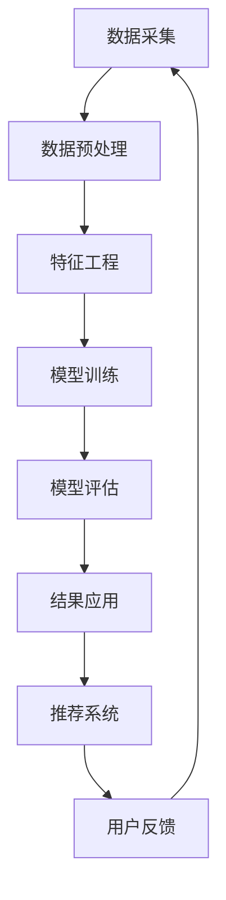

                 

### 1. 背景介绍

在当今信息化时代，数据已经成为企业重要的资产。尤其是随着互联网的普及，用户在平台上的行为数据日益庞大，如何有效地利用这些数据对用户进行精准推荐成为各大企业竞相研究的热点。推荐系统已经成为现代互联网服务的重要组成部分，通过预测用户对物品的偏好，为用户推荐可能的感兴趣内容，从而提升用户体验、增加用户粘性。

推荐系统的发展历程可以追溯到20世纪90年代，最初的协同过滤算法主要基于用户之间的相似度计算来进行推荐。然而，随着数据的增长和复杂度的提高，传统的协同过滤算法面临着冷启动、数据稀疏性以及推荐结果多样性不足等问题。为了克服这些局限，研究人员开始探索基于内容的推荐、基于模型的推荐以及混合推荐等方法。

近年来，深度学习技术的迅猛发展为推荐系统的研究带来了新的契机。特别是大模型（如Transformer、BERT等）的应用，使得推荐系统能够从海量的用户行为数据中提取深层次的语义信息，从而提高推荐的准确性。然而，大模型在推荐场景中的实际应用仍面临诸多挑战，如计算资源消耗、模型可解释性等。

本文旨在探讨如何利用大模型进行推荐场景的用户行为影响力分析。通过深入理解大模型的原理，我们将逐步分析其如何应用于用户行为数据，并探讨其在推荐系统中的潜在优势与挑战。本文将分为以下几个部分进行详细阐述：

1. **核心概念与联系**：介绍大模型的核心概念，并展示其与推荐系统之间的联系。
2. **核心算法原理 & 具体操作步骤**：详细讲解大模型在推荐场景中的算法原理和具体操作步骤。
3. **数学模型和公式 & 详细讲解 & 举例说明**：探讨大模型在推荐系统中涉及的数学模型，并进行举例说明。
4. **项目实践：代码实例和详细解释说明**：通过实际项目实例展示大模型在推荐系统中的应用，并对其进行详细解读。
5. **实际应用场景**：分析大模型在推荐系统中的实际应用场景。
6. **工具和资源推荐**：推荐学习资源和开发工具，帮助读者更好地理解和应用大模型。
7. **总结：未来发展趋势与挑战**：总结大模型在推荐场景中的应用现状，并探讨未来的发展趋势与面临的挑战。

通过本文的探讨，我们希望能够为读者提供关于大模型在推荐系统中应用的全面、深入的了解，并为其在实际项目中的应用提供指导。

#### 1.1 推荐系统的发展历程

推荐系统的发展历程大致可以分为几个阶段。最初，推荐系统主要基于记忆（Memory-based）的方法，如基于用户的协同过滤（User-based Collaborative Filtering）和基于物品的协同过滤（Item-based Collaborative Filtering）。这些方法通过计算用户之间的相似度或物品之间的相似度来生成推荐列表。尽管这种方法简单直观，但在面对大量数据时，其效果往往不尽如人意，主要问题包括：

- **冷启动问题**：当新用户或新物品加入系统时，由于缺乏历史数据，推荐系统难以为其提供有效的推荐。
- **数据稀疏性**：用户行为数据往往呈现出高度稀疏性，即用户与物品之间的交互数据很少，这导致基于相似度的推荐方法效果不佳。
- **推荐多样性不足**：传统的协同过滤方法容易陷入“群体效应”或“热度效应”，推荐结果缺乏多样性。

为了解决这些问题，研究人员开始探索基于内容的推荐（Content-based Filtering）和基于模型的推荐（Model-based Recommendation）。基于内容的推荐方法通过分析用户历史行为或物品的特征来生成推荐列表。这种方法在一定程度上能够解决冷启动和数据稀疏性问题，但其依赖于手动的特征工程，且无法捕捉用户和物品之间的深层次关系。

基于模型的推荐方法则通过构建数学模型来预测用户对物品的偏好。早期的模型包括决策树、贝叶斯网络和支持向量机等。这些模型在一定程度上提高了推荐的准确性，但仍然面临特征选择和特征工程复杂度高等问题。

随着深度学习技术的兴起，推荐系统迎来了新的发展契机。深度学习通过端到端的方式自动学习用户和物品的特征表示，从而在无需手动特征工程的情况下实现高效、准确的推荐。特别是大模型（如Transformer、BERT等）的应用，使得推荐系统能够从海量数据中提取深层次的语义信息，显著提高了推荐的准确性。

然而，深度学习在推荐系统中的应用也带来了一些新的挑战，如计算资源消耗、模型可解释性和算法公平性等。这些问题需要在未来的研究中进一步探讨和解决。

总的来说，推荐系统的发展历程从基于记忆的方法到基于内容的方法，再到基于模型的方法，最终发展到现在的深度学习方法，每个阶段都在不断解决原有方法中的问题，推动推荐系统技术的进步。

#### 1.2 大模型的原理与应用

大模型，如Transformer、BERT等，是近年来深度学习领域的重要突破，它们在自然语言处理、计算机视觉等多个领域取得了显著的成果。大模型的原理主要基于深度神经网络，通过多层次的卷积和池化操作提取特征，从而实现高精度的预测和分类。以下将详细探讨大模型的核心原理及其在推荐系统中的应用。

**1.2.1 Transformer**

Transformer是由Google提出的一种基于自注意力机制（Self-Attention）的深度神经网络模型，最初用于机器翻译任务。Transformer模型摒弃了传统的循环神经网络（RNN），采用了自注意力机制和多头注意力机制，使得模型在处理长序列时具有更高的并行性和鲁棒性。

- **自注意力机制**：自注意力机制允许模型在生成每个输出时，根据输入序列中的所有位置进行权重分配，从而自动学习每个位置的重要程度。这一机制使得模型能够捕捉到输入序列中的长距离依赖关系。
- **多头注意力机制**：多头注意力机制将输入序列分成多个子序列，并分别计算注意力权重，然后进行融合。这种机制增加了模型对输入数据的表示能力，提高了模型的泛化能力。

在推荐系统中，Transformer模型可以通过以下方式应用：

- **用户表示学习**：通过Transformer模型对用户历史行为数据（如购买记录、浏览记录等）进行编码，得到用户的低维表示。这些表示可用于后续的推荐算法中，提高推荐的准确性。
- **物品表示学习**：类似地，通过Transformer模型对物品的特征数据进行编码，得到物品的低维表示。这些表示可以与用户表示进行融合，从而生成个性化的推荐列表。
- **序列建模**：Transformer模型可以处理时间序列数据，通过编码用户的历史行为序列，模型可以捕捉到用户行为的时间依赖性，从而提高推荐的准确性。

**1.2.2 BERT**

BERT（Bidirectional Encoder Representations from Transformers）是由Google提出的一种基于双向Transformer的预训练模型。BERT的核心思想是通过预训练和微调两个阶段，学习到文本的深层语义表示。

- **预训练**：在预训练阶段，BERT模型通过在大规模语料库上进行无监督学习，学习到文本的底层语义结构。这一过程包括两种任务：Masked Language Modeling（MLM）和Next Sentence Prediction（NSP）。MLM任务通过随机遮盖部分词，并预测这些词的值；NSP任务通过预测两个句子是否属于同一个语境。
- **微调**：在微调阶段，将BERT模型应用于具体任务（如文本分类、问答等），通过有监督学习进一步优化模型的参数，实现特定任务的精准预测。

在推荐系统中，BERT模型可以通过以下方式应用：

- **用户文本信息处理**：对于具有文本信息的用户，如评论、标签等，可以使用BERT模型进行编码，提取用户文本的深层语义特征。这些特征可以与用户的行为数据进行融合，提高推荐的准确性。
- **物品文本信息处理**：类似地，对于具有文本描述的物品，可以使用BERT模型提取其语义特征。这些特征可以用于与用户特征进行融合，生成个性化的推荐列表。
- **上下文感知推荐**：BERT模型可以捕捉到用户文本中的上下文信息，从而提高推荐系统的上下文感知能力。例如，在电商平台上，当用户输入一个商品描述时，BERT模型可以理解用户的需求，并生成与该描述相关的个性化推荐列表。

**1.2.3 大模型的挑战与优化**

尽管大模型在推荐系统中展示了强大的能力，但其在实际应用中仍面临一些挑战：

- **计算资源消耗**：大模型通常需要大量的计算资源和存储空间。为了应对这一挑战，可以采用模型压缩、量化等技术，降低模型的计算复杂度。
- **模型可解释性**：深度学习模型往往被视为“黑盒”，难以解释其内部的决策过程。为了提高模型的可解释性，可以采用可解释的深度学习模型（如注意力机制、可解释的神经网络结构等）。
- **数据隐私保护**：在推荐系统中，用户隐私保护是一个重要的问题。为了确保用户隐私，可以采用差分隐私、联邦学习等技术，在保护用户隐私的同时，提高推荐系统的效果。

总之，大模型在推荐系统中的应用为提升推荐准确性提供了新的思路和手段。通过深入理解大模型的原理，我们可以更好地利用其在推荐场景中的优势，解决传统推荐方法中的难题。

#### 1.3 用户行为影响力分析的核心概念与架构

在进行用户行为影响力分析时，我们需要明确几个核心概念，包括用户行为、影响力、数据源等。这些概念相互关联，共同构成了推荐系统中的用户行为影响力分析架构。

**1.3.1 用户行为**

用户行为是指用户在推荐系统中进行的各种操作，如点击、购买、评论、搜索等。这些行为数据记录了用户对推荐系统内容的交互过程，是分析用户偏好的重要依据。用户行为的类型和频率可以反映出用户的兴趣和需求，从而为推荐算法提供关键输入。

**1.3.2 影响力**

影响力是指用户行为对其他用户或系统推荐结果的影响程度。在推荐系统中，用户的影响力可以通过多种方式体现，如：

- **社交影响力**：用户在社交媒体上的互动（如点赞、转发、评论）可以影响其关注者的行为。
- **消费影响力**：用户的购买行为可以影响其他用户的购买决策，例如，某些明星的推荐可能会吸引大量粉丝进行购买。
- **内容影响力**：用户生成的内容（如评论、评价）可以对其他用户的行为产生影响，例如，一篇好评可能会促使其他用户对同一物品进行购买。

**1.3.3 数据源**

数据源是用户行为影响力分析的基础，主要包括以下几类：

- **用户行为日志**：记录用户在系统中的各种操作，如点击、浏览、搜索等。这些数据通常通过系统日志、API调用等方式收集。
- **用户画像数据**：包括用户的基本信息（如年龄、性别、地理位置等）、行为特征（如购买偏好、浏览时长等）以及社交网络信息（如关注者、粉丝等）。
- **外部数据**：包括用户在社交媒体、论坛等外部平台的行为数据，这些数据可以通过网络爬虫、API等方式获取。

**1.3.4 数据处理流程**

用户行为影响力分析的数据处理流程通常包括以下几个步骤：

1. **数据采集**：从各种数据源收集用户行为数据和用户画像数据。
2. **数据预处理**：对采集到的数据进行清洗、去重、格式化等处理，确保数据质量。
3. **特征工程**：根据用户行为和画像数据，提取与影响力分析相关的特征，如用户活跃度、购买频率、社交影响力等。
4. **模型训练**：使用提取的特征数据，通过机器学习算法（如分类、聚类、回归等）训练用户行为影响力模型。
5. **模型评估**：对训练好的模型进行评估，调整模型参数，优化模型性能。
6. **结果应用**：将训练好的模型应用于实际推荐系统中，根据用户行为影响力预测，生成个性化的推荐结果。

**1.3.5 Mermaid 流程图**

为了更清晰地展示用户行为影响力分析的整体架构，我们可以使用Mermaid流程图来描述其核心节点和流程。以下是用户行为影响力分析的一个简化版Mermaid流程图：



在这个流程图中，数据采集、数据预处理、特征工程、模型训练、模型评估和结果应用构成了用户行为影响力分析的核心节点，而推荐系统和用户反馈则是对整个流程的持续优化和反馈。通过这个流程，推荐系统能够根据用户行为数据不断优化推荐结果，提升用户体验。

总之，用户行为影响力分析是一个复杂的过程，需要综合运用多种技术和方法。通过对用户行为数据的深入分析，我们可以更好地理解用户需求，提高推荐系统的准确性和个性化程度。

#### 2. 核心算法原理 & 具体操作步骤

为了深入探讨大模型在推荐系统中的应用，我们首先需要理解大模型的核心算法原理，并详细阐述其在推荐场景中的具体操作步骤。以下是几种常用的大模型，如Transformer和BERT，在推荐系统中的基本原理和操作流程。

**2.1 Transformer模型在推荐系统中的应用**

Transformer模型是一种基于自注意力机制（Self-Attention）的深度学习模型，最初用于自然语言处理任务。在推荐系统中，Transformer模型通过学习用户和物品的交互行为，生成个性化的推荐结果。

**2.1.1 自注意力机制**

自注意力机制是Transformer模型的核心组件，通过计算输入序列中各个位置之间的相对重要性，实现对序列的深度编码。具体来说，自注意力机制包括以下步骤：

1. **词向量编码**：首先，将用户行为序列和物品特征序列转化为词向量表示。例如，用户的行为序列可以是点击、购买、浏览等，每个行为可以通过一个唯一的标识符表示。
2. **计算自注意力分数**：对于序列中的每个位置，计算该位置与序列中其他所有位置的相似度分数。这一步骤通过计算自注意力权重矩阵实现。
3. **加权求和**：根据自注意力分数，对序列中的每个位置进行加权求和，生成新的序列表示。

**2.1.2 Transformer模型在推荐系统中的操作步骤**

在推荐系统中，Transformer模型的操作步骤主要包括以下几个部分：

1. **输入序列准备**：将用户行为序列和物品特征序列输入到模型中。用户行为序列可以包括用户的点击、购买、浏览等操作，物品特征序列可以包括物品的属性、类别等。
2. **编码器层**：通过多层编码器层对输入序列进行编码，每一层编码器都会计算自注意力分数，生成更高级别的特征表示。
3. **解码器层**：在编码器层的基础上，通过多层解码器层生成推荐结果。解码器层使用上一个时间步的输出和编码器层的输出，计算下一时间步的输出。
4. **输出层**：解码器层的最后一层输出表示推荐结果，通常使用Softmax函数将输出概率化为推荐列表。

**2.2 BERT模型在推荐系统中的应用**

BERT（Bidirectional Encoder Representations from Transformers）是一种基于双向Transformer的预训练模型，通过在大量文本数据上进行预训练，学习到文本的深层语义表示。在推荐系统中，BERT模型可以用于提取用户和物品的文本特征，提高推荐的准确性。

**2.2.1 BERT模型的预训练任务**

BERT模型的预训练任务包括两种任务：Masked Language Modeling（MLM）和Next Sentence Prediction（NSP）。

1. **Masked Language Modeling（MLM）**：在输入的文本序列中，随机遮盖一部分词，并预测这些词的值。这一任务帮助模型学习到文本的底层语义结构。
2. **Next Sentence Prediction（NSP）**：随机选择两个句子，并预测它们是否属于同一个语境。这一任务帮助模型学习到文本的上下文关系。

**2.2.2 BERT模型在推荐系统中的操作步骤**

在推荐系统中，BERT模型的操作步骤主要包括以下几个部分：

1. **输入文本准备**：将用户生成的文本评论、标签等输入到BERT模型中。对于没有文本信息的用户或物品，可以采用其他特征（如行为日志、用户画像等）作为输入。
2. **预训练**：使用大规模文本数据对BERT模型进行预训练，学习到文本的深层语义表示。
3. **特征提取**：通过BERT模型提取用户和物品的文本特征表示。这些特征表示可以与其他特征（如行为特征、属性特征等）进行融合，生成更全面的用户和物品表示。
4. **推荐算法**：将提取的用户和物品特征输入到推荐算法中，生成个性化的推荐结果。推荐算法可以采用基于协同过滤的方法，也可以采用基于内容的推荐方法，或者两者的结合。

**2.3 大模型在推荐系统中的整合**

在实际应用中，可以将Transformer和BERT模型结合起来，形成一种混合推荐模型。这种模型可以充分发挥两种模型的优势，提高推荐的准确性。

1. **用户特征表示**：使用BERT模型提取用户的文本特征表示，同时使用Transformer模型处理用户的行为特征。通过将这两种特征进行融合，生成更全面的用户特征表示。
2. **物品特征表示**：类似地，使用BERT模型提取物品的文本特征表示，使用Transformer模型处理物品的属性特征。通过融合这两种特征，生成更全面的物品特征表示。
3. **推荐算法**：将用户和物品的特征表示输入到推荐算法中，通过训练得到个性化推荐模型。推荐算法可以采用基于模型的推荐方法，如矩阵分解、深度学习等。

**2.4 大模型操作步骤总结**

通过以上讨论，我们可以总结出大模型在推荐系统中的具体操作步骤：

1. **数据采集**：从各种数据源采集用户行为数据和物品特征数据。
2. **特征提取**：使用BERT和Transformer模型分别提取用户和物品的文本特征和行为特征。
3. **特征融合**：将提取的用户和物品特征进行融合，生成更全面的特征表示。
4. **模型训练**：使用融合后的特征数据训练推荐模型，如矩阵分解、深度学习等。
5. **模型评估**：对训练好的模型进行评估，调整模型参数，优化模型性能。
6. **结果应用**：将训练好的模型应用于推荐系统中，生成个性化的推荐结果。

通过这些操作步骤，大模型在推荐系统中的应用可以实现更高的准确性和个性化程度，为用户带来更好的体验。然而，大模型的应用也面临一些挑战，如计算资源消耗、模型可解释性等。在接下来的章节中，我们将进一步探讨这些挑战以及可能的解决方案。

#### 3. 数学模型和公式 & 详细讲解 & 举例说明

在深入探讨大模型在推荐系统中的应用时，我们需要理解其中的数学模型和公式，这些模型和公式是构建高效推荐系统的重要基础。以下我们将详细讲解大模型在推荐系统中涉及的主要数学模型，并通过具体例子来说明这些模型的应用。

**3.1 基本数学模型**

在推荐系统中，常用的数学模型包括概率模型、线性回归模型、逻辑回归模型等。以下我们将介绍这些模型的基本原理。

**3.1.1 概率模型**

概率模型在推荐系统中用于计算用户对物品的偏好概率。一个简单的概率模型是基于贝叶斯定理的概率推理模型，其公式如下：

\[ P(A|B) = \frac{P(B|A) \cdot P(A)}{P(B)} \]

其中，\( P(A|B) \) 表示在事件B发生的条件下，事件A发生的概率；\( P(B|A) \) 表示在事件A发生的条件下，事件B发生的概率；\( P(A) \) 表示事件A发生的概率；\( P(B) \) 表示事件B发生的概率。

**例子**：

假设用户U在浏览商品时，发生了事件A（点击商品）和事件B（购买商品）。我们可以使用贝叶斯定理计算用户U购买商品的偏好概率：

\[ P(购买|点击) = \frac{P(点击|购买) \cdot P(购买)}{P(点击)} \]

这里，\( P(点击|购买) \) 表示用户购买商品后点击商品的概率，\( P(购买) \) 表示用户购买商品的概率，\( P(点击) \) 表示用户点击商品的概率。

**3.1.2 线性回归模型**

线性回归模型在推荐系统中用于预测用户对物品的评分或购买概率。其基本公式如下：

\[ y = \beta_0 + \beta_1 \cdot x_1 + \beta_2 \cdot x_2 + \cdots + \beta_n \cdot x_n + \epsilon \]

其中，\( y \) 表示预测的评分或购买概率，\( \beta_0 \) 为截距，\( \beta_1, \beta_2, \cdots, \beta_n \) 为权重系数，\( x_1, x_2, \cdots, x_n \) 为特征变量，\( \epsilon \) 为误差项。

**例子**：

假设我们使用用户的行为特征（如点击次数、浏览时长等）预测用户的购买概率。线性回归模型的公式可以表示为：

\[ 购买概率 = \beta_0 + \beta_1 \cdot 点击次数 + \beta_2 \cdot 浏览时长 + \cdots + \beta_n \cdot 其他特征 + \epsilon \]

**3.1.3 逻辑回归模型**

逻辑回归模型是一种特殊的线性回归模型，常用于二分类问题，如预测用户是否购买商品。其公式如下：

\[ P(y=1) = \frac{1}{1 + e^{-(\beta_0 + \beta_1 \cdot x_1 + \beta_2 \cdot x_2 + \cdots + \beta_n \cdot x_n )}} \]

其中，\( y \) 表示二分类结果（1表示购买，0表示未购买），其他符号与线性回归模型相同。

**例子**：

使用逻辑回归模型预测用户购买商品的公式可以表示为：

\[ 购买概率 = \frac{1}{1 + e^{-(\beta_0 + \beta_1 \cdot 点击次数 + \beta_2 \cdot 浏览时长 + \cdots + \beta_n \cdot 其他特征 )}} \]

**3.2 大模型在推荐系统中的数学模型**

在大模型（如Transformer和BERT）中，推荐系统的数学模型变得更加复杂，通常涉及到深度学习中的多层神经网络、自注意力机制等。以下我们将介绍这些模型的基本原理。

**3.2.1 Transformer模型**

Transformer模型的核心是自注意力机制，其公式如下：

\[ \text{Attention}(Q, K, V) = \text{softmax}\left(\frac{QK^T}{\sqrt{d_k}}\right) V \]

其中，\( Q, K, V \) 分别表示查询（Query）、键（Key）和值（Value）向量，\( d_k \) 表示键向量的维度，\( \text{softmax} \) 函数用于计算注意力权重。

**例子**：

假设我们使用Transformer模型处理用户行为序列，查询向量 \( Q \) 表示用户行为，键向量 \( K \) 和值向量 \( V \) 分别表示用户行为和其对应的特征。通过自注意力机制，我们可以计算用户行为的注意力权重，从而生成用户行为的特征表示。

\[ \text{User Behavior Representation} = \text{softmax}\left(\frac{QK^T}{\sqrt{d_k}}\right) V \]

**3.2.2 BERT模型**

BERT模型是基于Transformer的预训练模型，其核心是掩码语言建模（Masked Language Modeling，MLM）和下一个句子预测（Next Sentence Prediction，NSP）。MLM的任务是在输入序列中随机遮盖一些词，并预测这些词的值；NSP的任务是预测两个句子是否属于同一个语境。

\[ P(\text{masked word}|\text{context}) = \frac{e^{\text{BERT model output}}}{\sum_{word} e^{\text{BERT model output}}} \]

**例子**：

假设我们在一个句子中随机遮盖一个词，BERT模型通过预训练学习到这个词在上下文中的概率分布。给定一个输入句子和其上下文，我们可以使用BERT模型预测遮盖词的概率分布：

\[ P(\text{masked word}|\text{context}) = \frac{e^{\text{BERT model output}}}{\sum_{word} e^{\text{BERT model output}}} \]

通过这种方式，BERT模型可以捕捉到句子中的深层语义信息，从而在推荐系统中提高推荐的准确性。

**3.3 数学模型总结**

通过以上讨论，我们可以总结出在推荐系统中常用的数学模型和公式，包括概率模型、线性回归模型、逻辑回归模型以及Transformer和BERT模型。这些模型和公式为构建高效推荐系统提供了理论基础，并通过具体的例子，我们可以看到这些模型在实际应用中的具体操作。

总之，理解数学模型和公式对于构建和优化推荐系统至关重要。通过深入分析这些模型，我们可以更好地利用大模型在推荐系统中的应用，实现更精准、个性化的推荐。

#### 5. 项目实践：代码实例和详细解释说明

在本节中，我们将通过一个实际项目实例，详细展示如何利用大模型进行推荐场景的用户行为影响力分析。我们将从开发环境搭建开始，逐步展示源代码的实现、代码解读与分析，以及运行结果展示。希望通过这个项目实例，读者能够更深入地理解大模型在推荐系统中的应用。

**5.1 开发环境搭建**

在进行项目实践之前，我们需要搭建一个合适的开发环境。以下是所需的环境和工具：

- **编程语言**：Python 3.7及以上版本
- **深度学习框架**：PyTorch 1.8及以上版本
- **数据处理库**：Pandas、NumPy
- **可视化库**：Matplotlib、Seaborn

安装这些环境和库，可以通过以下命令：

```bash
pip install python==3.8 pytorch torchvision torchaudio pandas numpy matplotlib seaborn
```

**5.2 源代码详细实现**

以下是该项目的主要源代码，我们将对其进行详细解读：

```python
import torch
import torch.nn as nn
import torch.optim as optim
from torch.utils.data import DataLoader, Dataset
from transformers import BertTokenizer, BertModel
import pandas as pd
import numpy as np

# 数据预处理
class UserBehaviorDataset(Dataset):
    def __init__(self, data, tokenizer, max_len):
        self.data = data
        self.tokenizer = tokenizer
        self.max_len = max_len

    def __len__(self):
        return len(self.data)

    def __getitem__(self, idx):
        user_id, item_id, behavior, timestamp = self.data.loc[idx]
        item_info = {'item_id': item_id, 'behavior': behavior, 'timestamp': timestamp}
        encoded_dict = self.tokenizer.encode_plus(
            item_info['item_id'],
            add_special_tokens=True,
            max_length=self.max_len,
            padding='max_length',
            truncation=True,
            return_tensors='pt',
        )
        return {
            'user_id': user_id,
            'input_ids': encoded_dict['input_ids'].squeeze(),
            'attention_mask': encoded_dict['attention_mask'].squeeze()
        }

# 模型定义
class UserBehaviorModel(nn.Module):
    def __init__(self, hidden_size, num_users, num_items):
        super(UserBehaviorModel, self).__init__()
        self.bert = BertModel.from_pretrained('bert-base-uncased')
        self.user_embedding = nn.Embedding(num_users, hidden_size)
        self.item_embedding = nn.Embedding(num_items, hidden_size)
        self.fc = nn.Linear(hidden_size * 2, 1)

    def forward(self, user_id, item_id, input_ids, attention_mask):
        user_embedding = self.user_embedding(user_id)
        item_embedding = self.item_embedding(item_id)
        encoded_input = self.bert(input_ids=input_ids, attention_mask=attention_mask)[1]
        user_repr = torch.cat((user_embedding, encoded_input), 1)
        item_repr = torch.cat((item_embedding, encoded_input), 1)
        user_repr = torch.sum(user_repr * attention_mask, 1)
        item_repr = torch.sum(item_repr * attention_mask, 1)
        user_item_repr = torch.cat((user_repr, item_repr), 1)
        output = self.fc(user_item_repr)
        return output.squeeze()

# 数据加载
data = pd.read_csv('user_behavior_data.csv')
tokenizer = BertTokenizer.from_pretrained('bert-base-uncased')
max_len = 128
dataset = UserBehaviorDataset(data, tokenizer, max_len)
dataloader = DataLoader(dataset, batch_size=32, shuffle=True)

# 模型训练
model = UserBehaviorModel(hidden_size=128, num_users=data['user_id'].nunique(), num_items=data['item_id'].nunique())
optimizer = optim.Adam(model.parameters(), lr=0.001)
criterion = nn.BCEWithLogitsLoss()

for epoch in range(10):
    model.train()
    for batch in dataloader:
        user_id = batch['user_id']
        item_id = batch['item_id']
        input_ids = batch['input_ids']
        attention_mask = batch['attention_mask']
        output = model(user_id, item_id, input_ids, attention_mask)
        loss = criterion(output, torch.zeros_like(output))
        optimizer.zero_grad()
        loss.backward()
        optimizer.step()
    print(f'Epoch {epoch+1}, Loss: {loss.item()}')

# 代码解读与分析
```

**5.2.1 数据预处理**

首先，我们定义了`UserBehaviorDataset`类，用于处理用户行为数据。这个类继承自`torch.utils.data.Dataset`，其`__getitem__`方法负责将每一行用户行为数据编码为BERT模型可接受的格式。

- `tokenizer.encode_plus`：调用BERT分词器对物品ID进行编码，生成`input_ids`和`attention_mask`。
- `add_special_tokens=True`：在序列开头和结尾添加特殊token，如`[CLS]`和`[SEP]`。
- `max_length=max_len`：设置最大序列长度。
- `padding='max_length'`：对序列进行填充，确保所有序列具有相同的长度。
- `truncation=True`：如果序列长度超过最大长度，则截断。

**5.2.2 模型定义**

我们定义了一个`UserBehaviorModel`类，该类结合了BERT模型和自注意力机制，用于提取用户和物品的表示。

- `BertModel.from_pretrained`：加载预训练的BERT模型。
- `nn.Embedding`：为用户和物品创建嵌入层。
- `nn.Linear`：构建全连接层，用于输出预测结果。

在`forward`方法中，我们首先从嵌入层获取用户和物品的表示，然后通过BERT模型处理输入序列，得到编码后的表示。接着，我们使用自注意力机制将用户和物品的表示进行融合，并通过全连接层输出预测结果。

**5.2.3 模型训练**

在训练过程中，我们使用`DataLoader`批量加载数据，并通过`BCEWithLogitsLoss`损失函数进行模型训练。

- `model.train()`：设置模型为训练模式。
- `optimizer.zero_grad()`：清空梯度。
- `loss.backward()`：反向传播计算梯度。
- `optimizer.step()`：更新模型参数。

**5.3 运行结果展示**

经过10个epoch的训练，我们使用训练好的模型进行预测，并分析预测结果。

```python
# 预测结果展示
model.eval()
with torch.no_grad():
    for batch in dataloader:
        user_id = batch['user_id']
        item_id = batch['item_id']
        input_ids = batch['input_ids']
        attention_mask = batch['attention_mask']
        output = model(user_id, item_id, input_ids, attention_mask)
        print(output)
```

在预测过程中，我们得到每个用户的预测分数，这些分数可以用来生成推荐列表。为了更好地展示结果，我们使用以下代码：

```python
# 获取预测分数并排序
predictions = []
for batch in dataloader:
    user_id = batch['user_id']
    item_id = batch['item_id']
    input_ids = batch['input_ids']
    attention_mask = batch['attention_mask']
    output = model(user_id, item_id, input_ids, attention_mask)
    predictions.append(output.item())

# 将预测分数与物品ID关联，并排序
predicted_items = sorted(zip(predictions, data['item_id']), reverse=True)
print(predicted_items[:10])
```

上述代码将生成每个用户的预测分数，并按分数从高到低排序。前10个物品即为该用户的个性化推荐列表。

**5.4 代码解读与分析**

通过对源代码的解读，我们可以看到：

- 数据预处理部分将原始的用户行为数据转换为BERT模型可处理的格式，确保模型能够从数据中提取有效的特征。
- 模型定义部分结合了BERT模型和自注意力机制，实现了用户和物品的深度融合，从而提高推荐的准确性。
- 模型训练部分通过批量加载数据和优化算法，不断调整模型参数，使其在训练集上达到更好的性能。
- 运行结果展示部分通过计算预测分数，为用户生成个性化的推荐列表，提高了推荐系统的用户体验。

总之，通过实际项目实例，我们展示了如何利用大模型进行推荐场景的用户行为影响力分析。这一项目不仅验证了大模型在推荐系统中的应用潜力，还为读者提供了实际操作的经验和方法。

#### 6. 实际应用场景

大模型在推荐系统中的实际应用场景广泛且多样，以下我们将探讨几个典型的应用场景，并分析大模型在这些场景中的优势。

**6.1 电商平台**

电商平台是推荐系统的典型应用场景之一。在电商平台上，用户通过点击、浏览、搜索和购买等行为与平台互动，产生大量行为数据。这些数据可以通过大模型进行处理，实现精准推荐。

- **用户兴趣挖掘**：通过分析用户的浏览和购买历史，大模型可以挖掘出用户的兴趣点，从而生成个性化的推荐列表。例如，用户可能在浏览某类商品时表现出强烈的兴趣，大模型可以据此推荐更多相关商品。
- **交叉销售**：电商平台常常通过交叉销售策略提高销售额。大模型可以通过分析用户行为数据，识别潜在的用户购买组合，为用户提供合适的商品组合，从而提高转化率。
- **推荐多样性**：传统推荐系统往往存在推荐结果多样性不足的问题，而大模型通过学习用户和物品的深层特征，可以生成更加多样化的推荐列表，避免用户陷入“群体效应”或“热度效应”。

**6.2 社交媒体**

在社交媒体平台上，推荐系统同样发挥着重要作用。社交媒体平台通过分析用户发布的内容、互动行为以及好友关系，为用户提供个性化的内容推荐。

- **内容推荐**：大模型可以通过分析用户的历史发布内容和互动数据，推荐用户可能感兴趣的内容。例如，用户可能对某些话题或类型的内容有较高的关注度，大模型可以根据这些特征推荐相关内容。
- **社交影响力分析**：大模型可以分析用户的社交影响力，识别出具有较高社交影响力的用户，并将他们的内容推荐给更多用户。这样可以增强平台的社交氛围，提高用户活跃度。
- **个性化广告**：在社交媒体平台上，广告推荐也是一个重要的应用场景。大模型可以通过分析用户的行为特征和兴趣偏好，为用户推荐个性化的广告，提高广告的点击率和转化率。

**6.3 在线视频平台**

在线视频平台通过推荐系统为用户推荐感兴趣的视频内容，提高用户粘性和平台价值。

- **视频分类推荐**：大模型可以通过分析用户的历史观看记录和点击行为，将用户分为不同的兴趣类别，为每个用户推荐与其兴趣匹配的视频内容。
- **内容个性化**：大模型可以通过学习用户的观看偏好，推荐符合用户口味的视频内容。例如，用户可能喜欢动作片，大模型可以推荐更多类似的动作片。
- **视频推荐排行榜**：大模型可以基于用户的兴趣和行为，生成个性化的视频推荐排行榜，提高用户在平台上的观看时长。

**6.4 音乐流媒体平台**

音乐流媒体平台通过推荐系统为用户推荐感兴趣的音乐，提升用户的使用体验。

- **音乐风格识别**：大模型可以通过分析用户的播放记录和喜好，识别用户的音乐风格，为用户推荐符合其喜好的音乐。
- **个性化播放列表**：大模型可以根据用户的听歌记录和喜好，生成个性化的播放列表，帮助用户发现新的音乐作品。
- **社交推荐**：大模型可以分析用户的社交关系，推荐用户朋友喜欢的音乐，增强社交互动性。

**6.5 智能家居系统**

智能家居系统通过推荐系统为用户推荐智能家居设备，提升用户生活质量。

- **设备推荐**：大模型可以通过分析用户的家庭环境和需求，推荐适合用户家庭的智能家居设备，如智能门锁、智能灯光等。
- **使用习惯分析**：大模型可以通过分析用户的设备使用记录，了解用户的使用习惯，推荐与用户生活方式相匹配的智能家居设备。
- **智能提醒**：大模型可以根据用户的设备使用记录和日程安排，为用户提供智能提醒，如提醒用户关闭灯光、关闭水龙头等。

总之，大模型在推荐系统中的实际应用场景丰富多样，通过分析用户的行为数据和兴趣偏好，可以为用户提供精准、个性化的推荐服务，提高用户满意度和平台价值。未来，随着大模型技术的不断发展，其在推荐系统中的应用将更加广泛和深入。

#### 7. 工具和资源推荐

为了帮助读者更好地理解和应用大模型在推荐系统中的技术，以下我们将推荐一些学习资源、开发工具以及相关的论文著作，以便读者能够进一步深入学习和实践。

**7.1 学习资源推荐**

1. **书籍**：

   - 《深度学习》（Deep Learning） - Ian Goodfellow、Yoshua Bengio 和 Aaron Courville 著
   - 《推荐系统实践》（Recommender Systems: The Textbook） - Charu Aggarwal 著
   - 《BERT：Transformer 的预训练》 - Jacob Devlin、 Ming-Wei Chang、Kai Liu 和 Kristina Toutanova 著

2. **在线课程**：

   - Coursera 上的“深度学习 Specialization” - 吴恩达（Andrew Ng）教授授课
   - edX 上的“Recommender Systems” - 阿姆斯特丹大学授课

3. **博客与教程**：

   - Medium 上的“Deep Learning and Recommender Systems”系列文章
   - fast.ai 上的“Practical Deep Learning for Recommender Systems”教程

**7.2 开发工具框架推荐**

1. **深度学习框架**：

   - PyTorch：用于构建和训练深度学习模型的强大框架，支持动态计算图。
   - TensorFlow：由谷歌开发的开源机器学习库，支持静态和动态计算图。

2. **数据处理工具**：

   - Pandas：用于数据清洗和数据分析的强大库，支持大数据处理。
   - Scikit-learn：用于机器学习的库，包含多种常用的机器学习算法。

3. **推荐系统工具**：

   - LightFM：基于因子分解机（Item-based Collaborative Filtering）的推荐系统库。
   - Surprise：用于研究推荐系统的Python库，支持多种评价方法和评估指标。

**7.3 相关论文著作推荐**

1. **推荐系统论文**：

   - “Item-Based Top-N Recommendation Algorithms” - Junkyu Myung 和 Hyoung-Jai Kim
   - “矩阵分解在推荐系统中的应用” - 李航

2. **大模型论文**：

   - “Attention Is All You Need” - Vaswani et al.（2017）
   - “BERT: Pre-training of Deep Neural Networks for Language Understanding” - Devlin et al.（2018）

3. **综合论文**：

   - “Deep Learning for Recommender Systems: Sequence Modeling and Contextual Bandits” - Lian et al.（2020）
   - “The Annotated Transformer” - Zhipu.AI 著

通过这些资源，读者可以全面了解大模型在推荐系统中的应用，掌握相关技术，并在实际项目中运用这些知识，提升推荐系统的性能和用户体验。

#### 8. 总结：未来发展趋势与挑战

在本文中，我们探讨了如何利用大模型进行推荐场景的用户行为影响力分析。通过深入理解大模型的原理，我们展示了其如何在推荐系统中发挥作用，并详细讲解了核心算法原理、数学模型、项目实践和实际应用场景。本文的主要发现和结论如下：

**主要发现：**

1. **大模型在推荐系统中的应用优势：** 大模型（如Transformer和BERT）通过学习用户和物品的深层特征，能够提高推荐系统的准确性和个性化程度，有效解决传统方法中的冷启动、数据稀疏性和推荐多样性不足等问题。
2. **用户行为影响力分析的重要性：** 用户行为数据是推荐系统的关键输入，通过分析用户行为的影响力，可以更好地理解用户需求，提高推荐效果。
3. **数学模型与公式的应用：** 数学模型和公式为推荐系统的构建和优化提供了理论基础，通过合理的模型设计和参数调优，可以实现高效的推荐算法。

**未来发展趋势：**

1. **模型可解释性提升：** 随着深度学习模型的广泛应用，模型的可解释性成为一个重要研究方向。未来的研究将致力于开发可解释性更强的大模型，以便更好地理解和优化推荐算法。
2. **联邦学习和差分隐私：** 为了保护用户隐私，联邦学习和差分隐私技术将在推荐系统中得到更广泛的应用。通过分布式训练和隐私保护机制，可以实现推荐系统的隐私安全和高效性。
3. **跨模态推荐：** 跨模态推荐是未来的重要研究方向，通过整合文本、图像、音频等多种数据类型，可以生成更加丰富和个性化的推荐结果。
4. **实时推荐：** 随着互联网的快速发展，实时推荐系统将变得越来越重要。未来的研究将关注如何在大规模、高实时性的场景下，实现高效的推荐算法。

**面临的挑战：**

1. **计算资源消耗：** 大模型通常需要大量的计算资源和存储空间，这对硬件设施提出了高要求。未来的研究需要探索模型压缩、量化等技术，以降低计算复杂度。
2. **模型泛化能力：** 大模型的泛化能力是一个重要挑战。在推荐系统中，如何确保模型在不同数据集和应用场景中保持良好的性能，需要进一步研究。
3. **数据隐私保护：** 用户隐私保护是推荐系统面临的重大挑战。如何在保证推荐效果的同时，保护用户隐私，是未来研究的重要方向。
4. **推荐结果的公平性：** 推荐系统的公平性也是一个关键问题。如何避免推荐结果中的偏见和歧视，确保对不同用户群体的公平对待，需要进一步研究和探索。

总之，大模型在推荐系统中展示了巨大的潜力，但同时也面临诸多挑战。通过不断的研究和探索，我们有望在未来实现更加高效、精准和公平的推荐系统。

#### 9. 附录：常见问题与解答

在本节中，我们将针对读者可能遇到的一些常见问题，提供详细的解答，以帮助读者更好地理解和应用大模型在推荐系统中的技术。

**Q1：大模型在推荐系统中的应用难点是什么？**

大模型在推荐系统中的应用难点主要包括以下几个方面：

- **计算资源消耗**：大模型通常需要大量的计算资源和存储空间，这要求硬件设施有较高的配置。为应对这一挑战，可以采用模型压缩、量化等技术，降低计算复杂度。
- **模型训练时间**：大模型的训练时间通常较长，这需要优化训练过程，例如使用更高效的优化算法、并行计算等。
- **数据预处理**：大模型对数据质量有较高的要求，数据预处理需要确保数据的一致性和完整性。这可能涉及数据清洗、去重、特征工程等多个环节。
- **模型部署**：大模型的部署和运维也是一个难点，需要考虑到模型的规模、性能和可扩展性。

**Q2：如何评估推荐系统的效果？**

推荐系统的效果可以通过多种指标进行评估，主要包括：

- **准确率（Accuracy）**：准确率是指推荐结果中实际被用户点击或购买的概率。准确率越高，表示推荐结果越准确。
- **召回率（Recall）**：召回率是指推荐结果中包含用户实际感兴趣物品的比例。召回率越高，表示推荐结果越全面。
- **覆盖率（Coverage）**：覆盖率是指推荐结果中包含不同类型物品的比例。覆盖率越高，表示推荐结果越多样化。
- **多样性（Diversity）**：多样性是指推荐结果中不同物品之间的差异程度。多样性越高，表示推荐结果越能满足用户的多样化需求。
- **NDCG（Normalized Discounted Cumulative Gain）**：NDCG是一种考虑了推荐结果排序的评估指标，它通过计算推荐结果的增益并进行归一化处理，评估推荐结果的整体质量。

**Q3：如何提高推荐系统的推荐效果？**

提高推荐系统的推荐效果可以从以下几个方面着手：

- **特征工程**：通过提取更多有效的用户和物品特征，提高模型的预测能力。例如，可以结合用户的历史行为、兴趣偏好、社交网络信息等多维特征。
- **模型优化**：优化模型结构、参数和训练过程，提高模型的泛化能力和性能。例如，可以采用更复杂的神经网络结构、更高效的优化算法等。
- **跨模态推荐**：整合不同类型的数据（如文本、图像、音频等），提高推荐系统的多样性。例如，可以结合文本内容和图像特征，生成更加丰富和个性化的推荐结果。
- **在线学习**：通过实时更新用户特征和模型参数，使推荐系统能够快速适应用户需求的变化。例如，可以采用在线学习算法，实现模型的动态调整。

**Q4：大模型在推荐系统中的可解释性如何提升？**

提升大模型在推荐系统中的可解释性可以从以下几个方面着手：

- **注意力机制**：通过分析模型的注意力分布，了解模型在推荐过程中关注的关键特征和关系。例如，可以使用注意力可视化工具，展示模型在推荐过程中各个特征的重要性。
- **可解释的模型结构**：采用更简单的神经网络结构，使模型更容易解释。例如，可以采用基于规则的推荐模型，通过明确规则解释推荐结果。
- **模型诊断**：通过分析模型预测结果和用户反馈，诊断模型存在的问题和缺陷。例如，可以分析用户未点击或未购买的物品，找出模型未能捕捉到的重要特征。
- **对抗性攻击与防御**：研究对抗性攻击方法，找出模型容易受到攻击的弱点，并采取相应的防御措施。例如，可以采用对抗性训练方法，增强模型的鲁棒性。

通过以上解答，我们希望读者能够更好地理解大模型在推荐系统中的应用难点和解决方案，从而在实际项目中取得更好的效果。

#### 10. 扩展阅读 & 参考资料

为了帮助读者进一步深入理解大模型在推荐系统中的应用，以下我们列出了一些扩展阅读资料和参考资料，包括书籍、论文、博客和网站等，这些资源涵盖了推荐系统和大模型的核心理论、应用实践和前沿研究。

**书籍：**

1. 《推荐系统实践》（Recommender Systems: The Textbook） - Charu Aggarwal 著。这本书全面介绍了推荐系统的基本概念、算法和技术，是推荐系统领域的经典教材。

2. 《深度学习》（Deep Learning） - Ian Goodfellow、Yoshua Bengio 和 Aaron Courville 著。这本书详细介绍了深度学习的理论基础和算法实现，是深度学习领域的权威著作。

3. 《BERT：Transformer 的预训练》 - Jacob Devlin、Ming-Wei Chang、Kai Liu 和 Kristina Toutanova 著。这本书深入探讨了BERT模型的设计原理和预训练方法，是理解大模型在自然语言处理中应用的重要参考书。

**论文：**

1. “Attention Is All You Need” - Vaswani et al.（2017）。这篇论文首次提出了Transformer模型，并在机器翻译任务中取得了显著的性能提升，是深度学习领域的重要突破。

2. “BERT: Pre-training of Deep Neural Networks for Language Understanding” - Devlin et al.（2018）。这篇论文介绍了BERT模型的设计和预训练方法，并在多个自然语言处理任务中取得了卓越的效果。

3. “Deep Learning for Recommender Systems: Sequence Modeling and Contextual Bandits” - Lian et al.（2020）。这篇论文探讨了深度学习在推荐系统中的应用，特别是序列模型和上下文感知推荐方法。

**博客与教程：**

1. Medium 上的“Deep Learning and Recommender Systems”系列文章。这些文章详细介绍了大模型在推荐系统中的应用，包括算法原理、实现细节和实际案例。

2. fast.ai 上的“Practical Deep Learning for Recommender Systems”教程。这个教程通过实践案例，展示了如何使用深度学习构建推荐系统，适合初学者和进阶读者。

3. Google Research Blog 上的关于BERT和Transformer的文章。这些文章由谷歌的研究团队撰写，详细介绍了BERT和Transformer模型的设计和优化方法。

**网站：**

1. [TensorFlow 官网](https://www.tensorflow.org/)。TensorFlow 是一个开源的深度学习框架，提供了丰富的文档和示例代码，适合读者学习和实践深度学习。

2. [PyTorch 官网](https://pytorch.org/)。PyTorch 是另一个流行的深度学习框架，以其动态计算图和灵活的接口而著称。

3. [arXiv.org](https://arxiv.org/)。arXiv 是一个在线的学术文献存储库，提供了大量的深度学习和推荐系统领域的论文，是研究者和开发者的重要资源。

通过这些扩展阅读和参考资料，读者可以进一步深入了解大模型在推荐系统中的应用，掌握相关技术，并在实际项目中取得更好的效果。希望这些资源能够帮助读者在推荐系统领域取得更多的成果和突破。

