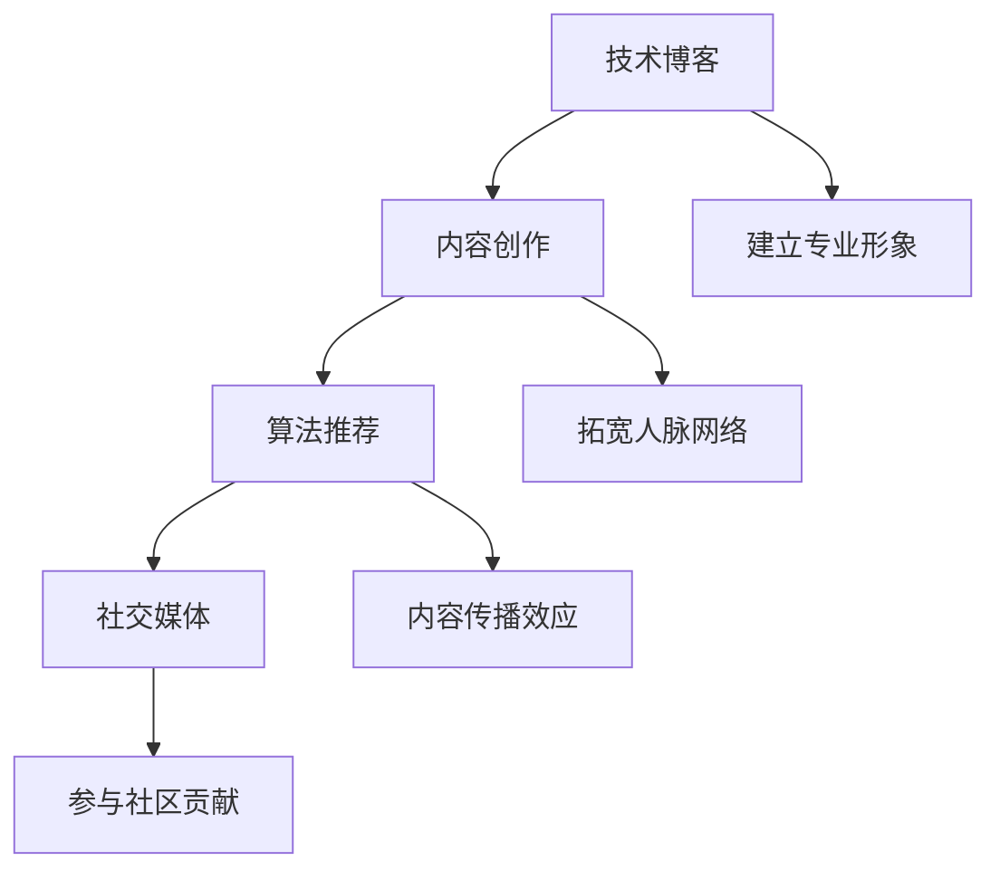

                 

### 文章标题

**利用技术分享提升个人影响力**

> **关键词：** 技术分享、个人影响力、社交媒体、内容创作、算法推荐、专业成长

**摘要：** 本文章旨在探讨如何通过技术分享来提升个人影响力。从技术博客的撰写、内容创作到算法推荐，本文将通过一步步的分析和实例，详细讲解如何在信息爆炸的时代利用技术分享实现个人影响力的提升。同时，本文还将提供实用的工具和资源推荐，帮助读者在技术分享的道路上取得成功。

----------------------------------------------------------------

### 1. 背景介绍

在当前的信息化时代，技术领域日新月异，新概念、新技术层出不穷。如何在这个领域脱颖而出，成为行业内的意见领袖，成为许多技术从业者的一个重要目标。技术分享作为传播知识、交流思想、展示才华的一种重要方式，逐渐成为提升个人影响力的重要途径。

技术分享不仅有助于个人积累知识和经验，还可以通过以下几种方式提升个人影响力：

1. **建立专业形象：** 通过撰写高质量的技术博客、分享项目经验，可以展示自己的专业能力和技术水平，树立起专业的个人形象。
2. **拓宽人脉网络：** 技术分享可以吸引志同道合的人，建立广泛的联系，从而扩大人脉网络，为个人发展创造更多机会。
3. **内容传播效应：** 在社交媒体和各大技术社区上分享优质内容，可以迅速获得大量关注和传播，从而提升个人知名度。
4. **参与社区贡献：** 通过参与技术社区的讨论、问答等活动，可以为社区贡献自己的力量，树立起良好的口碑。

本文将围绕技术分享的核心概念、算法原理、实践方法等方面，详细探讨如何通过技术分享提升个人影响力。

----------------------------------------------------------------

### 2. 核心概念与联系

#### 2.1 技术博客

技术博客是技术分享的一种重要形式，它可以帮助我们记录学习过程、分享经验教训，同时也是一种有效的知识管理工具。一个好的技术博客应该具备以下几个特点：

1. **内容专业：** 选择自己熟悉且感兴趣的技术领域进行写作，确保内容的专业性。
2. **结构清晰：** 遵循逻辑清晰的结构，使读者能够轻松阅读和理解。
3. **实例丰富：** 结合具体实例进行讲解，增强文章的实用性和可操作性。
4. **持续更新：** 定期更新博客，保持内容的时效性和活跃度。

#### 2.2 内容创作

内容创作是技术分享的核心，如何创作出高质量的内容是提升个人影响力的关键。以下是一些内容创作的建议：

1. **选题精准：** 选择具有针对性、实用性的话题，满足读者的需求。
2. **深入分析：** 对所选话题进行深入剖析，展示自己的独到见解。
3. **形式多样：** 结合图文、代码实例等多种形式，提高文章的趣味性和可读性。
4. **持续迭代：** 根据读者反馈不断优化内容，提高文章质量。

#### 2.3 算法推荐

算法推荐是提升内容传播效果的重要手段，以下是一些常见的算法推荐方法：

1. **基于内容的推荐（Content-based Filtering）：** 通过分析文章的内容特征，为读者推荐相似的内容。
2. **基于协同过滤的推荐（Collaborative Filtering）：** 通过分析读者的行为和兴趣，为读者推荐感兴趣的内容。
3. **混合推荐（Hybrid Recommendation）：** 结合多种推荐方法，提高推荐的准确性。

#### 2.4 社交媒体

社交媒体是技术分享的重要渠道，以下是一些社交媒体的使用技巧：

1. **选择合适的平台：** 根据自己的目标受众和内容特点，选择合适的社交媒体平台。
2. **定期更新：** 保持活跃度，提高在平台上的曝光率。
3. **互动交流：** 积极与读者互动，建立良好的读者关系。
4. **营销推广：** 利用广告、活动等方式，扩大自己的影响力。

#### 2.5 Mermaid 流程图

以下是技术分享核心概念与联系的 Mermaid 流程图：

---

在下一节，我们将进一步探讨技术博客的核心算法原理与具体操作步骤。通过逐步分析，我们将了解到如何撰写一篇高质量的技术博客，从而提升个人影响力。

----------------------------------------------------------------

### 3. 核心算法原理 & 具体操作步骤

#### 3.1 技术博客撰写技巧

撰写一篇高质量的技术博客需要掌握一系列技巧，以下是一些关键步骤：

**3.1.1 选题与定位**

1. **确定目标受众：** 了解你的读者群体，明确他们的需求与兴趣。
2. **选择热门话题：** 关注行业热点，选择具有广泛讨论度的主题。
3. **明确文章目的：** 确定文章想要传达的核心观点，围绕这一主题展开论述。

**3.1.2 内容组织**

1. **结构清晰：** 按照逻辑顺序组织文章内容，确保读者能够轻松跟随思路。
2. **分章节撰写：** 将文章内容划分为几个独立的章节，每个章节都应有明确的主题和结论。
3. **引用权威资料：** 引用权威的文献、资料，增加文章的可靠性和专业性。

**3.1.3 代码实例**

1. **代码简洁：** 确保代码简洁易读，避免冗余和复杂结构。
2. **代码注释：** 为代码添加详细的注释，解释关键部分的实现原理。
3. **代码演示：** 结合代码实例，展示具体操作过程和结果。

**3.1.4 文章优化**

1. **标题吸引人：** 设计具有吸引力的标题，提高文章的点击率。
2. **摘要简明：** 撰写简明扼要的摘要，概括文章的核心内容。
3. **关键词优化：** 优化文章的关键词，提高搜索引擎的收录和排名。

#### 3.2 内容创作策略

**3.2.1 选题策略**

1. **关注热点：** 跟踪行业热点，抓住热门话题，提升文章的时效性。
2. **解决痛点：** 深入挖掘读者面临的实际问题，提供切实可行的解决方案。
3. **结合趋势：** 分析行业发展趋势，预测未来趋势，引导读者关注前沿技术。

**3.2.2 创作技巧**

1. **主题明确：** 确定文章主题，确保文章内容聚焦于某一具体领域。
2. **结构完整：** 保持文章结构完整，包括引言、正文和结论三个部分。
3. **语言表达：** 使用简洁、明了的语言，避免复杂的词汇和句子。

**3.2.3 互动性**

1. **鼓励评论：** 鼓励读者在评论区留言，增加文章的互动性。
2. **回复评论：** 及时回复读者评论，建立良好的读者关系。
3. **定期互动：** 通过举办线上活动、问答等方式，与读者保持互动。

#### 3.3 算法推荐原理

**3.3.1 基于内容的推荐（Content-based Filtering）**

基于内容的推荐通过分析文章的内容特征，为读者推荐相似的内容。具体步骤如下：

1. **特征提取：** 提取文章的关键词、标签和主题等特征。
2. **相似度计算：** 计算文章之间的相似度，通常使用余弦相似度或欧氏距离等算法。
3. **推荐生成：** 根据相似度计算结果，为读者推荐相似度较高的文章。

**3.3.2 基于协同过滤的推荐（Collaborative Filtering）**

基于协同过滤的推荐通过分析读者的行为和兴趣，为读者推荐感兴趣的内容。具体步骤如下：

1. **用户行为分析：** 收集读者的浏览、点赞、评论等行为数据。
2. **用户兴趣分析：** 分析读者的行为数据，提取用户兴趣特征。
3. **推荐生成：** 根据用户兴趣特征，为读者推荐感兴趣的文章。

**3.3.3 混合推荐（Hybrid Recommendation）**

混合推荐结合了基于内容和基于协同过滤的推荐方法，以提高推荐的准确性。具体步骤如下：

1. **特征融合：** 将内容特征和用户特征进行融合，形成多维度的特征向量。
2. **模型训练：** 使用机器学习算法（如矩阵分解、神经网络等）训练推荐模型。
3. **推荐生成：** 根据训练好的模型，为读者推荐综合推荐结果。

---

通过上述步骤，我们可以掌握技术博客撰写、内容创作和算法推荐的核心算法原理。在下一节，我们将结合具体案例，详细讲解如何将这些原理应用到实际操作中。

----------------------------------------------------------------

### 4. 数学模型和公式 & 详细讲解 & 举例说明

#### 4.1 基于内容的推荐算法

基于内容的推荐算法主要通过分析文章的内容特征，为读者推荐相似的内容。其中，相似度的计算是核心部分。以下是一些常用的相似度计算方法：

**4.1.1 余弦相似度**

余弦相似度是一种常用的相似度计算方法，其公式如下：

$$
sim(A, B) = \frac{A \cdot B}{\|A\| \|B\|}
$$

其中，$A$ 和 $B$ 分别表示两篇文章的特征向量，$\|A\|$ 和 $\|B\|$ 分别表示特征向量的模长，$A \cdot B$ 表示特征向量的点积。

**4.1.2 欧氏距离**

欧氏距离是一种常用的距离度量方法，其公式如下：

$$
dist(A, B) = \sqrt{(A - B)^2}
$$

其中，$A$ 和 $B$ 分别表示两篇文章的特征向量。

**4.1.3 皮尔逊相关系数**

皮尔逊相关系数是一种常用的相关性度量方法，其公式如下：

$$
corr(A, B) = \frac{Cov(A, B)}{\sigma_A \sigma_B}
$$

其中，$Cov(A, B)$ 表示 $A$ 和 $B$ 的协方差，$\sigma_A$ 和 $\sigma_B$ 分别表示 $A$ 和 $B$ 的标准差。

#### 4.2 基于协同过滤的推荐算法

基于协同过滤的推荐算法主要通过分析读者的行为和兴趣，为读者推荐感兴趣的内容。以下是一些常用的协同过滤方法：

**4.2.1 用户的最近邻居（User-based Collaborative Filtering）**

用户的最近邻居方法通过寻找与当前用户相似的用户群体，推荐这些用户喜欢的文章。其核心公式如下：

$$
sim(u_i, u_j) = \frac{r_{ij}}{\|r_i\| \|r_j\|}
$$

其中，$u_i$ 和 $u_j$ 分别表示两个用户，$r_{ij}$ 表示用户 $u_i$ 对文章 $j$ 的评分，$\|r_i\|$ 和 $\|r_j\|$ 分别表示用户 $u_i$ 和 $u_j$ 的评分标准差。

**4.2.2 项目的最近邻居（Item-based Collaborative Filtering）**

项目

