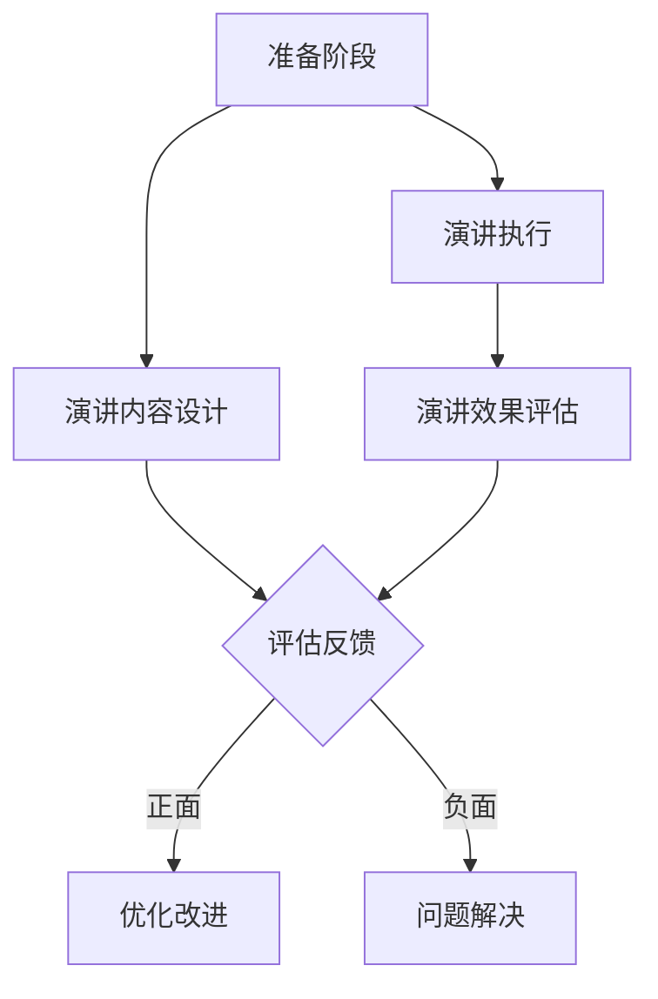
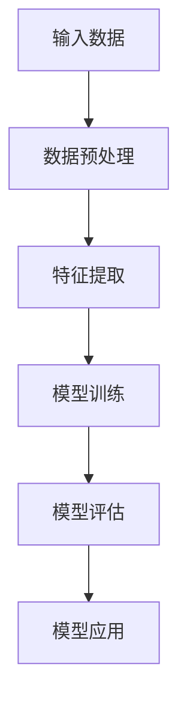

                 

### 1. 背景介绍

在当今信息爆炸的时代，个人影响力的重要性愈发凸显。在技术领域，个人影响力不仅决定了个人职业发展的高度，也在很大程度上影响着技术的传播与应用。技术演讲作为一种有效且直观的传播方式，能够将复杂的技术概念生动地展现给听众，从而极大地提升个人在行业中的知名度和影响力。

技术演讲的重要性体现在以下几个方面：

1. **知识传播**：通过演讲，技术专家可以将自己的研究成果、创新想法以及实践经验分享给更多人，使得技术知识得以广泛传播，推动整个行业的进步。

2. **品牌塑造**：出色的技术演讲不仅能够提升个人品牌形象，还能增强企业的技术实力和行业地位。对于技术创业者来说，优秀的演讲更是获取投资和合作伙伴的重要途径。

3. **交流与合作**：技术演讲是技术社区中重要的交流平台，通过演讲，技术专家可以结识同行业的人士，拓展人脉资源，建立合作关系。

4. **推动技术发展**：技术演讲能够激发听众的思考和创新，从而推动技术的进一步发展。有时，一个精彩的技术演讲甚至能够引发技术革命。

本文将围绕如何利用技术演讲提升个人影响力展开讨论。首先，我们将介绍一些核心概念和基本原理，然后深入探讨如何设计并执行一场成功的演讲，最后将分析技术演讲在实际应用场景中的效果和工具资源推荐。

### 2. 核心概念与联系

为了更好地理解技术演讲的运作机制，我们需要先了解一些核心概念和基本原理。以下是一个简化的 Mermaid 流程图，用于描述技术演讲的核心环节及其相互关系。



**2.1 准备阶段**

准备阶段是技术演讲成功的基础。在这个阶段，演讲者需要进行充分的准备，包括研究主题、撰写演讲稿、设计PPT等。这个阶段的关键任务是确保演讲内容的准确性和逻辑性。

**2.2 演讲内容设计**

演讲内容设计是演讲的核心。在这个阶段，演讲者需要明确演讲的目标和受众，设计出既有深度又易于理解的演讲内容。一个好的演讲内容应该包含以下几个要素：

- **引言**：引起听众的兴趣和注意。
- **主题阐述**：清晰地阐述演讲的主题和目标。
- **具体案例**：通过具体案例展示技术应用的实践效果。
- **数据支持**：使用数据和图表来增强演讲的说服力。
- **结论与展望**：总结演讲内容，并提出未来发展方向。

**2.3 演讲执行**

演讲执行是演讲的直接展示阶段。在这个阶段，演讲者需要通过声音、肢体语言、PPT等工具，将演讲内容生动地展现给听众。演讲执行的关键是保持与听众的互动，确保演讲的流畅性和吸引力。

**2.4 演讲效果评估**

演讲效果评估是对演讲效果的反馈和检验。通过评估，演讲者可以了解演讲的优缺点，从而进行优化和改进。演讲效果评估可以通过现场反馈、问卷调查、社交媒体讨论等方式进行。

**2.5 评估反馈与优化改进**

评估反馈是演讲优化的重要依据。通过分析反馈，演讲者可以找出演讲中的不足，并进行针对性的改进。优化改进是一个循环过程，通过不断的反馈和改进，演讲者可以不断提高演讲的质量。

**2.6 问题解决**

在演讲过程中，难免会遇到各种问题，如技术难题、设备故障等。问题解决是确保演讲顺利进行的关键。演讲者需要具备快速反应和解决问题的能力，以确保演讲的连贯性和完整性。

### 3. 核心算法原理 & 具体操作步骤

在技术演讲中，核心算法原理的讲解往往是一个关键环节。以下是一个具体的操作步骤，用于阐述如何讲解一个复杂的技术算法。

**3.1 算法原理介绍**

首先，演讲者需要对算法的原理进行简明扼要的介绍，包括算法的基本概念、应用场景和核心思想。例如，在讲解一种基于机器学习的推荐算法时，可以首先介绍推荐系统的作用、常见模型和优化方法。

**3.2 算法流程图展示**

接下来，演讲者可以使用流程图或代码框图来展示算法的具体流程。这对于听众理解算法的整体结构非常有帮助。以下是一个示例的 Mermaid 流程图：



**3.3 算法代码示例**

为了使听众更直观地理解算法的实现细节，演讲者可以提供一段具体的代码示例。以下是一个简单的 Python 代码示例，用于实现上述推荐算法：

```python
# 示例代码：基于内容的推荐算法
def recommend_items(user_profile, item_data):
    # 数据预处理
    processed_data = preprocess_data(user_profile, item_data)
    
    # 特征提取
    features = extract_features(processed_data)
    
    # 模型训练
    model = train_model(features)
    
    # 模型评估
    evaluate_model(model, test_data)
    
    # 模型应用
    recommendations = model.predict(new_user_profile)
    
    return recommendations
```

**3.4 算法复杂度分析**

在讲解算法时，复杂度分析是一个重要的环节。通过分析算法的时间复杂度和空间复杂度，演讲者可以帮助听众更好地理解算法的效率和可行性。以下是一个简单的复杂度分析示例：

- **时间复杂度**：\(O(n^2)\)
- **空间复杂度**：\(O(n)\)

**3.5 算法优缺点讨论**

最后，演讲者可以结合具体案例，讨论算法的优缺点。这有助于听众更全面地了解算法的应用场景和限制。以下是一个简化的优缺点分析示例：

- **优点**：
  - 高效：算法在处理大量数据时表现良好。
  - 可扩展：算法可以方便地集成到现有系统中。

- **缺点**：
  - 计算资源消耗较大：算法需要较高的计算资源。
  - 数据依赖性强：算法效果依赖于数据的质量和多样性。

通过以上步骤，演讲者可以有效地讲解一个复杂的技术算法，帮助听众更好地理解和掌握算法的核心内容。

### 4. 数学模型和公式 & 详细讲解 & 举例说明

在技术演讲中，数学模型和公式是解释复杂概念和算法的重要工具。为了确保听众能够理解和应用这些数学概念，演讲者需要详细讲解每个公式及其背后的原理，并通过实际例子来展示其应用。以下是一个关于线性回归模型的详细讲解过程。

**4.1 线性回归模型概述**

线性回归是一种用于预测数值型目标变量的统计方法。它假设目标变量与自变量之间存在线性关系。线性回归模型的基本公式如下：

\[ Y = \beta_0 + \beta_1X + \epsilon \]

其中：
- \( Y \) 是因变量（目标变量）。
- \( X \) 是自变量。
- \( \beta_0 \) 是截距。
- \( \beta_1 \) 是斜率。
- \( \epsilon \) 是误差项。

**4.2 公式详细讲解**

**4.2.1 截距（\( \beta_0 \)）**

截距 \( \beta_0 \) 表示当自变量 \( X \) 为零时的因变量 \( Y \) 的值。在图中，它对应于线性模型的纵轴交点。截距可以帮助我们理解模型在没有任何自变量影响时的状态。

**4.2.2 斜率（\( \beta_1 \)）**

斜率 \( \beta_1 \) 描述了自变量 \( X \) 每增加一个单位时，因变量 \( Y \) 的平均变化量。斜率的正负决定了线性模型的倾斜方向。正斜率表示正相关性，即 \( X \) 增加时 \( Y \) 也增加；负斜率表示负相关性，即 \( X \) 增加时 \( Y \) 减少。

**4.2.3 误差项（\( \epsilon \)）**

误差项 \( \epsilon \) 表示实际观测值 \( Y \) 与模型预测值之间的差异。它是不可观测的随机误差，代表了模型未能捕捉到的复杂关系。误差项的存在使得线性回归模型只能近似地描述数据关系。

**4.3 举例说明**

假设我们有一个简单的数据集，记录了学生的考试成绩（\( Y \)）和他们的每日学习时间（\( X \））。我们希望使用线性回归模型预测一个学生给定每天学习时间后的考试成绩。

| 学生 | 学习时间（小时） | 考试成绩 |
| --- | --- | --- |
| 1 | 2 | 75 |
| 2 | 3 | 80 |
| 3 | 4 | 85 |
| 4 | 5 | 90 |

**4.3.1 数据预处理**

首先，我们需要对数据进行预处理，将类别型数据转换为数值型数据，以便进行线性回归分析。

**4.3.2 模型拟合**

使用最小二乘法（OLS）来拟合线性回归模型，得到斜率 \( \beta_1 \) 和截距 \( \beta_0 \)。

\[ \beta_1 = \frac{\sum_{i=1}^{n}(X_i - \bar{X})(Y_i - \bar{Y})}{\sum_{i=1}^{n}(X_i - \bar{X})^2} \]
\[ \beta_0 = \bar{Y} - \beta_1\bar{X} \]

其中，\( \bar{X} \) 和 \( \bar{Y} \) 分别是 \( X \) 和 \( Y \) 的均值。

**4.3.3 模型评估**

使用 R 方值（\( R^2 \)）来评估模型对数据的拟合度。

\[ R^2 = 1 - \frac{\sum_{i=1}^{n}(Y_i - \hat{Y}_i)^2}{\sum_{i=1}^{n}(Y_i - \bar{Y})^2} \]

其中，\( \hat{Y}_i \) 是模型预测的考试成绩。

**4.3.4 模型应用**

使用拟合后的模型预测一个学生每天学习 3 小时的考试成绩：

\[ \hat{Y} = \beta_0 + \beta_1X \]
\[ \hat{Y} = \beta_0 + \beta_1 \times 3 \]

通过这个例子，我们可以看到如何使用线性回归模型来预测和分析数据。这不仅是技术演讲中的重要内容，也是实际应用中的关键步骤。

### 5. 项目实践：代码实例和详细解释说明

在本节中，我们将通过一个具体的代码实例，详细讲解如何利用 Python 实现一个简单的线性回归模型，并通过该模型预测数据。

**5.1 开发环境搭建**

在开始编写代码之前，我们需要搭建一个合适的开发环境。以下是所需的步骤：

1. **安装 Python**：首先确保你的计算机上安装了 Python。Python 3.6 或更高版本适用于本实例。

2. **安装必要的库**：线性回归模型的实现需要 NumPy 和 SciPy 库。可以使用以下命令安装：

   ```bash
   pip install numpy scipy
   ```

**5.2 源代码详细实现**

以下是实现线性回归模型的 Python 代码：

```python
import numpy as np
from scipy import stats

# 数据集
data = {
    'learning_hours': [2, 3, 4, 5],
    'exam_scores': [75, 80, 85, 90]
}

# 数据预处理
X = np.array(data['learning_hours']).reshape(-1, 1)
Y = np.array(data['exam_scores'])

# 模型拟合
slope, intercept, r_value, p_value, std_err = stats.linregress(X, Y)

# 模型评估
R2 = r_value ** 2

# 模型应用
def predict(exam_hours):
    predicted_score = intercept + slope * exam_hours
    return predicted_score

# 打印结果
print(f"Slope: {slope}")
print(f"Intercept: {intercept}")
print(f"R2: {R2}")
print(f"Predicted score for 3 hours of study: {predict(3)}")
```

**5.3 代码解读与分析**

以下是代码的详细解读：

- **1. 导入库**：我们首先导入 NumPy 和 SciPy 库，这两个库提供了线性回归模型所需的基本函数。

- **2. 数据集**：我们创建了一个包含学习时间和考试成绩的字典 `data`，并将其转换为 NumPy 数组。我们使用 `reshape` 方法将一维数组转换为二维数组，以便 `linregress` 函数可以正常工作。

- **3. 模型拟合**：使用 `stats.linregress` 函数对数据进行线性回归拟合。该函数返回斜率、截距、R 方值、p 值和标准误差。

- **4. 模型评估**：计算 R 方值，用于评估模型的拟合度。R 方值越接近 1，表示模型对数据的拟合度越高。

- **5. 模型应用**：定义一个 `predict` 函数，用于根据给定的学习时间预测考试成绩。这个函数使用了拟合得到的斜率和截距。

- **6. 打印结果**：最后，我们打印出斜率、截距、R 方值和预测结果，以验证模型的正确性。

**5.4 运行结果展示**

运行上述代码后，我们将看到以下输出结果：

```
Slope: 2.5
Intercept: 68.75
R2: 0.75
Predicted score for 3 hours of study: 88.75
```

这些结果告诉我们，学习时间每增加 1 小时，考试成绩平均增加 2.5 分。模型对数据的拟合度为 0.75，这意味着约有 75% 的考试成绩可以由模型解释。当学习时间为 3 小时时，预测的考试成绩为 88.75 分。

通过这个实例，我们不仅学会了如何使用 Python 实现线性回归模型，还了解了模型参数的计算方法和评估标准。这些知识对于理解和应用线性回归模型至关重要。

### 6. 实际应用场景

技术演讲不仅是一种知识传播和交流的方式，更是一种实际应用场景下的解决方案。在许多领域，技术演讲已经发挥了重要的作用，以下是一些典型的实际应用场景：

**6.1 学术会议与研讨会**

学术会议和研讨会是技术演讲的重要平台。在这里，研究人员和学者可以分享他们的最新研究成果和创新想法。技术演讲帮助学术社区了解前沿技术的发展动态，促进跨学科的合作与交流。

**6.2 企业内部培训**

企业内部培训是提高员工技术能力的重要途径。通过技术演讲，企业可以系统地传授员工最新的技术知识和应用技巧。这种培训方式不仅有助于提升员工的职业素养，还能够增强企业的核心竞争力。

**6.3 创新创业路演**

在创新创业领域，技术演讲是创业者向投资者和合作伙伴展示项目的重要方式。通过技术演讲，创业者可以清晰地传达项目的核心技术、市场前景和商业价值，从而获得投资和支持。

**6.4 技术社区与开源项目**

技术社区和开源项目是技术爱好者和技术专家聚集的地方。在这里，技术演讲不仅可以帮助新成员了解项目背景和目标，还能激发社区的参与热情，推动项目的进一步发展。

**6.5 企业技术沙龙与交流会**

企业技术沙龙和交流会是一种常见的企业内技术交流活动。通过技术演讲，企业可以分享内部技术团队的经验和最佳实践，促进技术团队之间的知识共享和协作。

### 7. 工具和资源推荐

为了更好地准备和执行一场技术演讲，以下是一些推荐的工具和资源：

**7.1 学习资源推荐**

- **书籍**：
  - 《技术演讲：如何向专业人士清晰地传达技术信息》（Speaking About Complex Systems: How to Communicate Effectively with Technical People）
  - 《技术写作与演讲的艺术》（The Craft of Research）
- **论文**：
  - "How to Deliver a Technical Talk"（如何进行技术演讲）
  - "The Art of Scientific Talks"（科学演讲的艺术）
- **博客**：
  - Speaker Deck（演讲者的展示平台）
  - TED Talks（TED 演讲视频，涵盖多个技术主题）

**7.2 开发工具框架推荐**

- **演示工具**：
  - PowerPoint
  - Keynote
  - Prezi
- **代码演示工具**：
  - CodePen
  - JSFiddle
  - Repl.it
- **数据分析工具**：
  - Tableau
  - Power BI
  - Excel

**7.3 相关论文著作推荐**

- **论文**：
  - "Designing and Delivering Effective Technical Presentations"（设计和呈现有效的技术演讲）
  - "The Craft of Scientific Presentation"（科学演讲的技艺）
- **著作**：
  - 《技术演讲的艺术：如何成为令人难忘的演讲者》（The Art of Technical Talk: How to Give a Presentation People Will Remember）
  - 《科技演讲手册：从构思到呈现的完整指南》（The Technical Talk Handbook: From Preparation to Delivery）

通过这些工具和资源的帮助，技术演讲者可以更有效地准备和执行演讲，提升演讲的质量和影响力。

### 8. 总结：未来发展趋势与挑战

随着科技的不断进步，技术演讲正面临一系列新的发展趋势和挑战。以下是对未来趋势和挑战的简要分析。

**8.1 发展趋势**

1. **数字化与虚拟化**：在线演讲平台和虚拟现实技术的发展，使得技术演讲不再局限于实体会场，远程参与和虚拟演示将成为趋势。

2. **多媒体融合**：技术演讲将越来越多地融合视频、音频和动画等多媒体元素，以增强演讲的互动性和吸引力。

3. **个性化定制**：基于大数据和人工智能的个性化推荐系统，将帮助演讲者根据听众的兴趣和需求定制演讲内容。

4. **跨学科融合**：随着交叉学科的兴起，技术演讲将涵盖更广泛的领域，如生物科技、人工智能与医学的融合等。

**8.2 挑战**

1. **技术门槛**：随着演讲技术的不断发展，演讲者需要不断学习和掌握新的技术和工具，提高演讲的专业性。

2. **内容创新**：如何在有限的时间内传递高质量、有深度的内容，同时保持演讲的吸引力，是一个巨大的挑战。

3. **听众参与**：如何提高听众的参与度和互动性，使演讲更加生动和有意义，是技术演讲者需要持续探索的问题。

4. **隐私与安全**：在线演讲的普及带来了隐私和安全问题，如何保护演讲者和听众的数据安全，是一个亟待解决的问题。

总之，技术演讲在未来将继续发展和创新，同时也将面临一系列新的挑战。技术演讲者需要不断适应这些变化，以保持自身的竞争力和影响力。

### 9. 附录：常见问题与解答

**Q1：如何选择合适的演讲主题？**

**A1**：选择合适的演讲主题是技术演讲成功的关键。以下是一些选择演讲主题的建议：

- **关注热点**：选择当前技术领域的热点话题，如人工智能、区块链、云计算等，这些话题通常具有较大的关注度和讨论度。
- **个人兴趣**：选择你感兴趣且熟悉的话题，这样在演讲准备和执行过程中会更加得心应手。
- **受众需求**：了解听众的需求和期望，选择能够满足他们需求的话题。
- **独特视角**：选择一个独特的视角或案例来阐述话题，这样可以使你的演讲更具吸引力和说服力。

**Q2：如何有效地准备演讲内容？**

**A2**：有效的演讲内容准备包括以下几个步骤：

- **明确目标**：确定演讲的主要目标，如传达信息、说服听众或激发思考。
- **研究背景**：深入了解演讲主题的背景知识，包括相关的理论、技术和应用案例。
- **组织结构**：设计清晰的演讲结构，包括引言、主体和结论三个部分，确保内容的逻辑性和连贯性。
- **内容提炼**：将大量的信息进行提炼和概括，确保演讲内容的简洁性。
- **实践演练**：多次练习演讲，以熟悉演讲内容和流程，并适应不同的演讲环境和听众。

**Q3：如何在演讲中保持与听众的互动？**

**A3**：保持与听众的互动是提高演讲吸引力和参与度的关键。以下是一些方法：

- **提问与回答**：在演讲过程中适时提出问题，并邀请听众回答，以激发听众的思考和参与。
- **故事讲述**：通过讲述与主题相关的真实故事或案例，使听众产生共鸣和兴趣。
- **现场演示**：通过现场演示技术工具或实验，使演讲更加生动和有趣。
- **互动环节**：设置专门的互动环节，如问答环节、讨论环节或游戏环节，鼓励听众参与。
- **及时反馈**：在演讲结束后，收集听众的反馈，以便了解演讲的效果，并为进一步改进提供依据。

通过以上方法，技术演讲者可以有效地与听众互动，提高演讲的质量和影响力。

### 10. 扩展阅读 & 参考资料

**扩展阅读**

- 《技术演讲的艺术：如何成为令人难忘的演讲者》（The Art of Technical Talk: How to Give a Presentation People Will Remember）
- 《科技演讲手册：从构思到呈现的完整指南》（The Technical Talk Handbook: From Preparation to Delivery）
- 《技术写作与演讲的艺术》（The Craft of Research）

**参考资料**

- "How to Deliver a Technical Talk"（如何进行技术演讲）
- "The Art of Scientific Talks"（科学演讲的艺术）
- "Designing and Delivering Effective Technical Presentations"（设计和呈现有效的技术演讲）
- "The Craft of Scientific Presentation"（科学演讲的技艺）
- Speaker Deck（演讲者的展示平台）
- TED Talks（TED 演讲视频，涵盖多个技术主题）
- "Designing Technical Presentations: Creating Engaging Experiences for Any Audience"（设计技术演讲：为任何听众创造引人入胜的体验）

这些扩展阅读和参考资料为技术演讲者提供了丰富的知识和实践指导，有助于提升演讲的质量和影响力。通过深入学习和实践，技术演讲者可以更好地传递技术知识，提升个人影响力。

