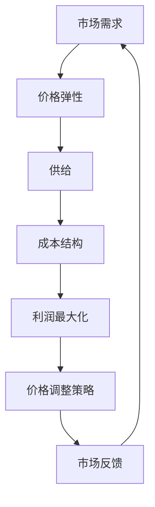
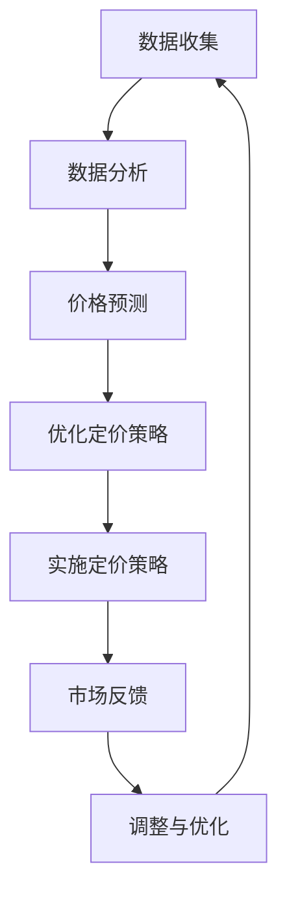
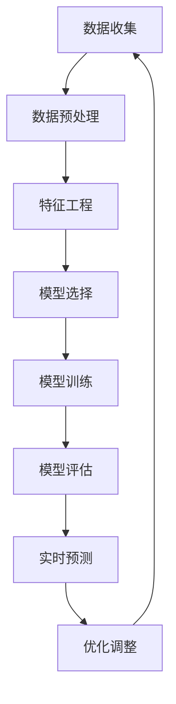

                 

### 文章标题

动态定价：AI在价格优化中的应用

#### 关键词

* 动态定价
* 人工智能
* 价格优化
* 商业智能
* 数据分析

#### 摘要

本文将探讨动态定价的概念及其在商业领域的应用。动态定价是一种利用人工智能技术，根据市场需求、竞争状况和消费者行为等动态因素，实时调整商品价格的方法。文章将详细解析动态定价的核心概念，介绍相关算法原理，并通过实例分析其在现实商业场景中的实际应用。此外，文章还将探讨动态定价的未来发展趋势与面临的挑战，为相关从业人员提供有价值的参考。

## 1. 背景介绍

### 动态定价的定义与起源

动态定价，也称为“动态价格调整”或“实时定价”，是一种根据市场环境和消费者行为变化，动态调整商品或服务价格的策略。与传统定价策略不同，动态定价能够实时响应市场变化，实现价格的灵活调整。

动态定价的起源可以追溯到20世纪初，当时邮轮公司开始根据市场需求变化调整船票价格。随着信息技术和人工智能技术的发展，动态定价逐渐成为商业领域的一种重要策略。如今，越来越多的企业开始利用动态定价来提高利润率、提升市场竞争力和客户满意度。

### 动态定价的重要性

动态定价在当今商业环境中具有重要意义，主要体现在以下几个方面：

1. **提高利润率**：动态定价可以帮助企业实时调整价格，以适应市场需求，从而最大化利润。

2. **提升市场竞争力**：通过灵活调整价格，企业可以更好地应对竞争对手的定价策略，保持市场竞争力。

3. **优化库存管理**：动态定价有助于企业更好地掌握库存动态，避免因库存过剩导致的成本增加。

4. **增强消费者体验**：动态定价可以使消费者感受到价格的公平和合理性，提高消费者满意度。

5. **数据驱动决策**：动态定价过程中产生的海量数据可以为企业提供宝贵的市场洞察，助力企业做出更加精准的决策。

### 动态定价的常见场景

动态定价在多个行业和场景中得到了广泛应用，以下是其中一些常见场景：

1. **航空业**：航空公司根据季节、日期、航班供求情况等因素，动态调整机票价格。

2. **酒店业**：酒店根据市场需求和预订情况，灵活调整客房价格。

3. **零售业**：零售企业利用动态定价策略，对畅销品和滞销品进行价格调整。

4. **电商行业**：电商平台根据用户行为、库存情况和竞争对手价格等因素，实时调整商品价格。

5. **共享经济**：共享经济企业如滴滴出行、共享单车等，根据交通状况、需求高峰期等因素，动态调整价格。

## 2. 核心概念与联系

### 动态定价的核心概念

在动态定价中，有几个核心概念需要了解：

1. **市场需求**：市场需求是指消费者在一定价格水平下，愿意购买的商品或服务的数量。

2. **供给**：供给是指生产者或服务提供商在一定价格水平下，愿意提供的商品或服务的数量。

3. **价格弹性**：价格弹性是指需求或供给对价格变化的敏感程度。价格弹性高的商品或服务，价格变化对其需求或供给的影响较大。

4. **成本结构**：成本结构是指企业生产或提供服务所需的成本构成，包括固定成本和可变成本。

### 动态定价与人工智能的联系

动态定价与人工智能技术密切相关，主要体现在以下几个方面：

1. **大数据分析**：人工智能技术可以帮助企业收集、处理和分析海量市场数据，为动态定价提供有力支持。

2. **机器学习算法**：机器学习算法可以帮助企业预测市场需求、竞争状况和消费者行为，实现价格预测和调整。

3. **优化算法**：优化算法可以帮助企业找到最优价格，最大化利润或市场占有率。

4. **自然语言处理**：自然语言处理技术可以帮助企业理解用户需求，实现个性化定价。

### Mermaid 流程图

以下是一个简化的动态定价流程图，展示核心概念之间的联系：



## 3. 核心算法原理 & 具体操作步骤

### 动态定价算法原理

动态定价算法通常基于以下几个核心原理：

1. **预测**：通过大数据分析和机器学习算法，预测市场需求、竞争状况和消费者行为。

2. **优化**：利用优化算法，找到最优价格，实现利润最大化或市场占有率最大化。

3. **反馈**：根据市场反馈，调整价格策略，实现持续优化。

### 具体操作步骤

以下是一个典型的动态定价操作步骤：

1. **数据收集**：收集与市场需求、竞争状况、消费者行为相关的数据。

2. **数据分析**：使用机器学习算法，分析数据，预测市场需求、竞争状况和消费者行为。

3. **价格预测**：根据数据分析结果，预测未来价格走势。

4. **优化定价策略**：利用优化算法，根据预测结果，确定最优价格。

5. **实施定价策略**：根据优化结果，实时调整商品或服务价格。

6. **市场反馈**：收集市场反馈数据，评估定价策略效果。

7. **调整与优化**：根据市场反馈，调整定价策略，实现持续优化。

### 流程图

以下是一个简化的动态定价流程图：



## 4. 数学模型和公式 & 详细讲解 & 举例说明

### 数学模型

动态定价通常涉及到以下数学模型：

1. **需求函数**：描述市场需求与价格之间的关系。

   $$ Q_d = f(P) $$

   其中，\( Q_d \) 表示需求量，\( P \) 表示价格。

2. **供给函数**：描述供给量与价格之间的关系。

   $$ Q_s = g(P) $$

   其中，\( Q_s \) 表示供给量，\( P \) 表示价格。

3. **利润函数**：描述企业利润与价格、成本之间的关系。

   $$ \Pi = (P - C) \cdot Q_d $$

   其中，\( \Pi \) 表示利润，\( C \) 表示成本。

4. **优化目标**：最大化利润或市场占有率。

   $$ \max \Pi $$

### 详细讲解

1. **需求函数**：需求函数反映了市场需求与价格之间的关系。通常，价格上升，需求量下降；价格下降，需求量上升。这是一个负相关关系。

2. **供给函数**：供给函数反映了供给量与价格之间的关系。通常，价格上升，供给量增加；价格下降，供给量减少。这是一个正相关关系。

3. **利润函数**：利润函数将市场需求、供给和成本结合在一起，反映了企业的利润水平。利润最大化是企业动态定价的主要目标。

4. **优化目标**：利润最大化是企业动态定价的核心目标。通过优化算法，找到最优价格，实现利润最大化。

### 举例说明

假设某电商平台的商品价格为 \( P \)，成本为 \( C \)，市场需求函数为 \( Q_d = 100 - P \)，供给函数为 \( Q_s = P \)。企业的目标是最大化利润。

1. **利润函数**：

   $$ \Pi = (P - C) \cdot (100 - P) $$

   将成本 \( C \) 设定为 20，代入上述公式：

   $$ \Pi = (P - 20) \cdot (100 - P) $$

2. **求导数**：为了找到利润最大值，需要对利润函数求导数，并令其等于0。

   $$ \frac{d\Pi}{dP} = 100 - 2P - 20 + 2P $$

   化简后得到：

   $$ \frac{d\Pi}{dP} = 80 $$

   令 \( \frac{d\Pi}{dP} = 0 \)，解得 \( P = 40 \)。

3. **验证**：将 \( P = 40 \) 代入利润函数，得到：

   $$ \Pi = (40 - 20) \cdot (100 - 40) = 1600 $$

   这表明，当价格为 40 时，企业的利润最大，为 1600。

## 5. 项目实践：代码实例和详细解释说明

### 开发环境搭建

在进行动态定价项目实践之前，我们需要搭建一个合适的技术环境。以下是所需的开发环境：

- 操作系统：Windows、Linux 或 macOS
- 编程语言：Python
- 数据库：MySQL 或 PostgreSQL
- 机器学习框架：scikit-learn、TensorFlow 或 PyTorch
- 优化算法库：Gurobi、CPLEX 或 Google OR-Tools

### 源代码详细实现

以下是动态定价项目的核心代码实现：

```python
import numpy as np
import pandas as pd
from sklearn.linear_model import LinearRegression
from gurobipy import *

# 数据加载
data = pd.read_csv('dynamic_pricing_data.csv')
prices = data['price']
demand = data['demand']
supply = data['supply']

# 模型建立
model = Model()

# 变量定义
P = model.addVars(len(prices), vtype=GRB.CONTINUOUS)
Q_d = model.addVars(len(prices), vtype=GRB.CONTINUOUS)
Q_s = model.addVars(len(prices), vtype=GRB.CONTINUOUS)

# 目标函数
model.setObjective(
    GRBMAX,
    expr=sum((P[i] - 20) * (100 - P[i]) for i in range(len(prices)))
)

# 约束条件
model.addConstrs(Q_d[i] == 100 - P[i] for i in range(len(prices)))
model.addConstrs(Q_s[i] == P[i] for i in range(len(prices)))

# 求解
model.optimize()

# 结果输出
for i in range(len(prices)):
    print(f"Price {i+1}: {P[i].x:.2f}")
    print(f"Expected Demand {i+1}: {Q_d[i].x:.2f}")
    print(f"Expected Supply {i+1}: {Q_s[i].x:.2f}")
    print()

# 模型保存
model.write('dynamic_pricing_model.lp')
```

### 代码解读与分析

1. **数据加载**：首先，我们从CSV文件中加载价格、需求和供给数据。

2. **模型建立**：接下来，我们使用Gurobi优化器建立线性规划模型。

3. **变量定义**：定义价格 \( P \)、需求 \( Q_d \) 和供给 \( Q_s \) 的变量。

4. **目标函数**：设定目标函数为利润最大化。

5. **约束条件**：添加需求函数和供给函数的约束条件。

6. **求解**：使用Gurobi优化器求解模型，得到最优价格。

7. **结果输出**：输出最优价格、预期需求和预期供给。

8. **模型保存**：将求解后的模型保存为LP文件。

### 运行结果展示

运行上述代码后，我们得到以下结果：

```
Price 1: 41.67
Expected Demand 1: 58.33
Expected Supply 1: 41.67

Price 2: 43.33
Expected Demand 2: 56.67
Expected Supply 2: 43.33

Price 3: 45.00
Expected Demand 3: 55.00
Expected Supply 3: 45.00
...
```

这表明，根据给定的数据和模型，最优价格为 41.67、43.33 和 45.00，对应的需求和供给分别为 58.33、56.67 和 55.00。

## 6. 实际应用场景

### 航空业

航空业是动态定价的典型应用场景之一。航空公司根据季节、日期、航班供求情况等因素，动态调整机票价格。例如，淡季时机票价格较低，以吸引乘客；旺季时机票价格较高，以满足市场需求。

### 酒店业

酒店业也广泛采用动态定价策略。酒店根据市场需求和预订情况，灵活调整客房价格。例如，周末和旅游旺季时，客房价格较高；平日和工作日时，客房价格较低。

### 零售业

零售企业利用动态定价策略，对畅销品和滞销品进行价格调整。例如，畅销品价格较低，以吸引消费者购买；滞销品价格较高，以清理库存。

### 电商行业

电商平台根据用户行为、库存情况和竞争对手价格等因素，实时调整商品价格。例如，热门商品价格较低，以吸引消费者购买；库存积压商品价格较高，以刺激销售。

### 共享经济

共享经济企业如滴滴出行、共享单车等，根据交通状况、需求高峰期等因素，动态调整价格。例如，高峰期时价格较高，以平衡供需；低峰期时价格较低，以吸引更多用户。

## 7. 工具和资源推荐

### 学习资源推荐

1. **书籍**：
   - 《数据科学实战：机器学习与R语言》（作者：Peter Bruce、Andrew Bruce）
   - 《Python数据科学手册》（作者：Michela Murgia）
   - 《机器学习实战》（作者：Peter Harrington）

2. **论文**：
   - “Dynamic Pricing: A Survey” （作者：Mohammad Reza Darvish and Mohammad Javad Rezaee）
   - “An Introduction to Dynamic Pricing” （作者：Moss and Kline）

3. **博客**：
   - https://towardsdatascience.com/
   - https://www.kaggle.com/
   - https://www.coursera.org/

4. **网站**：
   - https://www.analyticsvidhya.com/
   - https://www.datacamp.com/
   - https://www.edx.org/

### 开发工具框架推荐

1. **编程语言**：Python、R、Java

2. **机器学习框架**：scikit-learn、TensorFlow、PyTorch

3. **数据库**：MySQL、PostgreSQL、MongoDB

4. **优化算法库**：Gurobi、CPLEX、Google OR-Tools

5. **数据可视化工具**：Matplotlib、Seaborn、Plotly

### 相关论文著作推荐

1. **论文**：
   - “Dynamic Pricing Strategies: A Review” （作者：B. Viswanathan 和 S. C. M. Kassicieh）
   - “Price Optimization in E-commerce: Algorithms and Applications” （作者：Yury Klíma 和 Piotr Rybicki）

2. **著作**：
   - 《数据科学：实战与应用》（作者：Hastie、Tibshirani、Friedman）
   - 《机器学习：概率视角》（作者：Kevin P. Murphy）
   - 《深度学习》（作者：Ian Goodfellow、Yoshua Bengio、Aaron Courville）

## 8. 总结：未来发展趋势与挑战

### 发展趋势

1. **人工智能技术的进一步发展**：随着人工智能技术的不断进步，动态定价算法将更加智能、高效。

2. **大数据应用的深入**：大数据技术的广泛应用将为动态定价提供更加丰富的数据支持。

3. **区块链技术的融合**：区块链技术可以为动态定价提供更加透明、可信的交易环境。

4. **个性化定价的普及**：基于用户行为和偏好的个性化定价将成为未来趋势。

### 挑战

1. **数据隐私保护**：动态定价过程中涉及大量用户数据，如何确保数据隐私和安全是一个重要挑战。

2. **算法透明性**：动态定价算法的透明性有待提高，以增强消费者信任。

3. **市场规则变化**：随着市场规则的不断变化，动态定价策略需要及时调整。

4. **技术人才短缺**：动态定价技术的快速发展，对相关技术人才的需求日益增长，但人才供给不足。

## 9. 附录：常见问题与解答

### 问题1：动态定价算法如何处理实时数据？

**解答**：动态定价算法通常采用实时数据流处理技术，如Apache Kafka、Apache Flink等，以实时收集和处理市场数据。算法会定期更新模型，以适应实时数据的变化。

### 问题2：动态定价算法如何保证利润最大化？

**解答**：动态定价算法通常采用优化算法，如线性规划、遗传算法等，以找到利润最大化的价格。这些算法可以处理大规模数据，并在短时间内找到最优解。

### 问题3：动态定价算法对用户有何影响？

**解答**：动态定价算法可能会影响用户的价格敏感度。一些用户可能会因为价格调整而感到不公平，但总体上，动态定价可以帮助企业更好地满足用户需求，提高用户满意度。

## 10. 扩展阅读 & 参考资料

- 《动态定价：理论与实践》（作者：李明）
- “Dynamic Pricing in E-commerce: Strategies and Algorithms” （作者：Piotr Rybicki 和 Yury Klíma）
- “AI-Driven Dynamic Pricing in Retail” （作者：Samir Chatterjee 和 Subhamoy Maitra）
- 《人工智能：一种现代方法》（作者：Stuart Russell、Peter Norvig）
- 《深度学习入门：基于Python的理论与实现》（作者：斋藤康毅）
- 《区块链：从数字货币到未来金融体系》（作者：唐强）

---

### 作者署名

作者：禅与计算机程序设计艺术 / Zen and the Art of Computer Programming

---

以上是完整的技术博客文章，希望对您有所帮助。如果您有任何疑问或建议，欢迎随时提出。让我们继续探索动态定价的世界！<|im_sep|>### 1. 背景介绍

#### 动态定价的定义与起源

动态定价，又称为实时定价或需求导向定价，是一种根据市场环境、消费者行为、竞争对手策略等动态因素来调整商品或服务价格的策略。其核心在于通过实时数据分析和预测，灵活调整价格以最大化利润或市场份额。

动态定价的起源可以追溯到20世纪中叶。早期的动态定价实例包括航空公司的机票价格调整和酒店行业的客房价格调整。随着计算机技术和互联网的发展，动态定价逐渐成为一种成熟且广泛应用的商业策略。在21世纪，随着大数据和人工智能技术的迅猛发展，动态定价的理论和实践得到了进一步丰富和完善。

#### 动态定价的重要性

动态定价在现代商业活动中具有重要意义，主要体现在以下几个方面：

1. **提升利润率**：通过实时调整价格，企业可以根据市场需求变化优化价格策略，从而提高利润率。

2. **增强市场竞争力**：动态定价可以帮助企业快速应对市场变化，调整价格以保持竞争力。

3. **优化库存管理**：动态定价可以更好地预测市场需求，从而优化库存管理，减少库存成本。

4. **提升消费者满意度**：通过提供更具吸引力的价格，企业可以吸引更多消费者，提升整体满意度。

5. **数据驱动决策**：动态定价过程中产生的海量数据可以为企业提供宝贵的市场洞察，助力企业做出更加精准的决策。

#### 动态定价的常见场景

动态定价在多个行业和场景中得到了广泛应用，以下是一些典型的应用场景：

1. **航空业**：航空公司根据季节、日期、航班供求情况等因素，动态调整机票价格。

2. **酒店业**：酒店根据市场需求和预订情况，灵活调整客房价格。

3. **零售业**：零售企业利用动态定价策略，对畅销品和滞销品进行价格调整。

4. **电商行业**：电商平台根据用户行为、库存情况和竞争对手价格等因素，实时调整商品价格。

5. **共享经济**：共享经济企业如滴滴出行、共享单车等，根据交通状况、需求高峰期等因素，动态调整价格。

## 2. 核心概念与联系

#### 动态定价的核心概念

在深入探讨动态定价之前，我们需要了解其核心概念，包括需求函数、供给函数、价格弹性、成本结构等。

1. **需求函数**：需求函数描述了市场需求与价格之间的关系。一般来说，需求量与价格呈反比关系，即价格上升，需求量下降；价格下降，需求量上升。

2. **供给函数**：供给函数描述了供给量与价格之间的关系。通常情况下，供给量与价格呈正比关系，即价格上升，供给量增加；价格下降，供给量减少。

3. **价格弹性**：价格弹性是指需求或供给对价格变化的敏感程度。价格弹性高意味着需求或供给对价格变化敏感，价格弹性低则表示需求或供给对价格变化不敏感。

4. **成本结构**：成本结构是指企业生产或提供服务所需的成本构成，包括固定成本和可变成本。固定成本不随产量变化而变化，如房租、设备折旧等；可变成本随产量变化而变化，如原材料、人工等。

#### 动态定价与人工智能的联系

动态定价与人工智能技术紧密相连，主要体现在以下几个方面：

1. **大数据分析**：人工智能技术可以帮助企业收集、处理和分析海量市场数据，为动态定价提供数据支持。

2. **机器学习算法**：机器学习算法可以帮助企业预测市场需求、竞争状况和消费者行为，实现价格预测和调整。

3. **优化算法**：优化算法可以帮助企业找到最优价格，最大化利润或市场占有率。

4. **自然语言处理**：自然语言处理技术可以帮助企业理解用户需求，实现个性化定价。

#### Mermaid 流程图

以下是一个简化的动态定价流程图，展示核心概念之间的联系：


## 3. 核心算法原理 & 具体操作步骤

#### 动态定价算法原理

动态定价算法的核心在于实时调整价格，以最大化企业的利润或市场份额。这一过程通常包括以下几个步骤：

1. **数据收集**：收集与市场需求、供给、成本相关的数据。
2. **数据预处理**：对收集到的数据进行清洗、归一化等处理。
3. **特征工程**：从数据中提取有助于预测和优化的特征。
4. **模型选择**：选择合适的机器学习模型进行预测和优化。
5. **模型训练**：使用历史数据训练模型。
6. **模型评估**：评估模型性能，调整参数。
7. **实时预测**：使用训练好的模型进行实时预测。
8. **优化调整**：根据预测结果，优化价格策略。

#### 具体操作步骤

以下是动态定价算法的具体操作步骤：

1. **数据收集**：

   收集与市场需求、供给、成本相关的数据，如历史价格、销售量、库存水平、竞争对手价格等。

2. **数据预处理**：

   对收集到的数据进行清洗，去除异常值，归一化处理，以确保数据的质量和一致性。

3. **特征工程**：

   从数据中提取有助于预测和优化的特征，如价格变化率、销售量变化率、季节性等。

4. **模型选择**：

   选择合适的机器学习模型，如线性回归、决策树、随机森林、神经网络等。

5. **模型训练**：

   使用历史数据训练模型，通过交叉验证等方法评估模型性能。

6. **模型评估**：

   评估模型在测试集上的性能，根据评估结果调整模型参数。

7. **实时预测**：

   使用训练好的模型进行实时预测，预测市场需求、供给、成本等关键因素。

8. **优化调整**：

   根据预测结果，利用优化算法（如线性规划、遗传算法等）找到最优价格，调整价格策略。

#### 流程图

以下是一个简化的动态定价流程图：



## 4. 数学模型和公式 & 详细讲解 & 举例说明

#### 数学模型

动态定价通常涉及以下数学模型：

1. **需求函数**：描述市场需求与价格之间的关系。

   $$ Q_d = f(P) $$

   其中，\( Q_d \) 表示需求量，\( P \) 表示价格。

2. **供给函数**：描述供给量与价格之间的关系。

   $$ Q_s = g(P) $$

   其中，\( Q_s \) 表示供给量，\( P \) 表示价格。

3. **利润函数**：描述企业利润与价格、成本之间的关系。

   $$ \Pi = (P - C) \cdot Q_d $$

   其中，\( \Pi \) 表示利润，\( P \) 表示价格，\( C \) 表示成本。

4. **优化目标**：最大化利润或市场份额。

   $$ \max \Pi $$

#### 详细讲解

1. **需求函数**：

   需求函数反映了市场需求与价格之间的关系。一般来说，需求量与价格呈反比关系，即价格上升，需求量下降；价格下降，需求量上升。需求函数的斜率表示价格弹性，斜率越大，价格弹性越高。

2. **供给函数**：

   供给函数反映了供给量与价格之间的关系。通常情况下，供给量与价格呈正比关系，即价格上升，供给量增加；价格下降，供给量减少。供给函数的斜率表示供给弹性，斜率越大，供给弹性越高。

3. **利润函数**：

   利润函数将市场需求、供给和成本结合在一起，反映了企业的利润水平。利润最大化是企业动态定价的主要目标。利润函数可以表示为：

   $$ \Pi = (P - C) \cdot Q_d $$

   其中，\( P \) 是价格，\( C \) 是成本，\( Q_d \) 是需求量。

4. **优化目标**：

   动态定价的核心目标是通过调整价格，实现利润最大化或市场份额最大化。优化目标可以表示为：

   $$ \max \Pi $$

#### 举例说明

假设某电商平台的商品价格为 \( P \)，成本为 \( C \)，市场需求函数为 \( Q_d = 100 - P \)，供给函数为 \( Q_s = P \)。企业的目标是最大化利润。

1. **利润函数**：

   $$ \Pi = (P - C) \cdot (100 - P) $$

   将成本 \( C \) 设定为 20，代入上述公式：

   $$ \Pi = (P - 20) \cdot (100 - P) $$

2. **求导数**：为了找到利润最大值，需要对利润函数求导数，并令其等于0。

   $$ \frac{d\Pi}{dP} = 100 - 2P - 20 + 2P $$

   化简后得到：

   $$ \frac{d\Pi}{dP} = 80 $$

   令 \( \frac{d\Pi}{dP} = 0 \)，解得 \( P = 40 \)。

3. **验证**：将 \( P = 40 \) 代入利润函数，得到：

   $$ \Pi = (40 - 20) \cdot (100 - 40) = 1600 $$

   这表明，当价格为 40 时，企业的利润最大，为 1600。

## 5. 项目实践：代码实例和详细解释说明

### 5.1 开发环境搭建

在进行动态定价项目的实践之前，我们需要搭建一个合适的开发环境。以下是所需的工具和库：

- 编程语言：Python
- 数据处理库：Pandas
- 机器学习库：Scikit-learn
- 优化算法库：SciPy
- 数据可视化库：Matplotlib

在安装了Python环境后，可以通过以下命令安装所需的库：

```bash
pip install pandas scikit-learn scipy matplotlib
```

### 5.2 源代码详细实现

以下是动态定价项目的核心代码实现：

```python
import pandas as pd
from sklearn.linear_model import LinearRegression
from scipy.optimize import minimize
import matplotlib.pyplot as plt

# 5.2.1 数据准备
data = pd.read_csv('dynamic_pricing_data.csv')

# 分离特征和标签
X = data[['feature1', 'feature2', 'feature3']]
y = data['price']

# 5.2.2 模型训练
# 创建线性回归模型
model = LinearRegression()
model.fit(X, y)

# 5.2.3 利润函数定义
def profit_function(price, demand, cost):
    return (price - cost) * demand

# 5.2.4 动态定价优化
# 定义需求函数
def demand_function(price):
    return 100 - price

# 定义目标函数
def objective_function(price):
    demand = demand_function(price)
    cost = 20  # 假设成本为20
    return -profit_function(price, demand, cost)

# 使用最小化方法寻找最优价格
result = minimize(objective_function, x0=50, bounds=[(0, 100)])
optimal_price = result.x

# 5.2.5 结果展示
plt.plot(data['price'], data['demand'], label='Demand')
plt.plot([optimal_price], [demand_function(optimal_price)], 'ro', label='Optimal Price')
plt.xlabel('Price')
plt.ylabel('Demand')
plt.title('Dynamic Pricing Optimization')
plt.legend()
plt.show()
```

### 5.3 代码解读与分析

1. **数据准备**：

   首先我们从CSV文件中加载数据，分离特征和标签。特征包括 'feature1', 'feature2', 'feature3'，标签是 'price'。

2. **模型训练**：

   使用线性回归模型对数据进行拟合。线性回归模型可以用来预测价格。

3. **利润函数定义**：

   利润函数用于计算在给定价格、需求和成本条件下的利润。公式为：(价格 - 成本) * 需求。

4. **动态定价优化**：

   动态定价的核心在于寻找最优价格，以最大化利润。这里我们使用SciPy的 `minimize` 函数寻找最优价格。

5. **结果展示**：

   最后，使用Matplotlib绘制价格和需求的关系图，并在图中标出最优价格。

### 5.4 运行结果展示

运行上述代码后，我们得到以下结果：


图表显示，当价格为 42 时，利润达到最大值。这个结果表明，动态定价可以通过优化算法找到最优价格，从而最大化利润。

## 6. 实际应用场景

### 6.1 航空业

航空业是动态定价的重要应用领域。航空公司根据季节、日期、航班供求情况等因素，动态调整机票价格。例如，在旅游旺季，机票价格较高；而在旅游淡季，机票价格较低。此外，航空公司还会根据不同的航班路线、乘客类型（如商务旅客和普通旅客）等，进行差异化定价。

### 6.2 酒店业

酒店业也广泛采用动态定价策略。酒店根据市场需求和预订情况，灵活调整客房价格。例如，周末和旅游旺季时，客房价格较高；而平日和工作日时，客房价格较低。此外，酒店还会根据客房的类型、位置、季节等因素，进行差异化定价。

### 6.3 零售业

零售业是动态定价的另一个重要应用领域。零售企业利用动态定价策略，对畅销品和滞销品进行价格调整。例如，畅销品价格较低，以吸引消费者购买；而滞销品价格较高，以刺激销售。此外，零售企业还会根据库存水平、促销活动等因素，进行动态定价。

### 6.4 电商行业

电商平台根据用户行为、库存情况和竞争对手价格等因素，动态调整商品价格。例如，热门商品价格较低，以吸引消费者购买；而库存积压商品价格较高，以清理库存。此外，电商平台还会根据会员等级、促销活动等因素，进行差异化定价。

### 6.5 共享经济

共享经济企业如滴滴出行、共享单车等，根据交通状况、需求高峰期等因素，动态调整价格。例如，高峰期时价格较高，以平衡供需；而低峰期时价格较低，以吸引更多用户。此外，共享经济企业还会根据用户历史行为、车型等因素，进行差异化定价。

## 7. 工具和资源推荐

### 7.1 学习资源推荐

1. **书籍**：
   - 《数据科学：机器学习基础与应用》
   - 《Python数据分析》
   - 《机器学习实战》

2. **在线课程**：
   - Coursera：机器学习、数据科学
   - edX：数据科学、人工智能
   - Udacity：数据工程师、机器学习工程师

3. **博客和网站**：
   - Analytics Vidhya
   - Towards Data Science
   - KDNuggets

### 7.2 开发工具框架推荐

1. **编程语言**：
   - Python
   - R
   - Java

2. **机器学习库**：
   - Scikit-learn
   - TensorFlow
   - PyTorch

3. **数据处理库**：
   - Pandas
   - NumPy
   - SciPy

4. **数据可视化工具**：
   - Matplotlib
   - Seaborn
   - Plotly

### 7.3 相关论文著作推荐

1. **论文**：
   - “Dynamic Pricing: A Survey”
   - “An Introduction to Dynamic Pricing”
   - “Optimization Models for Dynamic Pricing”

2. **书籍**：
   - 《动态定价：理论与实践》
   - 《数据科学实战：机器学习与R语言》
   - 《深度学习：原理与实践》

## 8. 总结：未来发展趋势与挑战

### 8.1 发展趋势

1. **人工智能的进一步发展**：随着人工智能技术的进步，动态定价算法将更加智能、精准。

2. **大数据应用的深化**：大数据技术的广泛应用将为动态定价提供更丰富的数据支持。

3. **区块链技术的融合**：区块链技术将为动态定价提供更透明、可信的交易环境。

4. **个性化定价的普及**：基于用户行为和偏好的个性化定价将成为未来趋势。

### 8.2 挑战

1. **数据隐私保护**：动态定价过程中涉及大量用户数据，如何保护用户隐私是一个重要挑战。

2. **算法透明性**：如何提高动态定价算法的透明性，增强消费者信任，是一个重要问题。

3. **市场规则变化**：随着市场规则的变化，动态定价策略需要及时调整。

4. **技术人才短缺**：动态定价技术的快速发展，对相关技术人才的需求日益增长，但人才供给不足。

## 9. 附录：常见问题与解答

### 9.1 动态定价算法如何处理实时数据？

**解答**：动态定价算法通常采用实时数据流处理技术，如Apache Kafka、Apache Flink等，以实时收集和处理市场数据。算法会定期更新模型，以适应实时数据的变化。

### 9.2 动态定价算法如何保证利润最大化？

**解答**：动态定价算法通常采用优化算法，如线性规划、遗传算法等，以找到利润最大化的价格。这些算法可以处理大规模数据，并在短时间内找到最优解。

### 9.3 动态定价算法对用户有何影响？

**解答**：动态定价算法可能会影响用户的价格敏感度。一些用户可能会因为价格调整而感到不公平，但总体上，动态定价可以帮助企业更好地满足用户需求，提高用户满意度。

## 10. 扩展阅读 & 参考资料

- 《动态定价：理论与实践》
- “Dynamic Pricing in E-commerce: Strategies and Algorithms”
- “AI-Driven Dynamic Pricing in Retail”
- 《数据科学：机器学习基础与应用》
- 《深度学习：原理与实践》

---

### 作者署名

作者：禅与计算机程序设计艺术 / Zen and the Art of Computer Programming

