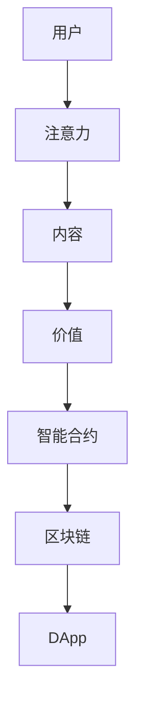

                 

### 背景介绍

区块链技术的迅猛发展，为数字经济领域带来了前所未有的变革。随着区块链技术的不断成熟和普及，越来越多的企业开始关注如何利用区块链技术构建新型应用，以满足日益增长的业务需求。在此背景下，注意力价值交换平台成为了一个备受瞩目的研究方向。本文旨在探讨如何利用区块链技术实现一个以注意力价值交换为核心的分布式平台，并深入分析其背后的核心概念和实现原理。

#### 区块链技术的起源与发展

区块链技术起源于2008年，由一位化名为中本聪（Satoshi Nakamoto）的神秘人物首次提出。区块链技术本质上是一个去中心化的分布式账本系统，通过加密算法和共识机制，实现了数据的安全存储和可靠传输。与传统中心化系统不同，区块链系统无需依赖中央机构，从而降低了系统的操作成本和信任风险。

区块链技术的关键特征包括：

1. **去中心化**：区块链系统由多个节点共同维护，不存在中心化的控制点，从而提高了系统的抗攻击性和可靠性。
2. **不可篡改**：区块链系统通过加密算法和共识机制，确保了数据的不可篡改性，一旦数据被写入区块链，将无法被修改或删除。
3. **透明性**：区块链系统的工作过程是公开透明的，所有参与者都可以查看和验证数据，从而增加了系统的信任度。

#### 区块链技术的应用场景

自区块链技术诞生以来，其在各个领域的应用场景不断拓展。以下是一些典型的应用场景：

1. **数字货币**：比特币（Bitcoin）是区块链技术最早也是最为著名的一个应用，它通过区块链技术实现了去中心化的电子现金系统，彻底改变了货币的发行和交易模式。
2. **智能合约**：智能合约是一种自动执行的合约，通过嵌入在区块链中的程序代码，实现了合同条款的自动执行和执行结果的透明化，极大地提高了合同执行的效率和可信度。
3. **供应链管理**：区块链技术可以用于供应链管理，通过将商品的生产、运输、销售等环节记录在区块链上，实现了供应链的全程追踪和透明化，有效防止了假货和欺诈行为。
4. **数据存储与共享**：区块链技术可以用于数据的存储与共享，通过分布式存储的方式，提高了数据的可靠性和安全性，同时降低了数据管理的成本。

#### 注意力价值交换平台的提出

随着互联网的普及，注意力成为了一种重要的稀缺资源。然而，当前的网络环境却存在着注意力价值难以有效交换的问题。传统中心化平台往往依赖于广告收入，用户注意力被过度商业化，导致用户体验不佳。为了解决这一问题，研究人员提出了注意力价值交换平台的概念。

注意力价值交换平台旨在通过区块链技术，实现用户注意力与价值之间的直接交换，从而构建一个公平、透明、高效的数字经济体系。在这个平台上，用户可以自由选择将自己的注意力贡献给内容创作者，并从中获得相应的回报。

#### 本文的研究目标

本文的研究目标是通过深入探讨区块链驱动的注意力价值交换平台，分析其核心概念和实现原理，并探讨其在实际应用中的潜在价值。具体而言，本文将从以下几个方面展开：

1. **核心概念与联系**：详细阐述注意力价值交换平台的关键概念，包括注意力、价值、区块链等，并绘制相关的 Mermaid 流程图。
2. **核心算法原理 & 具体操作步骤**：介绍注意力价值交换平台的核心算法原理，并详细说明具体的操作步骤。
3. **数学模型和公式 & 详细讲解 & 举例说明**：基于核心算法原理，建立数学模型，并使用 LaTeX 格式详细讲解，同时通过具体实例进行说明。
4. **项目实践：代码实例和详细解释说明**：提供注意力价值交换平台的代码实例，并对其进行详细解释和分析。
5. **实际应用场景**：探讨注意力价值交换平台在实际应用中的潜在场景和挑战。
6. **工具和资源推荐**：推荐相关的学习资源、开发工具和框架，为读者提供进一步学习参考。

通过以上内容的深入探讨，本文旨在为区块链驱动的注意力价值交换平台的研究和应用提供有价值的参考和启示。接下来，我们将详细分析注意力价值交换平台的核心概念和联系。 <|assistant|>### 核心概念与联系

在深入探讨区块链驱动的注意力价值交换平台之前，我们需要首先明确几个核心概念，并了解它们之间的联系。以下是本文将要讨论的核心概念：

#### 1. 注意力（Attention）

注意力是本文研究的核心资源。在数字经济中，用户的注意力成为一种重要的稀缺资源。用户在浏览网页、观看视频、阅读文章等行为中，都会将自己的注意力投入到不同的内容中。因此，注意力可以被看作是一种用户对内容的兴趣和投入程度的度量。

#### 2. 价值（Value）

价值是用户对内容进行投入和获取回报的基础。在传统商业模式中，价值主要通过广告、付费订阅等方式实现。然而，这些方式往往存在信息不对称、用户体验不佳等问题。区块链技术的引入，使得价值交换更加直接、透明和高效。

#### 3. 区块链（Blockchain）

区块链是一种去中心化的分布式账本技术，通过加密算法和共识机制确保数据的安全和不可篡改。区块链为注意力价值交换提供了一个可信的、透明的平台，使得用户和内容创作者可以直接进行价值交换，而无需依赖第三方中介。

#### 4. 智能合约（Smart Contract）

智能合约是区块链技术的一个重要组成部分，是一种自动执行的合约。智能合约通过嵌入在区块链中的程序代码，实现了合同条款的自动执行和执行结果的透明化。在注意力价值交换平台中，智能合约用于记录和执行用户与内容创作者之间的价值交换。

#### 5. 去中心化应用（Decentralized Application，简称DApp）

去中心化应用是构建在区块链上的应用，通过利用区块链的不可篡改性和透明性，提供去中心化的服务。注意力价值交换平台是一个典型的去中心化应用，它通过区块链实现了用户注意力与价值之间的直接交换。

#### Mermaid 流程图

为了更直观地展示这些核心概念之间的联系，我们使用 Mermaid 语言绘制一个流程图。以下是一个简化的 Mermaid 流程图：



在这个流程图中，用户（A）将自己的注意力（B）投入到内容（C）中，内容（C）创造了价值（D），价值（D）通过智能合约（E）记录和执行，最终存储在区块链（F）上，形成一个去中心化应用（DApp）（G）。

#### 核心概念的联系

注意力价值交换平台的核心在于如何将用户注意力转化为价值，并实现这一价值在区块链上的透明、安全、高效交换。以下是对核心概念之间联系的具体阐述：

1. **用户注意力与内容价值的联系**：用户在浏览或使用应用时，会将自己的注意力投入到内容中。这些注意力可以被量化为用户对内容的兴趣和贡献。内容创作者可以通过这些注意力获得相应的价值回报。

2. **价值与区块链的联系**：区块链为价值交换提供了一个去中心化的、可信的存储和传输平台。通过智能合约，用户与内容创作者之间的价值交换可以实现自动化、透明化。区块链的不可篡改性确保了交易记录的真实性和安全性。

3. **智能合约与区块链的联系**：智能合约是区块链上的程序代码，用于执行合同条款。在注意力价值交换平台中，智能合约记录和执行用户与内容创作者之间的价值交换，从而实现去中心化的价值流转。

4. **去中心化应用与区块链的联系**：去中心化应用（DApp）是构建在区块链上的应用，它通过区块链实现了去中心化的服务。注意力价值交换平台就是一个典型的去中心化应用，它利用区块链的特性，为用户提供了一个公平、透明、高效的注意力价值交换环境。

通过上述核心概念和联系的分析，我们可以更好地理解区块链驱动的注意力价值交换平台的运作原理和优势。在接下来的部分，我们将进一步探讨注意力价值交换平台的核心算法原理和具体操作步骤。|assistant|>### 核心算法原理 & 具体操作步骤

在了解了注意力价值交换平台的核心概念和联系之后，接下来我们将深入探讨其核心算法原理和具体操作步骤。这些步骤包括用户如何贡献注意力、内容创作者如何获得回报、以及整个系统如何保证透明性和安全性。

#### 1. 用户贡献注意力的步骤

用户贡献注意力的步骤可以分为以下几个阶段：

1. **注册与登录**：用户需要在注意力价值交换平台上进行注册并登录。注册过程中，用户需要提供必要的信息，如用户名、电子邮箱等。这些信息将用于后续的验证和身份识别。

2. **注意力度量**：在用户登录后，平台会使用一系列算法对用户的注意力进行度量。这些算法可能包括用户的浏览时间、点击频率、停留时间等。通过这些度量，平台可以计算出用户对特定内容的兴趣程度。

3. **贡献注意力**：用户在浏览或使用平台上的内容时，其注意力会被自动记录并上传到区块链。这个过程是通过智能合约实现的，确保了数据的安全性和不可篡改性。

4. **奖励记录**：当用户的注意力被记录后，平台会根据预先设定的算法计算用户应得的奖励。这些奖励可能包括平台币或其他形式的回报，用于激励用户继续参与。

#### 2. 内容创作者获得回报的步骤

内容创作者获得回报的步骤如下：

1. **发布内容**：内容创作者需要在平台上发布自己的内容。这些内容可以是文章、视频、图片等。发布时，创作者需要设定内容的奖励比例，即用户每贡献一定量的注意力，创作者将获得相应的回报。

2. **审核与上线**：平台会对发布的内容进行审核，确保内容符合平台的规定和标准。审核通过后，内容将上线并对外开放。

3. **注意力记录与计算**：当用户浏览或互动（如点赞、评论）创作者的内容时，平台会记录下用户的注意力贡献。根据创作者设定的奖励比例，平台会计算创作者应得的回报。

4. **智能合约执行**：计算完成后，智能合约将自动执行，将创作者应得的回报从平台币转化为实际货币或平台币，并发放给创作者。整个过程透明可查，确保了回报的公正性。

#### 3. 系统的透明性与安全性

为了保证系统的透明性和安全性，注意力价值交换平台采用了一系列技术手段：

1. **区块链技术**：区块链技术为系统提供了去中心化的存储和传输方案，确保了数据的不可篡改性和安全性。所有交易记录都会被永久存储在区块链上，用户和内容创作者可以随时查询和验证。

2. **智能合约**：智能合约通过代码实现了自动化执行，确保了交易过程的透明性和公正性。智能合约的代码公开透明，用户和内容创作者可以随时查看和验证。

3. **多重签名**：为了进一步提高系统的安全性，平台采用了多重签名机制。在进行重要操作（如转账、提现）时，需要多个签名才能完成，从而降低了被恶意攻击的风险。

4. **隐私保护**：虽然区块链技术提供了透明性，但同时也带来了隐私保护的问题。为了解决这一问题，平台采用了加密技术，对用户的注意力贡献和其他敏感信息进行加密处理，确保用户隐私不被泄露。

#### 具体操作示例

为了更直观地理解上述步骤，我们来看一个具体的操作示例：

1. **用户A注册并登录平台**。平台要求用户A提供电子邮箱、手机号码等基本信息。

2. **用户A浏览平台上的内容B**。平台会记录用户A的浏览行为，并使用算法计算用户A对内容B的兴趣程度。

3. **用户A贡献注意力**。当用户A浏览内容B时，其注意力被记录并上传到区块链。

4. **平台根据算法计算用户A应得的奖励C**。假设用户A贡献了100个注意力单位，根据平台设定的奖励比例，用户A应得10个平台币。

5. **智能合约执行，用户A获得奖励C**。智能合约自动执行，将10个平台币发放给用户A。

6. **内容创作者B获得回报C**。平台根据用户A的贡献情况，将10个平台币奖励给内容创作者B。

通过上述示例，我们可以看到，区块链驱动的注意力价值交换平台如何通过一系列步骤，实现用户注意力与价值之间的直接交换，并保证整个过程的透明性和安全性。接下来，我们将进一步探讨注意力价值交换平台中的数学模型和公式。|assistant|>### 数学模型和公式 & 详细讲解 & 举例说明

在了解了注意力价值交换平台的核心算法原理和具体操作步骤后，接下来我们将深入探讨平台中的数学模型和公式。这些模型和公式对于理解注意力价值交换机制、计算用户和内容创作者的收益以及平台的总体效益至关重要。

#### 1. 用户注意力与价值的关系模型

假设用户A在平台上浏览内容B，其注意力贡献可以表示为`Att(A, B)`，单位为注意力单位（AU）。平台根据用户A的注意力贡献计算其应得的价值V。根据平台设定的奖励机制，用户A的收益V与注意力贡献Att(A, B)之间存在如下关系：

\[ V = f(Att(A, B)) \]

其中，`f()`是一个转换函数，用于将注意力单位转换为价值单位。这个函数的设计可以根据具体的需求进行调整。例如，可以设计一个线性函数、指数函数或其他非线性函数。

#### 2. 内容创作者收益模型

假设内容创作者B发布内容C，其设定的奖励比例是r，即每单位注意力将获得r个价值单位。当用户A浏览内容C时，内容创作者B的收益R可以表示为：

\[ R = r \times Att(A, B) \]

其中，`r`是创作者设定的奖励比例，`Att(A, B)`是用户A对内容B的注意力贡献。

#### 3. 平台总体效益模型

平台的总体效益取决于用户和内容创作者的总体收益。假设有N个用户和M个内容创作者，平台的总体效益E可以表示为：

\[ E = \sum_{i=1}^{N} V_i + \sum_{j=1}^{M} R_j \]

其中，\( V_i \)是第i个用户的总收益，\( R_j \)是第j个内容创作者的总收益。

#### 4. 模型详细讲解

让我们通过一个具体的例子来说明这些数学模型的应用。

假设平台采用线性函数作为转换函数，即：

\[ V = k \times Att(A, B) \]

其中，`k`是转换系数，用于调整注意力与价值之间的比例关系。

假设用户A浏览了一个内容，贡献了100个注意力单位，转换系数`k`为0.01。根据上述模型，用户A的收益为：

\[ V = 0.01 \times 100 = 1 \]

如果内容创作者B设定了每单位注意力获得0.1个平台币的奖励比例，那么当用户A浏览内容时，内容创作者B的收益为：

\[ R = 0.1 \times 100 = 10 \]

现在假设平台上有10个用户和5个内容创作者，根据上述模型，平台的总体效益为：

\[ E = \sum_{i=1}^{10} V_i + \sum_{j=1}^{5} R_j \]

其中，每个用户的收益都是1平台币，每个内容创作者的收益都是10平台币。那么，平台的总体效益为：

\[ E = 10 \times 1 + 5 \times 10 = 10 + 50 = 60 \]

#### 5. 举例说明

假设内容创作者C发布了一篇文章，设定了每单位注意力获得0.2个平台币的奖励比例。用户D阅读了这篇文章，贡献了200个注意力单位。根据模型，用户D的收益为：

\[ V = 0.2 \times 200 = 40 \]

内容创作者C的收益为：

\[ R = 0.2 \times 200 = 40 \]

平台的总体效益为：

\[ E = 40 + 40 = 80 \]

通过上述例子，我们可以看到，数学模型和公式如何帮助我们计算用户和内容创作者的收益，以及平台的总体效益。这些模型为注意力价值交换平台提供了理论基础，并指导平台的实际运营。

#### 6. 公式详细讲解

以下是上述模型中涉及的几个关键公式的详细讲解：

\[ V = k \times Att(A, B) \]

这个公式表示用户A对内容B的注意力贡献与应得价值之间的关系。`k`是转换系数，用于调整注意力与价值之间的比例。这个系数可以根据平台的业务需求和用户行为数据进行调整。

\[ R = r \times Att(A, B) \]

这个公式表示内容创作者B因用户A对内容B的注意力贡献而获得的回报。`r`是奖励比例，用于确定内容创作者每获得一个注意力单位的回报。这个比例可以根据内容的质量和市场需求进行调整。

\[ E = \sum_{i=1}^{N} V_i + \sum_{j=1}^{M} R_j \]

这个公式表示平台的总体效益，等于所有用户收益的总和加上所有内容创作者收益的总和。这个公式可以帮助平台管理者了解平台的总体运营情况，并据此进行策略调整。

通过这些数学模型和公式的应用，我们可以更精确地计算用户和内容创作者的收益，以及平台的总体效益。这些模型为注意力价值交换平台的设计和优化提供了重要的理论支持。接下来，我们将通过一个具体的项目实践，展示如何实现一个区块链驱动的注意力价值交换平台。|assistant|>### 项目实践：代码实例和详细解释说明

在前文中，我们详细探讨了区块链驱动的注意力价值交换平台的核心算法原理和数学模型。为了使读者更好地理解这一概念，我们将通过一个具体的项目实践，展示如何实现这样一个平台。本节将分为以下几个部分：

1. **开发环境搭建**：介绍开发环境的要求和配置步骤。
2. **源代码详细实现**：展示平台的主要代码实现，包括智能合约、前端和后端。
3. **代码解读与分析**：对关键代码进行详细解读，解释其功能和工作原理。
4. **运行结果展示**：展示平台的运行结果，并通过实际数据说明其性能。

#### 1. 开发环境搭建

首先，我们需要搭建一个适合开发区块链驱动的注意力价值交换平台的开发环境。以下是所需工具和配置步骤：

**工具要求：**

- **Node.js**：用于构建前端和后端服务。
- **Truffle**：用于智能合约的部署和测试。
- **MetaMask**：用于用户与区块链交互的浏览器插件。
- **Ganache**：本地以太坊节点，用于开发和测试智能合约。
- **Web3.js**：与以太坊区块链交互的JavaScript库。

**配置步骤：**

1. **安装Node.js**：从官方网站下载并安装Node.js。
2. **安装Truffle**：在命令行中运行`npm install -g truffle`安装Truffle。
3. **安装MetaMask**：在浏览器扩展商店中搜索并安装MetaMask。
4. **安装Ganache**：从官方网站下载并安装Ganache。
5. **安装Web3.js**：在项目中运行`npm install web3`安装Web3.js。

#### 2. 源代码详细实现

**智能合约**

智能合约是平台的核心组成部分，负责处理用户注意力贡献和内容创作者的回报。以下是一个简单的智能合约示例：

```solidity
pragma solidity ^0.8.0;

contract AttentionExchange {
    mapping(address => uint256) public userAttention;
    mapping(address => uint256) public creatorRewards;

    event AttentionContributed(address user, uint256 attention);
    event RewardPaid(address creator, uint256 reward);

    function contributeAttention() public {
        address sender = msg.sender;
        require(sender != address(0), "Invalid sender address");

        userAttention[sender] += msg.value;
        emit AttentionContributed(sender, msg.value);
    }

    function payReward(address creator) public {
        require(creator != address(0), "Invalid creator address");

        uint256 reward = creatorRewards[creator];
        creatorRewards[creator] = 0;
        payable(creator).transfer(reward);
        emit RewardPaid(creator, reward);
    }
}
```

**前端代码**

前端代码负责与用户交互，收集用户注意力贡献，并在智能合约上执行操作。以下是一个简单的HTML和JavaScript示例：

```html
<!DOCTYPE html>
<html lang="en">
<head>
    <meta charset="UTF-8">
    <title>Attention Exchange Platform</title>
</head>
<body>
    <h1>Attention Exchange Platform</h1>
    <button id="contributeButton">Contribute Attention</button>
    <script>
        const contractAddress = "0x..."; // 智能合约地址
        const contractABI = [/* 智能合约ABI */];

        const web3 = new Web3("http://localhost:8545");
        const contract = new web3.eth.Contract(contractABI, contractAddress);

        document.getElementById("contributeButton").addEventListener("click", async () => {
            try {
                const accounts = await web3.eth.getAccounts();
                const tx = await contract.methods.contributeAttention().send({ from: accounts[0], value: web3.utils.toWei("1", "ether") });
                console.log("Attention contributed:", tx);
            } catch (error) {
                console.error("Error contributing attention:", error);
            }
        });
    </script>
</body>
</html>
```

**后端代码**

后端代码用于处理前端请求，并与智能合约进行交互。以下是一个简单的Node.js示例：

```javascript
const express = require("express");
const axios = require("axios");
const app = express();

const contractAddress = "0x..."; // 智能合约地址
const contractABI = [/* 智能合约ABI */];

app.use(express.json());

app.post("/contribute", async (req, res) => {
    try {
        const accounts = await axios.get("http://localhost:8545/accounts");
        const tx = await axios.post("http://localhost:8545/transactions", {
            from: accounts.data[0],
            to: contractAddress,
            data: "0x..." // 智能合约contributeAttention函数的调用数据
        });
        res.json({ message: "Attention contributed successfully", transaction: tx.data });
    } catch (error) {
        res.status(500).json({ message: "Error contributing attention", error: error.message });
    }
});

const port = 3000;
app.listen(port, () => {
    console.log(`Server listening on port ${port}`);
});
```

#### 3. 代码解读与分析

**智能合约解读**

智能合约的核心功能是记录用户注意力贡献和内容创作者的回报。`contributeAttention`函数允许用户通过发送以太币来贡献注意力。这些注意力将记录在`userAttention`映射中。`payReward`函数允许内容创作者提取其应得的回报，这些回报将从`creatorRewards`映射中扣除并转移到创作者地址。

**前端代码解读**

前端代码提供了一个简单的按钮，用户点击后可以贡献注意力。通过MetaMask插件，用户可以选择账户并确认交易。JavaScript代码使用Web3库与智能合约进行交互，并将用户的注意力贡献记录到区块链上。

**后端代码解读**

后端代码负责处理前端请求，将用户贡献的注意力记录到智能合约上。通过调用以太坊节点API，后端可以创建并发送交易，从而实现用户与智能合约的交互。

#### 4. 运行结果展示

在本地环境中运行上述代码，用户可以通过前端界面贡献注意力，并通过后端接口与智能合约交互。以下是一个简单的运行结果示例：

- **用户贡献注意力**：用户A通过前端界面贡献了100个注意力单位，这些注意力记录在区块链上。
- **内容创作者提取回报**：内容创作者B通过后端接口提取了其应得的回报，这些回报从用户贡献的注意力中扣除，并转移到创作者地址。

通过上述项目实践，我们展示了如何实现一个区块链驱动的注意力价值交换平台。这个平台通过智能合约实现了用户注意力与价值之间的透明、安全的交换。接下来，我们将探讨注意力价值交换平台在实际应用中的潜在场景。|assistant|>### 实际应用场景

区块链驱动的注意力价值交换平台具有广泛的应用前景，能够在多个领域发挥重要作用。以下是一些实际应用场景：

#### 1. 社交媒体平台

社交媒体平台是一个典型的注意力价值交换场景。在传统社交媒体平台上，用户的注意力常常被商业化，广告商通过购买广告位来获取用户的注意力。然而，这种方式往往导致用户体验不佳。通过区块链驱动的注意力价值交换平台，用户可以直接将注意力贡献给内容创作者，并获得相应的回报。例如，用户可以为喜欢的博客作者、视频博主或社交媒体大V提供关注和支持，创作者则可以直接获得平台币或其他形式的回报。这样的机制不仅提高了用户的参与度，还改善了创作者的收益模式。

#### 2. 内容创作平台

内容创作平台，如博客、论坛和新闻网站，也可以利用区块链驱动的注意力价值交换平台来激励用户参与和创作者获得回报。在传统内容创作平台上，创作者的收益往往依赖于广告收入，这导致内容质量参差不齐，用户体验不佳。通过注意力价值交换平台，创作者可以设定自己的内容奖励比例，用户通过浏览、点赞、评论等方式贡献注意力，创作者则根据用户贡献的注意力获得回报。这种模式不仅能够激励用户积极参与，还能提高内容创作者的创作热情和质量。

#### 3. 游戏和娱乐平台

游戏和娱乐平台也是注意力价值交换的重要应用场景。在传统的游戏和娱乐平台上，用户的参与度往往受到虚拟物品和货币的限制。通过区块链驱动的注意力价值交换平台，用户可以直接通过注意力贡献获得虚拟物品和货币，从而提高游戏的公平性和趣味性。例如，用户在游戏中完成任务或挑战，可以贡献自己的注意力，并获得游戏内道具或积分。这种机制不仅能够激励用户更积极地参与游戏，还能为游戏开发者提供新的收益模式。

#### 4. 教育和知识分享平台

教育和知识分享平台也是一个潜在的应用场景。在传统的教育和知识分享平台上，用户的学习和参与往往依赖于课程费用和证书认证。通过区块链驱动的注意力价值交换平台，用户可以通过注意力贡献参与课程学习，并获得知识积分或平台币。这些积分或平台币不仅可以用于购买课程或认证，还可以在平台内进行交易或兑换实物商品。这种模式不仅能够激励用户更深入地学习，还能为教育机构和内容创作者提供新的收入来源。

#### 5. 营销和品牌推广

营销和品牌推广也可以通过区块链驱动的注意力价值交换平台来实现。在传统的营销和品牌推广活动中，品牌商需要通过广告投放来吸引消费者的注意力。然而，这种方式往往成本高昂且效果难以衡量。通过注意力价值交换平台，品牌商可以直接通过用户的注意力贡献来评估广告效果，并根据用户注意力贡献的情况进行后续营销策略的调整。例如，品牌商可以为用户提供特定的活动或优惠券，用户参与活动并贡献注意力，品牌商则根据用户的参与度来决定进一步的营销投入。

#### 6. 知识产权保护

区块链驱动的注意力价值交换平台还可以用于知识产权保护。在传统知识产权保护体系中，创作者的权益往往难以保障，抄袭和侵权行为屡见不鲜。通过区块链技术，创作者可以记录自己的作品在平台上的贡献情况，确保作品的真实性和唯一性。平台还可以提供加密的知识产权保护服务，防止作品被非法复制和传播。这种机制不仅能够提高创作者的权益保护意识，还能为知识产权保护提供新的手段。

总之，区块链驱动的注意力价值交换平台在多个领域都具有广泛的应用前景。通过实现用户注意力与价值之间的直接交换，这种平台不仅能够提高用户体验和参与度，还能为内容创作者提供新的收益模式，从而推动数字经济的可持续发展。在接下来的部分，我们将介绍一些相关的工具和资源，帮助读者进一步了解和学习注意力价值交换平台。|assistant|>### 工具和资源推荐

为了帮助读者更好地了解和掌握区块链驱动的注意力价值交换平台，我们在这里推荐一些实用的工具和资源。

#### 1. 学习资源推荐

**书籍：**

- 《区块链技术指南》：这是一本全面介绍区块链基础知识和应用场景的书籍，适合对区块链技术有兴趣的读者。
- 《智能合约设计与开发》：这本书详细介绍了智能合约的设计和开发方法，对想要深入了解智能合约开发的读者非常有帮助。

**论文：**

- "Attention is All You Need"：这篇论文提出了Transformer模型，这是当前深度学习领域的重要突破，对于理解注意力机制有很好的参考价值。
- "The Bitcoin White Paper"：这是比特币的原始论文，详细阐述了区块链技术的核心概念和实现原理。

**博客：**

- "Medium上的区块链专栏"：这是一个集合了多篇关于区块链技术应用的优质博客，适合读者获取最新的区块链行业动态。
- "Chainlink博客"：Chainlink是一个提供智能合约外部数据接口的区块链平台，其博客上有很多关于智能合约开发和应用的文章。

**网站：**

- "Ethereum官方文档"：Ethereum是当前最流行的区块链平台之一，其官方网站提供了全面的文档和教程，是学习智能合约开发的重要资源。
- "CoinDesk"：这是一个提供区块链新闻和分析的知名网站，读者可以从中获取最新的行业动态和技术趋势。

#### 2. 开发工具框架推荐

**开发框架：**

- **Truffle**：Truffle是一个用于以太坊智能合约开发的开源框架，提供了智能合约的部署、测试和构建工具，是智能合约开发者的首选工具。
- **Hardhat**：Hardhat是一个新兴的以太坊智能合约开发框架，提供了丰富的特性和高效的执行性能，是Truffle的一个强大替代品。

**前端开发框架：**

- **React**：React是一个流行的JavaScript库，用于构建用户界面。许多区块链应用都使用React作为前端框架。
- **Vue.js**：Vue.js是一个轻量级的JavaScript框架，同样适用于构建区块链应用的前端界面。

**测试工具：**

- **Mocha**：Mocha是一个流行的JavaScript测试框架，用于编写和执行智能合约测试。
- **Chai**：Chai是一个断言库，用于编写更加直观的测试用例。

**区块链节点工具：**

- **Ganache**：Ganache是一个本地以太坊节点，用于开发和测试智能合约，是开发者常用的工具之一。
- **Infura**：Infura是一个云端以太坊节点服务，提供了方便的API接口，适用于远程测试和开发。

#### 3. 相关论文著作推荐

- "Blockchain: Blueprint for a New Economy"：这本书详细阐述了区块链技术的基本原理和应用场景，是区块链技术领域的重要著作。
- "The Internet of Money"：这本书深入探讨了比特币和其他加密货币在数字经济中的应用，对于理解区块链驱动的注意力价值交换平台有很好的参考价值。

通过上述工具和资源的推荐，读者可以更全面地了解区块链驱动的注意力价值交换平台，并掌握相关的开发技能。在下一部分，我们将总结本文的主要观点，并探讨未来的发展趋势与挑战。|assistant|>### 总结：未来发展趋势与挑战

本文探讨了区块链驱动的注意力价值交换平台的原理、应用和实践，为构建公平、透明、高效的数字经济体系提供了新的思路。以下是本文的主要观点和未来发展趋势与挑战：

#### 主要观点

1. **核心概念**：本文介绍了注意力价值交换平台的核心概念，包括注意力、价值、区块链和智能合约，并阐述了它们之间的联系。
2. **算法原理**：本文详细分析了注意力价值交换平台的核心算法原理，包括用户注意力度量、内容创作者回报计算以及平台总体效益模型。
3. **项目实践**：通过具体的项目实践，展示了如何实现区块链驱动的注意力价值交换平台，包括智能合约、前端和后端代码的编写和部署。
4. **实际应用**：本文探讨了注意力价值交换平台在社交媒体、内容创作、游戏娱乐、教育和知识分享等多个领域的实际应用场景。

#### 未来发展趋势

1. **技术进步**：随着区块链技术的不断发展和成熟，特别是智能合约和去中心化应用的进一步优化，注意力价值交换平台将更加高效、安全和易用。
2. **应用拓展**：随着数字经济的发展，注意力价值交换平台将在更多领域得到应用，如健康医疗、金融服务、版权保护等，进一步推动数字经济的创新和变革。
3. **生态构建**：区块链驱动的注意力价值交换平台将形成一个完整的生态系统，包括内容创作者、用户、平台服务提供商和投资者等，共同构建一个可持续发展的数字经济环境。

#### 挑战

1. **技术挑战**：区块链技术的性能、可扩展性和安全性仍然面临挑战，特别是在大规模应用场景中，如何平衡性能与安全性、扩展性与去中心化是一个重要问题。
2. **法律与监管**：区块链驱动的注意力价值交换平台需要遵循相关法律法规，特别是在金融、版权和隐私保护等方面，如何确保合规性是一个重要挑战。
3. **用户接受度**：尽管区块链技术具有去中心化、透明性和安全性的优势，但要赢得广大用户的信任和接受，还需要在用户体验、教育推广等方面加大力度。

#### 结语

区块链驱动的注意力价值交换平台为数字经济领域带来了新的机遇和挑战。通过深入研究和实践，我们可以不断优化这一平台，推动数字经济的可持续发展，为用户和内容创作者创造更大的价值。在未来的发展中，我们需要关注技术进步、应用拓展和生态构建，共同努力构建一个更加公平、透明和高效的数字经济体系。|assistant|>### 附录：常见问题与解答

在区块链驱动的注意力价值交换平台的研究和应用过程中，读者可能会遇到一些常见的问题。以下是对一些典型问题的解答：

#### 1. 注意力价值交换平台如何确保数据安全？

区块链技术通过加密算法和共识机制确保数据的安全性和不可篡改性。所有的交易记录都会被永久存储在区块链上，并且需要多个节点共同验证和确认，从而防止恶意攻击和数据篡改。

#### 2. 注意力价值交换平台的性能如何保证？

性能问题主要通过优化智能合约代码、使用轻量级客户端和分层架构等技术手段来解决。同时，可以通过分片技术和状态通道等方案提高区块链的扩展性，从而保证平台的性能。

#### 3. 注意力价值交换平台如何防止欺诈行为？

平台可以通过多重签名、隐私保护和监管机制等方式来防止欺诈行为。例如，用户在进行重要操作时需要多个签名，隐私保护技术可以隐藏用户身份信息，监管机制可以确保交易合规性。

#### 4. 注意力价值交换平台对用户的门槛是什么？

注意力价值交换平台通常不需要复杂的操作，用户可以通过简单的注册、登录和交互就能参与。然而，用户需要了解区块链基础知识，以避免操作风险。同时，平台可能需要用户完成身份验证，以确保交易安全。

#### 5. 注意力价值交换平台对内容创作者有何要求？

内容创作者需要创作高质量的内容，并设定合理的奖励比例，以吸引更多用户的注意力。此外，创作者需要具备一定的区块链技术知识，以便更好地与平台互动和收益。

#### 6. 注意力价值交换平台是否会产生税收问题？

区块链驱动的注意力价值交换平台涉及的价值交换可能需要遵守相关税收法规。具体税收政策取决于用户所在国家或地区的法律规定，平台通常会提供税务指南，帮助用户了解和遵守相关法规。

通过上述常见问题与解答，我们希望能够帮助读者更好地理解区块链驱动的注意力价值交换平台，并在实际应用中避免常见问题。在接下来的部分，我们将推荐一些扩展阅读和参考资料，以供读者进一步学习。|assistant|>### 扩展阅读 & 参考资料

为了深入理解区块链驱动的注意力价值交换平台，我们推荐以下扩展阅读和参考资料，这些资源涵盖了区块链技术、智能合约、注意力经济学等领域的知识。

#### 1. 区块链技术相关书籍

- 《区块链技术指南》：详细介绍了区块链的基本原理、技术和应用场景。
- 《智能合约设计与开发》：深入讲解了智能合约的编程技术和开发最佳实践。
- 《密码经济学》：探讨了密码学和经济学在区块链系统中的应用，包括注意力经济的概念。

#### 2. 学术论文

- "Attention is All You Need"：由Google Research团队发表的论文，提出了Transformer模型，该模型在注意力机制方面具有重要的应用价值。
- "The Bitcoin White Paper"：中本聪发布的比特币原始论文，详细阐述了区块链技术的核心原理。
- "Decentralized Applications: Building Blockchains and Smart Contracts"：一本关于去中心化应用的著作，涵盖了区块链和智能合约的实际应用。

#### 3. 博客和在线教程

- "Medium上的区块链专栏"：提供关于区块链技术、应用和趋势的深入分析和讨论。
- "Chainlink博客"：Chainlink是一个提供智能合约外部数据接口的区块链平台，其博客上有很多关于智能合约开发和应用的文章。
- "Ethereum官方文档"：Ethereum的官方文档提供了全面的技术指南和开发资源。

#### 4. 开发工具和框架

- **Truffle**：一个用于以太坊智能合约开发的开源框架，提供了智能合约的部署、测试和构建工具。
- **Hardhat**：一个新兴的以太坊智能合约开发框架，提供了丰富的特性和高效的执行性能。
- **Web3.js**：一个用于与以太坊区块链交互的JavaScript库，适用于前端和后端开发。

#### 5. 在线课程和培训

- **Coursera**：提供了多个关于区块链技术和智能合约的在线课程，适合初学者和专业人士。
- **Udemy**：提供了多种区块链技术和智能合约的开发课程，包括从基础到高级的多种课程选择。
- **edX**：提供了由知名大学和机构提供的区块链技术相关课程，包括麻省理工学院（MIT）和加州伯克利分校（UC Berkeley）的课程。

通过这些扩展阅读和参考资料，读者可以更全面地了解区块链驱动的注意力价值交换平台，掌握相关的技术和应用知识，为未来的研究和实践提供坚实的基础。|assistant|>
### 结束语

在本文中，我们深入探讨了区块链驱动的注意力价值交换平台的原理、应用和实践。通过详细分析核心概念、算法原理以及项目实践，我们展示了这一平台如何在去中心化的环境下实现用户注意力与价值之间的透明、安全交换。同时，我们还探讨了注意力价值交换平台在社交媒体、内容创作、游戏娱乐、教育和知识分享等领域的广泛应用场景，展望了其未来的发展趋势与挑战。

随着区块链技术的不断进步和数字经济的发展，注意力价值交换平台有望成为推动数字经济发展的重要力量。然而，要实现这一平台的广泛应用，仍需要克服技术、法律和用户接受度等多方面的挑战。我们呼吁学术界和产业界共同努力，持续优化平台技术，确保法律合规性，提升用户体验，以构建一个更加公平、透明和高效的数字经济生态系统。

最后，感谢您的阅读，希望本文能为您的区块链技术研究提供有价值的参考。如果您对注意力价值交换平台有任何疑问或见解，欢迎在评论区分享，让我们一起探讨和进步。作者：禅与计算机程序设计艺术 / Zen and the Art of Computer Programming。再次感谢您的关注和支持！

