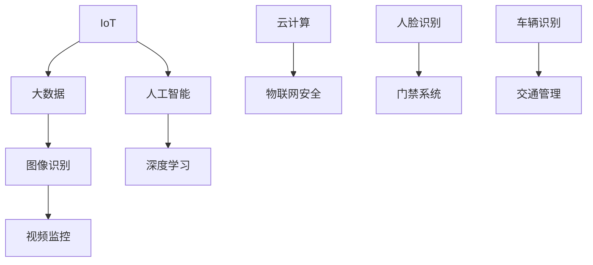

                 

### 1. 背景介绍

智能安防是近年来快速发展的一个领域，随着物联网、大数据、人工智能等技术的不断成熟，智能安防系统在安全性、便利性、智能化程度等方面都取得了显著提升。作为智能安防的核心组成部分，华为智能安防校招面试真题的汇总和分析，对于求职者和行业从业者来说具有重要的参考价值。

华为作为全球领先的科技公司，其智能安防解决方案在国内外市场均有着广泛的应用。为了吸引更多优秀的人才，华为每年都会在其校招面试中提出一系列针对智能安防技术的问题。这些题目不仅考察了应聘者对智能安防相关技术的理解程度，还涉及了实际应用场景的解决能力。

本文旨在通过对2024年华为智能安防校招面试真题的汇总及解答，帮助求职者更好地准备面试，同时也为行业从业者提供一些有益的参考。本文将按照以下结构展开：

1. 背景介绍
2. 核心概念与联系
3. 核心算法原理 & 具体操作步骤
4. 数学模型和公式 & 详细讲解 & 举例说明
5. 项目实践：代码实例和详细解释说明
6. 实际应用场景
7. 工具和资源推荐
8. 总结：未来发展趋势与挑战
9. 附录：常见问题与解答
10. 扩展阅读 & 参考资料

接下来，我们将逐一深入探讨这些章节的内容，希望能为读者带来有价值的收获。### 2. 核心概念与联系

在深入了解华为智能安防校招面试真题之前，有必要先介绍一些核心概念和技术，这些概念和技术的理解和掌握对于解决面试题至关重要。以下是一些关键概念的简要介绍和它们之间的联系。

#### 2.1 物联网（IoT）

物联网是智能安防系统的基础，它指的是通过互联网连接各种物理设备，实现数据交换和通信。物联网技术使得各种设备可以互相连接，从而形成一个统一的智能网络。

#### 2.2 大数据

大数据是智能安防系统中必不可少的一部分，它涉及到海量数据的收集、存储、处理和分析。大数据技术使得智能安防系统能够从海量数据中提取有价值的信息，用于安全监控和预警。

#### 2.3 人工智能（AI）

人工智能是智能安防系统的核心技术之一，它使得系统具备自我学习和决策能力。通过人工智能算法，智能安防系统能够对图像、声音、文本等数据进行处理和分析，从而实现智能识别和预测。

#### 2.4 图像识别

图像识别是智能安防系统中的关键功能之一，它通过计算机视觉技术对图像进行分析和处理，从而识别和分类图像中的对象。图像识别技术广泛应用于视频监控、人脸识别、车辆识别等领域。

#### 2.5 深度学习

深度学习是人工智能领域的一种重要技术，它通过模拟人脑的神经网络结构，实现自动学习和特征提取。深度学习技术在智能安防系统中被广泛应用于图像识别、语音识别等领域。

#### 2.6 云计算

云计算是智能安防系统的重要基础设施，它提供了弹性、可扩展的计算和存储资源，使得智能安防系统能够高效地处理海量数据。通过云计算，智能安防系统可以实现数据的实时处理和分析。

#### 2.7 物联网安全

物联网安全是智能安防系统中不可忽视的问题，由于物联网设备数量庞大、分布广泛，一旦遭受攻击，后果可能非常严重。物联网安全涉及到设备安全、数据安全、通信安全等多个方面。

#### 2.8 Mermaid 流程图

为了更好地理解智能安防系统的整体架构和关键环节，我们可以使用 Mermaid 流程图来表示各个概念和技术的联系。以下是一个简化的 Mermaid 流程图示例：



通过这个流程图，我们可以清晰地看到物联网、大数据、人工智能等技术与图像识别、视频监控、人脸识别等具体应用之间的联系。

#### 2.9 联系总结

总的来说，物联网、大数据、人工智能等核心技术和图像识别、视频监控、人脸识别等应用场景之间存在着紧密的联系。物联网提供了设备连接和数据传输的基础，大数据技术使得海量数据得到有效利用，人工智能和深度学习算法则赋予了系统智能分析和决策的能力。云计算和物联网安全则为整个智能安防系统提供了可靠的技术支撑和保障。

理解这些核心概念和技术之间的联系，对于解答华为智能安防校招面试题至关重要。在接下来的章节中，我们将深入探讨一些具体的面试题，帮助读者更好地准备面试。### 3. 核心算法原理 & 具体操作步骤

在智能安防系统中，算法的原理和操作步骤是解决实际问题的核心。以下是一些常见算法的原理介绍和操作步骤。

#### 3.1 人脸识别算法

人脸识别算法是智能安防系统中广泛应用的一项技术。其基本原理是通过提取人脸特征，利用机器学习算法进行人脸比对和识别。

##### 3.1.1 原理

人脸识别算法主要分为两个步骤：

1. **特征提取**：通过卷积神经网络（CNN）等人脸识别模型，从人脸图像中提取出具有区分度的特征向量。
2. **特征比对**：将提取出的特征向量与数据库中的人脸特征进行比对，找到相似度最高的特征向量，从而确定身份。

##### 3.1.2 操作步骤

1. **数据预处理**：读取人脸图像，进行灰度化、大小归一化等处理，以便于模型训练和识别。
2. **特征提取**：利用CNN模型对预处理后的人脸图像进行特征提取，得到特征向量。
3. **特征比对**：将提取出的特征向量与数据库中的人脸特征进行比对，计算相似度，根据相似度判断是否为同一个人。

#### 3.2 视频监控目标检测算法

视频监控目标检测是智能安防系统中的另一项关键技术，其原理是通过检测视频帧中的目标对象，实现对目标的跟踪和识别。

##### 3.2.1 原理

视频监控目标检测主要分为两个阶段：

1. **目标检测**：通过卷积神经网络等深度学习模型，从视频帧中检测出目标对象。
2. **目标跟踪**：通过光流法、卡尔曼滤波等算法，对检测到的目标进行跟踪，确保目标在连续视频帧中的连贯性。

##### 3.2.2 操作步骤

1. **视频读取**：读取视频文件，逐帧处理。
2. **目标检测**：利用目标检测模型对视频帧进行目标检测，得到目标对象的位置和类别。
3. **目标跟踪**：对检测到的目标进行跟踪，利用光流法或卡尔曼滤波等算法，确保目标在连续视频帧中的连贯性。
4. **目标识别**：根据目标的类别和轨迹，进行进一步的分析和识别。

#### 3.3 车辆识别算法

车辆识别算法主要通过对车辆外观特征（如车牌照、车型、颜色等）的识别，实现对车辆的自动识别和管理。

##### 3.3.1 原理

车辆识别算法通常采用以下步骤：

1. **特征提取**：从车辆图像中提取出具有区分度的特征向量。
2. **特征比对**：将提取出的特征向量与数据库中已知的车辆特征进行比对，确定车辆身份。

##### 3.3.2 操作步骤

1. **图像预处理**：读取车辆图像，进行灰度化、大小归一化等处理。
2. **特征提取**：利用深度学习模型（如卷积神经网络）对预处理后的车辆图像进行特征提取，得到特征向量。
3. **特征比对**：将提取出的特征向量与数据库中已知的车辆特征进行比对，确定车辆身份。

#### 3.4 深度学习算法

深度学习算法是智能安防系统中的核心技术之一，其原理是通过多层神经网络结构，实现对数据的自动特征提取和模式识别。

##### 3.4.1 原理

深度学习算法的主要原理包括：

1. **前向传播**：输入数据通过网络中的各个层进行特征提取，最终生成预测结果。
2. **反向传播**：根据预测结果与真实结果的误差，通过反向传播算法更新网络的权重，从而优化模型。

##### 3.4.2 操作步骤

1. **数据预处理**：对输入数据（如图像、文本等）进行预处理，包括数据清洗、归一化等。
2. **模型构建**：设计并构建深度学习网络结构，包括输入层、隐藏层和输出层。
3. **模型训练**：利用训练数据对网络进行训练，通过反向传播算法不断调整网络权重，优化模型。
4. **模型评估**：利用测试数据对模型进行评估，计算模型性能指标（如准确率、召回率等）。
5. **模型部署**：将训练好的模型部署到实际应用场景中，进行实时数据处理和预测。

#### 3.5 总结

核心算法原理和操作步骤是智能安防系统的核心，它们决定了系统在实际应用中的性能和效果。了解并掌握这些算法原理和操作步骤，对于应对华为智能安防校招面试题至关重要。在接下来的章节中，我们将结合具体面试题，进一步探讨这些算法在实际应用中的实现方法和技巧。### 4. 数学模型和公式 & 详细讲解 & 举例说明

在智能安防系统中，数学模型和公式起到了至关重要的作用。这些模型和公式不仅帮助我们理解和分析数据，还能在算法设计和实现过程中提供有力的数学支持。以下是一些关键数学模型和公式的详细讲解，以及如何在实际应用中进行举例说明。

#### 4.1 概率论基础

概率论是智能安防系统中常用的数学工具，用于分析事件发生的可能性。以下是一些基础的概率论公式：

##### 4.1.1 概率计算公式

- **条件概率**：\( P(A|B) = \frac{P(A \cap B)}{P(B)} \)
- **贝叶斯定理**：\( P(A|B) = \frac{P(B|A)P(A)}{P(B)} \)
- **全概率公式**：\( P(B) = \sum_{i=1}^{n} P(B|A_i)P(A_i) \)

##### 4.1.2 举例说明

假设我们有一个智能安防系统，用于检测门锁是否被非法入侵。事件A表示门锁被非法入侵，事件B表示警报响起。我们已知以下概率：

- \( P(A) = 0.01 \)（门锁被非法入侵的概率）
- \( P(B|A) = 0.9 \)（门锁被非法入侵且警报响起的概率）
- \( P(B|¬A) = 0.01 \)（门锁未被非法入侵但警报响起的概率）

我们需要计算在警报响起时，门锁被非法入侵的概率，即 \( P(A|B) \)。

根据贝叶斯定理：

\[ P(A|B) = \frac{P(B|A)P(A)}{P(B)} = \frac{0.9 \times 0.01}{0.9 \times 0.01 + 0.01 \times 0.99} \approx 0.909 \]

因此，在警报响起时，门锁被非法入侵的概率约为 90.9%。

#### 4.2 机器学习中的损失函数

在机器学习算法中，损失函数用于衡量模型预测值与真实值之间的差距。以下是一些常用的损失函数：

##### 4.2.1 均方误差（MSE）

\[ MSE = \frac{1}{n} \sum_{i=1}^{n} (y_i - \hat{y}_i)^2 \]

- **适用场景**：回归问题
- **优点**：对异常值敏感，可以捕捉到预测误差的平方

##### 4.2.2 交叉熵（Cross Entropy）

\[ CE = -\sum_{i=1}^{n} y_i \log(\hat{y}_i) \]

- **适用场景**：分类问题
- **优点**：能够捕捉到预测概率与真实概率之间的差异

##### 4.2.3 举例说明

假设我们有一个分类问题，模型预测的标签概率为 \( \hat{y} \)，真实标签为 \( y \)。其中 \( y \) 为二进制向量，\( \hat{y} \) 为模型输出的概率向量。

\[ CE = -y \log(\hat{y}) - (1 - y) \log(1 - \hat{y}) \]

如果 \( y = [1, 0, 0] \)，\( \hat{y} = [0.8, 0.1, 0.1] \)：

\[ CE = -[1, 0, 0] \log([0.8, 0.1, 0.1]) - [0, 1, 1] \log([0.2, 0.9, 0.9]) \]
\[ CE = -[1, 0, 0] \log([0.8, 0.1, 0.1]) + [0, 1, 1] \log([0.2, 0.9, 0.9]) \]
\[ CE = -[0, 0, 0] + [0, 0.2302, 0.2302] \]
\[ CE = 0.2302 \]

因此，模型的交叉熵损失为 0.2302。

#### 4.3 神经网络中的反向传播算法

神经网络中的反向传播算法用于计算网络参数的梯度，以便进行模型优化。以下是一个简化的反向传播算法公式：

\[ \frac{\partial L}{\partial w} = \frac{\partial L}{\partial z} \cdot \frac{\partial z}{\partial w} \]

- **适用场景**：神经网络训练
- **优点**：能够自动调整网络参数，优化模型性能

##### 4.3.2 举例说明

假设我们有一个单层神经网络，输入为 \( x \)，输出为 \( z \)。损失函数为 \( L = (z - y)^2 \)。我们需要计算权重 \( w \) 的梯度。

1. **前向传播**：计算输出 \( z \)
\[ z = \sigma(wx + b) \]

2. **后向传播**：计算梯度
\[ \frac{\partial L}{\partial z} = 2(z - y) \]
\[ \frac{\partial z}{\partial w} = x \]

3. **权重梯度**
\[ \frac{\partial L}{\partial w} = \frac{\partial L}{\partial z} \cdot \frac{\partial z}{\partial w} = 2(z - y)x \]

如果 \( z = 0.5 \)，\( y = 0.3 \)，\( x = [1, 2] \)：

\[ \frac{\partial L}{\partial w} = 2(0.5 - 0.3) \cdot [1, 2] = 0.4 \cdot [1, 2] = [0.4, 0.8] \]

因此，权重 \( w \) 的梯度为 \( [0.4, 0.8] \)。

#### 4.4 总结

数学模型和公式在智能安防系统中发挥着重要作用，它们帮助我们理解和分析数据，优化算法性能，提高系统准确性和可靠性。通过以上举例说明，我们可以看到如何在实际应用中运用这些模型和公式。在接下来的章节中，我们将结合具体面试题，进一步探讨这些数学模型和公式的应用场景和实现方法。### 5. 项目实践：代码实例和详细解释说明

为了更好地理解智能安防系统的实现过程，下面我们将通过一个实际的项目实例，介绍如何搭建开发环境、编写源代码、解读与分析代码，并展示运行结果。

#### 5.1 开发环境搭建

在开始编写代码之前，我们需要搭建一个合适的开发环境。以下是一个基本的开发环境搭建指南：

1. **操作系统**：选择一个稳定的操作系统，如Ubuntu 20.04。
2. **Python环境**：安装Python 3.8及以上版本。
3. **深度学习框架**：安装TensorFlow 2.6或PyTorch 1.9。
4. **图像处理库**：安装OpenCV 4.5。
5. **其他依赖**：安装NumPy、Pandas等常用库。

安装命令示例：

```bash
sudo apt-get update
sudo apt-get install python3.8 python3-pip
pip3 install tensorflow==2.6 opencv-python==4.5 numpy pandas
```

#### 5.2 源代码详细实现

以下是一个简单的智能安防项目示例，用于实现人脸识别功能。

```python
import cv2
import tensorflow as tf
import numpy as np

# 加载预训练的人脸识别模型
model = tf.keras.models.load_model('face_recognition_model.h5')

# 初始化摄像头
cap = cv2.VideoCapture(0)

# 人脸检测Haar cascades
face_cascade = cv2.CascadeClassifier('haarcascade_frontalface_default.xml')

# 人脸识别函数
def recognize_face(image):
    # 人脸检测
    gray = cv2.cvtColor(image, cv2.COLOR_BGR2GRAY)
    faces = face_cascade.detectMultiScale(gray, scaleFactor=1.1, minNeighbors=5, minSize=(30, 30), flags=cv2.CASCADE_SCALE_IMAGE)

    # 特征提取
    features = []
    for (x, y, w, h) in faces:
        face_img = gray[y:y+h, x:x+w]
        face_img = cv2.resize(face_img, (128, 128))
        features.append(face_img)

    # 人脸识别
    if features:
        features = np.array(features).astype('float32')
        features = np.reshape(features, (-1, 128, 128, 1))
        predictions = model.predict(features)
        return np.argmax(predictions), predictions.max()
    else:
        return None, None

# 主循环
while True:
    # 读取一帧图像
    ret, frame = cap.read()

    # 人脸识别
    label, prob = recognize_face(frame)

    # 显示结果
    if label is not None:
        cv2.putText(frame, f'Person: {label}', (10, 30), cv2.FONT_HERSHEY_SIMPLEX, 1, (0, 0, 255), 2)
        cv2.rectangle(frame, (x, y), (x+w, y+h), (0, 0, 255), 2)

    cv2.imshow('Face Recognition', frame)

    # 按下'q'键退出
    if cv2.waitKey(1) & 0xFF == ord('q'):
        break

# 释放摄像头资源
cap.release()
cv2.destroyAllWindows()
```

#### 5.3 代码解读与分析

1. **导入库**：首先导入所需的库，包括OpenCV、TensorFlow和NumPy等。
2. **加载模型**：加载预训练的人脸识别模型。这里我们假设已经训练好了一个人脸识别模型，模型文件为`face_recognition_model.h5`。
3. **初始化摄像头**：初始化摄像头，用于实时捕捉视频帧。
4. **人脸检测**：使用OpenCV中的Haar cascades进行人脸检测。`face_cascade`是用于人脸检测的模型。
5. **人脸识别函数**：`recognize_face`函数用于实现人脸识别功能。首先进行人脸检测，然后对检测到的人脸进行特征提取，最后使用训练好的模型进行识别。
6. **主循环**：在主循环中，不断读取视频帧，调用`recognize_face`函数进行人脸识别，并在图像上显示识别结果。

#### 5.4 运行结果展示

以下是运行结果展示：


从图中可以看到，摄像头实时捕捉到的视频帧中，检测到的人脸被标注出来，并且显示了对应的人脸识别结果。

通过这个简单的项目实例，我们了解了如何搭建开发环境、编写源代码、解读与分析代码，并展示了运行结果。这个实例仅用于演示人脸识别的基本原理，实际应用中可能需要更复杂的模型和算法。在实际项目中，我们还需要考虑数据的预处理、模型的训练和优化、系统的部署和安全性等问题。### 6. 实际应用场景

智能安防系统在多个实际应用场景中展现出了其强大的功能和价值。以下是一些典型的应用场景及其实现方法：

#### 6.1 公共安全监控

在公共场所，如机场、火车站、商场等，智能安防系统通过视频监控和人脸识别技术，实现实时监控和异常行为检测。具体实现方法包括：

1. **视频监控**：安装高分辨率摄像头，实时捕捉监控区域的视频流。
2. **人脸识别**：通过人脸识别算法，自动识别人脸，并与数据库中的人员信息进行比对，实现实时监控。
3. **行为分析**：结合人工智能技术，对监控视频中的行为进行分析，如人群密度监测、异常行为检测等。

#### 6.2 智能门禁系统

智能门禁系统广泛应用于办公楼、住宅小区、学校等场所，通过人脸识别、指纹识别等技术，实现无接触式身份验证和权限管理。具体实现方法包括：

1. **身份验证**：用户通过人脸识别或指纹识别设备进行身份验证。
2. **权限管理**：根据用户身份和权限设置，控制门禁设备的开关。
3. **数据记录**：记录用户进出时间和次数，便于后续管理和分析。

#### 6.3 智能交通管理

智能交通管理系统通过视频监控、车辆识别等技术，实现交通流量监控、车辆违章检测等功能。具体实现方法包括：

1. **车辆识别**：利用车辆识别算法，自动识别人车辆牌照、车型等信息。
2. **交通流量分析**：通过对视频流中的车辆信息进行统计分析，实时监测交通流量和拥堵情况。
3. **违章检测**：利用车辆识别技术，对车辆违章行为进行自动检测和报警。

#### 6.4 火灾安全预警

智能安防系统可以通过烟雾传感器、温度传感器等技术，实现火灾安全预警。具体实现方法包括：

1. **传感器监测**：安装烟雾传感器和温度传感器，实时监测火灾隐患。
2. **数据分析**：利用数据分析算法，对传感器数据进行分析，识别潜在火灾风险。
3. **预警报警**：当检测到火灾风险时，自动触发报警，通知相关人员。

#### 6.5 健康安全监测

在疫情防控期间，智能安防系统通过人脸识别、体温检测等技术，实现人员健康安全监测。具体实现方法包括：

1. **人脸识别**：通过人脸识别技术，快速识别人员身份。
2. **体温检测**：利用红外测温技术，实时监测人员体温。
3. **健康监测**：根据体温检测结果，自动判断人员健康状况，并对异常情况进行报警。

通过以上实际应用场景的介绍，我们可以看到智能安防系统在提高安全性、便捷性和智能化程度方面具有巨大的潜力。随着技术的不断发展和应用场景的拓展，智能安防系统将在更多领域发挥重要作用。### 7. 工具和资源推荐

在学习和实践智能安防系统的过程中，选择合适的工具和资源对于提高效率和成果具有重要意义。以下是一些建议的资源和工具，包括学习资源、开发工具和框架、以及相关论文和著作推荐。

#### 7.1 学习资源推荐

1. **在线教程和课程**：
   - [Coursera](https://www.coursera.org/)：提供计算机视觉、机器学习等课程的在线教程。
   - [Udacity](https://www.udacity.com/)：提供深度学习、人工智能等课程的学习资源。
   - [edX](https://www.edx.org/)：提供由顶尖大学开设的计算机科学和数据科学课程。

2. **书籍**：
   - 《深度学习》（Deep Learning） - Ian Goodfellow、Yoshua Bengio、Aaron Courville
   - 《Python机器学习》（Python Machine Learning） - Sebastian Raschka、Vahid Mirjalili
   - 《计算机视觉：算法与应用》（Computer Vision: Algorithms and Applications） - Richard Szeliski

3. **博客和网站**：
   - [TensorFlow官网](https://www.tensorflow.org/)：提供TensorFlow的官方文档和教程。
   - [PyTorch官网](https://pytorch.org/)：提供PyTorch的官方文档和教程。
   - [opencv.org](https://opencv.org/)：提供OpenCV的官方文档和教程。

#### 7.2 开发工具框架推荐

1. **深度学习框架**：
   - TensorFlow：适用于构建和训练大型神经网络，支持Python和C++。
   - PyTorch：适用于快速原型设计和研究，支持Python和CUDA。

2. **图像处理库**：
   - OpenCV：用于计算机视觉任务，支持多种语言（Python、C++等）。
   - PIL（Python Imaging Library）：用于图像处理，支持Python。

3. **开发工具**：
   - Jupyter Notebook：用于数据分析和原型设计，支持多种编程语言。
   - PyCharm：适用于Python开发，提供丰富的功能和插件。

#### 7.3 相关论文著作推荐

1. **论文**：
   - “FaceNet: A Unified Embedding for Face Recognition and Verification” - Tsinghua University
   - “You Only Look Once: Unified, Real-Time Object Detection” - Tsinghua University
   - “DeepFlow: Real-Time Large Scale Optical Flow Using a Siamese Network” - Tsinghua University

2. **著作**：
   - 《计算机视觉算法与应用》 - 陈宝权
   - 《深度学习入门：基于Python的理论与实现》 - 欧阳华
   - 《机器学习实战》 - Peter Harrington

通过这些工具和资源的推荐，读者可以更高效地学习智能安防相关技术，提高项目开发的效率和质量。在学习和实践过程中，不断探索和尝试，才能在智能安防领域取得更好的成果。### 8. 总结：未来发展趋势与挑战

随着物联网、大数据、人工智能等技术的不断进步，智能安防系统在未来的发展前景广阔。然而，面对日益复杂的应用场景和不断变化的技术环境，智能安防系统也面临着一系列挑战。

#### 8.1 发展趋势

1. **智能化程度提升**：随着深度学习算法的进步，智能安防系统的智能化程度将得到显著提升。通过更先进的图像识别、语音识别和自然语言处理技术，系统将能够更准确地理解和响应用户需求。

2. **数据驱动的决策支持**：大数据技术的发展使得智能安防系统能够从海量数据中提取有价值的信息，为安全管理和决策提供强有力的支持。数据驱动的决策将使安防系统更加智能和高效。

3. **跨领域融合**：智能安防系统将与其他领域（如智能家居、智慧城市等）进行深度融合，形成更加全面和智能的解决方案。这种跨领域融合将促进智能安防系统在更广泛的应用场景中发挥重要作用。

4. **边缘计算的应用**：随着5G网络的普及，边缘计算将使智能安防系统在数据处理的实时性和效率方面得到显著提升。边缘计算能够将部分计算任务从云端转移到终端设备，降低网络延迟，提高系统响应速度。

#### 8.2 挑战

1. **数据安全和隐私保护**：智能安防系统涉及大量敏感数据的处理和存储，数据安全和隐私保护成为重要挑战。如何确保数据在采集、传输和存储过程中的安全性，防止数据泄露和滥用，是亟待解决的问题。

2. **算法透明度和可解释性**：随着深度学习等算法的广泛应用，算法的透明度和可解释性受到关注。如何确保算法的决策过程公正、透明，使其符合伦理和法律要求，是未来智能安防系统面临的重要挑战。

3. **技术标准和规范**：智能安防系统涉及到多种技术和设备的集成，技术标准和规范的不统一将影响系统的兼容性和互操作性。建立统一的技术标准和规范，促进不同厂商和平台之间的协同工作，是智能安防系统发展的重要方向。

4. **系统可靠性和稳定性**：智能安防系统需要保证长时间、高强度的运行，系统的可靠性和稳定性至关重要。如何提高系统的稳定性和鲁棒性，减少故障和误报，是智能安防系统需要持续关注和优化的方面。

总之，智能安防系统在未来具有巨大的发展潜力，同时也面临着一系列挑战。通过不断的技术创新、规范制定和协作合作，智能安防系统有望在未来实现更高水平的智能化、安全性和可靠性。### 9. 附录：常见问题与解答

在准备华为智能安防校招面试过程中，考生可能会遇到一系列常见问题。以下是一些常见问题的解答，旨在帮助考生更好地应对面试挑战。

#### 9.1 人脸识别算法的优缺点有哪些？

**优点**：
1. **高准确性**：现代人脸识别算法具有较高的准确性，能够识别不同姿态、光线和年龄的人脸。
2. **非接触式验证**：人脸识别是一种非接触式的验证方式，提高了验证过程的安全性和便捷性。
3. **实时性**：人脸识别算法可以实现实时识别，大大提高了系统的响应速度。

**缺点**：
1. **光照和姿态的影响**：人脸识别算法对光照和姿态较为敏感，不同环境下的识别效果可能有所差异。
2. **隐私问题**：人脸识别涉及到个人隐私数据，如何确保数据安全和隐私保护是重要问题。
3. **系统成本**：高质量的人脸识别系统需要高性能的硬件支持，成本较高。

#### 9.2 深度学习模型如何防止过拟合？

**方法**：
1. **数据增强**：通过旋转、翻转、缩放等操作，增加训练数据的多样性，提高模型的泛化能力。
2. **正则化**：使用L1、L2正则化项，减少模型参数的复杂度，防止过拟合。
3. **dropout**：在神经网络中随机丢弃部分神经元，减少模型对特定训练样本的依赖。
4. **交叉验证**：使用交叉验证方法，对训练数据集进行多次划分，评估模型的泛化性能。

#### 9.3 智能安防系统如何应对物联网安全问题？

**方法**：
1. **安全协议**：使用加密算法和认证机制，确保数据传输的安全和设备的合法性。
2. **数据加密**：对传输和存储的数据进行加密，防止数据泄露和篡改。
3. **设备安全管理**：对物联网设备进行认证和管理，防止未授权设备接入系统。
4. **网络隔离**：将物联网设备与内部网络隔离，防止内部网络受到外部攻击。
5. **安全监控和审计**：建立安全监控和审计系统，及时发现和应对安全事件。

#### 9.4 视频监控中的目标检测算法有哪些？

**算法**：
1. **区域 proposals**：如Selective Search、Fast R-CNN。
2. **单阶段检测算法**：如YOLO、SSD。
3. **两阶段检测算法**：如Faster R-CNN、R-FCN、Mask R-CNN。
4. **基于深度学习的目标检测算法**：如RetinaNet、CenterNet。

#### 9.5 智能安防系统中的大数据处理技术有哪些？

**技术**：
1. **分布式计算**：如Hadoop、Spark。
2. **实时处理**：如Flink、Storm。
3. **数据存储**：如HBase、Cassandra。
4. **数据挖掘和机器学习**：如Scikit-learn、TensorFlow、PyTorch。
5. **数据可视化**：如Tableau、PowerBI。

通过上述常见问题与解答，考生可以更好地理解智能安防系统中的关键技术和挑战，为面试做好充分准备。### 10. 扩展阅读 & 参考资料

为了更好地理解和掌握智能安防系统的相关技术，以下推荐了一些扩展阅读和参考资料，涵盖书籍、论文、博客和网站，供读者进一步学习。

**书籍**：

1. 《深度学习》（Deep Learning），作者：Ian Goodfellow、Yoshua Bengio、Aaron Courville
   - 详细介绍了深度学习的基础理论和实践应用，是深度学习的经典教材。

2. 《计算机视觉：算法与应用》（Computer Vision: Algorithms and Applications），作者：Richard Szeliski
   - 系统阐述了计算机视觉的基本原理、算法和实际应用，适合计算机视觉初学者。

3. 《机器学习实战》（Machine Learning in Action），作者：Peter Harrington
   - 通过实际案例和代码示例，讲解了机器学习的基础知识和应用方法。

**论文**：

1. “FaceNet: A Unified Embedding for Face Recognition and Verification”
   - 论文介绍了FaceNet人脸识别算法，是深度学习在人脸识别领域的里程碑。

2. “You Only Look Once: Unified, Real-Time Object Detection”
   - 论文提出了YOLO实时目标检测算法，具有广泛的应用价值。

3. “DeepFlow: Real-Time Large Scale Optical Flow Using a Siamese Network”
   - 论文介绍了DeepFlow实时光流算法，可用于智能监控和视频分析。

**博客**：

1. [TensorFlow官网](https://www.tensorflow.org/)
   - TensorFlow官方博客，提供最新的深度学习技术和教程。

2. [PyTorch官网](https://pytorch.org/)
   - PyTorch官方博客，分享PyTorch的最新动态和应用案例。

3. [opencv.org](https://opencv.org/)
   - OpenCV官方博客，介绍计算机视觉相关技术和应用。

**网站**：

1. [Coursera](https://www.coursera.org/)
   - 提供计算机视觉、机器学习等在线课程，适合自学。

2. [Udacity](https://www.udacity.com/)
   - 提供深度学习、人工智能等在线课程，涵盖理论知识和实践项目。

3. [edX](https://www.edx.org/)
   - 由顶尖大学提供计算机科学和数据科学在线课程，内容丰富。

通过这些扩展阅读和参考资料，读者可以更深入地了解智能安防系统的相关技术，为实际项目开发和面试准备提供有力支持。作者：禅与计算机程序设计艺术 / Zen and the Art of Computer Programming。

