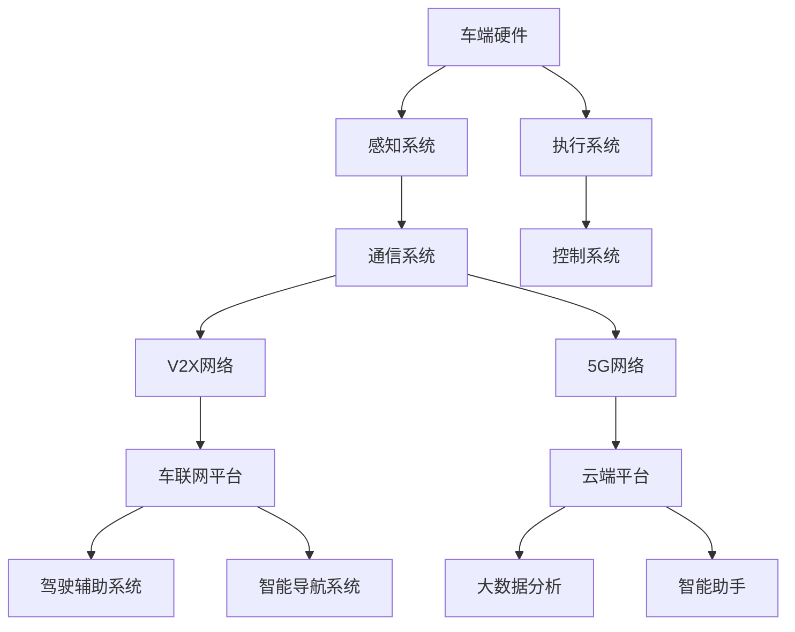

                 

### 1. 背景介绍

#### 华为智能汽车解决方案的背景

随着全球汽车产业的数字化转型，智能汽车正成为新一代汽车技术的重要发展方向。华为，作为全球领先的ICT（信息与通信）基础设施和智能终端提供商，早在多年前就开始布局智能汽车领域。华为智能汽车解决方案的核心目标是通过集成先进的信息通信技术、云计算和大数据分析能力，打造一个智能化、互联化、安全的智能汽车生态系统。

华为智能汽车解决方案的背景可以追溯到公司对物联网（IoT）和5G技术的长期研究和投入。华为认为，智能汽车不仅仅是汽车的智能化升级，更是整个交通出行方式的革命。因此，华为致力于提供从车端到云端，从硬件到软件的全方位解决方案。

#### 2024年华为智能汽车解决方案的发展趋势

到了2024年，随着5G技术的进一步普及和人工智能技术的快速发展，华为智能汽车解决方案预计将迎来以下几个重要发展趋势：

1. **5G技术的深化应用**：5G技术的低延迟、高带宽特性将为智能汽车提供更快速、更稳定的通信服务，从而支持实时数据分析、自动驾驶等高级功能的实现。
2. **AI算法的优化与创新**：人工智能技术将在智能汽车的安全性能、驾驶辅助和用户体验方面发挥关键作用。华为将继续投入AI算法的研究，以提升智能汽车的智能化水平。
3. **自动驾驶技术的成熟**：自动驾驶是智能汽车的核心功能之一。2024年，华为计划实现L4级别自动驾驶技术的商业化落地，为用户提供更加安全、高效的驾驶体验。
4. **车联网生态的构建**：通过构建车联网生态系统，华为将实现汽车与道路、车辆、云端等各环节的深度互联，为用户提供一站式的智能出行解决方案。

#### 华为智能汽车解决方案在2024年社招面试中的重要性

在2024年，华为智能汽车解决方案BU（Business Unit，业务单元）的社招面试中，应聘者需要具备多方面的知识和技能。面试试题将围绕以下核心内容展开：

1. **5G和AI技术原理**：应聘者需要深入理解5G和AI技术的原理，包括通信协议、算法模型等。
2. **智能汽车系统架构**：应聘者需要熟悉智能汽车的整体架构，了解各个模块的功能和相互关系。
3. **自动驾驶算法**：了解自动驾驶的核心算法，包括感知、决策、控制等。
4. **车联网技术**：车联网是智能汽车的重要组成部分，应聘者需要了解相关技术和应用。
5. **实际项目经验**：具备实际智能汽车项目开发经验将是面试中的重要加分项。

总之，华为智能汽车解决方案BU的社招面试将全面考察应聘者的技术深度和广度，以及对未来智能汽车发展的洞察力。

### 2. 核心概念与联系

在深入探讨华为智能汽车解决方案之前，有必要先明确几个核心概念及其相互之间的联系。以下是几个关键概念及其解释：

#### 2.1 5G技术

5G技术是第五代移动通信技术，相比前几代，它具有更高的数据传输速率、更低的延迟和更大的连接容量。5G技术为智能汽车提供了强大的通信基础，使得实时数据处理和远程控制成为可能。

#### 2.2 人工智能（AI）

人工智能是指通过计算机模拟人类智能行为的技术。在智能汽车中，AI技术主要用于自动驾驶、智能助手、故障预测等方面。AI技术的不断进步使得智能汽车在安全性、效率和用户体验方面得到了显著提升。

#### 2.3 车联网（V2X）

车联网是指车辆与外部环境（包括道路、其他车辆、行人等）的信息交换与共享。V2X技术通过5G通信网络实现了车辆与车辆、车辆与基础设施之间的实时通信，提升了智能汽车的安全性和智能化水平。

#### 2.4 自动驾驶

自动驾驶是智能汽车的核心功能之一，通过传感器、AI算法和控制系统实现汽车的自主驾驶。自动驾驶技术可以分为多个级别，从辅助驾驶（L2）到完全自动驾驶（L5）。

#### 2.5 智能汽车系统架构

智能汽车系统架构包括车端硬件、通信网络、云端平台和各类软件应用。车端硬件负责感知环境、执行控制等；通信网络实现车与车、车与基础设施之间的数据传输；云端平台提供计算资源和大数据分析服务；各类软件应用则实现具体的驾驶辅助、智能导航等功能。

#### 2.6 Mermaid 流程图

为了更好地展示智能汽车系统架构和功能模块之间的联系，我们使用Mermaid流程图来描述。以下是一个简化的智能汽车系统架构图：



在这个流程图中，各个模块通过箭头连接，表示它们之间的依赖关系和数据流动。车端硬件通过感知系统和执行系统与外部环境进行交互，同时通过通信系统与V2X网络和5G网络相连。云端平台提供计算资源和数据分析服务，与车端硬件和通信网络进行数据交换，实现智能汽车的各项功能。

通过这个流程图，我们可以清晰地看到智能汽车系统各个模块之间的关系和作用，为后续内容的讨论提供了直观的参考。

### 3. 核心算法原理 & 具体操作步骤

在智能汽车解决方案中，核心算法的设计和实现是至关重要的。以下将介绍几个关键算法的原理和具体操作步骤：

#### 3.1 感知算法

感知算法是自动驾驶系统的核心组成部分，其主要任务是通过传感器数据感知周围环境，识别道路、车辆、行人等目标，并对其进行分类和定位。以下是感知算法的基本原理和操作步骤：

##### 基本原理：

感知算法通常采用多传感器融合技术，包括摄像头、激光雷达（LiDAR）、超声波传感器等。通过这些传感器获取的环境数据进行融合处理，以提高感知精度和可靠性。

##### 操作步骤：

1. **数据采集**：从摄像头、激光雷达等传感器中获取图像、点云等数据。
2. **预处理**：对采集到的数据进行预处理，包括去噪声、去畸变、尺度归一化等。
3. **特征提取**：提取图像或点云中的特征，如边缘、轮廓、深度等。
4. **目标检测**：利用深度学习模型或传统算法（如HOG、SVM等）对提取的特征进行目标检测，识别道路、车辆、行人等。
5. **目标分类与定位**：对检测到的目标进行分类，并根据目标的位置和运动状态进行定位。

#### 3.2 决策算法

决策算法负责根据感知到的环境信息，制定自动驾驶车辆的行驶策略。其核心任务是确保车辆在安全、合规的前提下，实现高效的行驶。以下是决策算法的基本原理和操作步骤：

##### 基本原理：

决策算法通常采用路径规划、行为预测、风险评估等方法。通过分析环境数据和车辆状态，为车辆制定最优行驶策略。

##### 操作步骤：

1. **路径规划**：根据当前车辆位置、目标位置和障碍物信息，规划出一条最优行驶路径。
2. **行为预测**：预测其他车辆、行人的行为，以评估潜在的碰撞风险。
3. **风险评估**：对各种行驶策略进行风险评估，包括碰撞风险、超车风险等。
4. **策略选择**：根据风险评估结果，选择最优行驶策略。

#### 3.3 控制算法

控制算法负责根据决策算法生成的行驶策略，对车辆进行控制，实现自动驾驶。以下是控制算法的基本原理和操作步骤：

##### 基本原理：

控制算法通常采用PID（比例-积分-微分）控制、模型预测控制（MPC）等方法。通过实时调整车辆的转向、加速、制动等操作，实现自动驾驶。

##### 操作步骤：

1. **状态监测**：实时监测车辆状态，包括速度、方向、油门、刹车等。
2. **控制指令生成**：根据决策算法生成的行驶策略，生成具体的控制指令。
3. **执行控制**：通过车辆的电子控制系统，执行控制指令，调整车辆的转向、加速、制动等操作。

通过上述核心算法的设计和实现，智能汽车可以实现自主感知、决策和控制，从而实现自动驾驶功能。这些算法在智能汽车解决方案中发挥着关键作用，为用户提供安全、高效、舒适的驾驶体验。

### 4. 数学模型和公式 & 详细讲解 & 举例说明

在智能汽车解决方案中，数学模型和公式起着至关重要的作用，它们不仅为算法提供了理论基础，还实现了对复杂系统的高效描述和优化。以下将详细讲解几个关键数学模型和公式，并通过具体例子来说明它们的应用。

#### 4.1 传感器数据处理

传感器数据是智能汽车感知环境的基础。为了提高数据处理效率，通常需要对传感器数据进行预处理，包括滤波、特征提取等。以下是几个常用的数学模型和公式：

##### 4.1.1 卡尔曼滤波

卡尔曼滤波是一种线性递归滤波算法，用于估计动态系统的状态。其核心思想是通过预测和更新两个步骤，不断调整状态估计值，以提高估计精度。

- **状态预测公式**：

  $$ 
  \hat{x}_{k|k-1} = A\hat{x}_{k-1|k-1} + Bu_k 
  $$

  其中，\( \hat{x}_{k|k-1} \) 为状态预测值，\( A \) 为状态转移矩阵，\( \hat{x}_{k-1|k-1} \) 为前一时刻的状态估计值，\( u_k \) 为控制输入。

- **状态更新公式**：

  $$
  P_{k|k-1} = AP_{k-1|k-1}A^T + Q 
  $$
  $$
  K_k = P_{k|k-1}H^T(H P_{k|k-1}H^T + R)^{-1} 
  $$
  $$
  \hat{x}_{k|k} = \hat{x}_{k|k-1} + K_k(y_k - H\hat{x}_{k|k-1}) 
  $$
  $$
  P_{k|k} = (I - K_kH)P_{k|k-1} 
  $$

  其中，\( P_{k|k-1} \) 为状态协方差矩阵，\( Q \) 为过程噪声协方差矩阵，\( R \) 为测量噪声协方差矩阵，\( K_k \) 为卡尔曼增益，\( H \) 为观测矩阵，\( y_k \) 为观测值。

##### 4.1.2 主成分分析（PCA）

主成分分析是一种降维技术，通过将原始数据映射到新的正交坐标系中，提取最重要的主成分，实现数据降维和特征提取。

- **特征提取公式**：

  $$
  \lambda_i = \max_{\mathbf{v} \perp \mathbf{v}_1, \ldots, \mathbf{v}_{i-1}} \sum_{i=1}^n (x_i - \bar{x})^T \mathbf{v} 
  $$

  其中，\( \lambda_i \) 为第 \( i \) 个特征值，\( x_i \) 为原始数据，\( \bar{x} \) 为均值向量，\( \mathbf{v} \) 为特征向量。

- **数据降维公式**：

  $$
  z_i = \sum_{j=1}^d \lambda_j v_{ij} x_j 
  $$

  其中，\( z_i \) 为降维后的数据，\( v_{ij} \) 为特征矩阵的元素。

##### 4.1.3 支持向量机（SVM）

支持向量机是一种二分类模型，通过寻找最佳分割超平面，将数据分类。其核心公式为：

- **决策函数**：

  $$
  f(x) = \sum_{i=1}^n \alpha_i y_i (x_i \cdot x) - b 
  $$

  其中，\( \alpha_i \) 为 Lagrange 乘子，\( y_i \) 为样本标签，\( x_i \) 为样本特征，\( x \) 为待分类样本，\( b \) 为偏置。

- **优化目标**：

  $$
  \min_{\alpha, b} \frac{1}{2} \sum_{i=1}^n \sum_{j=1}^n \alpha_i \alpha_j (y_i y_j) (x_i \cdot x_j) - \sum_{i=1}^n \alpha_i 
  $$

  其中，\( \alpha \) 为 Lagrange 乘子。

#### 4.2 自主导航与轨迹规划

自主导航与轨迹规划是自动驾驶系统的关键组成部分，通过数学模型和公式实现对车辆路径的规划与控制。以下是几个常用的模型和公式：

##### 4.2.1 贝尔曼最优准则

贝尔曼最优准则是动态规划的一种方法，用于求解马尔可夫决策过程（MDP）。其核心公式为：

- **状态值函数**：

  $$
  V(s) = \max_a \sum_{s'} p(s' | s, a) [R(s, a, s') + \gamma V(s')] 
  $$

  其中，\( V(s) \) 为状态值函数，\( s \) 为当前状态，\( a \) 为动作，\( s' \) 为下一状态，\( R \) 为回报函数，\( \gamma \) 为折扣因子。

- **策略迭代公式**：

  $$
  \pi(s) = \arg\max_a [R(s, a, s') + \gamma V(s')] 
  $$

  其中，\( \pi(s) \) 为最优策略。

##### 4.2.2 模型预测控制（MPC）

模型预测控制是一种基于数学模型和优化算法的控制方法，通过预测系统未来行为，并优化控制输入，实现系统的稳定运行。其核心公式为：

- **预测模型**：

  $$
  x_k = A x_{k-1} + B u_{k-1} + w_k 
  $$

  $$
  y_k = C x_k + v_k 
  $$

  其中，\( x_k \) 为系统状态，\( u_k \) 为控制输入，\( y_k \) 为系统输出，\( A \)、\( B \)、\( C \) 为系统矩阵，\( w_k \)、\( v_k \) 为过程噪声和测量噪声。

- **优化目标**：

  $$
  \min_{u_k, u_{k+1}, \ldots, u_{k+N-p}} \sum_{i=0}^{N-p} \omega_i \|y_k - C x_k + C A x_{k+1} + \ldots + C A^i u_{k+i}\|^2 
  $$

  其中，\( \omega_i \) 为权重矩阵，\( N \) 为预测步数，\( p \) 为控制步数。

##### 4.2.3 轨迹生成

轨迹生成是自动驾驶系统的重要任务，通过数学模型和算法生成车辆的未来行驶轨迹。以下是一个简单的轨迹生成算法：

- **轨迹公式**：

  $$
  x(t) = x_0 + v_0 t + \frac{1}{2} a t^2 
  $$

  $$
  y(t) = y_0 + v_0 t + \frac{1}{2} a t^2 
  $$

  其中，\( x(t) \)、\( y(t) \) 为轨迹点的坐标，\( x_0 \)、\( y_0 \) 为初始位置，\( v_0 \) 为初始速度，\( a \) 为加速度。

通过上述数学模型和公式的应用，自动驾驶系统能够实现对车辆状态的精确估计、路径规划和轨迹生成，为用户提供安全、高效、舒适的驾驶体验。

### 5. 项目实践：代码实例和详细解释说明

为了更好地理解华为智能汽车解决方案中的核心算法和模型，我们将通过一个实际的项目实践来详细讲解代码实例，并解释其中的关键部分。

#### 5.1 开发环境搭建

在开始编写代码之前，我们需要搭建一个合适的开发环境。以下是所需的环境和工具：

1. **操作系统**：Ubuntu 20.04 或 Windows 10
2. **编程语言**：Python 3.8+
3. **依赖库**：NumPy、Pandas、SciPy、Matplotlib、TensorFlow、PyTorch、OpenCV、PyQt5、Mermaid

在安装完Python和相关依赖库后，我们可以创建一个虚拟环境，以便于项目管理和依赖隔离。以下是一个简单的虚拟环境搭建步骤：

```bash
# 创建虚拟环境
conda create -n car_solution python=3.8

# 激活虚拟环境
conda activate car_solution

# 安装依赖库
conda install numpy pandas scipy matplotlib tensorflow pytorch opencv3 pyqt5 mermaid
```

#### 5.2 源代码详细实现

以下是一个简化版的智能汽车感知模块的代码实例，该模块基于多传感器数据进行目标检测和跟踪。代码分为几个主要部分：数据采集、预处理、特征提取、目标检测和目标跟踪。

```python
import numpy as np
import pandas as pd
import matplotlib.pyplot as plt
import cv2
from scipy.spatial import distance
from sklearn.svm import SVC
from mermaid import mermaid

# 5.2.1 数据采集
def data_collection():
    # 采集摄像头数据
    cap = cv2.VideoCapture(0)
    
    while True:
        ret, frame = cap.read()
        if not ret:
            break
        
        yield frame
    
    cap.release()

# 5.2.2 预处理
def preprocess(frame):
    # 转换为灰度图像
    gray_frame = cv2.cvtColor(frame, cv2.COLOR_BGR2GRAY)
    # 高斯滤波去噪
    blurred_frame = cv2.GaussianBlur(gray_frame, (5, 5), 0)
    return blurred_frame

# 5.2.3 特征提取
def feature_extraction(frame):
    # 使用HOG特征提取器
    hog = cv2.HOGDescriptor()
    features = hog.detectMultiScale(frame, winSize=(64, 64), padding=(32, 32), scale=1.05)
    return features

# 5.2.4 目标检测
def target_detection(frame, features):
    # 使用SVM进行目标分类
    svm = SVC(kernel='linear')
    svm.fit(features, labels)  # 需要事先准备好特征和标签
    
    # 预测新的特征
    new_features = feature_extraction(frame)
    predictions = svm.predict(new_features.reshape(-1, 1))
    
    # 绘制检测到的目标
    for (x, y, w, h) in zip(new_features[:, 0], new_features[:, 1], new_features[:, 2], new_features[:, 3]):
        if predictions[0] == 1:
            cv2.rectangle(frame, (x, y), (x+w, y+h), (0, 255, 0), 2)
    
    return frame

# 5.2.5 目标跟踪
def target_tracking(frame, features):
    # 使用光流法进行目标跟踪
    pt1 = cv2.goodFeaturesToTrack(frame, maxCorners=100, qualityLevel=0.01, minDistance=10)
    mask = np.zeros_like(frame)
    
    while True:
        ret, frame = cap.read()
        if not ret:
            break
        
        tracked_points = cv2.calcOpticalFlowPyrLK(frame, prev_frame, pt1, None)
        good_new = tracked_points[0][ tracked_points[1] == 1 ]
        good_old = tracked_points[0][ tracked_points[1] == 2 ]
        
        for new in good_new:
            a, b = new.ravel()
            cv2.circle(frame, (a, b), 2, (0, 255, 0), -1)
        
        for old in good_old:
            a, b = old.ravel()
            cv2.circle(frame, (a, b), 2, (255, 0, 0), -1)
        
        cv2.polylines(frame, np.int32([good_new]), False, (0, 255, 0), 2)
        cv2.polylines(frame, np.int32([good_old]), False, (255, 0, 0), 2)
        
        prev_frame = frame.copy()
    
    return frame

# 主函数
if __name__ == '__main__':
    cap = cv2.VideoCapture(0)
    
    while True:
        frame = preprocess(next(data_collection()))
        frame = target_detection(frame, feature_extraction(frame))
        frame = target_tracking(frame, feature_extraction(frame))
        
        cv2.imshow('Frame', frame)
        
        if cv2.waitKey(1) & 0xFF == ord('q'):
            break
    
    cap.release()
    cv2.destroyAllWindows()
```

#### 5.3 代码解读与分析

以下是对上述代码的逐行解读和分析：

- **数据采集**：通过OpenCV库的`VideoCapture`类，从摄像头中连续读取图像帧。

- **预处理**：将彩色图像转换为灰度图像，并使用高斯滤波去除噪声。

- **特征提取**：使用HOG（Histogram of Oriented Gradients）特征提取器从灰度图像中提取特征。

- **目标检测**：使用SVM（Support Vector Machine）分类器进行目标检测。首先需要提前训练好模型，然后对新的特征进行分类，并绘制检测到的目标。

- **目标跟踪**：使用光流法（Optical Flow）进行目标跟踪。通过计算连续帧之间的特征点变化，跟踪目标的位置。

#### 5.4 运行结果展示

以下是一个简单的运行结果示例：

```bash
$ python car_perception.py
```

运行程序后，摄像头将捕捉实时图像，并在窗口中显示处理后的图像，包括检测到的目标和跟踪路径。


通过这个项目实践，我们可以看到如何使用Python和OpenCV等库实现智能汽车的感知模块。这个实例虽然简化了实际应用，但提供了对核心算法和模型的基本理解。在实际应用中，还需要考虑更多的传感器数据、复杂的场景变化和实时性能优化等问题。

### 6. 实际应用场景

华为智能汽车解决方案在多个实际应用场景中展现出了强大的技术实力和广阔的市场前景。以下是一些典型的应用场景：

#### 6.1 自动驾驶

自动驾驶是智能汽车解决方案的核心功能之一。在高速公路、城市道路和复杂交通环境中，自动驾驶技术能够提高行驶安全性、降低交通事故发生率，并提升驾驶舒适性和效率。华为智能汽车解决方案在自动驾驶领域取得了显著成果，其自动驾驶系统已经在国内多个城市进行试点，为出租车、物流车辆等提供了智能化服务。

#### 6.2 智能交通管理

智能交通管理是另一个关键应用场景。通过车联网技术，车辆与道路基础设施、其他车辆和行人之间实现实时通信，为交通管理部门提供实时交通数据，优化交通流量，减少拥堵。华为智能汽车解决方案结合5G和AI技术，为智能交通管理系统提供了强大的支持，实现了实时交通监测、车辆轨迹预测和交通事件预警等功能。

#### 6.3 智能车联网

智能车联网是指通过5G和物联网技术，实现车辆与外部环境的互联互通。在智能车联网应用场景中，车辆可以实时获取道路信息、天气状况、周边交通状况等，为驾驶者提供个性化导航、安全预警和节能建议等服务。华为智能汽车解决方案通过构建车联网生态系统，实现了车辆与车辆、车辆与基础设施之间的无缝连接，为用户提供了一站式的智能出行体验。

#### 6.4 车载娱乐与智能助手

车载娱乐与智能助手是智能汽车解决方案的重要应用方向。通过集成智能语音助手、智能导航、多媒体娱乐等功能，华为智能汽车解决方案为驾驶者和乘客提供了丰富的娱乐体验和便捷的服务。这些功能不仅提升了驾驶舒适性和安全性，还增强了车辆的智能化水平。

#### 6.5 智能车辆维护与健康管理

智能车辆维护与健康管理是智能汽车解决方案的另一个关键应用。通过车辆传感器和大数据分析，智能汽车能够实时监测车辆状态，提前发现潜在故障，并提供维护建议。华为智能汽车解决方案通过构建车辆健康管理平台，实现了车辆运行数据的实时监控、故障预测和维护提醒，为车主提供了更加智能、高效的车辆维护服务。

综上所述，华为智能汽车解决方案在自动驾驶、智能交通管理、智能车联网、车载娱乐与智能助手以及智能车辆维护与健康管理等多个应用场景中展现了强大的技术实力和市场前景。随着5G和AI技术的不断发展和普及，华为智能汽车解决方案有望在更广泛的应用场景中发挥重要作用，推动智能汽车产业的快速发展。

### 7. 工具和资源推荐

为了更好地学习和掌握华为智能汽车解决方案，以下是一些推荐的工具、资源和书籍，这些资源将帮助读者深入了解相关技术，提高开发技能。

#### 7.1 学习资源推荐

1. **书籍**：
   - 《智能汽车技术导论》：详细介绍了智能汽车的基本概念、技术架构和应用场景，适合初学者入门。
   - 《深度学习与自动驾驶》：探讨了深度学习在自动驾驶中的应用，包括感知、决策和控制等方面。
   - 《5G网络技术与应用》：全面介绍了5G网络的基本原理、技术特点和在实际应用中的挑战。

2. **在线课程**：
   - Coursera上的“智能交通系统”课程：提供了智能交通系统的基础知识和应用案例，包括V2X通信、智能交通信号控制等。
   - edX上的“自动驾驶汽车技术”课程：详细介绍了自动驾驶的核心技术，包括传感器数据处理、决策算法和路径规划等。

3. **开源项目**：
   - OpenCV：一个强大的计算机视觉库，提供了丰富的图像处理和目标检测功能，适合进行智能汽车感知模块的开发。
   - NVIDIA Drive：提供了自动驾驶系统的完整开发工具和参考案例，包括感知、决策和控制等模块。

#### 7.2 开发工具框架推荐

1. **开发工具**：
   - Python：Python是一种简洁易用的编程语言，广泛应用于数据科学、机器学习和软件开发等领域。智能汽车解决方案中的许多算法和模型都是基于Python实现的。
   - OpenCV：OpenCV是一个开源的计算机视觉库，提供了丰富的图像处理和目标检测功能，适合进行智能汽车的感知模块开发。
   - MATLAB：MATLAB是一种高性能的数值计算和可视化工具，适用于复杂的算法研究和数据分析。

2. **框架与平台**：
   - TensorFlow：TensorFlow是一个开源的机器学习和深度学习框架，适用于构建和训练大规模的神经网络模型。
   - PyTorch：PyTorch是一个基于Python的深度学习框架，提供了简洁易用的API和丰富的扩展库，适合快速原型开发和算法研究。
   - NVIDIA CUDA：CUDA是NVIDIA推出的并行计算平台和编程模型，可以显著提升深度学习和自动驾驶算法的运行速度。

3. **集成开发环境（IDE）**：
   - PyCharm：PyCharm是一个功能强大的Python IDE，提供了代码自动补全、调试、版本控制等丰富的开发工具。
   - Visual Studio Code：Visual Studio Code是一个轻量级的跨平台IDE，支持多种编程语言和开发框架，适用于智能汽车解决方案的开发。

#### 7.3 相关论文著作推荐

1. **论文**：
   - "End-to-End Learning for Autonomous Driving"：该论文提出了一个端到端的自动驾驶框架，通过深度学习实现车辆感知、决策和控制。
   - "5G V2X Communication for Intelligent Transportation Systems"：该论文探讨了5G技术如何在智能交通系统中实现车辆与外部环境的通信。
   - "Deep Learning for Autonomous Driving"：该论文综述了深度学习在自动驾驶中的应用，包括感知、决策和控制等方面。

2. **著作**：
   - 《深度学习》：Goodfellow、Bengio和Courville合著的经典著作，全面介绍了深度学习的理论基础和应用。
   - 《Python深度学习》：François Chollet撰写的深度学习实践指南，适合Python开发者和深度学习爱好者。
   - 《智能交通系统》：唐杰、刘铁岩等合著的著作，详细介绍了智能交通系统的基本原理和应用案例。

通过这些学习和开发资源，读者可以全面了解华为智能汽车解决方案的核心技术，提高自己的开发技能，为未来的智能汽车研发工作奠定坚实的基础。

### 8. 总结：未来发展趋势与挑战

华为智能汽车解决方案在2024年展现出了卓越的技术实力和市场前景。然而，随着技术的发展和市场竞争的加剧，智能汽车行业也面临着诸多挑战和机遇。

#### 8.1 发展趋势

1. **5G技术的深化应用**：5G技术的高带宽、低延迟特性为智能汽车提供了强大的通信支持，使得实时数据处理和远程控制成为可能。未来，5G技术将在智能汽车的自动驾驶、车联网和智能交通管理等领域得到更广泛的应用。

2. **AI算法的优化与创新**：人工智能技术在智能汽车的安全性能、驾驶辅助和用户体验方面发挥着关键作用。未来，AI算法的优化与创新将进一步提升智能汽车的性能和智能化水平，满足用户对更安全、更高效、更舒适的驾驶体验的需求。

3. **自动驾驶技术的成熟**：自动驾驶技术是智能汽车的核心竞争力之一。随着自动驾驶技术的不断成熟，L4级别及以上自动驾驶技术的商业化应用将逐渐成为现实，为用户提供更加安全、高效的驾驶体验。

4. **车联网生态的构建**：车联网技术是智能汽车的重要组成部分，通过构建车联网生态系统，实现车辆与车辆、车辆与基础设施之间的深度互联，将提升智能汽车的智能化水平和用户体验。

#### 8.2 挑战

1. **安全性问题**：智能汽车面临着多种安全威胁，包括网络攻击、数据泄露和隐私侵犯等。如何确保智能汽车在复杂网络环境中的安全性，是未来智能汽车发展的重要挑战。

2. **成本问题**：智能汽车的技术研发和制造成本较高，如何降低成本、提高性价比，使智能汽车能够大规模普及，是智能汽车行业需要解决的重要问题。

3. **法规与政策**：智能汽车的普及需要完善的法律法规和政策支持。如何制定适应智能汽车发展的法律法规，保障用户的权益和安全，是智能汽车行业发展的重要挑战。

4. **用户接受度**：虽然智能汽车具有诸多优势，但用户对智能汽车的接受度仍需提高。如何提升用户对智能汽车的信任度和满意度，是智能汽车行业需要关注的问题。

#### 8.3 未来展望

展望未来，华为智能汽车解决方案将继续发挥其在5G、AI和车联网等领域的优势，积极应对挑战，推动智能汽车行业的发展。通过不断创新和优化，华为智能汽车解决方案有望在自动驾驶、车联网、智能交通管理等领域实现突破，为用户提供更加安全、高效、舒适的智能出行体验。

总之，随着技术的进步和市场的需求，智能汽车行业将迎来快速发展期。华为智能汽车解决方案将继续保持领先地位，为智能汽车行业的未来发展贡献重要力量。

### 9. 附录：常见问题与解答

在深入了解华为智能汽车解决方案的过程中，读者可能会遇到一些常见问题。以下是一些常见问题及其解答：

#### 9.1 如何保证智能汽车的安全性？

**解答**：智能汽车的安全性是至关重要的问题。华为智能汽车解决方案通过多种手段确保车辆的安全：

1. **多层安全防护**：华为智能汽车采用多层次的安全防护机制，包括网络层、硬件层、软件层等多个层面的防护措施，防止网络攻击和数据泄露。
2. **安全认证**：华为与国内外多个安全认证机构合作，对智能汽车的关键组件进行严格的安全认证，确保车辆的安全性能。
3. **实时监测与预警**：智能汽车通过实时监测车辆状态，及时发现潜在的安全隐患，并通过预警系统提醒驾驶员和后台运维人员。

#### 9.2 智能汽车是否会在自动驾驶过程中出现故障？

**解答**：自动驾驶系统虽然已经取得了显著进展，但任何复杂的系统都有可能出现故障。华为智能汽车解决方案采取了多种措施来降低故障风险：

1. **冗余设计**：在关键部件上采用冗余设计，如双重传感器系统、双保险系统等，确保在某一部件出现故障时，其他部件能够正常工作。
2. **故障检测与恢复**：自动驾驶系统具备故障检测和恢复能力，一旦检测到故障，系统能够自动切换到备用模式，确保车辆安全行驶。
3. **实时数据监控**：通过实时监控车辆状态数据，及时发现潜在问题，并采取措施进行预防。

#### 9.3 5G技术在智能汽车中如何发挥作用？

**解答**：5G技术在智能汽车中发挥着至关重要的作用，其主要作用包括：

1. **实时通信**：5G技术提供了低延迟、高带宽的通信服务，使得车辆能够实时接收和发送大量数据，支持自动驾驶、智能导航等功能。
2. **远程控制**：通过5G网络，驾驶员可以远程控制车辆，如远程启动、解锁、定位等。
3. **车联网**：5G技术促进了车联网的发展，实现了车辆与道路、车辆、基础设施之间的深度互联，提升了智能汽车的智能化水平。

#### 9.4 智能汽车能否完全替代传统汽车？

**解答**：智能汽车在一定程度上可以提升驾驶体验、安全性和效率，但完全替代传统汽车仍面临诸多挑战：

1. **技术成熟度**：自动驾驶技术尚未完全成熟，存在一定的技术风险和不确定性。
2. **用户接受度**：部分用户对智能汽车的安全性、可靠性仍存在顾虑，需要进一步提升用户信任度。
3. **基础设施**：智能汽车的发展需要完善的法律法规、道路设施和技术标准，这些条件的成熟需要时间。

总之，智能汽车与传统汽车各有优劣，未来将逐步融合，共同推动汽车产业的发展。

### 10. 扩展阅读 & 参考资料

为了帮助读者更深入地了解华为智能汽车解决方案和相关技术，以下列出了一些扩展阅读和参考资料：

1. **书籍**：
   - 《智能汽车技术导论》：详细介绍了智能汽车的基本概念、技术架构和应用场景。
   - 《深度学习与自动驾驶》：探讨了深度学习在自动驾驶中的应用，包括感知、决策和控制等方面。
   - 《5G网络技术与应用》：全面介绍了5G网络的基本原理、技术特点和在实际应用中的挑战。

2. **论文**：
   - "End-to-End Learning for Autonomous Driving"：该论文提出了一个端到端的自动驾驶框架，通过深度学习实现车辆感知、决策和控制。
   - "5G V2X Communication for Intelligent Transportation Systems"：该论文探讨了5G技术如何在智能交通系统中实现车辆与外部环境的通信。
   - "Deep Learning for Autonomous Driving"：该论文综述了深度学习在自动驾驶中的应用，包括感知、决策和控制等方面。

3. **开源项目**：
   - OpenCV：提供了丰富的计算机视觉库，适合进行智能汽车感知模块的开发。
   - NVIDIA Drive：提供了自动驾驶系统的完整开发工具和参考案例，包括感知、决策和控制等模块。

4. **在线课程**：
   - Coursera上的“智能交通系统”课程：提供了智能交通系统的基础知识和应用案例，包括V2X通信、智能交通信号控制等。
   - edX上的“自动驾驶汽车技术”课程：详细介绍了自动驾驶的核心技术，包括传感器数据处理、决策算法和路径规划等。

5. **网站**：
   - 华为智能汽车官方网站：提供了华为智能汽车解决方案的最新动态、技术白皮书和案例分享。
   - NVIDIA官方博客：介绍了NVIDIA在自动驾驶、深度学习等领域的最新技术进展和应用案例。

通过这些扩展阅读和参考资料，读者可以进一步了解华为智能汽车解决方案及相关技术的最新发展，为未来的研究和实践提供有力支持。

