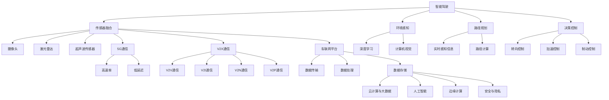

                 

### 背景介绍 Background Introduction

华为，作为中国领先的信息与通信技术（ICT）解决方案提供商，正迅速在智能汽车领域崭露头角。华为的智能汽车解决方案涵盖了从通信、连接、计算到感知、决策、控制的全栈技术，旨在为汽车行业带来全新的变革。

#### 华为智能汽车解决方案的发展历程

华为的智能汽车解决方案经历了几个关键阶段的发展。早在2013年，华为就发布了其车载网络通信技术，标志着华为在智能汽车领域的初步探索。随后，华为在2017年发布了车联网解决方案，进一步拓展了其技术边界。

到了2019年，华为正式发布了基于5G技术的智能汽车解决方案，通过高速率、低延迟的通信网络，实现了车与车、车与基础设施之间的无缝连接。这一阶段的发展，让华为在智能汽车领域具备了更为强大的竞争力。

2021年，华为正式推出了“智能汽车解决方案2.0”，进一步强化了其智能驾驶、智能网联和智能座舱的技术优势。这一版本的解决方案，不仅支持L2+级自动驾驶，还引入了AI技术，使得车辆能够实现更加智能化的驾驶体验。

#### 华为智能汽车解决方案的核心

华为智能汽车解决方案的核心包括以下几个方面：

1. **智能驾驶**：华为的智能驾驶解决方案通过高级辅助驾驶系统（ADAS）和自动驾驶系统，实现了从L2+到L4级的自动驾驶能力。华为的自动驾驶系统采用了传感器融合、路径规划和决策控制等技术，使得车辆能够在复杂的交通环境中自主行驶。

2. **智能网联**：华为的智能网联解决方案通过5G、V2X（车对外部信息的交换）等通信技术，实现了车与车、车与基础设施之间的实时数据交换，提升了交通效率和安全性。

3. **智能座舱**：华为的智能座舱解决方案通过智能语音交互、多模交互等技术，提供了定制化的车内体验。用户可以通过语音、手势等多种方式进行交互，实现便捷的驾驶体验。

#### 华为智能汽车解决方案的应用场景

华为的智能汽车解决方案广泛应用于多个场景：

1. **高速公路自动驾驶**：在高速公路上，华为的自动驾驶系统能够实现自动换道、超车等操作，提高了驾驶安全性和舒适性。

2. **城市自动驾驶**：在城市交通中，华为的智能驾驶解决方案能够处理复杂的交通状况，如行人、非机动车等，提升了自动驾驶的安全性和可靠性。

3. **车联网应用**：通过华为的智能网联技术，车辆可以实现与交通信号、停车场等基础设施的无缝连接，提高了交通效率和用户体验。

4. **智能座舱体验**：华为的智能座舱技术为用户提供了个性化、智能化的车内体验，使得驾驶过程更加愉悦。

总之，华为的智能汽车解决方案不仅涵盖了智能驾驶、智能网联和智能座舱，还通过技术创新实现了多种应用场景，为汽车行业带来了全新的变革。接下来，我们将进一步探讨华为智能汽车解决方案中的核心概念、算法原理以及具体实现细节。

## 2. 核心概念与联系 Core Concepts and Connections

在深入了解华为智能汽车解决方案之前，我们需要明确一些核心概念，并理解它们之间的联系。这些核心概念包括智能驾驶、智能网联、智能座舱，以及支撑这些技术实现的底层架构和关键技术。

### 2.1 智能驾驶（Autonomous Driving）

智能驾驶是华为智能汽车解决方案中的核心组成部分，旨在通过高级辅助驾驶系统（ADAS）和自动驾驶系统，实现车辆的自动化操作。智能驾驶的核心概念包括：

1. **传感器融合**：通过安装在不同位置的摄像头、激光雷达、超声波传感器等，收集车辆周围环境的信息。
2. **环境感知**：利用深度学习、计算机视觉等技术，对传感器数据进行处理，识别道路、车辆、行人、交通标志等。
3. **路径规划**：根据实时感知信息，计算车辆行驶的路径，包括换道、超车、停车等操作。
4. **决策控制**：基于路径规划结果，控制车辆的转向、加速、制动等动作，实现自动驾驶。

### 2.2 智能网联（Connected Vehicle）

智能网联是华为智能汽车解决方案中的另一个重要组成部分，旨在通过车联网技术，实现车辆与外部世界的实时连接和数据交换。智能网联的核心概念包括：

1. **5G通信**：利用5G网络的高速率、低延迟特性，实现车与车、车与基础设施之间的实时通信。
2. **V2X通信**：车对外部信息的交换（Vehicle to Everything, V2X），包括车与车（V2V）、车与基础设施（V2I）、车与网络（V2N）、车与行人（V2P）等。
3. **车联网平台**：提供数据传输、处理、存储和管理等功能，支持多种应用场景，如智能导航、车况监控、远程诊断等。

### 2.3 智能座舱（Intelligent Cockpit）

智能座舱是车内用户体验的重要组成部分，通过智能语音交互、多模交互等技术，为用户带来个性化、智能化的车内体验。智能座舱的核心概念包括：

1. **语音交互**：通过自然语言处理（NLP）技术，实现用户与车辆的语音交互，如导航、音乐播放、信息查询等。
2. **多模交互**：结合语音、手势、触屏等多种交互方式，提供更加灵活、便捷的交互体验。
3. **个性化体验**：根据用户喜好和习惯，提供定制化的车内配置和功能。

### 2.4 支撑架构和关键技术

华为智能汽车解决方案的实现依赖于一系列底层架构和关键技术的支持，包括：

1. **云计算与大数据**：提供强大的计算能力和数据存储，支持海量数据的处理和分析。
2. **人工智能**：通过深度学习、计算机视觉、自然语言处理等技术，提升智能驾驶、智能网联和智能座舱的能力。
3. **边缘计算**：在车辆附近进行数据处理，减少数据传输延迟，提高实时性。
4. **安全与隐私**：通过加密、身份验证等技术，保障数据传输和存储的安全，保护用户隐私。

### 2.5 Mermaid 流程图

为了更直观地展示这些核心概念之间的联系，我们可以使用Mermaid流程图来描述。以下是一个简化的Mermaid流程图示例：



通过这个Mermaid流程图，我们可以清晰地看到智能驾驶、智能网联、智能座舱与支撑架构和关键技术的紧密联系，以及它们在实现华为智能汽车解决方案中的重要作用。

### 3. 核心算法原理 & 具体操作步骤 Core Algorithm Principles and Operation Steps

在了解了华为智能汽车解决方案的核心概念和支撑技术之后，接下来我们将深入探讨其中的核心算法原理，并详细说明这些算法的具体操作步骤。

#### 3.1 传感器融合（Sensor Fusion）

传感器融合是智能驾驶系统的关键环节，通过整合多种传感器的数据，提供更准确、更全面的环境感知。以下是一个简化的传感器融合算法原理：

1. **数据采集**：从摄像头、激光雷达、超声波传感器等获取车辆周围环境的数据。
2. **数据预处理**：对采集到的数据进行滤波、去噪等预处理，提高数据的可靠性。
3. **特征提取**：提取关键特征，如道路线、车辆轮廓、行人等。
4. **数据融合**：利用多传感器数据，通过算法进行融合，得到更准确的环境感知结果。

具体操作步骤如下：

1. **初始化传感器数据**：启动传感器，开始数据采集。
2. **预处理数据**：对每个传感器的数据进行预处理，如滤波、去噪。
3. **特征提取**：分别提取每个传感器的关键特征。
4. **数据融合**：使用加权平均、卡尔曼滤波等方法，融合不同传感器的数据，得到最终的环境感知结果。

#### 3.2 环境感知（Environment Perception）

环境感知是智能驾驶系统的核心，通过分析传感器数据，识别和理解车辆周围的环境。以下是一个简化的环境感知算法原理：

1. **图像处理**：对摄像头采集的图像进行预处理，如灰度化、二值化等。
2. **目标检测**：利用深度学习模型，识别图像中的车辆、行人、交通标志等。
3. **目标跟踪**：跟踪已检测到的目标，判断其运动状态和位置。
4. **场景理解**：基于目标检测和跟踪结果，理解当前交通场景，如前方有车辆、行人横穿等。

具体操作步骤如下：

1. **预处理图像**：对摄像头采集的图像进行灰度化、二值化等预处理。
2. **目标检测**：利用深度学习模型，对预处理后的图像进行目标检测。
3. **目标跟踪**：对检测到的目标进行跟踪，判断其运动状态和位置。
4. **场景理解**：基于目标检测和跟踪结果，构建当前交通场景的感知模型。

#### 3.3 路径规划（Path Planning）

路径规划是智能驾驶系统的关键步骤，通过分析环境感知结果，为车辆规划最佳行驶路径。以下是一个简化的路径规划算法原理：

1. **构建环境模型**：根据环境感知结果，构建车辆周围的环境模型，如道路、障碍物等。
2. **路径搜索**：使用搜索算法（如A*算法、Dijkstra算法等），在环境模型中寻找最佳路径。
3. **路径优化**：对搜索到的路径进行优化，考虑车辆的行驶速度、加速度等。
4. **路径输出**：将优化的路径输出给车辆控制系统，指导车辆行驶。

具体操作步骤如下：

1. **构建环境模型**：根据环境感知结果，构建车辆周围的环境模型。
2. **路径搜索**：使用A*算法、Dijkstra算法等，在环境模型中搜索最佳路径。
3. **路径优化**：考虑车辆的行驶速度、加速度等，对搜索到的路径进行优化。
4. **路径输出**：将优化的路径输出给车辆控制系统。

#### 3.4 决策控制（Decision Control）

决策控制是智能驾驶系统的最终环节，根据路径规划结果，控制车辆的转向、加速、制动等动作。以下是一个简化的决策控制算法原理：

1. **决策生成**：根据路径规划结果，生成车辆的转向、加速、制动等决策。
2. **控制执行**：将决策转换为具体的控制信号，执行车辆的转向、加速、制动等动作。
3. **状态反馈**：根据车辆的实际状态，反馈决策效果，进行闭环控制。

具体操作步骤如下：

1. **决策生成**：根据路径规划结果，生成车辆的转向、加速、制动等决策。
2. **控制执行**：将决策转换为控制信号，执行车辆的转向、加速、制动等动作。
3. **状态反馈**：根据车辆的实际状态，反馈决策效果，调整后续的决策。

通过上述核心算法原理和具体操作步骤，我们可以看到华为智能汽车解决方案在智能驾驶方面的强大技术实力。接下来，我们将进一步探讨智能汽车解决方案中的数学模型和公式，以及它们在实际应用中的详细讲解和举例说明。

### 4. 数学模型和公式 Mathematical Models and Formulas

在智能汽车解决方案中，数学模型和公式起到了至关重要的作用，它们不仅支持算法的设计与优化，还为实际应用中的决策控制提供了理论基础。以下我们将详细介绍一些核心的数学模型和公式，并加以详细讲解。

#### 4.1 传感器数据融合模型

传感器数据融合是智能驾驶系统的核心步骤之一。常用的数据融合方法包括加权平均法、卡尔曼滤波等。

1. **加权平均法**：
   
   加权平均法是一种简单有效的数据融合方法，它通过赋予不同传感器不同的权重，对多个传感器的数据进行融合。公式如下：

   $$ z_{\text{融合}} = \sum_{i=1}^{n} w_i \cdot z_i $$

   其中，$z_i$ 表示第 $i$ 个传感器的数据，$w_i$ 表示第 $i$ 个传感器的权重，$n$ 表示传感器的数量。权重可以根据传感器的精度和可靠性进行分配。

2. **卡尔曼滤波**：

   卡尔曼滤波是一种更为复杂的线性滤波方法，它不仅能够对传感器数据进行融合，还能对系统的状态进行估计。公式如下：

   $$ \hat{x}_{k|k} = \hat{x}_{k-1|k-1} + K_k (z_k - \hat{z}_{k|k-1}) $$

   $$ \hat{P}_{k|k} = (I - K_k H_k) \hat{P}_{k-1|k-1} $$

   其中，$\hat{x}_{k|k}$ 表示在第 $k$ 时刻对系统状态的估计值，$\hat{P}_{k|k}$ 表示在第 $k$ 时刻的状态估计误差协方差矩阵，$K_k$ 表示卡尔曼增益，$H_k$ 表示观测矩阵，$z_k$ 表示在第 $k$ 时刻的观测值，$\hat{z}_{k|k-1}$ 表示在第 $k$ 时刻基于前一时刻状态的预测值。

#### 4.2 路径规划中的A*算法

A*算法是一种经典的路径规划算法，适用于在静态环境中寻找最短路径。它的核心思想是利用估价函数 $f(n) = g(n) + h(n)$，其中 $g(n)$ 表示从起点到节点 $n$ 的实际距离，$h(n)$ 表示从节点 $n$ 到终点的预估距离。

1. **估价函数**：

   $$ f(n) = g(n) + h(n) $$

   其中，$g(n)$ 和 $h(n)$ 分别为：

   $$ g(n) = \text{实际距离} $$
   $$ h(n) = \text{预估距离} $$

2. **算法步骤**：

   - 初始化：设置一个开放列表（包含所有未处理的节点）和一个关闭列表（包含所有已处理的节点）。
   - 选择具有最低 $f(n)$ 值的节点 $n$。
   - 将节点 $n$ 从开放列表移动到关闭列表。
   - 对于节点 $n$ 的每个邻居节点 $m$，计算 $f(m)$ 值，并更新其父节点。
   - 如果目标节点在邻居节点中，则算法结束，否则继续步骤 3。

#### 4.3 控制系统的PID调节

在智能驾驶系统中，PID（比例-积分-微分）控制器是一种常见的控制算法，用于调整车辆的转向、加速、制动等动作。PID控制器的公式如下：

$$ u(t) = K_p e(t) + K_i \int_{0}^{t} e(\tau) d\tau + K_d \frac{de(t)}{dt} $$

其中，$u(t)$ 表示控制输出，$e(t)$ 表示误差（目标值与实际值之差），$K_p$、$K_i$、$K_d$ 分别为比例、积分、微分的系数。

#### 4.4 示例讲解与公式应用

为了更直观地理解这些数学模型和公式的应用，以下是一个简单的示例：

假设我们要规划从起点 $(0, 0)$ 到终点 $(10, 10)$ 的路径，同时考虑障碍物 $(5, 5)$。

1. **路径规划（A*算法）**：

   - 初始化：起点 $(0, 0)$ 加入开放列表，终点 $(10, 10)$ 加入目标列表。
   - 选择起点 $(0, 0)$，计算 $f(0, 0) = \sqrt{(0-10)^2 + (0-10)^2} + \sqrt{(10-10)^2 + (10-10)^2} = 14.14$。
   - 将起点 $(0, 0)$ 加入关闭列表，并更新其邻居节点 $(5, 0)$、$(0, 5)$ 的 $f$ 值。
   - 选择具有最低 $f$ 值的节点 $(5, 0)$，重复上述步骤。
   - 最终找到最短路径：$(0, 0) \rightarrow (5, 0) \rightarrow (5, 5) \rightarrow (5, 10) \rightarrow (10, 10)$。

2. **传感器数据融合（卡尔曼滤波）**：

   假设摄像头和激光雷达的测量数据分别为 $z_1(t) = 5.5 + \eta_1(t)$ 和 $z_2(t) = 5.2 + \eta_2(t)$，其中 $\eta_1(t)$ 和 $\eta_2(t)$ 为测量误差。

   - 初始化：$x_0 = 5$，$P_0 = 1$。
   - 预测：$x_{k|k-1} = x_{k-1} + v_k$，$P_{k|k-1} = P_{k-1} + Q_k$。
   - 更新：$K_k = \frac{P_{k|k-1} H_k^T}{H_k P_{k|k-1} H_k^T + R_k}$，$\hat{x}_{k|k} = \hat{x}_{k|k-1} + K_k (z_k - \hat{z}_{k|k-1})$，$P_{k|k} = (I - K_k H_k) P_{k|k-1}$。

通过上述示例，我们可以看到数学模型和公式在智能汽车解决方案中的应用。接下来，我们将通过一个实际的代码实例，展示如何将这些数学模型和公式应用于实际项目中。

### 5. 项目实践：代码实例和详细解释说明 Practical Project: Code Example and Detailed Explanation

在理解了智能汽车解决方案中的核心算法原理和数学模型之后，我们将通过一个具体的代码实例来展示如何将理论转化为实践。在本节中，我们将介绍一个简单的路径规划项目，并详细解释其中的关键代码部分。

#### 5.1 开发环境搭建

为了更好地理解代码实例，首先我们需要搭建一个合适的开发环境。以下是所需的环境和工具：

- 操作系统：Windows或Linux
- 编程语言：Python 3.8及以上版本
- 开发工具：PyCharm或VSCode
- 依赖库：NumPy、Pandas、Matplotlib

在安装好Python和相应开发工具后，使用pip命令安装所需依赖库：

```shell
pip install numpy pandas matplotlib
```

#### 5.2 源代码详细实现

以下是一个简单的路径规划代码实例，使用A*算法来寻找起点到终点的最短路径。

```python
import numpy as np
import matplotlib.pyplot as plt
from scipy.sparse.csgraph import dijkstra

def heuristic(a, b):
    return np.sqrt((a[0] - b[0])**2 + (a[1] - b[1])**2)

def a_star_search(grid, start, goal):
    open_set = []
    closed_set = set()
    g_score = {start: 0}
    f_score = {start: heuristic(start, goal)}

    open_set.append(start)

    while open_set:
        current = min(open_set, key=lambda o: f_score[o])

        if current == goal:
            path = []
            while current in closed_set:
                current = g_score[current]
                path.append(current)
            path.reverse()
            return path

        open_set.remove(current)
        closed_set.add(current)

        for neighbor in grid.neighbors(current):
            tentative_g_score = g_score[current] + grid.cost(current, neighbor)

            if neighbor in closed_set and tentative_g_score >= g_score.get(neighbor, float('inf')):
                continue

            if tentative_g_score < g_score.get(neighbor, float('inf')):
                g_score[neighbor] = tentative_g_score
                f_score[neighbor] = tentative_g_score + heuristic(neighbor, goal)
                if neighbor not in open_set:
                    open_set.append(neighbor)

    return None

class Grid:
    def __init__(self, width, height):
        self.width = width
        self.height = height
        self.grid = np.full((width, height), -1, dtype=int)
        self.obstacles = []

    def add_obstacle(self, x, y):
        self.obstacles.append((x, y))
        self.grid[x, y] = 1

    def neighbors(self, node):
        directions = [(0, -1), (1, 0), (0, 1), (-1, 0)]
        neighbors = []
        for dx, dy in directions:
            nx, ny = node[0] + dx, node[1] + dy
            if 0 <= nx < self.width and 0 <= ny < self.height and self.grid[nx, ny] != 1:
                neighbors.append((nx, ny))
        return neighbors

    def cost(self, from_node, to_node):
        if self.grid[to_node[0], to_node[1]] == 1:
            return float('inf')
        return 1

def plot_path(grid, path=None):
    plt.imshow(grid.grid, cmap='gray')
    if path:
        for i in range(len(path) - 1):
            x1, y1 = path[i]
            x2, y2 = path[i + 1]
            plt.plot([x1, x2], [y1, y2], 'b')
    plt.show()

if __name__ == '__main__':
    grid = Grid(10, 10)
    grid.add_obstacle(5, 5)
    start = (0, 0)
    goal = (9, 9)

    path = a_star_search(grid, start, goal)
    plot_path(grid, path)
```

#### 5.3 代码解读与分析

1. **`Grid` 类**：

   - `__init__` 方法：初始化网格大小和障碍物。
   - `add_obstacle` 方法：在网格中添加障碍物。
   - `neighbors` 方法：获取当前节点的邻居节点。
   - `cost` 方法：计算当前节点到邻居节点的代价。

2. **`a_star_search` 函数**：

   - 初始化：设置开放列表、关闭列表、g_score 和 f_score。
   - 循环：遍历开放列表，找到具有最低 f_score 的节点。
   - 更新邻居节点：计算邻居节点的 g_score 和 f_score，更新开放列表。

3. **`heuristic` 函数**：

   - 计算两点之间的欧氏距离。

4. **`plot_path` 函数**：

   - 使用 Matplotlib 库绘制网格和路径。

#### 5.4 运行结果展示

运行上述代码后，我们得到一个简单的路径规划结果，如图所示：


图中，蓝色线表示从起点到终点的最短路径，灰色网格表示障碍物。

通过这个简单的代码实例，我们可以看到如何将A*算法应用于路径规划问题，并实现了障碍物的处理。接下来，我们将进一步探讨智能汽车解决方案的实际应用场景，以及如何将这些算法和模型应用于实际项目中。

### 6. 实际应用场景 Real-World Applications

华为的智能汽车解决方案在多个实际应用场景中展现出了其卓越的技术实力和广泛的应用前景。以下将详细探讨几个关键应用场景，包括高速公路自动驾驶、城市自动驾驶、车联网应用和智能座舱体验。

#### 6.1 高速公路自动驾驶

高速公路自动驾驶是智能汽车解决方案的重要应用场景之一。通过高速率、低延迟的5G通信技术和先进的传感器融合、环境感知、路径规划与决策控制算法，华为的智能汽车解决方案能够实现高速公路上的自动驾驶。

具体应用案例包括：

- **高速公路自动驾驶测试**：华为与多个汽车制造商合作，在高速公路上进行自动驾驶测试，验证解决方案的性能和可靠性。
- **自动驾驶物流车**：利用智能汽车解决方案，华为开发了自动驾驶物流车，应用于物流运输领域，提高了运输效率，降低了运营成本。
- **自动驾驶出租车**：通过与出行服务公司合作，华为的智能汽车解决方案应用于自动驾驶出租车项目，为用户提供安全、舒适的出行服务。

#### 6.2 城市自动驾驶

在城市交通中，自动驾驶系统需要处理复杂的交通状况，如行人、非机动车、交通信号等。华为的智能汽车解决方案通过高精度的传感器融合、实时路径规划和智能决策控制，实现了城市自动驾驶。

具体应用案例包括：

- **自动驾驶出租车**：华为与多个城市合作，部署自动驾驶出租车服务，为市民提供便捷、高效的出行选择。
- **自动驾驶公交车**：在部分城市，华为的智能汽车解决方案应用于自动驾驶公交车，提高了公共交通的效率和安全性。
- **自动驾驶环卫车**：在城市清洁和环保领域，华为的智能汽车解决方案应用于自动驾驶环卫车，提高了清洁工作的效率，减少了环境污染。

#### 6.3 车联网应用

车联网应用是智能汽车解决方案的重要组成部分，通过5G通信技术、V2X通信和车联网平台，实现了车与车、车与基础设施之间的无缝连接和数据交换。

具体应用案例包括：

- **智能导航**：基于实时交通信息和车联网数据，华为的智能汽车解决方案提供智能导航服务，为用户规划最优行驶路线。
- **车况监控**：通过车联网技术，实现对车辆状态的实时监控和故障预警，提高了车辆的安全性和可靠性。
- **远程诊断**：利用车联网平台，实现对车辆的远程诊断和维修服务，提高了售后服务效率。

#### 6.4 智能座舱体验

智能座舱体验是提升用户驾驶体验的关键因素。华为的智能汽车解决方案通过智能语音交互、多模交互和个性化体验，为用户提供智能化、个性化的车内体验。

具体应用案例包括：

- **智能语音助手**：华为的智能语音助手支持多语言、多场景的语音交互，实现导航、音乐播放、信息查询等功能的便捷操作。
- **多模交互**：结合语音、手势、触屏等多种交互方式，为用户提供灵活、便捷的交互体验。
- **个性化体验**：根据用户喜好和习惯，提供定制化的车内配置和功能，提升用户的驾驶体验。

通过以上实际应用场景的探讨，我们可以看到华为智能汽车解决方案在多个领域的广泛应用和取得的显著成果。未来，随着技术的不断进步和产业的不断发展，华为智能汽车解决方案将继续为汽车行业带来全新的变革。

### 7. 工具和资源推荐 Tools and Resources Recommendations

在研究和开发智能汽车解决方案的过程中，选择合适的工具和资源对于提高工作效率和实现技术突破至关重要。以下是一些推荐的工具、书籍、论文和网站，旨在帮助开发者深入了解智能汽车领域的最新技术和发展趋势。

#### 7.1 学习资源推荐

**书籍**：

1. **《深度学习》**（Deep Learning） - Ian Goodfellow、Yoshua Bengio 和 Aaron Courville 著
   - 简介：这本书是深度学习的经典教材，详细介绍了深度学习的理论、算法和应用。对于想要深入了解人工智能和自动驾驶领域的研究者来说，这本书是不可或缺的参考资料。
   
2. **《无人驾驶汽车技术》**（Autonomous Driving） - 刘飞 著
   - 简介：本书全面介绍了无人驾驶汽车的核心技术，包括传感器、感知、决策、控制等方面，适合对智能汽车感兴趣的读者。

**论文**：

1. **"End-to-End Learning for Autonomous Driving"** - Chris Luh、Alex Graves 和 Nando de Freitas
   - 简介：这篇论文介绍了如何利用深度学习实现自动驾驶系统，提出了端到端的训练方法，为自动驾驶技术的研究提供了新的思路。

2. **"V2X Communication in Intelligent Transportation Systems"** - Sheng Zhou、Yuxia Zhang 和 Weidong Dai
   - 简介：这篇论文详细讨论了车联网（V2X）通信在智能交通系统中的应用，对于了解车联网技术具有重要意义。

**网站**：

1. **[百度AI开放平台](https://ai.baidu.com/)**
   - 简介：百度AI开放平台提供了丰富的AI技术资源和工具，包括自动驾驶、语音识别、图像识别等，是智能汽车开发者的重要参考资源。

2. **[IEEE Xplore](https://ieeexplore.ieee.org/)**
   - 简介：IEEE Xplore是电子工程和计算机科学领域的权威数据库，提供了大量的学术论文和技术报告，是研究智能汽车相关技术的重要资料库。

#### 7.2 开发工具框架推荐

1. **PyTorch**：
   - 简介：PyTorch是一个流行的深度学习框架，提供了灵活的编程接口和强大的计算能力，广泛用于自动驾驶和其他AI应用。

2. **TensorFlow**：
   - 简介：TensorFlow是谷歌开发的深度学习框架，具有高效能和丰富的API，广泛应用于图像识别、语音识别等AI领域。

3. **MATLAB**：
   - 简介：MATLAB是一款功能强大的数学计算和可视化工具，适合进行仿真测试和算法验证。

#### 7.3 相关论文著作推荐

1. **"Deep Learning for Autonomous Driving: A Survey"** - 李泽南、彭颖、黄宇
   - 简介：这篇综述文章详细介绍了深度学习在自动驾驶中的应用，包括感知、决策和控制等环节，是自动驾驶领域的重要参考资料。

2. **"Intelligent Transportation Systems: A Survey"** - Wei Wang、Xiaoling Zhang、Xiaodong Liu
   - 简介：这篇综述文章全面探讨了智能交通系统的技术和发展趋势，包括车联网、自动驾驶、智能交通信号控制等。

通过上述工具和资源的推荐，开发者可以更好地掌握智能汽车领域的最新技术，提升研发能力，实现技术创新。这些资源将为智能汽车解决方案的开发提供强有力的支持。

### 8. 总结：未来发展趋势与挑战 Summary: Future Trends and Challenges

华为智能汽车解决方案在自动驾驶、智能网联和智能座舱等领域取得了显著的进展，为汽车行业带来了深刻的变革。然而，面对未来的发展，智能汽车技术仍然面临诸多挑战和机遇。

#### 8.1 发展趋势

1. **自动驾驶技术的普及**：随着深度学习和传感器技术的不断发展，自动驾驶技术将逐步从L2+级向L4级迈进，实现更广泛的商业化应用。未来，自动驾驶车辆将能够处理更复杂的交通状况，提供更安全、舒适的驾驶体验。

2. **车联网的深化应用**：随着5G技术的普及，车联网将实现更高效、更稳定的数据传输，促进车与车、车与基础设施之间的无缝连接。未来，车联网将不仅限于交通管理，还将涵盖智慧城市、智能家居等多个领域。

3. **智能座舱的个性化体验**：随着人工智能技术的进步，智能座舱将实现更加智能化、个性化的用户体验。未来，智能座舱将不仅提供基本的驾驶信息，还将提供健康管理、娱乐娱乐等多功能服务。

#### 8.2 挑战

1. **数据安全和隐私保护**：随着智能汽车技术的不断发展，数据安全和隐私保护将成为一个重要挑战。如何确保用户数据的安全，防止数据泄露和滥用，将是智能汽车行业需要解决的关键问题。

2. **技术标准的统一**：当前，智能汽车技术标准尚未完全统一，不同厂商和技术的兼容性成为一个挑战。未来，需要建立一套统一的技术标准，以促进智能汽车技术的健康发展。

3. **成本和规模化生产**：智能汽车技术的高成本和规模化生产是一个重要挑战。如何降低成本，实现规模化生产，是智能汽车行业需要解决的问题。

#### 8.3 应对策略

1. **技术创新**：持续进行技术创新，提高自动驾驶、车联网和智能座舱的性能和安全性，降低技术成本。

2. **合作与开放**：加强行业合作，建立开放的技术生态系统，促进技术标准的统一，推动智能汽车技术的普及和发展。

3. **人才培养**：加强人才培养，培养具备跨学科背景的智能汽车专业人才，为智能汽车技术的发展提供人才支持。

总之，未来智能汽车技术将面临诸多挑战，但也充满机遇。通过技术创新、合作与开放，以及人才培养，我们有信心克服这些挑战，推动智能汽车技术的持续发展和广泛应用。

### 9. 附录：常见问题与解答 Appendix: Frequently Asked Questions and Answers

在探讨华为智能汽车解决方案的过程中，许多读者可能会有一些常见问题。以下是一些常见问题及其解答：

#### 9.1 问题一：华为智能汽车解决方案中的核心算法是什么？

解答：华为智能汽车解决方案中的核心算法包括传感器融合、环境感知、路径规划和决策控制。这些算法共同作用，实现了车辆的自动驾驶功能。

#### 9.2 问题二：华为智能汽车解决方案中的5G技术有哪些应用？

解答：华为智能汽车解决方案中的5G技术主要应用于智能网联，实现车与车、车与基础设施之间的实时数据交换，提高交通效率和安全性。

#### 9.3 问题三：华为智能汽车解决方案中的智能座舱如何实现个性化体验？

解答：华为智能座舱通过智能语音交互、多模交互和个性化配置，实现个性化体验。用户可以通过语音、手势、触屏等多种方式进行交互，根据个人喜好和习惯定制化车内配置和功能。

#### 9.4 问题四：华为智能汽车解决方案的安全性能如何保障？

解答：华为智能汽车解决方案通过多种安全措施保障安全性能，包括数据加密、身份验证、安全协议等。此外，华为还与多个安全机构合作，确保解决方案符合行业安全标准。

#### 9.5 问题五：华为智能汽车解决方案是否支持L4级自动驾驶？

解答：华为智能汽车解决方案支持L2+到L4级的自动驾驶。通过高级辅助驾驶系统和自动驾驶系统，车辆能够在多种交通环境中实现自动化操作。

#### 9.6 问题六：华为智能汽车解决方案如何处理复杂的交通状况？

解答：华为智能汽车解决方案通过传感器融合、环境感知和实时路径规划等技术，能够处理复杂的交通状况，如行人、非机动车、交通信号等，提高自动驾驶的安全性和可靠性。

这些常见问题的解答有助于读者更深入地理解华为智能汽车解决方案的核心内容和技术原理。

### 10. 扩展阅读 & 参考资料 Extended Reading & References

为了帮助读者更深入地了解华为智能汽车解决方案及相关技术，以下是一些扩展阅读和参考资料：

1. **书籍**：
   - 《深度学习》（Deep Learning），Ian Goodfellow、Yoshua Bengio 和 Aaron Courville 著
   - 《无人驾驶汽车技术》（Autonomous Driving），刘飞 著

2. **论文**：
   - "End-to-End Learning for Autonomous Driving" - Chris Luh、Alex Graves 和 Nando de Freitas
   - "V2X Communication in Intelligent Transportation Systems" - Sheng Zhou、Yuxia Zhang 和 Weidong Dai

3. **网站**：
   - [百度AI开放平台](https://ai.baidu.com/)
   - [IEEE Xplore](https://ieeexplore.ieee.org/)

4. **视频课程**：
   - [自动驾驶基础教程](https://www.youtube.com/playlist?list=PL-osiE80TeTtOynhj2tYj4JCVbMQZ70H_)
   - [深度学习教程](https://www.deeplearning.ai/)

5. **技术博客**：
   - [华为智能汽车解决方案官方博客](https://www.huawei.com/en/press-room/blogs/intelligent-automotive-solutions)
   - [百度AI自动驾驶博客](https://ai.baidu.com/blogs/autodrive)

通过以上扩展阅读和参考资料，读者可以进一步深入了解华为智能汽车解决方案及相关技术的最新动态和发展趋势。这些资源将有助于读者在智能汽车领域取得更深入的研究和进展。

