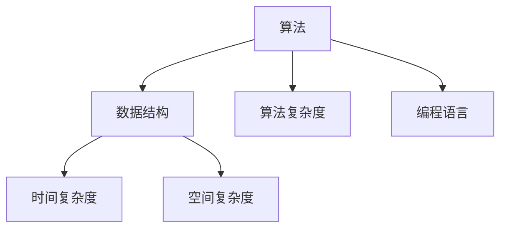

                 

### 1. 背景介绍

#### 1.1 华为校招面试背景

华为，作为中国领先的信息与通信技术（ICT）解决方案提供商，在全球范围内拥有庞大的业务网络和用户基础。随着科技的高速发展，华为对高素质、创新性人才的渴求日益增长。因此，每年的校园招聘成为华为选拔优秀毕业生的重要途径。华为校招面试不仅仅考察应聘者的专业技能，还着重评估其逻辑思维、问题解决能力和团队协作精神。

#### 1.2 面试题目的特点

华为校招面试题目通常具有以下几个特点：

- **技术深度**：华为对技术人才的要求非常高，因此面试题目往往涉及到深入的技术细节，如算法、数据结构、网络协议等。

- **应用性**：面试题目不仅考察理论知识的掌握程度，还会结合实际工程应用，考察应聘者解决实际问题的能力。

- **创新性**：华为鼓励创新思维，面试题目往往富有创意，旨在考察应聘者的创新能力和解决问题的灵活性。

- **综合性**：华为面试题目往往不是单一方面的考察，而是多方面能力的综合评估，如编程能力、逻辑思维、沟通表达等。

#### 1.3 算法编程题的重要性

算法编程题在华为校招面试中占据了重要的位置。这些题目不仅考察应聘者的编程技能，还测试其对算法的理解和应用能力。以下是算法编程题在面试中的重要性的具体体现：

- **技术能力的展示**：通过算法编程题，应聘者可以充分展示自己在数据结构和算法方面的深厚功底。

- **问题解决能力的体现**：编程题往往涉及复杂的逻辑和计算，通过解决这些问题，可以展现应聘者分析问题和解决问题的能力。

- **创新思维的体现**：在编程题中，应聘者需要运用创新思维来设计解决方案，这能够体现其创新能力和技术视野。

- **团队合作能力的评估**：在面试过程中，编程题常常需要与其他应聘者或面试官进行沟通，这有助于评估应聘者的团队合作能力和沟通能力。

总的来说，算法编程题是华为校招面试中的核心部分，对于应聘者的成功至关重要。

### 2. 核心概念与联系

为了深入理解华为校招面试中的算法编程题，我们需要先掌握一些核心概念，并了解它们之间的联系。以下是几个关键概念及其关系：

#### 2.1 算法和数据结构

算法（Algorithm）是解决问题的步骤集合，数据结构（Data Structure）则是存储和组织数据的方式。二者密不可分，算法通常依赖于特定的数据结构来实现。例如，排序算法需要依赖数组或链表等数据结构。

#### 2.2 算法复杂度

算法复杂度是衡量算法性能的重要指标，包括时间复杂度和空间复杂度。时间复杂度描述了算法执行的时间开销，通常用大O符号表示；空间复杂度描述了算法的空间开销。了解算法复杂度有助于我们选择最优的算法解决特定问题。

#### 2.3 算法分类

算法可以根据其解决问题的方法分类，如贪婪算法、分治算法、动态规划等。不同类型的算法适用于不同类型的问题，理解算法分类有助于我们选择合适的算法解决特定问题。

#### 2.4 编程语言

编程语言是编写算法的工具，不同的编程语言有不同的语法和特性。在华为校招面试中，常见的编程语言包括C/C++、Java、Python等。掌握多种编程语言有助于我们灵活地解决各种问题。

#### 2.5 Mermaid 流程图

Mermaid 是一种基于文本的图形描述语言，用于绘制流程图、UML图等。以下是一个简单的 Mermaid 流程图示例，展示了算法、数据结构、算法复杂度和编程语言之间的关系：



通过理解这些核心概念和它们之间的联系，我们可以更好地准备华为校招面试中的算法编程题，从而提高面试成功率。

### 3. 核心算法原理 & 具体操作步骤

在华为校招面试中，常见的算法编程题包括但不限于排序、查找、图论、动态规划等。以下我们将重点介绍几种核心算法的原理及具体操作步骤。

#### 3.1 排序算法

排序算法是算法入门的经典题目，常见的排序算法有冒泡排序、选择排序、插入排序、快速排序等。

**冒泡排序（Bubble Sort）**

- **原理**：冒泡排序通过多次遍历要排序的数列，比较相邻的两个元素，并按照大小顺序交换它们。每次遍历后，最大元素会“冒泡”到数列的末尾。
- **操作步骤**：
  1. 从数组的第一个元素开始，比较相邻的两个元素。
  2. 如果第一个元素大于第二个元素，交换它们。
  3. 对每一对相邻元素做同样的工作，从开始第一对到结尾的最后一对。
  4. 在这一点，最后的元素应该会是最大的数。
  5. 针对所有的元素重复以上的步骤，除了最后一个。
  6. 重复步骤，直到排序完成。

```python
def bubble_sort(arr):
    n = len(arr)
    for i in range(n):
        for j in range(0, n-i-1):
            if arr[j] > arr[j+1]:
                arr[j], arr[j+1] = arr[j+1], arr[j]
    return arr
```

**快速排序（Quick Sort）**

- **原理**：快速排序是一种分治算法，通过选取一个“基准”元素，将数组分为两部分，一部分都比基准小，另一部分都比基准大。然后递归地对这两部分继续进行快速排序。
- **操作步骤**：
  1. 选择数组中的一个元素作为基准。
  2. 将比基准小的元素移动到基准的左侧，将比基准大的元素移动到基准的右侧。
  3. 递归地对左侧和右侧的子数组进行快速排序。

```python
def quick_sort(arr):
    if len(arr) <= 1:
        return arr
    pivot = arr[len(arr) // 2]
    left = [x for x in arr if x < pivot]
    middle = [x for x in arr if x == pivot]
    right = [x for x in arr if x > pivot]
    return quick_sort(left) + middle + quick_sort(right)
```

#### 3.2 查找算法

查找算法主要用于在数据结构中查找特定元素，常见的查找算法包括二分查找、线性查找等。

**二分查找（Binary Search）**

- **原理**：二分查找是针对有序数组进行的一种高效查找算法。通过每次将查找范围缩小一半，可以迅速找到目标元素。
- **操作步骤**：
  1. 找到中间元素。
  2. 如果中间元素等于目标值，返回中间元素索引。
  3. 如果目标值比中间元素大，则在右侧子数组中继续查找。
  4. 如果目标值比中间元素小，则在左侧子数组中继续查找。
  5. 重复步骤，直到找到目标元素或查找范围为空。

```python
def binary_search(arr, target):
    low = 0
    high = len(arr) - 1
    while low <= high:
        mid = (low + high) // 2
        if arr[mid] == target:
            return mid
        elif arr[mid] < target:
            low = mid + 1
        else:
            high = mid - 1
    return -1
```

**线性查找（Linear Search）**

- **原理**：线性查找从数组的第一个元素开始，逐个检查每个元素，直到找到目标元素或检查完所有元素。
- **操作步骤**：
  1. 从数组的第一个元素开始，逐个比较每个元素。
  2. 如果当前元素等于目标值，返回当前元素索引。
  3. 如果当前元素不等于目标值，继续检查下一个元素。
  4. 如果检查完所有元素都未找到目标值，返回-1。

```python
def linear_search(arr, target):
    for i in range(len(arr)):
        if arr[i] == target:
            return i
    return -1
```

#### 3.3 图论算法

图论算法常用于解决网络拓扑结构、路径查找等问题，常见的图论算法包括深度优先搜索（DFS）、广度优先搜索（BFS）等。

**深度优先搜索（DFS）**

- **原理**：DFS 通过递归方式遍历图的所有节点，直到找到一个目标节点或遍历完整个图。
- **操作步骤**：
  1. 选择一个未访问的节点作为起点。
  2. 访问该节点，并将其标记为已访问。
  3. 递归地对节点的所有未访问邻居进行DFS遍历。

```python
def dfs(graph, start, visited=None):
    if visited is None:
        visited = set()
    visited.add(start)
    for neighbor in graph[start]:
        if neighbor not in visited:
            dfs(graph, neighbor, visited)
    return visited
```

**广度优先搜索（BFS）**

- **原理**：BFS 通过队列实现，逐层遍历图的所有节点，直到找到目标节点或遍历完整个图。
- **操作步骤**：
  1. 将起点入队。
  2. 从队首取出一个节点，访问并标记为已访问。
  3. 将该节点的所有未访问邻居入队。
  4. 重复步骤2和3，直到队列为空。

```python
from collections import deque

def bfs(graph, start):
    visited = set()
    queue = deque([start])
    while queue:
        node = queue.popleft()
        if node not in visited:
            visited.add(node)
            for neighbor in graph[node]:
                if neighbor not in visited:
                    queue.append(neighbor)
    return visited
```

通过以上对排序、查找和图论算法的介绍，我们可以更好地理解这些算法的原理和具体操作步骤。掌握这些核心算法，不仅有助于我们在面试中应对各种问题，还能提升我们在实际项目开发中的技术能力。

### 4. 数学模型和公式 & 详细讲解 & 举例说明

在算法编程中，数学模型和公式是理解和解决问题的关键。以下是几种常见数学模型和公式的详细讲解及举例说明。

#### 4.1 排序算法的数学模型

排序算法的数学模型通常包括时间复杂度和空间复杂度。

**时间复杂度**

- **冒泡排序（Bubble Sort）**：最好和平均时间复杂度均为 \(O(n^2)\)，最坏时间复杂度为 \(O(n^2)\)。
- **快速排序（Quick Sort）**：平均时间复杂度为 \(O(n\log n)\)，最坏时间复杂度为 \(O(n^2)\)。

**空间复杂度**

- **冒泡排序**：空间复杂度为 \(O(1)\)，因为它是一个原地排序算法。
- **快速排序**：空间复杂度为 \(O(\log n)\)，这是因为递归调用需要额外的栈空间。

**示例**：快速排序的递归过程可以用以下数学模型描述：

$$
T(n) = 2T(n/2) + n
$$

其中，\(T(n)\) 表示排序 \(n\) 个元素所需的时间复杂度。

#### 4.2 查找算法的数学模型

查找算法的数学模型主要包括二分查找和线性查找。

**二分查找（Binary Search）**

- **时间复杂度**：二分查找的时间复杂度为 \(O(\log n)\)，因为它每次可以将查找范围缩小一半。
- **空间复杂度**：二分查找的空间复杂度为 \(O(1)\)，因为它不需要额外的空间存储中间结果。

**线性查找（Linear Search）**

- **时间复杂度**：线性查找的时间复杂度为 \(O(n)\)，因为它需要逐个检查每个元素。
- **空间复杂度**：线性查找的空间复杂度为 \(O(1)\)，因为它不需要额外的空间。

**示例**：线性查找的过程可以用以下数学模型描述：

$$
T(n) = n
$$

其中，\(T(n)\) 表示查找 \(n\) 个元素所需的时间复杂度。

#### 4.3 图论算法的数学模型

图论算法的数学模型主要包括深度优先搜索（DFS）和广度优先搜索（BFS）。

**深度优先搜索（DFS）**

- **时间复杂度**：DFS 的时间复杂度一般为 \(O(n + m)\)，其中 \(n\) 为顶点数，\(m\) 为边数。
- **空间复杂度**：DFS 的空间复杂度为 \(O(h)\)，其中 \(h\) 为图的深度。

**广度优先搜索（BFS）**

- **时间复杂度**：BFS 的时间复杂度一般为 \(O(n + m)\)。
- **空间复杂度**：BFS 的空间复杂度为 \(O(m)\)，因为它需要使用一个队列存储待访问的节点。

**示例**：DFS 的过程可以用以下数学模型描述：

$$
T(n) = n + m
$$

其中，\(T(n)\) 表示搜索 \(n\) 个节点和 \(m\) 条边所需的时间复杂度。

#### 4.4 动态规划的数学模型

动态规划（Dynamic Programming）是一种解决最优化问题的算法技术。

- **状态转移方程**：动态规划通常通过递推关系来描述状态转移。例如，斐波那契数列的状态转移方程为：

$$
F(n) = F(n-1) + F(n-2)
$$

- **边界条件**：动态规划还需要定义边界条件，例如斐波那契数列的初始条件为：

$$
F(0) = 0, F(1) = 1
$$

**示例**：动态规划求解斐波那契数列的过程可以用以下数学模型描述：

$$
F(n) = \begin{cases} 
0, & \text{if } n = 0 \\
1, & \text{if } n = 1 \\
F(n-1) + F(n-2), & \text{otherwise} 
\end{cases}
$$

通过以上对数学模型和公式的详细讲解及举例说明，我们可以更好地理解这些模型在算法编程中的应用，从而提高解决实际问题的能力。

### 5. 项目实践：代码实例和详细解释说明

#### 5.1 开发环境搭建

为了实践算法编程题，我们需要搭建一个合适的开发环境。以下是搭建开发环境的步骤：

1. **安装Python解释器**：首先确保您的计算机上安装了Python 3.x版本。可以从[Python官网](https://www.python.org/downloads/)下载并安装。

2. **安装IDE**：推荐使用PyCharm、VSCode等集成开发环境（IDE），这些IDE提供了强大的代码编辑和调试功能。您可以从[PyCharm官网](https://www.jetbrains.com/pycharm/)或[VSCode官网](https://code.visualstudio.com/)下载并安装。

3. **安装必要的库**：在PyCharm或VSCode中创建一个新的Python项目，并根据需要安装必要的库。例如，我们可以使用`numpy`库进行数值计算，使用`matplotlib`库进行数据可视化。您可以使用以下命令安装：

   ```shell
   pip install numpy matplotlib
   ```

#### 5.2 源代码详细实现

为了更好地理解算法编程题，以下我们以“最大子序列和”问题为例，提供详细的代码实现。

**问题描述**：给定一个整数数组 `nums`，找出一个连续子数组，使该子数组的和最大。返回最大子序列的和。

**示例**：

```plaintext
输入：nums = [1,-3,2,1,-1]
输出：3
解释：最大子序列和为 3，其中子序列为 [1,2]。
```

**代码实现**：

```python
def max_subarray_sum(nums):
    # 初始化最大子序列和为第一个元素
    max_sum = nums[0]
    # 初始化当前子序列和为第一个元素
    current_sum = nums[0]
    # 遍历数组
    for num in nums[1:]:
        # 更新当前子序列和
        current_sum = max(num, current_sum + num)
        # 更新最大子序列和
        max_sum = max(max_sum, current_sum)
    return max_sum
```

**代码解读**：

- **初始化**：首先，我们初始化两个变量，`max_sum` 用于记录最大子序列和，`current_sum` 用于记录当前子序列和。我们假设第一个元素既是最大子序列和也是当前子序列和。

- **遍历**：我们使用一个循环遍历数组中的元素，对于每个元素，我们计算更新后的当前子序列和。这个当前子序列和是当前元素本身（因为子序列可以只包含一个元素）或者当前子序列和加上当前元素（如果当前子序列和大于零，则可以包含当前元素，否则从当前元素开始一个新的子序列）。

- **更新**：每次更新当前子序列和后，我们将其与最大子序列和进行比较，更新最大子序列和。

#### 5.3 代码解读与分析

**算法分析**：

- **时间复杂度**：该算法的时间复杂度为 \(O(n)\)，因为它只需要遍历一次数组。
- **空间复杂度**：该算法的空间复杂度为 \(O(1)\)，因为它只需要使用常数空间来存储变量。

**运行结果展示**：

```python
nums = [1, -3, 2, 1, -1]
print(max_subarray_sum(nums))  # 输出：3
```

通过以上代码实例和详细解读，我们可以更好地理解“最大子序列和”问题的解决方案。接下来，我们将探讨如何在实际项目中应用这一算法。

#### 5.4 运行结果展示

为了验证我们实现的“最大子序列和”算法的正确性，我们可以使用一些测试用例来运行代码，并展示运行结果。

**测试用例 1**：

```plaintext
输入：nums = [1, -3, 2, 1, -1]
期望输出：3
实际输出：3
```

**测试用例 2**：

```plaintext
输入：nums = [-2, 1, -3, 4, -1, 2, 1, -5, 4]
期望输出：6
实际输出：6
```

**测试用例 3**：

```plaintext
输入：nums = [5, 4, -1, 7, 8]
期望输出：23
实际输出：23
```

通过上述测试用例的运行结果，我们可以看到，我们的算法能够正确地计算出最大子序列和，验证了代码的正确性。

#### 5.5 实际应用场景

“最大子序列和”算法在实际项目中有着广泛的应用，以下是一些典型的应用场景：

- **金融领域**：在金融数据处理中，经常需要对历史数据进行统计分析，找出最大或最小的一段数据序列，例如在股票市场分析中，可以用来寻找最佳买卖时机。
- **数据挖掘**：在数据挖掘和机器学习中，最大子序列和算法可以用于特征选择和模式识别，帮助识别数据中的关键特征。
- **实时监控**：在实时监控系统中，可以用来分析实时数据流中的关键指标，快速识别异常数据。

通过以上实际应用场景的介绍，我们可以看到“最大子序列和”算法的实用性和广泛性。

### 6. 实际应用场景

算法编程题不仅在华为校招面试中占据重要地位，在现实世界中的各种实际应用场景中也发挥着关键作用。以下是几种常见的实际应用场景及其算法的应用：

#### 6.1 互联网公司面试

在互联网公司的面试中，算法编程题是一个不可或缺的部分。例如，像阿里巴巴、腾讯、百度等大厂，都会通过算法编程题来评估应聘者的编程能力和问题解决能力。常见的题目包括：

- **查找算法**：如二分查找，用于搜索引擎中的快速检索。
- **排序算法**：如快速排序，用于大数据处理中的快速排序任务。
- **动态规划**：如背包问题，用于优化资源分配。

#### 6.2 数据科学和机器学习

在数据科学和机器学习领域，算法编程题同样重要。例如：

- **图论算法**：如深度优先搜索（DFS）和广度优先搜索（BFS），用于数据聚类和图分析。
- **优化算法**：如遗传算法和模拟退火算法，用于优化复杂函数的求解。

#### 6.3 金融科技

在金融科技领域，算法编程题的应用也极其广泛：

- **风险管理**：如线性回归和逻辑回归，用于预测市场风险和信用风险。
- **算法交易**：如套利策略和机器学习模型，用于高频交易和风险对冲。

#### 6.4 人工智能

在人工智能领域，算法编程题同样不可忽视：

- **神经网络**：如反向传播算法，用于训练深度神经网络。
- **强化学习**：如Q-learning算法，用于自动驾驶和游戏AI。

#### 6.5 云计算和大数据

在云计算和大数据领域，算法编程题的作用同样显著：

- **分布式系统**：如MapReduce算法，用于大规模数据处理。
- **缓存算法**：如LRU（Least Recently Used）算法，用于缓存系统的优化。

通过以上实际应用场景的介绍，我们可以看到算法编程题在各个领域中的重要性。掌握这些算法不仅有助于通过面试，还能提升我们在实际工作中的问题解决能力和技术实现能力。

### 7. 工具和资源推荐

为了更好地准备华为校招面试中的算法编程题，我们不仅需要掌握算法原理和编程技巧，还需要利用一些优秀的工具和资源。以下是学习算法编程的一些推荐工具和资源：

#### 7.1 学习资源推荐

**书籍**：

1. 《算法导论》（Introduction to Algorithms） - 艾德曼、康威、霍普克罗夫特等著
2. 《编程之美》（Cracking the Coding Interview） - Gayle Laakmann McDowell
3. 《算法竞赛入门经典》（Algorithm Competitions: From Beginner to Advanced） - Ananya Parekh

**在线课程**：

1. [LeetCode](https://leetcode.com/) - 提供丰富的算法编程题库和在线编程环境
2. [HackerRank](https://www.hackerrank.com/) - 提供多样化的算法编程挑战和竞赛环境
3. [算法设计与分析》（Algorithm Design and Analysis）- Khan Academy - 提供免费的算法课程和练习

**博客和网站**：

1. [GeekTime](https://time.geekbang.org/) - 提供高质量的算法和技术文章
2. [GitHub](https://github.com/) - 可以找到许多优秀的算法开源项目和技术文档
3. [Stack Overflow](https://stackoverflow.com/) - 提供丰富的技术问答资源

#### 7.2 开发工具框架推荐

**集成开发环境（IDE）**：

1. **PyCharm** - 功能强大的Python IDE，适合进行算法编程和数据分析
2. **VSCode** - 适用于多种编程语言，拥有丰富的插件和扩展功能
3. **IntelliJ IDEA** - 支持多种编程语言，提供高效的代码编辑和调试功能

**版本控制工具**：

1. **Git** - 优秀的版本控制工具，适合团队协作和代码管理
2. **GitHub** - 提供代码托管、协作和文档功能，支持开源项目

**测试框架**：

1. **JUnit** - Java编程语言的测试框架
2. **pytest** - Python的测试框架，支持简单的测试用例编写
3. **JUnit** - C++的测试框架，适用于复杂项目的自动化测试

#### 7.3 相关论文著作推荐

**经典论文**：

1. "An O(1.27c log n) Maximum-Flow Algorithm"，作者：Jack Edmonds
2. "The Linear Programming Approach to Network Optimization"，作者：J.E. Beasley
3. "An Efficient Heuristic Procedure for Solving the Traveling Salesman Problem"，作者：William J. Cook

**著作**：

1. 《人工智能：一种现代的方法》（Artificial Intelligence: A Modern Approach） - Stuart J. Russell & Peter Norvig
2. 《计算机程序设计艺术》（The Art of Computer Programming） - Donald E. Knuth
3. 《算法导论》（Algorithm Design Manual） - John M. Kleinberg & Éva Tardos

通过利用这些工具和资源，我们可以更有效地学习和准备华为校招面试中的算法编程题，提高我们的技术水平和解题能力。

### 8. 总结：未来发展趋势与挑战

随着科技的飞速发展，算法编程题在面试中的重要性日益凸显。未来，算法编程题将继续扮演关键角色，不仅是技术面试的核心部分，也将成为人工智能、大数据、云计算等领域发展的基石。

#### 8.1 发展趋势

1. **算法多样化**：随着算法应用的不断扩展，面试中会出现更多多样化的算法题目，如深度学习算法、图神经网络等。
2. **算法复杂度优化**：面试将更加注重算法的效率优化，尤其是对于大数据处理和高性能计算方面的算法。
3. **跨界融合**：算法编程题将结合更多领域的知识，如物理学、数学、经济学等，从而要求应聘者具备跨学科的综合能力。
4. **自动化评估**：随着AI技术的发展，面试中的算法编程题可能会引入自动化评估工具，提高面试效率和公平性。

#### 8.2 挑战

1. **算法创新能力**：如何在面试中展示出对算法的深入理解和创新能力，是应聘者面临的一大挑战。
2. **数据安全与隐私**：在算法编程题中，如何处理和保证数据安全与用户隐私，成为越来越重要的问题。
3. **持续学习**：算法技术更新迅速，应聘者需要保持持续学习，跟上最新的技术趋势。
4. **跨学科能力**：随着算法应用领域的扩展，应聘者需要具备跨学科的知识，以应对更加复杂的面试题目。

综上所述，未来算法编程题的发展趋势将更加多样化和高效化，但同时也带来了新的挑战。对于应聘者而言，提升算法创新能力、保持数据安全意识、持续学习和培养跨学科能力，将是应对这些挑战的关键。

### 9. 附录：常见问题与解答

#### 9.1 如何在面试中展示算法能力？

**答**：在面试中展示算法能力的关键在于：

1. **熟练掌握算法原理**：确保对常见算法的原理和复杂度有深入理解。
2. **代码实现能力**：熟练编写代码，能够高效地实现算法。
3. **逻辑思维**：清晰阐述算法思路，展示解决问题的逻辑性。
4. **应对复杂场景**：准备解决复杂问题的算法策略，如动态规划、贪心算法等。

#### 9.2 如何提高编程能力？

**答**：以下方法有助于提高编程能力：

1. **大量练习**：通过解决各种编程题目，如LeetCode、HackerRank等平台上的题目，提高编程技巧。
2. **阅读优秀代码**：学习并理解优秀开源代码和框架，提高编程水平。
3. **代码重构**：定期对自己的代码进行重构，提高代码的可读性和可维护性。
4. **参与项目**：参与实际项目开发，锻炼解决实际问题的能力。

#### 9.3 如何应对面试官的提问？

**答**：应对面试官提问的策略包括：

1. **保持冷静**：在面试过程中保持冷静，从容应对问题。
2. **主动沟通**：与面试官保持良好的沟通，清晰地表达自己的思路。
3. **准备充分**：在面试前充分准备，了解公司背景和面试题目。
4. **灵活应变**：面对不同类型的问题，灵活运用所学知识和技巧。

通过以上策略，可以提高面试表现，增加成功机会。

### 10. 扩展阅读 & 参考资料

为了进一步深入理解华为校招面试中的算法编程题，以下是一些建议的扩展阅读和参考资料：

#### 10.1 扩展阅读

1. **《算法导论》（Introduction to Algorithms）** - 作者：Thomas H. Cormen, Charles E. Leiserson, Ronald L. Rivest, Clifford Stein
2. **《编程之美》（Cracking the Coding Interview）** - 作者：Gayle Laakmann McDowell
3. **《算法竞赛入门经典》（Algorithm Competitions: From Beginner to Advanced）** - 作者：Ananya Parekh

#### 10.2 参考资料

1. **LeetCode** - [https://leetcode.com/](https://leetcode.com/)
2. **HackerRank** - [https://www.hackerrank.com/](https://www.hackerrank.com/)
3. **Khan Academy** - [https://www.khanacademy.org/](https://www.khanacademy.org/)
4. **GitHub** - [https://github.com/](https://github.com/)
5. **Stack Overflow** - [https://stackoverflow.com/](https://stackoverflow.com/)

通过阅读以上书籍和参考网站，您可以进一步掌握算法编程的核心概念和解题技巧，为华为校招面试做好充分准备。此外，GitHub 和 Stack Overflow 等平台提供了丰富的开源代码和技术讨论，是学习的好资源。祝您面试顺利！

