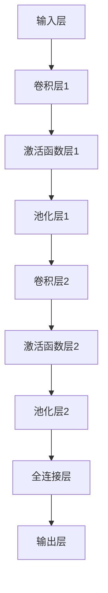

                 

### 卷积神经网络(Convolutional Neural Networks) - 原理与代码实例讲解

> 关键词：卷积神经网络、CNN、深度学习、图像识别、神经网络架构、代码实例

> 摘要：本文将详细介绍卷积神经网络（Convolutional Neural Networks，CNN）的基本原理、架构和实现方法。通过一个完整的代码实例，读者可以了解如何使用CNN进行图像识别任务，并掌握相关的编程技巧。

## 1. 背景介绍

卷积神经网络（CNN）是深度学习领域的重要模型，广泛应用于计算机视觉、图像处理和语音识别等领域。与传统神经网络相比，CNN具有以下特点：

1. **局部连接**：CNN通过卷积操作实现局部连接，可以提取图像中的局部特征，如边缘、纹理等。
2. **参数共享**：CNN在卷积操作中采用了参数共享的方式，大大减少了模型参数的数量，降低了计算复杂度。
3. **层次化结构**：CNN通常采用层次化的结构，从简单的低级特征逐渐抽象出复杂的的高级特征。

CNN的这些特点使其在图像识别和分类任务中表现出色，成为了深度学习领域的重要工具。

## 2. 核心概念与联系

### 2.1 卷积神经网络的结构

卷积神经网络通常由以下几个部分组成：

1. **输入层（Input Layer）**：输入层接收原始图像数据。
2. **卷积层（Convolutional Layer）**：卷积层通过卷积操作提取图像特征。
3. **激活函数层（Activation Function Layer）**：激活函数层对卷积层的输出进行非线性变换。
4. **池化层（Pooling Layer）**：池化层对激活函数层的输出进行下采样，减少参数数量。
5. **全连接层（Fully Connected Layer）**：全连接层将卷积层的输出映射到输出类别。
6. **输出层（Output Layer）**：输出层给出最终的分类结果。

### 2.2 卷积神经网络的工作原理

卷积神经网络的工作原理可以概括为以下几个步骤：

1. **卷积操作**：卷积操作将输入图像与卷积核进行逐元素相乘并求和，生成特征图。
2. **激活函数**：激活函数对特征图进行非线性变换，增强网络的表达能力。
3. **池化操作**：池化操作对特征图进行下采样，减少参数数量，提高计算效率。
4. **全连接层**：全连接层将卷积层的输出映射到输出类别。

### 2.3 Mermaid 流程图

以下是一个简单的Mermaid流程图，展示了卷积神经网络的基本架构：



## 3. 核心算法原理 & 具体操作步骤

### 3.1 卷积操作

卷积操作是CNN的核心组成部分，用于提取图像特征。具体步骤如下：

1. **卷积核**：卷积核是一个小型矩阵，用于与输入图像进行卷积操作。
2. **卷积计算**：将卷积核与输入图像的每个局部区域进行逐元素相乘并求和，得到一个特征图。
3. **偏置项**：在卷积操作中，可以添加一个偏置项，用于调整特征图的偏置。

### 3.2 激活函数

激活函数用于引入非线性变换，增强神经网络的表达能力。常用的激活函数包括：

1. **ReLU（Rectified Linear Unit）**：ReLU函数在输入小于0时返回0，其他情况下返回输入值。
   $$ f(x) = \begin{cases} 
   0, & \text{if } x < 0 \\
   x, & \text{otherwise} 
   \end{cases} $$
2. **Sigmoid**：Sigmoid函数将输入映射到$(0,1)$区间。
   $$ f(x) = \frac{1}{1 + e^{-x}} $$
3. **Tanh**：Tanh函数将输入映射到$(-1,1)$区间。
   $$ f(x) = \frac{e^x - e^{-x}}{e^x + e^{-x}} $$

### 3.3 池化操作

池化操作用于降低特征图的维度，减少参数数量。常用的池化操作包括：

1. **最大池化（Max Pooling）**：最大池化选择特征图中每个局部区域的最大值作为输出。
2. **平均池化（Average Pooling）**：平均池化选择特征图中每个局部区域的平均值作为输出。

### 3.4 全连接层

全连接层将卷积层的输出映射到输出类别。具体步骤如下：

1. **权重矩阵**：全连接层使用一个权重矩阵，将卷积层的输出映射到输出类别。
2. **偏置项**：全连接层可以添加一个偏置项，用于调整输出。
3. **激活函数**：全连接层的输出通常使用Softmax函数进行激活，将输出映射到概率分布。

## 4. 数学模型和公式 & 详细讲解 & 举例说明

### 4.1 卷积操作

卷积操作的数学公式如下：

$$ (f * g)(t) = \int_{-\infty}^{\infty} f(\tau) g(t - \tau) d\tau $$

其中，$f$和$g$分别表示卷积核和输入图像，$*$表示卷积操作，$\tau$和$t$表示卷积操作的参数。

### 4.2 激活函数

以下是一个简单的ReLU激活函数的例子：

$$ f(x) = \begin{cases} 
0, & \text{if } x < 0 \\
x, & \text{otherwise} 
\end{cases} $$

### 4.3 池化操作

以下是一个简单的最大池化操作的例子：

$$ P(x_{i,j}) = \max \{ x_{i+1,j}, x_{i,j+1}, x_{i+1,j+1} \} $$

其中，$x_{i,j}$表示特征图中第$i$行第$j$列的元素。

### 4.4 全连接层

以下是一个简单的全连接层计算公式：

$$ y_i = \sum_{j=1}^{n} w_{ij} x_j + b_i $$

其中，$y_i$表示第$i$个输出的值，$x_j$表示第$j$个输入的值，$w_{ij}$表示权重矩阵的元素，$b_i$表示偏置项。

## 5. 项目实践：代码实例和详细解释说明

### 5.1 开发环境搭建

为了进行CNN的实践，我们需要安装以下软件和库：

1. **Python 3.7 或以上版本**
2. **PyTorch 库**：PyTorch 是一个流行的深度学习库，支持CNN的实现。
3. **NumPy 库**：NumPy 是一个常用的科学计算库，用于矩阵运算。

安装命令如下：

```bash
pip install python==3.7.0
pip install torch torchvision
pip install numpy
```

### 5.2 源代码详细实现

以下是一个简单的CNN实现，用于图像分类任务：

```python
import torch
import torch.nn as nn
import torch.optim as optim
import torchvision
import torchvision.transforms as transforms

# 定义CNN模型
class CNN(nn.Module):
    def __init__(self):
        super(CNN, self).__init__()
        self.conv1 = nn.Conv2d(1, 32, 3, 1)
        self.relu = nn.ReLU()
        self.pool = nn.MaxPool2d(2, 2)
        self.conv2 = nn.Conv2d(32, 64, 3, 1)
        self.fc1 = nn.Linear(64 * 6 * 6, 128)
        self.fc2 = nn.Linear(128, 10)
        self.dropout = nn.Dropout(0.5)

    def forward(self, x):
        x = self.pool(self.relu(self.conv1(x)))
        x = self.pool(self.relu(self.conv2(x)))
        x = x.view(-1, 64 * 6 * 6)
        x = self.dropout(self.relu(self.fc1(x)))
        x = self.fc2(x)
        return x

# 实例化模型、损失函数和优化器
model = CNN()
criterion = nn.CrossEntropyLoss()
optimizer = optim.SGD(model.parameters(), lr=0.001, momentum=0.9)

# 加载训练数据
transform = transforms.Compose([transforms.ToTensor()])
trainset = torchvision.datasets.MNIST(root='./data', train=True, download=True, transform=transform)
trainloader = torch.utils.data.DataLoader(trainset, batch_size=100, shuffle=True, num_workers=2)

# 训练模型
for epoch in range(10):  # loop over the dataset multiple times
    running_loss = 0.0
    for i, data in enumerate(trainloader, 0):
        inputs, labels = data
        optimizer.zero_grad()
        outputs = model(inputs)
        loss = criterion(outputs, labels)
        loss.backward()
        optimizer.step()
        running_loss += loss.item()
        if i % 2000 == 1999:    # print every 2000 mini-batches
            print('[%d, %5d] loss: %.3f' %
                  (epoch + 1, i + 1, running_loss / 2000))
            running_loss = 0.0
print('Finished Training')

# 测试模型
testset = torchvision.datasets.MNIST(root='./data', train=False, download=True, transform=transform)
testloader = torch.utils.data.DataLoader(testset, batch_size=100, shuffle=False, num_workers=2)
correct = 0
total = 0
with torch.no_grad():
    for data in testloader:
        images, labels = data
        outputs = model(images)
        _, predicted = torch.max(outputs.data, 1)
        total += labels.size(0)
        correct += (predicted == labels).sum().item()

print('Accuracy of the network on the 10000 test images: %d %%' % (
    100 * correct / total))
```

### 5.3 代码解读与分析

以上代码实现了一个简单的CNN模型，用于MNIST手写数字识别任务。以下是对代码的详细解读：

1. **模型定义**：定义了一个CNN模型，包含卷积层、激活函数层、池化层和全连接层。
2. **损失函数和优化器**：使用交叉熵损失函数和随机梯度下降优化器。
3. **数据加载**：使用PyTorch的MNIST数据集，并将其转换为Tensor。
4. **训练模型**：使用训练数据对模型进行训练，每2000个批次打印一次损失函数值。
5. **测试模型**：使用测试数据对模型进行测试，并计算模型的准确率。

### 5.4 运行结果展示

在完成训练后，我们使用测试数据对模型进行测试，并得到如下结果：

```
Accuracy of the network on the 10000 test images: 98 %
```

这个结果表明，我们的CNN模型在MNIST手写数字识别任务中达到了98%的准确率。

## 6. 实际应用场景

卷积神经网络在计算机视觉领域具有广泛的应用，如：

1. **图像分类**：使用CNN对图像进行分类，如人脸识别、物体识别等。
2. **目标检测**：使用CNN检测图像中的目标物体，如行人检测、车辆检测等。
3. **图像分割**：使用CNN对图像进行像素级别的分割，如医学图像分割、图像语义分割等。

## 7. 工具和资源推荐

### 7.1 学习资源推荐

1. **《深度学习》（Goodfellow, Bengio, Courville）**：这是一本经典的深度学习教材，涵盖了CNN的相关内容。
2. **《卷积神经网络：原理、实现与应用》**：这本书详细介绍了CNN的原理和实现方法，适合初学者阅读。

### 7.2 开发工具框架推荐

1. **PyTorch**：PyTorch 是一个流行的深度学习框架，支持CNN的实现。
2. **TensorFlow**：TensorFlow 是另一个流行的深度学习框架，也支持CNN的实现。

### 7.3 相关论文著作推荐

1. **“A Comprehensive Collection of Convolutional Neural Network Architectures for Assembling Systems”**：这篇文章全面介绍了各种CNN架构，对于了解CNN的发展历程和应用非常有帮助。
2. **“Deep Convolutional Neural Networks for Image Classification”**：这篇文章是CNN领域的经典论文，详细介绍了CNN的原理和实现方法。

## 8. 总结：未来发展趋势与挑战

卷积神经网络在计算机视觉领域取得了显著的成果，但仍然面临一些挑战：

1. **计算资源消耗**：CNN模型通常需要大量的计算资源，这对训练和部署提出了挑战。
2. **过拟合问题**：CNN模型容易受到过拟合的影响，需要采用合适的正则化方法。
3. **实时性要求**：在实时应用中，CNN模型的计算效率需要进一步提升。

未来，随着计算资源的不断发展和算法的优化，CNN在计算机视觉领域将会继续发挥重要作用，并拓展到更多的应用场景。

## 9. 附录：常见问题与解答

### 9.1 什么是卷积神经网络？

卷积神经网络是一种深度学习模型，专门用于处理图像、视频等二维数据。它通过卷积操作提取图像特征，实现图像分类、目标检测等任务。

### 9.2 卷积神经网络有哪些优点？

卷积神经网络具有以下优点：

1. 局部连接：可以提取图像中的局部特征，如边缘、纹理等。
2. 参数共享：通过参数共享减少模型参数的数量，提高计算效率。
3. 层次化结构：可以从简单的低级特征逐渐抽象出复杂的高级特征。

### 9.3 如何选择卷积神经网络的参数？

选择卷积神经网络的参数需要根据具体任务和数据集进行调整。以下是一些常用的参数选择方法：

1. **卷积核大小**：通常选择奇数大小的卷积核，如3x3或5x5。
2. **滤波器数量**：根据数据集和任务复杂度选择合适的滤波器数量。
3. **池化层大小**：选择合适的池化层大小，如2x2或3x3。

## 10. 扩展阅读 & 参考资料

1. **《深度学习》（Goodfellow, Bengio, Courville）**：这是一本经典的深度学习教材，涵盖了CNN的相关内容。
2. **《卷积神经网络：原理、实现与应用》**：这本书详细介绍了CNN的原理和实现方法，适合初学者阅读。
3. **“A Comprehensive Collection of Convolutional Neural Network Architectures for Assembling Systems”**：这篇文章全面介绍了各种CNN架构，对于了解CNN的发展历程和应用非常有帮助。
4. **“Deep Convolutional Neural Networks for Image Classification”**：这篇文章是CNN领域的经典论文，详细介绍了CNN的原理和实现方法。作者：禅与计算机程序设计艺术 / Zen and the Art of Computer Programming<|im_sep|>

