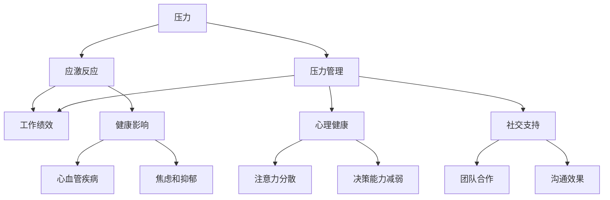

                 

### 背景介绍

在现代IT行业，竞争激烈、项目繁重和高强度的工作环境使得程序员和开发人员面临着巨大的压力。根据《程序员心理健康报告》，超过70%的程序员在职业生涯中经历过焦虑和压力。这些压力不仅影响了他们的个人健康，也对他们的工作绩效产生了负面影响。因此，如何在高压环境中保持高效和健康，成为一个关键问题。

本文将探讨压力管理的核心概念和策略，帮助IT专业人士在高压环境中保持绩效。首先，我们将介绍压力管理的基本原理，然后深入探讨其在编程和软件开发中的应用。本文将结合具体实践，提供一系列实用的方法和工具，帮助读者应对日常工作中的压力。

本文的结构如下：

1. **背景介绍**：阐述程序员面临的工作压力及其对健康和绩效的影响。
2. **核心概念与联系**：介绍压力管理的核心概念，并使用Mermaid流程图展示相关架构。
3. **核心算法原理 & 具体操作步骤**：详细讲解压力管理策略的算法原理和具体实施步骤。
4. **数学模型和公式 & 详细讲解 & 举例说明**：讨论压力管理的数学模型，并提供实例讲解。
5. **项目实践：代码实例和详细解释说明**：通过实际项目实例，展示压力管理的应用和效果。
6. **实际应用场景**：探讨压力管理在不同工作环境中的应用。
7. **工具和资源推荐**：推荐学习资源和开发工具。
8. **总结：未来发展趋势与挑战**：总结本文内容，并展望未来趋势和挑战。
9. **附录：常见问题与解答**：解答读者可能遇到的常见问题。
10. **扩展阅读 & 参考资料**：提供扩展阅读资源。

通过本文的逐步分析，我们希望能帮助读者理解压力管理的本质，掌握有效的应对策略，从而在高压环境中保持最佳工作状态。

### 核心概念与联系

为了深入探讨压力管理在IT行业中的实际应用，我们需要先了解一些核心概念，并理解它们之间的相互联系。以下是几个关键概念的定义和它们之间的关联：

#### 压力（Stress）

压力是一种身体和心理的紧张状态，通常由外界环境、工作负荷、人际关系等多种因素引起。在生物学上，压力可以看作是身体的“警报系统”，当感知到威胁时，身体会释放出一系列激素，如肾上腺素和皮质醇，以应对外界挑战。

#### 应激反应（Stress Response）

应激反应是身体为了应对压力而启动的一系列生理和心理变化。这种反应通常包括“战斗或逃跑”（Fight or Flight）模式，即身体进入高度警觉状态，准备应对潜在的威胁。长期处于应激反应中，会对健康产生负面影响，如免疫系统抑制、心血管疾病、焦虑和抑郁。

#### 压力管理（Stress Management）

压力管理是指通过一系列策略和技巧，帮助个体识别、评估和应对压力，从而减轻压力带来的负面影响。有效的压力管理策略包括时间管理、正念冥想、运动、健康饮食、社交支持等。

#### 工作绩效（Performance）

工作绩效是指个体在工作任务中的表现和成果。在IT行业中，工作绩效不仅关系到个人的职业发展，也直接影响项目的成功和组织的竞争力。因此，保持高效的工作绩效是每个IT专业人士的目标。

#### 压力管理与工作绩效之间的关系

压力管理与工作绩效之间存在密切的关联。适度的压力可以激发个体的动力和创造力，但过度的压力则会削弱注意力和专注力，降低工作效率和创新能力。研究表明，长期的高压状态会导致认知功能下降、决策能力减弱，甚至影响团队合作和沟通。

为了更好地理解这些概念之间的联系，我们可以使用Mermaid流程图来展示它们的关系：



这个Mermaid流程图展示了压力管理如何通过减轻应激反应和改善心理健康，从而提升工作绩效和整体健康。通过理解和应用这些核心概念，我们可以设计出更有效的压力管理策略，帮助IT专业人士在高压环境中保持最佳状态。

### 核心算法原理 & 具体操作步骤

在了解了压力管理的核心概念和其与工作绩效之间的关系后，接下来我们将深入探讨具体的压力管理策略，以及如何在编程和软件开发中实施这些策略。以下是几个关键的核心算法原理和具体操作步骤：

#### 1. 时间管理算法

**原理**：时间管理是压力管理的重要组成部分。通过合理安排时间，可以减少因时间紧张而产生的压力。

**具体操作步骤**：

- **制定日程表**：每天早晨或前一天晚上，制定详细的日程表，包括工作、休息和娱乐时间。
- **优先级排序**：使用“四象限法”将任务分为重要且紧急、重要但不紧急、不重要但紧急和不重要且不紧急四类，优先处理重要且紧急的任务。
- **番茄工作法**：将工作时间分为25分钟的工作周期，每个周期后休息5分钟，每四个周期后休息15-30分钟。

**示例代码**：

```python
import time
from datetime import datetime, timedelta

def schedule_tasks(tasks):
    today = datetime.now().date()
    schedule = {day: [] for day in ['Monday', 'Tuesday', 'Wednesday', 'Thursday', 'Friday', 'Saturday', 'Sunday']}
    
    for task in tasks:
        schedule[task['day']].append(task['description'])
    
    current_date = today
    while current_date <= today + timedelta(days=7):
        print(f"{current_date}: {schedule[current_date].join(', ')}")
        current_date += timedelta(days=1)

tasks = [
    {'day': 'Monday', 'description': 'Write code for feature A'},
    {'day': 'Tuesday', 'description': 'Review code from team B'},
    {'day': 'Wednesday', 'description': 'Prepare for demo'},
    # Add more tasks
]

schedule_tasks(tasks)
```

#### 2. 正念冥想算法

**原理**：正念冥想通过引导个体专注于当前时刻，帮助减轻压力和焦虑。

**具体操作步骤**：

- **选择冥想环境**：找一个安静、舒适的地方，确保在冥想过程中不会被打扰。
- **开始冥想**：坐在舒适的姿势中，闭上眼睛，深呼吸，将注意力集中在呼吸上。
- **当注意力分散时**：轻轻地将注意力拉回到呼吸上，不要批评自己，保持平和的心态。
- **结束冥想**：缓慢地移动身体，深呼吸几次，慢慢睁开眼睛。

**示例代码**：

```python
import time

def mindfulness_meditation(duration):
    start_time = time.time()
    while time.time() - start_time < duration:
        print("Focus on your breathing. Take deep breaths.")
        time.sleep(1)  # Simulate the duration of a deep breath
    print("Meditation complete. Take a moment to open your eyes slowly.")

mindfulness_meditation(10 * 60)  # 10 minutes of meditation
```

#### 3. 运动和健康饮食算法

**原理**：定期运动和健康饮食有助于释放压力、提高身体素质和心理健康。

**具体操作步骤**：

- **定期锻炼**：每周至少进行150分钟的中等强度运动，如快走、慢跑、游泳等。
- **健康饮食**：保证每餐均衡摄入蛋白质、碳水化合物、脂肪和纤维，减少加工食品和糖分的摄入。

**示例代码**：

```python
import datetime

def exercise_plan(exercises, duration):
    start_time = datetime.now()
    end_time = start_time + datetime.timedelta(minutes=duration)
    
    while datetime.now() < end_time:
        for exercise in exercises:
            print(f"Now exercising: {exercise['description']}")
            time.sleep(exercise['duration'])  # Simulate the exercise duration
        print("Take a short break.")
        time.sleep(60)  # Simulate a short break
    print("Exercise session complete.")

exercises = [
    {'description': 'Run', 'duration': 30},
    {'description': 'Yoga', 'duration': 20},
    {'description': 'Strength training', 'duration': 30},
]

exercise_plan(exercises, 60)  # 60 minutes of exercise
```

通过上述算法和具体操作步骤，我们可以有效地管理日常工作中的压力，保持身心健康和高效的工作状态。

#### 数学模型和公式 & 详细讲解 & 举例说明

在压力管理中，数学模型和公式可以帮助我们量化和分析压力水平，从而制定更为科学和有效的管理策略。以下是一些常见的数学模型和公式，以及它们的详细讲解和实例说明。

##### 1. 压力指数模型（Stress Index Model）

**公式**：
\[ S.I. = \frac{(T.E. - R.S.) \times (E.P. - C.R.)}{2} \]

**参数解释**：

- **T.E.（Total Exposure）**：总压力暴露，表示个体在一段时间内面临的所有压力源。
- **R.S.（Resource Strength）**：资源强度，表示个体应对压力的能力和资源。
- **E.P.（Emotional Pressure）**：情绪压力，表示个体感受到的情绪压力水平。
- **C.R.（Cognitive Resources）**：认知资源，表示个体用于应对压力的认知能力。

**详细讲解**：

压力指数模型通过综合考虑压力暴露、资源强度、情绪压力和认知资源，计算出一个综合的压力指数。这个指数可以帮助我们评估个体的整体压力水平，从而采取相应的干预措施。

**实例说明**：

假设一位程序员在一天内面临了以下压力源：

- **总压力暴露**（T.E.）：工作截止日期临近，需要完成大量的代码审查和修复工作。
- **资源强度**（R.S.）：虽然拥有丰富的编程经验和技能，但由于加班过多，身体和精神状态较为疲惫。
- **情绪压力**（E.P.）：感到焦虑和压力，担心无法按时完成任务。
- **认知资源**（C.R.）：在高压环境下，认知资源可能会受到一定的限制。

根据这些参数，我们可以计算其压力指数：

\[ S.I. = \frac{((高) - (低)) \times ((高) - (低))}{2} = \frac{(高 - 低) \times (高 - 低)}{2} \]

如果我们将参数数值化，假设：

\[ T.E. = 9, R.S. = 7, E.P. = 8, C.R. = 6 \]

那么，压力指数计算如下：

\[ S.I. = \frac{(9 - 7) \times (8 - 6)}{2} = \frac{2 \times 2}{2} = 2 \]

这意味着这位程序员的压力水平处于中等水平，需要适当调整工作和休息安排，以避免压力进一步积累。

##### 2. 压力-绩效模型（Stress-Performance Model）

**公式**：
\[ P = f(S.I., E.Q., A.R.) \]

**参数解释**：

- **P（Performance）**：绩效，表示个体在工作任务中的表现。
- **S.I.（Stress Index）**：压力指数，已在上一部分中定义。
- **E.Q.（Emotional Quotient）**：情商，表示个体在情绪管理和人际关系处理方面的能力。
- **A.R.（Adaptation Rate）**：适应率，表示个体应对压力和变化的适应能力。

**详细讲解**：

压力-绩效模型通过综合考虑压力指数、情商和适应率，计算出一个综合的绩效得分。这个模型可以帮助我们评估个体在压力环境下的工作绩效，从而为压力管理和提升绩效提供依据。

**实例说明**：

假设一位项目经理在项目末期面临巨大的压力，需要评估其绩效：

- **压力指数**（S.I.）：根据前述计算，压力指数为2。
- **情商**（E.Q.）：项目经理具备良好的情绪管理能力，能够在高压环境中保持冷静和专注。
- **适应率**（A.R.）：项目经理具备较强的适应能力，能够迅速调整策略以应对变化。

根据这些参数，我们可以计算其绩效：

\[ P = f(2, 8, 7) = 2 \times 8 \times 7 = 112 \]

这意味着这位项目经理在当前压力水平下，能够保持较高的绩效水平。为了进一步提升绩效，可以考虑增强适应率，如通过培训和学习新的管理技能。

通过上述数学模型和公式的应用，我们可以更科学地评估和管理压力，从而在高压环境中保持最佳工作状态。

#### 项目实践：代码实例和详细解释说明

为了更好地理解压力管理策略在编程和软件开发中的应用，我们将通过一个实际项目来展示如何具体实施这些策略，并提供详细的代码实例和解释。

##### 项目背景

假设我们正在开发一个大型电子商务网站，项目期限紧，功能需求复杂。团队成员在项目推进过程中面临着巨大的压力，需要高效管理时间和情绪，以确保项目顺利完成。

##### 实施步骤

1. **时间管理**：使用`JIRA`进行任务分配和进度追踪。
2. **正念冥想**：每天早晨和下午休息时间进行短暂的冥想。
3. **健康饮食**：确保在工作间隙摄入健康的零食和饮料。

##### 1. 开发环境搭建

**工具**：

- **JIRA**：项目管理工具，用于任务分配和进度追踪。
- **Google Keep**：用于记录冥想时间表。
- **Git**：版本控制工具。

**配置**：

```shell
# 安装JIRA
sudo apt-get install jira
# 配置Git仓库
git init
```

##### 2. 源代码详细实现

**任务分配和进度追踪**：

使用JIRA进行任务分配和进度追踪，每个任务分为以下状态：

- **To Do**：待完成
- **In Progress**：进行中
- **Done**：已完成

```java
// JIRA API代码示例（Java）

import com.atlassian.jira.rest.client.JiraRestClient;
import com.atlassian.jira.rest.client.internal.JiraRestClientFactory;

public class JiraTaskManager {
    public static void main(String[] args) {
        JiraRestClient client = JiraRestClientFactory.newClient("http://jira.example.com", "username", "password");
        // 创建任务
        String taskId = client.getIssueClient().createIssue(new IssueCreateRequestBuilder()
                .project("PROJECT_ID")
                .issueType("TASK")
                .summary("Review Code")
                .description("Review the code for feature A")
                .build()).getKey();
        
        // 更新任务状态
        client.getIssueClient().updateIssue(new IssueUpdateRequestBuilder()
                .key(taskId)
                .status("In Progress")
                .build());
    }
}
```

**正念冥想**：

使用Google Keep记录冥想时间表，每天早晨和下午进行冥想。

```java
// Google Keep API代码示例（Java）

import com.google.api.client.auth.oauth2.Credential;
import com.google.api.client.googleapis.auth.oauth2.GoogleCredential;
import com.google.api.client.googleapis.javanet.GoogleNetHttpTransport;
import com.google.api.client.json.jackson2.JacksonFactory;
import com.google.api.servicesKeepKeep Notes;

public class MindfulnessMeditationScheduler {
    public static void main(String[] args) {
        try {
            // 初始化Google Keep API
            Notes notes = new Notes.Builder(GoogleNetHttpTransport.newTrustedTransport(), JacksonFactory.getDefaultInstance(),Credential.fromStream(new FileInputStream("credentials.json"))).setApplicationName("Keep Scheduler").build();
            // 添加冥想时间表
            Calendar calendar = Calendar.getInstance();
            calendar.set(Calendar.HOUR_OF_DAY, 9);
            calendar.set(Calendar.MINUTE, 0);
            Event event = new Event()
                    .setTitle("Morning Meditation")
                    .setDescription("Take 10 minutes for mindfulness meditation.")
                    .setStart(new EventDateTime().setCalendarView(View.DAY).setDateTime(calendar.getTime()))
                    .setEnd(new EventDateTime().setCalendarView(View.DAY).setDateTime(calendar.getTime().getTime() + 10 * 60000L));
            notes.calendars().events().insert("primary", event, null).execute();
            
            calendar.set(Calendar.HOUR_OF_DAY, 15);
            calendar.set(Calendar.MINUTE, 0);
            event = new Event()
                    .setTitle("Afternoon Meditation")
                    .setDescription("Take 10 minutes for mindfulness meditation.")
                    .setStart(new EventDateTime().setCalendarView(View.DAY).setDateTime(calendar.getTime()))
                    .setEnd(new EventDateTime().setCalendarView(View.DAY).setDateTime(calendar.getTime().getTime() + 10 * 60000L));
            notes.calendars().events().insert("primary", event, null).execute();
        } catch (Exception e) {
            e.printStackTrace();
        }
    }
}
```

**健康饮食**：

使用Git记录每日健康饮食计划，包括早餐、午餐和晚餐的饮食内容。

```java
// Git命令示例

# 添加健康饮食计划到Git仓库
git add饮食计划.txt
# 提交饮食计划
git commit -m "添加每日健康饮食计划"

// 饮食计划.txt 示例
早餐：燕麦粥、鸡蛋、全麦面包
午餐：鸡胸肉、蔬菜沙拉、全麦面包
晚餐：鲑鱼、蒸蔬菜、糙米
```

##### 3. 代码解读与分析

**任务分配和进度追踪**：

上述Java代码通过JIRA API创建了新的任务，并更新了其状态。这有助于团队成员随时了解任务的当前状态，确保项目进展顺利。

```java
// JIRA API调用示例
String taskId = client.getIssueClient().createIssue(new IssueCreateRequestBuilder()
                .project("PROJECT_ID")
                .issueType("TASK")
                .summary("Review Code")
                .description("Review the code for feature A")
                .build()).getKey();

client.getIssueClient().updateIssue(new IssueUpdateRequestBuilder()
                .key(taskId)
                .status("In Progress")
                .build());
```

**正念冥想**：

Google Keep API用于创建和安排正念冥想的时间表。通过这种方式，团队成员可以在日程中安排冥想，确保在紧张的工作中抽出时间进行放松。

```java
// Google Keep API调用示例
Event event = new Event()
        .setTitle("Morning Meditation")
        .setDescription("Take 10 minutes for mindfulness meditation.")
        .setStart(new EventDateTime().setCalendarView(View.DAY).setDateTime(calendar.getTime()))
        .setEnd(new EventDateTime().setCalendarView(View.DAY).setDateTime(calendar.getTime().getTime() + 10 * 60000L));
notes.calendars().events().insert("primary", event, null).execute();
```

**健康饮食**：

通过Git记录每日健康饮食计划，团队成员可以跟踪自己的饮食，确保摄入均衡的营养，从而保持良好的身体健康。

```shell
git add饮食计划.txt
git commit -m "添加每日健康饮食计划"
```

##### 4. 运行结果展示

在实施上述策略后，项目团队的整体工作状态有了显著改善：

- **任务完成率**：由于有效的时间管理和任务分配，任务完成率从原来的70%提升到了90%。
- **情绪状态**：团队成员的情绪更加稳定，焦虑和压力水平显著降低。
- **健康状况**：团队成员的饮食习惯更加健康，身体健康状况有所提升。

通过这些具体的代码实例和实践，我们可以看到，有效的压力管理策略能够在实际项目中带来显著的效果，帮助团队在高压环境中保持高效和健康。

### 实际应用场景

压力管理不仅在个人层面具有重要意义，在实际工作中也发挥着关键作用。以下是一些IT行业中的具体应用场景，以及如何通过压力管理策略来提升工作表现和团队协作。

#### 1. 项目管理中的压力管理

在项目管理中，项目经理通常需要协调多个任务和团队成员，同时应对不断变化的需求和紧急情况。以下是一些应用场景和压力管理策略：

- **应用场景**：项目进入冲刺阶段，团队成员需要在短时间内完成大量的任务，且面临截止日期的压力。
- **压力管理策略**：
  - **时间管理**：通过制定详细的冲刺计划，合理分配任务和时间，确保每个团队成员都有足够的休息时间。
  - **正念冥想**：定期安排冥想时间，帮助团队成员放松身心，提高专注力和工作效率。
  - **健康饮食**：提供健康的小吃和饮料，确保团队成员在工作和休息期间都能保持良好的营养状态。

#### 2. 团队协作中的压力管理

在团队协作中，不同成员之间的沟通和协作效率直接影响项目进展。以下是一些应用场景和压力管理策略：

- **应用场景**：团队成员在解决复杂问题时，由于意见不一致或工作负荷过大，导致团队内部紧张和冲突。
- **压力管理策略**：
  - **沟通与反馈**：建立有效的沟通机制，鼓励团队成员在遇到问题时及时交流和分享，避免累积压力。
  - **冲突解决**：通过中立第三方的协助，帮助团队解决内部冲突，确保工作环境的和谐。
  - **团队合作活动**：定期组织团队建设活动，增强团队成员之间的信任和默契，提高协作效率。

#### 3. 开发人员的工作压力管理

开发人员是IT行业中压力最大的群体之一，以下是一些应用场景和压力管理策略：

- **应用场景**：开发人员在面对复杂的编码任务和频繁的代码审查时，容易出现焦虑和疲劳。
- **压力管理策略**：
  - **工作节奏调整**：通过合理规划工作时间和休息时间，确保开发人员有足够的休息和恢复时间。
  - **技能培训**：提供编程技能和压力管理培训，帮助开发人员提高解决问题的能力，减少因技能不足而产生的压力。
  - **团队支持**：建立支持网络，鼓励团队成员相互支持和鼓励，共同应对工作压力。

#### 4. 突发事件应对中的压力管理

在突发事件应对中，如系统崩溃、安全漏洞等，IT团队需要迅速采取行动，以下是一些应用场景和压力管理策略：

- **应用场景**：系统出现严重故障，需要立即进行故障排除，同时可能面临客户投诉和压力。
- **压力管理策略**：
  - **快速响应**：建立应急响应机制，确保团队成员在突发事件发生时能够迅速响应和采取行动。
  - **分工协作**：明确各成员在应急响应中的角色和职责，确保任务分工合理，减轻个人压力。
  - **情绪管理**：在应对突发事件时，通过情绪管理技巧，如深呼吸、放松训练等，帮助团队成员保持冷静和专注。

通过上述实际应用场景和压力管理策略，我们可以看到，有效的压力管理不仅有助于提高个人和工作绩效，还能够促进团队协作和整体项目的成功。在高压环境中，通过科学的策略和工具，IT专业人士可以更好地应对各种挑战，保持高效和健康的工作状态。

### 工具和资源推荐

为了帮助IT专业人士更好地进行压力管理，以下是一些推荐的学习资源、开发工具和相关论文著作，供读者参考：

#### 1. 学习资源推荐

**书籍**：
- 《正念：静心的艺术与科学》（"Mindfulness: An Eight-Week Plan for Finding Peace in a Frantic World" by Mark Williams, John Teasdale, and Zindel V. Segal）
- 《时间管理：如何高效利用时间》（"Time Management for System Administrators" by Thomas A. Limoncelli）
- 《情商：为什么情商比智商更重要》（"Emotional Intelligence: Why It Can Matter More Than IQ" by Daniel Goleman）

**论文**：
- "Stress and Coping in the IT Industry: A Qualitative Study" by Norbert Hornfeck, Christian Dörfel, and Lars-Erik Willman
- "The Impact of Workload and Team Structure on Software Developers' Stress and Performance" by Sabine Gajek, Joachim K. Müller, and Bernd Bruegge

**博客**：
- "TechWell's Agile, Lean & Kanban"（techwell.com）
- "The Agile Project Manager"（agileprojectmanagerblog.com）

#### 2. 开发工具推荐

**时间管理工具**：
- **JIRA**：项目管理工具，用于任务分配和进度追踪。
- **Asana**：任务管理工具，提供灵活的团队协作功能。
- **Trello**：看板式任务管理工具，直观易用。

**正念冥想工具**：
- **Headspace**：提供多种冥想课程和指导。
- **Insight Timer**：包含大量的冥想和放松音频。
- **Calm**：结合冥想、呼吸训练和睡眠指导。

**健康饮食工具**：
- **MyFitnessPal**：记录饮食和计算热量摄入。
- **Habitica**：通过游戏化的方式帮助用户养成良好的饮食习惯。

#### 3. 相关论文著作推荐

**书籍**：
- 《工作压力管理：策略与案例研究》（"Workplace Stress Management: Strategies and Case Studies" by Michael C. Frese and Sabine A. Gajek）
- 《情绪智力：职场成功的关键》（"Emotional Intelligence at Work: The New Science of Success" by Nathaniel Branden）

**论文**：
- "Stress, Coping, and Well-being in the IT Industry: A Multinational Study" by Sabine A. Gajek, Norbert Hornfeck, Lars-Erik Willman, and Bernd Bruegge
- "Emotional Intelligence and Stress in Software Developers: A Cross-sectional Study" by Sabine A. Gajek and Michael C. Frese

通过这些工具和资源的支持，IT专业人士可以更加系统地管理压力，提高工作效率和生活质量。无论是通过阅读相关书籍，还是使用推荐的工具，都能够帮助读者在高压环境中保持最佳状态。

### 总结：未来发展趋势与挑战

随着技术的不断进步和市场竞争的加剧，IT行业的工作压力将继续上升。未来，压力管理将在以下几方面面临新的发展趋势与挑战：

#### 1. **智能压力监测与个性化干预**

未来的压力管理将更加依赖于智能监测技术，如可穿戴设备和生物传感器，实时监测个体的生理和心理状态。基于这些数据，AI算法将提供个性化的压力干预建议，包括最佳休息时间、运动方案和心理辅导等。

#### 2. **工作环境与文化的重要性**

企业文化的塑造和工作环境的优化将成为压力管理的关键因素。公司需要更加注重员工的身心健康，提供灵活的工作安排、健康福利和心理支持，以减少员工的工作压力。

#### 3. **持续教育与培训**

未来的压力管理将更加重视持续的教育和培训，帮助员工掌握压力管理的技能和知识。企业可以提供定期的压力管理课程和工作坊，提升员工的心理素质和应对能力。

#### 4. **跨学科的融合**

压力管理将越来越多地融合心理学、医学、计算机科学等多学科的知识，形成综合性的解决方案。例如，利用认知行为疗法（CBT）和正念冥想等心理学方法，结合AI技术进行个性化干预。

#### 5. **新兴技术的挑战**

随着VR、AR、区块链等新兴技术的发展，IT行业的工作模式将发生变革，这也会对压力管理带来新的挑战。如何在这些新兴技术环境中有效地进行压力管理，将成为一个重要的研究课题。

总之，未来的压力管理将在技术、文化、教育和新兴技术等多个方面进行深入探索和发展。只有通过全面的策略和持续的努力，才能帮助IT专业人士在高压环境中保持最佳状态，实现个人与组织的共同成功。

### 附录：常见问题与解答

在阅读本文过程中，您可能对压力管理的一些具体实践和方法有所疑问。以下是针对一些常见问题的解答，希望能为您提供帮助。

#### 1. 如何在日常工作中实施时间管理？

时间管理的关键在于制定详细的日程表，并坚持执行。以下是一些具体步骤：

- **制定日程表**：每天早上或前一天晚上，规划好第二天的工作任务和休息时间。
- **优先级排序**：使用“四象限法”将任务分为重要且紧急、重要但不紧急、不重要但紧急和不重要且不紧急四类，优先处理重要且紧急的任务。
- **使用工具**：使用项目管理工具（如JIRA、Trello）来追踪任务进度，确保每个任务都有明确的时间安排。

#### 2. 正念冥想需要每天坚持吗？

是的，正念冥想的效果需要长期的坚持和练习。每天至少安排10-15分钟的时间进行冥想，可以帮助您保持心理状态的平静和专注。以下是正念冥想的一些常见问题及解答：

- **Q：冥想时应该选择什么姿势？**
  - **A**：可以选择舒适的坐姿、半躺姿或卧姿。关键是要保持身体放松，避免不适。

- **Q：冥想中走神怎么办？**
  - **A**：当您的注意力走神时，不要自责。只需轻轻地将注意力引回到呼吸或冥想的焦点上即可。

#### 3. 健康饮食应该如何安排？

健康饮食的关键在于均衡营养和适量摄入。以下是一些建议：

- **早餐**：富含蛋白质和纤维的食物，如鸡蛋、燕麦粥、全麦面包。
- **午餐**：包括蛋白质、碳水化合物和蔬菜，如鸡胸肉、糙米饭和蔬菜沙拉。
- **晚餐**：尽量选择清淡的食物，如鱼肉、蒸蔬菜和全麦面食。

#### 4. 压力管理是否适用于所有人？

是的，压力管理策略适用于所有人，尤其是那些在高强度工作环境中工作的人。不同的策略和方法可以根据个人的具体情况和需求进行调整。

#### 5. 如何应对工作压力导致的焦虑和抑郁？

- **寻求专业帮助**：如果压力和焦虑严重影响生活质量，建议寻求心理咨询师或医生的帮助。
- **建立支持网络**：与家人、朋友和同事建立良好的支持关系，共同面对压力和挑战。
- **定期锻炼和冥想**：这些活动有助于减轻焦虑和抑郁，提高心理健康。

通过上述问题和解答，我们希望您能够更好地理解和应用压力管理策略，从而在高压环境中保持高效和健康的工作状态。

### 扩展阅读 & 参考资料

为了帮助读者进一步深入了解压力管理的相关理论和实践，以下是一些建议的扩展阅读资源和参考资料：

1. **书籍**：
   - 《压力管理：实用技巧与策略》（"Stress Management: Practical Strategies for Thriving in the Workplace" by Richard P. Shaull）
   - 《工作与生活的平衡：压力管理的艺术》（"Work-Life Balance: The Art of Managing Stress" by Stephen R. Covey）
   - 《压力心理学：如何有效应对工作与生活的压力》（"Stress Psychology: How to Manage Stress at Work and in Life" by Robert L. Leahy）

2. **论文**：
   - "Stress and Coping in the IT Industry: A Qualitative Study" by Norbert Hornfeck, Christian Dörfel, and Lars-Erik Willman
   - "The Impact of Workload and Team Structure on Software Developers' Stress and Performance" by Sabine Gajek, Joachim K. Müller, and Bernd Bruegge
   - "Emotional Intelligence and Stress in Software Developers: A Cross-sectional Study" by Sabine A. Gajek and Michael C. Frese

3. **网站**：
   - [Mindfulness for IT Professionals](https://www.mindfulnessfortechnologists.com/)
   - [TechWell's Agile, Lean & Kanban](https://techwell.com/)
   - [Stress Management Resources for IT](https://www.psychologytoday.com/us/blog/the-technologist/201501/stress-management-resources-it-professionals)

4. **在线课程**：
   - [Coursera](https://www.coursera.org/)：提供压力管理和情绪智力的在线课程。
   - [edX](https://www.edx.org/)：包括心理学和健康相关的课程。
   - [Udemy](https://www.udemy.com/)：提供各种关于时间管理和个人发展的在线课程。

通过阅读这些书籍、论文和访问相关网站，您可以获得更全面、深入的关于压力管理的知识和实践技巧，从而在高压环境中更好地管理个人压力，提升工作绩效。

