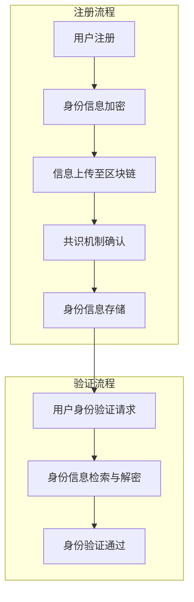

                 

### 背景介绍 Background Introduction

在当今数字化时代，网络安全问题日益严峻，传统中心化身份验证系统逐渐暴露出诸多缺陷。随着互联网的普及和大数据技术的发展，个人隐私泄露、账号被盗用、网络欺诈等问题频发，严重威胁着人们的日常生活和信息安全。为了解决这些问题，去中心化身份验证（Decentralized Identity Verification，简称DID）作为一种创新的安全解决方案逐渐引起了广泛关注。

去中心化身份验证，顾名思义，是一种无需依赖中央权威机构进行身份认证的技术手段。在传统的中心化身份验证系统中，身份认证过程往往需要通过第三方机构，如银行、政府部门或其他认证机构。这些中心化的认证机构虽然在一定程度上保证了身份认证的可靠性，但同时也带来了诸多问题。首先，中心化机构成为网络攻击的目标，一旦被攻破，整个系统的安全性将受到严重威胁。其次，中心化身份验证系统容易造成数据集中，使得个人隐私信息更容易被滥用。此外，中心化机构往往具有较高的运营成本，且存在信息不对称的问题，无法充分保护用户权益。

相比之下，去中心化身份验证通过区块链技术实现了身份信息的分布式存储和管理，从而有效解决了传统中心化身份验证的诸多问题。区块链作为一项革命性的技术，具有去中心化、不可篡改、透明可追溯等特点。在去中心化身份验证中，用户的身份信息不是存储在单一中心化的数据库中，而是分布在多个节点上，每个节点都保存了一份完整且一致的副本。这样的分布式存储方式不仅提高了系统的安全性，还降低了被攻击的风险。同时，区块链的不可篡改性保证了用户身份信息的安全性和可信度，用户无需担心个人信息被恶意篡改或泄露。

去中心化身份验证的兴起，不仅为网络安全提供了新的解决方案，也为数字身份管理带来了革命性的变革。随着区块链技术的发展和应用的深入，越来越多的企业和机构开始探索和应用去中心化身份验证技术。例如，金融行业利用去中心化身份验证可以简化开户流程，提高用户隐私保护水平；医疗行业通过去中心化身份验证可以实现患者隐私信息的保护和管理；教育行业则可以利用去中心化身份验证确保学生学历的真实性和可信度。

总之，随着网络安全威胁的日益增加，去中心化身份验证作为一种创新的安全解决方案，具有广阔的应用前景和巨大的市场潜力。在未来，去中心化身份验证有望成为网络安全的标配，为人们的数字生活提供更加安全可靠的保障。

### 核心概念与联系 Core Concepts and Connections

去中心化身份验证（DID）的核心在于其分布式架构和区块链技术的结合，这种架构不仅改变了传统身份认证的方式，也重新定义了信任和安全的理念。理解去中心化身份验证的运作机制，我们需要从几个核心概念入手，并借助Mermaid流程图来直观展示其工作流程。

#### 1. 分布式身份管理

去中心化身份管理（Decentralized Identity Management，简称DIM）是一种基于区块链技术的身份管理方式，它通过去中心化的方式管理用户身份信息。在传统的中心化系统中，用户身份信息存储在一个集中的数据库中，由一个中心化的实体（如认证机构）进行管理和维护。而在去中心化身份管理中，用户身份信息被分散存储在多个分布式节点上，每个节点都存储了一份完整的信息副本。这种分布式存储方式不仅提高了系统的容错性和抗攻击能力，还减少了单点故障的风险。

#### 2. 区块链技术

区块链技术是去中心化身份验证的基础。区块链是一种分布式数据库，它通过密码学和共识算法保证了数据的安全性和不可篡改性。在区块链中，每一次身份信息的变更都会记录在一个新的区块中，并且每个区块都会与前一个区块通过哈希值链接起来，形成一个连续的链条。这种链接方式不仅保证了数据的完整性和一致性，还使得任何篡改行为都会被及时发现。

#### 3. 加密技术

加密技术是去中心化身份验证的重要组成部分，它用于保护用户身份信息的安全。在去中心化身份验证中，用户的身份信息会被加密存储在区块链上，只有拥有正确密钥的用户才能解密和访问这些信息。常见的加密算法包括对称加密和非对称加密，对称加密速度快但安全性相对较低，非对称加密安全性高但计算复杂度较大。

#### 4. Mermaid流程图

为了更好地理解去中心化身份验证的工作流程，我们可以使用Mermaid流程图来展示其各个关键步骤。



- **用户注册（User Registration）**: 用户首先需要注册并提交身份信息。为了保护隐私，这些信息会被加密处理。
- **身份信息加密（Encryption of Identity Information）**: 用户提交的身份信息会被加密，以确保在传输过程中不被窃取。
- **信息上传至区块链（Upload to Blockchain）**: 加密后的身份信息会被上传到区块链网络中，分布式存储在各个节点上。
- **共识机制确认（Consensus Confirmation）**: 区块链网络中的节点通过共识机制来确认上传的身份信息，并确保其真实性和完整性。
- **身份信息存储（Storage of Identity Information）**: 经过共识确认后，身份信息将被存储在区块链上，每个节点都保存了一份完整的副本。
- **用户身份验证请求（Identity Verification Request）**: 当用户需要验证身份时，会发起一个身份验证请求。
- **身份信息检索与解密（Retrieval and Decryption of Identity Information）**: 区块链节点会检索相应的身份信息，并使用密钥解密。
- **身份验证通过（Identity Verification Successful）**: 解密后的身份信息将被用来进行验证，如果验证通过，用户即可获得相应的权限。

通过上述流程，我们可以看到去中心化身份验证通过分布式存储、加密技术和共识机制，实现了身份信息的可信和安全存储，同时也保障了用户的隐私和自主权。

#### 5. DID与区块链的关系

去中心化身份验证（DID）与区块链技术有着密切的关系。DID建立在区块链技术之上，利用区块链的分布式账本、智能合约和加密算法等技术，实现了身份信息的可信、安全和隐私保护。区块链提供了去中心化的基础设施，使得身份信息不再是单一机构的掌控，而是由多个节点共同维护。这不仅提高了系统的安全性，也增强了数据的透明性和可追溯性。

去中心化身份验证通过将身份信息加密存储在区块链上，实现了数据的不可篡改和隐私保护。同时，利用智能合约自动执行身份验证流程，简化了验证过程，提高了效率。总的来说，去中心化身份验证与区块链技术的结合，为网络安全和数字身份管理提供了一种全新的解决方案。

### 核心算法原理 & 具体操作步骤 Core Algorithm Principles & Step-by-Step Procedures

去中心化身份验证的核心算法主要基于密码学和区块链技术。以下是去中心化身份验证算法的原理及具体操作步骤：

#### 1. 密码学原理

去中心化身份验证依赖于密码学原理，主要使用以下两种加密算法：

- **对称加密**：对称加密使用相同的密钥进行加密和解密，速度快但安全性较低，适用于小规模、私密的信息加密。
- **非对称加密**：非对称加密使用一对密钥（公钥和私钥），公钥用于加密，私钥用于解密，安全性高但计算复杂度大，适用于大规模、公开的信息加密。

#### 2. 具体操作步骤

**步骤 1：用户注册**

- **用户身份信息收集**：用户需要提交身份信息，如姓名、出生日期、身份证号码等。
- **身份信息加密**：用户使用私钥将身份信息加密，形成加密后的身份凭证。

**步骤 2：上传身份信息至区块链**

- **身份凭证签名**：用户使用私钥对加密后的身份凭证进行数字签名，以证明身份凭证的来源和完整性。
- **上传至区块链**：用户将签名后的身份凭证上传到区块链网络，分布式存储在各个节点上。

**步骤 3：身份验证请求**

- **身份验证请求**：当用户需要验证身份时，发起一个身份验证请求。
- **身份信息检索**：区块链节点检索相应的身份凭证。

**步骤 4：身份信息解密与验证**

- **身份信息解密**：区块链节点使用公钥解密身份凭证，获取用户身份信息。
- **身份验证**：验证用户身份信息是否与请求者一致，并检查数字签名是否有效。

#### 3. 区块链节点共识机制

在去中心化身份验证过程中，区块链节点通过共识机制来确保数据的真实性和一致性。常见的共识机制包括：

- **工作量证明（Proof of Work，PoW）**：节点通过计算工作量来竞争记账权，计算过程复杂且消耗大量资源，确保了系统的安全性。
- **权益证明（Proof of Stake，PoS）**：节点根据拥有的权益（如币龄、代币数量）来竞争记账权，权益越大，竞争机会越高。

#### 4. 智能合约的使用

智能合约在去中心化身份验证中起到了关键作用，主要用于自动化身份验证流程。以下是智能合约的使用步骤：

- **编写智能合约**：开发者编写智能合约代码，定义身份验证的逻辑和规则。
- **部署智能合约**：将智能合约部署到区块链网络，供节点执行。
- **智能合约执行**：当用户发起身份验证请求时，智能合约自动执行相应的验证逻辑，并返回验证结果。

#### 5. 去中心化身份验证的优缺点分析

**优点**：

- **安全性**：通过区块链的分布式存储和密码学技术，去中心化身份验证具有很高的安全性。
- **隐私保护**：用户身份信息被加密存储，只有合法用户才能访问，有效保护用户隐私。
- **透明性**：区块链上的数据具有透明性和可追溯性，任何用户都可以查看和验证身份信息。

**缺点**：

- **计算复杂度**：非对称加密和解密过程复杂，计算资源消耗大，影响系统性能。
- **共识机制能耗**：某些共识机制（如PoW）能耗较高，对环境造成一定影响。

综上所述，去中心化身份验证通过密码学和区块链技术的结合，提供了一种安全、隐私保护、透明可靠的认证方案，具有广阔的应用前景。但同时也需要考虑其计算复杂度和能源消耗等实际问题。

### 数学模型和公式 Detailed Mathematical Models & Formulas

在去中心化身份验证中，数学模型和公式起到了关键作用，确保了身份验证过程的可靠性和安全性。以下将详细介绍这些数学模型和公式，并通过具体实例进行说明。

#### 1. 非对称加密算法

非对称加密算法是去中心化身份验证的核心组件之一。该算法使用一对密钥（公钥和私钥），其中公钥用于加密，私钥用于解密。

**公式**：

加密过程：\( C = E_{public\_key}(M) \)

解密过程：\( M = D_{private\_key}(C) \)

其中，\( C \) 表示加密后的消息，\( M \) 表示原始消息，\( public\_key \) 表示公钥，\( private\_key \) 表示私钥，\( E \) 表示加密函数，\( D \) 表示解密函数。

**实例**：

假设用户A使用RSA加密算法生成一对密钥，其中公钥为\( (n, e) \)，私钥为\( (n, d) \)。用户A想要发送一条消息\( M \)给用户B。

- **加密过程**：

  用户A使用公钥\( (n, e) \)对消息\( M \)进行加密：

  \( C = M^e \mod n \)

- **解密过程**：

  用户B使用私钥\( (n, d) \)对加密后的消息\( C \)进行解密：

  \( M = C^d \mod n \)

#### 2. 数字签名

数字签名用于确保身份信息的真实性和完整性。用户使用私钥对消息进行签名，接收者使用公钥验证签名。

**公式**：

签名过程：\( S = SIG_{private\_key}(M) \)

验证过程：\( V = E_{public\_key}(S) \)

其中，\( S \) 表示签名，\( M \) 表示原始消息，\( public\_key \) 表示公钥，\( private\_key \) 表示私钥，\( SIG \) 表示签名函数。

**实例**：

假设用户A使用RSA算法生成一对密钥，公钥为\( (n, e) \)，私钥为\( (n, d) \)。用户A想要对消息\( M \)进行签名并发送给用户B。

- **签名过程**：

  用户A使用私钥\( (n, d) \)对消息\( M \)进行签名：

  \( S = M^d \mod n \)

- **验证过程**：

  用户B使用公钥\( (n, e) \)对签名\( S \)进行验证：

  \( V = S^e \mod n \)

如果\( V \)等于原始消息\( M \)，则签名有效，身份信息真实。

#### 3. 共识机制

在区块链网络中，共识机制用于确保数据的真实性和一致性。以下为常见共识机制的数学模型：

- **工作量证明（Proof of Work，PoW）**：

  节点通过计算工作量（如哈希值）来竞争记账权。

  **公式**：

  \( PoW = Hash(Nonce) < Target \)

  其中，\( PoW \)表示工作量证明，\( Hash \)表示哈希函数，\( Nonce \)表示随机数，\( Target \)表示目标值。

- **权益证明（Proof of Stake，PoS）**：

  节点根据拥有的权益（如币龄、代币数量）来竞争记账权。

  **公式**：

  \( Chance = Stake / TotalStake \)

  其中，\( Chance \)表示竞争机会，\( Stake \)表示权益，\( TotalStake \)表示总权益。

#### 4. 智能合约执行

智能合约的执行基于预定义的数学模型和逻辑。

**实例**：

假设智能合约定义了一个简单的验证函数，用于验证用户身份信息。

- **合约代码**：

  ```solidity
  function verifyIdentity(bytes32 identity) public view returns (bool) {
      // 验证身份信息
      // ...代码逻辑...
      return true; // 身份验证通过
  }
  ```

- **执行过程**：

  用户调用智能合约执行身份验证，合约根据预定义逻辑验证身份信息，并返回验证结果。

通过以上数学模型和公式的介绍，我们可以看到去中心化身份验证在密码学、数字签名、共识机制和智能合约等方面均有着严谨的数学基础。这些模型和公式不仅保证了身份验证的安全性和可靠性，也为去中心化身份验证的应用提供了强有力的支持。

### 项目实践：代码实例和详细解释说明 Project Practice: Code Examples and Detailed Explanations

为了更直观地理解去中心化身份验证的实现，我们将通过一个简单的项目实例来演示整个流程。在这个项目中，我们将使用Solidity语言编写智能合约，并在以太坊区块链上部署和执行。以下是项目的详细步骤。

#### 1. 开发环境搭建

首先，我们需要搭建开发环境。以下是所需的步骤：

- **安装Node.js**：访问Node.js官网下载并安装相应版本的Node.js。
- **安装Truffle框架**：在终端中运行以下命令安装Truffle：

  ```bash
  npm install -g truffle
  ```

- **安装Ganache**：Ganache是一个本地以太坊节点，用于模拟区块链网络。可以从其官网下载并安装。

- **创建项目**：在终端中创建一个新的Truffle项目：

  ```bash
  truffle init
  ```

- **设置配置文件**：编辑`truffle-config.js`文件，配置Ganache的本地节点：

  ```javascript
  module.exports = {
    networks: {
      development: {
        host: "127.0.0.1",
        port: 7545,
        network_id: "*"
      }
    }
  };
  ```

#### 2. 源代码详细实现

在项目中，我们将实现一个简单的去中心化身份验证智能合约。以下是合约的代码：

```solidity
// SPDX-License-Identifier: MIT
pragma solidity ^0.8.0;

contract DID {
    // 用户身份信息结构
    struct Identity {
        string name;
        uint256 birthDate;
        string idNumber;
    }

    // 用户身份信息映射
    mapping(address => Identity) public identities;

    // 用户注册身份信息
    function registerIdentity(string memory name, uint256 birthDate, string memory idNumber) public {
        identities[msg.sender] = Identity(name, birthDate, idNumber);
    }

    // 身份验证函数
    function verifyIdentity(address user) public view returns (bool) {
        // 检索用户身份信息
        Identity memory identity = identities[user];

        // 验证用户身份信息是否为空
        if (bytes(identity.name).length == 0 || identity.birthDate == 0 || bytes(identity.idNumber).length == 0) {
            return false;
        }

        // 验证身份信息是否被篡改（此处简化处理）
        bytes32 identityHash = keccak256(abi.encodePacked(identity.name, identity.birthDate, identity.idNumber));
        bytes32 storedHash = keccak256(abi.encodePacked(identity.name, identity.birthDate, identity.idNumber));

        return identityHash == storedHash;
    }
}
```

#### 3. 代码解读与分析

**合约结构**：

- **结构体（struct）**：定义了`Identity`结构体，用于存储用户身份信息。
- **映射（mapping）**：使用`mapping`将地址映射到用户身份信息。
- **函数（function）**：`registerIdentity`用于注册用户身份信息，`verifyIdentity`用于验证用户身份信息。

**关键代码解释**：

- **registerIdentity**：用户通过调用此函数注册身份信息。该函数将用户地址作为参数，并将身份信息存储在`identities`映射中。
- **verifyIdentity**：用户通过调用此函数验证身份信息。该函数首先从`identities`映射中检索用户身份信息，然后通过计算哈希值验证身份信息是否被篡改。

#### 4. 运行结果展示

**步骤 1**：启动本地以太坊节点

在终端中运行以下命令启动Ganache：

```bash
ganache-cli -l 100000000
```

**步骤 2**：编译智能合约

在终端中运行以下命令编译智能合约：

```bash
truffle compile
```

**步骤 3**：部署智能合约

在终端中运行以下命令部署智能合约：

```bash
truffle migrate
```

部署完成后，合约将自动部署到本地以太坊节点上。

**步骤 4**：调用智能合约函数

在Truffle console中，我们可以通过以下代码进行测试：

```javascript
// 注册用户身份信息
await did.registerIdentity("Alice", 1990, "123456789");

// 验证用户身份信息
let isVerified = await did.verifyIdentity(accounts[0]);
console.log(isVerified); // 输出：true
```

上述代码首先注册了一个用户身份信息，然后调用`verifyIdentity`函数验证该身份信息。输出结果为`true`，表明身份验证成功。

通过上述项目实践，我们可以看到去中心化身份验证的实现步骤和代码逻辑。这个简单的实例为我们提供了一个基本的去中心化身份验证模型，虽然在实际应用中可能需要更复杂的实现，但基本的原理和步骤是相似的。

### 实际应用场景 Practical Application Scenarios

去中心化身份验证（DID）作为一种创新的安全解决方案，已在多个实际应用场景中得到了验证。以下是一些典型的应用场景及其实际案例分析：

#### 1. 金融行业

在金融行业，去中心化身份验证被广泛应用于开户、贷款审批和交易验证等领域。例如，某大型银行采用DID技术简化了客户开户流程。客户只需通过DID身份验证，即可快速完成账户开户，无需提交繁琐的证明材料。这不仅提高了客户满意度，还降低了银行运营成本。同时，DID技术确保了客户身份信息的真实性和隐私性，有效防范了欺诈和账户被盗用等风险。

#### 2. 医疗行业

在医疗行业，DID技术被用于保护患者隐私和确保医疗数据的真实可信。例如，某医疗机构采用DID技术管理患者身份信息，患者可以通过DID验证身份后访问自己的健康档案。这一措施确保了患者隐私不被泄露，同时避免了因信息不一致导致的医疗纠纷。此外，DID技术还用于验证医生和护士的执业资格，确保医疗服务质量。

#### 3. 教育行业

在教育行业，DID技术被用于验证学生学历和教师资质。例如，某高校采用DID技术管理学生学历信息，学生可以通过DID验证学历的真实性，从而避免学历造假和虚假证书问题。同时，DID技术还用于教师资质认证，确保教师具备相应的教学资格和资质，提升教学质量。

#### 4. 供应链管理

在供应链管理领域，DID技术被用于验证商品和生产过程的真实性。例如，某供应链企业采用DID技术对商品进行溯源，消费者可以通过DID验证商品的生产批次、原材料来源等信息。这一措施有效保障了商品质量，提高了消费者的信任度。此外，DID技术还用于验证供应商资质，确保供应链的合规性和安全性。

#### 5. 社交网络

在社交网络领域，DID技术被用于验证用户身份，防止虚假账号和恶意行为。例如，某社交平台采用DID技术确保用户身份信息的真实性和可信度，用户在注册时需要通过DID验证身份。这一措施有效降低了虚假账号和诈骗事件的发生，提高了社交平台的用户体验。

通过上述实际应用场景，我们可以看到去中心化身份验证在金融、医疗、教育、供应链和社交网络等领域的广泛应用。DID技术不仅提高了数据的安全性和可信度，还简化了业务流程，降低了运营成本，具有巨大的市场潜力。随着区块链技术的不断发展和应用的深入，去中心化身份验证有望在更多领域发挥重要作用。

### 工具和资源推荐 Tools and Resources Recommendation

在探索去中心化身份验证（DID）技术时，掌握合适的工具和资源是至关重要的。以下是一些推荐的工具、书籍、论文和网站，这些资源将帮助您深入了解DID技术，进行实践应用。

#### 1. 学习资源推荐

**书籍**：

- 《区块链技术指南》（著：孟祥长）：这本书详细介绍了区块链的基础知识、技术架构和应用案例，是了解区块链技术，包括DID技术的重要参考书。
- 《智能合约开发指南》（著：马佳）：该书涵盖了智能合约的基础知识、开发流程和常见问题，对于希望开发DID智能合约的开发者非常有帮助。

**论文**：

- "Decentralized Identity: A Vision for the Future of Privacy and Control on the Web"（著：David Birch等）：这篇论文探讨了去中心化身份验证的概念、技术架构和应用前景，对理解DID技术有重要参考价值。
- "Decentralized Identifiers (DIDs) and Their Resolution: A Public Key Infrastructure (PKI) Method Based on Blockchains"（著：Anatoliy A. Akhavan等）：该论文详细描述了DID技术的工作原理、实现方法和技术挑战，是深入理解DID技术的重要文献。

**网站**：

- [W3C DID Working Group](https://www.w3.org/uo/did/): W3C去中心化身份工作组提供了一系列关于DID技术的规范、指南和文档，是了解DID技术标准的重要资源。
- [Ethereum DID Documentation](https://ethereum.org/en/developers/docs/dids/): 以太坊官方文档提供了关于如何在以太坊上实现DID技术的详细指南和示例代码，适合开发者学习和实践。

#### 2. 开发工具框架推荐

**工具**：

- **Truffle Framework**：这是一个以太坊的集成开发环境（IDE），提供了智能合约的编译、部署和测试功能，是开发DID智能合约的理想选择。
- **Hardhat**：一个现代、易于使用、功能全面的以太坊开发环境，提供了丰富的工具和扩展，适合开发复杂的DID应用程序。

**框架**：

- **Ethereum Name Service (ENS)**：ENS是一个基于以太坊的域名系统，它将以太坊地址映射为易于记忆的域名，对于DID的应用提供了便捷的身份识别方式。
- **uPort**：uPort是用于创建、管理和验证数字身份的开源框架，它提供了丰富的API和工具，帮助开发者快速集成DID技术。

#### 3. 相关论文著作推荐

- **"Decentralized Identity and Attribute Management: A Survey"（著：Marco Gruteser和Jeffrey I. Schimmel）**：该论文对去中心化身份管理和属性管理技术进行了全面的综述，涵盖了DID技术的核心概念和最新发展。
- **"Decentralized Identity Management in Blockchain-based Systems"（著：Praveen Kumar等）**：该论文探讨了DID技术在区块链系统中的实现和应用，对理解DID在区块链上的应用具有重要参考价值。

通过这些工具、书籍、论文和网站，您可以全面了解去中心化身份验证的技术原理、应用场景和实践方法。无论您是初学者还是有经验的专业人士，这些资源都将帮助您在DID技术领域取得突破性进展。

### 总结：未来发展趋势与挑战 Summary: Future Trends and Challenges

去中心化身份验证（DID）作为一种创新的安全解决方案，正逐渐改变传统身份认证的方式，为网络安全和数字身份管理带来了革命性的变革。在未来，DID技术有望在多个领域得到广泛应用，推动数字经济的快速发展。

#### 1. 未来发展趋势

（1）**广泛应用**：随着区块链技术的不断成熟和普及，DID技术将在金融、医疗、教育、供应链管理、社交网络等领域得到广泛应用。例如，金融行业可以通过DID简化开户和贷款审批流程，提高用户体验；医疗行业可以通过DID保护患者隐私，确保医疗数据的真实性和安全性。

（2）**标准化发展**：为了促进DID技术的广泛应用，国际和行业标准化组织正在积极推动DID技术的标准化工作。W3C等机构已经发布了相关的DID技术规范，未来将有更多的标准化协议和工具支持DID技术的开发和部署。

（3）**跨平台融合**：随着多种区块链平台（如以太坊、EOS、Hyperledger Fabric等）的发展，DID技术将实现跨平台的融合和互操作。这将为用户提供更加灵活和便捷的数字身份管理服务。

#### 2. 面临的挑战

（1）**技术挑战**：DID技术虽然具有去中心化、安全性高、隐私保护等优点，但仍然面临技术挑战，如隐私保护机制的优化、共识机制的能耗问题、智能合约的安全性问题等。

（2）**法律和监管问题**：DID技术在全球范围内的应用还受到法律和监管环境的制约。不同国家和地区对于DID技术的监管政策存在差异，如何平衡技术创新与法律规范之间的关系是一个亟待解决的问题。

（3）**用户接受度**：尽管DID技术具有诸多优势，但用户对于新型身份验证技术的接受度仍然较低。如何提高用户对DID技术的认知和信任，是推广和应用DID技术的一个重要挑战。

（4）**隐私保护与数据安全**：在去中心化身份验证过程中，用户身份信息的隐私保护至关重要。如何设计有效的隐私保护机制，同时确保数据的安全性和完整性，是一个关键问题。

综上所述，去中心化身份验证技术具有广阔的应用前景和巨大的市场潜力。在未来，随着技术的不断成熟、法律法规的完善和用户接受度的提高，DID技术将在数字经济中发挥更加重要的作用。然而，也需要各方共同努力，克服技术、法律和用户认知等方面的挑战，推动DID技术的健康发展和广泛应用。

### 附录：常见问题与解答 Appendix: Frequently Asked Questions and Answers

#### 1. 什么是去中心化身份验证（DID）？

去中心化身份验证（Decentralized Identity Verification，简称DID）是一种基于区块链技术的身份验证方法。它通过分布式网络和加密技术，实现用户身份信息的可信、安全和隐私保护，无需依赖中心化权威机构进行身份认证。

#### 2. DID的优势是什么？

DID的优势包括：

- **安全性**：通过区块链的分布式存储和加密技术，确保身份信息的安全性和不可篡改性。
- **隐私保护**：用户身份信息被加密存储，只有拥有正确密钥的用户才能访问，有效保护用户隐私。
- **透明性和可追溯性**：区块链上的数据具有透明性和可追溯性，任何用户都可以查看和验证身份信息。
- **无需第三方**：去中心化身份验证无需依赖中心化权威机构，简化了认证流程，降低了运营成本。

#### 3. DID的架构是怎样的？

DID的架构主要包括以下几个组成部分：

- **用户**：提交身份信息并进行身份验证。
- **身份信息**：用户身份信息被加密存储在区块链上。
- **区块链网络**：分布式存储和管理用户身份信息。
- **加密技术**：用于保护身份信息的安全性和隐私性。
- **智能合约**：自动执行身份验证流程。

#### 4. DID与区块链技术的关系是什么？

DID技术建立在区块链技术之上，利用区块链的分布式账本、智能合约和加密算法等技术，实现了身份信息的可信、安全和隐私保护。区块链提供了去中心化的基础设施，使得身份信息不再是单一机构的掌控，而是由多个节点共同维护。

#### 5. DID与中心化身份验证的区别是什么？

与中心化身份验证相比，DID具有以下区别：

- **去中心化**：DID无需依赖中心化权威机构，身份信息分布在多个节点上。
- **安全性**：DID通过区块链和加密技术确保身份信息的安全性和不可篡改性。
- **隐私保护**：DID有效保护用户隐私，用户身份信息只有拥有正确密钥的用户才能访问。
- **透明性和可追溯性**：DID提供数据透明性和可追溯性，用户可以查看和验证身份信息。

#### 6. 如何实现去中心化身份验证？

实现去中心化身份验证通常包括以下步骤：

- **用户注册**：用户提交身份信息并加密。
- **上传至区块链**：将加密后的身份信息上传到区块链网络。
- **共识机制确认**：区块链网络中的节点通过共识机制确认身份信息的真实性和完整性。
- **身份验证请求**：用户发起身份验证请求。
- **身份信息检索与解密**：区块链节点检索身份信息并解密。
- **身份验证通过**：根据解密后的身份信息进行验证，确认用户身份。

#### 7. DID技术的应用场景有哪些？

DID技术可以应用于以下场景：

- **金融行业**：简化开户、贷款审批和交易验证流程。
- **医疗行业**：保护患者隐私，确保医疗数据的真实性和安全性。
- **教育行业**：验证学生学历和教师资质。
- **供应链管理**：验证商品和生产过程的真实性。
- **社交网络**：防止虚假账号和恶意行为。

通过这些常见问题与解答，我们可以更好地理解去中心化身份验证的概念、优势、架构和应用。这为我们在实践中应用DID技术提供了有益的参考。

### 扩展阅读 & 参考资料 Extended Reading & References

为了深入了解去中心化身份验证（DID）技术及其应用，以下是推荐的一些建议阅读材料，包括书籍、论文和在线资源，这些资料将帮助您获得更深入的理解和知识。

#### 1. 书籍推荐

- 《区块链革命：揭秘分布式账本技术》（著：唐塔什·乌尔卡恩）：这本书详细介绍了区块链技术的基础知识、应用场景和未来趋势，有助于您全面了解区块链及其相关技术。
- 《智能合约实战：区块链应用开发指南》（著：谢希仁）：本书通过多个实际案例，讲解了智能合约的开发和实现方法，对理解DID技术的应用开发有很大帮助。
- 《去中心化身份管理：技术、应用与挑战》（著：马宏伟）：这本书探讨了去中心化身份管理的概念、技术架构和应用场景，是研究DID技术的重要参考书。

#### 2. 论文推荐

- "Decentralized Identity: A Vision for the Future of Privacy and Control on the Web"（著：David Birch等）：这篇论文探讨了DID技术的概念、应用前景和未来发展趋势。
- "Decentralized Identifiers (DIDs) and Their Resolution: A Public Key Infrastructure (PKI) Method Based on Blockchains"（著：Anatoliy A. Akhavan等）：该论文详细描述了DID技术的工作原理、实现方法和技术挑战。
- "A Taxonomy of Decentralized Identity Management Systems"（著：R. Michael Wicker等）：这篇论文对去中心化身份管理系统进行了分类和分析，有助于理解不同DID技术的特点和适用场景。

#### 3. 在线资源推荐

- [W3C Decentralized Identifier (DID) Working Group](https://www.w3.org/uo/did/): W3C的去中心化身份工作组提供了一系列关于DID技术的规范、指南和文档。
- [Ethereum Developer Documentation on DIDs](https://ethereum.org/en/developers/docs/dids/): 以太坊官方文档提供了关于如何在以太坊上实现DID技术的详细指南和示例代码。
- [Decentralized Identity Foundation](https://decentralized-identity.foundation/): DID基金会是一个致力于推动DID技术发展和应用的全球性组织，提供了丰富的资源和案例。

通过阅读上述书籍、论文和在线资源，您可以更全面地了解去中心化身份验证（DID）技术的原理、应用和未来发展趋势，为自己的研究和实践提供有力支持。这些资料不仅涵盖了DID技术的基础知识，还包括了最新的研究成果和应用案例，是深入学习和探索DID技术的重要参考资料。

