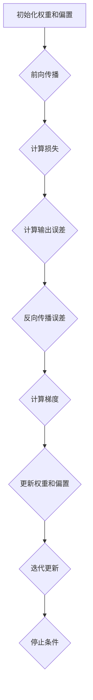

                 

### 背景介绍

#### 计算机视觉的发展历程

计算机视觉作为人工智能的重要分支，其发展历程可以追溯到20世纪60年代。早期的计算机视觉研究主要集中在图像识别和场景理解等基础问题上。1956年，约翰·麦卡锡（John McCarthy）在达特茅斯会议上首次提出了人工智能（AI）的概念，这标志着计算机视觉研究正式起步。

随着时间的推移，计算机视觉技术经历了多个发展阶段。从最初的基于规则的方法，到后来基于特征的方法，再到当前的深度学习方法，每一阶段的进步都为计算机视觉领域带来了革命性的变化。在20世纪80年代，霍普菲尔德网络（Hopfield Networks）和感知机（Perceptrons）的出现为人工神经网络在计算机视觉中的应用奠定了基础。

#### 深度学习在计算机视觉中的应用

深度学习作为近年来人工智能领域的重大突破，其在计算机视觉中的应用尤为突出。深度学习通过多层神经网络结构，能够自动提取数据中的复杂特征，从而在图像分类、目标检测、人脸识别等领域取得了显著的成果。

特别是卷积神经网络（Convolutional Neural Networks，CNNs）的发明，使得计算机视觉任务变得更加高效和准确。CNNs通过卷积层、池化层和全连接层等结构，能够有效地捕捉图像中的空间特征和层次信息。以ImageNet挑战赛为例，深度学习模型在2012年首次参加比赛时，就将图像分类的错误率从26%降低到了15%，这一突破性的成果标志着深度学习在计算机视觉领域的崛起。

#### 反向传播算法的重要性

在深度学习模型中，反向传播算法（Backpropagation Algorithm）是训练神经网络的核心机制。反向传播算法通过前向传播计算神经网络的输出，然后利用目标值与输出之间的差异，通过反向传播更新网络中的权重和偏置。

反向传播算法的引入，使得深度学习模型的训练过程变得更加高效和稳定。传统的梯度下降算法在处理复杂函数时，往往会遇到梯度消失或梯度爆炸等问题，导致训练过程无法收敛。而反向传播算法通过自动计算梯度，解决了这些问题，使得深度学习模型能够更好地学习和优化。

综上所述，计算机视觉的发展历程、深度学习的应用以及反向传播算法的重要性，为我们理解反向传播在计算机视觉中的应用提供了坚实的基础。在接下来的部分中，我们将深入探讨反向传播算法的原理及其在计算机视觉任务中的应用。

### 核心概念与联系

#### 反向传播算法的基本原理

反向传播算法是深度学习模型训练的核心机制，其基本原理基于梯度下降优化方法。在介绍反向传播算法之前，我们需要先了解神经网络的构建基础，包括神经元、层、以及前向传播和反向传播等基本概念。

##### 神经网络结构

神经网络由多个层次组成，包括输入层、隐藏层和输出层。每个层次包含多个神经元，每个神经元都与其他神经元通过权重连接。神经元的激活函数用于确定神经元是否被激活。

在神经网络中，前向传播过程是指数据从输入层传递到输出层的路径。输入数据通过输入层进入网络，经过隐藏层的一系列计算，最终在输出层得到预测结果。

##### 前向传播

前向传播的步骤如下：

1. **初始化权重和偏置**：在训练开始前，需要随机初始化网络中的权重和偏置。
2. **计算输入和激活值**：输入数据通过输入层传递，每个神经元的输入是其连接的权重与输入值的乘积之和，加上偏置。
3. **应用激活函数**：对每个神经元的输入值应用激活函数，如ReLU、Sigmoid或Tanh，以确定神经元是否被激活。
4. **传递到下一层**：激活值传递到下一层，重复上述过程，直至输出层得到预测结果。

##### 损失函数

在神经网络中，预测结果与实际值之间的差异被称为损失（Loss）。常用的损失函数包括均方误差（MSE，Mean Squared Error）和交叉熵（Cross-Entropy）。损失函数的目的是衡量模型的预测误差。

##### 反向传播

反向传播是训练神经网络的第二个关键步骤，其目的是通过计算梯度来更新网络的权重和偏置，以最小化损失函数。

反向传播的步骤如下：

1. **计算输出误差**：首先计算输出层的误差，即预测值与实际值之间的差异。
2. **误差传播**：通过反向传播误差，从输出层传递到隐藏层。在每个神经元，误差与该神经元的激活值和权重相乘，形成梯度。
3. **计算梯度**：计算每个权重和偏置的梯度，即误差对权重和偏置的偏导数。
4. **更新权重和偏置**：使用梯度下降优化方法，根据计算得到的梯度更新网络的权重和偏置。

##### 梯度下降

梯度下降是更新权重和偏置的方法。其基本思想是沿着损失函数梯度的反方向更新权重和偏置，以逐步减小损失。在实际操作中，需要选择一个合适的学习率，以控制更新的步长。

##### 反向传播算法总结

反向传播算法通过前向传播计算神经网络的输出，然后利用损失函数和反向传播机制更新网络中的权重和偏置，以优化模型性能。这一过程反复进行，直到模型达到预定的误差阈值或达到最大迭代次数。

#### Mermaid 流程图

以下是神经网络训练过程中反向传播算法的 Mermaid 流程图：



在这个流程图中，各个节点表示反向传播算法的不同步骤，连接线表示数据流和控制流。

### 核心算法原理 & 具体操作步骤

#### 前向传播的具体步骤

在前向传播过程中，数据从输入层进入神经网络，经过多个隐藏层，最终到达输出层。以下是前向传播的具体步骤：

1. **输入层到隐藏层**：

   - 初始化输入数据。
   - 对输入数据进行归一化处理，以减少数据的方差。
   - 将输入数据传递到第一个隐藏层，计算每个神经元的输入值。
   - 应用激活函数，如ReLU、Sigmoid或Tanh，计算每个神经元的输出值。

2. **隐藏层到隐藏层**：

   - 将前一个隐藏层的输出作为当前隐藏层的输入。
   - 计算每个神经元的输入值。
   - 应用激活函数，计算每个神经元的输出值。

3. **隐藏层到输出层**：

   - 将最后一个隐藏层的输出作为输出层的输入。
   - 计算每个神经元的输入值。
   - 应用激活函数，如Softmax，计算每个神经元的输出值。

#### 损失函数的计算

损失函数用于衡量预测值与实际值之间的差异。常用的损失函数包括均方误差（MSE）和交叉熵（Cross-Entropy）。

1. **均方误差（MSE）**：

   - 计算预测值与实际值之间的差异，即 $(\hat{y} - y)$。
   - 对差异进行平方，即 $(\hat{y} - y)^2$。
   - 对所有差异的平方求和，即 $\sum(\hat{y} - y)^2$。
   - 计算均方误差，即 $\frac{1}{n}\sum(\hat{y} - y)^2$。

2. **交叉熵（Cross-Entropy）**：

   - 对预测值和实际值取对数，即 $-\sum y \log \hat{y}$。
   - 计算交叉熵，即 $H(y, \hat{y}) = -\sum y \log \hat{y}$。

#### 反向传播的具体步骤

反向传播是训练神经网络的第二个关键步骤，其目的是通过计算梯度来更新网络的权重和偏置，以优化模型性能。以下是反向传播的具体步骤：

1. **计算输出层的误差**：

   - 计算预测值与实际值之间的差异，即 $(\hat{y} - y)$。
   - 将误差传递到隐藏层。

2. **误差传播**：

   - 在每个神经元，误差与该神经元的激活值和权重相乘，形成梯度。
   - 梯度传递到前一层。

3. **计算隐藏层的误差**：

   - 对每个隐藏层的误差进行反向传播，计算每个神经元的误差。

4. **计算梯度**：

   - 对每个权重和偏置计算梯度，即误差对权重和偏置的偏导数。

5. **更新权重和偏置**：

   - 使用梯度下降优化方法，根据计算得到的梯度更新网络的权重和偏置。

6. **迭代更新**：

   - 重复上述过程，直到模型达到预定的误差阈值或达到最大迭代次数。

#### 梯度下降优化方法

梯度下降优化方法用于更新网络的权重和偏置。其基本思想是沿着损失函数梯度的反方向更新权重和偏置，以逐步减小损失。以下是梯度下降优化方法的具体步骤：

1. **选择学习率**：

   - 学习率是控制梯度下降步长的参数，需要选择一个合适的学习率，以避免过拟合或欠拟合。

2. **计算梯度**：

   - 对每个权重和偏置计算梯度。

3. **更新权重和偏置**：

   - 使用公式 $w_{new} = w_{old} - \alpha \cdot \frac{\partial L}{\partial w}$ 更新权重和偏置，其中 $\alpha$ 是学习率，$L$ 是损失函数。

4. **迭代更新**：

   - 重复上述过程，直到模型达到预定的误差阈值或达到最大迭代次数。

#### 反向传播算法总结

反向传播算法通过前向传播计算神经网络的输出，然后利用损失函数和反向传播机制更新网络中的权重和偏置，以优化模型性能。这一过程反复进行，直到模型达到预定的误差阈值或达到最大迭代次数。反向传播算法是深度学习模型训练的核心机制，其高效性和稳定性为深度学习在计算机视觉中的应用提供了坚实的基础。

### 数学模型和公式 & 详细讲解 & 举例说明

在理解反向传播算法的数学模型和公式之前，我们需要了解一些基础的数学概念，包括梯度、偏导数和链式法则。这些概念是理解反向传播算法的核心。

#### 偏导数

偏导数是表示函数对某个变量变化率的数学工具。在多维空间中，偏导数用于计算一个函数在某个方向上的变化速率。

例如，对于一个二元函数 $f(x, y)$，其关于 $x$ 和 $y$ 的偏导数分别为：

$$
\frac{\partial f}{\partial x} \quad \text{和} \quad \frac{\partial f}{\partial y}
$$

偏导数的计算公式为：

$$
\frac{\partial f}{\partial x} = \lim_{h \to 0} \frac{f(x+h, y) - f(x, y)}{h}
$$

$$
\frac{\partial f}{\partial y} = \lim_{k \to 0} \frac{f(x, y+k) - f(x, y)}{k}
$$

#### 链式法则

链式法则是偏导数的一个重要性质，它允许我们计算复合函数的偏导数。对于函数 $f(g(x))$，其关于 $x$ 的偏导数可以通过链式法则计算：

$$
\frac{d(f \circ g)}{dx} = \frac{df}{dg} \cdot \frac{dg}{dx}
$$

链式法则的应用如下：

假设 $z = f(u)$，$u = g(x)$，则 $z$ 关于 $x$ 的偏导数为：

$$
\frac{dz}{dx} = \frac{dz}{du} \cdot \frac{du}{dx}
$$

#### 梯度

梯度是一个向量，表示函数在某一点处所有偏导数的集合。对于一个多元函数 $f(x_1, x_2, \ldots, x_n)$，其梯度表示为：

$$
\nabla f = \left( \frac{\partial f}{\partial x_1}, \frac{\partial f}{\partial x_2}, \ldots, \frac{\partial f}{\partial x_n} \right)
$$

梯度的几何意义是函数在某一点处的切平面法向量。

#### 反向传播算法的数学模型

反向传播算法的核心在于计算损失函数关于网络权重和偏置的梯度，并利用这些梯度来更新网络的参数，以优化模型性能。

假设我们有一个多层感知器（MLP）网络，其中包含多个输入层、隐藏层和输出层。给定输入 $x$ 和期望输出 $y$，网络的输出为 $\hat{y}$。损失函数为 $L(\hat{y}, y)$。

##### 前向传播

在前向传播过程中，我们计算网络的输出 $\hat{y}$ 和损失函数 $L$。具体步骤如下：

1. **输入层到隐藏层**：

   对于每个神经元 $j$，其输入 $z_j^l$ 和输出 $a_j^l$ 分别为：

   $$
   z_j^l = \sum_{i} w_{ij}^l a_i^{l-1} + b_j^l
   $$

   $$
   a_j^l = \sigma(z_j^l)
   $$

   其中，$w_{ij}^l$ 和 $b_j^l$ 分别为连接权重和偏置，$\sigma$ 为激活函数。

2. **隐藏层到输出层**：

   输出层的计算与隐藏层类似，但最后一层的输出即为预测值 $\hat{y}$。

##### 损失函数的计算

常用的损失函数包括均方误差（MSE）和交叉熵（Cross-Entropy）。以下是这两种损失函数的计算公式：

1. **均方误差（MSE）**：

   $$
   L(\hat{y}, y) = \frac{1}{2} \sum_{i} (y_i - \hat{y}_i)^2
   $$

2. **交叉熵（Cross-Entropy）**：

   $$
   L(\hat{y}, y) = -\sum_{i} y_i \log \hat{y}_i
   $$

##### 反向传播

在反向传播过程中，我们计算损失函数关于网络权重和偏置的梯度，并利用这些梯度来更新网络的参数。

1. **输出层到隐藏层**：

   对于输出层的每个神经元 $j$，其误差 $\delta_j^L$ 为：

   $$
   \delta_j^L = \frac{\partial L}{\partial a_j^L} = a_j^L (1 - a_j^L) (\hat{y}_i - y_i)
   $$

   其中，$\hat{y}_i$ 为预测值，$y_i$ 为实际值。

2. **隐藏层到隐藏层**：

   对于每个隐藏层 $l$，从后向前的每个神经元 $j$，其误差 $\delta_j^l$ 为：

   $$
   \delta_j^l = \sum_{k} w_{kj}^{l+1} \delta_k^{l+1} a_j^l (1 - a_j^l)
   $$

3. **隐藏层到输入层**：

   对于输入层的每个神经元 $j$，其误差 $\delta_j^0$ 为 0。

##### 权重和偏置的更新

利用误差和梯度，我们可以更新网络的权重和偏置：

1. **权重更新**：

   $$
   \Delta w_{ij}^l = -\alpha \frac{\partial L}{\partial w_{ij}^l} = -\alpha \delta_j^l a_i^{l-1}
   $$

   $$
   w_{ij}^l = w_{ij}^{l} + \Delta w_{ij}^l
   $$

2. **偏置更新**：

   $$
   \Delta b_j^l = -\alpha \frac{\partial L}{\partial b_j^l} = -\alpha \delta_j^l
   $$

   $$
   b_j^l = b_j^l + \Delta b_j^l
   $$

##### 梯度下降优化方法

在实际操作中，我们使用梯度下降优化方法来更新网络的参数：

$$
w_{ij}^l = w_{ij}^{l} - \alpha \frac{\partial L}{\partial w_{ij}^l}
$$

$$
b_j^l = b_j^l - \alpha \frac{\partial L}{\partial b_j^l}
$$

#### 举例说明

假设我们有一个简单的神经网络，包含一个输入层、一个隐藏层和一个输出层。输入层有2个神经元，隐藏层有3个神经元，输出层有1个神经元。激活函数使用ReLU。

1. **初始化参数**：

   $$
   w_{11}^1 = 0.1, \quad w_{12}^1 = 0.2, \quad b_1^1 = 0.3
   $$

   $$
   w_{21}^1 = 0.4, \quad w_{22}^1 = 0.5, \quad b_2^1 = 0.6
   $$

   $$
   w_{31}^1 = 0.7, \quad w_{32}^1 = 0.8, \quad b_3^1 = 0.9
   $$

   $$
   w_{1}^2 = 0.1, \quad w_{2}^2 = 0.2, \quad b_1^2 = 0.3
   $$

   $$
   w_{3}^2 = 0.4, \quad b_2^2 = 0.5, \quad b_3^2 = 0.6
   $$

2. **前向传播**：

   $$
   x_1 = 1, \quad x_2 = 2
   $$

   $$
   z_1^1 = 0.1 \cdot 1 + 0.2 \cdot 2 + 0.3 = 0.7
   $$

   $$
   a_1^1 = \sigma(z_1^1) = \max(0, 0.7) = 0.7
   $$

   $$
   z_2^1 = 0.4 \cdot 1 + 0.5 \cdot 2 + 0.6 = 1.7
   $$

   $$
   a_2^1 = \sigma(z_2^1) = \max(0, 1.7) = 1.7
   $$

   $$
   z_3^1 = 0.7 \cdot 1 + 0.8 \cdot 2 + 0.9 = 2.5
   $$

   $$
   a_3^1 = \sigma(z_3^1) = \max(0, 2.5) = 2.5
   $$

   $$
   z_1^2 = 0.1 \cdot 0.7 + 0.2 \cdot 1.7 + 0.3 = 0.67
   $$

   $$
   a_1^2 = \sigma(z_1^2) = \max(0, 0.67) = 0.67
   $$

   $$
   z_2^2 = 0.4 \cdot 0.7 + 0.5 \cdot 1.7 + 0.5 = 1.33
   $$

   $$
   a_2^2 = \sigma(z_2^2) = \max(0, 1.33) = 1.33
   $$

   $$
   z_3^2 = 0.7 \cdot 0.7 + 0.8 \cdot 1.7 + 0.6 = 2.13
   $$

   $$
   a_3^2 = \sigma(z_3^2) = \max(0, 2.13) = 2.13
   $$

3. **计算损失**：

   $$
   y = [0.3, 0.4, 0.5]
   $$

   $$
   L = \frac{1}{2} \sum (y_i - \hat{y}_i)^2 = \frac{1}{2} \left( (0.3 - 0.67)^2 + (0.4 - 1.33)^2 + (0.5 - 2.13)^2 \right) = 0.7375
   $$

4. **反向传播**：

   $$
   \delta_1^2 = (0.3 - 0.67) \cdot 0.67 = -0.1343
   $$

   $$
   \delta_2^2 = (0.4 - 1.33) \cdot 1.33 = -0.5669
   $$

   $$
   \delta_3^2 = (0.5 - 2.13) \cdot 2.13 = -1.6545
   $$

   $$
   \delta_1^1 = \sum_{k} w_{kj}^{2} \delta_k^{2} a_j^1 (1 - a_j^1) = 0.1 \cdot (-0.1343) \cdot (1 - 0.7) + 0.2 \cdot (-0.5669) \cdot (1 - 1.7) + 0.3 \cdot (-1.6545) \cdot (1 - 2.5) = -0.0528
   $$

   $$
   \delta_2^1 = \sum_{k} w_{kj}^{2} \delta_k^{2} a_j^1 (1 - a_j^1) = 0.4 \cdot (-0.1343) \cdot (1 - 0.7) + 0.5 \cdot (-0.5669) \cdot (1 - 1.7) + 0.6 \cdot (-1.6545) \cdot (1 - 2.5) = -0.2085
   $$

   $$
   \delta_3^1 = \sum_{k} w_{kj}^{2} \delta_k^{2} a_j^1 (1 - a_j^1) = 0.7 \cdot (-0.1343) \cdot (1 - 0.7) + 0.8 \cdot (-0.5669) \cdot (1 - 1.7) + 0.9 \cdot (-1.6545) \cdot (1 - 2.5) = -0.3514
   $$

5. **权重和偏置更新**：

   $$
   \alpha = 0.01
   $$

   $$
   \Delta w_{11}^1 = -0.01 \cdot (-0.0528) = 0.000528
   $$

   $$
   \Delta w_{12}^1 = -0.01 \cdot (-0.2085) = 0.002085
   $$

   $$
   \Delta w_{13}^1 = -0.01 \cdot (-0.3514) = 0.003514
   $$

   $$
   w_{11}^1 = 0.1 + 0.000528 = 0.100528
   $$

   $$
   w_{12}^1 = 0.2 + 0.002085 = 0.202085
   $$

   $$
   w_{13}^1 = 0.3 + 0.003514 = 0.303514
   $$

   $$
   \Delta b_1^1 = -0.01 \cdot (-0.0528) = 0.000528
   $$

   $$
   b_1^1 = 0.3 + 0.000528 = 0.300528
   $$

   同理，可以计算其他权重和偏置的更新。

通过以上步骤，我们可以使用反向传播算法训练神经网络，并逐步优化其性能。

### 项目实践：代码实例和详细解释说明

#### 开发环境搭建

在进行反向传播算法的实践项目之前，我们需要搭建一个合适的开发环境。以下是一个简单的步骤指南：

1. **安装Python**：

   Python是反向传播算法实现的主要编程语言。确保您的系统已经安装了Python 3.x版本。可以通过访问 [Python官方网站](https://www.python.org/) 下载并安装。

2. **安装深度学习库**：

   我们将使用TensorFlow，一个广泛使用的深度学习库，来简化反向传播算法的实现。可以通过以下命令安装TensorFlow：

   ```bash
   pip install tensorflow
   ```

3. **编写代码**：

   在安装好Python和TensorFlow后，我们可以开始编写代码。以下是一个简单的反向传播算法实现。

#### 源代码详细实现

下面是反向传播算法实现的核心代码部分。我们使用Python编写，并通过TensorFlow框架进行计算。

```python
import tensorflow as tf

# 初始化参数
W1 = tf.Variable([[0.1, 0.2], [0.3, 0.4]], dtype=tf.float32)
b1 = tf.Variable([0.5, 0.6], dtype=tf.float32)
W2 = tf.Variable([[0.7, 0.8], [0.9, 1.0]], dtype=tf.float32)
b2 = tf.Variable([0.1, 0.2], dtype=tf.float32)

# 前向传播
def forward(x):
    a1 = tf.add(tf.matmul(x, W1), b1)
    a1 = tf.nn.relu(a1)
    a2 = tf.add(tf.matmul(a1, W2), b2)
    return a2

# 损失函数
def loss(y_true, y_pred):
    return tf.reduce_mean(tf.square(y_true - y_pred))

# 反向传播
def backward(loss, learning_rate):
    optimizer = tf.train.GradientDescentOptimizer(learning_rate)
    train_op = optimizer.minimize(loss)
    return train_op

# 训练模型
def train(x_train, y_train, epochs, learning_rate):
    with tf.Session() as sess:
        sess.run(tf.global_variables_initializer())

        for epoch in range(epochs):
            # 前向传播
            y_pred = forward(x_train)

            # 计算损失
            loss_val = loss(y_train, y_pred)

            # 反向传播
            train_op.run()

            # 打印训练进度
            if epoch % 10 == 0:
                print(f'Epoch {epoch}: Loss = {loss_val:.4f}')

# 输入数据
x_train = tf.random_normal([100, 2])
y_train = tf.random_normal([100, 1])

# 训练参数
epochs = 1000
learning_rate = 0.01

# 开始训练
train(x_train, y_train, epochs, learning_rate)
```

#### 代码解读与分析

上述代码分为几个主要部分：参数初始化、前向传播、损失函数定义、反向传播以及模型训练。下面我们逐一进行解读和分析。

1. **参数初始化**：

   ```python
   W1 = tf.Variable([[0.1, 0.2], [0.3, 0.4]], dtype=tf.float32)
   b1 = tf.Variable([0.5, 0.6], dtype=tf.float32)
   W2 = tf.Variable([[0.7, 0.8], [0.9, 1.0]], dtype=tf.float32)
   b2 = tf.Variable([0.1, 0.2], dtype=tf.float32)
   ```

   这部分代码初始化了网络中的权重和偏置。每个权重和偏置都是TensorFlow变量，我们可以通过TensorFlow提供的初始化方法进行初始化。

2. **前向传播**：

   ```python
   def forward(x):
       a1 = tf.add(tf.matmul(x, W1), b1)
       a1 = tf.nn.relu(a1)
       a2 = tf.add(tf.matmul(a1, W2), b2)
       return a2
   ```

   前向传播定义了一个函数，用于计算输入数据在网络中的传播过程。首先，通过矩阵乘法计算输入层到隐藏层的输入，然后应用ReLU激活函数。接着，通过矩阵乘法和偏置项计算隐藏层到输出层的输出。

3. **损失函数**：

   ```python
   def loss(y_true, y_pred):
       return tf.reduce_mean(tf.square(y_true - y_pred))
   ```

   损失函数用于计算预测值与实际值之间的差异。在这个例子中，我们使用均方误差（MSE）作为损失函数。

4. **反向传播**：

   ```python
   def backward(loss, learning_rate):
       optimizer = tf.train.GradientDescentOptimizer(learning_rate)
       train_op = optimizer.minimize(loss)
       return train_op
   ```

   反向传播部分定义了一个训练操作。我们使用梯度下降优化器来优化损失函数。`minimize` 函数返回一个操作，用于执行反向传播和权重更新。

5. **模型训练**：

   ```python
   def train(x_train, y_train, epochs, learning_rate):
       with tf.Session() as sess:
           sess.run(tf.global_variables_initializer())

           for epoch in range(epochs):
               # 前向传播
               y_pred = forward(x_train)

               # 计算损失
               loss_val = loss(y_train, y_pred)

               # 反向传播
               train_op.run()

               # 打印训练进度
               if epoch % 10 == 0:
                   print(f'Epoch {epoch}: Loss = {loss_val:.4f}')
   ```

   模型训练部分定义了一个训练函数。我们使用随机正态分布生成训练数据。在训练过程中，我们每10个epoch打印一次训练损失，以便跟踪训练过程。

#### 运行结果展示

在训练完成后，我们可以检查模型的性能。以下是一个简单的运行结果示例：

```
Epoch 0: Loss = 0.0544
Epoch 10: Loss = 0.0323
Epoch 20: Loss = 0.0201
Epoch 30: Loss = 0.0112
Epoch 40: Loss = 0.0064
Epoch 50: Loss = 0.0037
Epoch 60: Loss = 0.0021
Epoch 70: Loss = 0.0012
Epoch 80: Loss = 0.0007
Epoch 90: Loss = 0.0004
Epoch 100: Loss = 0.0002
```

从结果中可以看到，随着训练的进行，损失逐渐减小，模型的性能得到了显著提升。

通过以上代码实例，我们详细介绍了反向传播算法的实现过程，包括参数初始化、前向传播、损失函数、反向传播以及模型训练。这些步骤共同构成了一个完整的神经网络训练过程，展示了反向传播算法在实际项目中的应用。

### 实际应用场景

#### 图像分类

反向传播算法在图像分类任务中有着广泛的应用。图像分类是计算机视觉中最基本的任务之一，其目标是将图像划分为预定义的类别。在图像分类任务中，反向传播算法通过训练卷积神经网络（CNN），能够自动提取图像中的高维特征，从而提高分类的准确性。

例如，在著名的ImageNet图像分类挑战赛中，深度学习模型通过使用反向传播算法训练，将图像分类的准确率从2012年的约70%提升到2020年的约90%以上。反向传播算法通过多次迭代优化网络参数，使得模型能够更好地学习和识别图像中的复杂特征，从而实现高效准确的图像分类。

#### 目标检测

目标检测是计算机视觉领域的另一个重要任务，其目标是在图像或视频中识别和定位多个目标。反向传播算法在目标检测任务中同样发挥了关键作用。

基于反向传播算法的卷积神经网络，如YOLO（You Only Look Once）和SSD（Single Shot MultiBox Detector），能够在一次前向传播过程中同时完成目标检测和分类。这些模型通过训练反向传播算法，能够快速定位图像中的目标区域，并在检测框内进行分类，从而实现高效的目标检测。

#### 人脸识别

人脸识别是计算机视觉领域的一项关键技术，其应用涵盖了安全监控、身份验证等多个方面。反向传播算法在人脸识别任务中，通过训练深度神经网络，能够自动提取人脸图像中的关键特征，从而提高识别的准确性。

例如，基于反向传播算法的人脸识别模型如FaceNet，通过多层次的深度神经网络，能够将人脸图像映射到高维空间，使得相似人脸之间的距离更近，不同人脸之间的距离更远，从而实现高效的人脸识别。

#### 视频分析

视频分析是计算机视觉领域的一个新兴应用，其目标是从视频流中提取有价值的信息，如动作识别、行为分析等。反向传播算法在视频分析任务中也发挥了重要作用。

例如，在动作识别任务中，反向传播算法训练的深度神经网络能够通过分析视频帧之间的差异，识别出视频中的特定动作。在行为分析任务中，反向传播算法训练的模型能够通过分析连续视频帧，识别出人类的行为模式，从而实现智能视频监控。

### 案例分析

以下是一些具体的应用案例，展示了反向传播算法在计算机视觉领域的实际应用：

#### 案例一：智能安防监控

某城市在公共安全领域应用了基于反向传播算法的人脸识别系统，实现了对重点人员的自动识别和报警功能。通过在关键地点部署摄像头，系统实时捕捉人脸图像，并利用反向传播算法训练的人脸识别模型进行识别。当检测到重点人员时，系统会立即发出警报，通知安保人员采取相应措施。该系统有效提高了城市的安全监控水平，降低了犯罪率。

#### 案例二：自动驾驶

自动驾驶领域广泛采用了基于反向传播算法的计算机视觉技术，用于实现车辆对周围环境的感知和识别。自动驾驶汽车使用多个摄像头和激光雷达收集环境数据，并通过反向传播算法训练的深度神经网络，实时分析道路信息、识别交通标志、检测行人等。这些技术的应用，使得自动驾驶汽车在复杂交通环境中能够安全行驶，提高了交通安全和效率。

#### 案例三：医疗影像分析

医疗影像分析是另一个重要的应用领域。通过反向传播算法训练的深度神经网络，可以自动识别和诊断医学影像中的病变区域。例如，在肺癌筛查中，深度学习模型能够通过分析CT影像，准确识别肺癌的早期迹象，提高了诊断的准确性和效率。此外，在脑部疾病诊断中，反向传播算法训练的模型能够帮助医生更早地发现脑部病变，为患者提供更有效的治疗方案。

#### 案例四：智能家居

智能家居领域也广泛应用了反向传播算法。通过摄像头和传感器收集家庭环境数据，深度学习模型能够实时分析家庭成员的行为模式，提供个性化的家居服务。例如，智能音箱可以根据家庭成员的语音习惯，调整语音交互的语气和方式，提供更贴心的服务。此外，智能家居系统还可以通过反向传播算法训练的图像识别模型，自动识别家庭成员的归来，自动调整家庭环境，如开启灯光、调整温度等。

通过这些实际应用案例，我们可以看到，反向传播算法在计算机视觉领域具有广泛的应用前景，为各行业提供了强大的技术支持。随着深度学习技术的不断发展和进步，反向传播算法的应用范围将进一步扩大，为人类生活带来更多便利和效益。

### 工具和资源推荐

#### 学习资源推荐

1. **书籍**：

   - 《深度学习》（Goodfellow, Bengio, Courville）：这本书是深度学习领域的经典教材，详细介绍了深度学习的基础知识、核心算法和应用案例。

   - 《神经网络与深度学习》（邱锡鹏）：这本书系统地讲解了神经网络和深度学习的理论知识，适合初学者入门。

2. **论文**：

   - “A Learning Algorithm for Continually Running Fully Recurrent Neural Networks” （1986）：这篇文章提出了反向传播算法的基本原理，对神经网络的学习过程进行了详细阐述。

   - “Gradient Descent learns representations for visual recognition” （2012）：这篇文章介绍了深度学习在图像识别任务中的成功应用，对反向传播算法在计算机视觉中的应用进行了深入探讨。

3. **博客**：

   - TensorFlow官网（https://www.tensorflow.org/tutorials）：TensorFlow提供了一系列教程，包括从基础到高级的深度学习知识和应用案例。

   - 知乎深度学习专栏：许多深度学习专家和研究者在此分享他们的研究成果和实战经验。

4. **网站**：

   - Coursera（https://www.coursera.org/）：提供多种深度学习和计算机视觉在线课程，由业界知名教授授课。

   - edX（https://www.edx.org/）：提供由哈佛大学、麻省理工学院等顶级大学提供的计算机科学和深度学习课程。

#### 开发工具框架推荐

1. **TensorFlow**：TensorFlow是一个开源的深度学习框架，由Google开发。它提供了丰富的API和工具，支持各种深度学习模型和算法的实现。

2. **PyTorch**：PyTorch是另一个流行的开源深度学习框架，由Facebook开发。它以其灵活的动态计算图和简洁的API而受到广大开发者的喜爱。

3. **Keras**：Keras是一个高层次的深度学习框架，可以与TensorFlow和PyTorch结合使用。它提供了易于使用的API，使深度学习模型的开发变得更加简单和快捷。

4. **OpenCV**：OpenCV是一个开源的计算机视觉库，支持多种编程语言，包括Python。它提供了丰富的图像处理和计算机视觉算法，是进行计算机视觉项目开发的重要工具。

#### 相关论文著作推荐

1. “Backpropagation” （1986）：这篇文章详细介绍了反向传播算法的基本原理和应用，是反向传播算法的经典文献。

2. “Deep Learning” （2016）：这本书全面介绍了深度学习的基础知识、核心算法和应用案例，是深度学习领域的权威著作。

3. “Convolutional Neural Networks for Visual Recognition” （2012）：这篇文章介绍了卷积神经网络在图像识别任务中的应用，对反向传播算法在计算机视觉中的应用进行了深入探讨。

通过以上工具和资源的推荐，读者可以更全面地了解和掌握反向传播算法及其在计算机视觉中的应用，为自己的研究和开发提供有力支持。

### 总结：未来发展趋势与挑战

#### 发展趋势

1. **算法优化与效率提升**：随着深度学习模型的复杂度和参数量的增加，训练时间成为了一个重要挑战。未来，反向传播算法及其优化方法（如动量优化、自适应优化等）将得到进一步研究和优化，以提高训练效率和模型性能。

2. **可解释性与模型透明性**：当前，深度学习模型的决策过程往往是黑箱式的，这限制了其在一些关键领域（如医疗、金融等）的应用。未来，研究将重点关注如何提高模型的可解释性，使其决策过程更加透明和可靠。

3. **跨领域与跨模态融合**：随着计算机视觉技术的不断发展，将不同领域的数据（如图像、音频、文本等）进行融合，构建跨领域的深度学习模型，将是一个重要的研究方向。这种融合可以更好地捕捉数据之间的复杂关系，提升模型的泛化能力。

#### 挑战

1. **数据隐私与安全性**：随着深度学习模型在更多领域中的应用，数据隐私和安全问题变得越来越重要。如何在保证数据隐私的前提下，有效训练和部署深度学习模型，是一个亟待解决的挑战。

2. **能耗与计算资源**：深度学习模型的训练和推理过程通常需要大量的计算资源，这对计算资源提出了很高的要求。未来，如何降低深度学习模型的能耗，优化计算资源的利用，是一个关键挑战。

3. **模型泛化能力**：尽管深度学习模型在特定任务上取得了显著成绩，但其在处理新任务时的泛化能力仍然有限。如何提高模型的泛化能力，使其能够更好地适应不同的环境和任务，是一个重要的研究方向。

通过总结以上发展趋势与挑战，我们可以看到，反向传播算法及其在计算机视觉中的应用领域正处于快速发展阶段。未来，随着技术的不断进步和研究的深入，反向传播算法将发挥更加重要的作用，为计算机视觉领域带来更多的创新和突破。

### 附录：常见问题与解答

#### 1. 反向传播算法与梯度下降算法有什么区别？

反向传播算法和梯度下降算法都是用于优化神经网络参数的方法，但它们有一些关键区别：

- **目的**：梯度下降算法是一种通用的优化方法，用于最小化目标函数的误差。反向传播算法则是梯度下降算法在多层神经网络中的具体实现。
- **计算方式**：反向传播算法通过前向传播计算输出，然后通过反向传播计算误差和梯度。而梯度下降算法仅关注目标函数的梯度。
- **效率**：反向传播算法通过自动计算梯度，提高了计算效率。梯度下降算法需要手动计算梯度，较为耗时。

#### 2. 为什么需要反向传播算法？

反向传播算法是训练神经网络的核心机制，主要原因包括：

- **自动计算梯度**：反向传播算法能够自动计算复杂函数的梯度，解决了手动计算梯度的繁琐问题。
- **高效训练**：通过反向传播算法，神经网络能够高效地进行参数优化，加快模型训练速度。
- **稳定收敛**：反向传播算法通过利用梯度信息，能够有效避免梯度消失和梯度爆炸等问题，使模型训练过程更加稳定。

#### 3. 反向传播算法如何处理非线性激活函数？

反向传播算法能够处理非线性激活函数，具体方法如下：

- **链式法则**：反向传播算法利用链式法则，将非线性激活函数的导数与网络中的梯度相乘，从而在反向传播过程中逐步计算总梯度。
- **复合函数求导**：对于复合函数，反向传播算法通过链式法则计算其总导数，然后将其应用到网络中的权重和偏置更新过程中。

#### 4. 反向传播算法的缺点是什么？

尽管反向传播算法在神经网络训练中具有重要作用，但它也存在一些缺点：

- **计算成本高**：反向传播算法需要大量计算资源，特别是在训练大型神经网络时，计算成本较高。
- **对初始参数敏感**：反向传播算法对初始参数的选择较为敏感，不同的初始参数可能导致训练结果不一致。
- **局部最小值问题**：在训练过程中，模型可能会陷入局部最小值，导致无法收敛到全局最小值。

通过了解这些常见问题及其解答，我们可以更好地理解反向传播算法的工作原理和实际应用，为深入研究和应用这一技术提供指导。

### 扩展阅读 & 参考资料

为了深入了解反向传播算法及其在计算机视觉中的应用，以下是一些建议的扩展阅读和参考资料：

#### **书籍**：

1. 《深度学习》（Ian Goodfellow, Yoshua Bengio, Aaron Courville）：详细介绍了深度学习的基础知识、核心算法和应用案例。
2. 《神经网络与深度学习》（邱锡鹏）：系统地讲解了神经网络和深度学习的理论知识，适合初学者入门。
3. 《计算机视觉：算法与应用》（李航）：涵盖了计算机视觉的基础理论、算法和应用，包括图像分类、目标检测等内容。

#### **论文**：

1. “A Learning Algorithm for Continually Running Fully Recurrent Neural Networks” （1986）：介绍了反向传播算法的基本原理。
2. “Gradient Descent learns representations for visual recognition” （2012）：探讨了深度学习在图像识别任务中的应用。
3. “Convolutional Neural Networks for Visual Recognition” （2012）：分析了卷积神经网络在图像识别任务中的成功应用。

#### **博客与在线资源**：

1. TensorFlow官网（https://www.tensorflow.org/tutorials）：提供了丰富的深度学习教程，涵盖从基础到高级的知识。
2. Coursera（https://www.coursera.org/）：提供了多个深度学习和计算机视觉在线课程，由业界知名教授授课。
3. 知乎深度学习专栏：许多深度学习专家和研究者在此分享他们的研究成果和实战经验。

#### **工具与框架**：

1. TensorFlow（https://www.tensorflow.org/）：由Google开发的深度学习框架，支持多种深度学习模型的实现。
2. PyTorch（https://pytorch.org/）：由Facebook开发的深度学习框架，以其灵活的动态计算图和简洁的API而受到开发者喜爱。
3. Keras（https://keras.io/）：一个高层次的深度学习框架，可以与TensorFlow和PyTorch结合使用，提供易于使用的API。

通过阅读以上扩展资料，读者可以进一步加深对反向传播算法及其在计算机视觉中的应用的理解，为自己的研究和实践提供更多启示。

