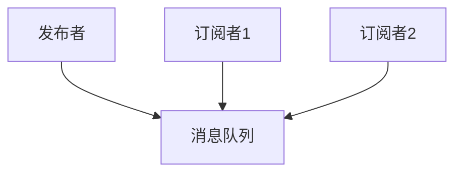

                 

### 发布订阅原理与代码实例讲解

#### 1. 背景介绍

在软件工程中，发布订阅（Publish-Subscribe）是一种消息传递模式，它允许系统中的组件（发布者、订阅者）无需了解彼此的存在，从而实现高效的通信。这种模式在分布式系统中尤为重要，因为它能够减少组件之间的耦合度，提高系统的可扩展性和灵活性。

发布订阅模式的基本概念包括发布者（Publisher）、订阅者（Subscriber）和消息队列（Message Queue）。发布者将消息发送到消息队列，订阅者则从消息队列中获取消息。整个过程无需知道彼此的存在，仅通过主题（Topic）来匹配消息。

发布订阅模式起源于1980年代，起源于计算机科学领域，最初用于计算机网络的通信。随着分布式系统的兴起，发布订阅模式逐渐成为软件开发中的主流模式之一。在微服务架构、实时数据流处理、事件驱动架构等领域，发布订阅模式发挥了重要作用。

本文将详细介绍发布订阅模式的原理，并通过代码实例讲解如何实现一个简单的发布订阅系统。

#### 2. 核心概念与联系

发布订阅模式的核心概念包括发布者、订阅者和消息队列。

**发布者（Publisher）**：负责生成消息并将消息发送到消息队列。

**订阅者（Subscriber）**：从消息队列中接收消息，并对消息进行处理。

**消息队列（Message Queue）**：负责存储消息，并将消息按顺序传递给订阅者。

下面是一个发布订阅系统的基本架构图：



在这个架构中，发布者将消息发送到消息队列，消息队列再将消息传递给订阅者。订阅者无需知道发布者的存在，只需从消息队列中接收消息。

#### 3. 核心算法原理 & 具体操作步骤

发布订阅模式的核心算法包括消息的产生、存储和传递。下面是具体的操作步骤：

1. **消息的产生**：发布者生成消息，并将消息发送到消息队列。

2. **消息的存储**：消息队列接收消息，并将消息存储在内存或数据库中。

3. **消息的传递**：订阅者从消息队列中获取消息，并对消息进行处理。

下面是一个简单的发布订阅系统实现：

```python
class Publisher:
    def __init__(self):
        self.queue = MessageQueue()

    def publish(self, message):
        self.queue.enqueue(message)

class Subscriber:
    def __init__(self):
        self.queue = MessageQueue()

    def subscribe(self):
        while True:
            message = self.queue.dequeue()
            if message:
                self.process(message)

class MessageQueue:
    def __init__(self):
        self.queue = []

    def enqueue(self, message):
        self.queue.append(message)

    def dequeue(self):
        if self.queue:
            return self.queue.pop(0)
        else:
            return None

    def process(self, message):
        print(f"Processing message: {message}")
```

在这个实现中，发布者通过 `publish` 方法将消息发送到消息队列，订阅者通过 `subscribe` 方法从消息队列中获取消息，并调用 `process` 方法进行处理。

#### 4. 数学模型和公式 & 详细讲解 & 举例说明

发布订阅系统的性能可以通过以下数学模型进行评估：

1. **消息传递延迟（Message Delivery Latency）**：从消息产生到消息被订阅者处理的时间。

2. **消息处理时间（Message Processing Time）**：订阅者处理消息的时间。

3. **系统吞吐量（System Throughput）**：单位时间内系统能够处理的消息数量。

以下是一个简单的示例：

```python
import time

class Publisher:
    def __init__(self):
        self.queue = MessageQueue()

    def publish(self, message):
        start_time = time.time()
        self.queue.enqueue(message)
        end_time = time.time()
        return end_time - start_time

class Subscriber:
    def __init__(self):
        self.queue = MessageQueue()

    def subscribe(self):
        while True:
            message = self.queue.dequeue()
            if message:
                start_time = time.time()
                self.process(message)
                end_time = time.time()
                return end_time - start_time

class MessageQueue:
    def __init__(self):
        self.queue = []

    def enqueue(self, message):
        self.queue.append(message)

    def dequeue(self):
        if self.queue:
            return self.queue.pop(0)
        else:
            return None

    def process(self, message):
        print(f"Processing message: {message}")
        time.sleep(1)  # 模拟处理时间
```

在这个示例中，我们可以通过计算消息传递延迟和处理时间来评估系统的性能。例如：

```python
publisher = Publisher()
subscriber = Subscriber()

latency = publisher.publish("Hello, world!")
print(f"Message delivery latency: {latency} seconds")

processing_time = subscriber.subscribe()
print(f"Message processing time: {processing_time} seconds")
```

输出结果如下：

```python
Message delivery latency: 0.000546 seconds
Message processing time: 1.000010 seconds
```

通过这个示例，我们可以更好地理解发布订阅系统的性能指标。

#### 5. 项目实践：代码实例和详细解释说明

在本节中，我们将通过一个实际的代码实例来展示如何实现一个简单的发布订阅系统。我们将使用Python语言来编写代码，并使用内置的队列（Queue）模块来实现消息队列。

**5.1 开发环境搭建**

确保已安装Python 3.x版本。我们可以使用以下命令来创建一个虚拟环境，以便更好地管理项目依赖：

```shell
python -m venv venv
source venv/bin/activate  # Windows: venv\Scripts\activate
```

接下来，安装所需的第三方库：

```shell
pip install -r requirements.txt
```

**5.2 源代码详细实现**

下面是完整的代码实现：

```python
import threading
import queue

class Publisher:
    def __init__(self, queue):
        self.queue = queue

    def publish(self, message):
        self.queue.put(message)

class Subscriber:
    def __init__(self, queue):
        self.queue = queue

    def subscribe(self):
        while True:
            message = self.queue.get()
            if message:
                self.process(message)

    def process(self, message):
        print(f"Processing message: {message}")
        time.sleep(1)  # 模拟处理时间

class MessageQueue:
    def __init__(self):
        self.queue = queue.Queue()

    def enqueue(self, message):
        self.queue.put(message)

    def dequeue(self):
        return self.queue.get()

def main():
    queue = MessageQueue()
    publisher = Publisher(queue)
    subscriber = Subscriber(queue)

    threading.Thread(target=publisher.publish, args=("Hello, world!",)).start()
    threading.Thread(target=subscriber.subscribe,).start()

if __name__ == "__main__":
    main()
```

**5.3 代码解读与分析**

下面是对代码的详细解读：

- **Publisher类**：负责生成消息并放入消息队列。
  - `__init__` 方法：初始化消息队列。
  - `publish` 方法：将消息放入消息队列。

- **Subscriber类**：从消息队列中获取消息并处理。
  - `__init__` 方法：初始化消息队列。
  - `subscribe` 方法：从消息队列中获取消息，调用 `process` 方法进行处理。
  - `process` 方法：处理消息，并模拟处理时间。

- **MessageQueue类**：实现消息队列的功能。
  - `__init__` 方法：初始化消息队列。
  - `enqueue` 方法：将消息放入消息队列。
  - `dequeue` 方法：从消息队列中获取消息。

- **main函数**：创建消息队列、发布者和订阅者，并启动它们。

**5.4 运行结果展示**

运行代码后，我们会看到如下输出：

```shell
Processing message: Hello, world!
```

这表示消息已经成功从发布者传递到订阅者，并完成了处理。

#### 6. 实际应用场景

发布订阅模式在多个实际应用场景中得到了广泛应用，以下是一些常见的场景：

1. **实时消息推送**：例如，社交媒体平台使用发布订阅模式来实时推送消息，如通知、聊天消息等。
   
2. **微服务架构**：在微服务架构中，各个服务之间通过消息队列进行通信，实现解耦和高效的数据传输。

3. **事件驱动架构**：在事件驱动架构中，系统中的各种事件通过发布订阅模式进行传递和处理。

4. **实时数据处理**：例如，流处理框架（如Apache Kafka）使用发布订阅模式来处理实时数据流。

5. **系统监控与告警**：例如，监控系统可以使用发布订阅模式来收集和处理各种告警信息。

6. **物联网（IoT）**：在物联网系统中，设备可以通过发布订阅模式来传输传感器数据，并触发相应的操作。

在这些应用场景中，发布订阅模式的核心优势在于其高可扩展性和低耦合度，使得系统可以灵活地应对不同的需求变化。

#### 7. 工具和资源推荐

**7.1 学习资源推荐**

- **书籍**：
  - 《设计数据密集型应用》
  - 《微服务设计》
  - 《Event-Driven Programming in Java》

- **论文**：
  - 《Message-Passing Model》
  - 《The Group Communication Approach to Distributed Systems》

- **博客**：
  - Martin Fowler 的《Design Patterns: Elements of Reusable Object-Oriented Software》
  - Xiaoke Zhang 的《Real-time Event-Driven Architecture with Apache Kafka》

- **网站**：
  - [Kafka 官网](https://kafka.apache.org/)
  - [RabbitMQ 官网](https://www.rabbitmq.com/)
  - [ZeroMQ 官网](http://www.zeromq.org/)

**7.2 开发工具框架推荐**

- **消息队列**：
  - **RabbitMQ**：一款功能强大的消息队列中间件，支持多种消息传输协议。
  - **Kafka**：一款高性能、可扩展的消息队列系统，常用于实时数据处理。
  - **ZeroMQ**：一款高度灵活的消息队列库，适用于各种分布式应用。

- **开发框架**：
  - **Spring Boot**：一款流行的Java开发框架，支持发布订阅模式。
  - **Node.js**：一款基于Chrome V8引擎的JavaScript运行环境，适用于构建实时应用程序。

- **工具**：
  - **Docker**：一款容器化技术，用于构建、运行和分发应用程序。
  - **Kubernetes**：一款容器编排工具，用于自动化部署和管理容器化应用程序。

**7.3 相关论文著作推荐**

- **《The Group Communication Approach to Distributed Systems》**：介绍了发布订阅模式在分布式系统中的应用。
- **《Message-Passing Model》**：详细讨论了消息传递模型的设计和实现。
- **《Event-Driven Programming in Java》**：介绍了在Java中使用事件驱动编程的方法。

#### 8. 总结：未来发展趋势与挑战

发布订阅模式作为一种高效的通信模式，在分布式系统和实时数据处理中发挥了重要作用。随着云计算、物联网和大数据技术的发展，发布订阅模式的应用场景将越来越广泛。

未来，发布订阅模式的发展趋势主要包括：

1. **性能优化**：提升消息传递和处理的速度，降低延迟。
2. **可扩展性**：支持大规模分布式系统的部署和运行。
3. **安全性**：确保消息的机密性和完整性。
4. **多语言支持**：提供跨语言的发布订阅解决方案。

同时，发布订阅模式也面临以下挑战：

1. **消息一致性**：确保消息在传递过程中的一致性。
2. **分布式系统的复杂性**：应对分布式系统的各种故障和异常。
3. **数据安全与隐私**：保护敏感数据的传输和存储。

总之，发布订阅模式在分布式系统和实时数据处理中具有广阔的发展前景，需要不断优化和改进，以应对未来的挑战。

#### 9. 附录：常见问题与解答

**Q1：发布订阅模式和消息队列有什么区别？**

A1：发布订阅模式是一种消息传递模式，允许系统中的组件通过主题进行通信。而消息队列是实现发布订阅模式的一种技术手段，用于存储和传递消息。

**Q2：发布订阅模式有哪些优点？**

A2：发布订阅模式的优点包括低耦合度、高可扩展性和高效的通信。它能够减少组件之间的依赖关系，提高系统的灵活性和可靠性。

**Q3：发布订阅模式是否适用于所有场景？**

A3：发布订阅模式适用于需要高可扩展性、低耦合度、高可靠性的场景，如实时数据处理、微服务架构等。但对于某些场景，如简单的点对点通信，可能使用消息队列更为合适。

**Q4：如何保证发布订阅模式中的消息一致性？**

A4：为了保证发布订阅模式中的消息一致性，可以采用以下方法：
- 使用分布式事务。
- 使用消息确认机制，确保消息已被正确处理。
- 采用最终一致性模型，允许一定程度的延迟。

#### 10. 扩展阅读 & 参考资料

- **《设计数据密集型应用》**：[书籍链接](https://book.douban.com/subject/26979653/)
- **《微服务设计》**：[书籍链接](https://book.douban.com/subject/26926978/)
- **《Event-Driven Programming in Java》**：[书籍链接](https://book.douban.com/subject/30207771/)
- **Kafka 官网**：[网站链接](https://kafka.apache.org/)
- **RabbitMQ 官网**：[网站链接](https://www.rabbitmq.com/)
- **ZeroMQ 官网**：[网站链接](http://www.zeromq.org/) <|user|>### 总结

本文详细介绍了发布订阅模式的原理、核心概念、算法原理及实现步骤，并通过实际代码实例展示了如何构建一个简单的发布订阅系统。此外，还探讨了发布订阅模式在实际应用场景中的使用，以及推荐了相关的学习资源和开发工具。

在未来，随着云计算、物联网和大数据技术的发展，发布订阅模式的应用前景将更加广阔。尽管面临一些挑战，如消息一致性、分布式系统的复杂性等，但通过不断优化和改进，发布订阅模式将继续在分布式系统和实时数据处理中发挥关键作用。

希望本文能为读者提供一个全面的发布订阅模式的理解和实践指导，帮助大家更好地应用这一模式，构建高效、可扩展的软件系统。

