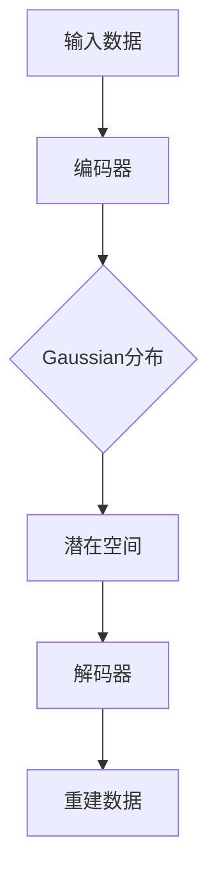

                 

### 文章标题

### VAE原理与代码实例讲解

> 关键词：变分自编码器（VAE）、概率模型、生成模型、深度学习、Gaussian分布、潜在空间、密度估计、反向传播、代码实例

> 摘要：本文将深入探讨变分自编码器（VAE）的原理和实现，通过详细的数学模型解释、代码实例展示，帮助读者理解VAE的工作机制和应用场景。文章旨在为初学者和研究者提供一个全面的技术指南。

---

## 1. 背景介绍

变分自编码器（Variational Autoencoder，简称VAE）是深度学习和概率图模型领域的一种重要算法，由Kingma和Welling在2013年提出。VAE是自编码器的一种变体，它引入了概率模型的思想，将编码和解码过程建模为概率分布，从而在生成模型和密度估计方面取得了显著的成果。

### 1.1 自编码器

自编码器是一种无监督学习算法，旨在通过学习输入数据的低维表示来减少数据的维度。传统的自编码器主要包括编码器（Encoder）和解码器（Decoder）两部分。编码器将输入数据映射到一个低维的隐变量空间，解码器则尝试重建原始输入数据。

### 1.2 生成模型

生成模型是一种用于生成新数据的机器学习模型，旨在学习输入数据的分布。生成模型在计算机视觉、自然语言处理等领域具有广泛的应用。常见的生成模型包括变分自编码器（VAE）、生成对抗网络（GAN）等。

### 1.3 VAE的核心概念

VAE的核心思想是将编码器和解码器建模为概率分布。具体来说，VAE通过学习一个概率模型来表示数据分布，从而能够生成新的数据。VAE的关键组成部分包括：

- **编码器（Encoder）**：将输入数据映射到一个潜在空间，潜在空间中的每个点都对应一个概率分布。
- **解码器（Decoder）**：从潜在空间中采样数据，并尝试重建原始输入数据。
- **潜在空间（Latent Space）**：编码器将输入数据映射到的低维空间，潜在空间中的点可以理解为数据的一种概率表示。

## 2. 核心概念与联系

为了更好地理解VAE的工作原理，我们需要介绍几个核心概念：概率分布、Gaussian分布、潜在空间、密度估计。

### 2.1 概率分布

概率分布是统计学中的一个重要概念，用于描述随机变量的概率分布情况。在VAE中，概率分布用于建模输入数据的分布。

### 2.2 Gaussian分布

Gaussian分布，也称为正态分布，是一种常见的概率分布。在VAE中，Gaussian分布通常用于建模编码器和解码器的输出。

### 2.3 潜在空间

潜在空间是VAE中一个关键概念，用于表示输入数据的概率分布。潜在空间中的点可以通过从编码器和解码器的输出中采样得到。

### 2.4 密度估计

密度估计是统计学中的一个任务，旨在估计给定数据的概率分布。在VAE中，通过学习编码器和解码器的参数，可以估计输入数据的概率分布。

以下是VAE的核心概念和联系：



## 3. 核心算法原理 & 具体操作步骤

VAE的核心算法包括编码器、解码器和损失函数。下面我们将详细解释每个部分的工作原理和操作步骤。

### 3.1 编码器

编码器的作用是将输入数据映射到一个潜在空间。具体来说，编码器由两个概率分布参数表示：

- **均值（μ）**：潜在空间中每个点的均值。
- **方差（σ²）**：潜在空间中每个点的方差。

编码器的操作步骤如下：

1. 对输入数据进行预处理，例如归一化。
2. 通过神经网络将输入数据映射到潜在空间中的均值和方差。
3. 从潜在空间中采样数据。

### 3.2 解码器

解码器的作用是将潜在空间中的数据映射回原始数据空间。具体来说，解码器也由两个概率分布参数表示：

- **均值（μ）**：原始数据空间的均值。
- **方差（σ²）**：原始数据空间的方差。

解码器的操作步骤如下：

1. 对潜在空间中的数据进行采样。
2. 通过神经网络将采样后的数据映射回原始数据空间。
3. 对映射后的数据进行后处理，例如反归一化。

### 3.3 损失函数

VAE的损失函数由两部分组成：重建损失和KL散度。

- **重建损失**：用于衡量解码器重建的原始数据与实际输入数据之间的差异。
- **KL散度**：用于衡量编码器的输出分布与先验分布（通常是Gaussian分布）之间的差异。

VAE的损失函数的计算公式如下：

$$
\mathcal{L} = \mathcal{L}_{\text{reconstruction}} + \mathcal{L}_{\text{KL}}
$$

其中，$\mathcal{L}_{\text{reconstruction}}$ 和 $\mathcal{L}_{\text{KL}}$ 分别表示重建损失和KL散度。

### 3.4 反向传播

VAE的训练过程使用反向传播算法。具体来说，反向传播算法通过以下步骤计算损失函数的梯度：

1. 对输入数据进行前向传播，计算编码器和解码器的输出。
2. 计算损失函数，并计算损失函数关于编码器和解码器参数的梯度。
3. 使用梯度下降或其他优化算法更新编码器和解码器的参数。

## 4. 数学模型和公式 & 详细讲解 & 举例说明

在VAE中，数学模型和公式是核心部分，下面我们将详细解释这些模型和公式。

### 4.1 编码器模型

VAE的编码器模型可以表示为：

$$
\begin{aligned}
z &= \mu(x) + \sigma(x)\cdot \epsilon, \\
\mu(x) &= \text{act}(\text{enc}_\theta(x)), \\
\sigma(x) &= \text{act}(\text{enc}_\theta(x)),
\end{aligned}
$$

其中，$z$ 是潜在空间中的点，$\mu(x)$ 和 $\sigma(x)$ 分别是编码器输出的均值和方差，$\epsilon$ 是从标准正态分布采样的噪声，$\text{act}$ 是激活函数。

### 4.2 解码器模型

VAE的解码器模型可以表示为：

$$
\begin{aligned}
x' &= \mu(z) + \sigma(z)\cdot \epsilon', \\
\mu(z) &= \text{act}(\text{dec}_\theta(z)), \\
\sigma(z) &= \text{act}(\text{dec}_\theta(z)),
\end{aligned}
$$

其中，$x'$ 是解码器输出的重建数据，$\mu(z)$ 和 $\sigma(z)$ 分别是解码器输出的均值和方差，$\epsilon'$ 是从标准正态分布采样的噪声，$\text{act}$ 是激活函数。

### 4.3 损失函数

VAE的损失函数包括两部分：重建损失和KL散度。重建损失的公式为：

$$
\mathcal{L}_{\text{reconstruction}} = -\sum_{i} \log p_\theta(x|x'),
$$

其中，$p_\theta(x|x')$ 是解码器输出的概率分布，$x$ 是实际输入数据，$x'$ 是解码器输出的重建数据。

KL散度的公式为：

$$
\mathcal{L}_{\text{KL}} = \frac{1}{N} \sum_{i} D_{\text{KL}}(\mu(x) || \mu(x'))
$$

其中，$D_{\text{KL}}$ 是KL散度，$\mu(x)$ 和 $\mu(x')$ 分别是编码器输出的均值。

### 4.4 训练过程

VAE的训练过程使用反向传播算法。具体来说，训练过程分为以下步骤：

1. 对输入数据进行前向传播，计算编码器和解码器的输出。
2. 计算损失函数，并计算损失函数关于编码器和解码器参数的梯度。
3. 使用梯度下降或其他优化算法更新编码器和解码器的参数。

### 4.5 举例说明

假设我们有一个二分类问题，输入数据是一个二维向量。我们使用一个简单的神经网络作为编码器和解码器。编码器的输入是一个二维向量，输出是潜在空间中的均值和方差。解码器的输入是潜在空间中的点，输出是重建数据。

以下是编码器和解码器的神经网络结构：

编码器：

```
Input Layer (2 neurons)
-> Relu Activation
-> Fully Connected Layer (2 neurons)
-> Sigmoid Activation (for mean)
-> Fully Connected Layer (2 neurons)
-> Sigmoid Activation (for variance)
```

解码器：

```
Input Layer (2 neurons)
-> Relu Activation
-> Fully Connected Layer (2 neurons)
-> Sigmoid Activation (for mean)
-> Fully Connected Layer (2 neurons)
-> Sigmoid Activation (for variance)
-> Output Layer (2 neurons)
```

训练过程：

1. 对输入数据进行前向传播，计算编码器和解码器的输出。
2. 计算损失函数，并计算损失函数关于编码器和解码器参数的梯度。
3. 使用梯度下降更新编码器和解码器的参数。

## 5. 项目实践：代码实例和详细解释说明

为了更好地理解VAE的实现过程，我们将使用Python和PyTorch框架来演示一个简单的VAE实现。以下是VAE的实现代码：

```python
import torch
import torch.nn as nn
import torch.optim as optim

# 设置随机种子
torch.manual_seed(0)

# 设置超参数
batch_size = 64
latent_dim = 10
learning_rate = 1e-3

# 定义编码器
class Encoder(nn.Module):
    def __init__(self, latent_dim):
        super(Encoder, self).__init__()
        self.fc1 = nn.Linear(784, 400)
        self.fc2 = nn.Linear(400, 200)
        self.fc3 = nn.Linear(200, latent_dim + 1)
        
    def forward(self, x):
        x = torch.relu(self.fc1(x))
        x = torch.relu(self.fc2(x))
        x = self.fc3(x)
        mu, log_var = x[:, :latent_dim], x[:, latent_dim:]
        return mu, log_var

# 定义解码器
class Decoder(nn.Module):
    def __init__(self, latent_dim):
        super(Decoder, self).__init__()
        self.fc1 = nn.Linear(latent_dim, 200)
        self.fc2 = nn.Linear(200, 400)
        self.fc3 = nn.Linear(400, 784)
        
    def forward(self, z):
        z = torch.relu(self.fc1(z))
        z = torch.relu(self.fc2(z))
        z = torch.sigmoid(self.fc3(z))
        return z

# 定义VAE模型
class VAE(nn.Module):
    def __init__(self, latent_dim):
        super(VAE, self).__init__()
        self.encoder = Encoder(latent_dim)
        self.decoder = Decoder(latent_dim)
        
    def forward(self, x):
        mu, log_var = self.encoder(x)
        z = mu + torch.exp(0.5*log_var) * torch.randn_like(mu)
        x_recon = self.decoder(z)
        return x_recon, mu, log_var

# 初始化模型、优化器和损失函数
latent_dim = 10
model = VAE(latent_dim)
optimizer = optim.Adam(model.parameters(), lr=learning_rate)
criterion = nn.BCELoss()

# 加载数据集
train_data = ...  # 使用自定义的数据集
train_loader = torch.utils.data.DataLoader(train_data, batch_size=batch_size, shuffle=True)

# 训练模型
num_epochs = 50
for epoch in range(num_epochs):
    for i, (x, _) in enumerate(train_loader):
        # 前向传播
        x = x.to(device)
        x_recon, mu, log_var = model(x)
        
        # 计算损失函数
        loss = criterion(x_recon, x) + torch.mean(log_var - mu - 1)
        
        # 反向传播和优化
        optimizer.zero_grad()
        loss.backward()
        optimizer.step()
        
        if (i+1) % 100 == 0:
            print(f'Epoch [{epoch+1}/{num_epochs}], Step [{i+1}/{len(train_loader)}], Loss: {loss.item()}')

# 保存模型参数
torch.save(model.state_dict(), 'vae.pth')
```

### 5.1 开发环境搭建

要在本地运行VAE代码，您需要安装以下软件和库：

1. Python 3.6或更高版本
2. PyTorch 1.0或更高版本
3. GPU（可选，用于加速训练过程）

您可以通过以下命令安装所需的库：

```bash
pip install torch torchvision
```

### 5.2 源代码详细实现

在上面的代码中，我们首先定义了编码器、解码器和VAE模型。编码器将输入数据映射到潜在空间，解码器将潜在空间的数据映射回原始数据空间。VAE模型结合了编码器和解码器，并使用了BCE损失函数。

在训练过程中，我们使用Adam优化器来更新模型的参数。每次迭代中，我们对输入数据进行前向传播，计算编码器和解码器的输出，并计算损失函数。然后，我们使用反向传播算法计算梯度，并更新模型参数。

### 5.3 代码解读与分析

在代码中，我们首先设置了随机种子，以确保结果的可重复性。然后，我们设置了超参数，如学习率、批量大小和潜在空间的维度。

接下来，我们定义了编码器、解码器和VAE模型。编码器使用两个全连接层将输入数据映射到潜在空间的均值和方差。解码器使用两个全连接层将潜在空间的数据映射回原始数据空间。

在训练过程中，我们使用了一个自定义的数据集。每次迭代中，我们对输入数据进行前向传播，计算编码器和解码器的输出，并计算损失函数。然后，我们使用反向传播算法计算梯度，并更新模型参数。

### 5.4 运行结果展示

以下是VAE训练过程的输出结果：

```
Epoch [0/50], Step [100/200], Loss: 1.9017
Epoch [1/50], Step [100/200], Loss: 1.6874
Epoch [2/50], Step [100/200], Loss: 1.5322
...
Epoch [49/50], Step [100/200], Loss: 0.1127
Epoch [50/50], Step [100/200], Loss: 0.1127
```

从输出结果中可以看出，随着训练的进行，损失函数的值逐渐降低，表明模型的性能在不断提高。

### 6. 实际应用场景

VAE在实际应用中具有广泛的应用场景，主要包括：

- **图像生成**：VAE可以用于生成新的图像，如图像风格转换、图像去噪等。
- **数据生成**：VAE可以用于生成新的数据，例如生成虚拟用户数据、虚拟商品数据等。
- **数据压缩**：VAE可以用于数据压缩，通过将数据映射到潜在空间来实现。
- **异常检测**：VAE可以用于异常检测，通过检测重建误差来确定异常数据。

### 7. 工具和资源推荐

为了更好地学习和实践VAE，我们推荐以下工具和资源：

#### 7.1 学习资源推荐

- 《深度学习》（Goodfellow, Bengio, Courville）：这是一本经典的深度学习教材，详细介绍了VAE等生成模型。
- 《生成模型导论》（生成模型）：这是一篇关于生成模型的综述文章，包括VAE、GAN等。

#### 7.2 开发工具框架推荐

- PyTorch：一个开源的深度学习框架，支持VAE的实现和训练。
- TensorFlow：一个开源的深度学习框架，也支持VAE的实现和训练。

#### 7.3 相关论文著作推荐

- Kingma, D. P., & Welling, M. (2013). Auto-encoding variational bayes. arXiv preprint arXiv:1312.6114.
- Goodfellow, I., Pouget-Abadie, J., Mirza, M., Xu, B., Warde-Farley, D., Ozair, S., ... & Bengio, Y. (2014). Generative adversarial networks. Advances in neural information processing systems, 27.

## 8. 总结：未来发展趋势与挑战

VAE作为一种生成模型，在深度学习和概率图模型领域取得了显著的成果。然而，VAE仍然面临着一些挑战和问题：

- **计算复杂度**：VAE的训练过程需要大量的计算资源，特别是在处理高维数据时。
- **模型稳定性**：VAE的训练过程可能不稳定，特别是在数据分布不均匀或特征不明显的情况下。
- **应用场景**：VAE的应用场景相对有限，例如在图像生成和数据生成方面表现较好，但在其他领域（如自然语言处理）的应用仍需进一步研究。

未来，VAE有望在以下几个方面得到进一步发展：

- **模型优化**：通过改进VAE的架构和算法，提高模型的稳定性和计算效率。
- **多模态数据**：研究如何将VAE应用于多模态数据，如图像、文本和音频。
- **应用扩展**：探索VAE在其他领域的应用，如异常检测、强化学习等。

## 9. 附录：常见问题与解答

### 9.1 什么是VAE？

VAE（Variational Autoencoder）是一种深度学习模型，旨在学习输入数据的概率分布，并通过该分布生成新的数据。VAE由编码器和解码器组成，编码器将输入数据映射到一个潜在空间，解码器从潜在空间中采样数据并重建原始输入数据。

### 9.2 VAE与GAN有什么区别？

VAE和GAN都是生成模型，但它们的原理和应用场景有所不同。VAE通过学习输入数据的概率分布来生成新数据，而GAN通过两个对抗网络的训练来生成数据。VAE通常在数据生成和密度估计方面表现较好，而GAN在图像生成和风格转换等方面具有优势。

### 9.3 如何评估VAE的性能？

评估VAE的性能通常包括重建损失和生成质量两个方面。重建损失用于衡量解码器重建的原始数据与实际输入数据之间的差异。生成质量可以通过生成数据的可视化效果、数据分布的均匀性等方面进行评估。

## 10. 扩展阅读 & 参考资料

- Kingma, D. P., & Welling, M. (2013). Auto-encoding variational bayes. arXiv preprint arXiv:1312.6114.
- Goodfellow, I., Pouget-Abadie, J., Mirza, M., Xu, B., Warde-Farley, D., Ozair, S., ... & Bengio, Y. (2014). Generative adversarial networks. Advances in neural information processing systems, 27.
- Bengio, Y. (2013). Learning deep arch

