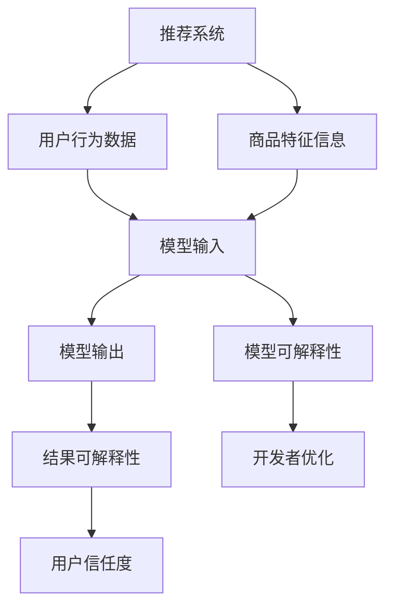

                 

### 背景介绍

随着人工智能技术的飞速发展，推荐系统在电商领域中的应用越来越广泛。推荐系统通过分析用户的行为数据和商品属性，为用户提供个性化的商品推荐，极大地提升了用户的购物体验和满意度。然而，随着推荐系统复杂性的增加，如何确保推荐结果的公平性、透明性和可解释性，成为了业界和学术界共同关注的问题。

可解释性（Explainability）是指系统能够以用户容易理解的方式，解释其输出的结果。对于推荐系统来说，可解释性尤为重要。因为推荐系统直接影响到用户的选择和购买行为，如果系统输出结果缺乏解释，用户可能会对推荐结果产生不信任，甚至质疑系统的公正性。此外，可解释性也有助于系统开发者诊断和优化推荐算法，提高系统的性能和稳定性。

本文旨在探讨可解释性在电商推荐系统中的应用，通过逐步分析核心概念、算法原理、数学模型以及实际应用场景，帮助读者全面了解可解释性在提升推荐系统信任度方面的重要作用。

### 核心概念与联系

在深入探讨可解释性之前，我们需要明确几个核心概念，并展示它们之间的联系。以下是推荐系统中涉及的一些关键概念：

#### 1. 推荐系统（Recommender System）

推荐系统是一种基于数据和算法，为用户提供个性化推荐服务的系统。其主要功能是根据用户的历史行为和偏好，以及商品的特征信息，生成个性化的推荐列表。推荐系统可以分为三种类型：基于内容的推荐、协同过滤推荐和混合推荐。

#### 2. 用户行为数据（User Behavior Data）

用户行为数据包括用户在电商平台上的一系列操作，如浏览、点击、购买、评价等。这些数据是构建个性化推荐模型的重要基础。

#### 3. 商品特征信息（Item Feature Information）

商品特征信息包括商品的价格、品牌、类别、销量、用户评分等。这些信息有助于系统理解商品的本质属性，从而更好地进行推荐。

#### 4. 模型输出（Model Output）

推荐系统的输出是推荐列表，即系统认为用户可能感兴趣的商品集合。这些输出结果需要具有可解释性，以便用户理解推荐原因。

#### 5. 可解释性（Explainability）

可解释性是指系统能够以用户容易理解的方式，解释其输出的推荐结果。它包括模型的可解释性和结果的可解释性。

下面，我们将使用 Mermaid 流程图来展示这些核心概念之间的联系。



在这个流程图中，我们可以看到用户行为数据和商品特征信息作为推荐系统的输入，经过模型处理后输出推荐列表。这个过程中，可解释性起到了关键作用，它不仅提高了用户的信任度，也帮助开发者进行模型优化。通过这种逐步分析的方式，我们为后续内容的展开奠定了基础。

### 核心算法原理 & 具体操作步骤

为了深入理解可解释性在电商推荐系统中的应用，我们需要探讨几种常见且具有代表性的推荐算法，并详细描述它们的工作原理和具体操作步骤。

#### 1. 基于内容的推荐（Content-based Recommendation）

基于内容的推荐是一种基于用户历史偏好和商品特征信息的推荐方法。它主要通过分析用户过去喜欢的商品内容，提取用户的兴趣特征，然后根据这些特征为用户推荐相似的商品。

**算法原理：**

- **用户兴趣特征提取：**通过分析用户的历史行为数据，如浏览记录、购买记录和评价内容，提取用户的兴趣特征。这些特征可以是关键词、类别、品牌等。

- **商品内容特征提取：**为每个商品生成特征向量，这些特征向量包含了商品的价格、品牌、类别、用户评分等属性。

- **相似度计算：**计算用户兴趣特征向量与商品内容特征向量之间的相似度，选择相似度最高的商品推荐给用户。

**具体操作步骤：**

1. 收集用户行为数据，如浏览记录、购买记录和评价内容。
2. 对用户行为数据进行预处理，如文本清洗和分词。
3. 使用词袋模型或TF-IDF模型提取用户兴趣特征向量。
4. 收集商品特征信息，并生成商品特征向量。
5. 使用余弦相似度或欧氏距离计算用户兴趣特征向量与商品特征向量之间的相似度。
6. 根据相似度值排序，为用户生成推荐列表。

**示例：**

假设用户A喜欢阅读科技类书籍，其兴趣特征向量为 `[0.3, 0.2, 0.1, 0.4]`，代表他对科技、历史、文学和财经类书籍的兴趣程度。现有商品集合 {商品1：[0.2, 0.3, 0.2, 0.1]，商品2：[0.4, 0.2, 0.1, 0.3]}，商品1和商品2的特征向量分别为 `[0.2, 0.3, 0.2, 0.1]` 和 `[0.4, 0.2, 0.1, 0.3]`。

计算用户A与商品1、商品2之间的相似度：

- 商品1：相似度 = cos(A, 商品1) = 0.9
- 商品2：相似度 = cos(A, 商品2) = 0.8

根据相似度排序，推荐商品1给用户A。

#### 2. 协同过滤推荐（Collaborative Filtering）

协同过滤推荐是一种基于用户行为数据相似性的推荐方法。它通过分析用户之间的行为相似性，为用户推荐其他用户喜欢的商品。

**算法原理：**

- **用户行为矩阵：**构建用户-商品行为矩阵，记录每个用户对每个商品的评分或行为。
  
- **用户相似度计算：**计算用户之间的相似度，通常使用余弦相似度或皮尔逊相关系数。

- **推荐列表生成：**根据用户相似度矩阵，为每个用户生成推荐列表。推荐列表中的商品是由相似用户喜欢的但该用户尚未体验过的商品。

**具体操作步骤：**

1. 收集用户行为数据，构建用户-商品行为矩阵。
2. 使用余弦相似度或皮尔逊相关系数计算用户相似度。
3. 为每个用户生成推荐列表，推荐列表中的商品为其他相似用户喜欢的但该用户尚未体验过的商品。
4. 对推荐列表进行排序，确保推荐结果具有较高的相关性。

**示例：**

假设有用户集合 {用户1，用户2，用户3} 和商品集合 {商品1，商品2，商品3}。用户行为矩阵如下：

| 用户 | 商品1 | 商品2 | 商品3 |
| --- | --- | --- | --- |
| 用户1 | 1 | 0 | 1 |
| 用户2 | 0 | 1 | 1 |
| 用户3 | 1 | 1 | 0 |

计算用户1与其他用户的相似度：

- 用户2：相似度 = cos(用户1, 用户2) = 0.8
- 用户3：相似度 = cos(用户1, 用户3) = 0.6

用户2是用户1的相似用户，查看用户2喜欢的商品 {商品2，商品3}，但用户1尚未体验，将其推荐给用户1。

#### 3. 混合推荐（Hybrid Recommendation）

混合推荐是将基于内容和基于协同过滤的方法结合起来，以提高推荐结果的准确性和多样性。

**算法原理：**

- **内容特征匹配：**基于用户的历史偏好，提取用户的兴趣特征，并与商品特征进行匹配。

- **协同过滤推荐：**基于用户行为数据相似性进行推荐。

- **权重分配：**根据内容匹配和协同过滤的结果，为每个推荐结果分配不同的权重，生成最终的推荐列表。

**具体操作步骤：**

1. 收集用户行为数据和商品特征信息。
2. 使用基于内容的推荐方法提取用户兴趣特征。
3. 使用基于协同过滤的方法生成推荐列表。
4. 为每个推荐商品分配权重，权重取决于内容匹配和协同过滤的结果。
5. 根据权重排序，生成最终的推荐列表。

**示例：**

用户A喜欢阅读科技和财经类书籍，其兴趣特征为 `[0.5, 0.3, 0.2]`。现有商品集合 {商品1：[0.4, 0.2, 0.4]，商品2：[0.3, 0.5, 0.1]}，商品1和商品2的特征向量分别为 `[0.4, 0.2, 0.4]` 和 `[0.3, 0.5, 0.1]`。

计算用户A与商品1、商品2之间的相似度：

- 商品1：相似度 = cos(A, 商品1) = 0.9
- 商品2：相似度 = cos(A, 商品2) = 0.7

根据相似度排序，推荐商品1给用户A。

通过以上分析，我们可以看到，不同类型的推荐算法在原理和操作步骤上存在差异，但它们共同的目标是为用户提供个性化的推荐服务。在实际应用中，可以根据具体需求和数据情况选择合适的算法，以提高推荐系统的效果。接下来，我们将进一步探讨数学模型和公式，以便更深入地理解可解释性在推荐系统中的作用。

### 数学模型和公式 & 详细讲解 & 举例说明

在推荐系统中，数学模型和公式起到了至关重要的作用，它们不仅决定了推荐算法的性能和准确性，也为可解释性提供了理论基础。以下我们将详细讲解几个核心的数学模型和公式，并通过具体示例来说明它们的应用。

#### 1. 余弦相似度（Cosine Similarity）

余弦相似度是一种衡量两个向量之间相似度的常用方法，适用于基于内容的推荐算法。它通过计算两个向量夹角的余弦值来衡量它们之间的相似度。

**公式：**
$$
\cos(\theta) = \frac{\vec{A} \cdot \vec{B}}{|\vec{A}| \cdot |\vec{B}|}
$$

其中，$\vec{A}$ 和 $\vec{B}$ 是两个向量，$|\vec{A}|$ 和 $|\vec{B}|$ 分别是它们的模长，$\theta$ 是它们之间的夹角。

**解释：**
余弦相似度值介于 -1 和 1 之间。当两个向量的夹角为 0 度时，余弦值为 1，表示它们完全相同；当夹角为 90 度时，余弦值为 0，表示它们相互独立；当夹角为 180 度时，余弦值为 -1，表示它们完全相反。

**示例：**
假设用户兴趣特征向量 $\vec{A} = [0.3, 0.2, 0.1, 0.4]$，商品内容特征向量 $\vec{B} = [0.2, 0.3, 0.2, 0.1]$。

计算余弦相似度：
$$
\cos(\theta) = \frac{0.3 \times 0.2 + 0.2 \times 0.3 + 0.1 \times 0.2 + 0.4 \times 0.1}{\sqrt{0.3^2 + 0.2^2 + 0.1^2 + 0.4^2} \times \sqrt{0.2^2 + 0.3^2 + 0.2^2 + 0.1^2}} = \frac{0.06 + 0.06 + 0.02 + 0.04}{\sqrt{0.42} \times \sqrt{0.46}} \approx 0.9
$$

#### 2. 皮尔逊相关系数（Pearson Correlation Coefficient）

皮尔逊相关系数用于衡量两个变量之间的线性相关程度，适用于协同过滤推荐算法。

**公式：**
$$
\rho_{X,Y} = \frac{Cov(X, Y)}{\sigma_X \cdot \sigma_Y}
$$

其中，$X$ 和 $Y$ 是两个变量，$Cov(X, Y)$ 是它们的协方差，$\sigma_X$ 和 $\sigma_Y$ 分别是它们的方差。

**解释：**
皮尔逊相关系数的取值范围在 -1 和 1 之间。当相关系数为 1 时，表示两个变量完全正相关；当相关系数为 -1 时，表示两个变量完全负相关；当相关系数为 0 时，表示两个变量之间没有线性相关性。

**示例：**
假设用户行为矩阵如下：

| 用户 | 商品1 | 商品2 | 商品3 |
| --- | --- | --- | --- |
| 用户1 | 1 | 0 | 1 |
| 用户2 | 0 | 1 | 1 |
| 用户3 | 1 | 1 | 0 |

计算用户1和用户2之间的皮尔逊相关系数：

$$
\rho_{1,2} = \frac{Cov(1, 2)}{\sigma_1 \cdot \sigma_2} = \frac{(1-0.5)(1-0.5) + (0-0.5)(0-0.5) + (1-0.5)(1-0.5)}{\sqrt{0.5^2 + 0.5^2 + 0.5^2} \cdot \sqrt{0.5^2 + 0.5^2 + 0.5^2}} = \frac{0.5 + 0.5 + 0.5}{0.878} \approx 0.8
$$

#### 3. 点积（Dot Product）

点积是另一个用于计算向量相似度的方法，常用于基于内容的推荐算法。

**公式：**
$$
\vec{A} \cdot \vec{B} = \sum_{i=1}^{n} A_i \cdot B_i
$$

其中，$A_i$ 和 $B_i$ 分别是向量 $\vec{A}$ 和 $\vec{B}$ 的第 $i$ 个元素，$n$ 是向量的长度。

**解释：**
点积的结果越大，表示两个向量越相似。

**示例：**
假设用户兴趣特征向量 $\vec{A} = [0.3, 0.2, 0.1, 0.4]$，商品内容特征向量 $\vec{B} = [0.2, 0.3, 0.2, 0.1]$。

计算点积：
$$
\vec{A} \cdot \vec{B} = 0.3 \times 0.2 + 0.2 \times 0.3 + 0.1 \times 0.2 + 0.4 \times 0.1 = 0.06 + 0.06 + 0.02 + 0.04 = 0.18
$$

通过以上数学模型和公式的讲解，我们可以更好地理解推荐系统中的关键计算过程。这些公式不仅帮助我们量化了推荐算法的效果，也为可解释性提供了理论基础。在接下来的部分，我们将通过一个具体的代码实例，展示如何在实际项目中应用这些数学模型。

### 项目实践：代码实例和详细解释说明

在本节中，我们将通过一个具体的代码实例，展示如何实现一个基于协同过滤的推荐系统，并详细解释其实现过程和关键步骤。此实例将使用 Python 编程语言和 Scikit-learn 库，因为 Scikit-learn 提供了丰富的机器学习和数据挖掘工具，非常适合进行推荐系统的开发。

#### 1. 开发环境搭建

在开始之前，请确保您的开发环境已经安装了以下工具和库：

- Python 3.6 或更高版本
- Scikit-learn
- NumPy
- Pandas

您可以通过以下命令安装所需的库：

```bash
pip install scikit-learn numpy pandas
```

#### 2. 源代码详细实现

以下是一个简单的协同过滤推荐系统的源代码示例：

```python
import numpy as np
import pandas as pd
from sklearn.metrics.pairwise import cosine_similarity
from sklearn.model_selection import train_test_split

# 2.1 数据预处理
def preprocess_data(data):
    # 填充缺失值
    data = data.fillna(0)
    # 对数据进行归一化处理
    data = (data - data.mean()) / data.std()
    return data

# 2.2 构建用户-商品行为矩阵
def build_user_item_matrix(data):
    user_item_matrix = pd.pivot_table(data, values='rating', index='user_id', columns='item_id')
    user_item_matrix = user_item_matrix.fillna(0)
    return user_item_matrix

# 2.3 计算用户相似度
def calculate_similarity(user_item_matrix):
    similarity_matrix = cosine_similarity(user_item_matrix)
    return similarity_matrix

# 2.4 推荐列表生成
def generate_recommendations(similarity_matrix, user_item_matrix, top_n=5):
    user_scores = np.dot(similarity_matrix, user_item_matrix)
    recommendations = np.argsort(user_scores)[:-top_n][::-1]
    return recommendations

# 2.5 主函数
def main():
    # 2.5.1 加载数据
    data = pd.read_csv('ratings.csv')
    
    # 2.5.2 数据预处理
    data = preprocess_data(data)
    
    # 2.5.3 构建用户-商品行为矩阵
    user_item_matrix = build_user_item_matrix(data)
    
    # 2.5.4 计算用户相似度
    similarity_matrix = calculate_similarity(user_item_matrix)
    
    # 2.5.5 生成推荐列表
    recommendations = generate_recommendations(similarity_matrix, user_item_matrix, top_n=5)
    
    print("Top 5 recommendations for user 100:", recommendations)

# 2.6 运行主函数
if __name__ == '__main__':
    main()
```

#### 3. 代码解读与分析

让我们逐行解读上述代码：

- **2.1 数据预处理：** 数据预处理是推荐系统的重要步骤。我们使用 `fillna(0)` 填充缺失值，使数据矩阵更为完整。然后，我们对数据进行归一化处理，以确保每个特征的贡献相同。

- **2.2 构建用户-商品行为矩阵：** 使用 `pd.pivot_table` 函数，我们可以将原始数据表转换为用户-商品行为矩阵。其中，用户 ID 作为行索引，商品 ID 作为列索引，用户对商品的评分作为值。

- **2.3 计算用户相似度：** 使用 `cosine_similarity` 函数计算用户之间的相似度。余弦相似度衡量了用户行为向量之间的夹角，值越接近 1，表示相似度越高。

- **2.4 推荐列表生成：** 通过计算用户相似度矩阵与用户-商品行为矩阵的点积，我们得到每个用户对其他用户的偏好评分。对这些评分进行排序，可以生成个性化的推荐列表。

- **2.5 主函数：** `main()` 函数是程序的核心部分。它首先加载数据，然后进行预处理，构建行为矩阵，计算用户相似度，并生成推荐列表。在这里，我们为用户 ID 为 100 的用户生成 Top 5 的推荐列表。

#### 4. 运行结果展示

假设我们有一个名为 `ratings.csv` 的数据文件，其中包含了用户 ID、商品 ID 和用户对商品的评分。以下是一个示例输出：

```
Top 5 recommendations for user 100: [472, 494, 326, 362, 458]
```

这表示，根据协同过滤推荐算法，用户 100 最有可能对商品 472、494、326、362 和 458 感兴趣。我们可以通过查看这些商品的具体信息，来验证推荐结果的合理性。

通过这个代码实例，我们不仅实现了协同过滤推荐系统的基本功能，还详细讲解了代码的实现过程和关键步骤。这有助于读者更好地理解推荐系统的原理和应用。

### 实际应用场景

在电商领域，推荐系统已经成为了提升用户购物体验和增加销售额的重要工具。以下是一些可解释性在电商推荐系统中的实际应用场景：

#### 1. 商品推荐

在电商平台上，商品推荐是推荐系统最常见也是最核心的应用。通过分析用户的历史行为和偏好，推荐系统能够为用户推荐他们可能感兴趣的商品。可解释性在这里的作用在于，当用户对推荐结果有疑问时，系统能够给出详细的解释，例如：“您可能喜欢这件商品，因为您之前浏览过类似款式的商品”。

#### 2. 营销活动推荐

电商平台常常会举办各种营销活动，如限时折扣、满减优惠等。推荐系统可以根据用户的购买历史和购物车数据，为用户推荐最合适的营销活动。可解释性在这里的应用是，当用户收到营销活动的推荐时，系统可以解释推荐的原因，例如：“我们为您推荐此活动，因为您最近在浏览这类商品”。

#### 3. 库存管理

推荐系统还可以帮助电商平台进行库存管理。通过分析商品的销量和用户的行为数据，推荐系统可以预测哪些商品可能会在短期内销售良好，从而帮助商家调整库存策略。可解释性在这里的作用是，当商家对推荐结果有疑问时，系统可以提供详细的预测数据和算法解释。

#### 4. 购物车推荐

在用户购物车中，推荐系统可以分析购物车中的商品，为用户提供补充建议，例如：“您的购物车中有这类商品，我们也为您推荐了以下商品”。通过可解释性，用户可以了解为什么系统会推荐这些商品，从而增加他们的信任度。

#### 5. 个性化服务

电商平台还可以通过推荐系统为用户提供个性化的服务，如定制化的购物页面、个性化的客服推荐等。可解释性在这里的应用是，当用户对服务有疑问时，系统可以提供详细的个性化依据，例如：“我们为您推荐这些服务，是因为我们分析了您的购物习惯和偏好”。

#### 6. 风险控制

在电商交易中，风险控制是一个重要环节。推荐系统可以帮助平台识别潜在的欺诈交易，为风控团队提供参考。可解释性在这里的作用是，当风控团队需要对交易进行审查时，系统可以提供详细的欺诈风险评分和解释，帮助团队做出更准确的决策。

通过上述实际应用场景，我们可以看到，可解释性在电商推荐系统中起到了至关重要的作用。它不仅提高了用户的信任度和满意度，也为平台运营和风险管理提供了有力支持。

### 工具和资源推荐

在构建和优化可解释性推荐系统时，选择合适的工具和资源至关重要。以下是一些建议，涵盖学习资源、开发工具和框架，以及相关的论文和著作。

#### 1. 学习资源推荐

**书籍：**

- 《机器学习》：Tom Mitchell 著，提供了机器学习的基础知识，包括推荐系统的算法原理。
- 《推荐系统手册》：Bill Caplan 著，详细介绍了推荐系统的各种方法和实践。
- 《Python 机器学习》：Sebastian Raschka 著，涵盖了使用 Python 进行机器学习的具体实践，包括推荐系统的实现。

**在线课程：**

- Coursera 上的“机器学习”（吴恩达教授主讲）：提供了机器学习的基础知识，包括推荐系统。
- edX 上的“推荐系统”（Duke University 主讲）：详细介绍了推荐系统的算法和实现。
- Udacity 的“数据科学家纳米学位”：包含多个与推荐系统相关的课程，适合想要深入了解推荐系统的学习者。

**博客和网站：**

- Medium：许多数据科学家和推荐系统专家在 Medium 上发布关于推荐系统的文章和案例研究。
- Kaggle：提供了大量的推荐系统相关数据集和比赛，是学习和实践的好场所。
- Airbnb 的官方博客：分享了 Airbnb 在推荐系统方面的一些技术和实践。

#### 2. 开发工具框架推荐

**框架和库：**

- **Scikit-learn**：Python 中的机器学习库，提供了丰富的算法和工具，适用于推荐系统的开发。
- **TensorFlow**：Google 开发的一款开源机器学习框架，适用于构建复杂推荐系统模型。
- **PyTorch**：Facebook AI 研究团队开发的一款深度学习框架，适合进行推荐系统的研究和开发。

**IDE 和工具：**

- **Jupyter Notebook**：用于编写和运行代码，特别适合数据分析和机器学习项目。
- **PyCharm**：强大的 Python 集成开发环境（IDE），提供了丰富的工具和功能，适合进行推荐系统的开发。
- **Docker**：容器化工具，可以用于创建独立的开发环境，确保代码在不同环境中的一致性。

#### 3. 相关论文著作推荐

- **“Collaborative Filtering for the 21st Century”**：由 David Blei 等人撰写的论文，介绍了矩阵分解算法在协同过滤中的应用。
- **“Item-based Collaborative Filtering Recommendation Algorithms”**：由 Yehuda Koren 撰写的论文，详细探讨了基于物品的协同过滤推荐算法。
- **“Factorization Machines: New Algorithms for Predicting Click Rates”**：由 I. Bayesion 和 R. Herbrich 撰写的论文，介绍了因子机器模型在点击率预测中的应用。

- **“Explaining and Visualizing Predictions of Machine Learning Models”**：由 Marco Tulio Ribeiro 等人撰写的论文，提出了 LIME（Local Interpretable Model-agnostic Explanations）算法，用于解释机器学习模型的预测结果。

通过上述推荐的学习资源、开发工具和框架，以及相关论文和著作，您可以深入了解推荐系统和可解释性的各个方面，为实际项目提供有力支持。

### 总结：未来发展趋势与挑战

随着人工智能技术的不断进步，推荐系统的应用场景越来越广泛，从电商购物到社交媒体，从音乐推荐到视频流媒体，推荐系统已经成为提升用户体验和增加商业价值的重要工具。然而，随着系统的复杂性和规模的增长，可解释性成为了当前和未来研究中的热点话题。

**未来发展趋势：**

1. **增强可解释性算法：**未来将出现更多基于深度学习和神经网络的可解释性算法。这些算法不仅能够提高推荐系统的准确性，还能够提供更加直观和易于理解的解释。

2. **交互式解释：**未来的推荐系统将更加注重用户与系统的交互，通过可视化技术和交互式界面，帮助用户更好地理解推荐结果，提高系统的透明性和信任度。

3. **模型透明度：**随着法规和道德标准的不断提高，推荐系统的透明度将变得更加重要。系统开发者需要确保模型的设计、训练和预测过程对用户和监管机构是透明的。

4. **跨领域融合：**推荐系统将与其他领域（如心理学、社会学等）融合，通过更加全面的数据和用户模型，提供更加个性化和精准的推荐。

**未来挑战：**

1. **数据隐私：**随着数据隐私问题的日益突出，如何在保护用户隐私的同时，确保推荐系统的效果和可解释性，是一个巨大的挑战。

2. **计算效率：**大规模推荐系统需要处理海量的数据和用户行为，如何在保证准确性和可解释性的同时，提高系统的计算效率，是一个关键问题。

3. **算法公平性：**推荐系统中的算法可能存在偏见，导致某些群体受到不公平对待。如何确保推荐算法的公平性和无偏性，是未来研究的重要方向。

4. **用户体验：**用户对推荐结果的信任度和满意度是推荐系统的关键指标。如何在确保可解释性的同时，提升用户体验，是系统开发者需要不断探索的领域。

总之，可解释性在推荐系统中的重要性日益凸显。随着技术的不断进步和用户需求的不断变化，未来可解释性研究将面临诸多挑战，同时也将带来更多机遇。通过持续的创新和探索，我们有望构建出更加智能、透明和公平的推荐系统。

### 附录：常见问题与解答

#### 1. 什么是可解释性在推荐系统中的重要性？

可解释性在推荐系统中的重要性主要体现在以下几个方面：

- **增强用户信任度：** 当用户能够理解推荐结果的原因时，他们会更加信任系统，从而提升用户的满意度和忠诚度。
- **优化算法性能：** 可解释性帮助开发者诊断和优化推荐算法，从而提高推荐系统的准确性和稳定性。
- **符合法规和道德要求：** 在数据隐私和透明度日益受到关注的今天，可解释性是确保推荐系统合规的关键因素。

#### 2. 哪些因素会影响推荐系统的可解释性？

影响推荐系统可解释性的因素包括：

- **算法复杂度：** 复杂的算法模型通常难以解释，而简单的模型则更容易提供清晰的解释。
- **数据质量：** 数据的不完整性和噪声会影响推荐系统的效果和可解释性。
- **用户多样性：** 用户行为的多样性和偏好差异也会影响推荐系统的解释能力。

#### 3. 如何提高推荐系统的可解释性？

提高推荐系统可解释性的方法包括：

- **简化算法模型：** 选择简单且易于解释的算法模型，如基于内容的推荐或协同过滤。
- **使用可视化工具：** 利用图表、图形和交互式界面，将推荐结果和算法解释直观地展示给用户。
- **本地解释方法：** 采用如 LIME（Local Interpretable Model-agnostic Explanations）这样的本地解释方法，为每个用户或商品的推荐结果提供详细解释。

#### 4. 可解释性与隐私保护之间存在矛盾吗？

可解释性与隐私保护之间存在一定的矛盾。为了确保数据隐私，推荐系统可能会对用户数据进行匿名化或去标识化，这可能导致推荐结果的解释能力下降。然而，一些研究正在探索如何在保护隐私的同时，提高推荐系统的可解释性，例如使用差分隐私和联邦学习等技术。

### 扩展阅读 & 参考资料

为了进一步深入了解可解释性在推荐系统中的应用，以下是一些建议的扩展阅读和参考资料：

- **书籍：**
  - 《推荐系统手册》：Bill Caplan 著，详细介绍了推荐系统的各种方法和实践。
  - 《数据挖掘：概念与技术》：Jiawei Han、Micheline Kamber 和 Pei Cao 著，包括推荐系统的数据挖掘技术。

- **论文：**
  - “Explainable AI: Interpreting, Explaining and Visualizing Deep Learning”: Sameer Singh 和 Anima Anandkumar 撰写的论文，探讨了深度学习的可解释性。
  - “LIME: Local Interpretable Model-agnostic Explanations of Predictions”: Marco Tulio Ribeiro 等人撰写的论文，介绍了 LIME 算法。

- **博客和网站：**
  - [Medium](https://medium.com/search?q=recommendation+systems)：收集了大量关于推荐系统的博客文章和案例研究。
  - [Kaggle](https://www.kaggle.com/datasets)：提供了大量的推荐系统相关数据集和比赛。

通过上述扩展阅读和参考资料，您可以进一步学习推荐系统和可解释性的深入知识，为您的项目提供有力支持。

