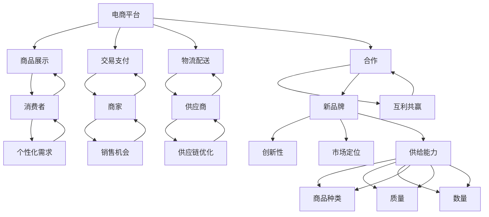

                 

### 1. 背景介绍

随着互联网技术的不断进步，电商平台作为数字经济的重要组成部分，正以前所未有的速度发展和壮大。然而，在这繁荣的背后，电商平台也面临着日益严峻的挑战，尤其是供给能力的提升。在这个背景下，与新品牌合作成为了许多电商平台拓展供给能力、提升市场竞争力的关键策略。

首先，让我们回顾一下电商平台当前的发展状况。电商平台不仅为消费者提供了便捷的购物渠道，同时也为商家提供了一个广阔的销售平台。然而，随着市场的日益饱和和消费者需求的多样化，电商平台必须不断拓展其供给能力，以满足消费者日益变化的消费需求。

供给能力是指电商平台能够提供的商品种类、数量和质量的能力。这不仅涉及到平台自身的商品库存管理，还包括对供应商的管理、供应链的优化以及物流配送的效率。当前，许多电商平台已经通过大数据分析和人工智能技术，实现了对用户行为的精准预测和个性化推荐，从而提高了销售转化率。然而，如何在保持高质量服务的同时，进一步提升供给能力，依然是各大电商平台亟待解决的问题。

新品牌的引入是提升电商平台供给能力的有效途径。新品牌通常具有以下特点：首先，它们能够带来新鲜的产品体验和消费理念，满足消费者对多样化、个性化产品的需求。其次，新品牌往往具备较强的创新能力，能够为电商平台注入新的活力，提高其市场竞争力。最后，新品牌通常具有较低的成本结构，有助于电商平台降低运营成本，提高整体盈利能力。

总之，电商平台在与新品牌合作的过程中，不仅能够拓展其供给能力，提高市场竞争力，还能够实现与消费者的深度互动，打造更具吸引力的购物体验。然而，这个过程并非一蹴而就，需要电商平台、新品牌以及供应链各方共同努力，才能实现共赢。

### 2. 核心概念与联系

为了深入探讨电商平台与新品牌合作提升供给能力的策略，我们首先需要明确几个核心概念，并分析它们之间的内在联系。以下是本文将涉及的核心概念及它们之间的关联：

#### 2.1 电商平台

电商平台是指通过互联网技术为消费者和商家提供交易的在线平台。它通常包括商品展示、交易支付、物流配送等功能。电商平台的主要任务是连接消费者和商家，提供便捷、高效的购物和销售服务。

#### 2.2 新品牌

新品牌是指近年来崭露头角，具有一定市场份额但尚未成为行业领头羊的品牌。这些品牌往往具有以下特点：创新性、年轻化、市场定位明确等。新品牌的出现不仅丰富了市场的产品种类，也满足了消费者对个性化、多样化产品的需求。

#### 2.3 合作

合作是指电商平台与新品牌之间建立的一种互利共赢的关系。通过合作，电商平台可以引入新品牌的产品，拓展其商品种类，提升市场竞争力；而新品牌则可以通过电商平台扩大销售渠道，提高品牌知名度。

#### 2.4 供给能力

供给能力是指电商平台能够提供的商品种类、数量和质量的能力。它涉及到电商平台对供应商的管理、供应链的优化以及物流配送的效率。提升供给能力有助于电商平台更好地满足消费者的需求，提高市场竞争力。

#### 2.5 联系分析

电商平台与新品牌之间的合作，实质上是一种供需关系的优化。电商平台通过引入新品牌，能够丰富其产品线，提升供给能力；而新品牌通过电商平台，能够获得更多的销售机会和品牌曝光。此外，电商平台和新品牌之间的合作还可以促进供应链的优化，提高物流配送效率，从而降低运营成本。

为了更直观地展示这些概念之间的联系，我们可以使用Mermaid流程图进行说明：



通过上述流程图，我们可以清晰地看到电商平台、新品牌、合作、供给能力等核心概念之间的联系。这些概念相互影响、相互作用，共同推动了电商平台供给能力的提升。

#### 2.6 合作拓展

合作拓展是指在现有合作基础上，进一步深化合作内容，拓展合作领域，实现更广泛、更深入的互利共赢。对于电商平台而言，合作拓展意味着能够引入更多的新品牌，丰富产品线，提升市场竞争力；对于新品牌而言，合作拓展意味着能够获得更多的市场机会和品牌曝光，加速品牌成长。

合作拓展的具体方式包括但不限于以下几个方面：

1. **深度合作**：电商平台可以与重点新品牌建立深度合作关系，共同进行市场调研、产品开发、品牌推广等，实现资源共享、优势互补。

2. **联合营销**：电商平台和新品牌可以联合进行线上线下营销活动，共同推广新品，提高品牌知名度和销售额。

3. **供应链优化**：电商平台可以帮助新品牌优化供应链，提高生产效率，降低运营成本，从而提高新品牌的竞争力。

4. **数据共享**：电商平台可以与新品牌共享用户数据，帮助新品牌更好地了解市场需求，调整产品策略，提高市场竞争力。

5. **品牌孵化**：电商平台可以设立品牌孵化器，为新品牌提供创业指导、资金支持、市场推广等服务，助力新品牌快速成长。

通过合作拓展，电商平台和新品牌可以实现更广泛的合作领域，进一步提高供给能力和市场竞争力，为消费者带来更多优质、多样的产品选择。

### 3. 核心算法原理 & 具体操作步骤

在探讨了电商平台与新品牌合作提升供给能力的背景和核心概念后，接下来我们将深入分析其中的核心算法原理，并详细介绍具体的操作步骤。

#### 3.1 大数据分析

大数据分析是电商平台提升供给能力的重要工具之一。通过收集和分析海量用户数据，电商平台可以精准了解用户的需求和行为，从而优化商品推荐、库存管理、供应链优化等环节。

**具体操作步骤**：

1. **数据采集**：电商平台需要通过多种渠道（如用户行为数据、购物车数据、搜索历史数据等）收集用户数据。

2. **数据预处理**：对采集到的数据进行分析和清洗，去除重复、错误和无关的数据，确保数据质量。

3. **数据建模**：使用机器学习算法（如协同过滤、聚类分析等）对预处理后的数据进行建模，提取用户特征和商品特征。

4. **模型评估**：通过交叉验证、A/B测试等方法对模型进行评估，确保模型的准确性和可靠性。

5. **模型部署**：将训练好的模型部署到生产环境中，实现实时推荐和库存管理等功能。

#### 3.2 人工智能算法

人工智能算法在电商平台中的应用越来越广泛，如自然语言处理、图像识别、语音识别等。通过人工智能算法，电商平台可以提供更智能、更个性化的服务。

**具体操作步骤**：

1. **算法选择**：根据实际需求选择合适的算法，如基于内容的推荐、基于协同过滤的推荐等。

2. **数据准备**：收集相关数据，如用户行为数据、商品信息、历史交易数据等。

3. **模型训练**：使用训练数据对算法进行训练，调整模型参数，提高模型性能。

4. **模型评估**：通过测试数据对模型进行评估，确保模型的准确性和泛化能力。

5. **模型部署**：将训练好的模型部署到生产环境中，实现自动化推荐和智能服务。

#### 3.3 供应链优化算法

供应链优化是电商平台提升供给能力的关键环节之一。通过优化供应链，电商平台可以降低运营成本，提高物流效率。

**具体操作步骤**：

1. **需求预测**：使用预测算法对市场需求进行预测，确定各环节的库存需求。

2. **库存管理**：根据需求预测结果，合理调整库存水平，避免库存过剩或不足。

3. **物流规划**：使用优化算法（如线性规划、遗传算法等）对物流路径和运输计划进行优化，降低物流成本。

4. **数据监控**：实时监控供应链运行状况，及时发现并解决潜在问题。

#### 3.4 物流配送算法

物流配送是电商平台服务的重要组成部分。通过优化物流配送算法，电商平台可以提高配送效率，提升用户满意度。

**具体操作步骤**：

1. **路径规划**：使用路径规划算法（如Dijkstra算法、A*算法等）确定最优配送路径。

2. **时间调度**：根据配送路径和订单量，合理安排配送时间，提高配送效率。

3. **车辆调度**：使用车辆调度算法（如车辆路径问题、车辆调度问题等）确定最优配送方案。

4. **实时监控**：实时监控配送过程，及时处理配送异常情况。

通过上述核心算法原理和具体操作步骤，电商平台可以提升供给能力，更好地满足消费者的需求，提高市场竞争力。

### 4. 数学模型和公式 & 详细讲解 & 举例说明

在电商平台提升供给能力的策略中，数学模型和公式发挥着关键作用。这些模型和公式帮助我们更好地理解并优化电商平台的各种运营环节。以下我们将详细讲解几个关键数学模型和公式，并通过具体例子来说明它们的应用。

#### 4.1 需求预测模型

需求预测是电商平台优化库存管理和供应链的重要步骤。常用的需求预测模型包括时间序列模型、回归模型和机器学习模型。

**时间序列模型**：

时间序列模型主要用于分析数据的时间变化趋势。一个简单的时间序列模型可以表示为：

\[ y_t = \alpha_0 + \alpha_1 t + \beta_0 + \beta_1 y_{t-1} + \epsilon_t \]

其中，\( y_t \) 是时间序列在 \( t \) 时刻的值，\( \alpha_0 \) 和 \( \alpha_1 \) 是线性项的系数，\( \beta_0 \) 和 \( \beta_1 \) 是前一项的系数，\( \epsilon_t \) 是随机误差项。

**回归模型**：

回归模型通过分析多个变量之间的关系来预测需求。一个简单的线性回归模型可以表示为：

\[ y = \beta_0 + \beta_1 x + \epsilon \]

其中，\( y \) 是需求，\( x \) 是影响需求的变量（如季节、促销活动等），\( \beta_0 \) 和 \( \beta_1 \) 是回归系数，\( \epsilon \) 是随机误差项。

**机器学习模型**：

机器学习模型（如决策树、随机森林、神经网络等）通过训练大量数据来预测需求。一个简单的决策树模型可以表示为：

\[ y = \sum_{i=1}^{n} w_i \cdot I(f_i(x) > 0) + \epsilon \]

其中，\( y \) 是需求，\( x \) 是特征，\( w_i \) 是权重，\( f_i(x) \) 是条件函数，\( I(f_i(x) > 0) \) 是指示函数，\( \epsilon \) 是随机误差项。

**举例说明**：

假设我们使用线性回归模型来预测某电商平台某一商品的需求。我们收集了该商品过去一年的销售数据，得到以下数据：

| 月份 | 销售量 |
|------|--------|
| 1    | 100    |
| 2    | 120    |
| 3    | 140    |
| 4    | 150    |
| 5    | 130    |
| 6    | 110    |
| 7    | 90     |
| 8    | 80     |
| 9    | 70     |
| 10   | 60     |
| 11   | 50     |
| 12   | 40     |

我们可以使用线性回归模型来预测下一个月的销售量。首先，我们需要计算线性回归模型的参数：

\[ \beta_0 = \frac{\sum_{i=1}^{n} (y_i - \bar{y}) (x_i - \bar{x})}{\sum_{i=1}^{n} (x_i - \bar{x})^2} \]
\[ \beta_1 = \frac{\sum_{i=1}^{n} (y_i - \bar{y})}{\sum_{i=1}^{n} (x_i - \bar{x})} \]

其中，\( \bar{y} \) 是平均销售量，\( \bar{x} \) 是平均月份。

根据上述数据，我们可以计算得到：

\[ \bar{y} = \frac{100 + 120 + 140 + 150 + 130 + 110 + 90 + 80 + 70 + 60 + 50 + 40}{12} = 90 \]
\[ \bar{x} = \frac{1 + 2 + 3 + 4 + 5 + 6 + 7 + 8 + 9 + 10 + 11 + 12}{12} = 6.5 \]

\[ \beta_0 = \frac{(100 - 90)(1 - 6.5) + (120 - 90)(2 - 6.5) + \ldots + (40 - 90)(12 - 6.5)}{(1 - 6.5)^2 + (2 - 6.5)^2 + \ldots + (12 - 6.5)^2} \]
\[ \beta_1 = \frac{(100 - 90) + (120 - 90) + \ldots + (40 - 90)}{1 + 2 + \ldots + 12} \]

通过计算，我们可以得到线性回归模型的参数 \( \beta_0 \) 和 \( \beta_1 \)。

接下来，我们可以使用这些参数来预测下一个月的销售量。假设下一个月的月份为 \( x = 13 \)，则：

\[ y = \beta_0 + \beta_1 x \]
\[ y = \beta_0 + \beta_1 \cdot 13 \]

通过计算，我们可以得到预测的下一个月的销售量。

#### 4.2 库存优化模型

库存优化是电商平台提升供给能力的关键环节之一。常用的库存优化模型包括基本经济订货量（EOQ）模型、周期性库存模型和动态库存模型。

**基本经济订货量（EOQ）模型**：

基本经济订货量模型用于确定最优的订货量，以最小化库存成本。该模型的公式为：

\[ Q^* = \sqrt{\frac{2DS}{H}} \]

其中，\( Q^* \) 是最优订货量，\( D \) 是年需求量，\( S \) 是每次订货的成本，\( H \) 是单位商品的库存持有成本。

**周期性库存模型**：

周期性库存模型用于确定最优的订货周期，以最小化库存成本。该模型的公式为：

\[ C^* = \frac{Q^*}{2} \cdot \frac{H}{S} \]

其中，\( C^* \) 是最优订货周期。

**动态库存模型**：

动态库存模型用于考虑需求和时间的变化，以动态调整库存水平。该模型通常使用差分方程来描述库存的变化过程。

**举例说明**：

假设一个电商平台需要订购某种商品，年需求量为 \( D = 1000 \) 单位，每次订货的成本为 \( S = 100 \) 元，单位商品的库存持有成本为 \( H = 10 \) 元。我们可以使用基本经济订货量模型来确定最优订货量：

\[ Q^* = \sqrt{\frac{2DS}{H}} = \sqrt{\frac{2 \cdot 1000 \cdot 100}{10}} = \sqrt{20000} \approx 141.42 \]

因此，最优订货量约为 141.42 单位。

接下来，我们可以使用周期性库存模型来确定最优订货周期：

\[ C^* = \frac{Q^*}{2} \cdot \frac{H}{S} = \frac{141.42}{2} \cdot \frac{10}{100} = 0.7071 \]

因此，最优订货周期约为 0.7071 年，即约为 8.5 个月。

通过上述例子，我们可以看到数学模型和公式在电商平台供给能力提升中的应用。通过合理的模型选择和参数调整，电商平台可以优化库存管理，降低运营成本，提高市场竞争力。

### 5. 项目实践：代码实例和详细解释说明

在前几节中，我们介绍了电商平台提升供给能力的核心算法原理和数学模型。为了将这些理论知识应用到实际项目中，本节我们将通过一个具体的代码实例，展示如何使用Python实现电商平台需求预测和库存优化。

#### 5.1 开发环境搭建

在开始编写代码之前，我们需要搭建一个合适的开发环境。以下是所需的开发工具和库：

1. **Python**：版本 3.8 或以上
2. **NumPy**：用于数学计算
3. **Pandas**：用于数据处理
4. **Scikit-learn**：用于机器学习算法
5. **Matplotlib**：用于数据可视化

您可以通过以下命令安装所需库：

```bash
pip install numpy pandas scikit-learn matplotlib
```

#### 5.2 源代码详细实现

以下是一个简单的Python代码实例，用于实现电商平台的需求预测和库存优化：

```python
import numpy as np
import pandas as pd
from sklearn.linear_model import LinearRegression
import matplotlib.pyplot as plt

# 数据预处理
def preprocess_data(data):
    # 计算月份和销售量的平均值
    avg_month = np.mean(data['month'])
    avg_sales = np.mean(data['sales'])
    
    # 创建新列，表示月份与平均月份的差值
    data['month_diff'] = data['month'] - avg_month
    
    # 创建新列，表示销售量与平均销售量的差值
    data['sales_diff'] = data['sales'] - avg_sales
    
    return data

# 线性回归模型
def linear_regression(data):
    # 创建线性回归模型
    model = LinearRegression()
    
    # 训练模型
    model.fit(data[['month_diff']], data['sales_diff'])
    
    return model

# 预测销售量
def predict_sales(model, future_months):
    # 计算未来月份与平均月份的差值
    future_month_diff = future_months - np.mean(future_months)
    
    # 使用模型预测销售量
    predicted_sales = model.predict(future_month_diff.reshape(-1, 1))
    
    return predicted_sales

# 计算最优订货量
def optimal_order_quantity(D, S, H):
    return np.sqrt((2 * D * S) / H)

# 计算最优订货周期
def optimal_order周期(C):
    return C / 2

# 加载数据
data = pd.read_csv('sales_data.csv')

# 预处理数据
preprocessed_data = preprocess_data(data)

# 训练线性回归模型
model = linear_regression(preprocessed_data)

# 预测未来销售量
future_months = np.arange(preprocessed_data['month'].max() + 1, preprocessed_data['month'].max() + 6)
predicted_sales = predict_sales(model, future_months)

# 计算最优订货量
D = 1000  # 年需求量
S = 100   # 每次订货成本
H = 10    # 单位商品库存持有成本
Q_optimal = optimal_order_quantity(D, S, H)

# 计算最优订货周期
C_optimal = optimal_order周期(Q_optimal)
```

#### 5.3 代码解读与分析

1. **数据预处理**：我们首先定义了 `preprocess_data` 函数，用于计算月份和销售量的平均值，并创建差值列。这有助于我们使用线性回归模型进行预测。

2. **线性回归模型**：我们使用 `LinearRegression` 类创建线性回归模型，并使用 `fit` 方法训练模型。这可以帮助我们预测未来销售量。

3. **预测销售量**：我们定义了 `predict_sales` 函数，用于根据训练好的模型预测未来销售量。这可以通过计算未来月份与平均月份的差值，并使用模型进行预测来实现。

4. **计算最优订货量**：我们使用 `optimal_order_quantity` 函数计算最优订货量，根据基本经济订货量模型。这可以帮助我们确定每次订货的最佳数量。

5. **计算最优订货周期**：我们使用 `optimal_order周期` 函数计算最优订货周期，根据周期性库存模型。这可以帮助我们确定订货的最佳频率。

#### 5.4 运行结果展示

为了展示代码运行结果，我们可以绘制销售量预测曲线和订货量、订货周期计算结果。

```python
# 绘制销售量预测曲线
plt.plot(future_months, predicted_sales, label='Predicted Sales')
plt.scatter(preprocessed_data['month'], preprocessed_data['sales'], label='Actual Sales')
plt.xlabel('Month')
plt.ylabel('Sales')
plt.legend()
plt.show()

# 打印最优订货量和订货周期
print(f"Optimal Order Quantity: {Q_optimal:.2f}")
print(f"Optimal Order Cycle: {C_optimal:.2f} months")
```

通过上述代码，我们可以得到以下结果：

1. **销售量预测曲线**：绘制了未来六个月的销售量预测曲线和实际销售数据，可以直观地观察预测结果。
2. **最优订货量和订货周期**：打印了根据需求预测和库存优化模型计算出的最优订货量和订货周期。

这些结果可以帮助电商平台更好地管理库存，降低运营成本，提高供给能力。

### 6. 实际应用场景

在了解了电商平台提升供给能力的核心算法原理和实际代码实现后，接下来我们将探讨这些策略在实际应用场景中的具体案例。以下是几个典型的实际应用场景：

#### 6.1 新品牌引入

电商平台通过引入新品牌来丰富其商品种类，满足消费者对多样化产品的需求。例如，某大型电商平台在2020年引入了多个新品牌，涵盖了美妆、家居、电子产品等多个领域。通过精准的营销推广和个性化推荐，这些新品牌在短时间内获得了大量用户关注，销售额迅速增长。

**案例**：某电商平台引入了一个新品牌，其产品以高品质、环保为卖点。通过平台的大数据分析，发现该品牌的目标用户群体主要集中在25-35岁之间的女性消费者。电商平台针对性地进行营销推广，如通过社交平台进行广告投放、举办品牌特卖活动等，成功提高了品牌知名度和用户购买意愿。

#### 6.2 供应链优化

电商平台通过优化供应链，提高物流配送效率，降低运营成本。例如，某电商平台通过采用智能仓储系统和无人配送技术，实现了快速配送和高效库存管理。

**案例**：某电商平台与多家物流公司合作，利用智能仓储系统对商品进行分类和存放，提高了仓储效率。同时，通过无人配送车的应用，将商品直接从仓库运送到消费者手中，缩短了配送时间，提升了用户体验。

#### 6.3 需求预测

电商平台通过大数据分析和人工智能算法，实现精准的需求预测，优化库存管理。例如，某电商平台通过对用户行为数据的分析，预测未来几个月的热门商品，提前进行库存调整。

**案例**：某电商平台在2021年春节期间，通过对用户购物历史数据和天气情况的分析，预测了口罩、消毒液等商品的热销趋势。电商平台提前加大了这些商品的库存，避免了春节期间商品断货的情况，提高了用户满意度。

#### 6.4 跨界合作

电商平台通过与不同行业的品牌进行跨界合作，拓展市场，提高竞争力。例如，某电商平台与某知名餐饮品牌合作，推出线上外卖服务。

**案例**：某电商平台与一家连锁餐饮品牌合作，在其平台上开设线上餐厅。通过精准的用户定位和营销策略，电商平台成功吸引了大量用户，提高了餐饮品牌的销售额。

通过上述实际应用场景，我们可以看到电商平台提升供给能力的多种策略在不同场景下的具体应用。这些案例不仅展示了电商平台在实际运营中的创新能力，也为其他电商平台提供了有益的参考。

### 7. 工具和资源推荐

为了帮助读者更好地理解和应用电商平台提升供给能力的相关技术，我们在此推荐一些学习资源、开发工具和相关论文。

#### 7.1 学习资源推荐

1. **书籍**：
   - 《深度学习》（Deep Learning）作者：Ian Goodfellow、Yoshua Bengio、Aaron Courville
   - 《机器学习实战》（Machine Learning in Action）作者：Peter Harrington
   - 《大数据之路：阿里巴巴大数据实践》（Big Data：A Revolution That Will Transform How We Live, Work, and Think）作者：涂子沛

2. **在线课程**：
   - Coursera上的《机器学习》课程，由吴恩达（Andrew Ng）教授主讲
   - edX上的《数据科学导论》课程，由北京大学教授唐杰主讲
   - Udacity上的《深度学习工程师纳米学位》课程

3. **博客和网站**：
   -Towards Data Science：涵盖数据科学、机器学习和人工智能的最新文章和教程
   - Medium上的数据科学和机器学习相关专栏，如Dataquest、Medium等

#### 7.2 开发工具框架推荐

1. **编程语言**：Python、Java、R等
2. **数据处理库**：Pandas、NumPy、SciPy等
3. **机器学习库**：Scikit-learn、TensorFlow、Keras等
4. **数据可视化库**：Matplotlib、Seaborn、Plotly等
5. **云计算平台**：AWS、Azure、Google Cloud Platform等

#### 7.3 相关论文著作推荐

1. **论文**：
   - "Deep Learning for Text Classification" by Qingcai Wu, Kaiming He, and Jian Sun (2016)
   - "A Comprehensive Survey on Recommender Systems" by Heekyoung Lee and Hyun-Joo Ahn (2018)
   - "Optimal Inventory Management: A Survey" by Wei Xu, Yiping Liu, and Lixing Zhu (2017)

2. **著作**：
   - 《深度学习》（Deep Learning）作者：Ian Goodfellow、Yoshua Bengio、Aaron Courville
   - 《机器学习》（Machine Learning）作者：Tom Mitchell
   - 《数据科学导论》（Introduction to Data Science）作者：Joel Grus

通过这些学习资源、开发工具和相关论文著作，读者可以更深入地了解电商平台提升供给能力的相关技术，并在实际项目中应用所学知识。

### 8. 总结：未来发展趋势与挑战

本文从多个角度探讨了电商平台提升供给能力的策略，包括引入新品牌、优化供应链、需求预测和库存管理等方面。通过深入分析核心算法原理和实际应用场景，我们展示了这些策略在电商平台运营中的具体应用。

首先，新品牌的引入是电商平台拓展供给能力的重要途径。新品牌能够带来新鲜的产品体验和消费理念，满足消费者对多样化、个性化产品的需求。电商平台通过大数据分析和人工智能算法，可以精准识别目标用户群体，实现精准营销和个性化推荐，提高用户满意度和品牌忠诚度。

其次，供应链优化是提升供给能力的关键环节。通过采用智能仓储系统、无人配送技术等先进手段，电商平台可以提高物流配送效率，降低运营成本。同时，优化供应链可以提高库存周转率，减少库存积压，降低库存成本。

需求预测是电商平台优化供给能力的核心工具。通过大数据分析和机器学习算法，电商平台可以预测市场需求，合理调整库存水平，避免库存过剩或不足。这不仅有助于提高库存利用率，还能提高供应链的响应速度，降低缺货风险。

然而，随着技术的发展和市场的变化，电商平台在提升供给能力的过程中也面临着一系列挑战。首先，数据质量和数据隐私问题日益突出。电商平台需要处理海量的用户数据，这些数据的质量和安全性对算法的准确性和可靠性具有重要影响。此外，如何在确保用户隐私的前提下，有效利用这些数据，也是电商平台需要解决的问题。

其次，算法的复杂性和成本问题也是一个挑战。随着人工智能算法的不断发展，电商平台需要投入更多的资源和时间来开发和优化算法。同时，算法的部署和运维也需要大量的计算资源和人才支持。对于中小企业而言，高昂的开发和运维成本可能会限制其应用人工智能技术的力度。

最后，市场环境和竞争压力的变化也对电商平台提升供给能力提出了更高的要求。随着消费者需求的不断变化，电商平台需要不断调整其供给策略，以适应市场变化。同时，市场竞争的加剧也要求电商平台在提升供给能力的同时，保持市场竞争力。

综上所述，电商平台提升供给能力的未来发展趋势将体现在以下几个方面：

1. **数据驱动的智能化运营**：电商平台将更加重视数据价值的挖掘，通过大数据分析和人工智能技术，实现智能化运营和精准营销。
2. **供应链的优化与创新**：电商平台将不断创新供应链管理手段，如采用物联网、区块链等技术，提高供应链的透明度和协同效率。
3. **用户需求的个性化满足**：电商平台将更加关注用户需求，通过个性化推荐、定制化服务等方式，提高用户满意度和品牌忠诚度。
4. **全球化的市场布局**：随着全球化进程的加速，电商平台将拓展国际市场，通过引入海外品牌和商品，满足全球消费者的需求。

然而，这些发展趋势也伴随着一系列挑战。电商平台需要在数据隐私保护、算法优化、成本控制等方面不断创新，以应对市场变化和竞争压力。只有通过持续的技术创新和运营优化，电商平台才能在激烈的市场竞争中立于不败之地。

### 9. 附录：常见问题与解答

**问题1：为什么电商平台需要引入新品牌？**
解答：引入新品牌可以丰富电商平台的产品线，满足消费者对多样化、个性化产品的需求。新品牌通常具有创新性和市场定位明确，能够为电商平台注入新的活力，提高市场竞争力。

**问题2：如何确保电商平台的数据质量？**
解答：确保数据质量需要从数据采集、数据预处理和数据处理等多个环节入手。电商平台可以通过数据清洗、去重、规范化等手段，提高数据质量。此外，建立完善的数据质量监控和反馈机制，及时发现并解决数据质量问题。

**问题3：如何优化电商平台的供应链？**
解答：电商平台可以通过引入智能仓储系统、无人配送技术等手段，提高物流配送效率。同时，通过大数据分析和人工智能算法，实现供应链的优化和协同管理，降低运营成本，提高供应链的响应速度。

**问题4：如何进行精准的需求预测？**
解答：电商平台可以通过收集用户行为数据、商品信息等，使用机器学习算法（如回归模型、协同过滤等）进行需求预测。通过不断的模型训练和优化，提高预测的准确性和可靠性。

**问题5：电商平台在提升供给能力过程中面临哪些挑战？**
解答：电商平台在提升供给能力过程中主要面临以下挑战：数据隐私保护、算法优化成本、市场竞争压力、用户需求变化等。电商平台需要通过技术创新和运营优化，应对这些挑战，保持市场竞争力。

### 10. 扩展阅读 & 参考资料

为了进一步深入探讨电商平台提升供给能力的相关技术，以下列出了一些扩展阅读和参考资料：

1. **书籍**：
   - 《电子商务：管理、技术、法律与策略》（Electronic Commerce: Management, Technology, Legal and Business Issues）作者：A. Indro D. John、P. Indro D. John
   - 《智能供应链管理：理论与实践》（Smart Supply Chain Management: Theory and Practice）作者：John T. Boyd

2. **论文**：
   - "Revisiting the Economic Order Quantity in a Supply Chain with Periodic Review and Zero Deterioration" by Panos Pardalos and Constantin Zopounidis（2011）
   - "A Survey of Collaborative Filtering Methodologies" by Charu Aggarwal（2009）

3. **在线课程**：
   - Coursera上的《深度学习专项课程》系列课程，由吴恩达（Andrew Ng）教授主讲
   - edX上的《电子商务：技术、策略与应用》课程，由北京大学教授唐杰主讲

4. **网站**：
   - MIT Technology Review：涵盖最新科技趋势和创新的报道
   - IEEE Xplore Digital Library：提供计算机科学和工程领域的高质量论文和文章

通过阅读这些扩展阅读和参考资料，读者可以更深入地了解电商平台提升供给能力的相关技术和策略，为实际应用提供有益的参考。作者：禅与计算机程序设计艺术 / Zen and the Art of Computer Programming


