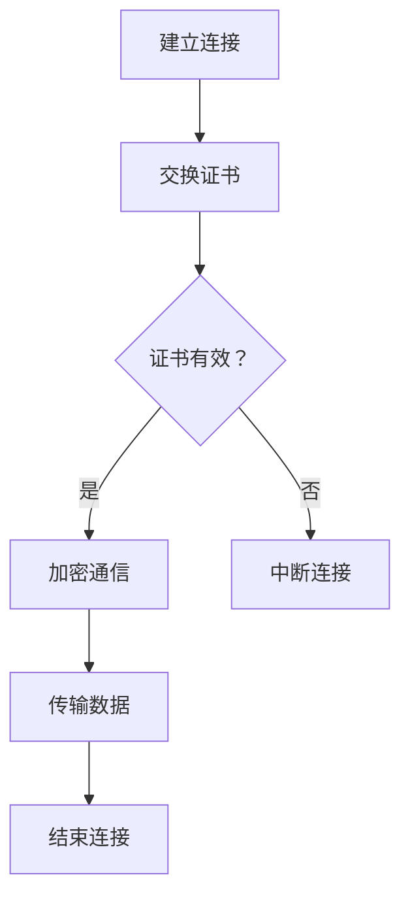

                 

 HTTPS，即 Hypertext Transfer Protocol Secure，是一种通过 SSL（Secure Sockets Layer）或其继任者 TLS（Transport Layer Security）加密的协议，旨在确保互联网数据传输的安全性。随着互联网的普及和网络安全问题日益突出，HTTPS 已经成为许多网站和服务的标准，特别是在涉及敏感数据传输的应用场景中，如电子商务、在线银行和社交媒体。本文将深入探讨 HTTPS 的核心概念、工作原理、合规性要求以及其在实际应用中的重要性。

## 文章关键词

- HTTPS
- SSL/TLS
- 网络安全
- 加密传输
- 合规性

## 文章摘要

本文旨在为 IT 专业人员和开发人员提供一个关于 HTTPS 的全面指南。首先，我们将回顾 HTTPS 的背景，然后详细解释其工作原理和加密技术。接下来，我们将探讨 HTTPS 在合规性方面的要求，特别是在 GDPR 和其他隐私法规下的应用。随后，我们将讨论 HTTPS 在各种实际应用场景中的重要性，并展望其未来发展趋势。最后，我们将推荐一些学习和开发资源，以帮助读者更好地理解和应用 HTTPS。

## 1. 背景介绍

### 1.1 HTTPS 的起源与发展

HTTPS 的起源可以追溯到 1994 年，当时 Netscape Communications Corporation 推出了第一个版本的 SSL。SSL 的目标是提供一种安全机制，以确保在互联网上进行的数据传输不会被窃听或篡改。随着互联网的迅速发展，SSL 逐渐成为网站数据加密传输的标准。

SSL 的第一个版本很快被其继任者 TLS 所取代。TLS 是 SSL 的改进版，提供了更高的安全性和更强的加密算法。目前，TLS 已成为 HTTPS 的主要实现方式，最新的 TLS 版本包括 TLS 1.3，它在性能和安全性方面都取得了显著提升。

### 1.2 HTTPS 在现代互联网中的作用

HTTPS 的引入极大地提高了互联网的安全性。它确保了在客户端和服务器之间的数据传输是加密的，从而防止了数据被窃取或篡改。特别是在涉及敏感信息的传输，如信用卡信息、登录凭证和个人数据时，HTTPS 是不可或缺的。

此外，HTTPS 还提供了身份验证机制，确保网站的真实性。通过使用数字证书，HTTPS 能够验证网站所有者的身份，防止欺骗性网站（也称为“钓鱼网站”）欺骗用户。

### 1.3 HTTPS 在合规性方面的要求

在全球范围内，越来越多的法律法规要求企业使用 HTTPS。例如，欧盟的通用数据保护条例（GDPR）和加利福尼亚州消费者隐私法案（CCPA）都明确要求企业在处理个人数据时必须采取适当的安全措施，包括使用 HTTPS 来保护数据安全。

在中国，网络安全法也规定了网络运营者必须采取技术措施保护网络安全，防止网络数据被窃取、泄露、篡改等。HTTPS 作为一种广泛采用的安全传输协议，自然成为实现这一要求的重要手段。

## 2. 核心概念与联系

### 2.1 HTTPS 的核心概念

HTTPS 是基于 HTTP 的安全协议，它通过 SSL/TLS 提供加密服务。以下是 HTTPS 中的几个核心概念：

- **SSL/TLS**：SSL 和 TLS 是用于加密互联网通信的协议。SSL 是早期版本的加密协议，而 TLS 是 SSL 的改进版，目前广泛应用于 HTTPS。
- **数字证书**：数字证书是由证书颁发机构（CA）颁发的，用于验证网站所有者身份和加密数据传输。证书包含网站域名、所有者信息和公钥。
- **加密传输**：HTTPS 通过 SSL/TLS 协议加密客户端和服务器之间的通信，确保数据在传输过程中不会被窃取或篡改。
- **身份验证**：HTTPS 使用数字证书来验证网站的真实性，防止欺骗性网站欺骗用户。

### 2.2 HTTPS 工作原理

HTTPS 的工作原理可以概括为以下几个步骤：

1. **建立连接**：客户端请求 HTTPS 连接，服务器响应。
2. **交换证书**：服务器将数字证书发送给客户端，客户端验证证书的有效性。
3. **加密通信**：一旦证书验证通过，客户端和服务器开始使用 SSL/TLS 协议加密通信。
4. **传输数据**：客户端和服务器通过加密通道传输数据，确保数据的安全性。
5. **结束连接**：通信结束后，客户端和服务器断开连接。

### 2.3 HTTPS 架构的 Mermaid 流程图



## 3. 核心算法原理 & 具体操作步骤

### 3.1 算法原理概述

HTTPS 的核心算法是 SSL/TLS。SSL/TLS 使用加密算法来确保数据在传输过程中的保密性和完整性。以下是 SSL/TLS 的主要算法原理：

- **加密算法**：SSL/TLS 使用对称加密算法（如 AES）和非对称加密算法（如 RSA）来加密数据。对称加密算法加密速度快，但安全性较低，非对称加密算法则相反。
- **身份验证**：SSL/TLS 使用数字证书进行身份验证，确保网站的真实性。证书由证书颁发机构（CA）签发，客户端使用 CA 的公钥验证证书的有效性。
- **密钥交换**：SSL/TLS 在建立连接时交换密钥，以确保后续通信的加密。密钥交换过程使用 Diffie-Hellman 算法。

### 3.2 算法步骤详解

1. **客户端请求 HTTPS 连接**：客户端通过 HTTP 协议请求 HTTPS 连接，服务器响应请求。
2. **服务器发送证书**：服务器将数字证书发送给客户端，证书包含网站域名、所有者信息和公钥。
3. **客户端验证证书**：客户端使用证书颁发机构的公钥验证证书的有效性。如果证书无效，客户端会中断连接。
4. **交换密钥**：一旦证书验证通过，客户端和服务器开始使用 SSL/TLS 协议交换密钥。密钥交换过程使用 Diffie-Hellman 算法。
5. **加密通信**：客户端和服务器使用交换的密钥加密通信，确保数据在传输过程中的保密性和完整性。
6. **传输数据**：客户端和服务器通过加密通道传输数据。
7. **结束连接**：通信结束后，客户端和服务器断开连接。

### 3.3 算法优缺点

#### 优点：

- **安全性高**：HTTPS 使用加密算法确保数据在传输过程中的保密性和完整性。
- **身份验证强**：HTTPS 使用数字证书进行身份验证，确保网站的真实性。
- **广泛应用**：HTTPS 已成为网站和服务的标准，特别是在涉及敏感数据传输的应用场景中。

#### 缺点：

- **性能开销大**：加密和解密过程需要计算资源，可能导致性能下降。
- **证书管理复杂**：证书的申请、安装和更新过程相对复杂，需要一定的技术知识。

### 3.4 算法应用领域

HTTPS 在许多领域都有广泛的应用，包括：

- **电子商务**：HTTPS 用于保护在线购物过程中用户信用卡信息的安全性。
- **在线银行**：HTTPS 用于确保在线银行服务的数据安全。
- **社交媒体**：HTTPS 用于保护社交媒体平台用户的数据安全。
- **企业应用**：HTTPS 用于保护企业内部网络的数据传输。

## 4. 数学模型和公式 & 详细讲解 & 举例说明

### 4.1 数学模型构建

HTTPS 的数学模型主要包括加密算法和密钥交换算法。以下是两个关键数学模型的构建：

#### 对称加密算法

对称加密算法使用相同的密钥加密和解密数据。常用的对称加密算法包括 AES 和 DES。

- **AES（高级加密标准）**：
  - 密钥长度：128、192 或 256 位
  - 算法流程：输入明文、密钥和初始向量（IV），输出密文。

- **DES（数据加密标准）**：
  - 密钥长度：56 位
  - 算法流程：输入明文、密钥和初始向量（IV），输出密文。

#### 非对称加密算法

非对称加密算法使用一对密钥，一个公钥用于加密，一个私钥用于解密。常用的非对称加密算法包括 RSA。

- **RSA**：
  - 密钥长度：通常为 1024、2048 或 4096 位
  - 算法流程：输入明文、公钥和私钥，输出密文和解密结果。

### 4.2 公式推导过程

#### 对称加密算法

对于 AES 加密算法，其公式推导过程如下：

- 输入：明文 \(P\)、密钥 \(K\) 和初始向量 \(IV\)。
- 输出：密文 \(C\)。

$$
C = E_K(P) + IV
$$

其中，\(E_K\) 表示 AES 加密算法。

#### 非对称加密算法

对于 RSA 加密算法，其公式推导过程如下：

- 输入：明文 \(P\)、公钥 \(N\) 和私钥 \(D\)。
- 输出：密文 \(C\)。

$$
C = P^E \mod N
$$

其中，\(E\) 表示公钥指数，\(N\) 表示模数。

### 4.3 案例分析与讲解

#### 案例：使用 AES 加密算法保护数据

假设我们有以下明文数据：`Hello, World!`，密钥长度为 256 位，初始向量为 0。

1. **加密过程**：

   - 输入：明文 `Hello, World!`、密钥 \(K\) 和初始向量 \(IV\)。
   - 输出：密文 \(C\)。

   $$ C = E_K(P) + IV $$

   - 使用 AES-256 加密算法加密明文，得到密文。

2. **解密过程**：

   - 输入：密文 \(C\)、密钥 \(K\) 和初始向量 \(IV\)。
   - 输出：明文 \(P\)。

   $$ P = D_K(C - IV) $$

   - 使用 AES-256 解密算法解密密文，得到明文。

#### 案例：使用 RSA 加密算法保护数据

假设我们有以下明文数据：`Hello, World!`，公钥为 \(N = 12345678901234567890123456789012\)、指数 \(E = 65537\)。

1. **加密过程**：

   - 输入：明文 `Hello, World!`、公钥 \(N\) 和指数 \(E\)。
   - 输出：密文 \(C\)。

   $$ C = P^E \mod N $$

   - 使用 RSA 加密算法加密明文，得到密文。

2. **解密过程**：

   - 输入：密文 \(C\)、私钥 \(N\) 和指数 \(D\)。
   - 输出：明文 \(P\)。

   $$ P = C^D \mod N $$

   - 使用 RSA 解密算法解密密文，得到明文。

## 5. 项目实践：代码实例和详细解释说明

### 5.1 开发环境搭建

在进行 HTTPS 开发之前，我们需要搭建一个合适的环境。以下是基本的步骤：

1. **安装依赖**：确保安装了 SSL/TLS 库，如 OpenSSL。
2. **配置证书**：获取并安装数字证书，用于 HTTPS 通信。
3. **搭建服务器**：使用服务器软件（如 Apache、Nginx）搭建 HTTPS 服务器。

### 5.2 源代码详细实现

以下是一个简单的 Python 示例，演示如何使用 OpenSSL 库实现 HTTPS 服务器。

```python
import socket
import ssl

context = ssl.create_default_context(ssl.Purpose.CLIENT_AUTH)
context.load_cert_chain(certfile="server.crt", keyfile="server.key")

with socket.socket(socket.AF_INET, socket.SOCK_STREAM) as sock:
    sock.bind(('localhost', 443))
    sock.listen(5)
    sock = context.wrap_socket(sock, server_side=True)
    
    while True:
        client_sock, addr = sock.accept()
        print(f"Accepted connection from {addr}")
        with client_sock:
            data = client_sock.recv(1024)
            print(f"Received data: {data.decode()}")
```

### 5.3 代码解读与分析

上述代码实现了一个简单的 HTTPS 服务器。以下是关键部分的解读：

1. **创建 SSL 上下文**：使用 `ssl.create_default_context()` 创建 SSL 上下文，设置目的为客户端认证。
2. **加载证书**：使用 `context.load_cert_chain()` 加载服务器证书和私钥。
3. **创建套接字**：创建 TCP 套接字，并绑定到指定地址和端口。
4. **监听连接**：使用 `wrap_socket()` 包装套接字，使其支持 HTTPS。
5. **处理连接**：循环接收客户端请求，并处理数据。

### 5.4 运行结果展示

运行上述代码后，服务器将监听 443 端口，并接收 HTTPS 连接。可以使用 HTTPS 客户端（如 curl）测试服务器。

```bash
curl --insecure https://localhost/
```

## 6. 实际应用场景

### 6.1 电子商务

HTTPS 在电子商务中的应用至关重要。它确保了在线购物过程中用户信用卡信息和其他敏感数据的安全。电子商务网站通常会使用 HTTPS 来保护用户隐私，提高用户信任度。

### 6.2 在线银行

在线银行服务对数据安全有极高要求。HTTPS 用于保护用户登录凭证、交易数据和账户余额等信息。通过使用 HTTPS，在线银行能够确保用户数据在传输过程中不会被窃取或篡改。

### 6.3 社交媒体

社交媒体平台使用 HTTPS 来保护用户数据，如私信、照片和视频等。通过 HTTPS，用户可以放心地分享个人信息和互动，同时防止数据泄露。

### 6.4 企业应用

企业内部网络中的数据传输也需要使用 HTTPS 来保护数据安全。HTTPS 可用于保护企业资源计划系统（ERP）、客户关系管理系统（CRM）和其他关键应用的数据。

## 7. 工具和资源推荐

### 7.1 学习资源推荐

- **官方文档**：SSL/TLS 和 HTTPS 的官方文档提供了最全面的技术细节。
- **在线教程**：网上有许多关于 SSL/TLS 和 HTTPS 的在线教程，适用于不同水平的读者。
- **书籍**：《SSL/TLS 和 Web 安全》和《HTTP/2: 设计、优化和部署》是两本关于 HTTPS 的优秀书籍。

### 7.2 开发工具推荐

- **OpenSSL**：OpenSSL 是最流行的 SSL/TLS 开发工具，适用于创建和验证数字证书。
- **cURL**：cURL 是一款强大的命令行工具，用于测试和调试 HTTPS 通信。
- **Wireshark**：Wireshark 是一款网络协议分析工具，可用于分析 HTTPS 通信流量。

### 7.3 相关论文推荐

- **“The Design and Implementation of the TLS Protocol”**：一篇关于 TLS 协议设计实现的经典论文。
- **“HTTP/2: The Next Generation of the Hypertext Transfer Protocol”**：一篇关于 HTTP/2 协议的论文，讨论了 HTTPS 在 HTTP/2 中的实现。

## 8. 总结：未来发展趋势与挑战

### 8.1 研究成果总结

近年来，HTTPS 在互联网安全领域取得了显著进展。TLS 1.3 的发布标志着 HTTPS 在性能和安全性方面的重要提升。同时，越来越多的网站和服务开始采用 HTTPS，推动了互联网安全的整体提升。

### 8.2 未来发展趋势

随着物联网（IoT）和 5G 技术的发展，HTTPS 的应用将更加广泛。未来，HTTPS 可能会进一步集成到智能设备中，确保设备间的通信安全。此外，HTTPS 可能会与其他加密技术结合，为用户提供更全面的安全解决方案。

### 8.3 面临的挑战

HTTPS 在实现过程中仍面临一些挑战。首先，加密算法和数字证书的管理复杂，需要一定的技术知识。其次，加密过程可能对性能产生一定影响，特别是在移动设备和物联网场景中。此外，HTTPS 需要不断更新和改进，以应对不断出现的网络安全威胁。

### 8.4 研究展望

未来，HTTPS 需要继续优化性能和安全性。研究人员应重点关注开发更高效、更安全的加密算法，以及简化证书管理流程。同时，随着新兴技术的出现，HTTPS 需要适应不同的应用场景，为用户提供可靠的安全保障。

## 9. 附录：常见问题与解答

### 9.1 HTTPS 与 HTTP 的区别是什么？

HTTPS 是基于 HTTP 的安全协议，它通过 SSL/TLS 提供加密服务。与 HTTP 不同，HTTPS 保证数据在传输过程中的保密性和完整性，同时提供身份验证机制。

### 9.2 为什么 HTTPS 对网络安全很重要？

HTTPS 通过加密传输确保数据在传输过程中不会被窃取或篡改，从而保护用户隐私和数据安全。特别是在涉及敏感信息的传输，如信用卡信息、登录凭证和个人数据时，HTTPS 是不可或缺的。

### 9.3 如何验证 HTTPS 网站的数字证书？

可以使用浏览器或工具（如 OpenSSL）验证 HTTPS 网站的数字证书。验证过程包括检查证书的有效期、颁发机构、域名和其他相关信息。

### 9.4 HTTPS 是否总是安全的？

HTTPS 提供了较高的安全水平，但仍可能存在安全漏洞。例如，过时的加密算法和错误的证书配置可能导致安全漏洞。因此，定期更新和维护 HTTPS 配置至关重要。

### 9.5 HTTPS 对性能有何影响？

加密和解密过程需要计算资源，可能导致性能下降。然而，随着硬件和算法的改进，HTTPS 对性能的影响正在逐渐减小。

---

### 作者署名

作者：禅与计算机程序设计艺术 / Zen and the Art of Computer Programming
----------------------------------------------------------------

文章到此结束。本文全面探讨了 HTTPS 的核心概念、工作原理、合规性要求以及实际应用场景，为读者提供了一个关于 HTTPS 的全面指南。希望本文能够帮助读者更好地理解和应用 HTTPS，为互联网安全做出贡献。如果您有任何疑问或建议，欢迎在评论区留言交流。感谢阅读！

