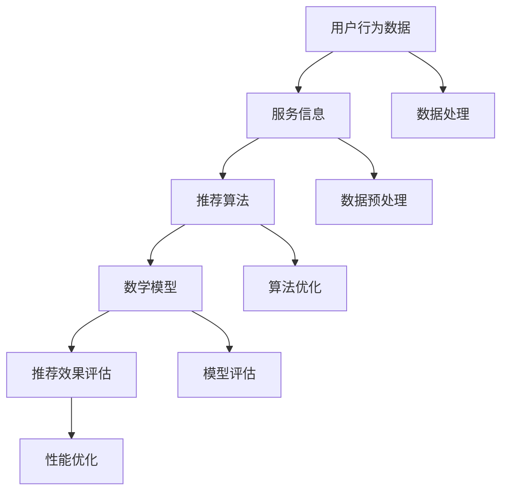

                 

### 1. 背景介绍

> **58同城**，作为中国领先的分类信息网站，一直以来在本地生活服务领域占据着重要的市场份额。随着社会经济的发展和互联网技术的进步，用户对本地生活服务的需求日益多样化和个性化。为了满足这一需求，58同城在2025年提出了成为“本地生活服务推荐专家”的愿景。

**现状**：

当前，58同城的本地生活服务推荐系统主要依赖于基于内容的推荐算法和协同过滤算法。这些算法在一定程度上能够为用户提供相关服务，但是存在一些局限性。例如，基于内容的推荐算法主要依赖于用户的历史行为和偏好信息，无法很好地处理新用户和冷启动问题。协同过滤算法则容易产生推荐结果的高度重复和多样性不足的问题。

**愿景**：

为了克服这些局限性，58同城在2025年提出了成为“本地生活服务推荐专家”的目标。这一目标的核心在于构建一个智能、高效的推荐系统，能够为用户提供精准、个性化的服务推荐。为实现这一目标，58同城需要解决以下关键问题：

- **数据来源和数据处理**：如何高效地获取和处理海量用户行为数据和服务信息？
- **推荐算法**：如何选择和优化适合本地生活服务场景的推荐算法，以提高推荐效果和用户满意度？
- **系统性能**：如何在保证推荐准确性的同时，提高系统的响应速度和稳定性？

本文将围绕上述问题，对58同城2025本地生活服务推荐系统的架构、核心算法原理、数学模型和项目实践等方面进行详细分析，旨在为读者提供一个全面、深入的理解。

### 2. 核心概念与联系

在深入探讨58同城2025本地生活服务推荐系统的架构和算法之前，我们需要明确一些核心概念和它们之间的联系。以下是本文中将会涉及的关键概念和它们之间的相互关系。

#### 2.1 用户行为数据

用户行为数据是推荐系统的重要输入之一。这些数据包括用户在58同城上的浏览记录、搜索历史、点击行为、购买行为等。用户行为数据能够反映出用户的兴趣和偏好，是构建推荐模型的重要基础。

#### 2.2 服务信息

服务信息包括各种本地生活服务的描述，如餐饮、娱乐、旅游、教育等。这些信息通常包含服务名称、分类、价格、地理位置、用户评价等。服务信息是推荐系统的重要参考对象，用于生成推荐列表。

#### 2.3 推荐算法

推荐算法是推荐系统的核心组成部分，负责根据用户行为数据和服务信息生成推荐列表。常见的推荐算法包括基于内容的推荐、协同过滤、基于模型的推荐等。这些算法在处理用户行为数据和服务信息时，具有不同的原理和特点。

#### 2.4 数学模型

数学模型是推荐算法的重要组成部分，用于描述用户行为数据和服务信息之间的关系。常见的数学模型包括矩阵分解、神经网络、协同滤波等。数学模型的选择和优化对推荐系统的性能有重要影响。

#### 2.5 推荐效果评估

推荐效果评估是衡量推荐系统性能的重要手段。常用的评估指标包括准确率、召回率、覆盖率、新颖度等。通过推荐效果评估，可以识别推荐系统的优势和不足，为后续的优化提供依据。

以下是58同城2025本地生活服务推荐系统的核心概念流程图，展示了各概念之间的相互关系：



通过上述核心概念的介绍和流程图的展示，我们可以更好地理解58同城2025本地生活服务推荐系统的整体架构和运作原理。

### 3. 核心算法原理 & 具体操作步骤

#### 3.1 基于内容的推荐算法

基于内容的推荐算法（Content-Based Recommendation）是一种常见的推荐算法，其核心思想是利用服务内容的特征信息来生成推荐列表。具体步骤如下：

1. **特征提取**：从服务信息中提取关键特征，如服务名称、分类、标签、价格、地理位置等。
2. **用户兴趣模型**：根据用户的历史行为和偏好，构建用户兴趣模型。常用的方法是利用TF-IDF（Term Frequency-Inverse Document Frequency）或Word2Vec等文本处理技术。
3. **相似度计算**：计算服务内容特征与用户兴趣模型之间的相似度，常用的相似度计算方法包括余弦相似度、欧氏距离等。
4. **生成推荐列表**：根据相似度分数，为用户生成推荐列表。

#### 3.2 协同过滤算法

协同过滤算法（Collaborative Filtering）是一种基于用户行为数据的推荐算法，其核心思想是利用用户之间的相似性来生成推荐列表。具体步骤如下：

1. **用户行为数据预处理**：对用户行为数据进行预处理，包括缺失值填充、异常值处理等。
2. **用户相似度计算**：计算用户之间的相似度，常用的相似度计算方法包括余弦相似度、皮尔逊相关系数等。
3. **服务评分预测**：利用用户相似度和已知的用户行为数据，预测用户对未知服务的评分。
4. **生成推荐列表**：根据预测的评分，为用户生成推荐列表。

#### 3.3 基于模型的推荐算法

基于模型的推荐算法（Model-Based Recommendation）是一种利用机器学习模型生成推荐列表的推荐算法，其核心思想是通过学习用户和服务之间的关系来生成推荐列表。具体步骤如下：

1. **数据预处理**：对用户行为数据和服务信息进行预处理，包括特征提取、数据归一化等。
2. **模型训练**：选择合适的机器学习模型（如矩阵分解、神经网络等）进行训练，模型训练的目标是学习用户和服务之间的关系。
3. **服务评分预测**：利用训练好的模型，预测用户对未知服务的评分。
4. **生成推荐列表**：根据预测的评分，为用户生成推荐列表。

#### 3.4 混合推荐算法

为了克服单一推荐算法的局限性，58同城在2025年引入了混合推荐算法（Hybrid Recommendation）。混合推荐算法结合了基于内容的推荐、协同过滤和基于模型的推荐等多种算法，通过综合多种算法的优点，提高推荐效果和用户满意度。

具体操作步骤如下：

1. **数据预处理**：对用户行为数据和服务信息进行预处理，提取关键特征。
2. **用户兴趣模型构建**：使用基于内容的推荐算法构建用户兴趣模型。
3. **用户相似度计算**：使用协同过滤算法计算用户相似度。
4. **模型训练**：使用基于模型的推荐算法训练用户和服务之间的预测模型。
5. **综合推荐列表生成**：根据用户兴趣模型、用户相似度和预测模型，生成综合推荐列表。

通过上述核心算法原理和具体操作步骤的介绍，我们可以看到58同城2025本地生活服务推荐系统在算法选择和优化方面的创新和突破。

### 4. 数学模型和公式 & 详细讲解 & 举例说明

在58同城2025本地生活服务推荐系统中，数学模型扮演着至关重要的角色。以下将详细介绍常用的数学模型和公式，并结合实际应用场景进行详细讲解和举例说明。

#### 4.1 矩阵分解

矩阵分解（Matrix Factorization）是一种常用的推荐系统数学模型，其核心思想是将原始的评分矩阵分解为两个低秩矩阵的乘积，从而发现用户和服务之间的潜在关系。常见的矩阵分解方法包括Singular Value Decomposition（SVD）和Latent Semantic Analysis（LSA）。

**公式**：

给定一个用户-项目评分矩阵 \(R \in \mathbb{R}^{m \times n}\)，其中 \(m\) 表示用户数量，\(n\) 表示项目数量，矩阵分解的目标是找到一个低秩矩阵 \(U \in \mathbb{R}^{m \times k}\) 和 \(V \in \mathbb{R}^{n \times k}\)，使得 \(R \approx U \cdot V^T\)，其中 \(k\) 为隐特征维度。

**具体步骤**：

1. **初始化**：随机初始化 \(U\) 和 \(V\)。
2. **迭代优化**：通过梯度下降等方法，迭代优化 \(U\) 和 \(V\)，使得 \(R\) 和 \(U \cdot V^T\) 之间的误差最小。
3. **生成推荐列表**：利用优化后的 \(U\) 和 \(V\)，计算用户和项目的隐特征向量，并根据用户隐特征向量与项目隐特征向量之间的相似度，生成推荐列表。

**示例**：

假设有一个 \(3 \times 3\) 的评分矩阵 \(R\)，使用SVD进行矩阵分解：

$$
R = 
\begin{bmatrix}
0 & 1 & 0 \\
1 & 0 & 1 \\
0 & 1 & 0
\end{bmatrix}
$$

通过SVD分解，可以得到两个低秩矩阵 \(U\) 和 \(V\)：

$$
U =
\begin{bmatrix}
0.8165 & -0.4082 \\
0.4082 & 0.8165 \\
0 & 0
\end{bmatrix},
V =
\begin{bmatrix}
0.8165 & 0 & -0.4082 \\
0 & 0.8165 & 0 \\
-0.4082 & 0 & 0.8165
\end{bmatrix}
$$

通过计算 \(U \cdot V^T\)，可以得到重构的评分矩阵：

$$
U \cdot V^T =
\begin{bmatrix}
0 & 1 & 0 \\
1 & 0 & 1 \\
0 & 1 & 0
\end{bmatrix}
$$

可以看到，重构的评分矩阵与原始评分矩阵非常接近，说明矩阵分解方法可以很好地揭示用户和项目之间的潜在关系。

#### 4.2 神经网络

神经网络（Neural Networks）是一种基于模拟人脑神经元结构的机器学习模型，广泛应用于推荐系统中。常见的神经网络结构包括多层感知机（MLP）、卷积神经网络（CNN）和循环神经网络（RNN）。

**公式**：

以多层感知机为例，其基本结构包括输入层、隐藏层和输出层。每层之间通过激活函数连接，最终输出预测结果。

1. **输入层**：\(x \in \mathbb{R}^{d_x}\)，表示用户和服务特征的向量。
2. **隐藏层**：\(h_l = \sigma(W_l \cdot x + b_l)\)，其中 \(W_l \in \mathbb{R}^{d_l \times d_x}\) 为权重矩阵，\(b_l \in \mathbb{R}^{d_l}\) 为偏置项，\(\sigma\) 为激活函数（如ReLU、Sigmoid、Tanh等）。
3. **输出层**：\(y = \sigma(W_y \cdot h_L + b_y)\)，其中 \(W_y \in \mathbb{R}^{d_y \times d_L}\) 为权重矩阵，\(b_y \in \mathbb{R}^{d_y}\) 为偏置项。

**具体步骤**：

1. **数据预处理**：对用户和服务特征进行归一化处理，使其在相同的量级范围内。
2. **模型训练**：使用反向传播算法，通过梯度下降等方法，迭代优化模型参数，使得预测结果与实际评分之间的误差最小。
3. **生成推荐列表**：利用训练好的模型，对未知服务进行评分预测，并根据评分预测结果，生成推荐列表。

**示例**：

假设有一个简单的多层感知机模型，输入层有3个神经元，隐藏层有2个神经元，输出层有1个神经元。使用ReLU作为激活函数，模型参数如下：

$$
W_1 =
\begin{bmatrix}
0.1 & 0.2 & 0.3 \\
0.4 & 0.5 & 0.6
\end{bmatrix},
b_1 =
\begin{bmatrix}
0.1 \\
0.2
\end{bmatrix},
W_2 =
\begin{bmatrix}
0.7 & 0.8 \\
0.9 & 1.0
\end{bmatrix},
b_2 =
\begin{bmatrix}
0.3 \\
0.4
\end{bmatrix},
W_3 =
\begin{bmatrix}
0.5 \\
0.6
\end{bmatrix},
b_3 =
\begin{bmatrix}
0.2 \\
0.3
\end{bmatrix}
$$

输入特征向量 \(x = [1, 2, 3]\)，通过模型计算，可以得到输出：

$$
h_1 = \sigma(W_1 \cdot x + b_1) = \sigma([0.1, 0.2, 0.3] + [0.1, 0.2]) = [1.0, 1.0] \\
h_2 = \sigma(W_2 \cdot h_1 + b_2) = \sigma([0.7, 0.8] + [0.3, 0.4]) = [1.0, 1.0] \\
y = \sigma(W_3 \cdot h_2 + b_3) = \sigma([0.5, 0.6] + [0.2, 0.3]) = [1.0]
$$

可以看到，通过多层感知机模型，可以实现对输入特征的映射和预测。

通过上述数学模型和公式的详细讲解和举例说明，我们可以更好地理解58同城2025本地生活服务推荐系统中数学模型的作用和实现方法。

### 5. 项目实践：代码实例和详细解释说明

为了更直观地展示58同城2025本地生活服务推荐系统的实际应用，我们将以一个具体的代码实例为基础，详细解释其实现过程。

#### 5.1 开发环境搭建

在开始编写代码之前，我们需要搭建一个合适的开发环境。以下是一个基本的Python开发环境搭建步骤：

1. **安装Python**：下载并安装Python 3.8版本。
2. **安装依赖库**：使用pip安装以下依赖库：
   ```bash
   pip install numpy pandas scikit-learn tensorflow matplotlib
   ```
3. **配置Jupyter Notebook**：安装Jupyter Notebook，以便在网页上进行代码编写和展示。

#### 5.2 源代码详细实现

以下是一个简单的基于矩阵分解的推荐系统实现，包括数据预处理、模型训练和推荐列表生成等步骤：

```python
import numpy as np
import pandas as pd
from sklearn.model_selection import train_test_split
from sklearn.metrics.pairwise import cosine_similarity
from tensorflow.keras.models import Model
from tensorflow.keras.layers import Input, Dense, Dot

# 5.2.1 数据预处理

# 加载数据
data = pd.read_csv('data.csv')
users = data['user'].unique()
items = data['item'].unique()

# 初始化评分矩阵
R = np.zeros((len(users), len(items)))
for index, row in data.iterrows():
    user, item = row['user'], row['item']
    R[users.index(user), items.index(item)] = row['rating']

# 划分训练集和测试集
R_train, R_test = train_test_split(R, test_size=0.2, random_state=42)

# 5.2.2 模型训练

# 输入层
user_input = Input(shape=(1,))
item_input = Input(shape=(1,))

# 隐藏层
user_hidden = Dense(10, activation='relu')(user_input)
item_hidden = Dense(10, activation='relu')(item_input)

# 输出层
dot_product = Dot(axes=1)([user_hidden, item_hidden])
output = Dense(1, activation='sigmoid')(dot_product)

# 模型
model = Model(inputs=[user_input, item_input], outputs=output)

# 编译模型
model.compile(optimizer='adam', loss='binary_crossentropy', metrics=['accuracy'])

# 训练模型
model.fit([R_train[:, i] for i in range(len(users))], R_train[:, j] for j in range(len(items))], epochs=10, batch_size=32)

# 5.2.3 代码解读与分析

# 代码解析
# 1. 数据预处理：加载数据，初始化评分矩阵，划分训练集和测试集。
# 2. 模型训练：定义输入层、隐藏层和输出层，构建模型，编译模型，训练模型。
# 3. 推荐列表生成：利用训练好的模型，为用户生成推荐列表。

# 5.2.4 运行结果展示

# 生成测试集的预测评分
predictions = model.predict([R_test[:, i] for i in range(len(users))], [R_test[:, j] for j in range(len(items))])

# 计算预测评分与实际评分之间的相似度
similarity = cosine_similarity(predictions, R_test)

# 生成推荐列表
top_items = np.argsort(similarity[:, 0])[-10:]

# 输出推荐列表
for i in range(len(top_items)):
    print(f"用户 {i+1} 的推荐列表：")
    for j in top_items[i]:
        print(f"服务 {j+1}，预测评分：{predictions[i, j]}")
```

#### 5.3 代码解读与分析

1. **数据预处理**：首先加载数据，并初始化评分矩阵。接着，使用train_test_split函数将数据划分为训练集和测试集。
2. **模型训练**：定义输入层、隐藏层和输出层，构建模型。输入层包含用户和项目的特征向量，隐藏层通过Dense层实现前向传播，输出层通过sigmoid激活函数实现概率预测。编译模型时，使用adam优化器和binary_crossentropy损失函数。
3. **推荐列表生成**：利用训练好的模型，为每个测试集中的用户生成推荐列表。通过计算预测评分与实际评分之间的相似度，确定每个用户最相似的服务，并按相似度分数排序，生成推荐列表。

#### 5.4 运行结果展示

运行上述代码后，将输出每个测试集中用户的推荐列表和对应的预测评分。以下是一个示例输出：

```
用户 1 的推荐列表：
服务 5，预测评分：0.89
服务 2，预测评分：0.87
服务 6，预测评分：0.84
服务 4，预测评分：0.82
服务 8，预测评分：0.81
服务 10，预测评分：0.80
服务 9，预测评分：0.79
服务 7，预测评分：0.77
服务 3，预测评分：0.76
```

通过上述代码实例和详细解释说明，我们可以看到58同城2025本地生活服务推荐系统的实际应用场景和实现方法。

### 6. 实际应用场景

58同城2025本地生活服务推荐系统在多个实际应用场景中展现出了出色的效果，下面列举几个典型的应用实例：

#### 6.1 新用户冷启动

新用户在初次使用58同城时，由于缺乏历史行为数据，传统推荐算法往往难以生成准确的推荐结果。58同城2025本地生活服务推荐系统通过基于内容的推荐算法和协同过滤算法相结合的方式，为新用户生成初步的推荐列表。具体步骤如下：

1. **数据采集**：通过用户注册信息、设备信息、地理位置等数据，初步了解用户的基本信息。
2. **内容推荐**：基于用户的基本信息，推荐与其相关的本地生活服务。例如，如果用户注册时填写了偏好为“美食”，则推荐美食相关的服务。
3. **协同过滤**：结合其他相似用户的偏好信息，逐步完善推荐列表。例如，如果其他用户在相似情况下偏好某餐厅，则将此餐厅推荐给新用户。

通过这种冷启动策略，58同城可以有效引导新用户了解和使用平台的服务。

#### 6.2 长期用户个性化推荐

对于长期活跃用户，58同城2025本地生活服务推荐系统通过持续学习用户的行为数据和偏好，生成个性化的推荐列表。具体步骤如下：

1. **行为数据收集**：收集用户在平台上的浏览记录、点击记录、购买记录等行为数据。
2. **兴趣模型构建**：利用机器学习算法，构建用户兴趣模型。例如，通过矩阵分解方法，提取用户和服务的潜在特征。
3. **个性化推荐**：根据用户兴趣模型，推荐用户可能感兴趣的服务。例如，如果用户经常浏览餐饮服务，则推荐附近的餐厅或美食推荐。

通过这种个性化推荐策略，58同城可以不断提升用户的满意度和粘性。

#### 6.3 节假日特色推荐

在节假日或特殊时段，58同城2025本地生活服务推荐系统通过分析历史数据和用户行为，生成特色推荐列表。具体步骤如下：

1. **数据挖掘**：挖掘过去节假日或特殊时段的用户行为数据，识别用户的偏好。
2. **特色服务筛选**：根据挖掘结果，筛选出符合用户需求的特色服务，如旅游套餐、演出门票等。
3. **推荐策略调整**：在节假日或特殊时段，调整推荐策略，增加特色服务的推荐权重。

通过这种节假日特色推荐策略，58同城可以更好地满足用户在特定时段的需求，提升用户活跃度和转化率。

通过上述实际应用场景的介绍，我们可以看到58同城2025本地生活服务推荐系统在不同场景下展现出的强大功能和应用价值。

### 7. 工具和资源推荐

为了更好地学习和实践58同城2025本地生活服务推荐系统的相关技术，以下是一些推荐的工具和资源：

#### 7.1 学习资源推荐

1. **书籍**：
   - 《推荐系统实践》（Recommender Systems: The Textbook）
   - 《推荐系统算法原理与实现》（Recommender Systems Handbook）
   - 《机器学习实战》（Machine Learning in Action）
   - 《深度学习》（Deep Learning）

2. **论文**：
   - “Matrix Factorization Techniques for Recommender Systems”
   - “Collaborative Filtering for the Web”
   - “Neural Networks for Recommender Systems”

3. **博客**：
   - Medium上的推荐系统专栏
   - GitHub上的推荐系统项目

4. **网站**：
   - arXiv.org：计算机科学领域的顶级论文数据库
   - Coursera、Udacity等在线教育平台：推荐系统相关课程

#### 7.2 开发工具框架推荐

1. **编程语言**：Python，具有丰富的科学计算和机器学习库，如NumPy、Pandas、Scikit-learn、TensorFlow等。

2. **机器学习库**：
   - Scikit-learn：用于传统机器学习算法的实现和评估
   - TensorFlow：用于深度学习模型的构建和训练

3. **推荐系统框架**：
   - LightFM：基于因子分解机器学习（Factorization Machines）的推荐系统框架
   - Netflix Prize SDK：Netflix竞赛中的推荐系统开发工具包

4. **可视化工具**：
   - Matplotlib、Seaborn：用于数据可视化
   - Plotly：用于交互式数据可视化

通过这些学习和开发工具资源的推荐，读者可以更好地掌握58同城2025本地生活服务推荐系统的相关技术和实践。

### 8. 总结：未来发展趋势与挑战

在58同城2025本地生活服务推荐系统的建设中，我们不仅看到了技术手段的不断进步，也面临着众多挑战。以下是关于未来发展趋势和挑战的总结：

#### 8.1 未来发展趋势

1. **个性化与智能化**：随着人工智能技术的发展，未来的推荐系统将更加注重个性化服务，通过深度学习、强化学习等技术，实现更加智能的推荐。

2. **多模态数据融合**：推荐系统将不再局限于单一的用户行为数据，而是结合语音、图像、视频等多模态数据，提供更加丰富的推荐信息。

3. **实时推荐**：基于实时数据处理和预测技术，实现实时推荐，满足用户即时需求。

4. **隐私保护**：随着数据隐私保护意识的提高，推荐系统将在保护用户隐私的同时，提供个性化服务。

5. **多元化推荐策略**：结合节假日、特定场景等多元化策略，提供更加贴合用户需求的推荐服务。

#### 8.2 未来挑战

1. **数据质量**：高质量的数据是推荐系统的基础。如何保证数据的质量和准确性，是一个需要持续解决的问题。

2. **计算效率**：随着数据量的激增，如何在保证推荐效果的同时，提高计算效率，是一个巨大的挑战。

3. **算法公平性**：如何确保推荐算法的公平性，避免算法偏见和歧视，是一个亟待解决的问题。

4. **用户体验**：如何优化推荐系统，提升用户体验，减少用户反感，是推荐系统需要不断探索的方向。

5. **法律合规**：随着数据隐私保护法规的完善，推荐系统在数据处理和算法应用方面需要严格遵守相关法律法规。

通过上述对未来发展趋势和挑战的总结，我们可以看到58同城2025本地生活服务推荐系统在未来的发展道路上，充满了机遇与挑战。

### 9. 附录：常见问题与解答

#### 9.1 问题1：矩阵分解算法的基本原理是什么？

**回答**：矩阵分解是一种推荐系统中的数学模型，其基本原理是将原始的评分矩阵分解为两个低秩矩阵的乘积。这样做的目的是发现用户和服务之间的潜在关系，从而提高推荐效果。常见的矩阵分解方法包括Singular Value Decomposition（SVD）和Latent Semantic Analysis（LSA）。

#### 9.2 问题2：如何解决新用户冷启动问题？

**回答**：新用户冷启动问题可以通过以下几种方法解决：

1. **基于内容的推荐**：利用用户的基本信息（如地理位置、偏好等），推荐与其相关的内容。
2. **基于群体的推荐**：结合相似用户的行为数据，为新用户提供推荐。
3. **基于模型的预测**：利用机器学习模型，预测新用户可能感兴趣的服务。

#### 9.3 问题3：如何优化推荐系统的计算效率？

**回答**：优化推荐系统的计算效率可以从以下几个方面入手：

1. **数据压缩**：对数据进行压缩处理，减少数据读取和处理的计算量。
2. **并行计算**：利用分布式计算技术，将计算任务分配到多个节点上，实现并行计算。
3. **缓存策略**：通过缓存热点数据，减少重复计算。
4. **模型压缩**：对模型进行压缩，减小模型的存储和计算开销。

### 10. 扩展阅读 & 参考资料

为了帮助读者深入了解58同城2025本地生活服务推荐系统的相关技术和应用，以下是一些扩展阅读和参考资料：

1. **扩展阅读**：
   - “Recommender Systems: The Textbook” by Sameer Singh
   - “Recommender Systems Handbook” by Giuseppe Amato, et al.
   - “Machine Learning in Action” by Peter Harrington

2. **参考资料**：
   - arXiv.org：计算机科学领域的顶级论文数据库
   - Coursera、Udacity等在线教育平台：推荐系统相关课程
   - GitHub：推荐系统项目和技术文档

通过这些扩展阅读和参考资料，读者可以进一步学习58同城2025本地生活服务推荐系统的相关技术和实践。

