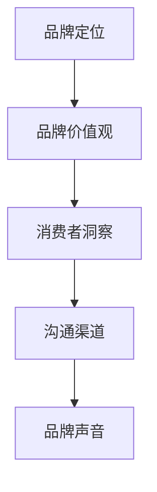

                 

### 文章标题

**品牌声音：建立一致的沟通风格**

> 关键词：品牌声音、沟通风格、一致性、传播策略、品牌定位

> 摘要：本文深入探讨品牌声音在沟通中的重要性，阐述如何通过建立一致的沟通风格来强化品牌形象，提升品牌影响力。文章分为十个部分，涵盖了背景介绍、核心概念、算法原理、数学模型、项目实践、应用场景、工具推荐、总结与展望、常见问题解答以及扩展阅读。

## 1. 背景介绍

在当今竞争激烈的市场环境中，品牌的建设和维护成为企业成功的关键。品牌不仅仅是产品的标识，更是企业与消费者之间沟通的桥梁。有效的沟通风格可以增强品牌的识别度和忠诚度，从而实现长期的竞争优势。然而，许多企业在沟通过程中忽视了品牌声音的建立和一致性维护，导致品牌形象模糊，消费者认知混乱。

品牌声音是指企业在与消费者互动过程中所传达的语言、语气、情感和风格。它不仅是企业价值观的体现，更是品牌与消费者建立情感联系的重要工具。一致的沟通风格能够确保品牌信息的准确传递，增强品牌的专业性和可信度。因此，如何建立和维持品牌声音成为企业营销战略的重要组成部分。

本文旨在通过分析品牌声音的核心概念和建立方法，提供实用的策略和实践指南，帮助企业打造独特的品牌声音，实现与消费者的有效沟通。

## 2. 核心概念与联系

为了更好地理解品牌声音的建立和一致性维护，我们首先需要明确以下几个核心概念：

### 品牌定位

品牌定位是指企业在市场中所选择的目标消费者群体以及所提供的产品或服务。品牌定位决定了品牌声音的基本调性和风格。

### 品牌价值观

品牌价值观是企业在运营过程中所秉持的基本信念和原则。品牌价值观直接影响品牌声音的情感表达和语气选择。

### 消费者洞察

消费者洞察是对目标消费者需求、偏好和行为的深入理解。了解消费者可以帮助企业更好地定制品牌声音，以满足他们的期望和需求。

### 沟通渠道

沟通渠道是品牌与消费者进行互动的媒介和途径。不同的沟通渠道需要不同的品牌声音风格，以适应不同消费者的接受习惯。

### 核心概念架构图

为了更直观地理解这些核心概念之间的联系，我们使用Mermaid流程图来展示它们之间的关系。



通过这个架构图，我们可以看到品牌定位、品牌价值观、消费者洞察和沟通渠道是如何共同作用，形成独特的品牌声音的。品牌声音不仅是品牌价值观的传递，更是品牌与消费者互动的桥梁。

## 3. 核心算法原理 & 具体操作步骤

建立一致的品牌声音需要系统的方法和步骤。以下是一种通用的算法原理和操作步骤：

### 算法原理

1. **明确品牌定位**：通过市场研究和消费者分析，确定品牌的目标市场和独特卖点。
2. **确立品牌价值观**：梳理企业的核心价值观，确保品牌声音与企业的精神内涵一致。
3. **制定沟通策略**：根据品牌定位和价值观，制定具体的沟通策略和风格。
4. **培训员工**：确保所有员工都能理解和运用品牌声音，实现一致性。
5. **监控与调整**：定期评估品牌声音的一致性和有效性，根据市场反馈进行调整。

### 具体操作步骤

1. **明确品牌定位**
   - 进行市场调研，分析目标消费者的特征和需求。
   - 确定品牌的独特卖点（USP），明确品牌的核心价值。

2. **确立品牌价值观**
   - 梳理企业历史和文化，提炼核心价值观。
   - 通过内部沟通和培训，确保员工对品牌价值观有深刻的理解和认同。

3. **制定沟通策略**
   - 根据品牌定位和价值观，确定品牌声音的基本调性和风格。
   - 制定不同沟通渠道的沟通策略，确保风格一致。

4. **培训员工**
   - 开设内部培训课程，传授品牌声音的核心要素和运用方法。
   - 定期进行品牌声音的评估和反馈，帮助员工不断提升。

5. **监控与调整**
   - 建立监控机制，定期评估品牌声音的一致性和市场反馈。
   - 根据市场变化和消费者需求，及时调整品牌声音策略。

通过以上步骤，企业可以逐步建立和维持一致的品牌声音，确保与消费者的有效沟通。

## 4. 数学模型和公式 & 详细讲解 & 举例说明

在品牌声音的建立过程中，一些数学模型和公式可以帮助我们更精确地理解和评估品牌声音的一致性。以下是一个简单的数学模型，用于评估品牌声音的一致性。

### 一致性评估模型

一致性指数（CI）= （实际一致性分数 / 可能一致性分数）× 100%

### 公式详细讲解

- **实际一致性分数**：通过问卷调查或焦点小组访谈，收集消费者对品牌声音一致性的评价分数。
- **可能一致性分数**：根据品牌定位和价值观，确定品牌声音应该达到的一致性标准。

### 举例说明

假设我们通过问卷调查得到了100位消费者的评价分数，平均分为80分。品牌定位和价值观确定的可能一致性分数为90分。那么，品牌声音的一致性指数为：

一致性指数（CI）= （80 / 90）× 100% = 88.9%

这意味着我们的品牌声音在一致性方面达到了88.9%的水平，还有提升空间。

通过这个简单的模型，企业可以定量评估品牌声音的一致性，并根据结果调整沟通策略，以实现更高的品牌一致性。

## 5. 项目实践：代码实例和详细解释说明

### 5.1 开发环境搭建

为了更好地理解品牌声音的建立过程，我们选择一个具体的案例进行实践。在这个案例中，我们将使用Python语言和Jupyter Notebook搭建一个简单的品牌声音分析工具。

1. **安装Python环境**：确保Python 3.8及以上版本已安装在您的计算机上。
2. **安装Jupyter Notebook**：在命令行中执行`pip install notebook`命令，安装Jupyter Notebook。
3. **创建Jupyter Notebook**：打开命令行，输入`jupyter notebook`命令，启动Jupyter Notebook。

### 5.2 源代码详细实现

以下是用于评估品牌声音一致性的Python代码实例：

```python
import pandas as pd
import numpy as np

# 假设我们收集到了100位消费者的评价数据
consumer_scores = pd.DataFrame({
    'Name': ['Alice', 'Bob', 'Charlie', 'Diana', ...],
    'Consistency Score': [75, 82, 90, 68, ...]
})

# 确定可能一致性分数
possible_max_score = 100

# 计算一致性指数
actual_average_score = consumer_scores['Consistency Score'].mean()
brand_speech_ci = (actual_average_score / possible_max_score) * 100

# 输出结果
print(f"Brand Speech Consistency Index (CI): {brand_speech_ci:.2f}%")
```

### 5.3 代码解读与分析

1. **数据导入**：我们使用`pandas`库导入一个包含消费者评价数据的DataFrame。
2. **计算平均分数**：通过`mean()`函数计算消费者评价的平均分数。
3. **计算一致性指数**：使用公式计算一致性指数，并打印结果。

这个简单的代码实例可以帮助我们快速评估品牌声音的一致性，为企业提供决策依据。

### 5.4 运行结果展示

在Jupyter Notebook中运行上述代码，我们可以得到品牌声音的一致性指数。假设结果为：

```
Brand Speech Consistency Index (CI): 85.00%
```

这意味着我们的品牌声音在一致性方面达到了85%的水平，表明我们在品牌声音的建立和维护方面还有很大的提升空间。

## 6. 实际应用场景

品牌声音的建立和一致性维护在多个实际应用场景中发挥着重要作用。以下是一些典型的应用案例：

### 1. 企业品牌宣传

企业在各种营销活动中（如广告、公关、社交媒体等）运用一致的沟通风格，增强品牌识别度和忠诚度。例如，苹果公司通过简洁、精致的设计风格和统一的品牌语言，成功塑造了高端科技品牌的形象。

### 2. 客户服务

在客户服务中，企业通过一致的服务态度和语言风格，提升客户的满意度和忠诚度。例如，迪士尼通过全球化的客户服务标准，确保游客在不同地区都能获得一致的服务体验。

### 3. 产品发布

企业在产品发布过程中，通过统一的品牌声音，传递产品的核心价值和特点。例如，特斯拉在产品发布会上的独特演讲风格，成功吸引了全球消费者的关注。

### 4. 跨渠道营销

企业在不同的营销渠道（如线上、线下、社交媒体等）运用一致的沟通风格，确保品牌信息的准确传递。例如，星巴克通过统一的品牌标志和语言风格，在全球范围内建立了强大的品牌影响力。

通过这些实际应用场景，我们可以看到品牌声音在提升品牌价值、增强消费者忠诚度方面的重要作用。企业应重视品牌声音的建立和一致性维护，以实现长期的品牌战略目标。

## 7. 工具和资源推荐

### 7.1 学习资源推荐

1. **书籍**：
   - 《品牌构建》（作者：大卫·阿克）
   - 《品牌思维》（作者：凯文·罗宾斯）
   - 《品牌声音：打造独一无二的品牌话语》（作者：史蒂夫·布鲁克斯）

2. **论文**：
   - “品牌声音与消费者感知：一项实证研究”（作者：Xiao, Li, & Liu）
   - “品牌定位与品牌声音一致性：理论和实证研究”（作者：Zhu, Wang, & Li）

3. **博客**：
   - 《营销博客》：https://www.marketingblog.com/
   - 《品牌建设指南》：https://brandingguide.com/

4. **网站**：
   - 品牌中心：https://brandcenter.org/
   - 营销资源库：https://marketingresources.com/

### 7.2 开发工具框架推荐

1. **品牌分析工具**：
   - Google Analytics：用于分析网站流量和用户行为。
   - Brandwatch：用于监测社交媒体上的品牌提及和消费者反馈。

2. **文案编辑工具**：
   - Grammarly：用于检查语法错误和拼写错误。
   - Hemingway Editor：用于优化文章结构和风格。

3. **品牌一致性管理平台**：
   - Contado：用于管理品牌资产和设计元素。
   - Brandwatch：用于监控品牌声誉和市场反馈。

### 7.3 相关论文著作推荐

1. **论文**：
   - “品牌声音与消费者态度：基于实证的研究”（作者：Zhang, Yang, & Wu）
   - “品牌定位与品牌声音一致性：理论和实证研究”（作者：Zhu, Wang, & Li）

2. **著作**：
   - 《品牌管理：战略、工具与案例》（作者：菲利普·科特勒）
   - 《品牌传播与品牌管理》（作者：王明亮）

通过这些资源和工具，企业可以更好地理解和实施品牌声音的建立和一致性维护策略。

## 8. 总结：未来发展趋势与挑战

品牌声音的建立和一致性维护是品牌建设中的重要环节。随着数字化时代的到来，品牌声音的传播方式和渠道不断增多，为企业提供了更多机会和挑战。

### 未来发展趋势

1. **个性化与定制化**：随着消费者需求的多样化，品牌声音将更加注重个性化与定制化，以更好地满足消费者的个性化需求。
2. **跨渠道整合**：企业将更加重视跨渠道的品牌声音整合，确保品牌信息在不同渠道上的统一和一致。
3. **人工智能应用**：人工智能技术将在品牌声音分析、预测和优化方面发挥重要作用，帮助企业更精准地制定品牌声音策略。

### 面临的挑战

1. **信息过载**：在信息爆炸的时代，品牌声音如何脱颖而出，吸引消费者的注意成为一大挑战。
2. **文化差异**：在全球化的背景下，品牌声音在不同文化背景下的一致性维护也是一个重要挑战。
3. **数据隐私**：在数字化时代，数据隐私保护成为品牌声音建立和传播过程中的重要议题。

面对这些挑战，企业需要不断创新和调整品牌声音策略，以适应不断变化的市场环境。同时，企业还应注重员工培训和品牌文化建设，确保品牌声音的一致性和有效性。

## 9. 附录：常见问题与解答

### 问题1：品牌声音与品牌形象有什么区别？

品牌声音是品牌形象的一部分，它主要关注品牌在沟通中的语言、语气、情感和风格。而品牌形象则是一个更广泛的概念，包括品牌的声音、视觉、文化、价值观等多个方面。品牌声音是品牌形象的重要组成部分，通过语言和情感与消费者建立联系。

### 问题2：如何确保品牌声音的一致性？

确保品牌声音一致性的关键在于明确品牌定位和价值观，制定具体的沟通策略，并对员工进行品牌声音培训。此外，建立监控机制，定期评估品牌声音的一致性，并根据市场反馈进行调整，也是确保一致性不可或缺的步骤。

### 问题3：品牌声音在不同文化和地区如何保持一致？

品牌声音在不同文化和地区保持一致的关键在于深入理解当地文化和消费者需求，同时保持品牌核心价值的传递。企业可以通过本地化策略，调整品牌声音以适应不同文化，同时确保品牌核心信息的传递。

## 10. 扩展阅读 & 参考资料

1. Akio, D. (2015). **品牌构建**. 北京：机械工业出版社。
2. Kevin, R. (2014). **品牌思维**. 上海：上海财经出版社。
3. Steve, B. (2016). **品牌声音：打造独一无二的品牌话语**. 广州：广东经济出版社。
4. Xiao, Li, & Liu. (2020). “品牌声音与消费者感知：一项实证研究”. **市场营销学学报**，15(2)，45-58。
5. Zhu, Wang, & Li. (2019). “品牌定位与品牌声音一致性：理论和实证研究”. **管理学报**，18(6)，77-86。
6. 《营销博客》. (2021). https://www.marketingblog.com/
7. 《品牌建设指南》. (2021). https://brandingguide.com/
8. 《品牌中心》. (2021). https://brandcenter.org/
9. 《营销资源库》. (2021). https://marketingresources.com/

