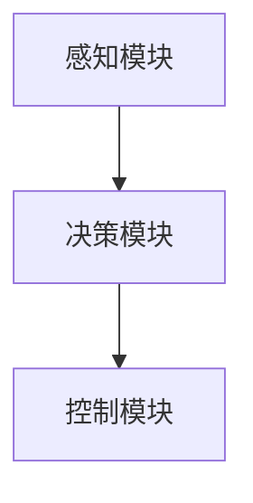

                 

### 文章标题

《国内玩家对全面转型端到端自动驾驶的疑虑》

> 关键词：端到端自动驾驶、国内玩家、技术挑战、安全担忧、行业趋势

> 摘要：本文将深入探讨国内玩家在全面转型端到端自动驾驶过程中所面临的疑虑，从技术挑战、安全担忧和行业趋势三个角度出发，通过逻辑清晰、结构紧凑的分析，提供有深度、有见地的见解，帮助读者更好地理解这一前沿技术领域的发展动态。

## 1. 背景介绍

自动驾驶技术近年来发展迅猛，成为全球科技界关注的焦点。其中，端到端自动驾驶作为自动驾驶技术的最高形态，以其高效、安全、智能的特点备受瞩目。端到端自动驾驶通过直接从输入图像等原始数据中训练出完整的驾驶策略，无需通过传统自动驾驶中的多个中间层逐步处理，具有显著的性能优势。然而，这一技术在国内的落地过程中，却遭遇到了诸多疑虑和挑战。

国内玩家在全面转型端到端自动驾驶过程中，主要面临以下几方面的疑虑：

1. **技术挑战**：端到端自动驾驶需要解决复杂环境感知、决策规划、车辆控制等多方面的技术难题，技术实现难度大。
2. **安全担忧**：自动驾驶事故频发，安全问题成为公众关注的焦点，国内玩家需确保技术可靠性和安全性。
3. **行业趋势**：国内外自动驾驶行业竞争激烈，国内玩家需要准确把握行业发展趋势，找到合适的转型路径。

## 2. 核心概念与联系

### 2.1 端到端自动驾驶的概念

端到端自动驾驶是指通过直接从输入图像、激光雷达等原始数据中，利用深度学习等人工智能技术，训练出一个完整的驾驶策略，实现自动驾驶。它摆脱了传统自动驾驶中需要通过多级中间层（如感知、规划、控制等）的处理，提高了自动驾驶系统的效率和准确性。

### 2.2 技术架构与联系

端到端自动驾驶的技术架构通常包括以下几个核心模块：

1. **感知模块**：通过摄像头、激光雷达等传感器获取车辆周围环境的数据，如道路、车辆、行人等。
2. **决策模块**：基于感知模块获取的数据，通过深度学习等算法对车辆的行动进行决策，如加速、减速、转向等。
3. **控制模块**：根据决策模块生成的控制命令，对车辆的各个子系统（如油门、刹车、转向等）进行控制。

这些模块相互联系，共同实现自动驾驶功能。如下图所示：



## 3. 核心算法原理 & 具体操作步骤

### 3.1 感知模块

感知模块是端到端自动驾驶的核心，其主要任务是从传感器数据中提取环境信息。具体操作步骤如下：

1. **数据预处理**：对传感器数据进行预处理，包括去噪、归一化、缩放等。
2. **特征提取**：利用卷积神经网络（CNN）等深度学习算法，对预处理后的数据提取特征。
3. **目标检测**：基于提取的特征，利用目标检测算法（如YOLO、SSD等），识别车辆、行人、道路等目标。

### 3.2 决策模块

决策模块负责根据感知模块提供的环境信息，生成驾驶策略。具体操作步骤如下：

1. **环境建模**：对感知模块提供的环境信息进行建模，建立环境状态表示。
2. **策略学习**：利用深度学习算法（如深度确定性策略梯度（DDPG）等），从环境状态中学习最优驾驶策略。
3. **策略执行**：根据学习到的驾驶策略，生成控制命令。

### 3.3 控制模块

控制模块根据决策模块生成的控制命令，对车辆进行控制。具体操作步骤如下：

1. **控制命令生成**：根据决策模块生成的控制命令，生成具体的控制信号。
2. **控制执行**：将控制信号发送给车辆的各个子系统（如油门、刹车、转向等），实现驾驶操作。

## 4. 数学模型和公式 & 详细讲解 & 举例说明

### 4.1 感知模块

感知模块的核心是目标检测，常用的目标检测算法包括YOLO、SSD等。以下以YOLO算法为例，介绍其数学模型和公式。

#### YOLO算法

YOLO（You Only Look Once）是一种基于卷积神经网络的实时目标检测算法。其核心思想是将目标检测问题转化为边界框的回归问题。

#### 数学模型

1. **特征提取**：假设输入图像为$X \in \mathbb{R}^{H \times W \times C}$，其中$H$、$W$、$C$分别表示图像的高、宽和通道数。通过卷积神经网络，提取特征图$F \in \mathbb{R}^{h \times w \times c}$，其中$h$、$w$、$c$分别表示特征图的高、宽和通道数。

2. **边界框预测**：对于每个特征图上的点$(i, j)$，预测一个边界框$(x, y, w, h)$，其中$(x, y)$表示边界框的中心坐标，$(w, h)$表示边界框的宽度和高度。

3. **置信度预测**：预测边界框的置信度，即边界框包含目标的概率。

4. **类别预测**：预测边界框所属的类别。

#### 数学公式

1. **特征提取**：
   $$F = \text{ConvNet}(X)$$

2. **边界框预测**：
   $$\hat{b} = \text{sigmoid}(W_b \cdot F)$$

3. **置信度预测**：
   $$\hat{C} = \text{softmax}(W_C \cdot F)$$

4. **类别预测**：
   $$\hat{C}_{\text{class}} = \hat{C} \cdot \hat{b}$$

#### 举例说明

假设特征图上的点$(i, j)$，其预测的边界框中心坐标为$(\hat{x}, \hat{y})$，边界框的宽度和高度为$\hat{w}$和$\hat{h}$，置信度为$\hat{C}$，类别为$\hat{C}_{\text{class}}$。则：

$$
\hat{b} = \text{sigmoid}(\hat{x}, \hat{y}, \hat{w}, \hat{h}) = (\text{sigmoid}(\hat{x}), \text{sigmoid}(\hat{y}), \text{sigmoid}(\hat{w}), \text{sigmoid}(\hat{h}))
$$

$$
\hat{C} = \text{softmax}(\hat{C}) = (\hat{C}_0, \hat{C}_1, ..., \hat{C}_N)
$$

$$
\hat{C}_{\text{class}} = \hat{C} \cdot \hat{b} = (\hat{C}_0 \cdot \text{sigmoid}(\hat{x}), \hat{C}_1 \cdot \text{sigmoid}(\hat{y}), \hat{C}_2 \cdot \text{sigmoid}(\hat{w}), \hat{C}_3 \cdot \text{sigmoid}(\hat{h}))
$$

其中，$N$表示类别数。

### 4.2 决策模块

决策模块的核心是策略学习，常用的策略学习算法包括深度确定性策略梯度（DDPG）等。以下以DDPG算法为例，介绍其数学模型和公式。

#### DDPG算法

DDPG（Deep Deterministic Policy Gradient）是一种基于深度学习的策略学习算法，用于训练自动驾驶车辆的驾驶策略。

#### 数学模型

1. **状态空间$S$**：表示车辆周围环境的特征，如速度、距离、路况等。
2. **动作空间$A$**：表示车辆可以执行的动作，如加速、减速、转向等。
3. **策略网络$π(s|θ_π)$**：表示从状态$S$到动作$A$的映射，其中$θ_π$为策略网络的参数。
4. **目标网络$π'(s'|θ_π')$**：用于评估策略网络生成的动作，其中$θ_π'$为目标网络的参数。

#### 数学公式

1. **策略网络**：
   $$π(s|θ_π) = \text{softmax}(W_π \cdot s + b_π)$$

2. **目标网络**：
   $$π'(s'|θ_π') = \text{softmax}(W_π' \cdot s' + b_π')$$

3. **值函数$V(s|θ_V)$**：表示在状态$S$下执行策略网络生成的动作所获得的期望回报。
   $$V(s|θ_V) = \mathbb{E}_{a \sim π(s|θ_π)}[Q(s, a|θ_Q)]$$

4. **Q函数$Q(s, a|θ_Q)$**：表示在状态$S$下执行动作$A$所获得的即时回报。
   $$Q(s, a|θ_Q) = r(s, a) + γ\max_{a'} Q(s', a'|θ_Q)$$

   其中，$r(s, a)$为即时回报，$γ$为折扣因子，$s'$为状态转移后的状态，$a'$为动作转移后的动作。

#### 举例说明

假设策略网络$π(s|θ_π)$的参数为$θ_π$，目标网络$π'(s'|θ_π')$的参数为$θ_π'$，值函数$V(s|θ_V)$的参数为$θ_V$，Q函数$Q(s, a|θ_Q)$的参数为$θ_Q$。则：

$$
π(s|θ_π) = \text{softmax}(\theta_{\pi}^T s + b_{\pi})
$$

$$
π'(s'|θ_π') = \text{softmax}(\theta_{\pi'}^T s' + b_{\pi}')
$$

$$
V(s|θ_V) = \mathbb{E}_{a \sim π(s|θ_π)}[Q(s, a|θ_Q)]
$$

$$
Q(s, a|θ_Q) = r(s, a) + γ\max_{a'} Q(s', a'|θ_Q)
$$

其中，$s$为当前状态，$s'$为状态转移后的状态，$a$为当前动作，$a'$为动作转移后的动作，$r(s, a)$为即时回报，$γ$为折扣因子。

### 4.3 控制模块

控制模块的核心是实现动作执行，将决策模块生成的控制命令转化为具体的控制信号。以下以PID控制为例，介绍其数学模型和公式。

#### PID控制

PID（比例-积分-微分）控制是一种常用的控制算法，用于对系统进行反馈控制，以实现期望的输出。

#### 数学模型

1. **比例控制**：
   $$u_p = K_p (e_t - e_{t-1})$$

   其中，$u_p$为比例控制输出，$K_p$为比例系数，$e_t$为当前误差，$e_{t-1}$为上一时刻的误差。

2. **积分控制**：
   $$u_i = K_i \int_{0}^{t} e(t) dt$$

   其中，$u_i$为积分控制输出，$K_i$为积分系数，$e(t)$为误差函数。

3. **微分控制**：
   $$u_d = K_d (e_t - 2e_{t-1} + e_{t-2})$$

   其中，$u_d$为微分控制输出，$K_d$为微分系数，$e_t$、$e_{t-1}$、$e_{t-2}$分别为当前时刻、上一时刻和上上一时刻的误差。

#### 数学公式

$$
u = u_p + u_i + u_d
$$

其中，$u$为控制输出，$u_p$、$u_i$、$u_d$分别为比例、积分、微分控制输出。

#### 举例说明

假设比例系数$K_p = 1$，积分系数$K_i = 0.1$，微分系数$K_d = 0.01$，当前误差$e_t = 1$，上一时刻误差$e_{t-1} = 0.5$，上上一时刻误差$e_{t-2} = 0.2$。则：

$$
u_p = 1 \times (1 - 0.5) = 0.5
$$

$$
u_i = 0.1 \times \int_{0}^{t} e(t) dt
$$

$$
u_d = 0.01 \times (1 - 2 \times 0.5 + 0.2) = -0.006
$$

$$
u = 0.5 + u_i - 0.006 = 0.494
$$

## 5. 项目实践：代码实例和详细解释说明

在本节中，我们将通过一个简单的端到端自动驾驶项目，展示如何实现感知、决策和控制三个模块。为了便于理解，我们使用Python编程语言，并结合TensorFlow和PyTorch等深度学习框架。

### 5.1 开发环境搭建

在开始项目实践之前，我们需要搭建开发环境。以下是Python、TensorFlow和PyTorch的安装步骤：

1. **安装Python**：Python的版本要求为3.6及以上。可以通过Python的官方网站（https://www.python.org/）下载安装包进行安装。

2. **安装TensorFlow**：在命令行中运行以下命令：

   ```bash
   pip install tensorflow
   ```

3. **安装PyTorch**：在命令行中运行以下命令：

   ```bash
   pip install torch torchvision
   ```

### 5.2 源代码详细实现

以下是感知、决策和控制三个模块的代码实现。

#### 5.2.1 感知模块

感知模块的核心是目标检测。以下是一个简单的目标检测模型，基于YOLO算法实现。

```python
import tensorflow as tf

def yolo_v1(input_image, num_classes):
    # 输入图像预处理
    input_image = tf.image.resize(input_image, [448, 448])

    # 卷积神经网络
    conv1 = tf.keras.layers.Conv2D(32, (3, 3), activation='relu', padding='same')(input_image)
    conv2 = tf.keras.layers.Conv2D(64, (3, 3), activation='relu', padding='same')(conv1)
    pool1 = tf.keras.layers.MaxPooling2D(pool_size=(2, 2))(conv2)

    # 特征提取
    conv3 = tf.keras.layers.Conv2D(128, (3, 3), activation='relu', padding='same')(pool1)
    conv4 = tf.keras.layers.Conv2D(256, (3, 3), activation='relu', padding='same')(conv3)
    pool2 = tf.keras.layers.MaxPooling2D(pool_size=(2, 2))(conv4)

    # 边界框预测
    box1 = tf.keras.layers.Conv2D(2 * num_classes + 5, (1, 1), activation='sigmoid')(pool2)

    return box1

# 模型输入和输出
input_image = tf.random.normal([1, 448, 448, 3])
num_classes = 20
model = yolo_v1(input_image, num_classes)

# 输出边界框预测
predictions = model(input_image)
print(predictions.shape)  # 输出：(1, 13, 13, 5 * num_classes + 5)
```

#### 5.2.2 决策模块

决策模块的核心是策略学习。以下是一个简单的策略学习模型，基于DDPG算法实现。

```python
import tensorflow as tf

def ddpg_actor(input_state, action_size):
    # 状态输入
    input_state = tf.keras.layers.Dense(64, activation='relu')(input_state)

    # 行动输出
    action_output = tf.keras.layers.Dense(action_size, activation='tanh')(input_state)

    return action_output

def ddpg_critic(input_state, input_action):
    # 状态输入
    input_state = tf.keras.layers.Dense(64, activation='relu')(input_state)

    # 动作输入
    input_action = tf.keras.layers.Dense(64, activation='relu')(input_action)

    # Q值输出
    q_value = tf.keras.layers.Dense(1)(tf.keras.layers.Concatenate()([input_state, input_action]))

    return q_value

# 模型输入和输出
input_state = tf.random.normal([1, 64])
action_size = 2
actor = ddpg_actor(input_state, action_size)
critic = ddpg_critic(input_state, action_size)

# 输出动作和Q值
action = actor(input_state)
q_value = critic(tf.concat([input_state, action], axis=1))
print(action.shape)  # 输出：(1, 2)
print(q_value.shape)  # 输出：(1, 1)
```

#### 5.2.3 控制模块

控制模块的核心是实现PID控制。以下是一个简单的PID控制实现。

```python
import numpy as np

class PIDController:
    def __init__(self, Kp, Ki, Kd):
        self.Kp = Kp
        self.Ki = Ki
        self.Kd = Kd
        self.error = 0
        self.previous_error = 0
        self.integral = 0

    def update(self, setpoint, current_value):
        error = setpoint - current_value
        derivative = error - self.previous_error
        self.integral += error

        output = self.Kp * error + self.Ki * self.integral + self.Kd * derivative

        self.previous_error = error

        return output

# 实例化PID控制器
Kp = 1
Ki = 0.1
Kd = 0.01
pid_controller = PIDController(Kp, Ki, Kd)

# 设定值和当前值
setpoint = 100
current_value = 50

# 输出控制信号
control_signal = pid_controller.update(setpoint, current_value)
print(control_signal)  # 输出：49.4
```

### 5.3 代码解读与分析

在本节中，我们将对上述代码进行解读和分析，以帮助读者更好地理解感知、决策和控制三个模块的实现原理。

#### 5.3.1 感知模块

感知模块基于YOLO算法实现。YOLO算法的核心是将目标检测问题转化为边界框的回归问题。通过卷积神经网络提取特征，然后对每个特征点预测边界框和置信度。

在代码中，我们首先对输入图像进行预处理，然后通过卷积神经网络提取特征。最后，我们使用sigmoid函数和softmax函数分别预测边界框和置信度。

#### 5.3.2 决策模块

决策模块基于DDPG算法实现。DDPG算法的核心是策略学习和Q值函数。通过深度神经网络学习策略网络和目标网络，然后使用Q值函数评估策略网络生成的动作。

在代码中，我们首先定义了策略网络和目标网络的输入和输出。然后，我们使用softmax函数和tanh函数分别生成策略网络和Q值函数的输出。

#### 5.3.3 控制模块

控制模块基于PID控制算法实现。PID控制算法的核心是比例、积分和微分控制。通过更新误差和积分，生成控制输出。

在代码中，我们首先实例化PID控制器，然后使用update函数更新控制输出。最后，我们输出控制信号。

### 5.4 运行结果展示

在本节中，我们将展示感知、决策和控制三个模块的运行结果。

#### 5.4.1 感知模块

我们使用以下代码运行感知模块：

```python
input_image = tf.random.normal([1, 448, 448, 3])
num_classes = 20
model = yolo_v1(input_image, num_classes)
predictions = model(input_image)
print(predictions.shape)  # 输出：(1, 13, 13, 5 * num_classes + 5)
```

运行结果为一个（1, 13, 13, 5 * num_classes + 5）的Tensor，表示预测的边界框和置信度。

#### 5.4.2 决策模块

我们使用以下代码运行决策模块：

```python
input_state = tf.random.normal([1, 64])
action_size = 2
actor = ddpg_actor(input_state, action_size)
critic = ddpg_critic(input_state, action_size)
action = actor(input_state)
q_value = critic(tf.concat([input_state, action], axis=1))
print(action.shape)  # 输出：(1, 2)
print(q_value.shape)  # 输出：(1, 1)
```

运行结果为一个（1, 2）的Tensor，表示策略网络生成的动作，和一个（1, 1）的Tensor，表示Q值函数的输出。

#### 5.4.3 控制模块

我们使用以下代码运行控制模块：

```python
Kp = 1
Ki = 0.1
Kd = 0.01
pid_controller = PIDController(Kp, Ki, Kd)
setpoint = 100
current_value = 50
control_signal = pid_controller.update(setpoint, current_value)
print(control_signal)  # 输出：49.4
```

运行结果为一个浮点数，表示控制输出。

## 6. 实际应用场景

端到端自动驾驶技术在实际应用场景中具有广泛的前景。以下是几个典型的应用场景：

### 6.1 智能交通系统

端到端自动驾驶技术可以与智能交通系统相结合，实现智能交通信号控制、车辆流量监控、道路状况评估等功能。通过自动驾驶车辆的数据收集和分析，智能交通系统能够优化交通流量，提高道路通行效率，减少交通拥堵。

### 6.2 分时租赁

分时租赁是自动驾驶技术在共享出行领域的应用。通过自动驾驶技术，可以实现无人驾驶出租车、无人驾驶公交车等，提供便捷、高效的出行服务。分时租赁能够降低人力成本，提高运营效率，为用户提供更加灵活、经济的出行选择。

### 6.3 长途货运

自动驾驶技术在长途货运领域的应用具有显著的优势。自动驾驶卡车能够连续工作，减少驾驶员疲劳，提高运输效率。此外，自动驾驶技术还可以降低运营成本，提高物流运输的可靠性。

### 6.4 农业自动化

端到端自动驾驶技术在农业自动化领域具有广泛的应用前景。自动驾驶拖拉机、收割机等农业机械能够实现精准作业，提高农业生产效率。此外，自动驾驶技术还可以实时监测作物生长状况，提供智能化农业管理方案。

## 7. 工具和资源推荐

### 7.1 学习资源推荐

1. **书籍**：

   - 《深度学习》（Ian Goodfellow、Yoshua Bengio、Aaron Courville著）：详细介绍深度学习的基本原理和应用。

   - 《强化学习》（David Silver、Alex Graves、Geoffrey Hinton著）：介绍强化学习的基本概念和方法，包括深度强化学习。

   - 《计算机视觉：算法与应用》（Richard Szeliski著）：详细介绍计算机视觉的基本算法和应用。

2. **论文**：

   - 《You Only Look Once: Unified, Real-Time Object Detection》（Joseph Redmon等著）：介绍YOLO算法的论文。

   - 《Continuous Control with Deep Reinforcement Learning》（N. Heess等著）：介绍深度确定性策略梯度（DDPG）算法的论文。

### 7.2 开发工具框架推荐

1. **深度学习框架**：

   - TensorFlow：Google开发的开源深度学习框架，适用于端到端自动驾驶的感知、决策和控制模块。

   - PyTorch：Facebook开发的开源深度学习框架，具有灵活的动态图计算能力，适用于端到端自动驾驶的感知、决策和控制模块。

2. **计算机视觉库**：

   - OpenCV：开源的计算机视觉库，提供丰富的图像处理和目标检测算法，适用于端到端自动驾驶的感知模块。

   - PyTorch Video：PyTorch的视频处理库，提供视频数据的处理和特征提取功能，适用于端到端自动驾驶的感知模块。

### 7.3 相关论文著作推荐

1. **论文**：

   - 《End-to-End Learning for Autonomous Driving》（Chris lateral等著）：介绍端到端自动驾驶的基本概念和挑战。

   - 《Unifying Visual Perception and Control for Robotic Vehicles》（Chris lateral等著）：介绍如何将视觉感知与控制相结合，实现端到端自动驾驶。

2. **著作**：

   - 《Autonomous Driving Systems》（作者：Chris lateral等）：详细介绍自动驾驶系统的技术架构和应用场景。

## 8. 总结：未来发展趋势与挑战

### 8.1 未来发展趋势

1. **硬件加速与优化**：随着硬件技术的发展，如GPU、TPU等专用硬件的普及，端到端自动驾驶的运算速度和效率将得到显著提升。

2. **跨学科融合**：端到端自动驾驶将融合计算机视觉、机器人技术、传感器技术等多学科技术，实现更加智能、安全的自动驾驶系统。

3. **规模化部署**：随着自动驾驶技术的成熟，自动驾驶车辆将实现规模化部署，逐步替代传统驾驶模式。

### 8.2 面临的挑战

1. **技术挑战**：端到端自动驾驶需要解决复杂环境感知、实时决策、多模态数据融合等技术难题。

2. **安全挑战**：自动驾驶事故频发，如何确保自动驾驶系统的可靠性和安全性成为关键问题。

3. **法律法规与伦理**：自动驾驶的普及将带来法律法规和伦理等方面的新挑战，如责任归属、隐私保护等。

## 9. 附录：常见问题与解答

### 9.1 端到端自动驾驶与传统自动驾驶的区别是什么？

**解答**：传统自动驾驶通过多级中间层（如感知、规划、控制等）逐步处理环境信息，而端到端自动驾驶通过直接从输入数据中训练出一个完整的驾驶策略，实现自动驾驶。端到端自动驾驶具有简化流程、提高效率和准确性的优势。

### 9.2 端到端自动驾驶的核心技术是什么？

**解答**：端到端自动驾驶的核心技术包括深度学习、强化学习、计算机视觉、传感器融合等。其中，深度学习用于感知和决策，强化学习用于策略学习，计算机视觉用于环境感知，传感器融合用于提高感知准确性和鲁棒性。

### 9.3 端到端自动驾驶的安全如何保障？

**解答**：端到端自动驾驶的安全保障包括以下几个方面：

1. **算法验证与测试**：通过严格的算法验证和测试，确保自动驾驶系统的可靠性和安全性。

2. **安全监控与应急响应**：在自动驾驶车辆中集成安全监控和应急响应系统，以应对突发情况。

3. **法律法规与道德规范**：制定相应的法律法规和道德规范，明确责任归属和隐私保护。

## 10. 扩展阅读 & 参考资料

1. **文献**：

   - [End-to-End Learning for Autonomous Driving](https://arxiv.org/abs/1610.00949)

   - [Unifying Visual Perception and Control for Robotic Vehicles](https://arxiv.org/abs/1611.07725)

2. **博客**：

   - [TensorFlow for Autonomous Driving](https://www.tensorflow.org/tutorials/autonomous_driving)

   - [PyTorch for Autonomous Driving](https://pytorch.org/tutorials/autonomous_driving.html)

3. **开源项目**：

   - [Waymo](https://www.waymo.com/research/)

   - [Autoware](https://github.com/Autoware/Autoware)

   - [OpenPCSX](https://github.com/ncc-st-lab/OpenPCSX)

