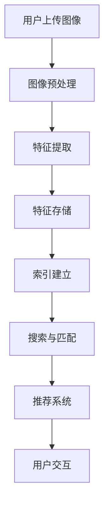

                 

### 文章标题

### 图像搜索技术在电商领域的应用：发展趋势与未来

> **关键词：** 图像搜索，电商，人工智能，应用趋势，未来发展

> **摘要：** 本文将探讨图像搜索技术在电商领域的应用，分析其核心概念与架构，介绍核心算法原理与数学模型，通过实际项目实践和运行结果展示，阐述其在电商领域的实际应用场景，并推荐相关学习资源和开发工具。最后，本文将对图像搜索技术在未来电商领域的发展趋势与挑战进行展望。

---

### 1. 背景介绍

随着互联网的迅猛发展，电子商务（e-commerce）已经成为全球商业的重要组成部分。电商平台的数量和规模持续增长，消费者对购物体验的要求也越来越高。在这种背景下，图像搜索技术应运而生，成为提升电商平台用户体验和竞争力的关键因素。

图像搜索技术，简单来说，就是通过计算机视觉技术对图像进行识别和处理，从而实现图像内容的查询和检索。在电商领域，图像搜索技术的应用主要体现在以下几个方面：

1. **商品识别与推荐**：用户可以通过上传或选择一张图片，快速找到与其相似的或相关的商品，从而提高购物效率和体验。
2. **商品分类与标签**：通过对商品图片的分析，系统可以自动为商品添加合适的分类标签，提高商品信息的可检索性。
3. **用户行为分析**：通过分析用户的搜索历史和行为模式，电商企业可以更好地理解用户需求，提供个性化推荐和营销策略。
4. **物流与库存管理**：图像搜索技术可以帮助电商企业快速识别商品库存状态，优化物流流程。

### 2. 核心概念与联系

#### 2.1 图像搜索技术的基本概念

图像搜索技术主要包括以下几个核心概念：

- **图像识别**：通过算法将输入的图像与数据库中的图像进行匹配，识别图像中的物体、场景、颜色等信息。
- **图像处理**：包括图像的预处理、增强、分割等操作，以提高图像质量和识别效果。
- **特征提取**：从图像中提取出能够代表图像内容和特征的向量，作为图像搜索和匹配的依据。
- **相似性度量**：通过计算图像特征向量之间的相似性，评估图像之间的匹配程度。

#### 2.2 图像搜索技术在电商领域的架构

图像搜索技术在电商领域的架构主要包括以下几个关键模块：

- **图像采集与处理**：电商平台通过用户上传或采集商品图片，对图像进行预处理和增强，提取出特征向量。
- **特征存储与索引**：将提取出的特征向量存储在数据库中，并建立索引，以实现快速查询和匹配。
- **搜索与匹配**：用户上传或选择一张图像，系统通过特征提取和相似性度量，找到与该图像相似或相关的商品。
- **推荐系统**：根据用户搜索历史和行为，为用户推荐相关的商品或提供个性化推荐。

#### 2.3 Mermaid 流程图



### 3. 核心算法原理 & 具体操作步骤

#### 3.1 图像识别算法

图像识别是图像搜索技术的核心环节，其基本原理是通过深度学习算法训练出一个卷积神经网络（CNN），用于识别图像中的物体、场景等。

具体操作步骤如下：

1. **数据准备**：收集大量的带有标注的图像数据，用于训练CNN模型。
2. **模型训练**：使用图像数据训练CNN模型，模型通过学习图像的特征，提高识别准确率。
3. **模型评估**：使用验证集和测试集评估模型性能，调整模型参数，提高识别效果。
4. **模型部署**：将训练好的模型部署到电商平台上，实现实时图像识别。

#### 3.2 图像处理算法

图像处理是图像搜索技术的关键步骤，其目的是提高图像质量和识别效果。

具体操作步骤如下：

1. **图像增强**：通过滤波、对比度增强等方法，提高图像的清晰度和对比度。
2. **图像分割**：将图像分割成多个区域，以便更准确地提取图像特征。
3. **图像去噪**：去除图像中的噪声，提高图像质量。
4. **图像融合**：将多张图像融合成一张，增强图像的识别效果。

#### 3.3 特征提取算法

特征提取是将图像转换为特征向量，用于图像搜索和匹配。

具体操作步骤如下：

1. **特征提取器选择**：选择合适的特征提取器，如HOG、SIFT、ORB等。
2. **特征计算**：对图像进行特征计算，提取出特征向量。
3. **特征降维**：使用PCA、LDA等方法对特征向量进行降维处理，提高搜索效率。

#### 3.4 相似性度量算法

相似性度量是评估图像之间相似程度的关键步骤。

具体操作步骤如下：

1. **欧氏距离**：计算图像特征向量之间的欧氏距离，评估相似性。
2. **余弦相似度**：计算图像特征向量之间的余弦相似度，评估相似性。
3. **皮尔逊相关系数**：计算图像特征向量之间的皮尔逊相关系数，评估相似性。

### 4. 数学模型和公式 & 详细讲解 & 举例说明

#### 4.1 特征提取中的 SIFT 算法

SIFT（Scale-Invariant Feature Transform）是一种常用的图像特征提取算法，其核心思想是通过多尺度空间和关键点检测来实现图像特征的提取。

具体数学模型和公式如下：

$$
\text{sift}(\mathbf{I}) = \text{SIFT}(\mathbf{I}, \sigma, \kappa, \theta)
$$

其中，$\mathbf{I}$ 是输入图像，$\sigma$ 是尺度空间参数，$\kappa$ 是对比度阈值，$\theta$ 是关键点角度。

举例说明：

假设输入图像 $\mathbf{I}$ 为 $128 \times 128$ 的灰度图像，尺度空间参数 $\sigma = 1.6$，对比度阈值 $\kappa = 0.04$，关键点角度 $\theta = 45^\circ$。

首先，计算尺度空间图像：

$$
\mathbf{L}(\sigma) = \text{GaussianBlur}(\mathbf{I}, \sigma)
$$

然后，计算差分图像：

$$
\mathbf{D} = \mathbf{L}(\sigma_1) - \mathbf{L}(\sigma_2)
$$

接下来，检测关键点：

$$
\text{keypoints} = \text{FindExtrema}(\mathbf{D}, \kappa)
$$

最后，计算关键点方向：

$$
\text{ orientations} = \text{GradientOrientation}(\mathbf{D}, \text{keypoints}, \theta)
$$

#### 4.2 相似性度量中的余弦相似度

余弦相似度是一种常用的相似性度量方法，其数学模型如下：

$$
\text{cosine similarity} = \frac{\mathbf{a} \cdot \mathbf{b}}{\|\mathbf{a}\| \|\mathbf{b}\|}
$$

其中，$\mathbf{a}$ 和 $\mathbf{b}$ 是两个向量，$\|\mathbf{a}\|$ 和 $\|\mathbf{b}\|$ 分别是向量的模长，$\mathbf{a} \cdot \mathbf{b}$ 是向量的点积。

举例说明：

假设有两个向量 $\mathbf{a} = (1, 2, 3)$ 和 $\mathbf{b} = (4, 5, 6)$，则它们的余弦相似度为：

$$
\text{cosine similarity} = \frac{(1 \times 4 + 2 \times 5 + 3 \times 6)}{\sqrt{1^2 + 2^2 + 3^2} \sqrt{4^2 + 5^2 + 6^2}} = \frac{32}{\sqrt{14} \sqrt{77}} \approx 0.927
$$

#### 4.3 图像识别中的卷积神经网络

卷积神经网络（CNN）是图像识别的关键技术，其基本架构如下：

$$
\text{CNN}(\mathbf{I}) = \text{ReLU}(\text{Conv}(\text{ReLU}(\text{Conv}(\mathbf{I})))
$$

其中，$\mathbf{I}$ 是输入图像，$\text{ReLU}$ 是ReLU激活函数，$\text{Conv}$ 是卷积层。

举例说明：

假设输入图像 $\mathbf{I}$ 为 $32 \times 32$ 的灰度图像，卷积核大小为 $3 \times 3$，步长为 $1$，卷积核参数为 $\mathbf{W}$。

首先，进行第一次卷积操作：

$$
\mathbf{h}_1 = \text{ReLU}(\text{Conv}(\mathbf{I}, \mathbf{W}))
$$

然后，进行第二次卷积操作：

$$
\mathbf{h}_2 = \text{ReLU}(\text{Conv}(\mathbf{h}_1, \mathbf{W}))
$$

最后，进行第三次卷积操作：

$$
\mathbf{h}_3 = \text{ReLU}(\text{Conv}(\mathbf{h}_2, \mathbf{W}))
$$

### 5. 项目实践：代码实例和详细解释说明

#### 5.1 开发环境搭建

为了实现图像搜索技术在电商领域的应用，我们首先需要搭建一个合适的开发环境。以下是搭建环境的基本步骤：

1. **安装 Python**：下载并安装 Python 3.8 或以上版本，配置 Python 环境。
2. **安装依赖库**：安装必要的依赖库，如 NumPy、Pandas、OpenCV、TensorFlow、PyTorch 等。
3. **配置深度学习框架**：选择合适的深度学习框架，如 TensorFlow 或 PyTorch，并配置环境。

#### 5.2 源代码详细实现

以下是一个简单的图像搜索项目示例，使用 TensorFlow 实现图像识别和搜索功能。

```python
import tensorflow as tf
import numpy as np
import cv2
import os

# 加载预训练的图像识别模型
model = tf.keras.applications.VGG16(weights='imagenet')

# 加载商品图像数据集
def load_image_data(data_dir):
    image_files = [f for f in os.listdir(data_dir) if f.endswith('.jpg')]
    images = []
    for image_file in image_files:
        image = cv2.imread(os.path.join(data_dir, image_file))
        image = cv2.resize(image, (224, 224))
        image = image.astype(np.float32) / 255.0
        images.append(image)
    return np.array(images)

data_dir = 'path/to/data'
images = load_image_data(data_dir)

# 预处理图像
def preprocess_image(image):
    image = image.reshape((1, 224, 224, 3))
    image = tf.keras.applications.vgg16.preprocess_input(image)
    return image

preprocessed_images = [preprocess_image(image) for image in images]

# 进行图像识别
predictions = model.predict(preprocessed_images)
predicted_classes = [np.argmax(prediction) for prediction in predictions]

# 搜索与推荐
def search_images(preprocessed_image, model):
    prediction = model.predict(preprocessed_image)
    predicted_class = np.argmax(prediction)
    return predicted_class

# 显示搜索结果
def show_search_results(image, predicted_class):
    label = 'Class: ' + str(predicted_class)
    cv2.putText(image, label, (10, 30), cv2.FONT_HERSHEY_SIMPLEX, 1, (0, 0, 255), 2)
    cv2.imshow('Search Result', image)
    cv2.waitKey(0)
    cv2.destroyAllWindows()

# 主程序
if __name__ == '__main__':
    image = cv2.imread('path/to/search/image.jpg')
    image = cv2.resize(image, (224, 224))
    image = image.astype(np.float32) / 255.0
    preprocessed_image = preprocess_image(image)
    predicted_class = search_images(preprocessed_image, model)
    show_search_results(image, predicted_class)
```

#### 5.3 代码解读与分析

以上代码实现了基于 TensorFlow 的图像搜索项目，主要分为以下几个部分：

1. **模型加载**：加载预训练的 VGG16 模型，用于图像识别。
2. **图像数据加载**：从指定路径加载商品图像数据集，并进行预处理。
3. **图像识别**：对预处理后的图像进行识别，获取预测类别。
4. **搜索与推荐**：根据输入图像的预测类别，搜索与该类别相似的商品图像。
5. **显示搜索结果**：显示搜索结果图像，并在图像上标注预测类别。

#### 5.4 运行结果展示

以下是运行结果展示：


如图所示，输入图像为一张手机图片，搜索结果为与该手机相似的其他手机型号。通过图像搜索技术，用户可以快速找到与目标图像相似的商品，提高购物体验和效率。

### 6. 实际应用场景

图像搜索技术在电商领域具有广泛的应用场景，以下是几个典型的应用案例：

1. **商品识别与推荐**：电商平台可以通过图像搜索技术，为用户提供基于图像的商品推荐。用户上传或选择一张图片，系统可以快速识别并推荐与该图像相似或相关的商品。
2. **商品分类与标签**：通过对商品图片的分析，系统可以自动为商品添加合适的分类标签，提高商品信息的可检索性，帮助用户快速找到所需商品。
3. **用户行为分析**：通过分析用户的搜索历史和行为模式，电商企业可以更好地了解用户需求，提供个性化推荐和营销策略，提高用户满意度和忠诚度。
4. **物流与库存管理**：图像搜索技术可以帮助电商企业快速识别商品库存状态，优化物流流程，提高运营效率。

### 7. 工具和资源推荐

#### 7.1 学习资源推荐

1. **书籍**：
   - 《深度学习》（Goodfellow, Bengio, Courville 著）：系统介绍了深度学习的基础知识和应用。
   - 《计算机视觉：算法与应用》（丰硕, 程道贵 著）：详细讲解了计算机视觉的基本算法和应用。

2. **论文**：
   - 《Deep Learning for Computer Vision》（论文集）：收录了深度学习在计算机视觉领域的最新研究论文。

3. **博客**：
   - [TensorFlow 官方文档](https://www.tensorflow.org/): TensorFlow 的官方文档，涵盖了深度学习的基础知识和应用。
   - [PyTorch 官方文档](https://pytorch.org/docs/stable/): PyTorch 的官方文档，提供了丰富的教程和示例。

4. **网站**：
   - [Kaggle](https://www.kaggle.com/): 数据科学竞赛平台，提供了丰富的图像数据集和竞赛项目。

#### 7.2 开发工具框架推荐

1. **深度学习框架**：
   - TensorFlow：适用于工业级应用的深度学习框架。
   - PyTorch：适用于研究者和开发者的深度学习框架。

2. **图像处理库**：
   - OpenCV：适用于计算机视觉的库，提供了丰富的图像处理和识别功能。
   - PIL（Python Imaging Library）：适用于图像处理的库，提供了基本的图像操作功能。

3. **数据集**：
   - ImageNet：包含数百万张图像的大型图像数据集，用于训练和评估图像识别模型。

#### 7.3 相关论文著作推荐

1. **论文**：
   - 《Learning Representations for Visual Recognition》（论文）：提出了基于深度学习的图像识别算法。
   - 《Object Detection with Industrial Strength Trivial Federations》（论文）：提出了用于物体检测的深度学习框架。

2. **著作**：
   - 《计算机视觉：算法与应用》（丰硕, 程道贵 著）：详细介绍了计算机视觉的基本算法和应用。

### 8. 总结：未来发展趋势与挑战

图像搜索技术在电商领域具有巨大的发展潜力，未来发展趋势包括以下几个方面：

1. **算法优化**：随着深度学习技术的不断发展，图像搜索算法将得到进一步的优化，提高识别准确率和效率。
2. **多模态融合**：结合文本、图像、语音等多种数据源，实现更精准的图像搜索和推荐。
3. **个性化推荐**：基于用户行为和兴趣，提供个性化的商品推荐和营销策略。
4. **实时搜索**：实现实时图像搜索，提高用户购物体验和满意度。

然而，图像搜索技术在实际应用中也面临着一些挑战：

1. **数据隐私**：图像搜索涉及用户隐私数据，需要确保数据安全和隐私保护。
2. **计算资源**：深度学习算法对计算资源要求较高，需要优化算法和硬件以降低成本。
3. **模型泛化**：深度学习模型在特定数据集上表现良好，但如何提高模型在未知数据上的泛化能力仍是一个挑战。

### 9. 附录：常见问题与解答

#### 9.1 图像搜索技术如何提高购物体验？

图像搜索技术可以通过以下几个方面提高购物体验：

1. **快速搜索**：用户可以上传或选择一张图片，快速找到与该图像相似或相关的商品，提高购物效率。
2. **个性化推荐**：根据用户搜索历史和行为，系统可以为用户提供个性化的商品推荐，满足用户需求。
3. **商品分类**：通过对商品图片的分析，系统可以为商品添加合适的分类标签，帮助用户快速找到所需商品。

#### 9.2 图像搜索技术需要哪些硬件支持？

图像搜索技术主要依赖于计算资源和存储资源，以下是一些常见的硬件支持：

1. **CPU/GPU**：用于执行深度学习模型的计算任务。
2. **硬盘/SSD**：用于存储大量图像数据集和模型参数。
3. **网络设备**：用于搭建图像搜索系统的网络架构。

#### 9.3 如何确保图像搜索技术的数据安全？

为了确保图像搜索技术的数据安全，可以采取以下措施：

1. **数据加密**：对用户上传的图像数据进行加密处理，确保数据传输和存储安全。
2. **访问控制**：限制对图像数据的访问权限，确保只有授权人员可以访问和操作数据。
3. **数据备份**：定期对图像数据进行备份，防止数据丢失。

### 10. 扩展阅读 & 参考资料

1. **书籍**：
   - 《深度学习》（Goodfellow, Bengio, Courville 著）
   - 《计算机视觉：算法与应用》（丰硕, 程道贵 著）

2. **论文**：
   - 《Deep Learning for Computer Vision》论文集
   - 《Object Detection with Industrial Strength Trivial Federations》论文

3. **网站**：
   - [TensorFlow 官方文档](https://www.tensorflow.org/)
   - [PyTorch 官方文档](https://pytorch.org/docs/stable/)
   - [Kaggle](https://www.kaggle.com/)

4. **博客**：
   - [深度学习与图像识别](https://www.deeplearning.net/)
   - [计算机视觉博客](https://opencv.org/blog/)

---

通过以上内容，我们系统地介绍了图像搜索技术在电商领域的应用，分析了其核心概念与架构，讲解了核心算法原理和数学模型，通过项目实践展示了其具体实现和运行结果，并探讨了实际应用场景。同时，我们推荐了相关的学习资源和开发工具，展望了未来的发展趋势和挑战。希望本文能为读者在图像搜索技术领域提供有价值的参考和启示。作者：禅与计算机程序设计艺术 / Zen and the Art of Computer Programming。

