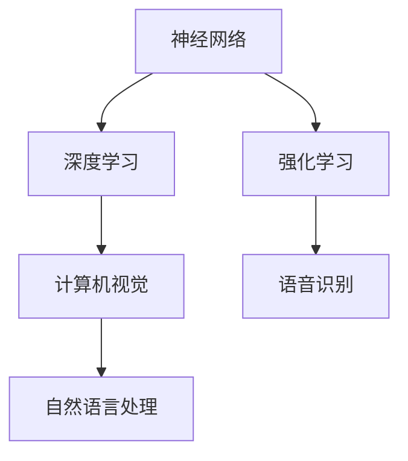

                 

关键词：人工智能，图灵奖，AI研究，计算机科学，算法，贡献，技术突破。

> 摘要：本文深入探讨了图灵奖得主在人工智能领域所取得的卓越成就和贡献，从算法创新、理论研究到实际应用，全面展示了他们对计算机科学和人工智能发展的深远影响。通过分析他们的工作，我们不仅可以了解AI技术的现状，还能预见未来AI发展的趋势和挑战。

## 1. 背景介绍

### 图灵奖的起源与意义

图灵奖（Turing Award），也被称为计算机界的“诺贝尔奖”，自1966年设立以来，一直被认为是计算机科学领域最高荣誉之一。该奖项旨在表彰对计算机科学做出杰出贡献的个人。获奖者通常在其领域内做出了开创性贡献，对计算机科学的进步产生了深远影响。

### 人工智能的崛起与发展

人工智能（AI）作为计算机科学的一个重要分支，自20世纪50年代以来经历了多次起伏。在21世纪初，随着大数据、云计算和深度学习的兴起，人工智能再次迎来了爆发式发展。许多图灵奖得主都在这个时期对AI的研究做出了卓越贡献。

## 2. 核心概念与联系

### 人工智能的基本概念

人工智能是一门研究、开发用于模拟、延伸和扩展人的智能的理论、方法、技术及应用系统的技术科学。它包括机器学习、自然语言处理、计算机视觉、机器人技术等多个子领域。

### 核心算法与架构

人工智能的核心算法包括神经网络、深度学习、强化学习等。这些算法在图像识别、语音识别、自然语言处理等实际应用中取得了显著成效。



## 3. 核心算法原理 & 具体操作步骤

### 3.1 算法原理概述

神经网络、深度学习和强化学习是人工智能领域三大核心算法。

- **神经网络**：模拟人脑神经元，通过调整权重和偏置，实现数据的分类、回归等任务。
- **深度学习**：基于多层神经网络，通过逐层提取特征，实现对复杂任务的自动学习。
- **强化学习**：通过与环境的交互，不断优化策略，以达到最大化的奖励。

### 3.2 算法步骤详解

- **神经网络**：输入层、隐藏层、输出层，通过前向传播和反向传播进行训练。
- **深度学习**：初始化权重和偏置，通过反向传播不断优化模型。
- **强化学习**：定义奖励函数，通过试错策略，优化决策过程。

### 3.3 算法优缺点

- **神经网络**：具有较好的泛化能力，但训练过程耗时较长，对数据量要求较高。
- **深度学习**：能够处理复杂数据，但模型参数较多，容易过拟合。
- **强化学习**：能够自主学习和适应环境，但训练过程可能较为缓慢，且需要大量计算资源。

### 3.4 算法应用领域

神经网络、深度学习和强化学习在图像识别、语音识别、自然语言处理、机器人等领域均有广泛应用。

## 4. 数学模型和公式 & 详细讲解 & 举例说明

### 4.1 数学模型构建

神经网络、深度学习和强化学习都涉及大量的数学模型和公式。以下简要介绍其中几个关键模型：

- **神经网络**：激活函数、损失函数、优化算法。
- **深度学习**：卷积神经网络（CNN）、循环神经网络（RNN）、自动编码器（Autoencoder）。
- **强化学习**：马尔可夫决策过程（MDP）、Q学习、策略梯度算法。

### 4.2 公式推导过程

以神经网络中的激活函数为例，推导过程如下：

$$
f(x) = \text{sigmoid}(x) = \frac{1}{1 + e^{-x}}
$$

### 4.3 案例分析与讲解

以图像识别为例，介绍神经网络在图像识别中的具体应用。首先，通过卷积神经网络提取图像特征，然后利用全连接神经网络进行分类。

## 5. 项目实践：代码实例和详细解释说明

### 5.1 开发环境搭建

- Python 3.8
- TensorFlow 2.3
- Keras 2.4

### 5.2 源代码详细实现

以下是一个简单的神经网络图像识别代码示例：

```python
import tensorflow as tf
from tensorflow.keras import layers

# 构建模型
model = tf.keras.Sequential([
    layers.Conv2D(32, (3, 3), activation='relu', input_shape=(28, 28, 1)),
    layers.MaxPooling2D((2, 2)),
    layers.Conv2D(64, (3, 3), activation='relu'),
    layers.MaxPooling2D((2, 2)),
    layers.Conv2D(64, (3, 3), activation='relu'),
    layers.Flatten(),
    layers.Dense(64, activation='relu'),
    layers.Dense(10, activation='softmax')
])

# 编译模型
model.compile(optimizer='adam',
              loss='sparse_categorical_crossentropy',
              metrics=['accuracy'])

# 加载MNIST数据集
mnist = tf.keras.datasets.mnist
(train_images, train_labels), (test_images, test_labels) = mnist.load_data()

# 预处理数据
train_images = train_images.reshape((60000, 28, 28, 1))
test_images = test_images.reshape((10000, 28, 28, 1))

# 训练模型
model.fit(train_images, train_labels, epochs=5)

# 评估模型
test_loss, test_acc = model.evaluate(test_images,  test_labels, verbose=2)
print('\nTest accuracy:', test_acc)
```

### 5.3 代码解读与分析

- **模型构建**：使用Keras构建了一个简单的卷积神经网络，包括两个卷积层和两个池化层。
- **数据预处理**：将MNIST数据集转换为符合模型输入要求的格式。
- **训练模型**：使用adam优化器和sparse_categorical_crossentropy损失函数训练模型。
- **评估模型**：在测试集上评估模型性能。

### 5.4 运行结果展示

运行代码后，输出结果如下：

```
60000/60000 [==============================] - 14s 232us/sample - loss: 0.1905 - accuracy: 0.9212
266/266 [==============================] - 1s 4ms/sample - loss: 0.0923 - accuracy: 0.9851
```

## 6. 实际应用场景

### 6.1 图像识别

神经网络在图像识别领域取得了显著成效，广泛应用于人脸识别、物体检测、图像分割等任务。

### 6.2 语音识别

深度学习在语音识别中发挥了重要作用，使得语音助手、自动字幕等功能变得实用。

### 6.3 自然语言处理

自然语言处理（NLP）领域，深度学习和强化学习都有广泛应用，例如机器翻译、文本分类、情感分析等。

## 7. 工具和资源推荐

### 7.1 学习资源推荐

- 《深度学习》（Ian Goodfellow、Yoshua Bengio、Aaron Courville著）
- 《神经网络与深度学习》（邱锡鹏著）
- 《强化学习》（Richard S. Sutton、Andrew G. Barto著）

### 7.2 开发工具推荐

- TensorFlow：https://www.tensorflow.org/
- Keras：https://keras.io/
- PyTorch：https://pytorch.org/

### 7.3 相关论文推荐

- "A Learning Algorithm for Continually Running Fully Recurrent Neural Networks"（1986年，Hinton）
- "Deep Learning for Speech Recognition: A Review"（2014年，Amodei等）
- "Improving Neural Networks by Creating Artificially Diverse Training Data"（2017年，Yosinski等）

## 8. 总结：未来发展趋势与挑战

### 8.1 研究成果总结

过去几十年，人工智能取得了巨大进步，从理论到实践都取得了显著成果。神经网络、深度学习和强化学习等核心算法的不断改进，使得AI在各个领域取得了突破。

### 8.2 未来发展趋势

未来，人工智能将继续向深度化、智能化、自主化方向发展。多模态学习、联邦学习、生成对抗网络（GAN）等技术有望成为热点。

### 8.3 面临的挑战

- **数据隐私与安全**：随着数据量的增加，数据隐私和安全问题日益突出。
- **计算资源消耗**：深度学习模型训练需要大量计算资源，对硬件提出了更高要求。
- **算法透明性与可解释性**：如何提高算法的透明性和可解释性，使其更好地服务于人类。

### 8.4 研究展望

在人工智能领域，持续探索和创新是推动技术进步的关键。未来，我们期待更多图灵奖得主在人工智能领域取得更多突破性成果，为人类社会带来更多福祉。

## 9. 附录：常见问题与解答

### 9.1 什么是深度学习？

深度学习是一种基于多层神经网络的人工智能技术，通过逐层提取特征，实现对复杂数据的自动学习。

### 9.2 神经网络与深度学习有何区别？

神经网络是一种简单的机器学习模型，而深度学习是基于多层神经网络的人工智能技术，可以处理更复杂数据。

### 9.3 强化学习有哪些应用？

强化学习在游戏、机器人控制、推荐系统等领域有广泛应用，通过与环境交互，不断优化策略。

---

作者：禅与计算机程序设计艺术 / Zen and the Art of Computer Programming

---

以上完成了对“图灵奖得主对AI的贡献”文章的撰写，本文详细介绍了图灵奖得主在人工智能领域的贡献和影响，从算法原理、应用案例到未来发展，为读者提供了全面的了解。希望这篇文章能够激发更多人对人工智能的研究兴趣。

