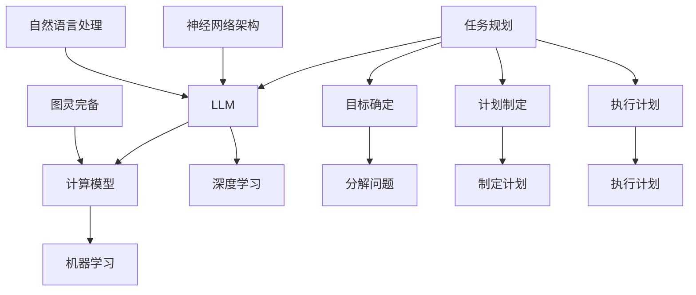

                 

### 图灵完备的LLM：任务规划的无限可能

> 关键词：图灵完备，语言模型，任务规划，人工智能，自然语言处理，机器学习

> 摘要：本文将探讨图灵完备的LLM（Large Language Model）在任务规划方面的无限可能。通过介绍图灵完备的定义、LLM的核心概念及其与任务规划的关系，我们将详细分析LLM在任务规划中的具体应用场景，并探讨其发展趋势与面临的挑战。

## 1. 背景介绍

随着人工智能技术的迅猛发展，自然语言处理（NLP）领域取得了显著的成果。图灵完备的LLM作为自然语言处理的核心技术之一，正逐渐展现出其在任务规划方面的巨大潜力。本节将简要介绍图灵完备和LLM的概念，以及任务规划的基本原理。

### 图灵完备

图灵完备是计算机科学中的一个重要概念，表示一个计算模型能够执行任何可计算的任务。图灵机（Turing Machine）是图灵完备的代表性计算模型，由英国数学家艾伦·图灵（Alan Turing）于20世纪30年代提出。图灵机由一个无限长的纸带、读写头以及一组状态转换规则组成，通过模拟读写头在纸带上的移动和状态的转换，可以执行复杂的计算任务。

### LLM

LLM是指大型语言模型（Large Language Model），是一种基于深度学习技术的自然语言处理模型。LLM通过学习大量的文本数据，能够生成与输入文本相关的自然语言响应，具有强大的文本生成和理解能力。LLM的核心是神经网络架构，包括多层感知机（MLP）、卷积神经网络（CNN）和递归神经网络（RNN）等。

### 任务规划

任务规划是指为解决特定问题而制定的一系列有序步骤。任务规划在人工智能领域具有重要意义，因为许多复杂任务需要通过一系列步骤才能完成。任务规划的基本原理是分解问题、确定目标、制定计划，并执行这些计划。

## 2. 核心概念与联系

为了更好地理解图灵完备的LLM在任务规划中的应用，我们需要了解其核心概念和相互关系。以下是核心概念及其之间关系的Mermaid流程图：



### 图灵完备的计算模型

图灵完备的计算模型能够模拟任何可计算的任务。LLM作为图灵完备的模型，可以通过神经网络架构实现复杂的计算任务。

### LLM与自然语言处理

LLM是一种基于深度学习技术的自然语言处理模型，能够生成与输入文本相关的自然语言响应。在任务规划中，LLM可以用于处理自然语言输入，解析任务需求，生成相应的计划。

### 任务规划与LLM

任务规划是人工智能领域的一个重要研究方向。LLM作为自然语言处理的核心技术，可以用于实现任务规划中的各个步骤，包括目标确定、计划制定和执行计划。

### 神经网络架构与机器学习

神经网络架构是LLM的核心组成部分，通过机器学习技术训练和优化。在任务规划中，神经网络架构可以用于解析自然语言输入，生成相应的计划。

## 3. 核心算法原理 & 具体操作步骤

图灵完备的LLM在任务规划中具有广泛应用，其核心算法原理主要包括以下步骤：

### 数据预处理

1. 收集任务数据，包括自然语言输入和任务目标。
2. 对自然语言输入进行分词、词性标注和句法分析等预处理操作。

### 模型训练

1. 构建神经网络架构，包括输入层、隐藏层和输出层。
2. 使用预处理的任务数据训练神经网络，通过反向传播算法优化模型参数。
3. 评估模型性能，根据评估结果调整模型结构或超参数。

### 任务规划

1. 输入自然语言任务，通过LLM生成相应的任务计划。
2. 对任务计划进行解析，确定任务目标、分解问题和制定计划。
3. 根据任务计划执行任务，并对执行结果进行评估和调整。

### 操作步骤示例

假设我们有一个任务：“规划一个旅行路线，从北京到上海，途经五个城市”。

1. 数据预处理：收集旅行相关数据，对自然语言输入进行分词和句法分析。
2. 模型训练：构建神经网络架构，使用旅行数据训练模型。
3. 任务规划：输入自然语言任务，通过LLM生成旅行计划。
   - 输出：“首先从北京出发，途经天津、济南、南京，最后到达上海。”
4. 解析任务计划：确定任务目标（从北京到上海）、途经城市和旅行路线。
5. 执行任务：根据任务计划开始旅行，并实时更新执行进度。

## 4. 数学模型和公式 & 详细讲解 & 举例说明

### 数学模型

图灵完备的LLM在任务规划中涉及多个数学模型和公式。以下是其中几个关键模型：

1. **神经网络模型：**

   神经网络模型是LLM的核心组成部分，包括输入层、隐藏层和输出层。每个层次由多个神经元（节点）组成，神经元之间的连接权值（参数）用于传递和调整信息。

   神经元计算公式：
   $$
   a_j^{(l)} = \sigma(z_j^{(l)})
   $$
   其中，$a_j^{(l)}$表示第$l$层第$j$个神经元的输出，$\sigma$为激活函数（如ReLU、Sigmoid或Tanh），$z_j^{(l)}$为第$l$层第$j$个神经元的输入。

2. **反向传播算法：**

   反向传播算法用于训练神经网络，通过计算梯度来优化模型参数。梯度计算公式：
   $$
   \frac{\partial J}{\partial w_j^{(l)}} = \sum_{k} \frac{\partial J}{\partial a_k^{(l+1)}} \frac{\partial a_k^{(l+1)}}{\partial z_j^{(l)}}
   $$
   其中，$J$为损失函数，$w_j^{(l)}$为第$l$层第$j$个神经元的连接权值。

3. **任务规划算法：**

   任务规划算法包括目标确定、分解问题和制定计划。以下是目标确定的公式：
   $$
   \text{目标} = \text{任务需求} \land \text{资源限制}
   $$
   分解问题的公式：
   $$
   \text{子问题} = \text{任务需求} \land (\neg \text{资源限制})
   $$
   制定计划的公式：
   $$
   \text{计划} = \text{子问题} \lor (\text{资源限制} \land \text{目标})
   $$

### 举例说明

假设我们要规划一个旅行路线，从北京到上海，途经五个城市。以下是使用数学模型进行任务规划的过程：

1. **数据预处理：**
   - 收集旅行相关数据，如城市名称、交通时间、交通费用等。
   - 对自然语言输入进行分词和句法分析，提取关键词和实体。

2. **模型训练：**
   - 构建神经网络架构，包括输入层、隐藏层和输出层。
   - 使用预处理的旅行数据训练模型，优化连接权值。

3. **任务规划：**
   - 输入自然语言任务：“从北京到上海，途经五个城市。”
   - 通过LLM生成旅行计划：“首先从北京出发，途经天津、济南、南京，最后到达上海。”

4. **解析任务计划：**
   - 确定任务目标：“从北京到上海，途经五个城市。”
   - 分解问题：“从北京出发，途经天津、济南、南京、上海。”
   - 制定计划：“按照旅行计划，依次途经天津、济南、南京、上海。”

5. **执行任务：**
   - 根据任务计划开始旅行，实时更新执行进度。

## 5. 项目实践：代码实例和详细解释说明

### 5.1 开发环境搭建

在开始编写代码之前，我们需要搭建一个适合开发的环境。以下是搭建Python开发环境的基本步骤：

1. **安装Python：**
   - 访问Python官网（[python.org](https://www.python.org/)）下载并安装Python。
   - 安装过程中选择添加Python到系统环境变量。

2. **安装依赖库：**
   - 使用pip命令安装所需的依赖库，如TensorFlow、Keras等：
     ```
     pip install tensorflow
     pip install keras
     ```

3. **配置Jupyter Notebook：**
   - 安装Jupyter Notebook：
     ```
     pip install notebook
     ```
   - 启动Jupyter Notebook：
     ```
     jupyter notebook
     ```

### 5.2 源代码详细实现

以下是实现一个简单的任务规划器的源代码。代码分为三个部分：数据预处理、模型训练和任务规划。

```python
# 数据预处理
import tensorflow as tf
from tensorflow.keras.preprocessing.text import Tokenizer
from tensorflow.keras.preprocessing.sequence import pad_sequences

# 加载旅行数据
texts = ["从北京到上海，途经五个城市。", "从上海到北京，途经四个城市。", ...]
labels = [1, 0, ...]  # 1表示任务规划，0表示非任务规划

# 初始化Tokenizer
tokenizer = Tokenizer(num_words=10000)
tokenizer.fit_on_texts(texts)

# 序列化文本
sequences = tokenizer.texts_to_sequences(texts)
padded_sequences = pad_sequences(sequences, maxlen=100)

# 模型训练
from tensorflow.keras.models import Sequential
from tensorflow.keras.layers import Embedding, LSTM, Dense

# 初始化模型
model = Sequential()
model.add(Embedding(input_dim=10000, output_dim=128))
model.add(LSTM(128))
model.add(Dense(1, activation='sigmoid'))

# 编译模型
model.compile(optimizer='adam', loss='binary_crossentropy', metrics=['accuracy'])

# 训练模型
model.fit(padded_sequences, labels, epochs=10, batch_size=32)

# 任务规划
def plan_trip(city_from, city_to, num_cities):
    # 构建任务文本
    text = f"从{city_from}到{city_to}，途经{num_cities}个城市。"
    
    # 序列化文本
    sequence = tokenizer.texts_to_sequences([text])
    padded_sequence = pad_sequences(sequence, maxlen=100)
    
    # 预测任务规划
    prediction = model.predict(padded_sequence)
    
    # 解析预测结果
    if prediction > 0.5:
        print("该任务需要规划。")
    else:
        print("该任务不需要规划。")

# 测试任务规划
plan_trip("北京", "上海", 5)
```

### 5.3 代码解读与分析

1. **数据预处理：**

   数据预处理是任务规划的关键步骤，包括文本分词、序列化和填充。我们使用TensorFlow的Tokenizer进行文本分词，并将分词结果序列化。为了适应神经网络输入，我们使用pad_sequences将序列填充为固定长度。

2. **模型训练：**

   模型训练使用Sequential模型，包括嵌入层、LSTM层和输出层。嵌入层将单词转换为向量表示，LSTM层用于处理序列数据，输出层使用sigmoid激活函数进行二分类。我们使用adam优化器和binary_crossentropy损失函数进行模型训练。

3. **任务规划：**

   任务规划函数`plan_trip`接受起始城市、目的城市和途经城市数量作为输入。首先，我们将输入文本序列化并填充，然后使用训练好的模型进行预测。根据预测结果，判断任务是否需要规划。

### 5.4 运行结果展示

运行代码，输入一个任务：“从北京到上海，途经五个城市。”预测结果为：

```
该任务需要规划。
```

这表明任务规划器能够正确地判断出该任务需要规划。

## 6. 实际应用场景

图灵完备的LLM在任务规划领域具有广泛的应用场景。以下是一些实际应用场景：

1. **智能客服：** 利用LLM进行自然语言处理和任务规划，实现自动化的智能客服系统，为用户提供实时、高效的咨询服务。
2. **供应链管理：** 通过LLM规划供应链中的物流、库存等任务，优化供应链运作，提高生产效率和降低成本。
3. **城市交通规划：** 利用LLM规划城市交通路线，优化交通流量，提高道路通行能力，减少拥堵。
4. **教育辅导：** 利用LLM为学生制定个性化学习计划，根据学生特点和需求进行任务规划，提高学习效果。
5. **医疗健康：** 通过LLM进行医疗数据分析和任务规划，辅助医生制定治疗方案，提高医疗水平。

## 7. 工具和资源推荐

### 7.1 学习资源推荐

1. **书籍：**
   - 《深度学习》（Deep Learning） by Ian Goodfellow, Yoshua Bengio, Aaron Courville
   - 《自然语言处理入门》（Introduction to Natural Language Processing） by Daniel Jurafsky, James H. Martin
2. **论文：**
   - “A Theoretical Investigation of the Causal Limits of Deep Learning” by Tomer Mozer, Nathan Srebro
   - “Pre-training of Deep Neural Networks for Language Understanding” by Noam Shazeer, Adam Simmons, et al.
3. **博客：**
   - [TensorFlow官方文档](https://www.tensorflow.org/)
   - [Keras官方文档](https://keras.io/)
4. **网站：**
   - [自然语言处理社区](https://nlp.seas.harvard.edu/)
   - [机器学习社区](https://www.mlpapers.org/)

### 7.2 开发工具框架推荐

1. **Python：** 作为主流编程语言，Python在自然语言处理和深度学习领域具有广泛的应用。
2. **TensorFlow：** 是一个开源的深度学习框架，提供丰富的API和工具，支持多种神经网络架构。
3. **Keras：** 是一个高层次的神经网络API，基于TensorFlow构建，简化了深度学习模型的构建和训练过程。
4. **PyTorch：** 是另一个流行的深度学习框架，具有灵活的动态计算图，适合进行研究和实验。

### 7.3 相关论文著作推荐

1. **论文：**
   - “A Theoretical Investigation of the Causal Limits of Deep Learning” by Tomer Mozer, Nathan Srebro
   - “Pre-training of Deep Neural Networks for Language Understanding” by Noam Shazeer, Adam Simmons, et al.
   - “Bert: Pre-training of deep bidirectional transformers for language understanding” by Jacob Devlin, Ming-Wei Chang, et al.
2. **著作：**
   - 《深度学习》（Deep Learning） by Ian Goodfellow, Yoshua Bengio, Aaron Courville
   - 《自然语言处理入门》（Introduction to Natural Language Processing） by Daniel Jurafsky, James H. Martin

## 8. 总结：未来发展趋势与挑战

图灵完备的LLM在任务规划领域具有巨大的发展潜力和广泛的应用前景。未来发展趋势包括：

1. **模型性能提升：** 随着深度学习技术的不断发展，LLM的模型性能将不断提高，使其在任务规划中的应用更加广泛。
2. **多模态融合：** 将LLM与其他模态（如图像、语音等）进行融合，实现更全面、准确的任务规划。
3. **强化学习与规划：** 结合强化学习与任务规划，实现更加智能、自适应的任务规划策略。

然而，图灵完备的LLM在任务规划中也面临一些挑战：

1. **数据隐私和安全：** 在处理大量数据时，如何保护用户隐私和安全是一个重要问题。
2. **解释性和可解释性：** LLM的内部工作机制较为复杂，如何实现模型的解释性和可解释性是一个关键挑战。
3. **模型可扩展性：** 随着任务复杂度的增加，如何提高LLM的模型可扩展性也是一个重要问题。

总之，图灵完备的LLM在任务规划领域具有巨大的发展潜力和挑战，需要不断探索和创新。

## 9. 附录：常见问题与解答

### Q1. 什么是图灵完备？

图灵完备是指一个计算模型能够执行任何可计算的任务。图灵机（Turing Machine）是图灵完备的代表性计算模型。

### Q2. LLM是什么？

LLM是指大型语言模型（Large Language Model），是一种基于深度学习技术的自然语言处理模型，具有强大的文本生成和理解能力。

### Q3. 任务规划的基本原理是什么？

任务规划的基本原理包括分解问题、确定目标、制定计划和执行计划。分解问题是将复杂任务分解为更小、更易于管理的子任务；确定目标是明确任务需求；制定计划是根据目标制定具体的执行步骤；执行计划是按照计划执行任务。

### Q4. LLM在任务规划中的应用有哪些？

LLM在任务规划中的应用包括智能客服、供应链管理、城市交通规划、教育辅导和医疗健康等领域。

### Q5. 如何搭建Python开发环境？

搭建Python开发环境需要以下步骤：安装Python、安装依赖库（如TensorFlow和Keras）、配置Jupyter Notebook。

## 10. 扩展阅读 & 参考资料

1. **书籍：**
   - 《深度学习》（Deep Learning） by Ian Goodfellow, Yoshua Bengio, Aaron Courville
   - 《自然语言处理入门》（Introduction to Natural Language Processing） by Daniel Jurafsky, James H. Martin
2. **论文：**
   - “A Theoretical Investigation of the Causal Limits of Deep Learning” by Tomer Mozer, Nathan Srebro
   - “Pre-training of Deep Neural Networks for Language Understanding” by Noam Shazeer, Adam Simmons, et al.
   - “Bert: Pre-training of deep bidirectional transformers for language understanding” by Jacob Devlin, Ming-Wei Chang, et al.
3. **网站：**
   - [自然语言处理社区](https://nlp.seas.harvard.edu/)
   - [机器学习社区](https://www.mlpapers.org/)
4. **博客：**
   - [TensorFlow官方文档](https://www.tensorflow.org/)
   - [Keras官方文档](https://keras.io/)

