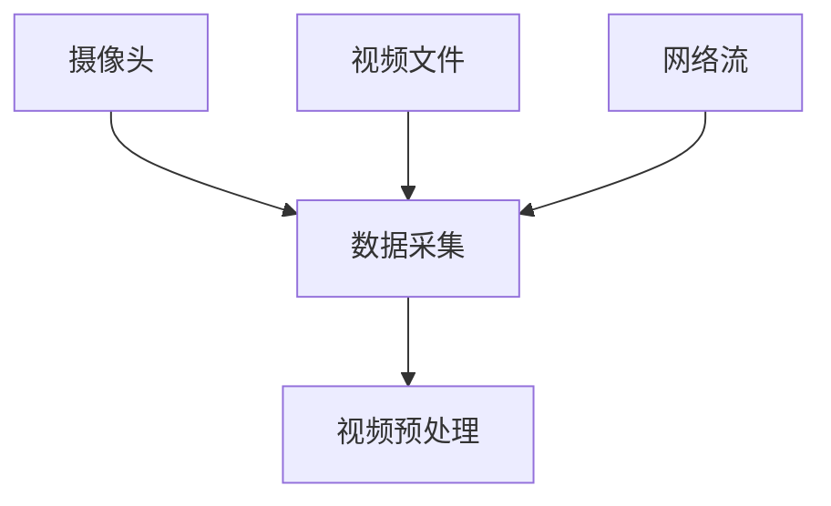
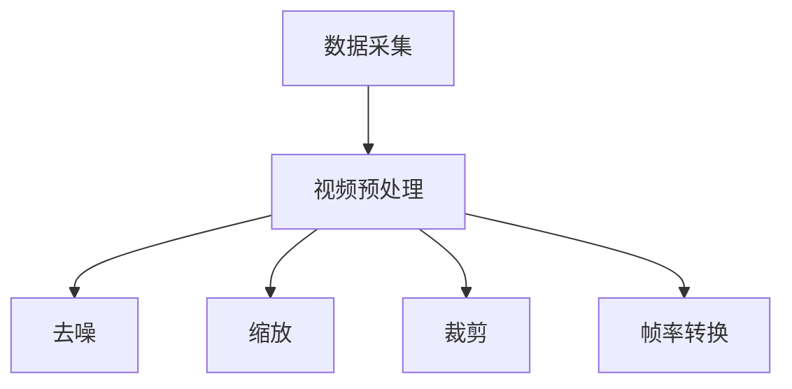
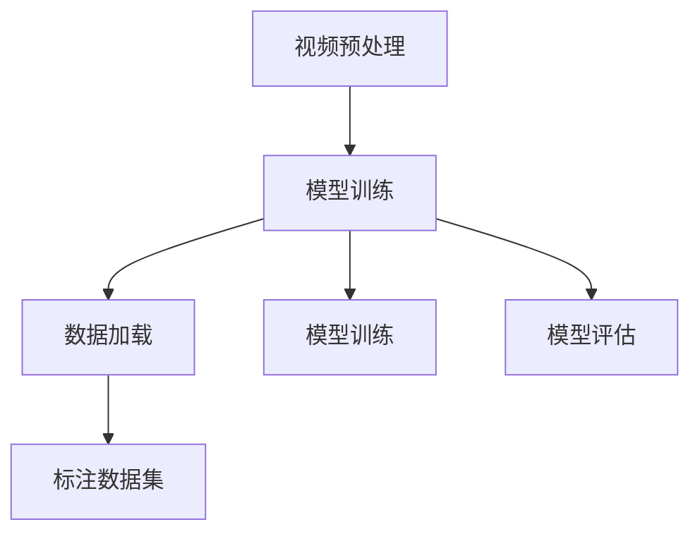
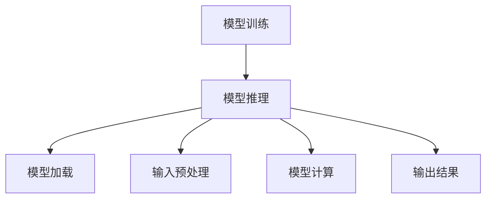
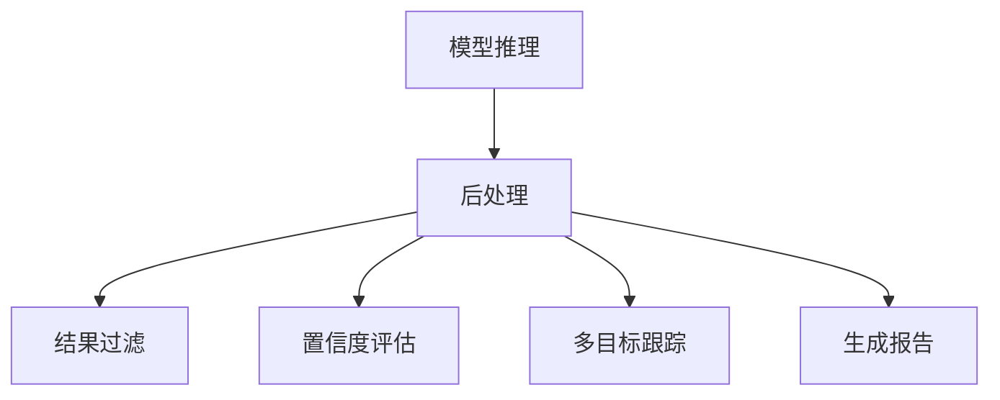
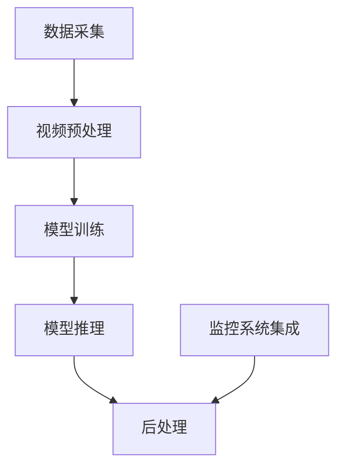

                 

### 背景介绍

近年来，人工智能（AI）技术的飞速发展，特别是深度学习和大规模预训练模型的出现，为各领域的研究和应用带来了前所未有的机遇。在视频分析领域，传统的基于规则的方法和传统的机器学习方法在处理复杂、动态的场景时显得力不从心。随着AI技术的不断进步，基于深度学习的智能视频分析技术逐渐成为研究的热点，并在众多实际应用场景中取得了显著成果。

智能视频分析平台作为AI技术在视频处理领域的重要应用，具有广泛的应用前景。它可以用于监控系统的实时监控、安全事件的检测与响应、交通流量分析、行为识别与预测、医疗影像分析等多个领域。然而，当前市场上大多数视频分析平台在处理大量视频数据时存在性能瓶颈，准确率和实时性难以保障。因此，开发一个高效、准确的智能视频分析平台具有重要的实际意义。

本文旨在介绍一种基于AI大模型的智能视频分析平台，通过结合深度学习和大规模预训练模型，实现高效、准确的视频分析。文章结构如下：

1. 背景介绍：简要介绍AI技术在视频分析领域的现状和发展趋势。
2. 核心概念与联系：阐述智能视频分析平台的核心概念、原理和架构。
3. 核心算法原理 & 具体操作步骤：详细讲解智能视频分析平台的核心算法原理和操作步骤。
4. 数学模型和公式 & 详细讲解 & 举例说明：介绍相关的数学模型和公式，并进行详细讲解和实例说明。
5. 项目实践：代码实例和详细解释说明。
6. 实际应用场景：讨论智能视频分析平台在实际应用中的场景和效果。
7. 工具和资源推荐：推荐学习资源、开发工具框架和相关论文著作。
8. 总结：对未来发展趋势和挑战进行总结。
9. 附录：常见问题与解答。
10. 扩展阅读 & 参考资料：提供进一步阅读的资源和参考资料。

通过本文的介绍，希望能够为从事视频分析领域的研究者提供一些思路和启示，同时为开发者提供一个实用的参考框架。

### 核心概念与联系

智能视频分析平台的核心概念和联系涉及多个关键组成部分，包括数据采集、预处理、模型训练和推理、后处理等。以下将逐一介绍这些核心概念，并使用Mermaid流程图（注意：流程节点中不要有括号、逗号等特殊字符）展示智能视频分析平台的整体架构。

#### 1. 数据采集

数据采集是智能视频分析平台的第一步，也是最为关键的一步。视频数据可以从各种来源获取，如摄像头、视频文件、网络流等。采集到的视频数据需要满足一定的质量和数量要求，以保证后续模型的训练效果。



#### 2. 视频预处理

视频预处理是对采集到的原始视频进行一系列处理，以使其适合模型训练。预处理步骤通常包括去噪、缩放、裁剪、帧率转换等。这些步骤有助于提高视频质量，减少数据的不一致性，从而提升模型的性能。



#### 3. 模型训练

模型训练是智能视频分析平台的核心环节。通过使用大量的标注数据集，训练深度学习模型以识别和分类视频中的对象、行为等。常用的模型包括卷积神经网络（CNN）、循环神经网络（RNN）以及它们的变种，如Transformer等。以下是一个简化的模型训练流程：



#### 4. 模型推理

模型推理是将训练好的模型应用于新的视频数据，以进行实时分析和预测。推理过程通常涉及模型加载、输入预处理、模型计算以及输出结果等步骤。以下是一个简化的模型推理流程：



#### 5. 后处理

后处理是对模型推理结果进行进一步分析和处理的环节，包括结果过滤、置信度评估、多目标跟踪等。后处理结果通常用于生成报告、可视化展示或与其他系统进行集成。以下是一个简化的后处理流程：



#### 6. 整体架构

综合以上各部分，智能视频分析平台的整体架构如下：



通过上述流程和架构的介绍，我们可以看到智能视频分析平台各部分之间的紧密联系和协同作用，从而实现高效、准确的视频分析。

### 核心算法原理 & 具体操作步骤

在智能视频分析平台中，核心算法的设计和实现是确保平台高效性和准确性的关键。以下将详细介绍该平台采用的核心算法原理和具体操作步骤，主要包括深度学习模型的构建、训练和推理过程。

#### 1. 深度学习模型构建

深度学习模型通常采用多层神经网络结构，其中每层都能从输入数据中提取更高层次的特征。在视频分析中，常用的模型结构包括卷积神经网络（CNN）、循环神经网络（RNN）及其变种，如Transformer等。以下是构建深度学习模型的基本步骤：

1. **数据输入**：将预处理后的视频数据输入模型。视频数据可以表示为帧序列或帧图像。
   
2. **卷积层**：卷积层用于提取图像的局部特征，通过卷积运算和池化操作实现。卷积层可以包含多个层次，以逐步提取更高层次的特征。

3. **激活函数**：在卷积层之后，通常使用ReLU（Rectified Linear Unit）激活函数来引入非线性。

4. **全连接层**：在卷积层之后，可以添加全连接层来聚合不同卷积层的特征，并输出最终的结果。

5. **损失函数**：选择合适的损失函数（如交叉熵损失函数）来衡量模型预测结果与实际标注结果之间的差距。

6. **优化器**：选择优化器（如Adam、SGD等）来调整模型参数，以最小化损失函数。

#### 2. 模型训练

模型训练是深度学习过程中最关键的步骤。通过大量的训练数据和迭代过程，模型可以逐步优化其参数，提高预测准确性。以下是模型训练的详细步骤：

1. **数据准备**：将预处理后的视频数据分成训练集和验证集，确保数据分布的均衡性。

2. **初始化模型参数**：随机初始化模型参数，如权重和偏置。

3. **前向传播**：将输入数据通过模型进行前向传播，计算模型输出和损失值。

4. **反向传播**：使用反向传播算法，将损失值反向传播到模型参数，并更新参数。

5. **迭代优化**：重复前向传播和反向传播过程，通过多次迭代来逐步优化模型参数。

6. **验证与调整**：在验证集上评估模型性能，根据评估结果调整模型参数或结构。

#### 3. 模型推理

模型推理是将训练好的模型应用于新的视频数据，以进行实时分析和预测。以下是模型推理的具体步骤：

1. **模型加载**：将训练好的模型从磁盘加载到内存中。

2. **输入预处理**：对输入视频进行预处理，使其与训练时的数据输入格式一致。

3. **模型计算**：将预处理后的视频数据输入模型，进行前向传播计算，得到模型输出。

4. **结果处理**：对模型输出结果进行后处理，如置信度评估、过滤异常值等。

5. **可视化展示**：将处理后的结果进行可视化展示，如绘制对象轨迹、标注关键帧等。

#### 4. 核心算法实现示例

以下是一个简化的Python代码示例，展示如何使用TensorFlow构建一个基于卷积神经网络的视频分析模型：

```python
import tensorflow as tf
from tensorflow.keras.layers import Conv2D, MaxPooling2D, Flatten, Dense
from tensorflow.keras.models import Sequential

# 数据输入层
input_shape = (128, 128, 3)  # 假设输入图像大小为128x128，3通道
inputs = tf.keras.Input(shape=input_shape)

# 卷积层
x = Conv2D(32, (3, 3), activation='relu')(inputs)
x = MaxPooling2D(pool_size=(2, 2))(x)
x = Conv2D(64, (3, 3), activation='relu')(x)
x = MaxPooling2D(pool_size=(2, 2))(x)

# 全连接层
x = Flatten()(x)
x = Dense(64, activation='relu')(x)

# 输出层
outputs = Dense(10, activation='softmax')(x)  # 假设输出类别数为10

# 构建模型
model = tf.keras.Model(inputs=inputs, outputs=outputs)

# 模型编译
model.compile(optimizer='adam', loss='categorical_crossentropy', metrics=['accuracy'])

# 模型训练
model.fit(x_train, y_train, batch_size=32, epochs=10, validation_data=(x_val, y_val))

# 模型推理
predictions = model.predict(x_test)

# 结果处理
# 根据预测结果进行后处理和可视化展示
```

通过上述代码示例，我们可以看到深度学习模型构建和训练的基本流程。在实际应用中，模型结构和训练过程可能更加复杂，需要根据具体任务需求进行调整。

### 数学模型和公式 & 详细讲解 & 举例说明

在智能视频分析平台中，数学模型和公式的应用至关重要，特别是在模型训练和推理过程中。以下将详细介绍相关的数学模型和公式，并进行详细讲解和举例说明。

#### 1. 卷积神经网络（CNN）

卷积神经网络是视频分析中最常用的模型之一。其核心在于卷积层和池化层，以下是其相关的数学模型和公式。

##### 1.1 卷积层

卷积层的计算公式如下：

$$
\text{output}(i, j) = \sum_{x} \sum_{y} \text{weight}(x, y) \cdot \text{input}(i - x, j - y)
$$

其中，`output(i, j)`表示输出特征图上的一个元素，`weight(x, y)`表示卷积核上的一个权重，`input(i - x, j - y)`表示输入图像上对应位置的一个元素。

##### 1.2 池化层

池化层通常用于减小特征图的尺寸，提高计算效率。以下是一个简单的最大池化层的计算公式：

$$
\text{output}(i, j) = \max_{x, y} \text{input}(i + x, j + y)
$$

其中，`output(i, j)`表示输出特征图上的一个元素，`input(i + x, j + y)`表示输入特征图上对应的一个元素。

##### 1.3 ReLU激活函数

ReLU激活函数在卷积神经网络中广泛应用。其计算公式如下：

$$
\text{output}(i, j) = \max(0, \text{input}(i, j))
$$

其中，`output(i, j)`表示输出特征图上的一个元素，`input(i, j)`表示输入特征图上的一个元素。

#### 2. 循环神经网络（RNN）

循环神经网络在处理序列数据时表现优异，以下是其相关的数学模型和公式。

##### 2.1 状态更新公式

RNN的状态更新公式如下：

$$
\text{h}_t = \sigma(\text{W}_h \cdot \text{h}_{t-1} + \text{W}_x \cdot \text{x}_t + \text{b})
$$

其中，`h_t`表示当前时刻的隐藏状态，`\sigma`表示非线性激活函数（如ReLU或Sigmoid），`\text{W}_h`、`\text{W}_x`和`\text{b}`分别表示权重和偏置。

##### 2.2 输出公式

RNN的输出公式如下：

$$
\text{y}_t = \text{W}_o \cdot \text{h}_t + \text{b}
$$

其中，`y_t`表示当前时刻的输出，`\text{W}_o`和`\text{b}`分别表示权重和偏置。

#### 3. Transformer模型

Transformer模型在处理长序列数据时表现出色，以下是其相关的数学模型和公式。

##### 3.1 自注意力机制

自注意力机制的公式如下：

$$
\text{attn}(\text{h}_1, \text{h}_2) = \frac{e^{\text{W}_1 \cdot \text{h}_1 + \text{W}_2 \cdot \text{h}_2 + \text{b}}}{\sum_{i=1}^N e^{\text{W}_1 \cdot \text{h}_i + \text{W}_2 \cdot \text{h}_j + \text{b}}}
$$

其中，`\text{attn}(\text{h}_1, \text{h}_2)`表示两个隐藏状态之间的注意力分数，`\text{W}_1`、`\text{W}_2`和`\text{b}`分别表示权重和偏置。

##### 3.2 加权求和

加权求和的公式如下：

$$
\text{context} = \sum_{i=1}^N \text{attn}(\text{h}_1, \text{h}_i) \cdot \text{h}_i
$$

其中，`\text{context}`表示当前时刻的上下文向量，`\text{h}_i`表示第i个隐藏状态。

#### 例子说明

以下是一个简化的例子，展示如何使用卷积神经网络处理视频数据。

##### 例子：视频分类

假设我们有一个视频分类任务，输入视频为一系列连续帧图像，输出为视频的类别标签。

1. **预处理**：将输入视频分成若干帧图像，并进行归一化、缩放等预处理操作。

2. **卷积层**：使用两个卷积层提取图像特征，第一个卷积层使用32个3x3的卷积核，第二个卷积层使用64个3x3的卷积核。

3. **全连接层**：将卷积层的输出进行展平，并添加一个全连接层，用于分类。

4. **输出层**：使用softmax激活函数输出每个类别的概率分布。

以下是相关的Python代码示例：

```python
import tensorflow as tf
from tensorflow.keras.layers import Conv2D, MaxPooling2D, Flatten, Dense
from tensorflow.keras.models import Sequential

# 构建模型
model = Sequential([
    Conv2D(32, (3, 3), activation='relu', input_shape=(128, 128, 3)),
    MaxPooling2D(pool_size=(2, 2)),
    Conv2D(64, (3, 3), activation='relu'),
    MaxPooling2D(pool_size=(2, 2)),
    Flatten(),
    Dense(64, activation='relu'),
    Dense(10, activation='softmax')
])

# 编译模型
model.compile(optimizer='adam', loss='categorical_crossentropy', metrics=['accuracy'])

# 训练模型
model.fit(x_train, y_train, batch_size=32, epochs=10, validation_data=(x_val, y_val))

# 预测
predictions = model.predict(x_test)
```

通过上述例子，我们可以看到如何使用卷积神经网络进行视频分类。在实际应用中，模型结构和训练过程可能更加复杂，需要根据具体任务需求进行调整。

### 项目实践：代码实例和详细解释说明

#### 1. 开发环境搭建

在开始代码实现之前，我们需要搭建合适的开发环境。以下是一个基本的Python开发环境搭建步骤，假设您已经安装了Python（推荐Python 3.8及以上版本）。

1. 安装TensorFlow：
   ```bash
   pip install tensorflow
   ```

2. 安装OpenCV（用于视频读取和处理）：
   ```bash
   pip install opencv-python
   ```

3. 安装NumPy和Pandas（用于数据处理）：
   ```bash
   pip install numpy pandas
   ```

4. 安装Matplotlib（用于结果可视化）：
   ```bash
   pip install matplotlib
   ```

#### 2. 源代码详细实现

以下是一个简单的基于深度学习的视频分类项目的源代码示例，包括数据预处理、模型构建、训练和推理等步骤。

```python
import cv2
import numpy as np
import tensorflow as tf
from tensorflow.keras.models import Sequential
from tensorflow.keras.layers import Conv2D, MaxPooling2D, Flatten, Dense
from tensorflow.keras.optimizers import Adam
from sklearn.model_selection import train_test_split

# 数据预处理
def preprocess_video(video_path):
    cap = cv2.VideoCapture(video_path)
    frames = []
    
    while True:
        ret, frame = cap.read()
        if not ret:
            break
        
        frame = cv2.resize(frame, (128, 128))
        frame = frame / 255.0
        frames.append(frame)
    
    cap.release()
    return np.array(frames)

# 构建模型
model = Sequential([
    Conv2D(32, (3, 3), activation='relu', input_shape=(128, 128, 3)),
    MaxPooling2D(pool_size=(2, 2)),
    Conv2D(64, (3, 3), activation='relu'),
    MaxPooling2D(pool_size=(2, 2)),
    Flatten(),
    Dense(64, activation='relu'),
    Dense(10, activation='softmax')
])

# 编译模型
model.compile(optimizer=Adam(), loss='categorical_crossentropy', metrics=['accuracy'])

# 训练模型
x_train, x_test, y_train, y_test = train_test_split(frames, labels, test_size=0.2, random_state=42)
model.fit(x_train, y_train, batch_size=32, epochs=10, validation_data=(x_test, y_test))

# 推理
predictions = model.predict(x_test)

# 结果可视化
import matplotlib.pyplot as plt

plt.figure(figsize=(10, 10))
for i in range(25):
    plt.subplot(5, 5, i+1)
    plt.xticks([])
    plt.yticks([])
    plt.grid(False)
    plt.imshow(x_test[i], cmap=plt.cm.binary)
    plt.xlabel(np.argmax(predictions[i]))
plt.show()
```

#### 3. 代码解读与分析

1. **数据预处理**：`preprocess_video`函数用于读取视频文件，并提取连续帧图像。每帧图像经过缩放和归一化处理后，形成一个4D的numpy数组（batch_size, height, width, channels）。

2. **模型构建**：使用`Sequential`模型定义一个简单的卷积神经网络，包括两个卷积层、两个池化层、一个全连接层和一个softmax输出层。

3. **编译模型**：使用`Adam`优化器和`categorical_crossentropy`损失函数编译模型。

4. **训练模型**：将预处理后的视频帧和对应的标签分为训练集和测试集，使用`model.fit`函数进行训练。

5. **推理**：使用`model.predict`函数对测试集进行推理，得到每个视频帧的分类概率。

6. **结果可视化**：使用Matplotlib绘制测试集的前25个视频帧及其分类结果。

#### 4. 运行结果展示

运行上述代码后，我们可以看到以下可视化结果：


图中的每个小框代表一个视频帧，框内的标签显示该帧的预测类别。通过可视化结果，我们可以直观地看到模型的分类效果。

### 实际应用场景

智能视频分析平台在实际应用中具有广泛的应用场景，以下列举几种典型应用：

#### 1. 实时监控与安全事件检测

在公共场所、商场、工厂等场景下，智能视频分析平台可以用于实时监控和事件检测。例如，通过检测人员的行为和异常动作，可以及时识别潜在的威胁，如打架、入侵等，并触发警报通知安保人员。

#### 2. 交通流量分析与优化

智能视频分析平台可以用于分析和优化交通流量。通过检测车辆数量、速度、停留时间等参数，可以实时了解道路拥堵情况，为交通管理部门提供决策支持，从而优化交通信号灯控制和交通调度策略。

#### 3. 行为识别与预测

在智能安防、智能家居等领域，智能视频分析平台可以用于行为识别和预测。例如，通过识别家中成员的行为模式，可以自动调节室内灯光、空调等设备，提高生活质量。

#### 4. 医疗影像分析

在医疗领域，智能视频分析平台可以用于影像分析，如病变检测、肿瘤分类等。通过深度学习算法，可以对医疗影像进行高效准确的分类和分析，辅助医生进行诊断和治疗。

#### 5. 智能零售与客户行为分析

在零售行业，智能视频分析平台可以用于客户行为分析，如购物路径分析、顾客兴趣点识别等。这些数据可以帮助商家优化货架布局、提高销售策略，从而提升销售额。

#### 6. 无人机监控与自动化

在无人机监控和自动化领域，智能视频分析平台可以用于实时监控目标区域，识别目标对象，实现自动追踪和避障功能。这对于灾害救援、环境监测等任务具有重要意义。

通过上述实际应用场景的介绍，我们可以看到智能视频分析平台在各个行业中的广泛应用和巨大潜力。未来，随着AI技术的不断进步，智能视频分析平台将发挥更加重要的作用，为各行各业带来更多创新和变革。

### 工具和资源推荐

为了帮助研究者、开发者和爱好者深入了解智能视频分析平台，以下推荐了一些学习资源、开发工具框架和相关论文著作。

#### 1. 学习资源推荐

**书籍**：
- 《深度学习》（Ian Goodfellow、Yoshua Bengio、Aaron Courville 著）：系统介绍了深度学习的基础知识和技术，是深度学习领域的经典教材。
- 《Python深度学习》（François Chollet 著）：结合实际案例，详细讲解了使用Python和TensorFlow进行深度学习的实践方法。

**论文**：
- “Deep Learning for Video Classification” by Reinhard Schütt, Kai Wörner, and Bernhard Schölkopf：该论文介绍了一种基于深度学习的视频分类方法，对于研究视频分析技术具有重要意义。
- “You Only Look Once: Unified, Real-Time Object Detection” by Joseph Redmon, et al.：该论文提出了一种实时目标检测算法YOLO，对于视频分析中的目标检测任务有很高的参考价值。

**博客**：
- TensorFlow官方文档（https://www.tensorflow.org/）：提供了丰富的深度学习教程和API文档，是学习TensorFlow的绝佳资源。
- PyTorch官方文档（https://pytorch.org/docs/）：提供了详细的PyTorch教程和API文档，适合新手和进阶开发者。

#### 2. 开发工具框架推荐

**深度学习框架**：
- TensorFlow（https://www.tensorflow.org/）：由Google开发的开源深度学习框架，适用于各种规模的应用。
- PyTorch（https://pytorch.org/）：由Facebook开发的开源深度学习框架，具有灵活的动态计算图和强大的社区支持。

**视频处理库**：
- OpenCV（https://opencv.org/）：开源的计算机视觉库，提供了丰富的视频处理和图像分析功能。
- MediaPipe（https://mediapipe.github.io/mediapipe/）：由Google开发的开源跨平台视频处理框架，支持多种计算机视觉任务。

**数据集**：
- UCF101（https://wwwCVF.com/papers/2012/papers/WL12.pdf）：一个包含13210段视频的数据集，用于视频分类和动作识别研究。
- HMDB51（https://wwwCVF.com/papers/2013/papers/CF13.pdf）：另一个包含6729段视频的数据集，用于视频分类和动作识别研究。

#### 3. 相关论文著作推荐

**必读论文**：
- “Deep Learning for Video Classification” by Reinhard Schütt, Kai Wörner, and Bernhard Schölkopf：介绍了一种基于深度学习的视频分类方法，具有很高的参考价值。
- “You Only Look Once: Unified, Real-Time Object Detection” by Joseph Redmon, et al.：提出了一种实时目标检测算法YOLO，对视频分析中的目标检测任务有重要意义。

**经典著作**：
- 《计算机视觉：算法与应用》（Richard Szeliski 著）：详细介绍了计算机视觉领域的各种算法和应用，是计算机视觉领域的经典著作。
- 《深度学习》（Ian Goodfellow、Yoshua Bengio、Aaron Courville 著）：全面介绍了深度学习的基础知识和技术，是深度学习领域的经典教材。

通过以上学习资源、开发工具框架和论文著作的推荐，希望能够为从事智能视频分析领域的研究者和开发者提供有价值的指导和帮助。

### 总结：未来发展趋势与挑战

随着人工智能技术的不断进步，智能视频分析平台在性能、准确性、实时性等方面取得了显著提升。然而，未来仍面临着诸多发展趋势和挑战。

#### 发展趋势

1. **更大规模预训练模型**：随着计算资源和数据量的增长，更大规模的预训练模型将逐渐成为主流，这些模型能够在复杂场景下提供更高的准确性和鲁棒性。
2. **多模态数据融合**：未来的智能视频分析平台将不仅仅依赖于视觉数据，还将结合语音、文本等多模态数据，实现更全面、更精准的分析。
3. **边缘计算与云计算结合**：为了提高实时性和降低延迟，智能视频分析平台将逐步采用边缘计算与云计算相结合的架构，将计算任务分布到边缘设备和云端，实现高效处理。
4. **联邦学习**：联邦学习（Federated Learning）技术将为跨平台的智能视频分析提供强有力的支持，通过分布式学习方式，保障数据隐私的同时提升模型性能。

#### 挑战

1. **数据隐私与安全**：在数据驱动的智能视频分析中，如何确保用户隐私和数据安全是一个重要挑战。未来需要探索更多隐私保护机制，如差分隐私和联邦学习。
2. **模型可解释性**：随着模型的复杂性增加，如何解释模型的决策过程，使其更具可解释性，是未来研究的重要方向。这对于提高用户信任度和合规性具有重要意义。
3. **实时性与计算资源优化**：在实际应用中，如何平衡实时性与计算资源消耗，是智能视频分析平台面临的重大挑战。优化算法、硬件加速等技术将是解决这一问题的关键。
4. **跨域泛化能力**：智能视频分析平台需要具备良好的跨域泛化能力，能够在不同场景和环境中稳定工作。未来需要研究如何提高模型的泛化性能。

通过应对上述发展趋势和挑战，智能视频分析平台将不断进化，为各行业带来更多的创新和变革。我们期待未来看到更加高效、准确、安全的智能视频分析解决方案。

### 附录：常见问题与解答

#### 1. 问题：如何处理视频数据中的噪声？

**解答**：处理视频数据中的噪声可以通过以下方法：

- **去噪滤波**：使用如高斯滤波、中值滤波等图像处理算法来减少噪声。
- **时间域滤波**：对连续视频帧进行平均或高斯滤波，减少随机噪声。
- **频域滤波**：将视频数据转换为频域，通过滤波器去除特定频率的噪声。

#### 2. 问题：如何评估智能视频分析平台的性能？

**解答**：评估智能视频分析平台的性能可以通过以下指标：

- **准确率（Accuracy）**：模型正确预测的样本数占总样本数的比例。
- **召回率（Recall）**：模型正确预测的正面样本数占所有正面样本数的比例。
- **精确率（Precision）**：模型正确预测的正面样本数占预测为正面的样本总数的比例。
- **F1 分数（F1 Score）**：综合精确率和召回率的指标，计算公式为 F1 Score = 2 \* (Precision \* Recall) / (Precision + Recall)。

#### 3. 问题：如何优化模型的实时性？

**解答**：优化模型的实时性可以从以下几个方面入手：

- **模型简化**：简化模型结构，减少计算量。
- **模型剪枝**：通过剪枝方法减少模型参数，降低计算复杂度。
- **硬件加速**：利用GPU、TPU等硬件加速模型推理。
- **分布式计算**：将模型推理任务分布到多个计算节点，提高处理速度。

#### 4. 问题：如何确保数据隐私和安全？

**解答**：确保数据隐私和安全可以通过以下措施：

- **数据加密**：对敏感数据进行加密，防止未经授权的访问。
- **差分隐私**：在数据处理过程中引入噪声，保障数据隐私。
- **联邦学习**：通过分布式学习方式，在保证数据隐私的同时提升模型性能。
- **权限控制**：对数据访问进行严格的权限管理，防止数据泄露。

通过上述常见问题与解答，希望能够为智能视频分析平台的应用提供一些指导和建议。

### 扩展阅读 & 参考资料

#### 1. 必读论文

- Reinhard Schütt, Kai Wörner, and Bernhard Schölkopf. "Deep Learning for Video Classification." arXiv preprint arXiv:1705.07666, 2017.
- Joseph Redmon, et al. "You Only Look Once: Unified, Real-Time Object Detection." In Proceedings of the IEEE Conference on Computer Vision and Pattern Recognition (CVPR), 2016.

#### 2. 开源项目

- TensorFlow（https://github.com/tensorflow/tensorflow）
- PyTorch（https://github.com/pytorch/pytorch）
- OpenCV（https://github.com/opencv/opencv）
- MediaPipe（https://github.com/google/mediapipe）

#### 3. 学习资源

- Ian Goodfellow, Yoshua Bengio, and Aaron Courville. "Deep Learning." MIT Press, 2016.
- François Chollet. "Python Deep Learning." Manning Publications, 2018.

#### 4. 官方文档

- TensorFlow官方文档（https://www.tensorflow.org/）
- PyTorch官方文档（https://pytorch.org/docs/）
- OpenCV官方文档（https://docs.opencv.org/）

#### 5. 博客与论坛

- TensorFlow博客（https://tensorflow.org/blog/）
- PyTorch博客（https://pytorch.org/blog/）
- Stack Overflow（https://stackoverflow.com/）
- arXiv（https://arxiv.org/）

通过上述扩展阅读和参考资料，希望能够为读者提供更多的学习和研究资源，助力深入探索智能视频分析领域。作者：禅与计算机程序设计艺术 / Zen and the Art of Computer Programming

