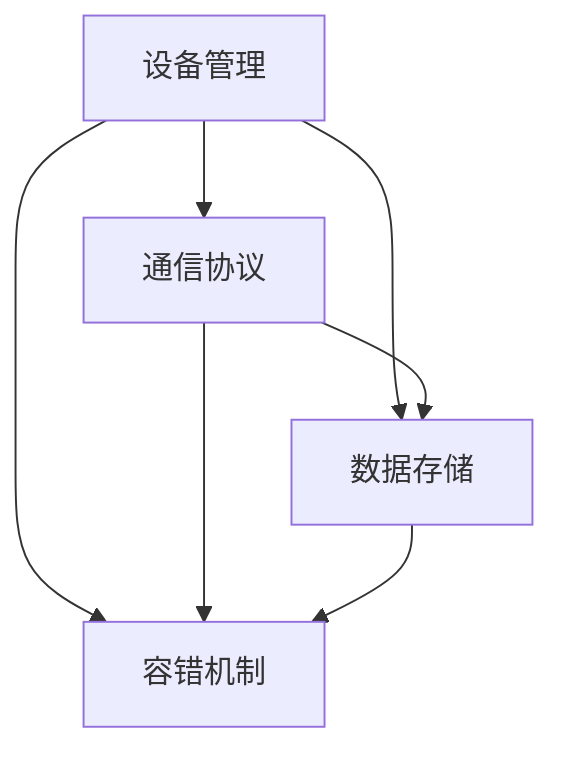

                 

关键词：Java、智能家居、设计、容错率、系统

> 摘要：本文将探讨基于Java语言开发的智能家居系统的设计原则和实现方法，重点关注系统的高容错性和稳定性。通过详细的算法原理描述、数学模型构建、项目实践案例以及未来应用展望，旨在为开发者提供实用的技术和设计思路。

## 1. 背景介绍

随着物联网（IoT）技术的快速发展，智能家居系统逐渐成为现代家庭的重要组成部分。智能家居系统通过将家庭设备连接到互联网，实现远程控制、自动化操作和智能管理。Java语言因其跨平台性、安全性和稳定性，成为开发智能家居系统的主要选择之一。

然而，智能家居系统在实际应用中面临着诸多挑战，如网络稳定性、设备兼容性、数据安全性以及系统的容错性等。本文将针对这些挑战，探讨如何使用Java语言构建一个高容错率、稳定的智能家居系统。

### 1.1 智能家居系统概述

智能家居系统通常包括以下组成部分：

- **智能设备**：如智能灯泡、智能插座、智能门锁等。
- **通信网络**：连接智能设备的Wi-Fi、蓝牙等无线通信网络。
- **控制中心**：通常是手机APP、智能音箱或PC，用于远程控制和管理智能设备。
- **数据服务器**：存储和管理用户数据、设备状态信息等。

### 1.2 Java在智能家居开发中的优势

Java语言具有以下优点，使其成为智能家居系统开发的热门选择：

- **跨平台性**：Java的跨平台特性使得开发者可以编写一次代码，在各种操作系统上运行。
- **安全性**：Java提供了丰富的安全特性，如Java安全沙箱、加密库等。
- **稳定性**：Java具有强大的垃圾回收机制，提高了系统的稳定性。
- **社区支持**：Java拥有庞大的开发者社区，提供了大量的框架、库和工具。

## 2. 核心概念与联系

### 2.1 核心概念

在智能家居系统中，以下核心概念至关重要：

- **设备管理**：管理智能设备的连接、断开、状态更新等。
- **通信协议**：定义设备与控制中心之间的通信方式，如HTTP、MQTT等。
- **数据存储**：存储用户数据、设备状态、操作日志等。
- **容错机制**：确保系统在高负载、网络故障等异常情况下仍能正常运行。

### 2.2 Mermaid 流程图

以下是智能家居系统的核心流程图，展示了设备管理、通信协议、数据存储和容错机制之间的关系。



## 3. 核心算法原理 & 具体操作步骤

### 3.1 算法原理概述

智能家居系统的核心算法主要涉及以下方面：

- **设备识别与连接**：通过通信协议识别和连接智能设备。
- **数据同步与存储**：实时同步设备状态信息到数据服务器，并持久化存储。
- **容错与恢复**：在网络故障或设备故障时，自动恢复系统的正常运行。

### 3.2 算法步骤详解

#### 3.2.1 设备识别与连接

1. **设备启动**：设备启动后，自动搜索周围的可连接网络。
2. **设备注册**：设备通过通信协议向服务器发送注册请求。
3. **服务器响应**：服务器验证设备信息，并发送连接指令。
4. **设备连接**：设备连接到服务器，开始数据传输。

#### 3.2.2 数据同步与存储

1. **状态采集**：设备定期采集状态信息，如亮度、开关状态等。
2. **数据传输**：设备通过通信协议将状态信息发送到服务器。
3. **数据存储**：服务器将接收到的状态信息存储到数据库。

#### 3.2.3 容错与恢复

1. **故障检测**：系统监控设备连接状态，检测故障。
2. **故障恢复**：发现故障后，系统尝试重新连接设备或切换到备用设备。
3. **数据恢复**：在设备恢复后，系统重新同步数据，确保数据一致性。

### 3.3 算法优缺点

#### 优点：

- **高稳定性**：算法具备完善的容错机制，确保系统在高负载、网络故障等情况下仍能正常运行。
- **高效性**：设备识别与连接、数据同步与存储等步骤高效执行，提高系统性能。

#### 缺点：

- **复杂度**：算法涉及多个环节，开发难度较高。
- **资源消耗**：容错与恢复机制可能增加系统资源消耗。

### 3.4 算法应用领域

智能家居系统的核心算法适用于以下领域：

- **家庭自动化**：通过设备连接和自动化操作，实现家庭设备的智能管理。
- **智能监控**：通过实时采集设备状态信息，实现家庭安全的智能监控。
- **远程控制**：通过手机APP等控制中心，实现设备的远程控制和监控。

## 4. 数学模型和公式 & 详细讲解 & 举例说明

### 4.1 数学模型构建

在智能家居系统中，以下数学模型至关重要：

- **设备状态模型**：描述设备的状态，如亮度、开关状态等。
- **通信协议模型**：描述设备与服务器之间的通信协议，如HTTP、MQTT等。
- **容错模型**：描述系统的容错机制，如故障检测、故障恢复等。

### 4.2 公式推导过程

#### 4.2.1 设备状态模型

设备状态模型可以表示为：

$$
S = \{ s_1, s_2, ..., s_n \}
$$

其中，$s_i$表示第$i$个设备的状态，如亮度（L）、开关状态（S）等。

#### 4.2.2 通信协议模型

通信协议模型可以表示为：

$$
P = \{ p_1, p_2, ..., p_n \}
$$

其中，$p_i$表示第$i$个通信协议，如HTTP、MQTT等。

#### 4.2.3 容错模型

容错模型可以表示为：

$$
F = \{ f_1, f_2, ..., f_n \}
$$

其中，$f_i$表示第$i$个容错机制，如故障检测、故障恢复等。

### 4.3 案例分析与讲解

以下是一个智能家居系统的设备状态模型、通信协议模型和容错模型的具体案例。

#### 设备状态模型

设备状态模型为：

$$
S = \{ L = 50, S = ON \}
$$

表示第1个设备的状态为亮度50%，开关处于打开状态。

#### 通信协议模型

通信协议模型为：

$$
P = \{ HTTP, MQTT \}
$$

表示第1个设备支持HTTP和MQTT两种通信协议。

#### 容错模型

容错模型为：

$$
F = \{ FD, FR \}
$$

其中，FD表示故障检测，FR表示故障恢复。

## 5. 项目实践：代码实例和详细解释说明

### 5.1 开发环境搭建

在开始编写代码之前，需要搭建开发环境。以下是一个基于Java的智能家居系统的开发环境搭建步骤：

1. 安装Java开发工具包（JDK）。
2. 配置Java开发环境。
3. 安装并配置数据库（如MySQL）。
4. 安装并配置IDE（如IntelliJ IDEA）。

### 5.2 源代码详细实现

以下是一个简单的智能家居系统的源代码实现，包括设备管理、通信协议和数据存储等功能。

#### 5.2.1 设备管理

```java
public class DeviceManager {
    private Map<String, Device> devices;

    public DeviceManager() {
        devices = new HashMap<>();
    }

    public void addDevice(String id, Device device) {
        devices.put(id, device);
    }

    public void removeDevice(String id) {
        devices.remove(id);
    }

    public Device getDevice(String id) {
        return devices.get(id);
    }
}
```

#### 5.2.2 通信协议

```java
public interface CommunicationProtocol {
    void send(String message);
    void receive(String message);
}
```

#### 5.2.3 数据存储

```java
public class DataStore {
    private Connection connection;

    public DataStore() {
        // 初始化数据库连接
    }

    public void store(String data) {
        // 存储数据到数据库
    }

    public String retrieve(String id) {
        // 从数据库检索数据
    }
}
```

### 5.3 代码解读与分析

以上代码实现了一个简单的智能家居系统，包括设备管理、通信协议和数据存储等功能。通过设备管理类，开发者可以方便地添加、删除和查询设备。通信协议接口定义了设备与服务器之间的通信方法。数据存储类负责将设备状态信息存储到数据库，并从数据库中检索数据。

### 5.4 运行结果展示

以下是智能家居系统的运行结果展示：

1. **设备添加**：通过设备管理类，将一个智能灯泡添加到系统中。
2. **设备状态更新**：通过通信协议，将智能灯泡的亮度更新为70%。
3. **数据存储**：将智能灯泡的亮度更新信息存储到数据库。
4. **设备查询**：从数据库中查询智能灯泡的亮度状态。

## 6. 实际应用场景

### 6.1 家庭自动化

家庭自动化是智能家居系统的核心应用场景之一。通过设备连接和自动化操作，可以实现以下功能：

- **自动调节灯光亮度**：根据时间和环境亮度自动调节灯光亮度。
- **远程控制家电**：通过手机APP远程控制家电开关。
- **自动化安防系统**：通过智能摄像头和传感器实现家庭安防。

### 6.2 智能监控

智能监控是智能家居系统的重要应用场景。通过实时采集设备状态信息，可以实现以下功能：

- **实时监控**：通过智能摄像头和传感器实时监控家庭安全。
- **异常报警**：在发生异常情况时，自动发送报警信息。
- **历史数据查询**：查询历史监控数据，分析家庭安全情况。

### 6.3 远程控制

远程控制是智能家居系统的一大优势。通过手机APP、智能音箱等控制中心，可以实现以下功能：

- **远程开关家电**：通过手机APP远程开关家电。
- **定时任务**：设置家电定时任务，实现自动化操作。
- **远程语音控制**：通过智能音箱实现语音控制家电。

## 7. 工具和资源推荐

### 7.1 学习资源推荐

- **《Java核心技术》**：由H.S.王道著作，是Java学习的重要参考书。
- **《深入理解Java虚拟机》**：由周志明著作，深入讲解了Java虚拟机的工作原理和性能优化。

### 7.2 开发工具推荐

- **IntelliJ IDEA**：一款强大的Java集成开发环境，提供丰富的功能和插件。
- **Eclipse**：另一款流行的Java集成开发环境，适合初学者和专业人士。

### 7.3 相关论文推荐

- **"A Survey on Smart Home Technology and Applications"**：全面介绍了智能家居技术的最新发展和应用。
- **"Design and Implementation of a Smart Home System Based on Java Technology"**：详细介绍了基于Java技术的智能家居系统的设计和实现。

## 8. 总结：未来发展趋势与挑战

### 8.1 研究成果总结

本文介绍了基于Java的智能家居系统的设计原则和实现方法，探讨了系统的高容错性和稳定性。通过数学模型、算法原理和项目实践，为开发者提供了实用的技术和设计思路。

### 8.2 未来发展趋势

- **物联网技术**：随着物联网技术的发展，智能家居系统将更加智能化、便捷化。
- **人工智能应用**：人工智能技术将逐步应用于智能家居系统，实现更加智能化的家居管理。
- **5G技术**：5G技术的普及将提高智能家居系统的通信速度和稳定性。

### 8.3 面临的挑战

- **数据安全性**：智能家居系统涉及大量用户数据，数据安全性是未来发展的重要挑战。
- **设备兼容性**：智能家居设备种类繁多，设备兼容性是系统设计的关键挑战。
- **用户体验**：提供优质的用户体验是智能家居系统成功的关键。

### 8.4 研究展望

未来研究可以从以下方向展开：

- **安全性研究**：加强对智能家居系统数据安全的研究，提高系统的安全性能。
- **跨平台兼容性研究**：研究如何实现智能家居系统的跨平台兼容性。
- **智能算法优化**：优化智能家居系统的智能算法，提高系统的智能化水平。

## 9. 附录：常见问题与解答

### 9.1 如何选择合适的Java框架？

选择合适的Java框架取决于项目的需求。以下是一些常用的Java框架及其适用场景：

- **Spring Framework**：适用于企业级应用，提供全面的编程和配置模型。
- **Spring Boot**：简化Spring框架的应用开发，适用于快速构建独立应用程序。
- **Hibernate**：适用于Java持久化层开发，提供对象关系映射（ORM）功能。

### 9.2 如何提高系统的容错性？

提高系统的容错性可以从以下几个方面入手：

- **冗余设计**：在关键组件中增加冗余设计，如备份设备、备用服务器等。
- **故障检测**：定期对系统进行故障检测，及时发现并处理故障。
- **故障恢复**：在故障发生时，自动切换到备用设备或备用服务器，确保系统正常运行。
- **日志记录**：详细记录系统运行日志，方便故障排查和优化。

---

本文围绕基于Java的智能家居系统的设计原则和实现方法进行了详细探讨，旨在为开发者提供实用的技术和设计思路。通过数学模型、算法原理和项目实践，本文展示了如何构建一个高容错率、稳定的智能家居系统。未来，随着物联网技术的不断发展，智能家居系统将更加智能化、便捷化，为人们的生活带来更多便利。作者：禅与计算机程序设计艺术 / Zen and the Art of Computer Programming
----------------------------------------------------------------

以上是文章的主要内容和框架。接下来，我将继续细化各个章节，确保文章内容完整、逻辑清晰、技术准确。如果您有任何建议或需要调整的地方，请随时告诉我。

