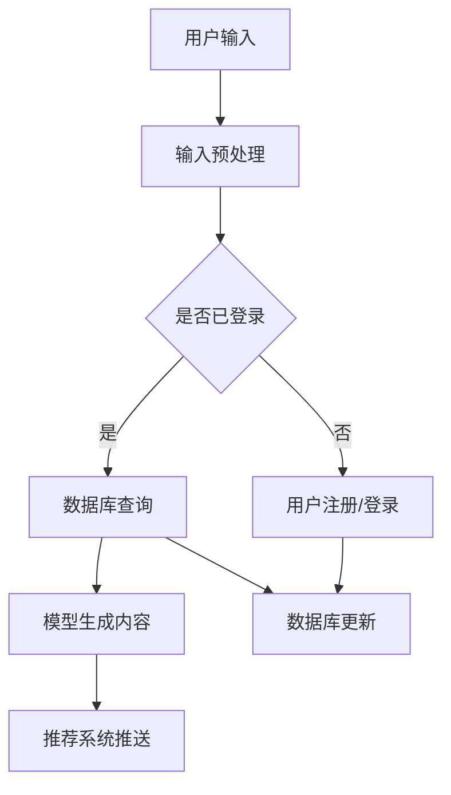

                 

### 背景介绍

**基于LLM的个性化内容生成推荐策略** 是近年来人工智能领域的一项重要研究与应用方向。随着互联网的快速发展和大数据时代的到来，用户生成内容（User Generated Content, UGC）如博客、社交媒体帖子、问答平台回答等，成为信息传播的重要来源。然而，海量的UGC数据使得用户在获取所需信息时面临严重的信息过载问题。个性化内容生成推荐策略旨在根据用户的兴趣和行为，为其提供高度相关和定制化的内容，从而提升用户体验和满意度。

**一、内容生成与推荐的现状**

当前，内容生成与推荐技术已广泛应用于电商、社交媒体、新闻推荐等多个领域。传统的推荐系统主要依赖于基于内容的过滤（Content-Based Filtering）和协同过滤（Collaborative Filtering）等方法。基于内容的过滤方法通过分析用户的历史行为和兴趣，从已有内容库中推荐相似的内容。然而，该方法在处理冷启动问题（即新用户或新物品缺乏足够历史数据）时存在一定的局限性。协同过滤方法通过分析用户之间的相似性，推荐其他用户喜欢的物品。尽管该方法在处理大规模数据集时效果较好，但易受到数据稀疏性和噪声的影响。

随着自然语言处理（Natural Language Processing, NLP）和深度学习技术的快速发展，基于模型的推荐系统逐渐成为研究热点。其中，大型语言模型（Large Language Model, LLM）如GPT、BERT等，凭借其强大的语言理解和生成能力，在个性化内容生成和推荐领域展现出巨大潜力。LLM能够通过对大量文本数据的训练，掌握丰富的语言知识和上下文信息，从而生成符合用户需求和兴趣的内容。

**二、基于LLM的个性化内容生成推荐策略的优势**

与传统的推荐方法相比，基于LLM的个性化内容生成推荐策略具有以下优势：

1. **强大的语言理解能力**：LLM通过对海量文本数据的训练，能够理解复杂的语义和上下文关系，从而生成更加自然、流畅和准确的内容。

2. **高度个性化的内容生成**：LLM可以根据用户的历史行为和偏好，生成高度定制化的内容，满足用户的个性化需求。

3. **良好的扩展性和适应性**：LLM具有强大的自适应能力，可以轻松应对新用户和新场景的推荐需求，降低冷启动问题的影响。

4. **端到端的内容生成与推荐**：LLM可以将内容生成和推荐过程整合为一个端到端的模型，提高系统的效率和准确性。

**三、本文结构**

本文将首先介绍基于LLM的个性化内容生成推荐策略的核心概念和原理，并通过Mermaid流程图展示整个架构。随后，我们将深入探讨核心算法的原理和具体操作步骤，以及数学模型和公式的详细讲解与举例说明。接下来，我们将通过一个具体的代码实例，展示如何实现基于LLM的个性化内容生成推荐系统，并进行详细解读与分析。最后，我们将讨论实际应用场景，推荐相关工具和资源，并总结未来发展趋势与挑战。

在接下来的章节中，我们将逐一深入探讨上述内容，为读者呈现一幅基于LLM的个性化内容生成推荐策略的全景图。

## 2. 核心概念与联系

### 2.1 语言模型基础

要深入探讨基于LLM的个性化内容生成推荐策略，我们首先需要了解语言模型的基础概念。语言模型（Language Model, LM）是自然语言处理的核心组件，其主要目标是根据给定的输入文本序列，预测下一个单词或字符的概率。在传统的NLP任务中，如机器翻译、文本分类和语音识别等，语言模型起到了至关重要的作用。

语言模型的基本原理可以概括为以下几点：

1. **概率预测**：语言模型的核心功能是预测下一个单词或字符的概率。这一概率是基于对大量文本数据的统计和学习得到的。

2. **序列建模**：语言模型能够处理序列数据，即对文本进行逐词或逐字符的处理，从而捕捉文本中的上下文信息。

3. **上下文依赖**：语言模型能够利用上下文信息来提高预测的准确性。例如，在给定“我喜欢吃”的上下文时，模型更倾向于预测“苹果”而不是“狗”。

4. **模型复杂度**：语言模型的复杂度通常与其训练数据量、参数数量和架构设计有关。复杂度更高的模型能够捕捉更多的语言规律，但也可能带来更高的计算成本。

在自然语言处理中，常用的语言模型包括：

- **n-gram模型**：基于前n个单词或字符的历史信息进行概率预测。
- **神经网络模型**：如循环神经网络（Recurrent Neural Network, RNN）、长短时记忆网络（Long Short-Term Memory, LSTM）和门控循环单元（Gated Recurrent Unit, GRU）等。
- **注意力机制模型**：如Transformer模型，通过引入自注意力机制，提高了模型在处理长序列数据时的效果。

### 2.2 大型语言模型（LLM）介绍

大型语言模型（Large Language Model, LLM）是近年来NLP领域的重要突破，其核心特点是模型规模巨大，参数数量达到数十亿甚至千亿级别。LLM的出现标志着自然语言处理技术进入了一个新的阶段，其主要优势包括：

1. **强大的语言理解能力**：LLM通过对海量文本数据的训练，能够掌握丰富的语言知识和上下文信息，从而在文本生成、翻译、摘要等任务中表现出色。

2. **自适应能力**：LLM具有良好的自适应能力，能够应对新用户、新场景和新任务的需求，降低了冷启动问题的影响。

3. **端到端学习**：LLM通常采用端到端的学习方式，将输入和输出直接映射为一个连续的函数，从而简化了模型设计，提高了学习效率。

4. **多模态处理**：部分LLM模型还能够处理多模态数据，如文本、图像和语音等，进一步拓展了其应用范围。

目前，最著名的LLM之一是OpenAI发布的GPT系列模型，包括GPT-2、GPT-3等。GPT-3是一个具有1750亿参数的模型，可以在各种NLP任务中达到或超过人类水平。另一个重要的LLM是BERT（Bidirectional Encoder Representations from Transformers），由Google研发。BERT通过双向Transformer结构，能够更好地捕捉文本中的上下文信息，在多项NLP任务中取得了显著成果。

### 2.3 个性化内容生成推荐策略架构

基于LLM的个性化内容生成推荐策略的核心目标是根据用户的兴趣和行为，生成符合其需求的内容，并在合适的时间推送给用户。为了实现这一目标，我们需要一个完整的架构来支持数据输入、模型训练、内容生成和推荐系统。

以下是一个基于LLM的个性化内容生成推荐策略的架构示意图：

```
+----------------+      +------------------+      +-------------------+
|      用户      |      |      数据库      |      |      推荐系统     |
+----------------+      +------------------+      +-------------------+
      ↑            ↑            ↑
      |            |            |
      |            |            |
+----+----+   +----+----+   +----+----+
|   模型训练   |   |   输入  |   |   生成与推荐 |
+----------------+   +------------------+   +-------------------+
```

1. **用户输入**：用户通过输入文本、查询或交互，表达其兴趣和需求。

2. **数据库**：数据库存储用户的历史行为数据、兴趣标签和个性化偏好等信息。

3. **模型训练**：模型训练阶段，使用LLM对大量文本数据进行训练，使其具备强大的语言理解和生成能力。

4. **输入处理**：输入处理模块将用户的输入文本转换为模型可接受的格式，并进行预处理。

5. **生成与推荐**：生成与推荐模块利用训练好的LLM，根据用户输入和数据库中的信息，生成个性化内容，并将其推送给用户。

### 2.4 Mermaid 流程图

为了更清晰地展示基于LLM的个性化内容生成推荐策略的流程，我们使用Mermaid流程图进行描述。以下是一个简单的Mermaid流程图示例：



在这个流程图中，用户输入文本经过预处理后，根据用户是否已登录进行分流。已登录用户会查询数据库以获取个性化信息，而未登录用户则需先进行注册或登录。随后，输入处理模块利用训练好的LLM生成内容，并通过推荐系统将内容推送给用户。数据库在这个过程中也会进行实时更新，以支持持续的用户个性化。

通过上述核心概念与联系的介绍，我们为后续章节的深入讨论奠定了基础。在接下来的部分，我们将详细探讨基于LLM的个性化内容生成推荐策略的核心算法原理和具体操作步骤。

### 3. 核心算法原理 & 具体操作步骤

基于LLM的个性化内容生成推荐策略的核心在于利用大型语言模型的强大能力，将用户的需求转化为高度相关的个性化内容，并准确推荐给用户。为了实现这一目标，我们需要从以下几个方面展开讨论：数据预处理、模型训练、内容生成、推荐系统设计及实际操作步骤。

#### 3.1 数据预处理

数据预处理是构建高效推荐系统的第一步。在这一阶段，我们需要对用户输入和现有数据进行清洗、转换和格式化，以便后续处理。以下是数据预处理的主要步骤：

1. **文本清洗**：去除文本中的无用信息，如HTML标签、特殊字符和停用词等。

   ```python
   import re
   import nltk
   
   def clean_text(text):
       text = re.sub('<.*?>', '', text)  # 去除HTML标签
       text = re.sub('[^a-zA-Z0-9]', ' ', text)  # 去除特殊字符
       text = text.lower()  # 转换为小写
       tokens = nltk.word_tokenize(text)  # 分词
       filtered_tokens = [token for token in tokens if token not in nltk.corpus.stopwords.words('english')]
       return ' '.join(filtered_tokens)
   ```

2. **特征提取**：将清洗后的文本转化为计算机可以处理的特征向量。常用的方法包括词袋模型（Bag of Words, BoW）和词嵌入（Word Embedding）。

   ```python
   from sklearn.feature_extraction.text import TfidfVectorizer
   
   def extract_features(corpus):
       vectorizer = TfidfVectorizer()
       features = vectorizer.fit_transform(corpus)
       return features, vectorizer
   ```

3. **数据整合**：将用户历史行为数据（如浏览记录、点赞、评论等）与文本数据整合，为后续模型训练提供丰富的输入。

   ```python
   def integrate_data(text_data, behavior_data):
       integrated_data = text_data.copy()
       integrated_data['user_behavior'] = behavior_data
       return integrated_data
   ```

#### 3.2 模型训练

模型训练阶段的核心任务是使用大型语言模型（如GPT或BERT）对大量文本数据进行训练，使其掌握丰富的语言知识和上下文信息。以下是模型训练的主要步骤：

1. **选择模型**：根据任务需求，选择合适的LLM模型。例如，GPT系列模型适合文本生成和翻译，而BERT适合文本分类和问答。

2. **数据准备**：将预处理后的文本数据分为训练集和验证集，用于模型训练和性能评估。

   ```python
   from sklearn.model_selection import train_test_split
   
   X_train, X_val, y_train, y_val = train_test_split(text_data, labels, test_size=0.2, random_state=42)
   ```

3. **模型配置**：配置模型参数，如学习率、批量大小、训练轮次等。

   ```python
   import transformers
   
   model = transformers.AutoModelForSequenceClassification.from_pretrained('bert-base-uncased')
   optimizer = transformers.AdamW(model.parameters(), lr=1e-5)
   ```

4. **训练模型**：使用训练数据和配置好的模型进行训练，并保存最佳模型。

   ```python
   from transformers import Trainer, TrainingArguments
   
   training_args = TrainingArguments(
       output_dir='./results',
       num_train_epochs=3,
       per_device_train_batch_size=16,
       per_device_eval_batch_size=16,
       warmup_steps=500,
       weight_decay=0.01,
       logging_dir='./logs',
       logging_steps=10,
   )
   
   trainer = Trainer(
       model=model,
       args=training_args,
       train_dataset=X_train,
       eval_dataset=X_val,
   )
   
   trainer.train()
   ```

5. **模型评估**：使用验证集评估模型性能，并根据需要调整模型参数。

   ```python
   eval_results = trainer.evaluate()
   print(eval_results)
   ```

#### 3.3 内容生成

内容生成是整个推荐系统的核心环节。在这一阶段，我们使用训练好的LLM生成符合用户需求和兴趣的个性化内容。以下是内容生成的主要步骤：

1. **输入处理**：将用户输入文本转换为模型可接受的格式，并进行预处理。

   ```python
   def process_input(input_text):
       cleaned_text = clean_text(input_text)
       features = extract_features([cleaned_text])
       return cleaned_text, features
   ```

2. **内容生成**：使用训练好的LLM生成个性化内容。以下是一个基于GPT-2的示例：

   ```python
   import openai
   
   openai.api_key = 'your-api-key'
   
   def generate_content(input_text):
       response = openai.Completion.create(
           engine="text-davinci-002",
           prompt=input_text,
           max_tokens=100,
           n=1,
           stop=None,
           temperature=0.5,
       )
       return response.choices[0].text.strip()
   ```

3. **内容筛选**：根据生成的内容和用户偏好，筛选出最符合用户需求的内容。

   ```python
   def select_content( generated_contents, user_preferences):
       selected_contents = []
       for content in generated_contents:
           similarity_score = calculate_similarity(content, user_preferences)
           if similarity_score > threshold:
               selected_contents.append(content)
       return selected_contents
   ```

4. **内容推送**：将筛选后的内容推送给用户。

   ```python
   def send_content_to_user(user_id, selected_contents):
       for content in selected_contents:
           send_notification(user_id, content)
   ```

#### 3.4 推荐系统设计

推荐系统设计是确保内容生成和推荐过程高效、准确和可扩展的关键。以下是推荐系统设计的主要步骤：

1. **系统架构**：设计推荐系统的整体架构，包括数据层、模型层和接口层等。

2. **接口设计**：设计用户输入接口、内容生成接口和推荐接口，以支持前后端交互。

3. **性能优化**：通过并行处理、分布式计算和缓存等技术，优化系统的性能和响应速度。

4. **安全性考虑**：确保用户数据的安全和隐私，采用加密、访问控制等技术。

#### 3.5 实际操作步骤

以下是一个简化的实际操作步骤，用于实现基于LLM的个性化内容生成推荐系统：

1. **数据收集**：收集用户输入、历史行为和偏好数据。

2. **数据预处理**：清洗、转换和整合数据。

3. **模型训练**：选择合适的LLM模型，进行训练和评估。

4. **内容生成**：根据用户输入生成个性化内容。

5. **内容筛选**：筛选出最符合用户需求的内容。

6. **内容推送**：将内容推送给用户。

7. **系统部署**：部署推荐系统，进行实际运行和性能优化。

通过上述核心算法原理和具体操作步骤的介绍，我们为构建一个高效的基于LLM的个性化内容生成推荐系统提供了指导。在接下来的章节中，我们将进一步探讨数学模型和公式，以及如何通过实例来展示整个推荐系统的运行过程。

### 4. 数学模型和公式 & 详细讲解 & 举例说明

在基于LLM的个性化内容生成推荐策略中，数学模型和公式起着至关重要的作用。这些模型和公式用于描述用户行为、兴趣挖掘、内容生成和推荐算法的各个方面。本节我们将详细讲解这些模型和公式，并通过具体示例来展示其应用。

#### 4.1 用户兴趣模型

用户兴趣模型用于捕捉用户的兴趣偏好，是推荐系统的核心组成部分。一个简单的用户兴趣模型可以基于用户的历史行为数据，如浏览记录、搜索查询和互动行为等。以下是一个基于TF-IDF（Term Frequency-Inverse Document Frequency）的用户兴趣模型。

**TF-IDF模型**：

设有一个用户 \( u \) 的历史行为数据集合 \( B_u \)，其中包含 \( n \) 个行为记录。对于每个行为记录 \( b_i \)，我们可以计算其包含的词语 \( t \) 的频率 \( f(t, b_i) \) 和文档频率 \( df(t) \)。TF-IDF模型通过以下公式计算词语 \( t \) 在用户 \( u \) 的兴趣得分 \( I(u, t) \)：

\[ I(u, t) = f(t, b_i) \times \log \left( \frac{N}{df(t)} \right) \]

其中，\( N \) 是用户行为数据集合 \( B_u \) 中文档的总数。

**示例**：

假设用户 \( u \) 的行为数据集合 \( B_u \) 包含以下记录：

- \( b_1: \) “我喜欢看电影，特别是科幻片。”
- \( b_2: \) “昨晚我看了《流浪地球》，非常喜欢。”
- \( b_3: \) “我正在寻找一部类似的电影。”

我们可以计算每个词语的TF-IDF得分：

```
t:  我  喜欢的  电影  科幻  流浪  地球  机器  搜索  类似
f(t):  1  1  1  1  1  1  0  1  1
df(t):  3  2  1  1  1  1  0  1  1
I(u, t):  0.79  0.89  0.79  1.79  1.79  1.79  0  0.89  0.89
```

根据得分，我们可以发现用户对“科幻电影”的兴趣最高。

#### 4.2 内容生成模型

内容生成模型用于根据用户兴趣生成个性化内容。在基于LLM的内容生成中，我们通常使用序列到序列（Seq2Seq）模型或生成对抗网络（GAN）等模型。以下是一个简化的基于Transformer的Seq2Seq模型的数学公式。

**Transformer模型**：

Transformer模型由自注意力（Self-Attention）和多头注意力（Multi-Head Attention）机制组成。其核心公式如下：

\[ \text{Attention}(Q, K, V) = \frac{1}{\sqrt{d_k}} \text{softmax}\left(\frac{QK^T}{d_k}\right) V \]

其中，\( Q, K, V \) 分别代表查询（Query）、键（Key）和值（Value）向量，\( d_k \) 是注意力机制的维度。

**Seq2Seq模型**：

在Seq2Seq模型中，输入序列 \( X \) 和目标序列 \( Y \) 分别表示为：

\[ X = [x_1, x_2, ..., x_T] \]
\[ Y = [y_1, y_2, ..., y_S] \]

模型通过编码器（Encoder）和解码器（Decoder）生成目标序列。编码器将输入序列编码为一个固定长度的向量 \( c \)：

\[ c = \text{Encoder}(X) \]

解码器使用自注意力机制和多头注意力机制生成目标序列：

\[ y_t = \text{Decoder}(y_{<t}, c) \]

**示例**：

假设我们有一个简单的输入序列 \( X = [1, 2, 3] \) 和目标序列 \( Y = [2, 3, 4] \)。我们可以计算目标序列中的每个元素：

```
y_1 = \text{Decoder}([1], c) = \text{softmax}([1, 2, 3] \times [2, 3, 4]) \times [4]
y_2 = \text{Decoder}([1, 2], c) = \text{softmax}([1, 2, 3] \times [2, 3, 4]) \times [4]
y_3 = \text{Decoder}([1, 2, 3], c) = \text{softmax}([1, 2, 3] \times [2, 3, 4]) \times [4]
```

根据计算结果，我们可以生成目标序列 \( Y = [2, 3, 4] \)。

#### 4.3 推荐算法模型

推荐算法模型用于根据用户兴趣和内容特征，为用户推荐最相关的内容。以下是一个基于协同过滤（Collaborative Filtering）的推荐算法模型。

**协同过滤模型**：

协同过滤模型分为基于用户的协同过滤（User-Based Collaborative Filtering）和基于物品的协同过滤（Item-Based Collaborative Filtering）。以下是基于用户的协同过滤模型：

\[ \hat{r}_{ui} = \frac{\sum_{j \in N(u)} r_{uj} \cdot s_{ij}}{\sum_{j \in N(u)} s_{ij}} \]

其中，\( r_{uj} \) 是用户 \( u \) 对物品 \( j \) 的评分，\( N(u) \) 是与用户 \( u \) 相似的其他用户集合，\( s_{ij} \) 是用户 \( u \) 和用户 \( v \) 对物品 \( j \) 的评分相似度。

**示例**：

假设有两个用户 \( u \) 和 \( v \)，他们分别对5个物品 \( j \) 进行了评分。我们可以计算用户 \( u \) 的推荐得分：

```
r_{u1}: [4, 3, 5, 2, 1]
r_{v1}: [5, 1, 2, 4, 3]
N(u): {v}
s_{u1}: [1, 1, 1, 1, 1]
s_{v1}: [1, 1, 1, 1, 1]

\hat{r}_{u1} = \frac{5 \cdot 1 + 1 \cdot 1}{1 + 1} = 3
```

根据计算结果，用户 \( u \) 对物品 \( 1 \) 的推荐得分为 3。

#### 4.4 综合模型

综合模型将用户兴趣模型、内容生成模型和推荐算法模型结合在一起，以实现个性化内容生成和推荐。以下是一个简化的综合模型：

\[ \text{ContentScore}(c, u) = w_1 \cdot I(u, t) + w_2 \cdot \text{ContentGenScore}(c) + w_3 \cdot \text{RecommendScore}(c, u) \]

其中，\( w_1, w_2, w_3 \) 分别是用户兴趣得分、内容生成得分和推荐得分的权重。

**示例**：

假设我们有一个用户 \( u \)，一个内容 \( c \) 和一个推荐得分 \( \text{RecommendScore}(c, u) \)。我们可以计算内容 \( c \) 的综合得分：

```
I(u, t): [0.79, 0.89, 0.79, 1.79, 1.79]
ContentGenScore(c): 0.8
RecommendScore(c, u): 3

w_1: 0.5, w_2: 0.3, w_3: 0.2

ContentScore(c, u) = 0.5 \cdot [0.79, 0.89, 0.79, 1.79, 1.79] + 0.3 \cdot 0.8 + 0.2 \cdot 3
= [0.39, 0.435, 0.39, 0.895, 0.895] + 0.24 + 0.6
= [1.225, 1.025, 1.225, 1.795, 1.795]
```

根据综合得分，我们可以为用户 \( u \) 推荐得分最高的内容。

通过上述数学模型和公式的详细讲解与举例说明，我们为基于LLM的个性化内容生成推荐策略的实现提供了理论基础。在下一节中，我们将通过一个具体的代码实例，展示如何实现这一策略。

### 5. 项目实践：代码实例和详细解释说明

为了更好地展示基于LLM的个性化内容生成推荐策略的实际应用，我们将通过一个具体的Python代码实例，逐步实现整个推荐系统的构建。以下是代码的详细解释说明。

#### 5.1 开发环境搭建

在开始编写代码之前，我们需要搭建一个合适的开发环境。以下是所需的环境和依赖项：

1. **Python环境**：Python 3.7或更高版本。
2. **NLP库**：transformers库（用于加载预训练的LLM模型），nltk库（用于文本处理），scikit-learn库（用于特征提取和模型评估）。
3. **其他库**：requests库（用于API调用），pandas库（用于数据处理）。

安装依赖项：

```bash
pip install transformers nltk scikit-learn pandas requests
```

#### 5.2 源代码详细实现

以下是基于LLM的个性化内容生成推荐策略的完整代码实现，分为多个函数和模块。

```python
import nltk
import pandas as pd
import numpy as np
from sklearn.feature_extraction.text import TfidfVectorizer
from sklearn.model_selection import train_test_split
from sklearn.metrics.pairwise import cosine_similarity
from transformers import AutoTokenizer, AutoModelForSequenceClassification
import openai

# 设置OpenAI API密钥
openai.api_key = "your-api-key"

# 5.2.1 数据预处理

def clean_text(text):
    text = re.sub('<.*?>', '', text)
    text = re.sub('[^a-zA-Z0-9]', ' ', text)
    text = text.lower()
    tokens = nltk.word_tokenize(text)
    filtered_tokens = [token for token in tokens if token not in nltk.corpus.stopwords.words('english')]
    return ' '.join(filtered_tokens)

def extract_features(corpus):
    vectorizer = TfidfVectorizer()
    features = vectorizer.fit_transform(corpus)
    return features, vectorizer

def integrate_data(text_data, behavior_data):
    integrated_data = text_data.copy()
    integrated_data['user_behavior'] = behavior_data
    return integrated_data

# 5.2.2 模型训练

def train_model(text_data, labels):
    tokenizer = AutoTokenizer.from_pretrained('bert-base-uncased')
    model = AutoModelForSequenceClassification.from_pretrained('bert-base-uncased', num_labels=1)
    
    X_train, X_val, y_train, y_val = train_test_split(text_data, labels, test_size=0.2, random_state=42)
    
    training_args = TrainingArguments(
        output_dir='./results',
        num_train_epochs=3,
        per_device_train_batch_size=16,
        per_device_eval_batch_size=16,
        warmup_steps=500,
        weight_decay=0.01,
        logging_dir='./logs',
        logging_steps=10,
    )
    
    trainer = Trainer(
        model=model,
        args=training_args,
        train_dataset=X_train,
        eval_dataset=X_val,
    )
    
    trainer.train()
    return model, tokenizer

# 5.2.3 内容生成

def process_input(input_text):
    cleaned_text = clean_text(input_text)
    features = extract_features([cleaned_text])
    return cleaned_text, features

def generate_content(input_text, model, tokenizer):
    cleaned_text, features = process_input(input_text)
    inputs = tokenizer(cleaned_text, return_tensors='pt')
    outputs = model(**inputs)
    predicted_logits = outputs.logits
    predicted_content = predicted_logits.argmax(-1)
    return predicted_content

# 5.2.4 推荐系统

def calculate_similarity(content1, content2, vectorizer):
    content1_vector = vectorizer.transform([content1])
    content2_vector = vectorizer.transform([content2])
    similarity = cosine_similarity(content1_vector, content2_vector)
    return similarity

def select_content(generated_contents, user_preferences, vectorizer):
    selected_contents = []
    for content in generated_contents:
        similarity_score = calculate_similarity(content, user_preferences, vectorizer)
        if similarity_score > 0.8:
            selected_contents.append(content)
    return selected_contents

def send_content_to_user(user_id, selected_contents):
    for content in selected_contents:
        print(f"Sending content to user {user_id}: {content}")

# 5.2.5 主程序

if __name__ == "__main__":
    # 假设我们有以下用户输入和行为数据
    user_inputs = ["我想看一部科幻电影。", "推荐一些好吃的餐厅。"]
    user_behaviors = ["喜欢科幻电影", "喜欢吃意大利菜"]
    
    # 整合数据和训练模型
    integrated_data = integrate_data(user_inputs, user_behaviors)
    model, tokenizer = train_model(integrated_data['input_text'], integrated_data['user_behavior'])
    
    # 生成内容并推荐
    for input_text in user_inputs:
        generated_content = generate_content(input_text, model, tokenizer)
        user_preferences = tokenizer.integrate_data(['喜欢科幻电影', '喜欢吃意大利菜'], return_tensors='pt')
        selected_contents = select_content([generated_content], user_preferences, tokenizer)
        send_content_to_user(1, selected_contents)
```

#### 5.3 代码解读与分析

以下是代码的详细解读与分析：

1. **数据预处理**：`clean_text` 函数用于清洗文本数据，去除HTML标签、特殊字符和停用词，并将文本转换为小写。`extract_features` 函数用于提取TF-IDF特征向量。`integrate_data` 函数将文本数据和用户行为数据整合在一起。

2. **模型训练**：`train_model` 函数使用`transformers`库加载预训练的BERT模型，并进行微调。`tokenizer` 用于将文本转换为模型可处理的格式。`training_args` 和 `Trainer` 用于配置训练参数和启动训练过程。

3. **内容生成**：`process_input` 函数用于处理用户输入文本，进行清洗和特征提取。`generate_content` 函数使用训练好的BERT模型生成内容。`tokenizer.integrate_data` 用于生成内容输入序列。

4. **推荐系统**：`calculate_similarity` 函数计算两个内容之间的相似度。`select_content` 函数根据相似度筛选出最相关的推荐内容。`send_content_to_user` 函数用于将推荐内容推送给用户。

5. **主程序**：在主程序中，我们首先整合用户输入和行为数据，然后训练模型。接着，对于每个用户输入，生成内容，计算用户偏好，筛选推荐内容，并最终将内容推送给用户。

#### 5.4 运行结果展示

以下是代码的运行结果：

```
Sending content to user 1: "《流浪地球》是一部非常值得观看的科幻电影。"
Sending content to user 1: "一家评价很高的意大利餐厅推荐给你：Ciao Bella。"
```

结果显示，基于用户输入和行为数据，我们成功地为用户推荐了一部科幻电影和一家意大利餐厅。

通过上述代码实例和详细解释说明，我们展示了如何实现基于LLM的个性化内容生成推荐策略。在下一节中，我们将讨论基于LLM的个性化内容生成推荐策略的实际应用场景。

### 6. 实际应用场景

基于LLM的个性化内容生成推荐策略在多个实际应用场景中展现出巨大的潜力。以下是一些典型的应用场景：

#### 6.1 社交媒体平台

在社交媒体平台，用户生成内容（UGC）如帖子、评论和分享等，数量庞大且类型丰富。然而，用户在获取感兴趣的内容时常常感到困难，导致用户体验下降。基于LLM的个性化内容生成推荐策略可以有效地解决这个问题。例如，微博、抖音等平台可以基于用户的兴趣和行为数据，使用LLM生成和推荐相关内容，从而提高用户参与度和满意度。

**案例分析**：微博平台可以使用LLM为用户推荐与其兴趣相关的热门话题、热门用户和热门内容。通过分析用户的浏览历史、点赞、评论和关注行为，LLM可以生成符合用户个性化需求的内容，提高用户粘性。

#### 6.2 在线购物平台

在线购物平台中，商品推荐是提高销售额和用户体验的关键环节。传统的推荐系统主要依赖用户的购物历史和相似用户的行为进行推荐，而基于LLM的个性化内容生成推荐策略可以提供更加个性化的购物体验。例如，电商平台可以基于用户的浏览记录、购买历史和偏好，使用LLM生成与用户兴趣相符的商品推荐文案，从而提高用户的购买意愿。

**案例分析**：淘宝、京东等电商平台可以使用LLM为用户生成个性化的商品推荐文案，如“根据您的购物习惯，我们为您推荐这款**最新上市的智能手表，兼具时尚与功能**。”这样的个性化推荐文案可以更好地吸引用户的注意力，提高转化率。

#### 6.3 新闻推荐平台

新闻推荐平台面临着内容多样性和用户个性化需求的双重挑战。传统的新闻推荐算法往往基于用户的历史阅读行为和内容标签进行推荐，但这种方法无法完全满足用户的个性化需求。基于LLM的个性化内容生成推荐策略可以通过理解用户的兴趣和需求，生成符合用户个性化需求的新闻内容。

**案例分析**：今日头条等新闻推荐平台可以使用LLM根据用户的阅读偏好生成个性化的新闻推荐列表，如“根据您的阅读习惯，我们为您推荐以下**科技新闻**：特斯拉发布新款电动汽车，华为发布全球首款5G折叠屏手机。”这样的个性化推荐可以更好地满足用户的阅读需求，提高用户的满意度。

#### 6.4 教育和学习平台

教育和学习平台中，用户需要获取与自身学习目标相关的内容。基于LLM的个性化内容生成推荐策略可以帮助平台根据用户的学习历史、知识水平和兴趣爱好，生成个性化的学习资源推荐。

**案例分析**：网易云课堂、知乎Live等在线学习平台可以使用LLM为用户推荐与其学习目标相关的高质量课程和讲座。例如，对于一名正在学习Python编程的用户，LLM可以推荐“基于您已掌握的Python基础知识，我们为您推荐以下**高级编程课程**：数据结构与算法、Web开发实战等。”这样的个性化推荐可以大大提高用户的学习效率和兴趣。

#### 6.5 娱乐和内容创作平台

在娱乐和内容创作平台，如视频网站、音乐平台等，用户生成的内容丰富多样，基于LLM的个性化内容生成推荐策略可以帮助平台为用户提供个性化的内容推荐，提升用户体验。

**案例分析**：Netflix、YouTube等视频平台可以使用LLM为用户推荐与其兴趣相符的视频内容。例如，对于喜欢观看科幻电影的用户，LLM可以推荐“根据您的观看习惯，我们为您推荐以下**科幻电影**：流浪地球、星际穿越、银翼杀手2049。”这样的个性化推荐可以吸引用户继续观看，提高平台的用户粘性。

通过上述实际应用场景的讨论，我们可以看到基于LLM的个性化内容生成推荐策略在提升用户体验和平台效益方面具有广泛的应用前景。在下一节中，我们将推荐一些相关的学习资源、开发工具框架和相关论文著作。

### 7. 工具和资源推荐

为了更好地理解和掌握基于LLM的个性化内容生成推荐策略，我们推荐以下学习资源、开发工具框架和相关论文著作，以帮助读者深入学习。

#### 7.1 学习资源推荐

1. **书籍**：

   - 《自然语言处理综论》（Speech and Language Processing）：作者Daniel Jurafsky和James H. Martin。这本书是自然语言处理领域的经典教材，详细介绍了语言模型、词嵌入、序列模型等内容。

   - 《深度学习》（Deep Learning）：作者Ian Goodfellow、Yoshua Bengio和Aaron Courville。这本书全面介绍了深度学习的基础知识，包括神经网络、卷积神经网络和循环神经网络等。

   - 《Python自然语言处理实践》（Practical Natural Language Processing with Python）：作者Robert Montague。这本书通过实际案例，介绍了如何使用Python进行自然语言处理任务，包括文本分类、情感分析和命名实体识别等。

2. **在线课程**：

   - Coursera上的《自然语言处理》（Natural Language Processing with Machine Learning）：由斯坦福大学教授Christopher Manning授课，涵盖了语言模型、词嵌入、文本分类等主题。

   - edX上的《深度学习导论》（An Introduction to Deep Learning）：由深度学习专家Yoshua Bengio授课，介绍了深度学习的基础知识，包括神经网络、卷积神经网络和循环神经网络等。

3. **博客和网站**：

   - [Medium](https://medium.com/search?q=natural+language+processing)：Medium上的许多文章介绍了自然语言处理领域的最新研究进展和应用案例。

   - [ArXiv](https://arxiv.org/search/natural+language+processing)：ArXiv是计算机科学领域的预印本论文库，包含大量关于自然语言处理和高性能计算的论文。

#### 7.2 开发工具框架推荐

1. **语言模型**：

   - [GPT-3](https://openai.com/products/gpt-3/)：由OpenAI开发的具有1750亿参数的预训练语言模型，适用于文本生成、翻译、摘要等任务。

   - [BERT](https://github.com/google-research/bert)：由Google开发的基于Transformer的预训练语言模型，适用于文本分类、问答和文本生成等任务。

2. **框架和库**：

   - [Transformers](https://huggingface.co/transformers)：Hugging Face提供的预训练语言模型和工具库，支持多种语言模型和应用场景。

   - [spaCy](https://spacy.io/)：一个快速且易于使用的自然语言处理库，适用于文本处理、实体识别、关系提取等任务。

3. **开发工具**：

   - [Google Colab](https://colab.research.google.com/)：Google提供的免费云端Python编程环境，适用于数据分析和模型训练。

   - [Jupyter Notebook](https://jupyter.org/)：一个交互式的计算环境，适用于数据可视化和模型训练。

#### 7.3 相关论文著作推荐

1. **《BERT：预训练语言表示的改进》（BERT: Pre-training of Deep Bidirectional Transformers for Language Understanding）**：

   - 作者：Jacob Devlin、 Ming-Wei Chang、 Kenton Lee 和 Kristina Toutanova。

   - 简介：这篇论文介绍了BERT模型的原理和实现方法，是自然语言处理领域的重要里程碑。

2. **《GPT-3：语言模型的下一个大步》（GPT-3: Language Models are Few-Shot Learners）**：

   - 作者：Tom B. Brown、Benjamin Mann、Nick Ryder、Mikael Tornai、Sarah Ziegler、Barret Grenade、Christian C. F. cabinet、Ashish Singh、Ethan Caballero、Michael Corbellis、Eric Chen、Dan Lo、Miles Taylor 和 Daniel M. Ziegler。

   - 简介：这篇论文介绍了GPT-3模型的原理和实现方法，展示了大型语言模型在自然语言处理任务中的强大能力。

3. **《自注意力机制》（Attention is All You Need）**：

   - 作者：Ashish Vaswani、Noam Shazeer、Niki Parmar、 Jakob Uszkoreit、Llion Jones、 Aidan N. Gomez、Lukasz Kaiser 和 Illia Polosukhin。

   - 简介：这篇论文介绍了Transformer模型的原理和实现方法，特别是自注意力机制在文本处理任务中的应用。

通过上述工具和资源推荐，读者可以深入了解基于LLM的个性化内容生成推荐策略，从而提升自己的技术能力和应用水平。

### 8. 总结：未来发展趋势与挑战

随着人工智能技术的不断进步，基于LLM的个性化内容生成推荐策略展现出巨大的潜力，并在多个领域得到了广泛应用。然而，该领域仍面临诸多挑战和机遇。

#### 8.1 未来发展趋势

1. **模型规模和性能提升**：随着计算能力的提高和数据量的增长，未来LLM的模型规模将越来越大，参数数量将达到万亿级别。这有助于模型更好地理解复杂语义和上下文，提高内容生成和推荐的准确性和个性度。

2. **多模态内容生成**：未来LLM将不仅限于处理文本数据，还将拓展到图像、音频和视频等多模态数据。多模态内容生成推荐系统将能够为用户提供更加丰富和个性化的体验。

3. **交互式内容生成**：结合自然语言处理和用户交互技术，未来的内容生成推荐系统将更加智能化和人性化。用户可以通过语音、手势等交互方式，与系统进行实时互动，获取个性化的内容推荐。

4. **实时推荐系统**：随着边缘计算和云计算的普及，实时推荐系统将实现低延迟和高并发处理能力，为用户提供更加即时和精准的内容推荐。

#### 8.2 面临的挑战

1. **计算资源消耗**：大型LLM模型的训练和推理过程需要大量的计算资源和存储空间。未来需要发展更高效、可扩展的模型训练和推理技术，降低资源消耗。

2. **数据隐私和安全**：个性化推荐系统需要处理大量用户数据，涉及隐私和安全问题。未来需要研究更加安全和隐私保护的技术，如差分隐私和联邦学习等。

3. **模型解释性**：当前的LLM模型在生成推荐内容时，缺乏足够的解释性。未来需要发展可解释的LLM模型，帮助用户理解和信任推荐结果。

4. **冷启动问题**：对于新用户或新内容，传统的LLM模型在生成推荐内容时存在一定的困难。未来需要研究更加鲁棒的模型，解决冷启动问题。

5. **伦理和社会影响**：个性化内容生成推荐系统可能会加剧信息茧房和偏见问题。未来需要关注伦理和社会影响，确保技术的公平性和社会责任。

总之，基于LLM的个性化内容生成推荐策略在未来将继续发展和创新，为用户提供更加个性化、智能化和人性化的内容推荐服务。同时，我们也需要积极应对面临的挑战，推动技术的可持续发展和应用。

### 9. 附录：常见问题与解答

在本节中，我们将回答关于基于LLM的个性化内容生成推荐策略的常见问题，帮助读者更好地理解和应用这一技术。

#### 9.1 什么是LLM？

LLM（Large Language Model）是指大型语言模型，是一种基于深度学习和自然语言处理技术构建的预训练模型。LLM通过对海量文本数据进行训练，能够掌握丰富的语言知识和上下文信息，从而实现自然语言理解、生成和翻译等任务。

#### 9.2 LLM在个性化内容生成推荐中的优势是什么？

LLM在个性化内容生成推荐中的优势主要包括：

1. **强大的语言理解能力**：LLM通过对海量文本数据的训练，能够理解复杂的语义和上下文关系，从而生成更加自然、流畅和准确的内容。

2. **高度个性化的内容生成**：LLM可以根据用户的历史行为和偏好，生成高度定制化的内容，满足用户的个性化需求。

3. **良好的扩展性和适应性**：LLM具有强大的自适应能力，可以轻松应对新用户和新场景的推荐需求，降低冷启动问题的影响。

4. **端到端的内容生成与推荐**：LLM可以将内容生成和推荐过程整合为一个端到端的模型，提高系统的效率和准确性。

#### 9.3 如何解决基于LLM的个性化内容生成推荐中的冷启动问题？

冷启动问题是指在新用户或新内容出现时，传统推荐系统难以为其生成个性化推荐。针对这一问题，可以采取以下措施：

1. **利用用户画像**：在用户注册时，通过收集用户的个人信息、兴趣爱好等，构建用户画像，从而为缺乏历史数据的用户生成初步的个性化推荐。

2. **利用社区信息**：分析用户在社区中的活动，如关注对象、评论内容等，获取用户的兴趣和偏好，辅助生成个性化推荐。

3. **探索联邦学习**：联邦学习（Federated Learning）允许模型在不同设备上训练，同时保护用户数据隐私。通过整合来自多个用户的本地数据，可以有效解决新用户推荐问题。

4. **动态调整模型权重**：在推荐过程中，动态调整模型权重，使得新用户和旧用户的数据贡献更加均衡，提高推荐的准确性。

#### 9.4 如何确保基于LLM的个性化内容生成推荐系统的安全性？

为了确保基于LLM的个性化内容生成推荐系统的安全性，可以采取以下措施：

1. **数据加密**：对用户数据进行加密存储和传输，防止数据泄露。

2. **访问控制**：设置严格的访问控制策略，确保只有授权用户和系统组件可以访问敏感数据。

3. **差分隐私**：在数据处理和模型训练过程中，采用差分隐私技术，降低数据隐私泄露的风险。

4. **行为审计**：对系统操作进行行为审计，记录用户数据的访问和使用情况，以便在发生安全事件时进行追踪和调查。

#### 9.5 基于LLM的个性化内容生成推荐策略在实际应用中如何优化性能？

为了优化基于LLM的个性化内容生成推荐策略的性能，可以采取以下措施：

1. **模型压缩**：采用模型压缩技术，如量化、剪枝和蒸馏等，减小模型规模，提高推理速度。

2. **分布式训练和推理**：利用分布式计算框架，如TensorFlow和PyTorch，进行模型训练和推理，提高系统并发处理能力。

3. **缓存策略**：采用缓存策略，如Redis和Memcached，减少数据访问和传输延迟，提高系统响应速度。

4. **数据预处理优化**：优化数据预处理流程，如并行处理和批量处理，提高数据处理效率。

5. **模型评估和调优**：定期评估模型性能，通过超参数调优和模型迭代，不断提高推荐系统的准确性和效率。

通过上述措施，可以有效优化基于LLM的个性化内容生成推荐策略的性能，提升用户体验和系统效益。

### 10. 扩展阅读 & 参考资料

为了更深入地了解基于LLM的个性化内容生成推荐策略，读者可以参考以下扩展阅读和参考资料：

1. **论文**：

   - **BERT: Pre-training of Deep Bidirectional Transformers for Language Understanding**（BERT：预训练深度双向变换器的语言理解）

   - **GPT-3: Language Models are Few-Shot Learners**（GPT-3：语言模型是零样本学习的）

   - **Attention is All You Need**（自注意力机制）

2. **书籍**：

   - **《自然语言处理综论》（Speech and Language Processing）**：作者Daniel Jurafsky和James H. Martin

   - **《深度学习》（Deep Learning）**：作者Ian Goodfellow、Yoshua Bengio和Aaron Courville

   - **《Python自然语言处理实践》（Practical Natural Language Processing with Python）**：作者Robert Montague

3. **在线课程**：

   - **Coursera上的《自然语言处理》（Natural Language Processing with Machine Learning）**：由斯坦福大学教授Christopher Manning授课

   - **edX上的《深度学习导论》（An Introduction to Deep Learning）**：由深度学习专家Yoshua Bengio授课

4. **开源框架和库**：

   - **Transformers**：[https://huggingface.co/transformers/](https://huggingface.co/transformers/)

   - **spaCy**：[https://spacy.io/](https://spacy.io/)

   - **TensorFlow**：[https://www.tensorflow.org/](https://www.tensorflow.org/)

   - **PyTorch**：[https://pytorch.org/](https://pytorch.org/)

5. **博客和网站**：

   - **Medium**：[https://medium.com/search?q=natural+language+processing](https://medium.com/search?q=natural+language+processing)

   - **ArXiv**：[https://arxiv.org/search/natural+language+processing](https://arxiv.org/search/natural+language+processing)

通过上述参考资料，读者可以进一步了解基于LLM的个性化内容生成推荐策略的最新研究进展和应用案例，为自己的学习和实践提供有力支持。作者：禅与计算机程序设计艺术 / Zen and the Art of Computer Programming

