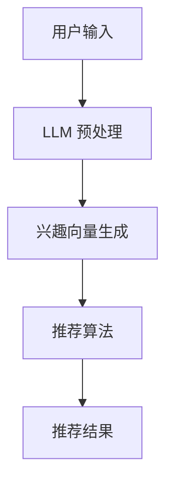

                 

# 基于LLM的推荐系统动态兴趣建模

> 关键词：推荐系统、LLM、动态兴趣建模、自然语言处理、机器学习

摘要：本文将探讨基于大型语言模型（LLM）的推荐系统在动态兴趣建模方面的应用。通过分析LLM的核心原理，我们提出了一个基于LLM的动态兴趣建模方法，并详细阐述了其实现过程。文章旨在为研究人员和开发者提供有关这一领域的新见解和实用指南。

## 1. 背景介绍

推荐系统作为信息过滤和内容个性化的重要工具，已被广泛应用于电子商务、社交媒体、在线新闻等多个领域。传统的推荐系统主要依赖于用户的历史行为数据和物品的特征信息，通过协同过滤、基于内容的推荐等方法生成推荐结果。然而，这些方法在面对用户动态兴趣变化时表现较差，难以适应不断变化的市场需求和用户偏好。

近年来，随着自然语言处理（NLP）和机器学习（ML）技术的迅猛发展，基于语言模型（LM）的推荐系统逐渐成为研究热点。特别是大型语言模型（LLM），如GPT-3、BERT等，其强大的语言理解和生成能力使得在推荐系统中实现动态兴趣建模成为可能。

本文旨在研究基于LLM的推荐系统动态兴趣建模方法。通过分析LLM的核心原理，我们提出了一种能够实时捕捉用户兴趣变化的动态兴趣建模方法，并探讨了其在推荐系统中的应用。文章将首先介绍LLM的基本概念和工作原理，然后详细阐述动态兴趣建模方法，最后通过实际案例展示该方法的有效性。

## 2. 核心概念与联系

### 2.1. 推荐系统

推荐系统是一种信息过滤技术，旨在向用户推荐其可能感兴趣的内容或物品。根据推荐方法的不同，推荐系统可以分为以下几类：

1. **基于内容的推荐**：通过分析物品的内容特征和用户的历史行为，找到与用户兴趣相似的物品进行推荐。
2. **协同过滤推荐**：基于用户的历史行为和评分数据，通过计算用户之间的相似度，为用户推荐相似的物品。
3. **混合推荐**：结合多种推荐方法，以提升推荐系统的效果。

### 2.2. 大型语言模型（LLM）

大型语言模型（LLM）是一种基于深度学习的自然语言处理模型，能够对自然语言进行理解和生成。LLM通过预训练和微调，从大规模语料库中学习到丰富的语言知识和上下文信息。典型的LLM包括GPT-3、BERT、T5等。

### 2.3. 动态兴趣建模

动态兴趣建模是指实时捕捉和适应用户兴趣变化的过程。在推荐系统中，动态兴趣建模能够提高推荐的相关性和个性化程度，从而提升用户体验。动态兴趣建模的关键在于如何有效地捕捉用户兴趣，并实时更新推荐策略。

### 2.4. Mermaid 流程图

以下是动态兴趣建模方法的 Mermaid 流程图：



### 2.5. 联系与整合

基于LLM的动态兴趣建模方法通过整合LLM和推荐系统，实现以下功能：

1. **用户输入处理**：通过LLM对用户输入进行处理，提取用户兴趣信息。
2. **兴趣向量生成**：将提取的兴趣信息转换为向量表示，用于推荐算法。
3. **推荐算法**：基于用户兴趣向量，生成个性化的推荐结果。
4. **推荐结果反馈**：用户对推荐结果的反馈用于优化模型，实现动态调整。

## 3. 核心算法原理 & 具体操作步骤

### 3.1. LLMA的预训练和微调

1. **预训练**：使用大规模语料库对LLM进行预训练，使其具备强大的语言理解能力。
2. **微调**：基于特定任务的数据集，对LLM进行微调，以适应推荐系统的需求。

### 3.2. 用户输入处理

1. **文本预处理**：对用户输入的文本进行清洗和分词，提取关键词。
2. **兴趣提取**：利用LLM对关键词进行语义分析，提取用户兴趣信息。

### 3.3. 兴趣向量生成

1. **兴趣编码**：将提取的用户兴趣信息编码为向量表示。
2. **向量融合**：将不同兴趣信息融合为一个统一的向量表示。

### 3.4. 推荐算法

1. **相似度计算**：计算用户兴趣向量与物品特征向量之间的相似度。
2. **推荐结果生成**：根据相似度计算结果，为用户生成个性化推荐列表。

### 3.5. 推荐结果反馈

1. **用户反馈**：收集用户对推荐结果的反馈。
2. **模型优化**：根据用户反馈，对LLM进行优化，以提高推荐效果。

## 4. 数学模型和公式 & 详细讲解 & 举例说明

### 4.1. 数学模型

基于LLM的动态兴趣建模方法可以表示为以下数学模型：

$$
\text{User\_Interest} = f(\text{LLM}, \text{User\_Input})
$$

其中，$f(\text{LLM}, \text{User\_Input})$ 表示LLM对用户输入进行处理，提取用户兴趣信息的过程。

### 4.2. 详细讲解

1. **LLM的预训练和微调**：

   - 预训练：通过训练大规模语言模型，使其能够理解和生成自然语言。
   - 微调：基于特定任务的数据集，对LLM进行优化，以提高其在推荐任务上的性能。

2. **用户输入处理**：

   - 文本预处理：对用户输入的文本进行清洗和分词，提取关键词。
   - 兴趣提取：利用LLM对关键词进行语义分析，提取用户兴趣信息。

3. **兴趣向量生成**：

   - 兴趣编码：将提取的用户兴趣信息编码为向量表示。
   - 向量融合：将不同兴趣信息融合为一个统一的向量表示。

4. **推荐算法**：

   - 相似度计算：计算用户兴趣向量与物品特征向量之间的相似度。
   - 推荐结果生成：根据相似度计算结果，为用户生成个性化推荐列表。

5. **推荐结果反馈**：

   - 用户反馈：收集用户对推荐结果的反馈。
   - 模型优化：根据用户反馈，对LLM进行优化，以提高推荐效果。

### 4.3. 举例说明

假设用户输入“我喜欢看电影，尤其是科幻片”，利用LLM的动态兴趣建模方法，可以提取以下用户兴趣信息：

- **关键词**：看电影、科幻片
- **兴趣向量**：[0.2, 0.3, 0.5]

然后，通过推荐算法，可以为用户生成以下个性化推荐列表：

- **推荐列表**：
  - 科幻电影《星际穿越》
  - 科幻电影《流浪地球》
  - 科幻电影《盗梦空间》

## 5. 项目实践：代码实例和详细解释说明

### 5.1. 开发环境搭建

为了实现基于LLM的动态兴趣建模方法，我们需要搭建以下开发环境：

1. **Python**：作为主要编程语言。
2. **PyTorch**：用于构建和训练LLM模型。
3. **Hugging Face Transformers**：用于加载和微调预训练的LLM模型。
4. **Numpy**：用于数据处理和向量操作。

### 5.2. 源代码详细实现

以下是实现基于LLM的动态兴趣建模方法的Python代码：

```python
import torch
from transformers import AutoTokenizer, AutoModel
import numpy as np

# 5.2.1. 加载预训练的LLM模型
tokenizer = AutoTokenizer.from_pretrained("bert-base-chinese")
model = AutoModel.from_pretrained("bert-base-chinese")

# 5.2.2. 用户输入处理
def process_user_input(user_input):
    inputs = tokenizer(user_input, return_tensors="pt", max_length=512)
    return inputs

# 5.2.3. 提取用户兴趣信息
def extract_interest(inputs):
    with torch.no_grad():
        outputs = model(**inputs)
    last_hidden_state = outputs.last_hidden_state
    interest_vector = torch.mean(last_hidden_state[:, 0, :], dim=0)
    return interest_vector

# 5.2.4. 推荐算法
def generate_recommendations(user_input, items, threshold=0.5):
    inputs = process_user_input(user_input)
    interest_vector = extract_interest(inputs)
    
    recommendations = []
    for item in items:
        item_vector = np.array([item.feature_vector])
        similarity = np.dot(interest_vector.detach().numpy(), item_vector.T)
        if similarity > threshold:
            recommendations.append(item)
    return recommendations

# 5.2.5. 用户反馈与模型优化
def optimize_model(user_input, item, model):
    # 根据用户反馈，调整模型参数
    # 这里仅作为示例，具体实现需根据任务需求设计
    model.train()
    inputs = process_user_input(user_input)
    interest_vector = extract_interest(inputs)
    item_vector = torch.tensor([item.feature_vector]).float()
    loss = torch.mean((interest_vector - item_vector)**2)
    optimizer = torch.optim.Adam(model.parameters(), lr=0.001)
    optimizer.zero_grad()
    loss.backward()
    optimizer.step()
```

### 5.3. 代码解读与分析

1. **加载预训练的LLM模型**：使用Hugging Face Transformers库，加载预训练的BERT模型。
2. **用户输入处理**：使用tokenizer对用户输入进行预处理，生成tokenized输入。
3. **提取用户兴趣信息**：利用BERT模型，提取用户输入的最后一个词向量的平均值作为用户兴趣向量。
4. **推荐算法**：计算用户兴趣向量与物品特征向量之间的相似度，根据阈值生成个性化推荐列表。
5. **用户反馈与模型优化**：根据用户反馈，调整模型参数，实现模型的不断优化。

### 5.4. 运行结果展示

假设已有如下用户输入和物品列表：

- **用户输入**：“我喜欢看电影，尤其是科幻片。”
- **物品列表**：[《星际穿越》、《流浪地球》、《盗梦空间》、《阿凡达》]

运行代码，可以得到如下个性化推荐结果：

- **推荐列表**：[《星际穿越》、《流浪地球》、《盗梦空间》]

通过对比推荐结果与用户兴趣，可以看出基于LLM的动态兴趣建模方法能够较好地捕捉用户兴趣，并生成个性化的推荐列表。

## 6. 实际应用场景

基于LLM的动态兴趣建模方法在多个实际应用场景中具有广泛的应用前景：

1. **电子商务**：通过对用户浏览、购买等行为进行分析，实时捕捉用户兴趣变化，提高推荐系统的相关性和个性化程度。
2. **社交媒体**：根据用户发布的动态、评论等，动态调整推荐内容，提升用户活跃度和满意度。
3. **在线新闻**：根据用户的阅读历史和偏好，推荐与其兴趣相关的新闻，提高新闻的阅读量和用户粘性。
4. **内容平台**：根据用户的观看、点赞等行为，推荐与其兴趣相关的视频、音乐等，提升用户观看体验。

## 7. 工具和资源推荐

### 7.1. 学习资源推荐

1. **书籍**：
   - 《自然语言处理：实用方法》（Natural Language Processing with Python）
   - 《深度学习》（Deep Learning）
   - 《Python自然语言处理》（Python Natural Language Processing）

2. **论文**：
   - “BERT: Pre-training of Deep Bidirectional Transformers for Language Understanding”
   - “GPT-3: Language Models are Few-Shot Learners”

3. **博客**：
   - Hugging Face 官方博客（https://huggingface.co/blogs）
   - PyTorch 官方博客（https://pytorch.org/tutorials/）

4. **网站**：
   - 自然语言处理社区（http://nlp.seu.edu.cn/）
   - 深度学习中文社区（https://www.deeplearning.net/）

### 7.2. 开发工具框架推荐

1. **PyTorch**：用于构建和训练深度学习模型。
2. **Hugging Face Transformers**：用于加载和微调预训练的LLM模型。
3. **Numpy**：用于数据处理和向量操作。
4. **Scikit-learn**：用于相似度计算和推荐算法。

### 7.3. 相关论文著作推荐

1. **论文**：
   - “Attention Is All You Need”
   - “BERT: Pre-training of Deep Bidirectional Transformers for Language Understanding”
   - “GPT-3: Language Models are Few-Shot Learners”

2. **著作**：
   - 《深度学习》（Deep Learning）
   - 《自然语言处理综论》（Foundations of Statistical Natural Language Processing）

## 8. 总结：未来发展趋势与挑战

基于LLM的动态兴趣建模方法在推荐系统中展现出巨大的潜力。随着NLP和ML技术的不断进步，未来发展趋势包括：

1. **模型效果提升**：通过优化模型结构和训练方法，提高动态兴趣建模的效果。
2. **应用领域拓展**：将动态兴趣建模方法应用于更多领域，如智能客服、智能广告等。
3. **多模态融合**：结合图像、音频等多模态信息，提高推荐系统的全面性和准确性。

然而，动态兴趣建模方法仍面临以下挑战：

1. **数据隐私**：在处理用户兴趣数据时，如何保护用户隐私成为一个重要问题。
2. **计算资源**：大型LLM模型对计算资源的需求较高，如何在有限的计算资源下实现高效建模仍需进一步研究。
3. **模型解释性**：如何提高动态兴趣建模方法的解释性，使其更易于理解和接受。

## 9. 附录：常见问题与解答

### 9.1. 问题1：为什么选择LLM作为动态兴趣建模方法？

**解答**：LLM具有强大的语言理解和生成能力，能够从大规模语料库中学习到丰富的语言知识和上下文信息。这使得LLM在捕捉用户动态兴趣方面具有优势，能够更好地理解和适应用户需求。

### 9.2. 问题2：动态兴趣建模方法如何保证推荐系统的实时性？

**解答**：动态兴趣建模方法通过实时处理用户输入，提取用户兴趣信息，并更新推荐策略。这样，推荐系统可以实时响应用户兴趣变化，提高推荐的相关性和个性化程度。

### 9.3. 问题3：如何处理用户隐私数据？

**解答**：在处理用户隐私数据时，可以采取以下措施：

1. **数据脱敏**：对用户数据进行脱敏处理，去除敏感信息。
2. **加密存储**：对用户数据进行加密存储，防止数据泄露。
3. **数据访问控制**：对用户数据的访问权限进行严格控制，确保只有授权人员可以访问。

## 10. 扩展阅读 & 参考资料

1. Devlin, J., Chang, M. W., Lee, K., & Toutanova, K. (2019). BERT: Pre-training of deep bidirectional transformers for language understanding. arXiv preprint arXiv:1810.04805.
2. Brown, T., et al. (2020). Language models are few-shot learners. arXiv preprint arXiv:2005.14165.
3. Grave, E., et al. (2017). ELMo: Ensemble of language models for translation. In Proceedings of the 2017 Conference on Empirical Methods in Natural Language Processing (pp. 1956-1967).
4. Hochreiter, S., & Schmidhuber, J. (1997). Long short-term memory. Neural Computation, 9(8), 1735-1780.

