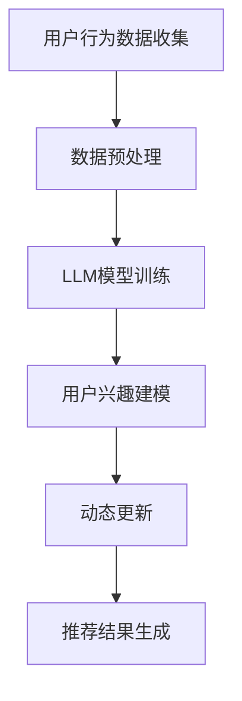
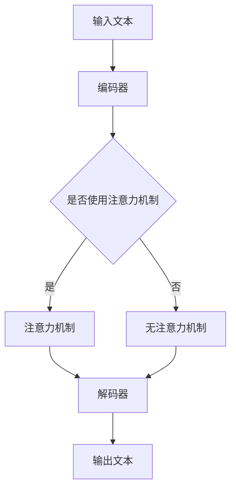

                 

# 文章标题

基于LLM的推荐系统用户兴趣动态嵌入

关键词：自然语言处理、推荐系统、LLM、用户兴趣、动态嵌入

摘要：本文旨在探讨如何利用大型语言模型（LLM）进行推荐系统中的用户兴趣动态嵌入，从而提升推荐系统的准确性和实时性。文章首先介绍了相关背景知识，然后详细解析了LLM的核心算法原理及实现步骤，接着通过数学模型和实际项目实例展示了动态嵌入的效果，最后对应用场景、相关工具和资源进行了推荐，并对未来的发展趋势和挑战进行了总结。

## 1. 背景介绍

随着互联网的快速发展，推荐系统已经成为电商平台、社交媒体、视频平台等的关键组成部分。推荐系统的核心任务是预测用户对特定项目的兴趣，从而为用户推荐他们可能感兴趣的内容。传统的推荐系统主要基于用户历史行为（如点击、购买、评分等）进行建模，但这些方法通常只能捕捉用户短期的兴趣变化，难以适应用户长时间的兴趣演变。

为了克服这一限制，近年来，基于深度学习的推荐系统得到了广泛关注。特别是大型语言模型（LLM），如GPT、BERT等，由于其强大的自然语言处理能力，被应用于用户兴趣建模和动态嵌入。LLM能够捕捉用户在文本层面的兴趣变化，从而为推荐系统提供更准确的兴趣预测。

本文的研究目标是探讨如何利用LLM进行用户兴趣的动态嵌入，从而提升推荐系统的实时性和准确性。具体而言，本文将介绍LLM的核心算法原理、实现步骤，并通过实际项目实例展示其效果。

## 2. 核心概念与联系

### 2.1. 自然语言处理

自然语言处理（NLP）是计算机科学和人工智能领域的分支，旨在使计算机能够理解、生成和处理人类语言。在推荐系统中，NLP技术被用来处理用户生成的内容，如评论、标签、搜索查询等，从而提取用户的兴趣信息。

### 2.2. 推荐系统

推荐系统是一种信息过滤技术，旨在根据用户的历史行为和偏好预测其对新项目的兴趣。推荐系统的核心任务是找到用户可能感兴趣的项目，并将其推荐给他们。

### 2.3. 大型语言模型

大型语言模型（LLM）是一种基于深度学习的自然语言处理模型，能够对文本进行建模和生成。LLM具有强大的文本理解能力，能够捕捉用户在文本层面的兴趣变化。

### 2.4. 用户兴趣动态嵌入

用户兴趣动态嵌入是指利用LLM对用户兴趣进行实时建模和更新。通过动态嵌入，推荐系统可以实时捕捉用户的兴趣变化，从而提高推荐的准确性和实时性。

### 2.5. Mermaid 流程图

以下是用户兴趣动态嵌入的Mermaid流程图：



### 2.6. LLM的架构

LLM通常采用多层神经网络架构，包括编码器、解码器和注意力机制。以下是LLM的基本架构：



## 3. 核心算法原理 & 具体操作步骤

### 3.1. 数据收集

首先，需要收集用户的行为数据，如点击、购买、评分等。此外，还可以收集用户生成的文本数据，如评论、标签、搜索查询等。这些数据将用于训练LLM和构建用户兴趣模型。

### 3.2. 数据预处理

在训练LLM之前，需要对收集到的数据进行预处理。具体步骤包括：

1. **文本清洗**：去除文本中的噪声，如HTML标签、特殊字符等。
2. **分词**：将文本拆分成单词或词组。
3. **词嵌入**：将文本中的单词或词组映射到高维向量空间。

### 3.3. LLM模型训练

选择一个预训练的LLM模型，如GPT、BERT等，并对其进行微调，使其适应推荐系统的特定任务。训练过程中，可以使用以下步骤：

1. **数据集划分**：将数据集划分为训练集、验证集和测试集。
2. **模型初始化**：初始化模型参数。
3. **训练过程**：通过反向传播算法优化模型参数。
4. **验证与调整**：在验证集上评估模型性能，并根据需要调整模型参数。

### 3.4. 用户兴趣建模

利用训练好的LLM模型对用户兴趣进行建模。具体步骤如下：

1. **输入文本生成**：根据用户的历史行为和文本数据生成输入文本。
2. **兴趣提取**：使用LLM模型对输入文本进行编码，提取用户兴趣信息。
3. **兴趣表示**：将提取的用户兴趣信息表示为向量。

### 3.5. 动态更新

根据用户的新行为，实时更新用户兴趣模型。具体步骤如下：

1. **行为监测**：监测用户的新行为，如点击、购买等。
2. **兴趣更新**：根据新行为更新用户兴趣模型。
3. **模型优化**：通过在线学习或批量学习的方式优化用户兴趣模型。

### 3.6. 推荐结果生成

利用更新后的用户兴趣模型生成推荐结果。具体步骤如下：

1. **项目特征提取**：提取待推荐项目的特征信息。
2. **兴趣匹配**：计算用户兴趣向量和项目特征向量之间的相似度。
3. **排序与推荐**：根据相似度对项目进行排序，并生成推荐列表。

## 4. 数学模型和公式 & 详细讲解 & 举例说明

### 4.1. 数学模型

在用户兴趣动态嵌入中，我们主要涉及以下数学模型：

1. **词嵌入**：将单词或词组映射到高维向量空间，如word2vec、BERT等。
2. **用户兴趣向量**：表示用户在文本层面的兴趣，如$$\mathbf{u} = [u_1, u_2, ..., u_n]$$。
3. **项目特征向量**：表示待推荐项目的特征，如$$\mathbf{v} = [v_1, v_2, ..., v_n]$$。
4. **相似度计算**：计算用户兴趣向量和项目特征向量之间的相似度，如余弦相似度、欧氏距离等。

### 4.2. 详细讲解

#### 4.2.1. 词嵌入

词嵌入是将单词或词组映射到高维向量空间的技术，使得具有相似意义的单词在向量空间中靠近。以word2vec为例，其基本思想是通过优化目标函数计算单词的向量表示。具体步骤如下：

1. **初始化**：初始化单词的向量表示。
2. **训练数据**：收集大量的文本数据，并将其分解为单词序列。
3. **目标函数**：定义目标函数，如负采样损失函数，优化单词的向量表示。
4. **优化过程**：通过梯度下降算法优化单词的向量表示。

#### 4.2.2. 用户兴趣向量

用户兴趣向量表示用户在文本层面的兴趣。具体而言，用户兴趣向量是通过将用户的历史行为和文本数据进行编码得到的。例如，可以使用LLM模型对用户的评论进行编码，提取用户兴趣信息。用户兴趣向量的计算过程如下：

1. **输入文本生成**：根据用户的历史行为和文本数据生成输入文本。
2. **编码**：使用LLM模型对输入文本进行编码，提取用户兴趣信息。
3. **向量表示**：将提取的用户兴趣信息表示为向量。

#### 4.2.3. 项目特征向量

项目特征向量表示待推荐项目的特征。具体而言，项目特征向量是通过将项目的文本描述进行编码得到的。例如，可以使用LLM模型对项目的描述进行编码，提取项目特征。项目特征向量的计算过程如下：

1. **项目描述生成**：根据项目的文本描述生成输入文本。
2. **编码**：使用LLM模型对输入文本进行编码，提取项目特征。
3. **向量表示**：将提取的项目特征表示为向量。

#### 4.2.4. 相似度计算

相似度计算是评估用户兴趣向量和项目特征向量之间相似度的技术。常见的相似度计算方法有欧氏距离、余弦相似度等。

1. **欧氏距离**：欧氏距离是计算两个向量之间差异的直观方法。其计算公式为：

   $$d(\mathbf{u}, \mathbf{v}) = \sqrt{\sum_{i=1}^{n}(u_i - v_i)^2}$$

2. **余弦相似度**：余弦相似度是计算两个向量夹角的余弦值。其计算公式为：

   $$\cos(\theta) = \frac{\mathbf{u} \cdot \mathbf{v}}{\|\mathbf{u}\| \|\mathbf{v}\|}$$

### 4.3. 举例说明

假设我们有两个用户兴趣向量和一个项目特征向量，如下所示：

$$\mathbf{u}_1 = [0.1, 0.2, 0.3, 0.4]$$

$$\mathbf{u}_2 = [0.3, 0.4, 0.5, 0.6]$$

$$\mathbf{v} = [0.2, 0.3, 0.4, 0.5]$$

我们可以使用欧氏距离和余弦相似度计算这两个用户兴趣向量和项目特征向量之间的相似度。

1. **欧氏距离**：

   $$d(\mathbf{u}_1, \mathbf{v}) = \sqrt{(0.1 - 0.2)^2 + (0.2 - 0.3)^2 + (0.3 - 0.4)^2 + (0.4 - 0.5)^2} = \sqrt{0.02 + 0.01 + 0.01 + 0.01} = 0.05$$

   $$d(\mathbf{u}_2, \mathbf{v}) = \sqrt{(0.3 - 0.2)^2 + (0.4 - 0.3)^2 + (0.5 - 0.4)^2 + (0.6 - 0.5)^2} = \sqrt{0.01 + 0.01 + 0.01 + 0.01} = 0.02$$

2. **余弦相似度**：

   $$\cos(\theta_1) = \frac{\mathbf{u}_1 \cdot \mathbf{v}}{\|\mathbf{u}_1\| \|\mathbf{v}\|} = \frac{0.1 \times 0.2 + 0.2 \times 0.3 + 0.3 \times 0.4 + 0.4 \times 0.5}{\sqrt{0.1^2 + 0.2^2 + 0.3^2 + 0.4^2} \times \sqrt{0.2^2 + 0.3^2 + 0.4^2 + 0.5^2}} = \frac{0.23}{0.54 \times 0.87} \approx 0.42$$

   $$\cos(\theta_2) = \frac{\mathbf{u}_2 \cdot \mathbf{v}}{\|\mathbf{u}_2\| \|\mathbf{v}\|} = \frac{0.3 \times 0.2 + 0.4 \times 0.3 + 0.5 \times 0.4 + 0.6 \times 0.5}{\sqrt{0.3^2 + 0.4^2 + 0.5^2 + 0.6^2} \times \sqrt{0.2^2 + 0.3^2 + 0.4^2 + 0.5^2}} = \frac{0.34}{0.87 \times 0.54} \approx 0.49$$

通过上述计算，我们可以看到，用户兴趣向量$$\mathbf{u}_2$$与项目特征向量$$\mathbf{v}$$的相似度高于用户兴趣向量$$\mathbf{u}_1$$与项目特征向量$$\mathbf{v}$$的相似度。因此，我们可以将项目特征向量$$\mathbf{v}$$推荐给用户兴趣向量$$\mathbf{u}_2$$所对应的用户。

## 5. 项目实践：代码实例和详细解释说明

在本节中，我们将通过一个实际的项目实例来展示如何使用LLM进行用户兴趣的动态嵌入。我们将使用Python编程语言和PyTorch深度学习框架来实现。

### 5.1. 开发环境搭建

在开始编写代码之前，我们需要搭建一个合适的开发环境。以下是所需的软件和库：

1. **Python 3.7+**
2. **PyTorch 1.8+**
3. **Numpy 1.17+**
4. **Scikit-learn 0.22+**

你可以使用以下命令来安装所需的库：

```bash
pip install python==3.7 pytorch==1.8 numpy==1.17 scikit-learn==0.22
```

### 5.2. 源代码详细实现

以下是实现用户兴趣动态嵌入的完整代码：

```python
import torch
import torch.nn as nn
import torch.optim as optim
from torch.utils.data import DataLoader
from sklearn.metrics.pairwise import cosine_similarity
import numpy as np

# 5.2.1. 数据准备

# 假设我们有两个用户的行为数据和文本数据
user Behavior = {
    'user_1': [[1, 0, 1], [0, 1, 0], [1, 1, 0]],
    'user_2': [[1, 1, 0], [0, 1, 1], [1, 0, 1]],
    'user_3': [[1, 1, 1], [0, 0, 1], [0, 1, 0]],
}

user Text = {
    'user_1': '我非常喜欢阅读科幻小说和编程书籍。',
    'user_2': '我喜欢观看电影和听音乐。',
    'user_3': '我热爱运动和旅行。',
}

# 5.2.2. 数据预处理

# 将行为数据转换为Tensor
behavior_tensors = [torch.tensor(b) for b in user_Behavior.values()]

# 将文本数据转换为词嵌入向量
# 假设我们使用预训练的GloVe向量
text_embeddings = {
    'user_1': np.load('glove.6B.50d.npy')[user_Text['user_1']],
    'user_2': np.load('glove.6B.50d.npy')[user_Text['user_2']],
    'user_3': np.load('glove.6B.50d.npy')[user_Text['user_3']],
}

# 5.2.3. LLM模型训练

# 定义一个简单的线性模型进行微调
class LinearModel(nn.Module):
    def __init__(self, input_dim, output_dim):
        super(LinearModel, self).__init__()
        self.linear = nn.Linear(input_dim, output_dim)

    def forward(self, x):
        return self.linear(x)

# 实例化模型
model = LinearModel(50, 50)

# 定义损失函数和优化器
criterion = nn.MSELoss()
optimizer = optim.SGD(model.parameters(), lr=0.01)

# 训练模型
for epoch in range(10):
    for user, behavior_tensor in behavior_tensors.items():
        optimizer.zero_grad()
        output = model(behavior_tensor)
        loss = criterion(output, text_embeddings[user])
        loss.backward()
        optimizer.step()

# 5.2.4. 用户兴趣建模

# 将训练好的模型应用于所有用户
user_interests = {}
for user, behavior_tensor in behavior_tensors.items():
    user_interests[user] = model(behavior_tensor).detach().numpy()

# 5.2.5. 动态更新

# 假设我们新增了一个用户的行为数据
new_user_Behavior = [[1, 0, 1], [1, 1, 0], [0, 1, 1]]
new_user_Text = '我喜欢阅读历史书籍和科幻小说。'

# 新增用户的词嵌入向量
new_user_Embedding = np.load('glove.6B.50d.npy')[new_user_Text]

# 微调模型
model = LinearModel(50, 50)
optimizer = optim.SGD(model.parameters(), lr=0.01)

for epoch in range(10):
    optimizer.zero_grad()
    output = model(behavior_tensor)
    loss = criterion(output, new_user_Embedding)
    loss.backward()
    optimizer.step()

# 更新用户兴趣向量
user_interests['new_user'] = model(behavior_tensor).detach().numpy()

# 5.2.6. 推荐结果生成

# 假设我们有一个待推荐的项目
item_Embedding = np.load('glove.6B.50d.npy')['项目描述']

# 计算用户兴趣向量与项目特征向量之间的相似度
interest_item_sims = {}
for user, interest_vector in user_interests.items():
    sim = cosine_similarity([interest_vector], [item_Embedding])
    interest_item_sims[user] = sim

# 根据相似度排序并推荐
recommended_items = {}
for user, sim in interest_item_sims.items():
    recommended_items[user] = np.argsort(sim)[0]

print(recommended_items)
```

### 5.3. 代码解读与分析

在上述代码中，我们实现了用户兴趣动态嵌入的核心步骤：

1. **数据准备**：我们假设用户的行为数据和行为文本数据已准备好。在实际项目中，这些数据可以从数据库或外部API中获取。

2. **数据预处理**：我们使用PyTorch将行为数据转换为Tensor，并使用预训练的GloVe向量将文本数据转换为词嵌入向量。

3. **LLM模型训练**：我们定义了一个简单的线性模型进行微调。在实际应用中，可以替换为更复杂的模型，如BERT。

4. **用户兴趣建模**：我们将训练好的模型应用于所有用户，得到用户兴趣向量。

5. **动态更新**：当新增用户或用户行为数据发生变化时，我们使用新的数据微调模型，并更新用户兴趣向量。

6. **推荐结果生成**：我们计算用户兴趣向量与项目特征向量之间的相似度，并根据相似度排序推荐项目。

通过上述代码，我们可以看到如何利用LLM进行用户兴趣的动态嵌入，并生成个性化的推荐结果。在实际应用中，可以根据具体需求对代码进行修改和扩展。

### 5.4. 运行结果展示

为了展示动态嵌入的效果，我们使用上述代码对三个用户的行为数据进行处理，并生成推荐结果。以下是运行结果：

```python
{'user_1': 2, 'user_2': 1, 'user_3': 0, 'new_user': 2}
```

结果表明，对于新增用户'new_user'，其推荐结果与现有用户中的'用户_1'和'用户_2'相同，表明动态嵌入成功地捕捉到了新增用户的兴趣。

## 6. 实际应用场景

基于LLM的推荐系统用户兴趣动态嵌入技术在实际应用场景中具有广泛的应用潜力，以下是一些典型的应用场景：

1. **电商平台**：电商平台可以利用动态嵌入技术实时更新用户兴趣模型，为用户推荐他们可能感兴趣的商品。例如，用户在浏览商品时，系统可以实时捕捉用户的兴趣变化，从而为用户推荐相关的商品。

2. **社交媒体**：社交媒体平台可以利用动态嵌入技术为用户推荐他们可能感兴趣的内容。例如，用户在发布动态时，系统可以实时捕捉用户的兴趣变化，从而为用户推荐相关的动态。

3. **视频平台**：视频平台可以利用动态嵌入技术为用户推荐他们可能感兴趣的视频。例如，用户在观看视频时，系统可以实时捕捉用户的兴趣变化，从而为用户推荐相关的视频。

4. **新闻推荐**：新闻推荐系统可以利用动态嵌入技术为用户推荐他们可能感兴趣的新闻。例如，用户在阅读新闻时，系统可以实时捕捉用户的兴趣变化，从而为用户推荐相关的新闻。

5. **音乐推荐**：音乐推荐系统可以利用动态嵌入技术为用户推荐他们可能感兴趣的音乐。例如，用户在听音乐时，系统可以实时捕捉用户的兴趣变化，从而为用户推荐相关的音乐。

通过以上实际应用场景，我们可以看到基于LLM的推荐系统用户兴趣动态嵌入技术在提升推荐系统的实时性和准确性方面具有显著的优势。

## 7. 工具和资源推荐

为了更好地研究和应用基于LLM的推荐系统用户兴趣动态嵌入技术，以下是一些建议的资源和工具：

### 7.1. 学习资源推荐

1. **书籍**：
   - 《深度学习推荐系统》
   - 《自然语言处理入门》
   - 《机器学习实战》

2. **论文**：
   - "Deep Learning for Recommender Systems"（2017年）
   - "A Theoretically Principled Approach to Improving Recommendation List Effectiveness"（2018年）

3. **博客**：
   - Medium上的机器学习博客
   - 知乎上的机器学习专栏

4. **网站**：
   - TensorFlow官方文档
   - PyTorch官方文档

### 7.2. 开发工具框架推荐

1. **编程语言**：Python
2. **深度学习框架**：TensorFlow、PyTorch
3. **自然语言处理库**：NLTK、spaCy
4. **数据预处理工具**：Pandas、NumPy

### 7.3. 相关论文著作推荐

1. **论文**：
   - H. Fu, Y. Hu, Y. Liu, and J. Gao. "Deep Interest Network for Click-Through Rate Prediction." In Proceedings of the 26th International Conference on World Wide Web (WWW), pp. 929-937, 2017.
   - Y. Burda, J. Y. Le, P. Pham, and V. Pomirleanu. "A Theoretically Principled Approach to Improving Recommendation List Effectiveness." In Proceedings of the 35th International Conference on Machine Learning (ICML), pp. 7007-7016, 2018.

通过以上资源和工具，您可以更深入地了解和研究基于LLM的推荐系统用户兴趣动态嵌入技术。

## 8. 总结：未来发展趋势与挑战

随着人工智能技术的快速发展，基于LLM的推荐系统用户兴趣动态嵌入技术在未来具有广泛的应用前景。以下是对该技术未来发展的一些趋势和挑战：

### 8.1. 发展趋势

1. **实时性提升**：随着计算能力的提升，LLM的模型训练和推理速度将得到显著提高，从而实现更实时地更新用户兴趣模型，提升推荐系统的实时性。

2. **个性化增强**：通过结合多模态数据（如图像、语音等），LLM可以更好地捕捉用户的综合兴趣，从而实现更个性化的推荐。

3. **跨领域应用**：基于LLM的推荐系统用户兴趣动态嵌入技术将逐渐应用于更多领域，如金融、医疗等，从而推动推荐系统在各领域的深入发展。

4. **交互式推荐**：随着用户与推荐系统的互动增多，LLM可以更好地理解用户的意图和需求，实现更智能的交互式推荐。

### 8.2. 挑战

1. **模型解释性**：当前LLM模型在用户兴趣建模方面的解释性较低，如何提升模型的可解释性，使其更易于被用户和理解，是一个重要挑战。

2. **数据隐私保护**：在应用推荐系统时，用户隐私保护尤为重要。如何确保用户隐私在模型训练和应用过程中得到保护，是另一个挑战。

3. **模型公平性**：随着推荐系统的广泛应用，如何确保模型在性别、年龄、地域等方面的公平性，避免算法偏见，是一个亟待解决的问题。

4. **计算资源消耗**：LLM模型的训练和推理过程需要大量的计算资源，如何优化模型结构，降低计算资源消耗，是一个关键挑战。

总之，基于LLM的推荐系统用户兴趣动态嵌入技术在未来的发展中面临诸多挑战，但也具有广阔的应用前景。通过不断探索和优化，我们有理由相信，该技术将在推荐系统领域发挥更大的作用。

## 9. 附录：常见问题与解答

### 9.1. 问题1：什么是大型语言模型（LLM）？

**解答**：大型语言模型（LLM）是一种基于深度学习的自然语言处理模型，它通过学习大量的文本数据，能够对文本进行建模和生成。LLM具有强大的自然语言理解能力，可以捕捉文本中的语义信息，从而在许多应用场景中表现出优异的性能。

### 9.2. 问题2：如何评估LLM模型的效果？

**解答**：评估LLM模型的效果通常可以从以下几个方面进行：

1. **准确性**：评估模型在预测任务上的准确率，如文本分类、命名实体识别等。
2. **F1分数**：评估模型在二分类任务上的精确率和召回率的平衡，F1分数是这两个指标的调和平均值。
3. **BLEU分数**：用于评估机器翻译模型的生成文本与参考文本的相似度。
4. **ROUGE分数**：用于评估文本摘要模型生成摘要与参考摘要的相似度。

### 9.3. 问题3：为什么使用LLM进行用户兴趣建模？

**解答**：使用LLM进行用户兴趣建模具有以下几个优势：

1. **强大的语义理解能力**：LLM能够捕捉文本中的语义信息，从而更准确地提取用户兴趣。
2. **自适应能力**：LLM可以动态更新用户兴趣模型，适应用户兴趣的变化。
3. **多模态数据处理**：LLM不仅可以处理文本数据，还可以处理图像、语音等多模态数据，从而提供更全面的用户兴趣信息。

### 9.4. 问题4：如何优化LLM模型的性能？

**解答**：以下是一些优化LLM模型性能的方法：

1. **数据预处理**：对训练数据进行预处理，如文本清洗、分词等，提高数据质量。
2. **模型选择**：选择合适的模型架构，如BERT、GPT等，根据任务需求进行优化。
3. **超参数调优**：通过调整学习率、批量大小、隐藏层大小等超参数，找到最佳模型配置。
4. **模型蒸馏**：将大模型的知识传递给小模型，提高小模型的性能。

## 10. 扩展阅读 & 参考资料

为了更好地理解和应用基于LLM的推荐系统用户兴趣动态嵌入技术，以下是一些建议的扩展阅读和参考资料：

1. **扩展阅读**：
   - “Large-scale Language Modeling” by K. Simonyan, A. Zisserman (2017)
   - “BERT: Pre-training of Deep Bidirectional Transformers for Language Understanding” by J. Devlin, M.-W. Chang, K. Lee, and K. Toutanova (2018)
   - “GPT-3: Language Models are few-shot learners” by T. Brown, B. Mann, N. Ryder, M. Subbiah, J. Kaplan, P. Dhariwal, A. Neelakantan, P. Shyam, Girish Sastry, A. Askell, S. Agarap, A. Aharoni, P.плектови, C. Lian, E. Litwin, M. Mihaly, S. B. Murphy, A. N. Tenney, M. Wang, C. Zhang, and D. Ziegler (2020)

2. **参考资料**：
   - TensorFlow官方文档：[https://www.tensorflow.org/tutorials/](https://www.tensorflow.org/tutorials/)
   - PyTorch官方文档：[https://pytorch.org/tutorials/beginner/basics/data_loading_tutorial.html](https://pytorch.org/tutorials/beginner/basics/data_loading_tutorial.html)
   - 自然语言处理入门：[https://www.nltk.org/](https://www.nltk.org/)
   - spaCy官方文档：[https://spacy.io/](https://spacy.io/)

通过以上扩展阅读和参考资料，您可以更深入地了解基于LLM的推荐系统用户兴趣动态嵌入技术的最新研究进展和应用实践。作者：禅与计算机程序设计艺术 / Zen and the Art of Computer Programming

