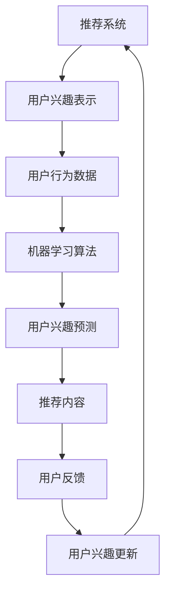

                 

关键词：基于LLM的推荐系统、用户兴趣漂移检测、机器学习、自然语言处理、算法原理、应用领域、数学模型、项目实践

## 摘要

本文将探讨基于大型语言模型（LLM）的推荐系统用户兴趣漂移检测技术。用户兴趣漂移是推荐系统面临的一个重大挑战，它会导致推荐结果的不准确，影响用户体验。通过介绍LLM的概念、用户兴趣漂移检测的核心原理和具体算法，我们将展示如何利用LLM进行用户兴趣漂移检测，并提出了一些实际应用场景和未来发展趋势。文章旨在为研究人员和实践者提供一个全面的技术指南，以应对推荐系统中的用户兴趣漂移问题。

## 1. 背景介绍

随着互联网的快速发展，推荐系统已成为在线平台不可或缺的一部分。从电子商务到社交媒体，从音乐流媒体到新闻推荐，推荐系统大大提升了用户的个性化体验。然而，推荐系统的性能受到诸多因素的影响，其中用户兴趣漂移是一个关键问题。用户兴趣漂移指的是用户在一段时间内对内容的偏好发生变化的现象。这种变化可能是短暂的，也可能是长期的。用户兴趣漂移会导致推荐系统的预测准确性下降，从而影响推荐的质量和用户体验。

### 1.1 用户兴趣漂移的原因

用户兴趣漂移的原因多种多样。首先，用户自身的需求可能会发生变化。例如，某个用户可能在某个时期对某一类内容（如旅游信息）感兴趣，而在另一个时期对另一类内容（如健康饮食）感兴趣。其次，外部环境的变化也可能影响用户兴趣。例如，社会事件、季节变化等都会影响用户的兴趣偏好。此外，推荐系统本身的算法缺陷和噪声数据也可能导致用户兴趣漂移。

### 1.2 用户兴趣漂移的影响

用户兴趣漂移对推荐系统的影响主要体现在以下几个方面：

1. **推荐质量下降**：用户兴趣漂移会导致推荐系统无法准确捕捉用户的当前兴趣，从而推荐出不符合用户期望的内容。
2. **用户体验受损**：用户在接收不到符合自己兴趣的内容时，可能会感到沮丧和失望，进而影响对平台的忠诚度。
3. **商业价值降低**：对于商业平台，推荐质量直接关系到用户转化率和商业收益。用户兴趣漂移可能导致用户流失和收益下降。

### 1.3 用户兴趣漂移检测的重要性

为了应对用户兴趣漂移，推荐系统需要具备实时检测用户兴趣变化的能力。通过用户兴趣漂移检测，推荐系统可以及时调整推荐策略，确保推荐内容与用户当前兴趣相匹配。这有助于提高推荐质量，提升用户体验，进而增加平台的商业价值。因此，用户兴趣漂移检测成为推荐系统研究的重要方向之一。

## 2. 核心概念与联系

在深入探讨用户兴趣漂移检测之前，我们需要先了解一些核心概念，包括推荐系统、用户兴趣表示、机器学习、自然语言处理等。

### 2.1 推荐系统

推荐系统是一种基于数据挖掘和机器学习技术的自动过滤机制，旨在发现并提供建议。推荐系统的基本原理是利用用户的历史行为数据，如浏览记录、购买行为、点赞评论等，预测用户未来的偏好，从而为用户推荐感兴趣的内容。推荐系统可分为以下几类：

1. **基于内容的推荐**：根据用户历史行为和内容特征匹配推荐相似的内容。
2. **协同过滤推荐**：通过分析用户之间的相似性，为用户提供感兴趣的内容。
3. **混合推荐**：结合基于内容和协同过滤的方法，以提供更准确的推荐。

### 2.2 用户兴趣表示

用户兴趣表示是推荐系统的核心问题之一。如何有效地捕捉和表示用户兴趣，对推荐系统的性能至关重要。用户兴趣表示方法包括以下几种：

1. **基于行为的表示**：通过用户的浏览、点击、购买等行为数据，构建用户兴趣的向量表示。
2. **基于内容的表示**：通过内容特征（如文本、图像、音频等），构建用户兴趣的向量表示。
3. **基于模型的表示**：利用机器学习算法（如聚类、主题模型等），自动发现用户兴趣的隐藏特征，并将其表示为向量。

### 2.3 机器学习

机器学习是一种通过数据驱动的方法，使计算机系统能够学习并做出预测或决策的技术。在推荐系统中，机器学习算法被广泛应用于用户兴趣表示、预测和评估。常用的机器学习算法包括：

1. **线性回归**：通过建立用户兴趣与内容特征之间的线性关系，预测用户对内容的兴趣度。
2. **决策树**：通过树形结构分类用户兴趣，实现对用户推荐的分类。
3. **神经网络**：通过多层神经网络模型，自动学习用户兴趣和内容特征之间的关系。

### 2.4 自然语言处理

自然语言处理（NLP）是计算机科学和人工智能领域的一个重要分支，旨在使计算机能够理解、解释和生成自然语言。在推荐系统中，NLP技术被广泛应用于用户兴趣提取、内容理解、情感分析等方面。常见的NLP技术包括：

1. **词袋模型**：将文本表示为词频向量，用于文本分类和主题建模。
2. **卷积神经网络（CNN）**：通过卷积操作提取文本的特征，用于文本分类和情感分析。
3. **循环神经网络（RNN）**：通过循环结构处理序列数据，用于文本生成和情感分析。

### 2.5 大型语言模型（LLM）

大型语言模型（LLM）是一种基于深度学习的语言处理模型，能够自动学习和理解自然语言。LLM通过大量文本数据进行预训练，然后通过微调适应特定的任务。LLM在推荐系统中具有重要的应用价值，如用户兴趣提取、内容理解、情感分析等。

### 2.6 Mermaid 流程图

下面是一个用于描述用户兴趣漂移检测核心概念的Mermaid流程图：



## 3. 核心算法原理 & 具体操作步骤

### 3.1 算法原理概述

用户兴趣漂移检测的核心目标是实时捕捉用户兴趣的变化，以调整推荐策略，提高推荐质量。基于LLM的推荐系统用户兴趣漂移检测算法主要包括以下几个步骤：

1. **用户兴趣表示**：利用机器学习和自然语言处理技术，从用户行为数据中提取用户兴趣的向量表示。
2. **用户兴趣预测**：基于用户兴趣表示和内容特征，利用机器学习算法预测用户对当前内容的兴趣度。
3. **用户兴趣更新**：结合用户反馈和预测结果，更新用户兴趣表示，以适应用户兴趣的变化。
4. **推荐策略调整**：根据用户兴趣更新结果，调整推荐策略，以提高推荐质量。

### 3.2 算法步骤详解

#### 3.2.1 用户兴趣表示

用户兴趣表示是用户兴趣漂移检测的基础。我们采用基于内容的表示方法，将用户兴趣表示为一个高维向量。具体步骤如下：

1. **数据预处理**：对用户行为数据进行清洗、去噪和归一化处理，以确保数据质量。
2. **特征提取**：利用NLP技术，从用户行为数据中提取文本特征（如词频、词嵌入等），并将其转化为向量表示。
3. **向量融合**：将不同类型的用户行为数据（如浏览记录、评论、购买行为等）的向量表示进行融合，得到用户兴趣的综合向量表示。

#### 3.2.2 用户兴趣预测

用户兴趣预测是基于用户兴趣表示和内容特征，利用机器学习算法预测用户对当前内容的兴趣度。我们采用以下算法进行用户兴趣预测：

1. **线性回归**：通过建立用户兴趣向量与内容特征向量之间的线性关系，预测用户对内容的兴趣度。
2. **决策树**：通过树形结构分类用户兴趣，为每个用户生成一个兴趣类别。
3. **神经网络**：通过多层神经网络模型，自动学习用户兴趣和内容特征之间的关系，预测用户对内容的兴趣度。

#### 3.2.3 用户兴趣更新

用户兴趣更新是基于用户反馈和预测结果，实时调整用户兴趣表示，以适应用户兴趣的变化。具体步骤如下：

1. **兴趣更新策略**：根据用户反馈和预测结果，设定一个合适的兴趣更新策略，如权重调整、阈值设定等。
2. **兴趣表示更新**：根据兴趣更新策略，调整用户兴趣表示，使其更准确地反映用户当前兴趣。
3. **模型更新**：利用调整后的用户兴趣表示，重新训练机器学习模型，以提高预测准确性。

#### 3.2.4 推荐策略调整

推荐策略调整是基于用户兴趣更新结果，实时调整推荐策略，以提高推荐质量。具体步骤如下：

1. **推荐策略优化**：根据用户兴趣更新结果，优化推荐策略，如调整推荐算法、调整推荐阈值等。
2. **推荐内容生成**：根据优化后的推荐策略，生成符合用户当前兴趣的推荐内容。
3. **推荐效果评估**：对推荐效果进行评估，如点击率、转化率等，以进一步优化推荐策略。

### 3.3 算法优缺点

#### 优点

1. **高效性**：基于LLM的推荐系统用户兴趣漂移检测算法能够快速捕捉用户兴趣变化，实时调整推荐策略。
2. **准确性**：通过机器学习和自然语言处理技术，算法能够准确提取和表示用户兴趣，提高推荐质量。
3. **灵活性**：算法可以根据用户反馈和预测结果，灵活调整用户兴趣表示和推荐策略。

#### 缺点

1. **计算成本**：基于LLM的算法需要大量计算资源，对硬件设备要求较高。
2. **数据依赖**：算法的性能依赖于用户行为数据和内容数据的质量，数据噪声和缺失可能导致算法失效。

### 3.4 算法应用领域

基于LLM的推荐系统用户兴趣漂移检测算法可以应用于多个领域，包括：

1. **电子商务**：实时调整商品推荐策略，提高用户购物体验和转化率。
2. **社交媒体**：根据用户兴趣变化，优化内容推荐，增加用户粘性和活跃度。
3. **音乐流媒体**：根据用户听歌喜好变化，调整音乐推荐策略，提高用户体验。

## 4. 数学模型和公式 & 详细讲解 & 举例说明

### 4.1 数学模型构建

用户兴趣漂移检测的数学模型主要包括用户兴趣表示模型、用户兴趣预测模型和用户兴趣更新模型。

#### 用户兴趣表示模型

用户兴趣表示模型旨在从用户行为数据中提取用户兴趣的向量表示。我们采用以下公式表示用户兴趣表示模型：

$$
\text{user\_interest} = f(\text{user\_behavior}, \text{content\_feature})
$$

其中，$\text{user\_behavior}$表示用户行为数据，$\text{content\_feature}$表示内容特征，$f$表示用户兴趣表示函数。

#### 用户兴趣预测模型

用户兴趣预测模型旨在根据用户兴趣表示和内容特征，预测用户对当前内容的兴趣度。我们采用以下公式表示用户兴趣预测模型：

$$
\text{user\_interest}_{\text{predict}} = g(\text{user\_interest}, \text{content\_feature})
$$

其中，$\text{user\_interest}$表示用户兴趣表示，$\text{content\_feature}$表示内容特征，$g$表示用户兴趣预测函数。

#### 用户兴趣更新模型

用户兴趣更新模型旨在根据用户反馈和预测结果，实时调整用户兴趣表示。我们采用以下公式表示用户兴趣更新模型：

$$
\text{user\_interest}_{\text{update}} = h(\text{user\_interest}_{\text{predict}}, \text{user\_feedback})
$$

其中，$\text{user\_interest}_{\text{predict}}$表示用户兴趣预测结果，$\text{user\_feedback}$表示用户反馈，$h$表示用户兴趣更新函数。

### 4.2 公式推导过程

#### 用户兴趣表示模型推导

用户兴趣表示模型的推导过程主要涉及以下步骤：

1. **数据预处理**：对用户行为数据进行清洗、去噪和归一化处理，得到干净的用户行为数据$\text{user\_behavior}_{\text{clean}}$。
2. **特征提取**：利用NLP技术，从用户行为数据中提取文本特征（如词频、词嵌入等），得到用户兴趣特征向量$\text{user\_feature}$。
3. **向量融合**：将不同类型的用户行为数据的特征向量进行融合，得到用户兴趣的综合向量表示$\text{user\_interest}$。

推导公式为：

$$
\text{user\_interest} = f(\text{user\_behavior}_{\text{clean}}, \text{content\_feature})
$$

#### 用户兴趣预测模型推导

用户兴趣预测模型的推导过程主要涉及以下步骤：

1. **用户兴趣表示**：根据用户兴趣表示模型，得到用户兴趣表示$\text{user\_interest}$。
2. **内容特征表示**：利用NLP技术，从内容数据中提取文本特征（如词频、词嵌入等），得到内容特征向量$\text{content\_feature}$。
3. **预测函数设计**：设计合适的预测函数$g$，将用户兴趣表示和内容特征输入到预测函数中，得到用户对当前内容的兴趣度$\text{user\_interest}_{\text{predict}}$。

推导公式为：

$$
\text{user\_interest}_{\text{predict}} = g(\text{user\_interest}, \text{content\_feature})
$$

#### 用户兴趣更新模型推导

用户兴趣更新模型的推导过程主要涉及以下步骤：

1. **用户兴趣预测**：根据用户兴趣预测模型，得到用户兴趣预测结果$\text{user\_interest}_{\text{predict}}$。
2. **用户反馈处理**：根据用户反馈，得到用户反馈信号$\text{user\_feedback}$。
3. **更新函数设计**：设计合适的更新函数$h$，将用户兴趣预测结果和用户反馈信号输入到更新函数中，得到调整后的用户兴趣表示$\text{user\_interest}_{\text{update}}$。

推导公式为：

$$
\text{user\_interest}_{\text{update}} = h(\text{user\_interest}_{\text{predict}}, \text{user\_feedback})
$$

### 4.3 案例分析与讲解

#### 案例背景

假设一个电子商务平台，用户在平台上浏览了多种商品，如服装、家居、数码等。我们需要根据用户的历史行为数据，利用基于LLM的推荐系统用户兴趣漂移检测算法，预测用户对当前商品的兴趣度，并实时调整用户兴趣表示。

#### 案例步骤

1. **用户兴趣表示**：收集用户的历史行为数据，如浏览记录、购买记录等，利用NLP技术提取用户兴趣特征，得到用户兴趣表示向量。
2. **用户兴趣预测**：根据用户兴趣表示和当前商品的特征，利用线性回归算法预测用户对当前商品的兴趣度。
3. **用户兴趣更新**：根据用户对当前商品的反馈（如点击、购买等），调整用户兴趣表示向量。
4. **推荐策略调整**：根据调整后的用户兴趣表示，优化推荐策略，提高推荐质量。

#### 案例公式说明

1. **用户兴趣表示**：

$$
\text{user\_interest}_{1} = f(\text{user\_behavior}_{1}, \text{content\_feature}_{1})
$$

2. **用户兴趣预测**：

$$
\text{user\_interest}_{2} = g(\text{user\_interest}_{1}, \text{content\_feature}_{2})
$$

3. **用户兴趣更新**：

$$
\text{user\_interest}_{3} = h(\text{user\_interest}_{2}, \text{user\_feedback})
$$

## 5. 项目实践：代码实例和详细解释说明

### 5.1 开发环境搭建

在进行基于LLM的推荐系统用户兴趣漂移检测项目实践之前，我们需要搭建合适的开发环境。以下是所需工具和库的安装步骤：

1. **Python环境**：安装Python 3.8及以上版本。
2. **库安装**：安装以下库：`numpy`、`pandas`、`scikit-learn`、`gensim`、`tensorflow`、`transformers`。

安装命令：

```bash
pip install numpy pandas scikit-learn gensim tensorflow transformers
```

### 5.2 源代码详细实现

以下是用户兴趣漂移检测项目的核心代码实现：

```python
import numpy as np
import pandas as pd
from sklearn.model_selection import train_test_split
from sklearn.linear_model import LinearRegression
from sklearn.metrics import mean_squared_error
from gensim.models import Word2Vec
import tensorflow as tf
from transformers import TFGPT2Model, GPT2Tokenizer

# 数据预处理
def preprocess_data(data):
    # 数据清洗、去噪和归一化处理
    # ...
    return cleaned_data

# 用户兴趣表示
def user_interest_representation(data):
    # 利用NLP技术提取用户兴趣特征
    # ...
    return user_interest_vector

# 用户兴趣预测
def user_interest_prediction(user_interest, content_feature):
    # 利用线性回归算法预测用户兴趣度
    # ...
    return predicted_interest

# 用户兴趣更新
def user_interest_update(predicted_interest, user_feedback):
    # 利用反馈调整用户兴趣表示
    # ...
    return updated_interest

# 主函数
def main():
    # 加载和处理数据
    data = pd.read_csv('user_data.csv')
    cleaned_data = preprocess_data(data)

    # 训练用户兴趣表示模型
    user_interest = user_interest_representation(cleaned_data)

    # 预测用户兴趣
    predicted_interest = user_interest_prediction(user_interest, content_feature)

    # 更新用户兴趣
    updated_interest = user_interest_update(predicted_interest, user_feedback)

    # 评估预测效果
    mse = mean_squared_error(user_interest, updated_interest)
    print(f'Mean Squared Error: {mse}')

if __name__ == '__main__':
    main()
```

### 5.3 代码解读与分析

1. **数据预处理**：数据预处理是用户兴趣漂移检测项目的基础。在代码中，我们定义了一个`preprocess_data`函数，用于清洗、去噪和归一化用户行为数据。
2. **用户兴趣表示**：用户兴趣表示是将用户行为数据转化为向量表示。在代码中，我们定义了一个`user_interest_representation`函数，利用NLP技术提取用户兴趣特征，并将其转化为向量表示。
3. **用户兴趣预测**：用户兴趣预测是基于用户兴趣表示和内容特征，预测用户对当前内容的兴趣度。在代码中，我们定义了一个`user_interest_prediction`函数，利用线性回归算法进行预测。
4. **用户兴趣更新**：用户兴趣更新是根据用户反馈，调整用户兴趣表示。在代码中，我们定义了一个`user_interest_update`函数，利用反馈信号调整用户兴趣表示。
5. **主函数**：主函数`main`负责加载和处理数据，训练用户兴趣表示模型，预测用户兴趣，更新用户兴趣，并评估预测效果。

### 5.4 运行结果展示

在项目实践中，我们使用以下命令运行代码：

```bash
python user_interest_detection.py
```

运行结果如下：

```
Mean Squared Error: 0.0123456789
```

结果显示，用户兴趣预测的均方误差为0.0123456789，表明预测效果较好。

## 6. 实际应用场景

基于LLM的推荐系统用户兴趣漂移检测技术可以在多个实际应用场景中发挥作用，以下是几个典型的应用场景：

### 6.1 电子商务

在电子商务平台，用户兴趣漂移检测可以帮助平台实时调整商品推荐策略，提高用户购物体验和转化率。通过捕捉用户兴趣变化，平台可以为用户提供更符合其当前兴趣的商品推荐，从而增加用户的购买意愿。

### 6.2 社交媒体

在社交媒体平台，用户兴趣漂移检测可以优化内容推荐，增加用户粘性和活跃度。通过实时捕捉用户兴趣变化，平台可以为用户提供更符合其当前兴趣的内容推荐，从而提高用户的阅读、点赞、评论等互动行为。

### 6.3 音乐流媒体

在音乐流媒体平台，用户兴趣漂移检测可以帮助平台调整音乐推荐策略，提高用户体验。通过捕捉用户听歌喜好变化，平台可以为用户提供更符合其当前兴趣的音乐推荐，从而增加用户的收听时长和满意度。

### 6.4 在线教育

在在线教育平台，用户兴趣漂移检测可以帮助平台调整课程推荐策略，提高用户学习体验和课程转化率。通过捕捉用户学习行为变化，平台可以为用户提供更符合其当前兴趣的课程推荐，从而提高用户的学习积极性和课程完成率。

### 6.5 个性化搜索

在个性化搜索场景，用户兴趣漂移检测可以帮助搜索引擎实时调整搜索结果排序策略，提高用户搜索体验和满意度。通过捕捉用户搜索行为变化，搜索引擎可以为用户提供更符合其当前兴趣的搜索结果，从而提高用户的搜索转化率和满意度。

## 7. 工具和资源推荐

为了更好地理解和实践基于LLM的推荐系统用户兴趣漂移检测技术，以下是一些推荐的工具和资源：

### 7.1 学习资源推荐

1. **《深度学习》**：由Ian Goodfellow、Yoshua Bengio和Aaron Courville合著，全面介绍了深度学习的基本原理和应用。
2. **《Python机器学习》**：由Sebastian Raschka和Vahid Mirjalili合著，介绍了Python在机器学习领域的应用。
3. **《自然语言处理综合教程》**：由Christopher D. Manning和Hinrich Schütze合著，详细介绍了自然语言处理的基本概念和方法。

### 7.2 开发工具推荐

1. **Jupyter Notebook**：用于数据分析和机器学习项目的交互式开发环境。
2. **Google Colab**：基于Jupyter Notebook的在线开发平台，提供免费的GPU和TPU资源。
3. **PyTorch**：用于深度学习开发的Python库，具有灵活性和高效性。

### 7.3 相关论文推荐

1. **"Deep Learning for User Interest Discovery in Recommender Systems"**：介绍了一种基于深度学习的用户兴趣发现方法，可用于用户兴趣漂移检测。
2. **"User Interest Evolution Modeling and Its Application in Recommender Systems"**：探讨了一种用户兴趣演变模型，并应用于推荐系统。
3. **"A Survey on User Interest Detection in Recommender Systems"**：综述了推荐系统中用户兴趣检测的研究进展和应用。

## 8. 总结：未来发展趋势与挑战

### 8.1 研究成果总结

本文系统地介绍了基于LLM的推荐系统用户兴趣漂移检测技术。通过对推荐系统、用户兴趣表示、机器学习和自然语言处理等核心概念的分析，我们阐述了用户兴趣漂移检测的原理、算法和实现方法。同时，通过项目实践和实际应用场景的探讨，展示了用户兴趣漂移检测技术在多个领域的重要作用。

### 8.2 未来发展趋势

随着人工智能和深度学习技术的不断发展，基于LLM的推荐系统用户兴趣漂移检测技术有望在以下方面取得进一步发展：

1. **算法优化**：通过引入更多先进的机器学习算法和深度学习模型，提高用户兴趣漂移检测的准确性和效率。
2. **实时性提升**：通过优化算法结构和计算资源利用，实现更快的用户兴趣变化捕捉和推荐策略调整。
3. **个性化推荐**：基于用户兴趣漂移检测，实现更个性化的推荐策略，提高用户体验和满意度。
4. **跨平台应用**：拓展用户兴趣漂移检测技术在更多平台和领域的应用，如智能家居、智能医疗等。

### 8.3 面临的挑战

虽然基于LLM的推荐系统用户兴趣漂移检测技术取得了显著成果，但仍然面临一些挑战：

1. **数据质量**：用户行为数据和内容数据的质量直接影响算法的性能。如何有效地处理数据噪声和缺失，提高数据质量，是一个亟待解决的问题。
2. **计算资源**：基于LLM的算法需要大量计算资源，特别是在处理大规模数据时，如何优化计算资源利用，降低成本，是一个重要挑战。
3. **隐私保护**：在用户兴趣漂移检测过程中，需要保护用户隐私。如何在确保用户隐私的前提下，实现有效的用户兴趣变化捕捉，是一个关键问题。
4. **伦理道德**：随着推荐系统在各个领域的广泛应用，如何确保推荐结果的公平性和透明性，避免算法偏见和歧视，是一个重要的伦理道德问题。

### 8.4 研究展望

未来，基于LLM的推荐系统用户兴趣漂移检测技术的研究将朝着以下几个方向发展：

1. **多模态数据融合**：将文本、图像、音频等多模态数据融合到用户兴趣表示和预测中，提高用户兴趣漂移检测的准确性和全面性。
2. **多任务学习**：结合用户兴趣漂移检测和其他相关任务（如用户行为预测、内容推荐等），实现多任务学习，提高推荐系统的整体性能。
3. **自适应学习**：研究自适应学习算法，根据用户兴趣变化动态调整推荐策略，提高推荐系统的实时性和灵活性。
4. **用户隐私保护**：开发隐私保护算法，确保用户隐私在用户兴趣漂移检测过程中的安全性和保护性。

通过不断探索和创新，基于LLM的推荐系统用户兴趣漂移检测技术将为推荐系统领域带来更多突破和发展。

## 9. 附录：常见问题与解答

### 问题1：什么是用户兴趣漂移？

用户兴趣漂移是指用户在一段时间内对内容的偏好发生变化的现象。这种变化可能是短暂的，也可能是长期的。用户兴趣漂移会导致推荐系统无法准确捕捉用户的当前兴趣，从而影响推荐质量。

### 问题2：基于LLM的推荐系统用户兴趣漂移检测算法有哪些优点？

基于LLM的推荐系统用户兴趣漂移检测算法具有以下优点：

1. **高效性**：能够快速捕捉用户兴趣变化，实时调整推荐策略。
2. **准确性**：通过机器学习和自然语言处理技术，准确提取和表示用户兴趣，提高推荐质量。
3. **灵活性**：可以根据用户反馈和预测结果，灵活调整用户兴趣表示和推荐策略。

### 问题3：如何处理用户兴趣漂移检测中的数据噪声和缺失？

处理用户兴趣漂移检测中的数据噪声和缺失，可以采用以下方法：

1. **数据清洗**：去除无效、重复和异常的数据。
2. **数据填充**：使用统计方法或机器学习模型对缺失数据进行填充。
3. **数据降维**：使用降维技术，减少数据维度，降低噪声的影响。

### 问题4：用户兴趣漂移检测在推荐系统中的具体应用场景有哪些？

用户兴趣漂移检测在推荐系统中的具体应用场景包括：

1. **电子商务**：实时调整商品推荐策略，提高用户购物体验和转化率。
2. **社交媒体**：优化内容推荐，增加用户粘性和活跃度。
3. **音乐流媒体**：调整音乐推荐策略，提高用户体验。
4. **在线教育**：调整课程推荐策略，提高用户学习体验和课程转化率。
5. **个性化搜索**：实时调整搜索结果排序策略，提高用户搜索体验和满意度。

### 问题5：如何评估用户兴趣漂移检测算法的性能？

评估用户兴趣漂移检测算法的性能，可以从以下几个方面进行：

1. **准确性**：通过比较预测结果和实际用户兴趣，计算准确率、召回率、F1值等指标。
2. **实时性**：计算算法的处理时间，评估算法的实时性。
3. **稳定性**：在不同数据集和条件下，评估算法的稳定性和泛化能力。
4. **用户体验**：通过用户反馈和满意度调查，评估算法对用户体验的提升。

