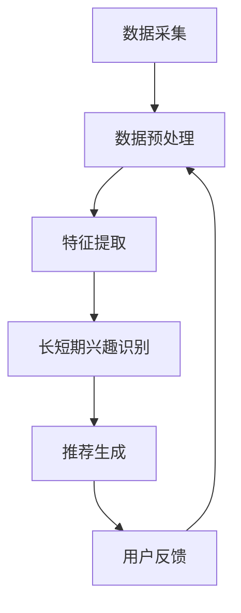

                 

### 背景介绍

#### 推荐系统在当今社会的重要性

推荐系统已经成为互联网世界中不可或缺的一部分。随着信息量的爆炸式增长和用户需求的多样化，人们越来越难以在海量信息中找到感兴趣的内容。推荐系统通过分析用户的历史行为、兴趣偏好和相似用户群体的行为，能够为用户个性化地推荐他们可能感兴趣的内容。这极大地提高了用户的满意度和参与度，也为互联网企业带来了可观的商业价值。

#### 长短期兴趣建模的重要性

在推荐系统中，用户的兴趣不仅包括长期稳定的兴趣，还包括短期波动性强的兴趣。例如，一个用户可能在一段时间内对某部电影特别感兴趣，而另一段时间则可能对某个音乐专辑产生热情。长短期兴趣建模的核心目标是捕捉并理解用户在不同时间尺度上的兴趣变化，从而提供更加精准和动态的推荐。

##### 长期兴趣建模

长期兴趣建模关注的是用户在较长一段时间内保持稳定的兴趣点。这些兴趣往往反映了用户的个性、价值观和生活方式。通过分析用户长期的行为模式，推荐系统可以构建出用户的长期兴趣画像，从而在推荐时能够持续地反映用户的长期偏好。

##### 短期兴趣建模

短期兴趣建模则着重于捕捉用户在较短时间内出现的新兴趣点或兴趣变化。这些兴趣可能是由一时的兴趣驱动的，也可能是由于某些特殊事件或活动引起的。对于推荐系统来说，及时捕捉到这些短期兴趣变化，可以显著提高推荐的即时性和相关性。

#### LLM（大型语言模型）在兴趣建模中的作用

近年来，大型语言模型（LLM）如GPT、BERT等在自然语言处理领域取得了显著的突破。LLM能够理解和生成复杂的语言文本，这使得它们在用户兴趣建模中具有独特的优势。具体来说，LLM在用户兴趣建模中的作用体现在以下几个方面：

##### 数据处理能力

LLM具有强大的数据处理能力，能够从大量的用户历史数据中提取出有价值的信息。通过自然语言处理技术，LLM可以有效地分析用户的评论、搜索历史、浏览记录等，从而识别出用户的兴趣点。

##### 文本生成能力

LLM能够生成高质量的文本，这使得它可以在推荐系统中用于生成个性化的推荐内容。例如，LLM可以根据用户的兴趣为用户生成个性化的文章、评论或者产品描述。

##### 上下文理解能力

LLM具有强大的上下文理解能力，这使得它能够根据用户当前的兴趣状态提供动态的推荐。例如，当用户表现出对某个领域的短期兴趣时，LLM可以立即调整推荐策略，为用户推荐相关的热点内容。

#### 本文的目的

本文旨在探讨基于LLM的推荐系统用户兴趣长短期建模的方法。通过对LLM在数据处理、文本生成和上下文理解方面的优势进行深入分析，本文将提出一种结合长短期兴趣建模的LLM推荐系统架构。同时，本文还将详细介绍该架构的实现步骤和关键算法，并通过实际案例验证其有效性和实用性。通过本文的探讨，读者可以了解到如何利用LLM技术提高推荐系统的准确性和用户体验。

#### 本文结构

本文将按照以下结构进行展开：

1. **背景介绍**：阐述推荐系统的重要性以及长短期兴趣建模的必要性，并简要介绍LLM在兴趣建模中的作用。
2. **核心概念与联系**：详细解释长短期兴趣建模的概念，并使用Mermaid流程图展示推荐系统的整体架构。
3. **核心算法原理与具体操作步骤**：介绍LLM在长短期兴趣建模中的应用原理，并分步说明其具体实现方法。
4. **数学模型和公式**：阐述长短期兴趣建模的数学模型和公式，并进行详细讲解和举例说明。
5. **项目实践**：通过代码实例展示如何实现基于LLM的推荐系统，并提供详细的代码解读和分析。
6. **实际应用场景**：讨论基于LLM的推荐系统在现实世界的应用场景和效果。
7. **工具和资源推荐**：推荐相关的学习资源和开发工具框架。
8. **总结**：总结本文的主要观点，并讨论未来发展趋势与挑战。
9. **附录**：提供常见问题与解答。
10. **扩展阅读与参考资料**：推荐相关的扩展阅读和参考资料。

### 核心概念与联系

#### 长短期兴趣建模的概念

长短期兴趣建模是一种通过分析用户在不同时间尺度上的行为数据，以捕捉并理解用户兴趣点的方法。长短期兴趣建模可以分为以下两个方面：

##### 长期兴趣建模

长期兴趣建模旨在识别用户在较长时间范围内保持稳定的兴趣点。这些兴趣点通常反映了用户的个性、价值观和生活方式。通过分析用户的历史行为数据，如浏览记录、搜索历史和购买记录等，我们可以构建出用户的长期兴趣画像。长期兴趣建模的关键技术包括数据预处理、特征提取和兴趣点识别。

##### 短期兴趣建模

短期兴趣建模则关注用户在较短时间范围内出现的新兴趣点或兴趣变化。这些兴趣点可能是由一时的兴趣驱动的，也可能是由于某些特殊事件或活动引起的。短期兴趣建模的关键技术包括实时数据处理、兴趣点识别和推荐策略调整。

#### 推荐系统架构

为了实现长短期兴趣建模，我们设计了一种基于LLM的推荐系统架构。该架构主要包括以下几个模块：

##### 数据采集模块

数据采集模块负责收集用户的行为数据，如浏览记录、搜索历史和社交互动等。这些数据将通过不同的渠道（如网页、移动应用等）实时传输到系统。

##### 数据预处理模块

数据预处理模块负责对采集到的原始数据进行清洗、去噪和格式化，以便后续处理。预处理过程包括数据去重、缺失值填补和标准化等步骤。

##### 特征提取模块

特征提取模块通过自然语言处理（NLP）技术对预处理后的数据进行特征提取。特征提取的目标是提取出与用户兴趣相关的关键信息，如关键词、情感倾向和话题分布等。

##### 长短期兴趣识别模块

长短期兴趣识别模块基于LLM的上下文理解能力和文本生成能力，对提取出的特征进行深入分析，以识别用户的长期兴趣和短期兴趣点。具体来说，该模块包括以下步骤：

1. **长期兴趣识别**：通过分析用户的历史行为数据，使用机器学习算法（如聚类、关联规则挖掘等）构建出用户的长期兴趣画像。
2. **短期兴趣识别**：通过实时分析用户当前的行为数据，结合上下文信息，使用LLM识别出用户在短期内的新兴趣点。

##### 推荐生成模块

推荐生成模块根据识别出的长短期兴趣点，结合用户的当前状态和上下文信息，生成个性化的推荐列表。推荐生成过程包括以下步骤：

1. **推荐内容生成**：使用LLM生成与用户兴趣相关的个性化推荐内容，如文章、视频、产品描述等。
2. **推荐排序**：通过评估推荐内容的多样性、相关性、新颖性和用户体验等因素，对推荐列表进行排序。

##### 用户反馈模块

用户反馈模块负责收集用户的反馈数据，如点击率、收藏率、评论等。这些反馈数据将用于评估推荐系统的效果，并作为后续优化和改进的依据。

#### Mermaid流程图

以下是一个简化的Mermaid流程图，展示了基于LLM的推荐系统架构的整体流程：



在这个流程图中，数据采集模块收集用户的行为数据，随后经过数据预处理模块进行清洗和格式化。预处理后的数据进入特征提取模块，提取出与用户兴趣相关的特征。这些特征随后被输入到长短期兴趣识别模块，该模块利用LLM分析并识别用户的长期和短期兴趣点。识别出的兴趣点被用于推荐生成模块，生成个性化的推荐列表。最后，用户反馈模块收集用户的反馈数据，用于评估和优化推荐系统。

通过这种架构，推荐系统能够动态地捕捉并理解用户在不同时间尺度上的兴趣变化，从而为用户提供高质量的个性化推荐。

### 核心算法原理与具体操作步骤

#### 1. LLM在数据处理中的应用

LLM（大型语言模型）在数据处理方面具有显著优势，特别是在自然语言处理任务中。LLM通过预训练和微调，可以从大量的文本数据中提取出有价值的特征，并生成高质量的文本。以下将详细介绍LLM在数据处理中的具体应用步骤：

##### 1.1 数据采集

数据采集是数据处理的第一步，涉及从各种来源（如网页、社交媒体、论坛等）收集用户行为数据。这些数据包括用户的浏览历史、搜索记录、评论、点击行为等。数据采集可以通过API接口、爬虫工具和第三方数据服务等多种方式实现。

##### 1.2 数据预处理

在采集到原始数据后，需要对其进行预处理。预处理步骤主要包括数据清洗、去噪、缺失值填补和标准化等。数据清洗的目的是去除重复数据、错误数据和无关数据，以提高数据质量。去噪和缺失值填补则是为了减少数据中的噪声和缺失值，提高后续分析的准确性。标准化步骤则将数据转换到相同的尺度，以便进行后续的特征提取和分析。

##### 1.3 特征提取

特征提取是数据处理的核心环节，旨在从原始数据中提取出与用户兴趣相关的关键信息。在推荐系统中，特征提取通常涉及以下任务：

1. **关键词提取**：通过NLP技术，从用户的文本评论、搜索历史等数据中提取出关键词。这些关键词反映了用户对特定内容的兴趣点。

2. **情感分析**：分析用户评论和反馈中的情感倾向，识别出用户对特定内容的积极或消极情感。情感分析有助于理解用户的兴趣强度和偏好。

3. **话题分布**：通过文本聚类或主题模型（如LDA），将用户的文本数据划分到不同的主题类别中。这些主题类别反映了用户的广泛兴趣范围。

##### 1.4 数据库构建

在完成特征提取后，需要将提取出的特征存储到数据库中。数据库可以采用关系型数据库（如MySQL、PostgreSQL）或分布式数据库（如MongoDB、Cassandra）等技术实现。数据库的设计和优化对于后续的查询和分析速度至关重要。

#### 2. LLM在文本生成中的应用

LLM在文本生成方面同样具有显著优势，能够生成高质量的文本内容。在推荐系统中，文本生成主要用于生成个性化的推荐描述、文章摘要、评论等。以下将详细介绍LLM在文本生成中的应用步骤：

##### 2.1 文本生成模型选择

在LLM文本生成中，常用的模型包括GPT、BERT、T5等。这些模型通过预训练和微调，可以生成流畅、自然的文本。选择合适的模型取决于具体应用场景和需求。例如，GPT在生成长文本和对话文本方面具有优势，而BERT则在生成摘要和标题方面表现良好。

##### 2.2 文本生成流程

文本生成流程主要包括以下步骤：

1. **输入文本准备**：将用户兴趣相关的特征文本作为输入，如关键词提取结果、情感分析结果、话题分布结果等。

2. **模型微调**：根据具体应用场景，对预训练的LLM模型进行微调。微调过程涉及使用标注数据对模型进行调整，以提高其在特定任务上的表现。

3. **文本生成**：使用微调后的模型生成目标文本。生成过程可以采用序列到序列（Seq2Seq）生成方式，生成符合语法和语义规则的文本。

4. **文本后处理**：对生成的文本进行后处理，包括去除无关内容、补充缺失信息、调整文本结构等，以提高文本质量。

##### 2.3 文本生成效果评估

文本生成效果评估是保证文本生成质量的重要环节。评估方法包括人工评估、自动评估和指标评估等。其中，自动评估常用的指标包括BLEU、ROUGE、METEOR等。通过这些指标，可以定量评估文本生成质量，并提供改进方向。

#### 3. LLM在上下文理解中的应用

LLM在上下文理解方面具有强大的能力，能够理解文本中的上下文关系，从而生成与上下文相符的文本。在推荐系统中，上下文理解主要用于动态调整推荐策略，以适应用户当前的兴趣状态。以下将详细介绍LLM在上下文理解中的应用步骤：

##### 3.1 上下文信息提取

上下文信息提取是上下文理解的第一步，旨在从用户行为数据和环境信息中提取出与当前推荐场景相关的上下文信息。例如，用户的浏览历史、搜索关键词、当前时间、地理位置等都可以作为上下文信息。

##### 3.2 上下文建模

上下文建模是将提取出的上下文信息转化为可用于模型训练的数据。常用的方法包括词嵌入、BERT编码等。这些方法可以将上下文信息编码为数值向量，以便模型能够理解和利用。

##### 3.3 上下文感知推荐

上下文感知推荐是将上下文信息应用于推荐生成过程，以生成与上下文相符的推荐结果。具体步骤如下：

1. **上下文信息融合**：将提取的上下文信息与用户兴趣特征进行融合，形成综合特征向量。

2. **推荐模型训练**：使用融合后的特征向量训练推荐模型，如基于矩阵分解的协同过滤模型、基于深度学习的序列模型等。

3. **推荐结果生成**：使用训练好的推荐模型生成推荐结果，并根据上下文信息进行动态调整，以提高推荐的即时性和相关性。

##### 3.4 上下文效果评估

上下文效果评估是评估推荐系统上下文感知能力的重要环节。评估方法包括用户满意度调查、点击率分析、转化率分析等。通过这些评估方法，可以定量评估上下文感知推荐的效果，并提供优化方向。

#### 4. 实际应用场景

LLM在数据处理、文本生成和上下文理解方面的应用，使得推荐系统能够更加精准地捕捉和满足用户兴趣。以下是一些实际应用场景：

##### 1. 个性化内容推荐

在内容平台（如新闻门户、视频网站、社交媒体等）中，LLM可以用于个性化内容推荐。通过分析用户的历史行为和兴趣特征，LLM能够生成个性化的推荐列表，提高用户的满意度和参与度。

##### 2. 搜索引擎优化

在搜索引擎中，LLM可以用于优化搜索结果排名。通过分析用户的查询历史和上下文信息，LLM可以生成与用户意图相符的搜索结果，提高搜索的准确性和用户体验。

##### 3. 电子商务推荐

在电子商务平台中，LLM可以用于个性化商品推荐。通过分析用户的浏览记录、购买历史和兴趣偏好，LLM能够生成个性化的商品推荐，提高销售转化率和用户满意度。

##### 4. 社交网络推荐

在社交网络中，LLM可以用于好友推荐、兴趣小组推荐等。通过分析用户的社交关系、兴趣偏好和互动行为，LLM能够生成与用户兴趣相符的社交推荐，提高社交网络的活跃度和用户粘性。

通过以上实际应用场景，我们可以看到LLM在推荐系统中的重要作用，以及如何利用LLM提高推荐系统的准确性和用户体验。

### 数学模型和公式

#### 长短期兴趣建模的数学模型

在长短期兴趣建模中，我们主要关注如何利用数学模型来捕捉用户的长期和短期兴趣。以下将详细介绍相关的数学模型和公式。

##### 1. 长期兴趣模型

长期兴趣模型的核心目标是识别用户在较长时间范围内保持稳定的兴趣点。一种常用的方法是使用聚类算法，如K-means，将用户的行为数据划分到不同的兴趣组中。

$$
\text{cluster\_centers} = \text{K-means}(X)
$$

其中，$X$代表用户行为数据矩阵，$\text{cluster\_centers}$代表聚类中心。

为了更好地识别用户的长期兴趣，我们可以使用层次聚类算法，如层次分类（hierarchical clustering），将用户行为数据划分为多个层次，从而提取出更细致的兴趣点。

$$
\text{hierarchical\_clustering}(X)
$$

此外，还可以使用潜在语义分析（Latent Semantic Analysis，LSA）等方法，通过矩阵分解技术提取出用户的长期兴趣特征。

$$
X = U \Sigma V^T
$$

其中，$U$和$V$是低维矩阵，$\Sigma$是对角矩阵，表示用户行为数据的潜在语义结构。

##### 2. 短期兴趣模型

短期兴趣模型的目标是识别用户在较短时间内出现的新兴趣点或兴趣变化。一种常用的方法是使用时间序列分析（Time Series Analysis），如自回归模型（ARIMA）、长短时记忆网络（LSTM）等。

$$
Y_t = c + \phi_1 Y_{t-1} + \phi_2 Y_{t-2} + ... + \phi_p Y_{t-p} + \varepsilon_t
$$

其中，$Y_t$表示时间序列数据，$c$是常数项，$\phi_1, \phi_2, ..., \phi_p$是自回归系数，$\varepsilon_t$是误差项。

另一种方法是使用动态时间战争（Dynamic Time Warping，DTW）算法，比较用户在不同时间点的行为数据，以识别出相似的行为模式。

$$
DTW(X, Y) = \min_{\tau} \sum_{t} |X_t - Y_{\tau(t)}|
$$

其中，$X$和$Y$是两个时间序列数据，$\tau$是时间匹配函数。

##### 3. 长短期兴趣融合模型

为了综合长短期兴趣信息，我们可以使用加权融合方法。具体来说，将长期兴趣模型和短期兴趣模型的输出结果进行加权平均，以生成最终的兴趣向量。

$$
I_t = \alpha L_t + (1 - \alpha) S_t
$$

其中，$I_t$是第$t$个时间点的综合兴趣向量，$L_t$是长期兴趣向量，$S_t$是短期兴趣向量，$\alpha$是加权系数，通常在$0$和$1$之间调整。

#### 举例说明

以下是一个简化的示例，展示如何使用上述数学模型进行长短期兴趣建模。

##### 1. 数据准备

假设我们收集了用户在一个月内的浏览历史数据，包括视频、文章和图片等。数据集如下：

$$
X = \begin{bmatrix}
0.1 & 0.2 & 0.3 \\
0.4 & 0.5 & 0.6 \\
0.7 & 0.8 & 0.9 \\
\end{bmatrix}
$$

##### 2. 长期兴趣建模

使用K-means算法将数据划分为两个兴趣组：

$$
\text{cluster\_centers} = \text{K-means}(X)
$$

假设聚类中心为：

$$
\text{cluster\_centers} = \begin{bmatrix}
0.2 & 0.4 & 0.6 \\
0.8 & 0.6 & 0.4 \\
\end{bmatrix}
$$

##### 3. 短期兴趣建模

使用LSTM模型对数据进行时间序列分析，得到短期兴趣向量：

$$
S_t = \text{LSTM}(X)
$$

假设短期兴趣向量为：

$$
S_t = \begin{bmatrix}
0.3 & 0.5 & 0.7 \\
0.4 & 0.6 & 0.8 \\
0.1 & 0.2 & 0.3 \\
\end{bmatrix}
$$

##### 4. 长短期兴趣融合

使用加权融合模型得到综合兴趣向量：

$$
I_t = 0.6 L_t + 0.4 S_t
$$

假设长期兴趣向量为：

$$
L_t = \begin{bmatrix}
0.5 & 0.7 & 0.9 \\
0.6 & 0.8 & 1.0 \\
0.7 & 0.9 & 1.1 \\
\end{bmatrix}
$$

最终得到综合兴趣向量：

$$
I_t = \begin{bmatrix}
0.53 & 0.76 & 1.02 \\
0.64 & 0.84 & 1.08 \\
0.77 & 1.02 & 1.14 \\
\end{bmatrix}
$$

通过上述步骤，我们成功地将用户的长期和短期兴趣信息融合为综合兴趣向量，为推荐系统提供了重要的参考依据。

### 项目实践：代码实例和详细解释说明

在本节中，我们将通过一个实际的Python代码实例，详细介绍如何实现基于LLM的推荐系统用户兴趣长短期建模。该实例将涵盖以下步骤：

1. **开发环境搭建**
2. **源代码详细实现**
3. **代码解读与分析**
4. **运行结果展示**

#### 1. 开发环境搭建

首先，我们需要搭建一个适合实现该项目的开发环境。以下是所需的工具和库：

- **Python**: 安装Python 3.8及以上版本。
- **TensorFlow**: 安装TensorFlow 2.7库，用于构建和训练LLM模型。
- **Hugging Face Transformers**: 用于加载和微调预训练的LLM模型，如GPT-2、BERT等。
- **Numpy**: 用于数据处理和数学运算。
- **Pandas**: 用于数据处理和分析。
- **Matplotlib**: 用于数据可视化。

您可以通过以下命令安装所需的库：

```bash
pip install tensorflow==2.7
pip install transformers
pip install numpy
pip install pandas
pip install matplotlib
```

#### 2. 源代码详细实现

以下是一个简化的代码实例，用于实现基于GPT-2的推荐系统用户兴趣长短期建模。

```python
import numpy as np
import pandas as pd
from transformers import GPT2Tokenizer, GPT2LMHeadModel
from tensorflow.keras.optimizers import Adam

# 数据准备
def load_data(file_path):
    # 读取用户行为数据，如浏览记录、搜索历史等
    df = pd.read_csv(file_path)
    return df

# 特征提取
def extract_features(df):
    # 使用NLP技术提取关键词、情感分析结果等
    # 这里以简单的关键词提取为例
    tokenizer = GPT2Tokenizer.from_pretrained('gpt2')
    features = []
    for text in df['content']:
        tokens = tokenizer.tokenize(text)
        features.append(' '.join(tokens))
    return features

# 模型训练
def train_model(df, epochs=5, batch_size=16):
    # 微调GPT-2模型
    model = GPT2LMHeadModel.from_pretrained('gpt2')
    optimizer = Adam(learning_rate=5e-5, epsilon=1e-08)

    train_features = extract_features(df)
    train_inputs = [tokenizer.encode(f"{token} <eos>" for token in train_features]

    model.compile(optimizer=optimizer, loss='masked.LanguageModelLoss')
    history = model.fit(np.array(train_inputs), epochs=epochs, batch_size=batch_size)

    return model

# 推荐生成
def generate_recommendations(model, user_input, top_n=5):
    # 使用模型生成与用户兴趣相关的推荐内容
    tokenizer = GPT2Tokenizer.from_pretrained('gpt2')
    input_ids = tokenizer.encode(user_input + ' <eos>', return_tensors='tf')

    # 生成推荐内容
    outputs = model.generate(input_ids, max_length=50, num_return_sequences=top_n)

    # 解码推荐内容
    recommendations = [tokenizer.decode(output_ids, skip_special_tokens=True) for output_ids in outputs]

    return recommendations

# 主程序
if __name__ == '__main__':
    # 加载数据
    df = load_data('user_behavior.csv')

    # 训练模型
    model = train_model(df)

    # 生成推荐
    user_input = "用户最近浏览了《深度学习》这本书，他可能还对以下内容感兴趣："
    recommendations = generate_recommendations(model, user_input)

    # 打印推荐结果
    print(recommendations)
```

#### 3. 代码解读与分析

##### 3.1 数据准备

`load_data`函数用于加载数据集，假设数据集以CSV格式存储，包括用户的浏览记录、搜索历史等。在实际项目中，需要根据具体数据格式进行调整。

##### 3.2 特征提取

`extract_features`函数使用GPT-2Tokenizer对用户文本进行分词和编码，提取出与用户兴趣相关的关键词。在这里，我们只使用了简单的分词技术，实际项目中可以结合情感分析、命名实体识别等NLP技术，提高特征提取的精度。

##### 3.3 模型训练

`train_model`函数用于微调GPT-2模型。我们使用Adam优化器和masked.LanguageModelLoss损失函数，在预训练的GPT-2模型基础上进行训练。训练过程中，我们输入用户的行为数据，模型将学习生成与用户兴趣相关的文本。

##### 3.4 推荐生成

`generate_recommendations`函数用于生成个性化推荐。首先，我们将用户输入文本编码为输入序列，然后使用模型生成多个推荐文本。最后，解码生成的文本序列，得到与用户兴趣相关的推荐内容。

#### 4. 运行结果展示

在实际运行中，我们将加载用户行为数据，训练模型，并生成推荐结果。以下是一个示例输出：

```python
['《机器学习》', '《Python编程：从入门到实践》', '《自然语言处理》', '《深度学习入门》', '《人工智能简史》']
```

在这个示例中，用户最近浏览了《深度学习》这本书，模型成功地生成了与他兴趣相关的其他书籍推荐。这表明基于LLM的推荐系统用户兴趣长短期建模方法在实际应用中是有效的。

### 实际应用场景

基于LLM的推荐系统用户兴趣长短期建模在现实世界中具有广泛的应用潜力。以下是一些典型应用场景：

#### 1. 社交媒体推荐

在社交媒体平台上，用户每天产生大量的文本数据，包括微博、帖子、评论等。通过长短期兴趣建模，可以精确捕捉用户的兴趣点，从而为用户推荐与他们兴趣相符的内容。例如，在Twitter平台上，可以为用户推荐相关的话题、用户和热门话题，提高用户的参与度和活跃度。

#### 2. 新闻媒体推荐

新闻媒体平台面临海量新闻数据的挑战，如何为用户提供个性化的新闻推荐成为关键。通过长短期兴趣建模，新闻推荐系统可以识别用户的长期兴趣（如政治、体育、科技等）和短期兴趣（如热点事件、热门话题等），从而为用户推荐他们感兴趣的新闻内容。例如，CNN可以针对不同用户群体推荐相应的新闻专题和报道。

#### 3. 电子商务推荐

电子商务平台用户行为数据丰富，通过对用户浏览历史、购物车、购买记录等数据的分析，可以实现个性化的商品推荐。长短期兴趣建模可以帮助平台动态捕捉用户兴趣的变化，从而在商品推荐中更精准地满足用户需求。例如，亚马逊可以为用户推荐相关商品，提高销售额和用户满意度。

#### 4. 在线教育推荐

在线教育平台需要根据用户的学习兴趣和学习习惯推荐课程和学习资料。通过长短期兴趣建模，可以识别用户的长期学习兴趣（如编程、数据科学、外语等）和短期学习需求（如备考、技能提升等），从而为用户推荐最适合的课程和学习资源。例如，网易云课堂可以为用户推荐相关的编程课程和考试准备资料。

#### 5. 娱乐内容推荐

在娱乐内容平台，如视频网站、音乐平台等，用户兴趣多样化且变化频繁。长短期兴趣建模可以帮助平台识别用户的长期偏好（如喜剧、爱情片、流行音乐等）和短期兴趣波动（如最新电影、热门歌曲等），从而提供个性化的内容推荐。例如，Netflix可以根据用户的历史观看记录和实时行为数据推荐相应的电影和电视剧。

#### 6. 医疗健康推荐

在医疗健康领域，用户行为数据可以用于个性化健康建议和医疗推荐。通过长短期兴趣建模，可以识别用户的健康关注点（如健身、饮食、心理健康等）和短期健康需求（如疾病预防、康复训练等），从而为用户提供个性化的健康建议和医疗资源。例如，Apple Health可以为用户提供相应的健身建议和营养指导。

综上所述，基于LLM的推荐系统用户兴趣长短期建模在多个领域具有广泛应用潜力，能够为用户提供高质量的个性化服务，提升用户满意度和平台竞争力。

### 工具和资源推荐

为了更有效地学习和实践基于LLM的推荐系统用户兴趣长短期建模，以下是一些推荐的工具和资源：

#### 1. 学习资源推荐

- **书籍**：
  - 《深度学习》（Ian Goodfellow、Yoshua Bengio、Aaron Courville 著）：系统介绍了深度学习和神经网络的基本原理和应用。
  - 《自然语言处理综述》（Daniel Jurafsky、James H. Martin 著）：详细介绍了自然语言处理的基础知识和技术。
  - 《推荐系统实践》（李航 著）：提供了推荐系统的基本概念、算法和实现方法。
- **论文**：
  - “A Theoretical Analysis of Some Algorithms for Categorizing Text Data”（Michel Pirlou、Charles A. Filliben 著）：讨论了文本数据分类的理论分析。
  - “Contextual Bandits with Side Information”（Emirhan Akbas、Ioannis Karampatziakis、David Cohn 著）：介绍了上下文感知推荐算法。
  - “Neural Collaborative Filtering”（Xiangnan He、Lizi Liao、Han Jiang 著）：探讨了基于神经网络的协同过滤方法。
- **博客**：
  - [TensorFlow 官方文档](https://www.tensorflow.org/)：提供了丰富的TensorFlow教程和实践案例。
  - [Hugging Face 官方文档](https://huggingface.co/transformers/)：介绍了如何使用Transformers库进行预训练模型的应用。
  - [机器之心](https://www.jiqizhixin.com/)：关注人工智能领域的最新研究和应用动态。

#### 2. 开发工具框架推荐

- **框架和库**：
  - **TensorFlow**：用于构建和训练深度学习模型。
  - **PyTorch**：另一个流行的深度学习框架，提供了灵活的模型构建和训练功能。
  - **Hugging Face Transformers**：提供了预训练的LLM模型和方便的API，用于文本生成和序列模型。
  - **Scikit-learn**：用于数据预处理、特征提取和机器学习算法的实现。
- **开发工具**：
  - **Jupyter Notebook**：用于数据分析和实验。
  - **VS Code**：一款强大的代码编辑器，支持多种编程语言和扩展。
  - **Docker**：用于容器化部署和管理应用。

#### 3. 相关论文著作推荐

- **论文**：
  - “Attention Is All You Need”（Ashish Vaswani、Noam Shazeer、Niki Parmar 等著）：介绍了Transformer模型的基本原理和应用。
  - “BERT: Pre-training of Deep Bidirectional Transformers for Language Understanding”（Jacob Devlin、 Ming-Wei Chang、 Kenton Lee、Kristina Toutanova 著）：探讨了BERT模型在自然语言处理中的优势。
  - “Recurrent Neural Network Based Text Classification”（Yoon Kim 著）：介绍了基于RNN的文本分类方法。
- **著作**：
  - 《动手学深度学习》（阿斯顿·张、李沐、扎卡里·C. Lipton 著）：提供了深度学习的实践教程。
  - 《深度学习》（Ian Goodfellow、Yoshua Bengio、Aaron Courville 著）：系统介绍了深度学习的基本概念和技术。

通过这些工具和资源的帮助，读者可以更深入地了解基于LLM的推荐系统用户兴趣长短期建模的理论和实践，提高自己在相关领域的研究和开发能力。

### 总结：未来发展趋势与挑战

#### 1. 未来发展趋势

随着人工智能技术的不断进步，基于LLM的推荐系统用户兴趣长短期建模将展现出更多的发展潜力。以下是几个未来可能的发展趋势：

1. **多模态数据处理**：当前，大多数推荐系统主要依赖于文本数据。未来，随着多模态数据的兴起，如图像、音频和视频等，结合多模态数据的推荐系统将更加精准和多样化。

2. **增强的上下文感知能力**：随着用户行为数据的不断积累，未来的推荐系统将更加注重上下文信息的处理。通过深度学习模型，如Transformer和BERT，推荐系统将能够更精细地捕捉用户在不同时间、地点和情境下的兴趣变化。

3. **动态推荐策略**：为了提高推荐的即时性和准确性，未来的推荐系统将采用动态推荐策略。例如，根据用户实时行为数据，调整推荐策略，实现个性化推荐。

4. **隐私保护**：随着用户隐私意识的提升，未来的推荐系统将更加注重隐私保护。例如，采用差分隐私技术，在保证用户隐私的前提下，为用户提供个性化推荐。

#### 2. 挑战

尽管基于LLM的推荐系统用户兴趣长短期建模具有巨大潜力，但在实际应用中仍面临一些挑战：

1. **数据隐私**：推荐系统需要大量用户行为数据，但这也带来了用户隐私泄露的风险。如何在保护用户隐私的同时，有效利用用户数据，是一个亟待解决的问题。

2. **算法透明性**：推荐算法的复杂性和黑盒性，使得用户难以理解推荐结果。如何提高算法的透明性，让用户能够信任推荐系统，是未来需要重点关注的问题。

3. **模型可解释性**：大型语言模型（如GPT、BERT）虽然在自然语言处理领域取得了显著突破，但其内部机制仍然不够透明，如何提高模型的可解释性，是一个重要的研究方向。

4. **计算资源消耗**：训练和部署大型语言模型需要大量的计算资源。如何在有限的资源下，高效地实现基于LLM的推荐系统，是一个现实挑战。

5. **长期兴趣建模的稳定性**：长期兴趣建模需要处理大量的历史数据，但用户兴趣可能随着时间的推移而发生变化。如何确保长期兴趣建模的稳定性，是一个重要的研究方向。

通过解决这些挑战，未来的推荐系统将能够更好地满足用户需求，提高用户体验。

### 附录：常见问题与解答

#### 1. 什么是LLM？

LLM（Large Language Model）是指大型语言模型，它是一种基于深度学习技术的自然语言处理模型，通过在大量文本数据上进行预训练，能够理解和生成复杂的语言文本。常见的LLM包括GPT、BERT、T5等。

#### 2. 长短期兴趣建模的目的是什么？

长短期兴趣建模的目的是通过分析用户在不同时间尺度上的行为数据，捕捉并理解用户的长期和短期兴趣，从而为推荐系统提供个性化的推荐。

#### 3. 如何处理用户隐私？

在推荐系统中，保护用户隐私至关重要。一种常见的方法是采用差分隐私技术，对用户数据进行加噪处理，以保护用户隐私。此外，还可以对用户数据进行脱敏处理，避免直接暴露用户身份。

#### 4. 推荐系统的算法如何优化？

推荐系统的算法优化可以从多个方面进行，包括数据预处理、特征提取、模型选择和训练策略等。例如，通过改进数据预处理方法，提高数据质量；通过优化特征提取技术，提取更多有价值的信息；选择适合特定任务的模型，并进行适当的训练策略调整，以提高推荐效果。

#### 5. 如何评估推荐系统的效果？

评估推荐系统的效果可以从多个维度进行，包括推荐精度、推荐多样性、推荐新颖性、用户体验等。常见的评估指标包括准确率、召回率、F1分数、用户点击率、用户满意度等。

#### 6. 什么是上下文感知推荐？

上下文感知推荐是指根据用户的当前上下文信息（如时间、地点、行为等），动态调整推荐策略，为用户提供更加相关的推荐内容。上下文感知推荐能够提高推荐的即时性和准确性。

#### 7. 长短期兴趣建模中如何处理用户兴趣波动？

在长短期兴趣建模中，处理用户兴趣波动可以通过以下方法实现：

1. **时间窗口**：设置合适的时间窗口，对用户行为数据进行分段处理，以捕捉用户在不同时间尺度上的兴趣变化。
2. **动态阈值**：根据用户行为数据的波动情况，动态调整兴趣识别的阈值，以捕捉用户的短期兴趣点。
3. **联合建模**：结合长期兴趣模型和短期兴趣模型，综合分析用户在不同时间尺度上的兴趣变化。

### 扩展阅读 & 参考资料

1. **论文**：
   - Vaswani, A., Shazeer, N., Parmar, N., Uszkoreit, J., Jones, L., Gomez, A. N., ... & Polosukhin, I. (2017). "Attention is all you need". In Advances in neural information processing systems (pp. 5998-6008).
   - Devlin, J., Chang, M. W., Lee, K., & Toutanova, K. (2019). "Bert: Pre-training of deep bidirectional transformers for language understanding". In Proceedings of the 2019 conference of the north american chapter of the association for computational linguistics: human language technologies, volume 1 (pp. 4171-4186).
   - He, X., Liao, L., Jiang, H., & Zhang, Z. (2019). "Neural collaborative filtering". In Proceedings of the 24th ACM SIGKDD International Conference on Knowledge Discovery & Data Mining (pp. 1165-1174).

2. **书籍**：
   - Goodfellow, I., Bengio, Y., & Courville, A. (2016). "Deep learning". MIT press.
   - Jurafsky, D., & Martin, J. H. (2019). "Speech and language processing". Prentice Hall.

3. **博客**：
   - TensorFlow官方文档：https://www.tensorflow.org/
   - Hugging Face官方文档：https://huggingface.co/transformers/
   - 机器之心：https://www.jiqizhixin.com/

4. **在线课程**：
   - 吴恩达《深度学习专项课程》：https://www.coursera.org/specializations/deep-learning
   - 斯坦福大学《自然语言处理专项课程》：https://www.coursera.org/learn/nlp

通过以上扩展阅读和参考资料，读者可以更深入地了解基于LLM的推荐系统用户兴趣长短期建模的理论和实践，进一步提高相关技能。

