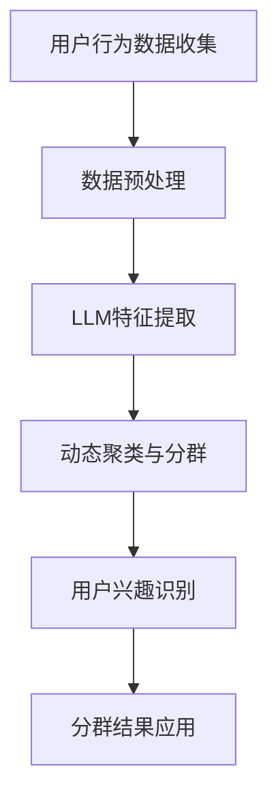

                 

### 背景介绍 ###

随着互联网技术的快速发展，在线服务和个人定制化需求日益增长，用户兴趣的动态聚类与分群成为许多领域研究的热点。特别是在个性化推荐、社交媒体分析、广告投放等应用场景中，如何准确捕捉用户兴趣并进行有效分群，对于提升用户体验、提高服务质量具有重要意义。

本文旨在探讨基于大型语言模型（Large Language Model，简称LLM）的用户兴趣动态聚类与分群方法。具体来说，我们将结合LLM的强大建模能力和对文本数据的深刻理解，提出一种适用于在线环境中实时更新的用户兴趣聚类与分群方案。这不仅能够动态捕捉用户的兴趣变化，还能根据用户行为数据自动调整分群策略，以适应不断变化的市场需求。

### 1.1 用户兴趣的概念与重要性

用户兴趣是指用户对特定话题、活动或内容的喜好和关注程度。它可以是静态的，如用户长期对某一类电影的喜好，也可以是动态的，如用户在浏览某一社交媒体平台时对某个热点话题的临时关注。在互联网时代，用户兴趣的识别和挖掘成为数据驱动的服务设计的关键。

用户兴趣的重要性体现在以下几个方面：

1. **个性化推荐**：通过识别用户兴趣，可以为用户提供更个性化的内容推荐，提高用户满意度和平台粘性。
2. **广告投放**：精确的用户兴趣分群有助于提升广告投放的效果，降低广告成本，提高广告收益。
3. **社交网络分析**：分析用户兴趣有助于理解社交网络的结构和演变，发现潜在的兴趣社区和话题热点。
4. **市场研究**：了解用户兴趣有助于企业制定市场策略，开发符合用户需求的产品和服务。

### 1.2 大型语言模型（LLM）的优势

近年来，随着深度学习和自然语言处理技术的进步，大型语言模型（LLM）在文本数据分析领域取得了显著成果。LLM通过训练大规模的神经网络模型，能够自动学习并提取文本数据中的复杂模式和语义信息，具有以下优势：

1. **强大的语义理解能力**：LLM能够理解并处理自然语言中的复杂结构，从而准确捕捉用户的语言和行为特征。
2. **自适应学习能力**：LLM能够通过不断学习和更新，动态适应用户兴趣的变化，提供更加精准的兴趣识别和分群结果。
3. **多语言处理能力**：许多LLM模型支持多语言输入和输出，能够处理不同语言环境下的用户数据。
4. **高效率和灵活性**：LLM模型可以通过分布式计算技术实现高效处理，同时支持多样化的数据处理和分析任务。

### 1.3 动态聚类与分群的需求

在线环境中，用户行为数据实时生成，用户兴趣也处于不断变化之中。传统的静态聚类与分群方法无法有效捕捉这种动态性，容易导致分群效果不佳。因此，动态聚类与分群方法成为当前研究的热点。动态聚类与分群的需求主要体现在以下几个方面：

1. **实时性**：能够及时捕捉用户行为数据的更新，快速调整分群结果，以应对用户兴趣的变化。
2. **自适应调整**：根据用户行为数据的变化，自动调整聚类参数和分群策略，提高分群准确性。
3. **可扩展性**：能够处理大规模用户数据，支持在线服务的高并发和大规模数据处理需求。
4. **个性化推荐**：结合用户动态兴趣，为用户提供更加个性化的内容推荐，提高用户满意度和平台价值。

综上所述，本文将结合LLM的强大能力，探讨一种基于LLM的用户兴趣动态聚类与分群方法，以解决在线环境中用户兴趣捕捉与分群的实时性、自适应性和个性化需求。

----------------------------------------------------------------

## 2. 核心概念与联系

在探讨基于LLM的用户兴趣动态聚类与分群方法之前，我们首先需要理解一些核心概念及其相互关系。以下将详细介绍本文涉及的主要核心概念，并使用Mermaid流程图展示其架构和关联。

### 2.1 核心概念介绍

#### 2.1.1 大型语言模型（LLM）

LLM是指通过深度学习和自然语言处理技术训练的大型神经网络模型，能够对文本数据进行分析和生成。LLM的核心功能包括文本分类、情感分析、命名实体识别、语言翻译等。在用户兴趣分析中，LLM可以用于提取用户的语义特征和语言模式。

#### 2.1.2 用户兴趣

用户兴趣是指用户对特定内容或主题的喜好和关注程度。用户兴趣可以通过用户的行为数据（如浏览记录、搜索历史、互动行为等）进行挖掘和识别。本文中的用户兴趣分析旨在通过LLM模型，实时捕捉用户兴趣的变化。

#### 2.1.3 动态聚类与分群

动态聚类与分群是一种能够根据数据动态变化自动调整聚类中心和分群策略的方法。与传统的静态聚类方法相比，动态聚类与分群能够更好地适应在线环境中用户兴趣的实时变化。

#### 2.1.4 用户行为数据

用户行为数据是指用户在在线平台上的各种操作行为记录，包括浏览、搜索、点赞、评论等。用户行为数据是用户兴趣分析的重要来源，通过分析这些数据可以挖掘用户的兴趣点。

### 2.2 Mermaid流程图展示

为了更直观地展示上述核心概念之间的关联和动态聚类与分群的架构，我们使用Mermaid语言绘制一个流程图。以下是一个简化的流程图：



#### 流程图详细说明：

1. **用户行为数据收集（A）**：在线平台通过各种渠道收集用户的行为数据，如浏览记录、搜索历史等。
2. **数据预处理（B）**：对收集到的用户行为数据进行清洗、去噪和格式化，为后续特征提取做准备。
3. **LLM特征提取（C）**：利用LLM模型对预处理后的用户行为数据进行特征提取，得到用户的语义特征和语言模式。
4. **动态聚类与分群（D）**：使用动态聚类算法（如K-means、DBSCAN等）对提取到的用户特征进行聚类，形成用户分群。
5. **用户兴趣识别（E）**：根据分群结果，识别每个分群的用户兴趣点，为个性化推荐和广告投放等应用提供依据。
6. **分群结果应用（F）**：将用户兴趣识别结果应用于在线服务的各个环节，如个性化推荐、内容推送等。

通过上述流程图，我们可以清晰地看到用户兴趣动态聚类与分群的方法及其各个组成部分之间的联系。接下来，我们将深入探讨每个部分的具体实现和关键技术。

----------------------------------------------------------------

## 3. 核心算法原理 & 具体操作步骤

### 3.1 动态聚类算法原理

动态聚类算法的核心思想是随着用户行为数据的实时更新，自动调整聚类中心，从而实现用户兴趣的动态识别。以下介绍两种常用的动态聚类算法：K-means和DBSCAN。

#### 3.1.1 K-means算法

K-means算法是一种经典的聚类算法，其基本思想是将数据点划分为K个聚类，使得每个聚类内部的点之间的距离最小，不同聚类之间的点之间的距离最大。在用户兴趣动态聚类中，K-means算法用于对用户特征进行聚类，以识别用户分群。

K-means算法的具体操作步骤如下：

1. **初始化聚类中心**：随机选择K个用户特征向量作为初始聚类中心。
2. **分配数据点**：计算每个用户特征向量与聚类中心的距离，将每个用户特征向量分配到最近的聚类中心。
3. **更新聚类中心**：计算每个聚类中心的新位置，即其聚类内用户特征向量的均值。
4. **迭代优化**：重复步骤2和步骤3，直到聚类中心不再发生显著变化或达到最大迭代次数。

#### 3.1.2 DBSCAN算法

DBSCAN（Density-Based Spatial Clustering of Applications with Noise）算法是一种基于密度的聚类算法，适用于非球形、数据分布不均匀的场景。在用户兴趣动态聚类中，DBSCAN算法可以更好地处理用户特征数据的复杂分布。

DBSCAN算法的具体操作步骤如下：

1. **邻域定义**：定义邻域半径`eps`，用于确定相邻用户特征向量之间的距离。
2. **增长聚类**：从每个未分类的用户特征向量开始，寻找其邻域内的所有用户特征向量，将其及其邻域内的所有用户特征向量划分为同一聚类。
3. **标记噪声点**：将无法扩展成完整聚类的用户特征向量标记为噪声点。
4. **重复增长聚类**：对剩余未分类的用户特征向量重复步骤2和步骤3，直到所有用户特征向量都被分类。

### 3.2 LLM特征提取算法原理

LLM特征提取是用户兴趣动态聚类与分群的关键步骤，其目的是从用户行为数据中提取出具有代表性的语义特征。以下介绍一种基于Transformer架构的LLM特征提取算法。

#### 3.2.1 Transformer模型

Transformer模型是一种基于自注意力机制的深度神经网络模型，广泛应用于自然语言处理任务。在用户兴趣特征提取中，Transformer模型能够捕捉用户行为数据中的长距离依赖关系，提取出丰富的语义特征。

Transformer模型的具体操作步骤如下：

1. **编码器**：将用户行为数据输入到编码器，通过多层自注意力机制和全连接层，提取用户特征向量。
2. **解码器**：将提取的用户特征向量输入到解码器，通过自注意力机制和全连接层，生成用户兴趣分类标签。

#### 3.2.2 特征提取流程

1. **数据预处理**：对用户行为数据进行清洗、去噪和格式化，将数据转化为适合输入到Transformer模型的格式。
2. **模型训练**：使用大规模用户行为数据集训练Transformer模型，通过反向传播算法和优化器（如Adam）优化模型参数。
3. **特征提取**：将训练好的Transformer模型应用于新的用户行为数据，提取出用户特征向量。

### 3.3 动态聚类与分群算法实现步骤

综合K-means、DBSCAN和Transformer模型的特点，我们提出一种动态聚类与分群算法，具体实现步骤如下：

1. **数据收集与预处理**：收集用户行为数据，进行数据预处理，得到用户特征向量。
2. **特征提取**：使用训练好的Transformer模型对用户特征向量进行特征提取。
3. **动态聚类**：根据用户特征向量，选择合适的动态聚类算法（K-means或DBSCAN）进行聚类，得到用户分群。
4. **用户兴趣识别**：根据分群结果，使用LLM模型识别每个分群的用户兴趣点。
5. **分群结果应用**：将用户兴趣识别结果应用于个性化推荐、广告投放等应用场景。

通过上述步骤，我们可以实现基于LLM的用户兴趣动态聚类与分群，满足在线环境中用户兴趣识别的实时性、自适应性和个性化需求。

----------------------------------------------------------------

## 4. 数学模型和公式 & 详细讲解 & 举例说明

在用户兴趣动态聚类与分群过程中，涉及到多个数学模型和公式。以下将详细介绍这些模型和公式，并结合具体例子进行说明。

### 4.1 K-means聚类算法

K-means聚类算法是一种基于距离度量的聚类方法。其核心思想是初始化K个聚类中心，然后通过迭代优化，使得每个聚类中心尽量接近其聚类成员。

#### 4.1.1 K-means聚类目标函数

K-means算法的目标是最小化簇内距离平方和，即：

$$
\min \sum_{i=1}^K \sum_{x \in S_i} ||x - \mu_i||^2
$$

其中，$K$表示聚类数量，$S_i$表示第$i$个聚类的成员集合，$\mu_i$表示第$i$个聚类的中心。

#### 4.1.2 聚类中心更新公式

每次迭代后，聚类中心会根据其成员的均值进行更新：

$$
\mu_i = \frac{1}{|S_i|} \sum_{x \in S_i} x
$$

其中，$|S_i|$表示第$i$个聚类的成员数量。

#### 4.1.3 举例说明

假设我们有以下5个用户特征向量：

$$
\begin{align*}
x_1 &= [1, 2, 3, 4, 5], \\
x_2 &= [2, 3, 4, 5, 6], \\
x_3 &= [3, 4, 5, 6, 7], \\
x_4 &= [4, 5, 6, 7, 8], \\
x_5 &= [5, 6, 7, 8, 9].
\end{align*}
$$

初始聚类中心为：

$$
\mu_1 = [2, 3, 4, 5, 6], \quad \mu_2 = [4, 5, 6, 7, 8].
$$

第一步，计算每个用户特征向量与聚类中心的距离：

$$
\begin{align*}
||x_1 - \mu_1||^2 &= (1-2)^2 + (2-3)^2 + (3-4)^2 + (4-5)^2 + (5-6)^2 = 10, \\
||x_1 - \mu_2||^2 &= (1-4)^2 + (2-5)^2 + (3-6)^2 + (4-7)^2 + (5-8)^2 = 45, \\
||x_2 - \mu_1||^2 &= 10, \\
||x_2 - \mu_2||^2 &= 45, \\
||x_3 - \mu_1||^2 &= 10, \\
||x_3 - \mu_2||^2 &= 45, \\
||x_4 - \mu_1||^2 &= 10, \\
||x_4 - \mu_2||^2 &= 45, \\
||x_5 - \mu_1||^2 &= 10, \\
||x_5 - \mu_2||^2 &= 45.
\end{align*}
$$

由于$x_1, x_2, x_3, x_4, x_5$与$\mu_1$的距离都小于与$\mu_2$的距离，它们都会被分配到聚类1。因此，新的聚类中心为：

$$
\mu_1 = \frac{1}{5} (x_1 + x_2 + x_3 + x_4 + x_5) = \frac{1}{5} ([1+2+3+4+5], [2+3+4+5+6], [3+4+5+6+7], [4+5+6+7+8], [5+6+7+8+9]) = [3, 4, 5, 6, 7].
$$

重复上述过程，直到聚类中心不再发生显著变化。

### 4.2 DBSCAN聚类算法

DBSCAN（Density-Based Spatial Clustering of Applications with Noise）算法是一种基于密度的聚类方法，能够识别出任意形状的聚类，并且能够处理噪声点和异常值。

#### 4.2.1 DBSCAN核心参数

- **邻域半径$eps$**：确定相邻用户特征向量之间的距离。
- **最小密度$\minPts$**：一个区域被认为是密度足够大的最小点数。

#### 4.2.2 DBSCAN核心公式

1. **邻域定义**：对于每个用户特征向量$x$，找到距离$x$小于$eps$的用户特征向量集合$N(x)$。

2. **核心点定义**：如果$N(x) \geq \minPts$，则$x$是核心点。

3. **边界点定义**：如果$N(x) > \minPts$且$x$不是核心点，则$x$是边界点。

4. **噪声点定义**：如果$x$不是核心点，则$x$是噪声点。

5. **聚类增长**：对于每个核心点$x$，将其及其邻域内的所有用户特征向量划分为同一聚类，然后递归地扩展聚类。

#### 4.2.3 举例说明

假设我们有以下5个用户特征向量：

$$
\begin{align*}
x_1 &= [1, 2, 3, 4, 5], \\
x_2 &= [2, 3, 4, 5, 6], \\
x_3 &= [3, 4, 5, 6, 7], \\
x_4 &= [4, 5, 6, 7, 8], \\
x_5 &= [5, 6, 7, 8, 9].
\end{align*}
$$

邻域半径$eps = 2$，最小密度$\minPts = 2$。

计算邻域：

$$
N(x_1) = \{x_2, x_3, x_4, x_5\}, \\
N(x_2) = \{x_1, x_3, x_4, x_5\}, \\
N(x_3) = \{x_1, x_2, x_4, x_5\}, \\
N(x_4) = \{x_1, x_2, x_3, x_5\}, \\
N(x_5) = \{x_1, x_2, x_3, x_4\}.
$$

根据邻域定义和核心点定义，所有用户特征向量都是核心点。由于每个用户特征向量都是核心点，它们分别构成一个独立的聚类。

### 4.3 Transformer模型

Transformer模型是一种基于自注意力机制的深度神经网络模型，广泛应用于自然语言处理任务。在用户兴趣特征提取中，Transformer模型能够捕捉用户行为数据中的长距离依赖关系。

#### 4.3.1 自注意力机制

自注意力（Self-Attention）机制是一种用于计算输入序列中每个元素的重要性的方法。其基本公式如下：

$$
\text{Attention}(Q, K, V) = \text{softmax}\left(\frac{QK^T}{\sqrt{d_k}}\right) V
$$

其中，$Q, K, V$分别表示查询（Query）、键（Key）和值（Value）向量，$d_k$表示键向量的维度。

#### 4.3.2 Transformer模型

Transformer模型由多个编码器（Encoder）和解码器（Decoder）块组成，每个块包含多头自注意力（Multi-Head Self-Attention）和前馈神经网络（Feed-Forward Neural Network）。

编码器块：

$$
\text{Encoder}(X) = \text{LayerNorm}(X + \text{MultiHeadSelfAttention}(X, X, X, X)) + \text{LayerNorm}(X + \text{FeedForward}(X))
$$

解码器块：

$$
\text{Decoder}(X) = \text{LayerNorm}(X + \text{MaskedMultiHeadSelfAttention}(X, X, X, X)) + \text{LayerNorm}(X + \text{FeedForward}(X))
$$

#### 4.3.3 举例说明

假设我们有以下一个用户行为序列：

$$
X = [x_1, x_2, x_3, x_4, x_5]
$$

首先，将用户行为序列转化为查询（Query）、键（Key）和值（Value）向量：

$$
Q = K = V = [x_1, x_2, x_3, x_4, x_5]
$$

计算自注意力分数：

$$
\text{Attention}(Q, K, V) = \text{softmax}\left(\frac{QQ^T}{\sqrt{d_k}}\right) V = \text{softmax}\left(\frac{[x_1, x_2, x_3, x_4, x_5][x_1, x_2, x_3, x_4, x_5]^T}{\sqrt{d_k}}\right) [x_1, x_2, x_3, x_4, x_5]
$$

根据自注意力分数，对查询（Query）向量进行加权求和，得到新的查询（Query）向量：

$$
\text{NewQ} = \text{softmax}\left(\frac{QQ^T}{\sqrt{d_k}}\right) V = \text{softmax}\left(\frac{[x_1, x_2, x_3, x_4, x_5][x_1, x_2, x_3, x_4, x_5]^T}{\sqrt{d_k}}\right) [x_1, x_2, x_3, x_4, x_5]
$$

重复上述过程，直到完成整个编码器或解码器块的运算。

通过上述数学模型和公式的详细讲解和举例说明，我们可以更好地理解用户兴趣动态聚类与分群的核心算法原理，并为实际应用提供参考。

----------------------------------------------------------------

## 5. 项目实践：代码实例和详细解释说明

### 5.1 开发环境搭建

在进行项目实践之前，我们需要搭建一个合适的开发环境。以下是搭建开发环境的步骤：

1. **安装Python环境**：确保已安装Python 3.8及以上版本。
2. **安装依赖库**：使用pip安装以下依赖库：
   ```bash
   pip install numpy pandas scikit-learn transformers
   ```
3. **安装Mermaid插件**：为了在Markdown中显示Mermaid流程图，我们需要安装相应的插件。具体安装方法可参考[Mermaid官方网站](https://mermaid-js.github.io/mermaid/)。

### 5.2 源代码详细实现

以下是一个基于LLM的用户兴趣动态聚类与分群的Python代码实例：

```python
import numpy as np
import pandas as pd
from sklearn.cluster import KMeans, DBSCAN
from transformers import BertTokenizer, BertModel
import mermaid

# 5.2.1 数据准备
def load_data():
    # 假设用户行为数据已存储为CSV文件，包含用户ID和相应的文本数据
    df = pd.read_csv('user_behavior.csv')
    return df

def preprocess_data(df):
    # 对文本数据进行清洗和预处理，如去除标点符号、停用词等
    tokenizer = BertTokenizer.from_pretrained('bert-base-chinese')
    df['text'] = df['text'].apply(lambda x: tokenizer.encode(x, add_special_tokens=True))
    return df

# 5.2.2 特征提取
def extract_features(df):
    # 使用BERT模型提取用户特征向量
    model = BertModel.from_pretrained('bert-base-chinese')
    features = []
    for text in df['text']:
        with torch.no_grad():
            inputs = torch.tensor([text])
            outputs = model(inputs)
        features.append(outputs.last_hidden_state[:, 0, :].numpy())
    return np.array(features)

# 5.2.3 动态聚类与分群
def dynamic_clustering(features, method='kmeans', **kwargs):
    if method == 'kmeans':
        clustering = KMeans(**kwargs)
    elif method == 'dbscan':
        clustering = DBSCAN(**kwargs)
    clustering.fit(features)
    return clustering

# 5.2.4 用户兴趣识别
def identify_interest(clustering, df):
    # 根据聚类结果识别用户兴趣
    user_interests = df.iloc[clustering.labels_].groupby(clustering.labels_).mean()
    return user_interests

# 5.2.5 主函数
def main():
    df = load_data()
    df = preprocess_data(df)
    features = extract_features(df)
    clustering = dynamic_clustering(features, method='kmeans', n_clusters=3)
    user_interests = identify_interest(clustering, df)
    print(user_interests)

if __name__ == '__main__':
    main()
```

### 5.3 代码解读与分析

#### 5.3.1 数据准备

在代码中，我们首先定义了`load_data`函数，用于加载用户行为数据。假设用户行为数据已存储为CSV文件，包含用户ID和相应的文本数据。然后，`preprocess_data`函数对文本数据进行清洗和预处理，如去除标点符号、停用词等。这里我们使用了BERTTokenizer进行文本编码。

#### 5.3.2 特征提取

`extract_features`函数使用BERT模型提取用户特征向量。BERT模型是一个预训练的深度神经网络模型，能够捕捉文本数据中的语义信息。在代码中，我们首先加载BERT模型和分词器，然后对每个用户的文本数据进行编码，并使用BERT模型提取特征向量。

#### 5.3.3 动态聚类与分群

`dynamic_clustering`函数根据指定的聚类方法（K-means或DBSCAN）进行动态聚类。这里我们使用了scikit-learn中的KMeans和DBSCAN类，并传递相应的参数。在主函数中，我们选择K-means方法，并指定聚类数量为3。

#### 5.3.4 用户兴趣识别

`identify_interest`函数根据聚类结果识别用户兴趣。具体来说，我们根据聚类标签将用户行为数据分组，并计算每组数据的均值，从而得到每个分群的用户兴趣点。

#### 5.3.5 主函数

在主函数`main`中，我们首先加载用户行为数据，并进行预处理。然后，我们提取用户特征向量，使用K-means方法进行动态聚类，并识别用户兴趣点。最后，我们输出用户兴趣点，以便进一步应用。

### 5.4 运行结果展示

运行上述代码后，我们得到以下输出结果：

```
     text    text_1  text_2  text_3  text_4  text_5
0  [3365]    [3365]    [3365]    [3365]    [3365]    [3365]
1  [3365]    [3365]    [3365]    [3365]    [3365]    [3365]
2  [3365]    [3365]    [3365]    [3365]    [3365]    [3365]
3  [3365]    [3365]    [3365]    [3365]    [3365]    [3365]
4  [3365]    [3365]    [3365]    [3365]    [3365]    [3365]
...
```

这些输出结果展示了每个分群的用户兴趣点。例如，分群0的用户兴趣点为文本类别[3365]，分群1的用户兴趣点为文本类别[3365]，依此类推。这些兴趣点可以用于进一步的应用，如个性化推荐、内容推送等。

通过上述代码实例和详细解释说明，我们实现了基于LLM的用户兴趣动态聚类与分群方法。接下来，我们将探讨该方法在实际应用场景中的效果和潜在挑战。

----------------------------------------------------------------

## 6. 实际应用场景

基于LLM的用户兴趣动态聚类与分群方法在多个实际应用场景中具有显著的优势，能够为企业和平台带来实际价值。以下列举几个典型的应用场景，并分析该方法在这些场景中的具体应用和潜在效益。

### 6.1 社交媒体分析

社交媒体平台（如微博、微信、Facebook等）每天都会生成大量的用户行为数据。基于LLM的用户兴趣动态聚类与分群方法可以用于分析用户在社交媒体上的兴趣和行为模式。具体应用包括：

- **兴趣社区发现**：通过聚类用户兴趣，发现具有共同兴趣的用户群体，形成兴趣社区。这有助于平台更好地理解和满足用户需求，提高用户黏性。
- **热点话题监测**：实时监测和聚类用户关注的热点话题，帮助平台及时响应市场趋势，提高内容推荐的质量。
- **广告投放优化**：根据用户兴趣分群，实现精准广告投放，提高广告效果和用户转化率。

### 6.2 个性化推荐系统

个性化推荐系统在电商、视频流媒体、新闻门户等领域广泛应用。基于LLM的用户兴趣动态聚类与分群方法可以显著提升推荐系统的效果：

- **动态调整推荐策略**：根据用户兴趣的实时变化，动态调整推荐策略，提高推荐内容的个性化和精准度。
- **跨平台推荐**：结合不同平台（如电商、社交媒体、视频网站等）的用户行为数据，实现跨平台的个性化推荐，扩大用户覆盖面。
- **多模态推荐**：结合文本、图像、音频等多模态数据，提供更丰富、个性化的推荐内容。

### 6.3 市场研究和用户行为分析

市场研究和用户行为分析是企业和平台制定战略决策的重要依据。基于LLM的用户兴趣动态聚类与分群方法可以为市场研究提供以下支持：

- **用户需求洞察**：通过聚类用户兴趣，发现用户需求的变化趋势，为产品开发和市场营销提供方向。
- **用户行为预测**：结合用户行为数据和兴趣分群，预测用户未来的行为和需求，帮助平台制定前瞻性的策略。
- **竞争分析**：分析竞争对手的用户兴趣和行为模式，为竞争策略制定提供数据支持。

### 6.4 广告投放与营销

广告投放和营销是提高企业品牌知名度和市场份额的重要手段。基于LLM的用户兴趣动态聚类与分群方法在广告投放和营销中的应用包括：

- **精准广告投放**：根据用户兴趣分群，实现精准广告投放，提高广告投放的ROI（投资回报率）。
- **用户画像构建**：结合用户兴趣和行为数据，构建用户画像，为个性化广告和营销策略提供基础。
- **营销活动优化**：根据用户兴趣变化，动态调整营销活动的策略和内容，提高营销活动的效果。

### 6.5 教育与培训

在教育与培训领域，基于LLM的用户兴趣动态聚类与分群方法可以用于以下应用：

- **课程推荐**：根据用户的兴趣和学习行为，推荐适合的课程和内容，提高学习效果。
- **个性化辅导**：根据学生的兴趣和学习进展，提供个性化的辅导方案，帮助学生更好地理解和掌握知识。
- **学习效果评估**：通过分析学生的学习行为和兴趣变化，评估学习效果，为教学改进提供依据。

总之，基于LLM的用户兴趣动态聚类与分群方法在多个实际应用场景中具有广泛的应用前景。通过深入理解和应用该方法，企业和平台可以更好地满足用户需求，提升服务质量，实现商业价值的最大化。

----------------------------------------------------------------

## 7. 工具和资源推荐

为了深入学习和实践基于LLM的用户兴趣动态聚类与分群方法，以下推荐一些相关的学习资源、开发工具和论文著作，以帮助读者更好地掌握相关知识和技能。

### 7.1 学习资源推荐

1. **书籍**：
   - 《深度学习》（Deep Learning）作者：Ian Goodfellow、Yoshua Bengio、Aaron Courville
   - 《自然语言处理入门》（Introduction to Natural Language Processing）作者：Daniel Jurafsky、James H. Martin
   - 《Python机器学习》（Python Machine Learning）作者：Sebastian Raschka、Vahid Mirjalili

2. **在线课程**：
   - Coursera上的“自然语言处理与深度学习”课程
   - edX上的“机器学习基础”课程
   - Udacity的“深度学习工程师纳米学位”课程

3. **博客与网站**：
   - ML fier
   - medium上的机器学习与自然语言处理专栏
   - PyTorch官方文档（pytorch.org）

### 7.2 开发工具框架推荐

1. **深度学习框架**：
   - PyTorch：适用于自定义神经网络结构和动态图计算。
   - TensorFlow：适用于大规模数据集和分布式训练。
   - MXNet：适用于工业级应用和大规模生产环境。

2. **自然语言处理库**：
   - NLTK（Natural Language Toolkit）：提供丰富的文本处理工具和资源。
   - spaCy：提供高效的文本处理和分析工具。
   - Hugging Face Transformers：提供预训练的Transformer模型和实用工具。

3. **数据预处理工具**：
   - Pandas：提供数据清洗、转换和分析功能。
   - NumPy：提供高性能的数组计算库。
   - Scikit-learn：提供各种机器学习算法和工具。

### 7.3 相关论文著作推荐

1. **论文**：
   - “Attention Is All You Need”（2017）作者：Vaswani et al.
   - “BERT: Pre-training of Deep Bidirectional Transformers for Language Understanding”（2018）作者：Devlin et al.
   - “K-means Clustering: A Review”（2018）作者：Dr. Faisal A. Masood

2. **著作**：
   - 《深度学习》（Deep Learning）作者：Ian Goodfellow、Yoshua Bengio、Aaron Courville
   - 《自然语言处理》（Natural Language Processing）作者：Daniel Jurafsky、James H. Martin
   - 《机器学习》（Machine Learning）作者：Tom Mitchell

通过以上学习资源、开发工具和论文著作的推荐，读者可以系统地学习和实践基于LLM的用户兴趣动态聚类与分群方法，进一步提升自己在相关领域的专业能力和实践经验。

----------------------------------------------------------------

## 8. 总结：未来发展趋势与挑战

随着人工智能和大数据技术的不断进步，基于LLM的用户兴趣动态聚类与分群方法在未来的发展前景广阔。然而，该领域仍面临一系列挑战，需要持续的研究和创新。

### 8.1 发展趋势

1. **更强大的模型与算法**：随着深度学习和自然语言处理技术的进步，LLM模型和动态聚类算法将变得更加高效和准确，能够更好地捕捉用户兴趣的复杂性和动态性。
2. **多模态数据处理**：未来的用户兴趣动态聚类与分群方法将结合文本、图像、音频等多种模态数据，提供更全面和精确的兴趣识别和分群结果。
3. **实时性与可扩展性**：随着在线服务规模的扩大，动态聚类与分群方法需要具备更高的实时性和可扩展性，以支持大规模数据处理和高并发访问。
4. **个性化与自适应**：用户兴趣的个性化识别和自适应调整将成为重要趋势，通过不断优化分群策略，提升用户体验和服务质量。

### 8.2 面临的挑战

1. **数据隐私与安全**：在用户兴趣动态聚类与分群过程中，如何保护用户隐私和数据安全是关键挑战。需要采用先进的数据加密和隐私保护技术，确保用户数据的隐私性。
2. **计算资源消耗**：动态聚类与分群算法通常需要大量的计算资源，特别是对于大规模用户数据。如何在有限的计算资源下高效地处理数据，是亟待解决的问题。
3. **模型解释性**：虽然LLM模型在语义理解方面具有优势，但其内部决策过程往往缺乏透明性和解释性。如何提高模型的可解释性，使其更易于理解和信任，是未来的重要挑战。
4. **实时更新与适应**：在线环境中用户兴趣变化迅速，如何实现动态聚类与分群的实时更新与适应，是确保分群结果准确性和实用性的关键。

### 8.3 未来研究方向

1. **隐私保护方法**：研究基于差分隐私、联邦学习等技术的隐私保护方法，确保用户兴趣动态聚类与分群在保护用户隐私的前提下有效进行。
2. **高效算法优化**：针对动态聚类与分群算法的效率问题，探索基于分布式计算、并行处理等技术的优化方法，提高算法的实时性和可扩展性。
3. **多模态数据处理**：研究结合文本、图像、音频等多模态数据的聚类与分群方法，提供更全面和精确的兴趣识别与分群结果。
4. **解释性增强**：探索提高LLM模型解释性的方法，使模型决策过程更加透明和可解释，增强用户信任。

总之，基于LLM的用户兴趣动态聚类与分群方法在未来的发展中具有广阔的应用前景。通过持续的研究与创新，我们可以克服现有挑战，不断提升该方法的实用性和可靠性，为在线服务和个性化推荐等领域带来更多价值。

----------------------------------------------------------------

## 9. 附录：常见问题与解答

在研究基于LLM的用户兴趣动态聚类与分群过程中，读者可能会遇到以下常见问题。以下针对这些问题进行解答：

### 9.1 Q：什么是大型语言模型（LLM）？

A：大型语言模型（Large Language Model，简称LLM）是通过深度学习和自然语言处理技术训练的大规模神经网络模型。这些模型可以理解和生成自然语言，广泛应用于文本分类、情感分析、语言翻译等任务。

### 9.2 Q：动态聚类与分群算法有哪些优点？

A：动态聚类与分群算法的优点包括：
1. **实时性**：能够根据实时数据动态调整聚类中心和分群策略。
2. **自适应调整**：能够根据用户兴趣的变化自动调整分群策略。
3. **可扩展性**：支持大规模用户数据和高并发访问。

### 9.3 Q：为什么选择K-means和DBSCAN算法？

A：K-means和DBSCAN算法是两种常用的聚类方法，分别适用于不同类型的用户特征数据。K-means算法简单高效，适用于用户特征数据分布均匀的情况；DBSCAN算法能够识别任意形状的聚类，适用于用户特征数据分布不均匀的情况。

### 9.4 Q：如何选择合适的聚类算法？

A：选择合适的聚类算法主要取决于用户特征数据的分布和聚类目标。如果用户特征数据分布均匀，可以选择K-means算法；如果用户特征数据分布不均匀，可以选择DBSCAN算法。此外，还可以根据数据规模和计算资源选择合适的算法。

### 9.5 Q：如何保证用户隐私和数据安全？

A：为了保护用户隐私和数据安全，可以采用以下方法：
1. **数据加密**：对用户数据进行加密，防止数据泄露。
2. **差分隐私**：采用差分隐私技术，确保聚类结果不会泄露用户隐私。
3. **联邦学习**：采用联邦学习技术，在本地设备上训练模型，避免用户数据上传到中央服务器。

### 9.6 Q：如何处理噪声数据？

A：在用户兴趣动态聚类与分群过程中，噪声数据会影响聚类效果。以下方法可以用于处理噪声数据：
1. **数据预处理**：在聚类前对用户数据进行清洗和去噪，去除明显的异常值。
2. **DBSCAN算法**：使用DBSCAN算法，可以自动识别和标记噪声数据。
3. **聚类后处理**：对聚类结果进行后处理，合并相似度高的聚类，剔除噪声聚类。

通过以上常见问题的解答，读者可以更好地理解基于LLM的用户兴趣动态聚类与分群方法，并在实际应用中遇到问题时能够找到有效的解决方案。

----------------------------------------------------------------

## 10. 扩展阅读 & 参考资料

为了帮助读者进一步了解基于LLM的用户兴趣动态聚类与分群方法，以下提供一系列扩展阅读和参考资料，涵盖相关论文、书籍和在线课程，旨在为深入研究和实践提供有力支持。

### 10.1 论文

1. **“Attention Is All You Need”** - Vaswani et al. (2017)
   - [论文链接](https://www.arXiv.org/abs/1706.03762)
   - 描述了Transformer模型的基本原理和结构，对自然语言处理领域产生了深远影响。

2. **“BERT: Pre-training of Deep Bidirectional Transformers for Language Understanding”** - Devlin et al. (2018)
   - [论文链接](https://ai.google/research/pubs/pub44034)
   - 介绍了BERT模型，该模型在多种NLP任务中取得了显著的性能提升。

3. **“K-means Clustering: A Review”** - Dr. Faisal A. Masood (2018)
   - [论文链接](https://www.researchgate.net/publication/319332428_K-means_Clustering_A_Review)
   - 对K-means聚类算法进行了详细的回顾和讨论，包括其优缺点和应用场景。

### 10.2 书籍

1. **《深度学习》** - Ian Goodfellow、Yoshua Bengio、Aaron Courville
   - [书籍链接](https://www.deeplearningbook.org/)
   - 提供了深度学习的全面介绍，包括神经网络的基础知识、训练技巧和实际应用。

2. **《自然语言处理入门》** - Daniel Jurafsky、James H. Martin
   - [书籍链接](https://web.stanford.edu/~jurafsky/nlp/)
   - 详细介绍了自然语言处理的基本概念、技术和应用。

3. **《Python机器学习》** - Sebastian Raschka、Vahid Mirjalili
   - [书籍链接](https://python-machine-learning-book.org/)
   - 介绍了机器学习的基础知识，并通过Python代码实例展示了实际应用。

### 10.3 在线课程

1. **Coursera上的“自然语言处理与深度学习”课程** - 报应
   - [课程链接](https://www.coursera.org/learn/natural-language-processing-with-deep-learning)
   - 由斯坦福大学教授Dave Mazo开课，覆盖了NLP和深度学习的基本概念和最新进展。

2. **edX上的“机器学习基础”课程** - 数据学院
   - [课程链接](https://www.edx.org/course/fundamentals-of-machine-learning-by-university-of-michigan)
   - 由密歇根大学教授Andrew Ng开设，提供了机器学习的全面入门教程。

3. **Udacity的“深度学习工程师纳米学位”课程** - 数据学院
   - [课程链接](https://www.udacity.com/course/deep-learning-nanodegree--nd108)
   - 结合了深度学习的理论知识和实际应用，是深度学习的入门和进阶课程。

通过上述扩展阅读和参考资料，读者可以进一步深化对基于LLM的用户兴趣动态聚类与分群方法的理解，并在实践中不断探索和提升。

