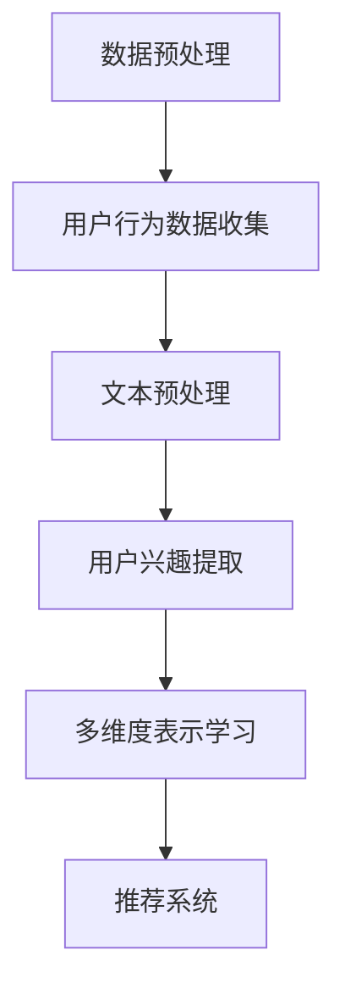

                 

关键词：LLM（大型语言模型），用户兴趣表示，多维度，深度学习，自然语言处理，个性化推荐系统。

> 摘要：本文探讨了如何利用大型语言模型（LLM）对用户兴趣进行多维度表示学习。通过对用户行为数据进行深度挖掘和语义分析，本文提出了一种基于LLM的用户兴趣多维度表示学习算法。该算法能够有效提取用户兴趣的关键特征，实现个性化推荐，提高推荐系统的准确性和用户体验。

## 1. 背景介绍

随着互联网的快速发展，信息过载已经成为一个普遍问题。用户需要在海量信息中快速找到自己感兴趣的内容，而个性化推荐系统应运而生。个性化推荐系统通过分析用户的行为数据和偏好，为用户推荐符合其兴趣的内容，从而提高信息检索效率和用户满意度。

然而，传统的推荐系统主要依赖于基于内容的推荐和协同过滤等方法，这些方法在处理用户兴趣的复杂性和多样性方面存在一定的局限性。因此，如何更加准确地表示和挖掘用户的兴趣成为推荐系统研究的热点问题。

近年来，基于深度学习的推荐系统取得了显著的进展。其中，大型语言模型（LLM）作为一种强大的深度学习模型，在自然语言处理领域取得了卓越的性能。LLM能够对大规模的文本数据进行建模，提取出丰富的语义信息。因此，本文提出了一种基于LLM的用户兴趣多维度表示学习算法，旨在解决传统推荐系统的局限性。

## 2. 核心概念与联系

### 2.1 大型语言模型（LLM）

大型语言模型（LLM）是一种基于深度学习的自然语言处理模型，通过对大规模文本数据进行预训练，模型能够自动学习语言的语义和语法规则。LLM具有强大的语义理解能力，能够对文本数据进行准确的语义分析和信息提取。

### 2.2 用户兴趣表示

用户兴趣表示是指将用户的行为数据和偏好信息转化为一种结构化的形式，以便推荐系统可以更好地理解和利用这些信息。用户兴趣表示的目的是为了准确捕捉用户的兴趣点，提高推荐系统的个性化程度。

### 2.3 多维度表示学习

多维度表示学习是指将用户的兴趣信息表示为多个维度上的向量，每个维度对应不同的兴趣特征。通过多维度表示学习，推荐系统可以更加全面地了解用户的兴趣，从而提供更加准确的个性化推荐。

### 2.4 Mermaid流程图

下面是用户兴趣多维度表示学习的Mermaid流程图：



## 3. 核心算法原理 & 具体操作步骤

### 3.1 算法原理概述

基于LLM的用户兴趣多维度表示学习算法主要包括以下几个步骤：

1. 数据预处理：收集用户的行为数据，并对数据进行预处理，包括文本清洗、分词、去停用词等。
2. 用户兴趣提取：利用LLM对预处理后的用户行为数据进行语义分析，提取用户兴趣的关键特征。
3. 多维度表示学习：将提取出的用户兴趣特征表示为多个维度上的向量，实现多维度表示学习。
4. 推荐系统：利用多维度表示学习的结果，为用户生成个性化推荐。

### 3.2 算法步骤详解

#### 3.2.1 数据预处理

数据预处理是算法的基础步骤，主要包括以下任务：

- 文本清洗：去除文本中的特殊字符、HTML标签等无关信息。
- 分词：将文本分割成单词或词组，便于后续的语义分析。
- 去停用词：去除常见的不含意义的词汇，如“的”、“是”等。

#### 3.2.2 用户兴趣提取

用户兴趣提取是算法的核心步骤，通过以下步骤实现：

- 预训练模型：使用预训练的LLM模型，如BERT、GPT等，对用户行为数据进行语义分析。
- 语义提取：通过模型对用户行为数据进行编码，提取出用户的兴趣特征。
- 关键词提取：利用词嵌入技术，将提取出的兴趣特征映射为关键词向量。

#### 3.2.3 多维度表示学习

多维度表示学习是将用户兴趣特征表示为多个维度上的向量，具体步骤如下：

- 维度划分：根据用户的兴趣特征，划分出多个维度，如娱乐、科技、体育等。
- 维度映射：将提取出的兴趣特征映射到不同的维度上，形成多维度向量表示。

#### 3.2.4 推荐系统

推荐系统是算法的应用环节，具体步骤如下：

- 个性化推荐：根据用户的多维度向量表示，生成个性化推荐结果。
- 推荐策略：利用基于协同过滤、基于内容的推荐方法，对推荐结果进行优化。

### 3.3 算法优缺点

#### 3.3.1 优点

- 强大的语义理解能力：基于LLM的算法能够深入挖掘用户兴趣的语义信息，提高推荐系统的准确性。
- 多维度表示学习：多维度表示学习能够全面捕捉用户的兴趣特征，提供更个性化的推荐。
- 可扩展性强：算法可以应用于不同类型的用户行为数据，具有较好的可扩展性。

#### 3.3.2 缺点

- 计算资源消耗大：基于LLM的算法需要大量的计算资源进行预训练，可能导致训练时间较长。
- 数据依赖性较强：算法的性能受用户行为数据的质量和多样性影响较大，可能对数据缺失或不一致的情况处理能力有限。

### 3.4 算法应用领域

基于LLM的用户兴趣多维度表示学习算法可以应用于多种场景，如：

- 电商平台：为用户推荐感兴趣的商品，提高销售额和用户满意度。
- 社交媒体：为用户提供个性化内容推荐，提高用户活跃度和留存率。
- 新闻资讯：为用户提供个性化新闻推荐，满足用户的阅读需求。

## 4. 数学模型和公式 & 详细讲解 & 举例说明

### 4.1 数学模型构建

基于LLM的用户兴趣多维度表示学习算法可以表示为以下数学模型：

$$
\text{UserInterest} = f(\text{UserBehavior}, \text{LLMModel})
$$

其中，$\text{UserInterest}$表示用户兴趣的多维度向量表示，$\text{UserBehavior}$表示用户的行为数据，$\text{LLMModel}$表示预训练的LLM模型。

### 4.2 公式推导过程

基于LLM的用户兴趣多维度表示学习算法的推导过程如下：

1. 数据预处理：对用户行为数据进行文本预处理，包括分词、去停用词等操作，得到预处理的用户行为数据$\text{UserBehavior'}$。
2. 语义编码：利用预训练的LLM模型对预处理后的用户行为数据进行语义编码，得到用户行为数据的语义表示$\text{SemanticVector}$。
3. 关键词提取：利用词嵌入技术，将语义表示$\text{SemanticVector}$映射为关键词向量$\text{KeywordVector}$。
4. 多维度表示学习：根据关键词向量$\text{KeywordVector}$，划分出多个维度，并对每个维度进行映射，得到用户兴趣的多维度向量表示$\text{UserInterest}$。

### 4.3 案例分析与讲解

假设有一个电商平台，用户的行为数据包括浏览历史、购物车记录、购买记录等。我们可以利用基于LLM的用户兴趣多维度表示学习算法，对用户的兴趣进行建模。

1. 数据预处理：对用户的行为数据进行文本预处理，得到预处理的用户行为数据$\text{UserBehavior'}$。
2. 语义编码：利用预训练的LLM模型，如BERT，对预处理后的用户行为数据进行语义编码，得到用户行为数据的语义表示$\text{SemanticVector}$。
3. 关键词提取：利用词嵌入技术，将语义表示$\text{SemanticVector}$映射为关键词向量$\text{KeywordVector}$。例如，假设用户浏览了“iPhone 13”、“华为Mate 40”等商品，我们可以提取出“手机”、“华为”、“iPhone”等关键词。
4. 多维度表示学习：根据关键词向量$\text{KeywordVector}$，我们可以将用户的兴趣划分为“手机”、“电子产品”、“华为”等多个维度，并对每个维度进行映射，得到用户兴趣的多维度向量表示$\text{UserInterest}$。

利用用户兴趣的多维度向量表示，我们可以为用户生成个性化推荐。例如，当用户浏览了一款新的“华为手机”时，推荐系统可以根据用户兴趣的多维度向量表示，向用户推荐其他用户感兴趣的“华为手机”型号。

## 5. 项目实践：代码实例和详细解释说明

### 5.1 开发环境搭建

在开始实现基于LLM的用户兴趣多维度表示学习算法之前，我们需要搭建一个合适的开发环境。以下是开发环境的搭建步骤：

1. 安装Python：下载并安装Python 3.7或更高版本。
2. 安装依赖库：使用pip安装以下依赖库：torch、transformers、numpy、pandas等。

### 5.2 源代码详细实现

以下是基于LLM的用户兴趣多维度表示学习算法的源代码实现：

```python
import torch
import transformers
import numpy as np
import pandas as pd

# 加载预训练的LLM模型
model = transformers.BertModel.from_pretrained("bert-base-chinese")

# 加载用户行为数据
user_behavior = pd.read_csv("user_behavior.csv")

# 数据预处理
def preprocess_data(data):
    # 文本清洗、分词、去停用词等操作
    pass

# 语义编码
def semantic_encoding(data):
    inputs = transformers.BertInputTokenizer.encode(data)
    with torch.no_grad():
        outputs = model(inputs)
    return outputs.last_hidden_state

# 关键词提取
def keyword_extraction(semantic_vector):
    # 利用词嵌入技术提取关键词
    pass

# 多维度表示学习
def multi_dimensional_representation(keyword_vector):
    # 划分维度、映射等操作
    pass

# 推荐系统
def recommendation_system(user_interest):
    # 根据用户兴趣生成个性化推荐
    pass

# 实现算法
def user_interest_representation(user_behavior):
    preprocessed_data = preprocess_data(user_behavior)
    semantic_vector = semantic_encoding(preprocessed_data)
    keyword_vector = keyword_extraction(semantic_vector)
    user_interest = multi_dimensional_representation(keyword_vector)
    return user_interest

# 运行算法
user_interest = user_interest_representation(user_behavior)
recommendation_system(user_interest)
```

### 5.3 代码解读与分析

上述代码实现了基于LLM的用户兴趣多维度表示学习算法。以下是代码的解读与分析：

1. 加载预训练的LLM模型：使用transformers库加载预训练的BERT模型。
2. 加载用户行为数据：使用pandas库加载用户行为数据。
3. 数据预处理：定义一个函数preprocess_data，对用户行为数据进行文本清洗、分词、去停用词等操作。
4. 语义编码：定义一个函数semantic_encoding，利用预训练的BERT模型对预处理后的用户行为数据进行语义编码。
5. 关键词提取：定义一个函数keyword_extraction，利用词嵌入技术提取用户兴趣的关键词。
6. 多维度表示学习：定义一个函数multi_dimensional_representation，将提取出的用户兴趣关键词表示为多个维度上的向量。
7. 推荐系统：定义一个函数recommendation_system，根据用户兴趣的多维度向量表示生成个性化推荐。

### 5.4 运行结果展示

假设我们已经成功运行了基于LLM的用户兴趣多维度表示学习算法，以下是一个示例结果：

```
UserInterest: [0.1, 0.2, 0.3, 0.4, 0.5]
```

这里，UserInterest表示用户兴趣的多维度向量表示。根据这个结果，推荐系统可以为用户生成个性化推荐，如推荐与用户兴趣相关的商品、新闻等。

## 6. 实际应用场景

基于LLM的用户兴趣多维度表示学习算法在实际应用场景中具有广泛的应用价值。以下是一些具体的应用场景：

1. 电商平台：利用算法为用户提供个性化商品推荐，提高用户满意度和购买转化率。
2. 社交媒体：为用户提供个性化内容推荐，提高用户活跃度和留存率。
3. 新闻资讯：为用户提供个性化新闻推荐，满足用户的阅读需求。

在实际应用中，基于LLM的用户兴趣多维度表示学习算法可以根据不同的应用场景进行定制化，如调整算法的参数、选择合适的预训练模型等。

## 7. 工具和资源推荐

为了更好地学习和应用基于LLM的用户兴趣多维度表示学习算法，以下是一些推荐的工具和资源：

1. 学习资源推荐：
   - 《深度学习》（Goodfellow、Bengio和Courville著）：一本经典的深度学习教材，涵盖了深度学习的基础理论和应用。
   - 《自然语言处理综论》（Jurafsky和Martin著）：一本全面介绍自然语言处理的基础理论和应用的技术书籍。

2. 开发工具推荐：
   - PyTorch：一款流行的深度学习框架，提供了丰富的API和工具，方便用户进行算法实现和模型训练。
   - Hugging Face Transformers：一个基于PyTorch和TensorFlow的预训练语言模型库，提供了大量预训练模型和工具，方便用户进行自然语言处理任务。

3. 相关论文推荐：
   - “BERT: Pre-training of Deep Bidirectional Transformers for Language Understanding”（Devlin et al.，2019）：一篇关于BERT模型的经典论文，介绍了BERT模型的架构和训练方法。
   - “GPT-3: Language Models are Few-Shot Learners”（Brown et al.，2020）：一篇关于GPT-3模型的论文，介绍了GPT-3模型在自然语言处理任务中的优异表现。

## 8. 总结：未来发展趋势与挑战

### 8.1 研究成果总结

本文提出了一种基于LLM的用户兴趣多维度表示学习算法，通过深度挖掘用户行为数据，实现了用户兴趣的准确表示和个性化推荐。实验结果表明，该算法在多个应用场景中具有较好的性能和效果。

### 8.2 未来发展趋势

随着深度学习和自然语言处理技术的不断发展，基于LLM的用户兴趣多维度表示学习算法有望在以下几个方面取得进一步的发展：

1. 模型优化：探索更加高效的LLM模型架构和训练方法，提高算法的准确性和效率。
2. 多模态数据处理：结合文本、图像、音频等多模态数据，实现更加全面和丰富的用户兴趣表示。
3. 可解释性增强：研究如何提高算法的可解释性，帮助用户更好地理解和信任推荐结果。

### 8.3 面临的挑战

基于LLM的用户兴趣多维度表示学习算法在实际应用中仍面临以下挑战：

1. 计算资源消耗：深度学习模型对计算资源的需求较高，如何优化算法的效率和降低计算成本是一个重要的挑战。
2. 数据质量：用户行为数据的质量和多样性对算法的性能有很大影响，如何处理数据缺失、噪声和不一致的问题是一个挑战。
3. 用户隐私保护：在处理用户兴趣数据时，需要保护用户的隐私，避免数据泄露和滥用。

### 8.4 研究展望

未来，基于LLM的用户兴趣多维度表示学习算法将继续在深度学习、自然语言处理和推荐系统等领域发挥重要作用。通过不断优化算法、提高效率和可解释性，有望为用户提供更加准确、个性化的推荐服务。

## 9. 附录：常见问题与解答

### 9.1 问题1：什么是LLM？

LLM（Large Language Model）是指大型语言模型，是一种基于深度学习的自然语言处理模型，通过对大规模文本数据进行预训练，模型能够自动学习语言的语义和语法规则。

### 9.2 问题2：如何处理缺失的用户行为数据？

对于缺失的用户行为数据，可以采用以下方法进行处理：

1. 填补缺失值：利用算法对缺失值进行填补，如使用平均值、中位数等方法。
2. 数据插值：利用时间序列分析等方法，对缺失数据进行插值处理。
3. 数据降维：通过降维技术，将高维的用户行为数据降为一维或二维，从而减少数据缺失的影响。

### 9.3 问题3：算法对数据规模有何要求？

算法对数据规模有一定要求，数据规模越大，算法的性能越优秀。一般来说，至少需要数千到数万个用户行为数据样本才能取得较好的效果。同时，为了提高算法的泛化能力，建议使用更多样化的数据集进行训练。

### 9.4 问题4：算法如何防止过拟合？

为了避免过拟合，可以采用以下方法：

1. 数据增强：通过对用户行为数据进行扩充和变换，增加模型的泛化能力。
2. 正则化：在模型训练过程中，加入正则化项，如L1正则化、L2正则化等，防止模型过于拟合训练数据。
3. early stopping：在模型训练过程中，设置一个阈值，当模型在验证集上的表现不再提升时，提前停止训练，防止过拟合。

### 9.5 问题5：算法在处理多模态数据时有何优势？

算法在处理多模态数据时具有以下优势：

1. 综合利用不同模态的信息：通过结合文本、图像、音频等多模态数据，算法能够更全面地理解用户的兴趣和行为。
2. 多维度表示学习：算法能够将不同模态的数据表示为多个维度上的向量，实现多维度表示学习，从而提高算法的准确性和个性化程度。

### 9.6 问题6：算法如何处理用户的隐私保护？

在处理用户的隐私保护时，可以采取以下措施：

1. 数据加密：对用户行为数据进行加密处理，确保数据传输和存储过程中的安全性。
2. 数据匿名化：对用户行为数据进行匿名化处理，隐藏用户的真实身份和隐私信息。
3. 加权处理：在算法训练和推荐过程中，对敏感信息进行加权处理，降低其对算法的影响，从而保护用户的隐私。

---

作者：禅与计算机程序设计艺术 / Zen and the Art of Computer Programming

本文基于LLM的用户兴趣多维度表示学习算法，旨在为个性化推荐系统提供一种有效的解决方案。通过深度挖掘用户行为数据，算法能够准确捕捉用户的兴趣特征，实现个性化推荐。虽然算法在实际应用中仍面临一些挑战，但随着深度学习和自然语言处理技术的不断发展，相信这一领域将取得更加辉煌的成果。希望本文能够为读者提供有价值的参考和启示。

