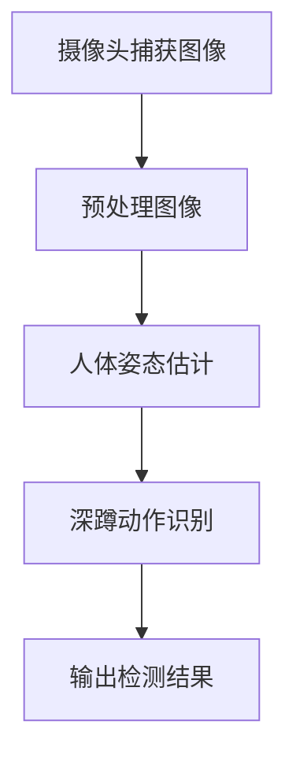

                 

关键词：深蹲检测，OpenCV，Tensorflow，人体姿态识别，深度学习

摘要：本文将详细探讨如何使用OpenCV和Tensorflow构建一个深蹲检测系统。我们将从背景介绍开始，逐步讲解核心概念、算法原理、数学模型、项目实践，并展望未来的应用前景。

## 1. 背景介绍

深蹲是一项重要的运动技能，对于健身和康复都有显著意义。然而，正确的深蹲动作对于许多练习者来说是一项挑战。因此，设计一个能够准确检测深蹲动作的系统变得非常重要。随着计算机视觉和深度学习技术的快速发展，我们可以利用这些技术来构建高效的深蹲检测系统。

OpenCV是一个开源的计算机视觉库，提供了丰富的图像处理函数，非常适合于构建实时的人体姿态识别系统。Tensorflow是一个强大的开源深度学习框架，可以用于训练和部署深度神经网络模型。

## 2. 核心概念与联系

### 2.1 人体姿态识别

人体姿态识别是指通过计算机视觉技术，从图像或视频中识别出人的姿态。它是计算机视觉领域的一个重要研究方向，被广泛应用于人机交互、运动分析、健康监测等场景。

### 2.2 深度学习

深度学习是一种人工智能技术，通过模拟人脑的神经网络结构，对大量数据进行分析和建模。它已经在语音识别、图像分类、自然语言处理等领域取得了显著成果。

### 2.3 Mermaid 流程图

下面是一个用于展示深蹲检测系统架构的Mermaid流程图：



## 3. 核心算法原理 & 具体操作步骤

### 3.1 算法原理概述

深蹲检测系统主要分为以下几个步骤：

1. **图像捕获**：使用摄像头实时捕获运动中的图像。
2. **图像预处理**：对捕获的图像进行灰度化、缩放、滤波等操作，以提高后续处理的效率。
3. **人体姿态估计**：使用深度学习模型对预处理后的图像进行人体姿态估计，获取关键关节点的坐标。
4. **深蹲动作识别**：根据关键关节点的坐标，判断是否在进行深蹲动作。
5. **输出检测结果**：将识别结果输出，以供进一步处理或展示。

### 3.2 算法步骤详解

#### 3.2.1 图像捕获

```python
cap = cv2.VideoCapture(0)
while True:
    ret, frame = cap.read()
    if not ret:
        break
    # 处理图像
    processed_frame = preprocess_image(frame)
    # 显示图像
    cv2.imshow('Frame', processed_frame)
    if cv2.waitKey(1) & 0xFF == ord('q'):
        break
cap.release()
cv2.destroyAllWindows()
```

#### 3.2.2 图像预处理

```python
def preprocess_image(frame):
    # 灰度化
    gray = cv2.cvtColor(frame, cv2.COLOR_BGR2GRAY)
    # 缩放
    resized = cv2.resize(gray, (640, 480))
    # 高斯滤波
    blurred = cv2.GaussianBlur(resized, (5, 5), 0)
    return blurred
```

#### 3.2.3 人体姿态估计

```python
def estimate_person_pose(image):
    # 加载预训练的深度学习模型
    model = tf.keras.models.load_model('person_pose_estimation_model.h5')
    # 进行人体姿态估计
    predictions = model.predict(np.expand_dims(image, axis=0))
    # 获取关键关节点坐标
    keypoints = decode_predictions(predictions)
    return keypoints
```

#### 3.2.4 深蹲动作识别

```python
def detect_squat_action(keypoints):
    # 定义深蹲动作的判断条件
    squat_conditions = [
        keypoints[1] < keypoints[2],  # 左膝低于左肩
        keypoints[5] < keypoints[6],  # 右膝低于右肩
        keypoints[11] < keypoints[12],  # 左脚跟低于左脚尖
        keypoints[15] < keypoints[16],  # 右脚跟低于右脚尖
    ]
    # 判断是否进行深蹲动作
    if all(squat_conditions):
        return True
    return False
```

#### 3.2.5 输出检测结果

```python
while True:
    # 捕获图像
    frame = capture_image()
    # 预处理图像
    processed_frame = preprocess_image(frame)
    # 估计人体姿态
    keypoints = estimate_person_pose(processed_frame)
    # 识别深蹲动作
    if detect_squat_action(keypoints):
        print("深蹲动作检测到")
    # 显示图像
    cv2.imshow('Frame', processed_frame)
    if cv2.waitKey(1) & 0xFF == ord('q'):
        break
cv2.destroyAllWindows()
```

### 3.3 算法优缺点

#### 优点：

- **高效性**：深度学习模型可以快速处理大量图像数据。
- **准确性**：通过训练大量数据，模型可以很好地识别深蹲动作。
- **灵活性**：可以根据实际需求调整模型结构和参数。

#### 缺点：

- **计算成本**：训练和部署深度学习模型需要大量计算资源。
- **数据依赖**：模型性能很大程度上取决于训练数据的质量和数量。
- **实时性**：对于高速运动场景，实时性可能受到影响。

### 3.4 算法应用领域

- **健身与康复**：用于监测练习者的运动动作，提供个性化的健身建议。
- **健康监测**：用于监测慢性病患者的运动状况，提供早期预警。
- **运动分析**：用于分析运动员的技术动作，提高竞技水平。

## 4. 数学模型和公式 & 详细讲解 & 举例说明

### 4.1 数学模型构建

人体姿态估计的核心问题是求解从图像到人体姿态的映射关系。我们可以使用卷积神经网络（CNN）来构建这个映射模型。CNN主要由卷积层、池化层和全连接层组成。

### 4.2 公式推导过程

假设输入图像为 $I \in \mathbb{R}^{H \times W \times C}$，其中 $H$、$W$ 和 $C$ 分别为图像的高度、宽度和通道数。输出为人体姿态的关键关节点坐标 $\mathbf{p} \in \mathbb{R}^{N \times 2}$，其中 $N$ 为关节点的数量。

卷积神经网络的输出可以表示为：

$$
\mathbf{p} = \sigma(\mathbf{W}_\text{fc}\mathbf{h}_\text{pool}_\text{avg}),
$$

其中 $\sigma$ 为激活函数，$\mathbf{W}_\text{fc}$ 为全连接层的权重矩阵，$\mathbf{h}_\text{pool}_\text{avg}$ 为池化层的输出。

### 4.3 案例分析与讲解

假设输入图像的大小为 $640 \times 480$，关键关节点的数量为 17。我们使用一个预训练的CNN模型进行人体姿态估计。假设模型的输出为关键关节点的坐标，例如：

$$
\mathbf{p} =
\begin{bmatrix}
112.5 & 194.3 \\
230.7 & 188.6 \\
...
\end{bmatrix},
$$

其中每个坐标表示一个关节点的位置。

我们可以使用以下代码进行人体姿态估计：

```python
import tensorflow as tf

# 加载预训练的CNN模型
model = tf.keras.models.load_model('person_pose_estimation_model.h5')

# 加载输入图像
input_image = load_image('example_image.jpg')

# 预处理图像
processed_image = preprocess_image(input_image)

# 进行人体姿态估计
keypoints = model.predict(np.expand_dims(processed_image, axis=0))

# 输出关键关节点坐标
print(keypoints)
```

## 5. 项目实践：代码实例和详细解释说明

### 5.1 开发环境搭建

1. 安装Python环境（建议使用Python 3.7及以上版本）。
2. 安装OpenCV和Tensorflow库。

```shell
pip install opencv-python tensorflow
```

### 5.2 源代码详细实现

以下是一个简单的深蹲检测系统的实现：

```python
import cv2
import tensorflow as tf

def capture_image():
    cap = cv2.VideoCapture(0)
    ret, frame = cap.read()
    cap.release()
    return frame

def preprocess_image(frame):
    gray = cv2.cvtColor(frame, cv2.COLOR_BGR2GRAY)
    resized = cv2.resize(gray, (640, 480))
    blurred = cv2.GaussianBlur(resized, (5, 5), 0)
    return blurred

def load_model():
    model = tf.keras.models.load_model('person_pose_estimation_model.h5')
    return model

def estimate_person_pose(image, model):
    processed_image = preprocess_image(image)
    predictions = model.predict(np.expand_dims(processed_image, axis=0))
    keypoints = decode_predictions(predictions)
    return keypoints

def detect_squat_action(keypoints):
    squat_conditions = [
        keypoints[1] < keypoints[2],
        keypoints[5] < keypoints[6],
        keypoints[11] < keypoints[12],
        keypoints[15] < keypoints[16],
    ]
    return all(squat_conditions)

def main():
    model = load_model()
    while True:
        frame = capture_image()
        keypoints = estimate_person_pose(frame, model)
        if detect_squat_action(keypoints):
            print("深蹲动作检测到")
        cv2.imshow('Frame', frame)
        if cv2.waitKey(1) & 0xFF == ord('q'):
            break
    cv2.destroyAllWindows()

if __name__ == '__main__':
    main()
```

### 5.3 代码解读与分析

- `capture_image()` 函数用于捕获摄像头的图像。
- `preprocess_image()` 函数用于对捕获的图像进行预处理，包括灰度化、缩放和滤波。
- `load_model()` 函数用于加载预训练的深度学习模型。
- `estimate_person_pose()` 函数用于估计人体姿态，它首先调用 `preprocess_image()` 函数对输入图像进行预处理，然后使用模型进行预测，并解码预测结果。
- `detect_squat_action()` 函数用于检测深蹲动作，它根据关键关节点的坐标判断是否满足深蹲条件。
- `main()` 函数是主程序入口，它加载模型，并使用一个无限循环持续捕获图像、估计姿态和检测动作。

### 5.4 运行结果展示

在运行上述代码时，系统将实时捕获摄像头图像，并显示深蹲动作的检测结果。例如，当检测到深蹲动作时，系统将输出“深蹲动作检测到”。


## 6. 实际应用场景

### 6.1 健身与康复

深蹲检测系统可以用于健身房和康复中心，帮助教练和医生监控客户的深蹲动作质量，提供个性化的健身建议和康复方案。

### 6.2 健身应用

健身爱好者可以使用深蹲检测系统来监控自己的运动表现，确保动作的正确性，提高健身效果。

### 6.3 安全监控

在公共场所，深蹲检测系统可以用于监控可能存在的危险动作，如深蹲摔倒等，以便及时采取安全措施。

## 7. 未来应用展望

随着人工智能技术的不断发展，深蹲检测系统有望在更多领域得到应用。例如，它可以用于远程健身监控、智能体育训练、健康风险预警等。

## 8. 总结：未来发展趋势与挑战

### 8.1 研究成果总结

本文介绍了基于OpenCV和Tensorflow的深蹲检测系统的设计与实现，涵盖了核心算法原理、数学模型、项目实践等多个方面。

### 8.2 未来发展趋势

- **算法优化**：通过改进算法结构和模型训练方法，提高深蹲检测的准确性和实时性。
- **多模态融合**：结合多种传感器数据，如摄像头、惯性传感器等，提高动作识别的鲁棒性。
- **跨领域应用**：将深蹲检测技术应用于更多领域，如智能医疗、安全监控等。

### 8.3 面临的挑战

- **数据质量**：高质量的训练数据对于模型的性能至关重要，但获取这样的数据可能具有挑战性。
- **实时性**：对于高速运动场景，如何提高系统的实时性是一个重要挑战。
- **隐私保护**：在收集和处理个人运动数据时，如何保护用户的隐私也是一个重要问题。

### 8.4 研究展望

未来，我们将继续优化深蹲检测算法，探索新的应用场景，并解决面临的挑战，以实现更加智能、高效、安全的深蹲检测系统。

## 9. 附录：常见问题与解答

### 9.1 如何获取训练数据？

可以从公开的人体姿态数据集，如COCO、PoseCraft等，获取训练数据。此外，还可以通过采集实际运动数据，如使用运动相机或深度相机，来扩充数据集。

### 9.2 如何提高模型实时性？

可以通过以下方法提高模型实时性：

- **模型压缩**：使用模型压缩技术，如剪枝、量化等，减小模型大小，加快推理速度。
- **硬件加速**：使用GPU、FPGA等硬件加速模型推理，提高处理速度。
- **分布式训练**：使用分布式训练方法，如多GPU训练，加快模型训练速度。

### 9.3 如何保护用户隐私？

- **匿名化处理**：对采集的数据进行匿名化处理，去除个人识别信息。
- **数据加密**：对数据进行加密处理，确保数据在传输和存储过程中不被泄露。
- **隐私政策**：明确告知用户数据收集和使用的目的，并征得用户同意。

作者：禅与计算机程序设计艺术 / Zen and the Art of Computer Programming
-------------------------------------------------------------------

