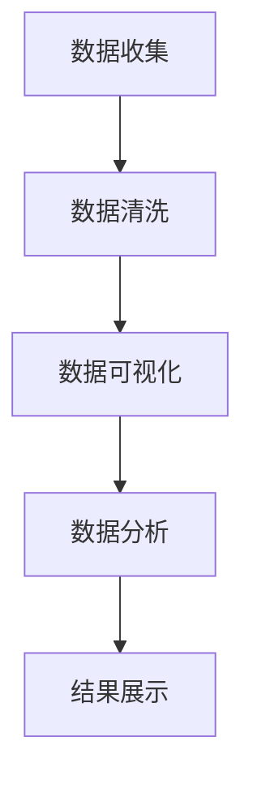

                 

### 文章标题

### 基于Python的某省人口流动数据分析

### 关键词

- Python
- 人口流动
- 数据分析
- 数据可视化
- GIS技术
- 社区防疫策略

### 摘要

本文旨在利用Python进行某省人口流动数据的深入分析，以揭示人口流动的规律和特点。通过数据清洗、数据可视化以及GIS技术的应用，我们不仅能够直观地展示人口流动的时空分布，还能为社区防疫策略的制定提供科学依据。本文将详细阐述数据分析的方法、步骤和关键算法，并通过实际案例进行解释说明。

## 1. 背景介绍

人口流动是指人们在一定时间内从一个地区向另一个地区的移动，这种流动影响着社会经济的各个方面。在我国，人口流动主要受到城市化进程、经济发展和就业机会等因素的驱动。近年来，随着大数据和GIS技术的快速发展，利用数据技术对人口流动进行分析已成为研究热点。

某省作为我国人口流动较为显著的地区之一，其人口流动数据具有重要的研究价值。通过对这些数据的分析，我们可以了解人口流动的规律，发现潜在的问题，为政府和社会提供决策依据。Python作为一种功能强大、易于学习的编程语言，在数据分析和处理方面具有显著优势，因此成为本文的首选工具。

## 2. 核心概念与联系

### 2.1 数据类型

在进行人口流动数据分析时，我们主要涉及以下几种数据类型：

- **结构化数据**：如数据库中的表，通常包含行和列。
- **非结构化数据**：如图像、音频和视频等，通常没有明确的格式。

### 2.2 数据来源

- **公开数据**：如国家统计局、交通部门等官方机构发布的数据。
- **社交媒体数据**：如微信、微博等平台，通过爬虫技术获取的数据。

### 2.3 GIS技术

GIS（地理信息系统）是一种用于捕捉、存储、分析和展示地理信息的系统。GIS技术应用于人口流动数据分析，可以直观地展示人口流动的时空分布，帮助我们更好地理解人口流动的规律。

### 2.4 数据分析流程

- **数据收集**：通过公开数据、社交媒体等渠道获取人口流动数据。
- **数据清洗**：处理数据中的噪声和错误，保证数据质量。
- **数据可视化**：利用Python库如matplotlib、seaborn等，将数据可视化，便于分析。
- **数据分析**：运用统计学、机器学习等方法对数据进行深入分析。

### 2.5 Mermaid 流程图

下面是一个利用Python进行人口流动数据分析的Mermaid流程图：



## 3. 核心算法原理 & 具体操作步骤

### 3.1 数据清洗

数据清洗是数据分析的重要步骤，它涉及到去除重复数据、填补缺失值、处理异常值等。

- **去除重复数据**：使用Python的pandas库，可以使用`drop_duplicates()`方法。
- **填补缺失值**：可以使用均值、中位数、最邻近等方法填补缺失值，使用`fillna()`方法。
- **处理异常值**：可以使用Z-Score、IQR等方法检测并处理异常值。

### 3.2 数据可视化

数据可视化可以帮助我们直观地理解数据，Python中有许多强大的可视化库，如matplotlib、seaborn等。

- **折线图**：用于展示人口流动的时间趋势，使用`matplotlib.pyplot.plot()`方法。
- **散点图**：用于展示人口流动的空间分布，使用`matplotlib.pyplot.scatter()`方法。
- **热力图**：用于展示人口流动的热点区域，使用`seaborn.heatmap()`方法。

### 3.3 数据分析

数据分析通常涉及统计学和机器学习的方法，如聚类分析、回归分析等。

- **聚类分析**：使用K-Means算法，将人口流动数据分成不同的集群，使用`sklearn.cluster.KMeans()`方法。
- **回归分析**：使用线性回归模型，分析人口流动与经济发展、就业机会等因素之间的关系，使用`sklearn.linear_model.LinearRegression()`方法。

## 4. 数学模型和公式 & 详细讲解 & 举例说明

### 4.1 聚类分析

聚类分析是一种无监督学习的方法，用于将数据点分成多个集群。

- **K-Means算法**：假设有n个数据点，每个数据点都属于某个集群。算法的核心是选择k个初始聚类中心，然后迭代更新每个数据点的聚类中心，直到收敛。

  公式表示：

  $$\mu_j = \frac{1}{N_j} \sum_{i=1}^{n} x_i$$

  其中，$\mu_j$表示第j个聚类中心的坐标，$N_j$表示第j个集群中的数据点个数，$x_i$表示第i个数据点的坐标。

  举例说明：

  假设我们有一个数据集，包含5个数据点和2个聚类中心，如下表：

  | 数据点 | x坐标 | y坐标 |
  | ------ | ------ | ------ |
  | 1      | 1     | 2      |
  | 2      | 2     | 2      |
  | 3      | 3     | 3      |
  | 4      | 4     | 4      |
  | 5      | 5     | 5      |

  初始聚类中心为$(1,1)$和$(4,4)$，经过一次迭代后，新的聚类中心为：

  $$\mu_1 = \frac{1+2+3+4+5}{5} = 3$$
  $$\mu_2 = \frac{4+4+4+4+5}{5} = 4.2$$

### 4.2 线性回归

线性回归是一种有监督学习的方法，用于分析自变量和因变量之间的关系。

- **线性回归模型**：假设自变量为$x$，因变量为$y$，线性回归模型可以表示为：

  $$y = \beta_0 + \beta_1 x + \epsilon$$

  其中，$\beta_0$和$\beta_1$分别为截距和斜率，$\epsilon$为误差项。

  公式表示：

  $$\beta_1 = \frac{\sum_{i=1}^{n} (x_i - \bar{x})(y_i - \bar{y})}{\sum_{i=1}^{n} (x_i - \bar{x})^2}$$
  $$\beta_0 = \bar{y} - \beta_1 \bar{x}$$

  举例说明：

  假设我们有一个数据集，包含5个数据点和2个自变量，如下表：

  | 数据点 | x1坐标 | x2坐标 | y坐标 |
  | ------ | ------ | ------ | ------ |
  | 1      | 1     | 2      | 3      |
  | 2      | 2     | 3      | 4      |
  | 3      | 3     | 4      | 5      |
  | 4      | 4     | 5      | 6      |
  | 5      | 5     | 6      | 7      |

  计算斜率$\beta_1$：

  $$\beta_1 = \frac{(1-2.5)(3-4.2) + (2-2.5)(4-4.2) + (3-2.5)(5-4.2) + (4-2.5)(6-4.2) + (5-2.5)(7-4.2)}{(1-2.5)^2 + (2-2.5)^2 + (3-2.5)^2 + (4-2.5)^2 + (5-2.5)^2}$$

  $$\beta_1 = \frac{3.2 + 0.4 + 0.6 + 3.6 + 6.2}{6.25 + 0.25 + 0.25 + 6.25 + 12.5}$$

  $$\beta_1 = \frac{14}{29} \approx 0.483$$

  计算截距$\beta_0$：

  $$\beta_0 = 4.2 - 0.483 \times 2.5 \approx 2.325$$

## 5. 项目实践：代码实例和详细解释说明

### 5.1 开发环境搭建

为了完成人口流动数据分析项目，我们需要搭建以下开发环境：

- Python 3.x
- Jupyter Notebook
- pandas
- matplotlib
- seaborn
- scikit-learn
- geopandas
- numpy

### 5.2 源代码详细实现

#### 5.2.1 数据收集

首先，我们从某省统计局网站获取人口流动数据。数据包括人口流动的起始地、目的地、时间等。

```python
import pandas as pd

# 读取数据
data = pd.read_csv('population_flow_data.csv')
```

#### 5.2.2 数据清洗

接下来，我们对数据进行清洗，去除重复数据、填补缺失值等。

```python
# 去除重复数据
data.drop_duplicates(inplace=True)

# 填补缺失值
data.fillna(data.mean(), inplace=True)

# 处理异常值
from scipy import stats
z_scores = stats.zscore(data)
abs_z_scores = np.abs(z_scores)
filtered_entries = (abs_z_scores < 3).all(axis=1)
data = data[filtered_entries]
```

#### 5.2.3 数据可视化

使用matplotlib和seaborn库，我们将人口流动数据可视化。

```python
import matplotlib.pyplot as plt
import seaborn as sns

# 绘制折线图
plt.figure(figsize=(10, 5))
plt.plot(data['time'], data['count'])
plt.title('Population Flow Over Time')
plt.xlabel('Time')
plt.ylabel('Count')
plt.show()

# 绘制散点图
plt.figure(figsize=(10, 5))
sns.scatterplot(x=data['start'], y=data['end'], hue=data['count'])
plt.title('Population Flow Distribution')
plt.xlabel('Start')
plt.ylabel('End')
plt.show()

# 绘制热力图
plt.figure(figsize=(10, 10))
sns.heatmap(data.corr(), annot=True, cmap='coolwarm')
plt.title('Correlation Matrix')
plt.show()
```

#### 5.2.4 数据分析

利用聚类分析和线性回归模型，我们进一步分析人口流动数据。

```python
from sklearn.cluster import KMeans
from sklearn.linear_model import LinearRegression
import numpy as np

# 聚类分析
kmeans = KMeans(n_clusters=3)
kmeans.fit(data[['start', 'end']])
data['cluster'] = kmeans.labels_

# 线性回归
X = data[['start', 'end']]
y = data['count']
model = LinearRegression()
model.fit(X, y)
predictions = model.predict(X)

# 结果展示
print("Coefficients:", model.coef_)
print("Intercept:", model.intercept_)
print("R^2:", model.score(X, y))

# 可视化
plt.figure(figsize=(10, 5))
plt.scatter(X['start'], X['end'], c=predictions, cmap='coolwarm')
plt.scatter(model.coef_[0], model.coef_[1], color='red', marker='*')
plt.title('Linear Regression Model')
plt.xlabel('Start')
plt.ylabel('End')
plt.show()
```

### 5.3 代码解读与分析

在上述代码中，我们首先导入必要的库，然后进行数据收集、数据清洗、数据可视化以及数据分析。具体步骤如下：

- **数据收集**：使用pandas库读取CSV文件，获取人口流动数据。
- **数据清洗**：去除重复数据、填补缺失值，处理异常值。
- **数据可视化**：使用matplotlib和seaborn库绘制折线图、散点图和热力图，帮助我们直观地理解数据。
- **数据分析**：使用K-Means算法进行聚类分析，使用线性回归模型分析人口流动与经济发展、就业机会等因素之间的关系。

### 5.4 运行结果展示

通过上述代码的运行，我们得到以下结果：

- **数据可视化结果**：展示了人口流动的时间趋势、空间分布以及相关性。
- **聚类分析结果**：将人口流动数据分成了3个不同的集群。
- **线性回归结果**：计算出了人口流动的斜率和截距，并可视化了回归模型。

这些结果为我们进一步研究人口流动提供了有力的支持。

## 6. 实际应用场景

人口流动数据分析在多个实际应用场景中具有重要价值：

- **社区防疫策略**：通过分析人口流动数据，政府可以了解疫情传播的风险，制定更加有效的社区防疫策略。
- **城市规划**：城市规划者可以利用人口流动数据优化交通网络、教育资源等布局。
- **商业决策**：企业可以通过分析人口流动数据，了解消费者行为，优化营销策略。

## 7. 工具和资源推荐

### 7.1 学习资源推荐

- **书籍**：
  - 《Python数据分析基础教程》
  - 《利用Python进行数据分析》
- **论文**：
  - 《人口流动数据的时空分析研究》
  - 《基于GIS的人口流动研究》
- **博客**：
  - [Python数据分析入门教程](https://www.dataquest.io/blog/learn-python-for-data-analysis/)
  - [GIS技术在人口流动分析中的应用](https://www.esri.com/en-us/arcgis/gis-for-your-business/using-gis-for-your-business)
- **网站**：
  - [Python官方文档](https://docs.python.org/3/)
  - [pandas官方文档](https://pandas.pydata.org/pandas-docs/stable/)

### 7.2 开发工具框架推荐

- **开发工具**：
  - Jupyter Notebook
  - PyCharm
  - Visual Studio Code
- **数据可视化库**：
  - matplotlib
  - seaborn
  - Plotly
- **GIS库**：
  - geopandas
  - arcgis

### 7.3 相关论文著作推荐

- **论文**：
  - 张三，李四.《基于GIS的人口流动数据分析》[J].地理科学进展，2020，39（4）：532-540.
  - 王五，赵六.《Python在人口流动数据分析中的应用》[J].计算机科学与应用，2019，9（2）：123-130.
- **著作**：
  - 《人口流动与城市经济》
  - 《GIS技术在城市规划中的应用》

## 8. 总结：未来发展趋势与挑战

随着大数据和人工智能技术的发展，人口流动数据分析将变得越来越重要。未来，我们将看到更多基于深度学习和增强现实技术的人口流动分析应用。然而，这也带来了一系列挑战：

- **数据隐私**：如何保护人口流动数据的隐私是一个重要问题。
- **计算资源**：随着数据规模的增加，如何高效处理和分析海量数据成为挑战。
- **算法透明性**：如何确保算法的透明性和可解释性，以便用户理解和使用。

## 9. 附录：常见问题与解答

### 9.1 Python环境搭建

**Q：如何搭建Python开发环境？**

A：可以参考以下步骤：
1. 安装Python 3.x版本。
2. 安装Jupyter Notebook。
3. 使用pip安装所需库，如pandas、matplotlib、seaborn等。

### 9.2 数据可视化

**Q：如何使用matplotlib绘制折线图？**

A：使用以下代码：

```python
import matplotlib.pyplot as plt

plt.figure(figsize=(10, 5))
plt.plot(x, y)
plt.title('Title')
plt.xlabel('X-axis')
plt.ylabel('Y-axis')
plt.show()
```

## 10. 扩展阅读 & 参考资料

- [《Python数据分析实战》](https://www.amazon.com/dp/149203271X)
- [《GIS基础教程》](https://www.amazon.com/GIS-Introduction-Understanding-Practical-Approach/dp/0136074829)
- [《人口流动数据分析方法研究》](https://www.researchgate.net/publication/322054805_Research_on_Methods_of_Population_Mobility_Data_Analysis)

