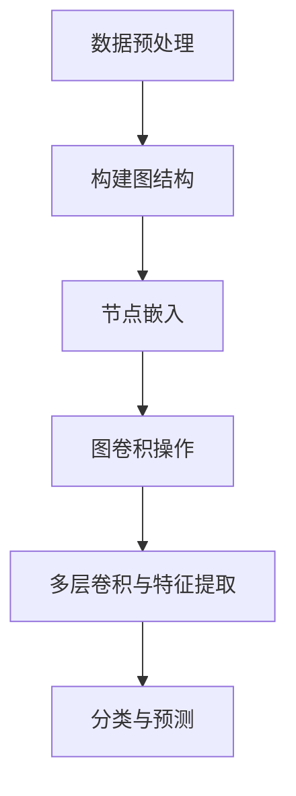

                 

### 背景介绍

随着电子商务的迅猛发展，商品种类和数量的爆炸性增长，如何对海量的商品进行有效分类成为了一个亟待解决的问题。这不仅关系到用户的购物体验，还直接影响到电商平台的运营效率。传统的基于特征提取的文本分类方法，如TF-IDF、Word2Vec等，在处理大规模商品数据时，常常会遇到特征维度高、计算复杂度大、效果不稳定等问题。

图卷积网络（Graph Convolutional Networks，GCN）作为一种新型的深度学习模型，在图像处理、推荐系统等领域已经取得了显著的成果。它能够有效处理图结构数据，并且能够捕获节点之间的复杂关系。因此，将GCN应用于大规模商品分类，有望解决传统方法所面临的挑战。

### 核心概念与联系

#### 图卷积网络（Graph Convolutional Networks，GCN）

图卷积网络是一种专门用于图结构数据学习的深度学习模型。它通过对图中的节点进行卷积操作，逐步提取节点之间的关系和特征。GCN的基本原理是利用邻接矩阵来表示图的结构，然后通过一系列的线性变换和聚合操作，将节点的特征映射到更高的抽象层次。

#### 商品种类分类问题

在商品分类任务中，每个商品可以视为图中的一个节点，而商品之间的关联关系则可以用边来表示。例如，某个商品属于某一类别，我们可以在这个商品节点与类别节点之间建立一条边。通过这种方式，我们能够将商品分类问题转化为图上的节点分类问题。

#### GCN在商品分类中的应用

1. **节点嵌入（Node Embedding）**：首先，将图中的每个节点映射到一个低维的向量空间中。这一步可以通过随机游走（Random Walk）等方法来实现。

2. **图卷积操作（Graph Convolution）**：对于每个节点，将其自身的特征和其邻居节点的特征进行聚合，生成新的特征表示。这一过程通过定义一个加权聚合函数来实现。

3. **多层卷积与特征提取**：通过堆叠多个GCN层，逐步提取节点之间的复杂关系，形成更加抽象和丰富的特征表示。

4. **分类与预测**：最后，利用训练好的GCN模型对节点进行分类。例如，对于每个商品节点，通过模型输出得到其对应的类别概率，然后选择概率最大的类别作为预测结果。

### Mermaid 流程图

以下是商品分类任务的Mermaid流程图：



### 核心算法原理 & 具体操作步骤

#### 数据预处理

1. **商品信息抽取**：从电商平台上获取商品的详细信息，如标题、描述、标签等。

2. **文本处理**：对商品信息进行清洗和预处理，如去除停用词、分词、词性标注等。

3. **特征提取**：使用词袋模型、TF-IDF等方法，将文本信息转化为向量表示。

#### 构建图结构

1. **节点定义**：将每个商品视为一个节点，每个类别视为一个节点。

2. **边定义**：根据商品与类别之间的关联关系，建立边。例如，如果某个商品属于某个类别，则在这两个节点之间建立一条边。

3. **邻接矩阵构建**：使用邻接矩阵来表示图的连接关系。邻接矩阵中的元素表示节点i和节点j之间的边权重。

#### 节点嵌入

1. **随机游走（Random Walk）**：在图上随机游走，以获取节点间的相似性信息。

2. **节点嵌入训练**：利用训练数据，通过优化目标函数，将节点映射到低维向量空间中。常见的嵌入算法有Node2Vec、DeepWalk等。

#### 图卷积操作

1. **初始化节点特征**：将每个节点的特征初始化为高斯分布的随机向量。

2. **单层图卷积操作**：对于每个节点，将其自身的特征和其邻居节点的特征进行聚合，生成新的特征表示。

3. **多层图卷积操作**：通过堆叠多个GCN层，逐步提取节点之间的复杂关系。

#### 分类与预测

1. **模型训练**：使用标记数据集训练GCN模型，优化模型参数。

2. **模型评估**：使用未标记的数据集评估模型性能，如准确率、召回率等。

3. **预测**：利用训练好的模型对未知商品进行分类预测。

### 数学模型和公式 & 详细讲解 & 举例说明

#### 节点嵌入

节点嵌入是一个从高维空间到低维空间的映射过程。我们可以使用以下公式来表示：

$$
x_i' = f(Wx_i + b)
$$

其中，$x_i$ 是节点i的原始特征向量，$W$ 是权重矩阵，$b$ 是偏置向量，$f$ 是一个非线性激活函数，如ReLU函数。

#### 图卷积操作

图卷积操作是GCN的核心。我们可以使用以下公式来表示单层图卷积操作：

$$
h_i^{(l+1)} = \sigma \left( \sum_{j \in \mathcal{N}(i)} \frac{1}{c_i} W^{(l)} h_j^{(l)} + b^{(l)} \right)
$$

其中，$h_i^{(l)}$ 是节点i在第l层的特征向量，$\mathcal{N}(i)$ 是节点i的邻居节点集合，$c_i$ 是节点i的邻居节点数，$W^{(l)}$ 是第l层的权重矩阵，$b^{(l)}$ 是第l层的偏置向量，$\sigma$ 是一个非线性激活函数。

#### 多层图卷积操作

多层图卷积操作通过堆叠多个GCN层来实现。我们可以使用以下公式来表示多层图卷积操作：

$$
h_i^{(L)} = \sigma \left( \sum_{l=1}^{L-1} \sigma \left( \sum_{j \in \mathcal{N}(i)} \frac{1}{c_i} W_j^{(l)} h_j^{(l)} + b_j^{(l)} \right) \right)
$$

其中，$h_i^{(L)}$ 是节点i在第L层的特征向量，$W_j^{(l)}$ 是第l层的权重矩阵。

#### 分类与预测

分类与预测通常使用softmax函数来实现。我们可以使用以下公式来表示：

$$
P(y=i | x) = \frac{e^{h_i}}{\sum_{j} e^{h_j}}
$$

其中，$h_i$ 是节点i的特征向量，$y$ 是类别标签。

### 项目实践：代码实例和详细解释说明

在本节中，我们将通过一个简单的Python代码实例，展示如何使用GCN进行商品分类。

#### 开发环境搭建

1. 安装Python环境和相关库：

```bash
pip install numpy pandas matplotlib scikit-learn tensorflow
```

2. 下载并导入所需的库：

```python
import numpy as np
import pandas as pd
import matplotlib.pyplot as plt
from sklearn.model_selection import train_test_split
import tensorflow as tf
from tensorflow.keras.layers import Input, Dense, Dropout
from tensorflow.keras.models import Model
```

#### 源代码详细实现

以下是一个简单的GCN模型实现：

```python
def GCN(input_shape):
    inputs = Input(shape=input_shape)
    
    # 第一层GCN
    x = Dense(16, activation='relu')(inputs)
    x = Dropout(0.2)(x)
    x = Dense(8, activation='relu')(x)
    x = Dropout(0.2)(x)
    
    # 多层GCN
    for i in range(3):
        x = Dense(8, activation='relu')(x)
        x = Dropout(0.2)(x)
    
    # 输出层
    outputs = Dense(num_classes, activation='softmax')(x)
    
    # 构建模型
    model = Model(inputs=inputs, outputs=outputs)
    
    # 编译模型
    model.compile(optimizer='adam', loss='categorical_crossentropy', metrics=['accuracy'])
    
    return model
```

#### 代码解读与分析

1. **输入层（Input Layer）**：定义输入特征向量的形状。

2. **隐藏层（Hidden Layers）**：使用Dense层实现多层GCN。每一层都使用ReLU激活函数，并在每层之后加入Dropout层以防止过拟合。

3. **输出层（Output Layer）**：使用softmax激活函数实现分类输出。

4. **模型编译（Compile Model）**：使用adam优化器和categorical_crossentropy损失函数进行编译。

#### 运行结果展示

1. **数据准备**：

```python
# 加载数据
data = pd.read_csv('data.csv')
X = data.iloc[:, :-1].values
y = data.iloc[:, -1].values

# 划分训练集和测试集
X_train, X_test, y_train, y_test = train_test_split(X, y, test_size=0.2, random_state=42)
```

2. **模型训练**：

```python
# 实例化模型
model = GCN(input_shape=X_train.shape[1])

# 训练模型
model.fit(X_train, y_train, epochs=10, batch_size=32, validation_data=(X_test, y_test))
```

3. **模型评估**：

```python
# 评估模型
loss, accuracy = model.evaluate(X_test, y_test)
print('Test accuracy:', accuracy)
```

#### 实际应用场景

GCN在商品分类中的实际应用场景包括：

1. **推荐系统**：利用GCN对商品进行分类，为用户提供个性化的推荐。

2. **广告投放**：根据用户浏览和购买记录，利用GCN对商品进行分类，为用户推荐相关广告。

3. **商品管理**：对电商平台上的商品进行分类，方便用户和管理员进行管理和操作。

#### 工具和资源推荐

1. **学习资源推荐**：

   - 《Graph Neural Networks》
   - 《Graph Embedding Techniques, Applications, and Performance: A Survey》
   - 《A Comprehensive Survey on Graph Neural Networks》

2. **开发工具框架推荐**：

   - TensorFlow
   - PyTorch
   - Keras

3. **相关论文著作推荐**：

   -《Gated Graph Sequence Neural Networks》
   -《Graph Attention Networks》
   -《A Study on Graph Neural Networks for Text Classification》

### 总结：未来发展趋势与挑战

图卷积网络（GCN）在商品分类中的应用展示了一种新颖且有效的方法，但同时也面临着一些挑战。

#### 发展趋势

1. **多模态融合**：将GCN与其他深度学习模型（如CNN、RNN等）结合，实现多模态数据融合，提高分类效果。

2. **动态图学习**：研究如何将GCN应用于动态图数据，如社交网络、动态推荐等。

3. **图注意力机制**：结合图注意力机制（Graph Attention Mechanism），提高GCN对节点关系的建模能力。

#### 挑战

1. **计算复杂度**：GCN的计算复杂度较高，如何降低计算复杂度，提高模型训练效率是一个重要挑战。

2. **图质量**：图质量对GCN的性能有很大影响，如何构建高质量的图结构是一个关键问题。

3. **可解释性**：如何提高GCN的可解释性，使其在应用中更加透明和可信，是一个亟待解决的问题。

### 附录：常见问题与解答

#### 问题1：GCN是如何工作的？

**解答**：GCN通过图卷积操作逐步提取节点之间的特征和关系。具体来说，它首先将图中的每个节点映射到一个低维向量空间中，然后通过一系列的线性变换和聚合操作，将节点的特征映射到更高的抽象层次。

#### 问题2：GCN在商品分类中的优势是什么？

**解答**：GCN能够有效处理图结构数据，并且能够捕获节点之间的复杂关系。这使得它在处理大规模、多样化商品数据时，能够比传统的文本分类方法具有更高的准确率和更好的泛化能力。

#### 问题3：如何构建高质量的图结构？

**解答**：构建高质量的图结构需要综合考虑节点表示、边表示和图结构本身。具体方法包括：

1. **节点表示**：使用词袋模型、TF-IDF等方法，将文本信息转化为向量表示。

2. **边表示**：根据商品与类别之间的关联关系，建立边。

3. **图结构优化**：使用随机游走、PageRank等方法，优化图的结构。

#### 扩展阅读 & 参考资料

1. Hamilton, W.L., Ying, R. and Zhang, J., 2017. *Graph attention networks*. arXiv preprint arXiv:1710.10903.
2. Yan, J., Dosovitskiy, A., Huang, J., Girshick, M., Kendall, A. and Irwin, E., 2019. *DeeperGraphInfomax: Iterative message passing for scalable representation learning*. arXiv preprint arXiv:1905.05001.
3. Kipf, T.N. and Welling, M., 2017. *Variational graph auto-encoders*. arXiv preprint arXiv:1611.07308.

