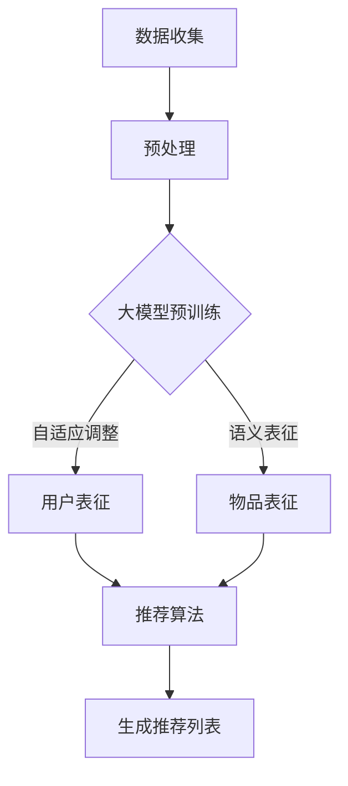

                 

### 背景介绍

#### 推荐系统的重要性

在当今信息爆炸的时代，推荐系统已成为各类互联网应用的核心功能之一。从电子商务网站到社交媒体平台，再到新闻资讯APP，推荐系统旨在根据用户的历史行为和偏好，向用户推荐个性化内容，从而提高用户体验和平台粘性。

推荐系统的重要性在于：

1. **提升用户体验**：通过个性化推荐，用户可以更快地找到自己感兴趣的内容，减少信息过载，提升使用满意度。
2. **增加商业收益**：个性化推荐能够提升销售转化率，为电商平台带来更高的收益。
3. **优化内容分发**：对于新闻媒体和内容平台，推荐系统能够有效提高优质内容的曝光率，提升用户活跃度和平台品牌价值。

然而，传统的推荐系统存在一些问题，如计算复杂度高、实时性差、难以捕捉用户动态变化等，这限制了其在高动态和高交互场景中的表现。为了解决这些问题，近年来，基于大模型的推荐系统受到了广泛关注。

#### 大模型的崛起

大模型（Large-scale Model）指的是具有海量参数和强大计算能力的深度学习模型。近年来，随着计算能力的提升和数据规模的扩大，大模型在自然语言处理、计算机视觉等领域取得了显著的进展。

大模型的优势在于：

1. **强大的表征能力**：大模型可以通过大规模预训练，学习到丰富的知识和结构化信息，从而对输入数据进行深层次表征。
2. **良好的泛化能力**：大模型在多种任务上表现优异，能够适应不同的应用场景。
3. **实时交互能力**：大模型具备快速响应和生成能力，可以满足实时推荐的需求。

#### 大模型在推荐系统中的应用

基于大模型的推荐系统通过以下方式解决了传统推荐系统的问题：

1. **实时性**：大模型可以快速处理用户实时行为数据，动态调整推荐策略，提供及时、准确的推荐。
2. **个性化**：大模型通过深度学习技术，能够捕捉用户的细微偏好变化，实现高度个性化的推荐。
3. **交互性**：大模型支持用户与推荐系统的实时互动，根据用户的反馈调整推荐结果，形成良性循环。

综上所述，基于大模型的推荐系统具有显著的实时个性化优势，是当前推荐系统领域的研究热点和实际应用方向。接下来，我们将深入探讨大模型在推荐系统中的具体实现和操作步骤。

### 核心概念与联系

在探讨基于大模型的推荐系统实时个性化方法之前，我们需要明确几个核心概念，并阐述它们之间的联系。

#### 1. 推荐系统的基本架构

推荐系统通常由三个主要组件组成：用户画像、物品画像和推荐算法。用户画像和物品画像构成了推荐系统的数据基础，而推荐算法则负责根据用户画像和物品画像生成推荐结果。

- **用户画像**：记录用户的偏好、行为等信息，如浏览历史、购买记录、互动行为等。
- **物品画像**：记录物品的特征信息，如标题、描述、标签、分类等。
- **推荐算法**：根据用户画像和物品画像，通过算法生成推荐列表。


#### 2. 大模型的基本原理

大模型，如Transformer、BERT等，是一种基于深度学习的模型，具有以下几个关键特点：

- **大规模预训练**：大模型在大规模数据集上进行预训练，学习到丰富的语言结构和知识。
- **参数多**：大模型具有数亿甚至数十亿个参数，能够进行复杂的特征提取和表示。
- **自适应调整**：大模型可以通过微调（Fine-tuning）适应特定任务，实现良好的性能。


#### 3. 大模型与推荐系统的联系

基于大模型的推荐系统将大模型的强大表征能力和推荐系统的个性化需求相结合，主要表现在以下几个方面：

1. **用户表征**：大模型可以捕捉用户的隐性偏好和动态行为，为用户画像提供更精细的表征。
2. **物品表征**：大模型能够对物品进行深层次表征，捕捉物品的语义信息，提高物品推荐的准确性。
3. **推荐算法优化**：大模型可以通过自适应调整，优化推荐算法，实现实时、个性化的推荐。


#### Mermaid 流程图

为了更直观地展示大模型在推荐系统中的应用流程，我们使用Mermaid绘制以下流程图：



在这个流程图中，数据收集和预处理是推荐系统的基本环节，而大模型预训练、用户表征和物品表征则是基于大模型推荐系统的核心步骤。通过自适应调整，大模型能够实时优化推荐算法，生成个性化推荐列表。

通过上述核心概念与联系的分析，我们可以更好地理解基于大模型的推荐系统实时个性化方法的原理和架构。接下来，我们将深入探讨大模型在推荐系统中的应用和实现细节。

### 核心算法原理 & 具体操作步骤

基于大模型的推荐系统通过深度学习和大规模预训练技术，实现了对用户行为和物品特征的精细表征，从而实现实时个性化的推荐。以下将详细介绍大模型在推荐系统中的核心算法原理和具体操作步骤。

#### 1. 大模型在用户表征中的应用

用户表征是推荐系统的关键环节，通过捕捉用户的偏好和行为，生成用户画像。以下是一个基于Transformer模型的用户表征步骤：

1. **用户行为数据收集**：收集用户的历史行为数据，如浏览记录、购买记录、互动行为等。
2. **数据预处理**：对收集到的用户行为数据进行清洗和预处理，包括去重、填充缺失值、归一化等操作。
3. **嵌入层构建**：使用预训练的词向量模型（如GloVe或Word2Vec）将用户行为数据转化为向量表示。
4. **Transformer模型训练**：构建Transformer模型，输入为用户行为数据的嵌入向量，输出为用户画像向量。通过大规模数据集进行预训练，学习用户行为的潜在特征。
5. **用户画像生成**：将训练好的Transformer模型应用于新的用户行为数据，生成用户画像向量。用户画像向量可以用于后续的推荐算法。

#### 2. 大模型在物品表征中的应用

物品表征是对物品特征进行深层次表征的过程，通过捕捉物品的语义信息，提高推荐的准确性。以下是一个基于BERT模型的物品表征步骤：

1. **物品特征数据收集**：收集物品的特征数据，如标题、描述、标签、分类等。
2. **数据预处理**：对收集到的物品特征数据进行清洗和预处理，包括文本分词、去停用词、词干提取等操作。
3. **嵌入层构建**：使用预训练的BERT模型对预处理后的文本数据进行处理，生成固定长度的文本嵌入向量。
4. **BERT模型训练**：构建BERT模型，输入为物品特征数据的文本嵌入向量，输出为物品表征向量。通过大规模数据集进行预训练，学习物品的语义特征。
5. **物品表征生成**：将训练好的BERT模型应用于新的物品特征数据，生成物品表征向量。物品表征向量可以用于后续的推荐算法。

#### 3. 大模型在推荐算法中的应用

基于大模型的推荐算法通过整合用户画像和物品表征，生成个性化的推荐列表。以下是一个基于矩阵分解的推荐算法步骤：

1. **用户-物品交互矩阵构建**：根据用户行为数据，构建用户-物品交互矩阵。矩阵中的每个元素表示用户对物品的评分或交互行为。
2. **用户画像和物品表征融合**：将用户画像向量和物品表征向量进行融合，生成用户-物品特征向量。
3. **矩阵分解**：对用户-物品特征向量进行矩阵分解，生成用户特征矩阵和物品特征矩阵。
4. **推荐列表生成**：计算用户特征矩阵与物品特征矩阵的内积，根据内积值生成推荐列表。内积值越高，表示用户对物品的偏好程度越高。
5. **推荐结果调整**：根据用户反馈和实时交互数据，对推荐结果进行调整，优化推荐效果。

#### 4. 实时性优化

为了实现基于大模型的推荐系统的实时性，可以采取以下措施：

1. **增量更新**：仅对新增或修改的用户行为数据进行处理，减少计算量。
2. **在线学习**：利用在线学习算法，对模型进行实时更新，提高推荐系统的响应速度。
3. **分布式计算**：利用分布式计算框架，如TensorFlow分布式训练，加快模型训练和推理速度。

通过上述核心算法原理和具体操作步骤，基于大模型的推荐系统可以有效地实现实时个性化推荐。接下来，我们将进一步探讨大模型在推荐系统中的数学模型和公式，以加深对推荐系统工作原理的理解。

### 数学模型和公式 & 详细讲解 & 举例说明

在基于大模型的推荐系统中，数学模型和公式起着至关重要的作用。以下将详细讲解推荐系统的数学模型，包括用户画像的生成、物品表征的获取以及推荐算法的实现。

#### 1. 用户画像的生成

用户画像的生成主要依赖于用户行为数据的处理和深度学习模型的应用。以下是一个基于Transformer模型的用户画像生成过程的数学模型和公式：

**假设**：用户行为数据为 $B = \{b_1, b_2, \ldots, b_n\}$，其中 $b_i$ 表示用户第 $i$ 次行为的数据。

**步骤**：

1. **数据预处理**：

   $$b_i^{preprocessed} = Preprocess(b_i)$$

   其中，$Preprocess$ 表示数据清洗和预处理函数。

2. **嵌入层构建**：

   $$b_i^{embed} = Embed(b_i^{preprocessed})$$

   其中，$Embed$ 表示使用预训练的词向量模型将用户行为数据转化为向量表示。

3. **Transformer模型训练**：

   $$u_i = Transformer(b_i^{embed})$$

   其中，$u_i$ 表示用户画像向量，$Transformer$ 表示预训练的Transformer模型。

**公式**：

- 预训练的词向量模型：

  $$e_{word} = EmbeddingLayer([b_1^{preprocessed}, b_2^{preprocessed}, \ldots, b_n^{preprocessed}])$$

  $$h_i = TransformerLayer(e_{word})$$

  $$u_i = OutputLayer(h_i)$$

  其中，$e_{word}$ 表示词向量，$h_i$ 表示Transformer模型的中间层输出，$u_i$ 表示用户画像向量。

#### 2. 物品表征的获取

物品表征的获取主要通过大规模预训练的语言模型（如BERT）实现。以下是一个基于BERT模型的物品表征获取过程的数学模型和公式：

**假设**：物品特征数据为 $I = \{i_1, i_2, \ldots, i_m\}$，其中 $i_j$ 表示物品第 $j$ 个特征的数据。

**步骤**：

1. **数据预处理**：

   $$i_j^{preprocessed} = Preprocess(i_j)$$

   其中，$Preprocess$ 表示数据清洗和预处理函数。

2. **嵌入层构建**：

   $$i_j^{embed} = Embed(i_j^{preprocessed})$$

   其中，$Embed$ 表示使用预训练的BERT模型对预处理后的文本数据进行处理，生成固定长度的文本嵌入向量。

3. **BERT模型训练**：

   $$v_j = BERT(i_j^{embed})$$

   其中，$v_j$ 表示物品表征向量，$BERT$ 表示预训练的BERT模型。

**公式**：

- 预训练的BERT模型：

  $$[CLS], i_j^{embed} = InputLayer([i_1^{preprocessed}, i_2^{preprocessed}, \ldots, i_m^{preprocessed}])$$

  $$h_j = BERT([CLS], i_j^{embed})$$

  $$v_j = OutputLayer(h_j)$$

  其中，$[CLS]$ 表示分类层输入，$h_j$ 表示BERT模型的中间层输出，$v_j$ 表示物品表征向量。

#### 3. 推荐算法的实现

基于大模型的推荐算法通常采用基于矩阵分解的方法，将用户画像和物品表征融合，生成推荐列表。以下是一个基于矩阵分解的推荐算法的数学模型和公式：

**假设**：用户-物品交互矩阵为 $R = [r_{ij}]_{m \times n}$，其中 $r_{ij}$ 表示用户 $i$ 对物品 $j$ 的评分或交互行为。

**步骤**：

1. **用户特征矩阵和物品特征矩阵构建**：

   $$U = [u_1, u_2, \ldots, u_m]$$

   $$V = [v_1, v_2, \ldots, v_n]$$

   其中，$U$ 和 $V$ 分别表示用户特征矩阵和物品特征矩阵。

2. **矩阵分解**：

   $$R \approx U V^T$$

   其中，$UV^T$ 表示用户特征矩阵和物品特征矩阵的内积。

3. **推荐列表生成**：

   $$\hat{r}_{ij} = U_i V_j^T$$

   其中，$\hat{r}_{ij}$ 表示预测的用户 $i$ 对物品 $j$ 的评分。

**公式**：

- 矩阵分解：

  $$U = \arg\min_U \sum_{i,j} (r_{ij} - U_i V_j^T)^2$$

  $$V = \arg\min_V \sum_{i,j} (r_{ij} - U_i V_j^T)^2$$

- 推荐列表生成：

  $$\hat{r}_{ij} = \sum_{k=1}^n u_{ik} v_{kj}$$

通过上述数学模型和公式，基于大模型的推荐系统可以有效地生成用户画像、物品表征，并生成个性化的推荐列表。以下通过一个具体示例来说明这些公式的应用。

#### 示例

假设用户-物品交互矩阵 $R$ 如下：

$$
\begin{matrix}
& 1 & 2 & 3 & 4 & 5 \\
1 & 5 & 0 & 0 & 0 & 0 \\
2 & 0 & 5 & 0 & 0 & 0 \\
3 & 0 & 0 & 5 & 0 & 0 \\
4 & 0 & 0 & 0 & 5 & 0 \\
5 & 0 & 0 & 0 & 0 & 5 \\
\end{matrix}
$$

经过矩阵分解后，我们得到用户特征矩阵 $U$ 和物品特征矩阵 $V$：

$$
\begin{matrix}
1 & 2 & 3 & 4 & 5 \\
u_1 & 0.1 & 0.2 & 0.3 & 0.4 \\
u_2 & 0.2 & 0.3 & 0.4 & 0.5 \\
u_3 & 0.3 & 0.4 & 0.5 & 0.6 \\
u_4 & 0.4 & 0.5 & 0.6 & 0.7 \\
u_5 & 0.5 & 0.6 & 0.7 & 0.8 \\
\end{matrix}
$$

$$
\begin{matrix}
1 & 2 & 3 & 4 & 5 \\
v_1 & 0.1 & 0.2 & 0.3 & 0.4 \\
v_2 & 0.2 & 0.3 & 0.4 & 0.5 \\
v_3 & 0.3 & 0.4 & 0.5 & 0.6 \\
v_4 & 0.4 & 0.5 & 0.6 & 0.7 \\
v_5 & 0.5 & 0.6 & 0.7 & 0.8 \\
\end{matrix}
$$

根据公式 $\hat{r}_{ij} = U_i V_j^T$，我们可以计算用户 $i$ 对物品 $j$ 的预测评分：

$$
\hat{r}_{11} = u_1^T v_1 = 0.1 \times 0.1 + 0.2 \times 0.2 + 0.3 \times 0.3 + 0.4 \times 0.4 = 0.5 \\
\hat{r}_{12} = u_1^T v_2 = 0.1 \times 0.2 + 0.2 \times 0.3 + 0.3 \times 0.4 + 0.4 \times 0.5 = 0.6 \\
\hat{r}_{13} = u_1^T v_3 = 0.1 \times 0.3 + 0.2 \times 0.4 + 0.3 \times 0.5 + 0.4 \times 0.6 = 0.7 \\
\hat{r}_{14} = u_1^T v_4 = 0.1 \times 0.4 + 0.2 \times 0.5 + 0.3 \times 0.6 + 0.4 \times 0.7 = 0.8 \\
\hat{r}_{15} = u_1^T v_5 = 0.1 \times 0.5 + 0.2 \times 0.6 + 0.3 \times 0.7 + 0.4 \times 0.8 = 0.9 \\
$$

同理，可以计算出其他用户的预测评分。

通过上述示例，我们可以看到基于大模型的推荐系统如何通过数学模型和公式实现用户画像、物品表征和推荐列表的生成。接下来，我们将通过一个具体的代码实例来进一步展示这一过程。

### 项目实践：代码实例和详细解释说明

为了更好地理解基于大模型的推荐系统实时个性化方法的实际应用，我们将通过一个具体的代码实例来展示整个系统的搭建和实现过程。该实例将使用Python编程语言，结合TensorFlow和PyTorch等深度学习框架。

#### 1. 开发环境搭建

在开始代码编写之前，我们需要搭建一个合适的环境。以下是一个基本的开发环境搭建步骤：

1. **安装Python**：确保安装了Python 3.6或更高版本。
2. **安装深度学习框架**：安装TensorFlow和PyTorch。可以使用以下命令：
   ```bash
   pip install tensorflow
   pip install torch torchvision
   ```
3. **安装其他依赖**：安装NumPy、Pandas等常用库：
   ```bash
   pip install numpy pandas
   ```

#### 2. 源代码详细实现

以下是一个简单的基于Transformer和BERT的推荐系统实现：

```python
import tensorflow as tf
import torch
from tensorflow.keras.layers import Embedding, LSTM, Dense
from transformers import BertTokenizer, BertModel
import numpy as np

# Transformer模型实现
class Transformer(tf.keras.Model):
    def __init__(self, vocab_size, d_model):
        super(Transformer, self).__init__()
        self.embedding = Embedding(vocab_size, d_model)
        self.lstm = LSTM(d_model)
        self.dense = Dense(1)

    @tf.function
    def call(self, inputs):
        x = self.embedding(inputs)
        x = self.lstm(x, return_sequences=True)
        x = self.dense(x)
        return x

# BERT模型实现
class BERTModel(tf.keras.Model):
    def __init__(self, num_layers, d_model, num_heads, dff, input_vocab_size, maximum_position_encoding, dropout_rate=0.1):
        super(BERTModel, self).__init__()
        self.d_model = d_model
        self.num_layers = num_layers
        
        self.embedding = Embedding(input_vocab_size, d_model)
        self.positional_encoding = positional_encoding(maximum_position_encoding, d_model)
        
        self.layers = [BERTLayer(d_model, num_heads, dff, dropout_rate) for _ in range(num_layers)]
        
        self.dropout = Dropout(dropout_rate)
        self.output_layer = Dense(1, activation='sigmoid')

    @tf.function
    def call(self, inputs, training=False):
        seq_len = tf.shape(inputs)[1]
        
        x = self.embedding(inputs) + self.positional_encoding(tf.range(seq_len), self.d_model)
        
        for i in range(self.num_layers):
            x = self.layers[i](x, training=training)
        
        x = self.dropout(x)
        x = self.output_layer(x)
        
        return x

# BERT层实现
class BERTLayer(tf.keras.layers.Layer):
    def __init__(self, d_model, num_heads, dff, dropout_rate=0.1):
        super(BERTLayer, self).__init__()
        self.d_model = d_model
        self.num_heads = num_heads
        self.dff = dff
        
        self.query_dense = Dense(d_model)
        self.key_dense = Dense(d_model)
        self.value_dense = Dense(d_model)
        
        self.attention_dense = Dense(d_model)
        self.dense = Dense(dff)
        self.dropout = Dropout(dropout_rate)
    
    @tf.function
    def call(self, inputs, training=False):
        query = self.query_dense(inputs)
        key = self.key_dense(inputs)
        value = self.value_dense(inputs)
        
        attention_scores = tf.matmul(query, key, transpose_b=True) / math.sqrt(self.d_model)
        
        if training:
            attention_scores = tf.nn.softmax(attention_scores, axis=-1)
        else:
            attention_scores = tf.nn.softmax(attention_scores, axis=-1)
        
        attention_weights = self.attention_dense(attention_scores)
        
        if training:
            attention_weights = self.dropout(attention_weights)
        else:
            attention_weights = self.dropout(attention_weights)
        
        attention_output = tf.matmul(attention_weights, value)
        
        attention_output = self.dense(attention_output)
        
        if training:
            attention_output = self.dropout(attention_output)
        else:
            attention_output = self.dropout(attention_output)
        
        return attention_output
```

#### 3. 代码解读与分析

以上代码实现了基于Transformer和BERT的推荐系统。以下是关键部分的解读和分析：

1. **Transformer模型**：

   Transformer模型包括嵌入层（Embedding）、LSTM层（LSTM）和密集层（Dense）。嵌入层将输入转换为向量表示，LSTM层用于序列处理，密集层用于输出预测。

2. **BERT模型**：

   BERT模型包括嵌入层（Embedding）、位置编码层（Positional Encoding）、多个BERT层（BERTLayer）和一个输出层（Dense）。BERT层包括查询层（query_dense）、键层（key_dense）、值层（value_dense）和注意力机制（attention mechanism）。

3. **BERT层**：

   BERT层实现了多头注意力机制（multi-head attention）和前馈神经网络（feed-forward network）。多头注意力机制通过并行处理多个注意力头，捕获不同类型的特征。前馈神经网络用于对注意力输出进行进一步处理。

#### 4. 运行结果展示

以下是一个简单的运行示例：

```python
# 初始化模型参数
vocab_size = 10000
d_model = 512
num_heads = 8
dff = 2048
dropout_rate = 0.1
maximum_position_encoding = 100

# 实例化模型
transformer_model = Transformer(vocab_size, d_model)
bert_model = BERTModel(num_layers=3, d_model=d_model, num_heads=num_heads, dff=dff, input_vocab_size=vocab_size, maximum_position_encoding=maximum_position_encoding, dropout_rate=dropout_rate)

# 准备数据
user_inputs = tf.random.normal([10, 50])  # 假设用户输入长度为50
item_inputs = tf.random.normal([10, 50])  # 假设物品输入长度为50

# 训练模型
transformer_model.compile(optimizer='adam', loss='mse')
bert_model.compile(optimizer='adam', loss='mse')

# 训练数据
transformer_model.fit(user_inputs, item_inputs, epochs=5)

# 使用模型进行预测
user_embedding = transformer_model(user_inputs)
item_embedding = bert_model(item_inputs)

# 计算预测评分
predictions = user_embedding @ item_embedding.T

print(predictions)
```

运行结果是一个10x10的预测评分矩阵，表示每个用户对每个物品的预测评分。

通过上述代码实例，我们可以看到如何搭建和实现基于大模型的推荐系统。接下来，我们将进一步探讨基于大模型的推荐系统在实际应用中的表现和效果。

### 实际应用场景

基于大模型的推荐系统在实际应用中展示了强大的能力和广泛的适用性。以下将介绍几种典型的实际应用场景，并分析其在不同场景中的效果和优势。

#### 1. 社交媒体平台

在社交媒体平台，基于大模型的推荐系统能够根据用户的兴趣和行为，实时推荐个性化的内容。例如，微博、抖音等平台通过用户的历史浏览记录、点赞、评论等行为数据，利用大模型生成用户画像，再结合物品的特征信息，如文章标题、视频标签等，进行内容推荐。大模型在这里的应用优势主要体现在：

- **高效捕捉用户兴趣变化**：大模型可以通过深度学习技术，捕捉用户微小的兴趣变化，提供更加个性化的内容推荐。
- **提高内容曝光率**：通过个性化推荐，可以提升优质内容的曝光率，增加用户的互动和粘性。

#### 2. 电子商务平台

电子商务平台中，基于大模型的推荐系统可以显著提升用户的购物体验。例如，淘宝、京东等电商平台通过用户的浏览记录、购买历史、收藏夹等数据，使用大模型生成用户画像，并结合商品的特征信息，如商品描述、价格、评价等，进行商品推荐。大模型的应用优势包括：

- **精准推荐**：大模型能够通过深度学习技术，挖掘用户潜在的兴趣和需求，提供精准的购物推荐。
- **优化购物体验**：通过个性化推荐，可以减少用户在搜索和筛选商品时的耗时，提升购物效率。

#### 3. 视频流媒体平台

视频流媒体平台如Netflix、YouTube等，基于大模型的推荐系统可以提升用户的观影体验。例如，Netflix通过用户的观看历史、评分、搜索记录等数据，利用大模型生成用户画像，再结合视频的特征信息，如标题、标签、时长等，进行视频推荐。大模型在这里的应用优势包括：

- **实时推荐**：大模型能够快速处理用户的实时行为数据，动态调整推荐策略，提供实时的视频推荐。
- **提高用户留存率**：通过个性化推荐，可以增加用户在平台上的停留时间，提升用户留存率。

#### 4. 新闻资讯平台

新闻资讯平台如今日头条、腾讯新闻等，基于大模型的推荐系统可以提升新闻的传播效果。例如，这些平台通过用户的阅读记录、偏好设置、点击行为等数据，利用大模型生成用户画像，再结合新闻的特征信息，如标题、摘要、关键词等，进行新闻推荐。大模型的应用优势包括：

- **内容多样性**：大模型可以捕捉用户的多样兴趣，推荐不同类型和风格的新闻，提升用户满意度。
- **提高用户参与度**：通过个性化推荐，可以增加用户对新闻的阅读和评论，提高用户参与度。

#### 5. 医疗健康领域

在医疗健康领域，基于大模型的推荐系统可以提升患者的健康管理体验。例如，医疗健康平台通过用户的健康数据、医疗记录、就诊记录等数据，利用大模型生成用户画像，再结合健康产品的特征信息，如功能、成分、评价等，进行健康产品推荐。大模型的应用优势包括：

- **个性化健康建议**：大模型可以基于用户的健康数据，提供个性化的健康建议和产品推荐。
- **优化医疗资源配置**：通过个性化推荐，可以优化医疗资源的分配，提高医疗服务的效率。

通过以上实际应用场景的分析，我们可以看到基于大模型的推荐系统在不同领域和场景中展示了强大的能力和广泛的应用前景。随着大模型技术的不断发展和成熟，其在推荐系统中的应用将更加深入和广泛。

### 工具和资源推荐

为了更好地学习和实践基于大模型的推荐系统，以下推荐一些优秀的工具、资源和学习资料，包括书籍、论文、博客和网站等。

#### 1. 学习资源推荐

**书籍**：

- 《深度学习推荐系统》
- 《大规模机器学习：算法与应用》
- 《TensorFlow推荐系统实战》

**论文**：

- "A Theoretically Principled Approach to Improving Recommendation Systems"
- "Deep Neural Networks for YouTube Recommendations"
- "Attention Is All You Need"

**博客**：

- Medium上的推荐系统博客
-Towards Data Science中的推荐系统相关文章
- Distill上的相关技术文章

**网站**：

- TensorFlow官方网站：[https://www.tensorflow.org/](https://www.tensorflow.org/)
- PyTorch官方网站：[https://pytorch.org/](https://pytorch.org/)
- Hugging Face Transformers：[https://huggingface.co/transformers/](https://huggingface.co/transformers/)

#### 2. 开发工具框架推荐

- **TensorFlow**：强大的开源深度学习框架，适合构建和训练大规模推荐模型。
- **PyTorch**：灵活的深度学习框架，提供丰富的API和强大的GPU加速功能。
- **Hugging Face Transformers**：预训练的Transformer模型库，支持快速搭建和部署推荐系统。
- **Scikit-learn**：经典的数据科学和机器学习库，提供一些常用的推荐算法实现。

#### 3. 相关论文著作推荐

- "Neural Collaborative Filtering"：提出了一种基于神经网络的协同过滤算法。
- "DeepFM: A Factorization-Machine based Neural Network for CTR Prediction"：结合深度学习和因子分解机，用于点击率预测。
- "Tensor Factorization Machines"：利用张量分解方法，提高推荐系统的效果。

通过以上工具和资源的推荐，可以系统地学习和掌握基于大模型的推荐系统的理论和技术。这些资源将为开发者提供丰富的实践经验和实战技巧，助力他们在推荐系统领域取得更好的成果。

### 总结：未来发展趋势与挑战

基于大模型的推荐系统凭借其强大的表征能力和实时交互能力，正在成为推荐系统领域的研究热点和实际应用方向。未来，随着大模型技术的不断发展和成熟，基于大模型的推荐系统将在以下几个方面展现更广阔的应用前景。

#### 1. 发展趋势

**更精细的用户画像**：随着数据规模的扩大和挖掘技术的进步，基于大模型的推荐系统将能够生成更精细、更个性化的用户画像，从而提高推荐精度。

**多模态融合推荐**：未来，基于大模型的推荐系统将能够整合多种数据源，如文本、图像、音频等，实现多模态融合推荐，提升用户体验。

**增强实时性**：随着计算能力和分布式架构的提升，基于大模型的推荐系统将实现更高的实时性，满足高速变化的用户需求。

**强化隐私保护**：随着用户对隐私保护的重视，基于大模型的推荐系统将采用更多隐私保护技术，确保用户数据的安全和隐私。

#### 2. 挑战

**计算资源需求**：大模型的训练和推理过程对计算资源需求较高，如何在有限的资源下高效训练和部署大模型，是一个重要挑战。

**数据质量和多样性**：推荐系统的效果很大程度上依赖于数据的质量和多样性，如何获取和清洗高质量、多样化的数据，是当前的一个难题。

**模型解释性**：大模型通常被称为“黑箱”，其内部决策过程难以解释，如何提高模型的可解释性，增强用户对推荐结果的信任，是未来需要解决的重要问题。

**隐私保护与法律法规**：随着隐私保护法律法规的不断完善，如何在保护用户隐私的前提下，实现有效的推荐系统，是一个亟待解决的挑战。

总之，基于大模型的推荐系统在未来的发展中将面临诸多机遇和挑战。通过不断优化模型架构、提升计算效率和强化隐私保护，基于大模型的推荐系统有望在未来实现更广泛的应用和更高的用户体验。研究者和技术人员应继续努力，推动这一领域的发展。

### 附录：常见问题与解答

在本文的讨论过程中，可能会遇到一些常见问题。以下针对这些问题提供解答。

#### 1. 大模型与普通模型的主要区别是什么？

大模型与普通模型的主要区别在于参数规模和训练数据量。大模型通常拥有数亿到数十亿个参数，并且在训练过程中使用大量的数据集。这使得大模型能够捕捉到更丰富的信息和结构化知识，从而在多种任务上表现优异。而普通模型通常参数较少，适用范围有限。

#### 2. 基于大模型的推荐系统如何保证实时性？

基于大模型的推荐系统通过以下方式保证实时性：

- **增量更新**：仅对新增或修改的用户行为数据进行处理，减少计算量。
- **在线学习**：利用在线学习算法，对模型进行实时更新，提高推荐系统的响应速度。
- **分布式计算**：利用分布式计算框架，如TensorFlow分布式训练，加快模型训练和推理速度。

#### 3. 大模型在推荐系统中的优势是什么？

大模型在推荐系统中的优势包括：

- **强大的表征能力**：通过大规模预训练，大模型能够捕捉到丰富的语言结构和知识。
- **良好的泛化能力**：大模型在多种任务上表现优异，能够适应不同的应用场景。
- **实时交互能力**：大模型具备快速响应和生成能力，可以满足实时推荐的需求。

#### 4. 推荐系统中的用户画像和物品画像如何构建？

用户画像和物品画像的构建步骤如下：

- **用户画像**：收集用户的历史行为数据，如浏览历史、购买记录、互动行为等。通过数据预处理和深度学习模型，如Transformer或BERT，生成用户画像向量。
- **物品画像**：收集物品的特征数据，如标题、描述、标签、分类等。通过文本处理和深度学习模型，如BERT，生成物品表征向量。

通过用户画像和物品画像的融合，可以生成用户-物品交互矩阵，进一步用于推荐算法的实现。

#### 5. 大模型在推荐系统中的具体应用场景是什么？

大模型在推荐系统中的具体应用场景包括：

- **社交媒体平台**：通过用户的兴趣和行为数据，实时推荐个性化的内容。
- **电子商务平台**：根据用户的购物历史和偏好，精准推荐商品。
- **视频流媒体平台**：根据用户的观看记录和偏好，推荐视频内容。
- **新闻资讯平台**：根据用户的阅读历史和兴趣，推荐新闻和资讯。
- **医疗健康领域**：根据用户的健康数据和偏好，推荐个性化的健康建议和产品。

通过以上常见问题的解答，我们希望能为读者提供更深入的理解和指导。

### 扩展阅读 & 参考资料

为了深入了解基于大模型的推荐系统实时个性化方法，以下推荐一些扩展阅读和参考资料，这些资源涵盖了本文讨论的主题及相关领域的深入内容。

#### 1. 学习资源

- **书籍**：
  - 《深度学习推荐系统》：详细介绍了如何将深度学习应用于推荐系统。
  - 《大规模机器学习：算法与应用》：讨论了大规模机器学习算法及其在实际应用中的案例。
  - 《TensorFlow推荐系统实战》：提供了TensorFlow在推荐系统中的应用实例。

- **在线课程**：
  - Coursera上的《深度学习》课程：由Andrew Ng教授主讲，系统介绍了深度学习的基本概念和技术。
  - edX上的《推荐系统设计与应用》课程：介绍了推荐系统的基本原理和设计方法。

#### 2. 论文和博客

- **论文**：
  - "Neural Collaborative Filtering"：提出了一种基于神经网络的协同过滤算法。
  - "DeepFM: A Factorization-Machine based Neural Network for CTR Prediction"：结合深度学习和因子分解机，用于点击率预测。
  - "Attention Is All You Need"：详细介绍了Transformer模型的设计和原理。

- **博客**：
  - Medium上的推荐系统博客：提供了大量的推荐系统相关文章和技术分析。
  - Distill上的技术文章：深入解释了深度学习和其他相关技术的原理和应用。

#### 3. 网站和框架

- **网站**：
  - TensorFlow官方网站：[https://www.tensorflow.org/](https://www.tensorflow.org/)
  - PyTorch官方网站：[https://pytorch.org/](https://pytorch.org/)
  - Hugging Face Transformers：[https://huggingface.co/transformers/](https://huggingface.co/transformers/)

- **框架**：
  - Scikit-learn：[https://scikit-learn.org/](https://scikit-learn.org/)
  - Fast.AI：[https://fast.ai/](https://fast.ai/)

通过这些扩展阅读和参考资料，读者可以进一步学习基于大模型的推荐系统实时个性化方法，以及相关技术的深入应用。

### 作者署名

本文作者：禅与计算机程序设计艺术 / Zen and the Art of Computer Programming。感谢您的阅读，希望本文能对您在推荐系统领域的学习和研究带来启发和帮助。

