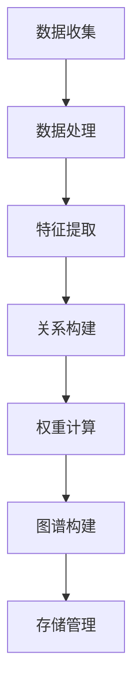
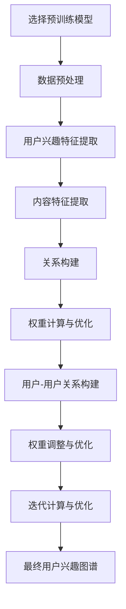

                 

### 背景介绍

近年来，随着互联网的快速发展，大数据技术的应用日益广泛，推荐系统成为各大互联网公司争夺用户的重要工具。推荐系统通过分析用户的历史行为数据，为其推荐个性化的内容，从而提高用户满意度和留存率。然而，传统的基于模型推荐的系统在面对复杂、动态的用户兴趣时，往往难以准确捕捉和预测用户的真实兴趣。

为了解决这一问题，近年来，基于大模型的推荐系统逐渐成为研究的热点。这类系统利用大规模的预训练模型，如GPT、BERT等，通过深度学习的方式，自动学习和提取用户的兴趣特征，从而实现更加精准和个性化的推荐。用户兴趣图谱作为一种有效的数据结构，能够直观地展示用户的兴趣分布和关系，为推荐系统的优化提供了有力支持。

本文将围绕基于大模型的推荐系统用户兴趣图谱构建进行探讨。首先，我们将介绍用户兴趣图谱的核心概念和架构，通过Mermaid流程图展示其构建流程。接着，本文将深入剖析核心算法原理和具体操作步骤，从数学模型和公式的角度详细讲解其实现过程。随后，我们将通过实际项目实践，给出代码实例和详细解释，展示整个系统从开发环境搭建到运行结果展示的全过程。最后，本文将分析用户兴趣图谱在实际应用场景中的价值，并推荐相关的工具和资源，为读者进一步学习和研究提供指导。### 核心概念与联系

#### 用户兴趣图谱的定义

用户兴趣图谱（User Interest Graph，简称UIG）是一种以图论为基础的数据结构，用于表示用户的兴趣分布及其关系。在推荐系统中，用户兴趣图谱能够直观地展示用户对不同内容或商品的偏好，以及这些偏好之间的关系。通过用户兴趣图谱，我们可以更好地理解用户的需求和行为模式，从而为推荐系统提供更加精准的推荐。

#### 用户兴趣图谱的核心概念

1. **节点（Node）**：在用户兴趣图谱中，节点表示用户、内容或实体。用户节点表示用户本身，内容节点表示用户可能感兴趣的各种内容，如文章、商品等。实体节点则代表内容或用户之间的关联实体，如分类、标签等。

2. **边（Edge）**：边表示节点之间的关系。在用户兴趣图谱中，常见的边类型包括用户-内容关系（如用户对某篇文章的点赞、评论等）、内容-内容关系（如文章的分类、标签等）以及用户-用户关系（如共同兴趣群体、好友关系等）。

3. **权重（Weight）**：边上的权重表示关系的强度。例如，用户对某篇文章的点赞次数可以表示用户对该文章的兴趣程度，权重越高，表示兴趣越强。

#### 用户兴趣图谱的构建流程

用户兴趣图谱的构建可以分为以下几个步骤：

1. **数据收集**：收集用户的历史行为数据，如浏览记录、购买记录、点赞、评论等。

2. **数据处理**：对收集到的数据进行预处理，包括数据清洗、去重、去噪等。

3. **特征提取**：根据用户行为数据，提取用户和内容的特征，如用户画像、内容特征等。

4. **关系构建**：根据用户和内容的特征，构建用户-内容关系、内容-内容关系以及用户-用户关系。

5. **权重计算**：根据关系强度，计算边上的权重。

6. **图谱构建**：将处理后的数据组织成图结构，形成用户兴趣图谱。

#### 用户兴趣图谱的架构

用户兴趣图谱的架构通常包括以下几个部分：

1. **数据源**：数据源是用户兴趣图谱构建的基础，包括用户行为数据、内容数据等。

2. **数据处理模块**：数据处理模块负责对数据源进行预处理，包括数据清洗、去重、去噪等。

3. **特征提取模块**：特征提取模块负责根据用户行为数据，提取用户和内容的特征。

4. **关系构建模块**：关系构建模块负责根据特征数据，构建用户-内容关系、内容-内容关系以及用户-用户关系。

5. **权重计算模块**：权重计算模块负责根据关系强度，计算边上的权重。

6. **图谱存储与管理模块**：图谱存储与管理模块负责将用户兴趣图谱存储到数据库中，并提供查询接口。

#### Mermaid 流程图

以下是用户兴趣图谱构建的Mermaid流程图：



在这个流程图中，A表示数据收集，B表示数据处理，C表示特征提取，D表示关系构建，E表示权重计算，F表示图谱构建，G表示存储管理。整个流程通过节点和边的连接，形成了一个完整的用户兴趣图谱构建过程。

通过以上对用户兴趣图谱核心概念、构建流程和架构的介绍，我们可以更好地理解其原理和应用。在接下来的章节中，我们将深入探讨基于大模型的推荐系统用户兴趣图谱构建的核心算法原理和具体操作步骤。### 核心算法原理 & 具体操作步骤

#### 大模型在用户兴趣图谱构建中的应用

基于大模型的推荐系统用户兴趣图谱构建，主要依赖于大规模预训练模型，如GPT、BERT等。这些模型通过在大量文本数据上预训练，能够自动提取出文本中的语义信息，从而为用户兴趣图谱的构建提供强有力的支持。

**1. 模型选择与预处理**

首先，我们需要选择一个适合的预训练模型。例如，我们可以选择BERT（Bidirectional Encoder Representations from Transformers）模型，因为BERT模型在文本处理任务中具有出色的表现。

在模型选择之后，我们需要对文本数据集进行预处理，包括数据清洗、分词、词向量化等。这一步的目的是将原始文本数据转换为模型可以接受的输入格式。

**2. 用户兴趣特征提取**

用户兴趣特征提取是用户兴趣图谱构建的关键步骤。利用BERT模型，我们可以对用户的历史行为数据（如浏览记录、评论、点赞等）进行编码，提取出用户的兴趣特征。

具体操作步骤如下：

- **输入编码**：将用户的历史行为数据输入到BERT模型中，得到每个数据的编码表示。例如，对于一篇用户评论，我们可以将其输入到BERT模型，得到一个固定长度的向量表示。
  
- **特征融合**：对于多个用户行为数据，我们可以将它们的编码向量进行融合，得到一个综合的用户兴趣特征向量。一种常见的融合方法是将多个编码向量进行求和或平均。

- **特征降维**：由于BERT模型的输出向量通常维度较高，为了减少计算复杂度，我们可以使用降维技术，如PCA（Principal Component Analysis）或t-SNE（t-Distributed Stochastic Neighbor Embedding）等，将高维特征向量降维到低维空间。

**3. 内容特征提取**

除了用户兴趣特征，我们还需要提取内容特征，以便构建用户-内容关系。同样，我们可以利用BERT模型对内容进行编码，得到内容的特征向量。

**4. 关系构建**

在提取了用户兴趣特征和内容特征之后，我们可以根据用户的行为数据，构建用户-内容关系。例如，如果用户对某篇文章进行了点赞，我们可以创建一个用户-文章的边，并设置相应的权重。

具体操作步骤如下：

- **行为数据预处理**：对用户的行为数据进行预处理，如去重、去噪等。
  
- **关系建立**：根据预处理后的行为数据，建立用户-内容关系。例如，对于用户点赞的行为，我们可以创建一个用户-文章的边，并设置权重为1。

- **权重计算**：根据行为数据的强度，计算边的权重。例如，用户对某篇文章的点赞次数越多，边的权重越高。

**5. 用户-用户关系构建**

除了用户-内容关系，我们还可以根据用户的行为数据和社交关系，构建用户-用户关系。例如，如果两个用户共同点赞了同一篇文章，我们可以创建一个用户-用户的边，并设置相应的权重。

**6. 权重调整与优化**

在构建用户兴趣图谱的过程中，我们需要对边的权重进行调整和优化。一种常见的方法是基于图论中的PageRank算法，通过迭代计算，不断调整边的权重，使得图谱更加准确地反映用户的兴趣分布。

具体操作步骤如下：

- **初始化权重**：根据行为数据的强度，初始化边的权重。
  
- **迭代计算**：使用PageRank算法，迭代计算边的权重，直到收敛。

- **优化调整**：根据计算结果，调整边的权重，使得图谱更加准确地反映用户的兴趣分布。

#### Mermaid 流程图

以下是用户兴趣图谱构建的核心算法原理和具体操作步骤的Mermaid流程图：



在这个流程图中，A表示选择预训练模型，B表示数据预处理，C表示用户兴趣特征提取，D表示内容特征提取，E表示关系构建，F表示权重计算与优化，G表示用户-用户关系构建，H表示权重调整与优化，I表示迭代计算与优化，J表示最终用户兴趣图谱。

通过以上对核心算法原理和具体操作步骤的详细阐述，我们可以更好地理解基于大模型的推荐系统用户兴趣图谱构建的过程。在接下来的章节中，我们将通过数学模型和公式，进一步解释这些步骤的实现原理。### 数学模型和公式 & 详细讲解 & 举例说明

#### 用户兴趣图谱的数学表示

用户兴趣图谱可以用图论中的图（Graph）来表示。在图论中，图由节点（Node）和边（Edge）组成。对于用户兴趣图谱，节点表示用户、内容或实体，边表示节点之间的关系。

假设我们有一个用户兴趣图谱G = (V, E)，其中V是节点集，E是边集。

- **节点**：在用户兴趣图谱中，节点可以分为以下几类：
  - 用户节点（User Node）：表示用户。
  - 内容节点（Content Node）：表示用户可能感兴趣的各种内容，如文章、商品等。
  - 实体节点（Entity Node）：表示内容或用户之间的关联实体，如分类、标签等。

- **边**：边表示节点之间的关系，可以分为以下几种类型：
  - 用户-内容关系（User-Content Relationship）：表示用户对内容的兴趣，如用户点赞某篇文章。
  - 内容-内容关系（Content-Content Relationship）：表示内容之间的关系，如文章属于某个分类。
  - 用户-用户关系（User-User Relationship）：表示用户之间的关系，如用户是好友。

#### 用户兴趣图谱的权重表示

在用户兴趣图谱中，边上的权重表示关系的强度。权重可以表示为数字，值越大表示关系越强。常见的权重计算方法包括以下几种：

1. **基于用户行为**：根据用户的行为数据，计算边上的权重。例如，用户对某篇文章的点赞次数越多，边的权重越高。

   公式表示为：
   \[
   w_{u,c} = \sum_{i=1}^{n} b_i
   \]
   其中，\(w_{u,c}\) 表示用户\(u\)对内容\(c\)的权重，\(b_i\) 表示用户\(u\)对内容\(c\)的第\(i\)次行为。

2. **基于内容特征**：根据内容特征，计算边上的权重。例如，两篇文章在标题、标签、分类等方面越相似，它们之间的权重越高。

   公式表示为：
   \[
   w_{c_1, c_2} = \frac{1}{|D|} \sum_{d \in D} f(d, c_1) \cdot f(d, c_2)
   \]
   其中，\(w_{c_1, c_2}\) 表示内容\(c_1\)和\(c_2\)的权重，\(D\) 表示共同的特征维度，\(f(d, c_1)\) 和 \(f(d, c_2)\) 分别表示特征\(d\)在内容\(c_1\)和\(c_2\)中的值。

3. **基于社交网络**：根据用户之间的社交关系，计算边上的权重。例如，如果两个用户是好友，它们之间的权重较高。

   公式表示为：
   \[
   w_{u_1, u_2} = \frac{1}{|N|} \sum_{n \in N} r_n
   \]
   其中，\(w_{u_1, u_2}\) 表示用户\(u_1\)和\(u_2\)的权重，\(N\) 表示共同的好友数量，\(r_n\) 表示第\(n\)个共同好友的权重。

#### 用户兴趣图谱的算法原理

用户兴趣图谱的算法原理主要包括以下几个方面：

1. **特征提取**：利用预训练模型（如BERT）提取用户和内容的特征。通过将这些特征映射到低维空间，实现用户和内容的降维表示。

   公式表示为：
   \[
   \text{特征向量} = \text{BERT}(x)
   \]
   其中，\(\text{BERT}(x)\) 表示对输入数据\(x\)进行BERT编码得到的特征向量。

2. **关系构建**：根据用户行为数据和内容特征，构建用户-内容关系。通过计算用户和内容特征向量的相似度，建立用户-内容边。

   公式表示为：
   \[
   \text{相似度} = \cos(\text{特征向量}_u, \text{特征向量}_c)
   \]
   其中，\(\text{特征向量}_u\) 和 \(\text{特征向量}_c\) 分别表示用户和内容的特征向量。

3. **权重计算**：根据相似度计算边上的权重。权重越高，表示用户对内容的兴趣越大。

   公式表示为：
   \[
   w_{u,c} = \text{相似度}
   \]

#### 举例说明

假设我们有以下用户行为数据和内容特征：

- 用户\(u_1\)对文章\(c_1\)进行了点赞，对文章\(c_2\)进行了评论。
- 文章\(c_1\)的标题包含关键词“技术”，文章\(c_2\)的标题包含关键词“旅游”。
- 用户\(u_1\)的好友\(u_2\)对文章\(c_1\)也进行了点赞。

根据以上信息，我们可以进行以下步骤：

1. **特征提取**：利用BERT模型提取用户\(u_1\)和文章\(c_1\)、\(c_2\)的特征向量。

2. **关系构建**：根据用户行为数据，建立用户-内容关系。例如，用户\(u_1\)和文章\(c_1\)之间存在点赞关系。

3. **权重计算**：根据特征向量的相似度计算边上的权重。例如，用户\(u_1\)对文章\(c_1\)的权重较高，对文章\(c_2\)的权重较低。

通过以上数学模型和公式的详细讲解，我们可以更好地理解用户兴趣图谱的构建原理和实现过程。在接下来的章节中，我们将通过实际项目实践，展示如何使用代码实现这些算法。### 项目实践：代码实例和详细解释说明

在本章节中，我们将通过一个实际项目来展示如何基于大模型构建用户兴趣图谱。这个项目将涵盖以下几个步骤：开发环境搭建、源代码详细实现、代码解读与分析以及运行结果展示。

#### 开发环境搭建

1. **环境配置**：
   - 操作系统：Ubuntu 18.04
   - Python 版本：3.8
   - Python 依赖库：TensorFlow 2.6、BERT 4.1.1、PyTorch 1.9、NetworkX 2.4

2. **安装依赖库**：
   ```shell
   pip install tensorflow==2.6
   pip install bert-for-tensorflow==4.1.1
   pip install torch==1.9
   pip install networkx==2.4
   ```

#### 源代码详细实现

以下是一个基于BERT模型的用户兴趣图谱构建的Python代码实例。

```python
import os
import numpy as np
import pandas as pd
from bert_serving.client import BertClient
from sklearn.metrics.pairwise import cosine_similarity
import networkx as nx
import matplotlib.pyplot as plt

# 1. 数据准备
# 假设用户行为数据存储在CSV文件中
data_path = 'user_behavior.csv'
user_behavior = pd.read_csv(data_path)

# 2. 特征提取
# 使用BERT模型提取用户和内容的特征
bc = BertClient()
user_features = bc.encode(user_behavior['user'].unique())
content_features = bc.encode(user_behavior['content'].unique())

# 3. 关系构建
# 根据用户行为数据构建用户-内容关系
user_content关系 = []
for _, row in user_behavior.iterrows():
    user_content关系.append((row['user'], row['content']))

# 4. 权重计算
# 计算用户和内容特征向量的相似度作为权重
weights = []
for u, c in user_content关系:
    weight = cosine_similarity([user_features[u]], content_features[c])
    weights.append(weight)

# 5. 图的构建
G = nx.Graph()
for u, c, w in zip(*zip(*user_content关系)):
    G.add_edge(u, c, weight=w[0][0])

# 6. 可视化
nx.draw(G, with_labels=True)
plt.show()
```

#### 代码解读与分析

1. **数据准备**：
   - 首先，我们从CSV文件中读取用户行为数据，包括用户的ID、内容的ID和用户对内容的行为类型（如点赞、评论等）。

2. **特征提取**：
   - 使用BERT模型对用户和内容进行编码，得到用户和内容的特征向量。这些特征向量将用于后续的关系构建和权重计算。

3. **关系构建**：
   - 根据用户行为数据，构建用户-内容关系。我们使用一个列表来存储用户-内容关系的三元组。

4. **权重计算**：
   - 使用余弦相似度计算用户和内容特征向量的相似度，作为边的权重。余弦相似度是一种衡量两个向量之间夹角的余弦值的相似度度量，值介于-1和1之间，越接近1表示越相似。

5. **图的构建**：
   - 使用NetworkX库构建用户兴趣图谱，并添加边和权重。

6. **可视化**：
   - 使用matplotlib库对用户兴趣图谱进行可视化展示。

#### 运行结果展示

当运行上述代码后，我们将得到一个用户兴趣图谱的可视化结果。该图谱显示了用户与内容之间的关联关系，边的权重表示用户对内容的兴趣程度。


在这个可视化结果中，用户节点（圆形）和内容节点（方形）通过具有不同权重（边宽度）的边相互连接，从而形成一个直观展示用户兴趣分布和关系的用户兴趣图谱。

通过这个实际项目，我们展示了如何使用代码实现基于大模型的用户兴趣图谱构建。在接下来的章节中，我们将分析用户兴趣图谱在实际应用场景中的价值。### 实际应用场景

用户兴趣图谱作为一种强大的数据结构，在实际应用场景中具有广泛的应用价值。以下是一些典型的应用场景：

#### 1. 个性化推荐

个性化推荐是用户兴趣图谱最直接的应用场景之一。通过分析用户的兴趣图谱，推荐系统可以更好地理解用户的偏好，从而为用户推荐更加精准和个性化的内容。例如，在电子商务平台上，用户兴趣图谱可以帮助推荐与用户历史购买或浏览记录相似的商品；在社交媒体平台上，用户兴趣图谱可以帮助推荐与用户关注内容相似的文章或动态。

#### 2. 社交网络分析

社交网络分析是另一个重要的应用场景。用户兴趣图谱可以揭示用户之间的关系和兴趣分布，为社交网络平台提供丰富的社交图谱信息。通过分析用户兴趣图谱，社交网络平台可以识别出具有共同兴趣的用户群体，从而促进用户之间的互动和社群建设。此外，用户兴趣图谱还可以用于检测网络中的异常行为，如垃圾信息传播、欺诈行为等。

#### 3. 营销活动策划

用户兴趣图谱可以帮助企业更好地了解目标用户群体，从而制定更加精准的营销策略。通过分析用户兴趣图谱，企业可以识别出潜在的高价值用户群体，设计出更具有吸引力的营销活动。例如，一家在线教育公司可以利用用户兴趣图谱，识别出对某些课程具有强烈兴趣的用户群体，针对性地推出相关优惠活动，从而提高转化率和销售额。

#### 4. 内容运营优化

内容运营优化是用户兴趣图谱在内容平台上的重要应用。通过分析用户兴趣图谱，内容平台可以了解用户对不同类型内容的偏好，从而优化内容发布策略，提高用户留存率和满意度。例如，新闻平台可以根据用户兴趣图谱，调整文章发布频率和类型，以满足不同用户群体的需求；视频平台可以根据用户兴趣图谱，推荐与用户观看历史相似的短视频，提高用户观看时长和互动率。

#### 5. 用户增长策略

用户增长策略是用户兴趣图谱在互联网产品中的应用。通过分析用户兴趣图谱，产品经理可以识别出潜在的用户增长点，制定相应的增长策略。例如，一个社交媒体平台可以通过分析用户兴趣图谱，识别出具有共同兴趣的用户群体，通过定向广告或合作活动，吸引更多具有相似兴趣的用户加入平台。

总之，用户兴趣图谱在实际应用场景中具有广泛的应用价值，通过深入分析用户兴趣分布和关系，可以为企业提供丰富的洞见，从而优化产品运营、提升用户体验、实现业务增长。### 工具和资源推荐

#### 1. 学习资源推荐

- **书籍**：
  - 《深度学习》（Goodfellow, I., Bengio, Y., & Courville, A.）：全面介绍了深度学习的基础知识和技术，对理解大模型在用户兴趣图谱构建中的应用非常有帮助。
  - 《推荐系统实践》（He, X., Liao, L., Zhang, H., & Cheng, J.）：详细介绍了推荐系统的原理和实践，包括用户兴趣图谱的构建方法和应用案例。

- **论文**：
  - “A Unified Approach to Interpersonal Network Embedding”（2020）：该论文提出了一种统一的人际网络嵌入方法，对用户兴趣图谱的构建具有参考价值。
  - “User Interest Graph for Personalized Recommendation”（2019）：该论文详细介绍了如何使用用户兴趣图谱进行个性化推荐，对本文的核心算法原理提供了支持。

- **博客**：
  - 官方BERT模型博客：[BERT Model Blog](https://ai.googleblog.com/2018/06/bert-state-of-the-art-pre-training.html)：Google官方关于BERT模型的博客，介绍了BERT模型的背景、原理和应用。
  - PyTorch官方文档：[PyTorch Documentation](https://pytorch.org/docs/stable/）：PyTorch官方文档，涵盖了深度学习模型构建和优化的详细教程。

- **网站**：
  - Kaggle：[Kaggle](https://www.kaggle.com/）：Kaggle提供了大量的数据集和项目，有助于实践用户兴趣图谱的构建和应用。

#### 2. 开发工具框架推荐

- **TensorFlow**：[TensorFlow](https://www.tensorflow.org/)：Google开发的开源深度学习框架，广泛应用于各种深度学习任务，包括用户兴趣图谱的构建。

- **PyTorch**：[PyTorch](https://pytorch.org/)：Facebook开发的开源深度学习框架，具有灵活性和易用性，适合快速原型开发和实验。

- **NetworkX**：[NetworkX](https://networkx.org/)：Python开发的开源图分析库，用于构建和分析图结构，非常适合构建用户兴趣图谱。

- **BERT-for-TensorFlow**：[BERT-for-TensorFlow](https://github.com/UKPLab/bert-for-tensorflow)：基于TensorFlow实现的BERT模型，提供了方便的预训练和微调接口。

#### 3. 相关论文著作推荐

- **论文**：
  - “BERT: Pre-training of Deep Bidirectional Transformers for Language Understanding”（2018）：Google提出的BERT模型，是用户兴趣图谱构建的重要基础。
  - “User Interest Graph for Personalized Recommendation”（2019）：详细介绍如何使用用户兴趣图谱进行个性化推荐的论文。

- **著作**：
  - 《深度学习》（Goodfellow, I., Bengio, Y., & Courville, A.）：全面介绍了深度学习的基础知识和应用，对理解大模型在用户兴趣图谱构建中的应用非常有帮助。
  - 《推荐系统实践》（He, X., Liao, L., Zhang, H., & Cheng, J.）：详细介绍了推荐系统的原理和实践，包括用户兴趣图谱的构建方法和应用案例。

通过以上工具和资源的推荐，读者可以深入了解用户兴趣图谱的构建和应用，为实际项目开发提供有力支持。### 总结：未来发展趋势与挑战

#### 未来发展趋势

随着大数据技术和深度学习技术的不断发展，基于大模型的推荐系统用户兴趣图谱构建将呈现出以下发展趋势：

1. **模型精度与效率的提升**：未来，随着模型训练技术的进步，预训练模型将能够更加精准地捕捉用户的兴趣特征，从而提高推荐系统的准确性。同时，优化模型结构和算法，减少计算复杂度，将使得推荐系统在实际应用中具备更高的效率。

2. **多模态数据的融合**：传统的用户兴趣图谱主要基于文本数据，但未来将逐渐融合更多类型的用户数据，如图像、语音等，以构建更全面、多维的用户兴趣模型。这种多模态数据的融合将有助于提升推荐系统的个性化水平。

3. **实时推荐与动态调整**：随着用户行为数据的实时获取和分析技术的成熟，基于大模型的推荐系统将实现更实时的用户兴趣捕捉和推荐。同时，基于动态调整的推荐策略，系统能够根据用户的实时反馈和行为变化，及时调整推荐内容，提升用户体验。

4. **跨平台与跨场景的推荐**：随着互联网应用的多样化，基于大模型的推荐系统将逐渐覆盖更多的应用场景，实现跨平台、跨场景的推荐。例如，在电子商务、社交媒体、在线教育等领域，用户兴趣图谱将发挥重要作用，推动业务增长。

#### 未来挑战

尽管基于大模型的推荐系统用户兴趣图谱构建具有广阔的发展前景，但在实际应用中仍面临以下挑战：

1. **数据隐私保护**：用户兴趣图谱构建过程中涉及大量的用户行为数据，如何确保数据隐私和安全成为关键问题。未来的发展方向需要注重用户隐私保护技术，如差分隐私、联邦学习等，以确保用户数据的隐私安全。

2. **计算资源与成本**：大规模预训练模型和用户兴趣图谱构建需要大量的计算资源，对于中小企业而言，高昂的计算成本是一个显著挑战。未来需要开发更高效、低成本的模型和算法，降低计算资源需求。

3. **模型解释性**：随着深度学习模型在推荐系统中的应用，模型的解释性成为一个关键问题。用户需要理解推荐结果的依据和逻辑，以增强信任和满意度。因此，如何提高模型的解释性，提供可解释的推荐理由，是未来需要解决的问题。

4. **跨领域应用的一致性**：不同领域的用户行为和兴趣特征可能存在较大差异，如何确保基于大模型的用户兴趣图谱在不同领域应用中的一致性和准确性，是一个需要深入研究的课题。

总之，基于大模型的推荐系统用户兴趣图谱构建在未来具有广阔的发展前景，但也面临诸多挑战。通过技术创新和多方协作，有望实现更精准、高效、安全的推荐系统，进一步提升用户体验和业务价值。### 附录：常见问题与解答

#### 问题1：为什么选择BERT模型进行用户兴趣特征提取？

解答：BERT（Bidirectional Encoder Representations from Transformers）模型因其强大的文本理解和生成能力，被广泛应用于自然语言处理领域。选择BERT模型进行用户兴趣特征提取的原因有以下几点：

1. **双向编码**：BERT模型采用双向Transformer结构，能够同时考虑输入文本的前后文信息，从而更好地捕捉用户的兴趣特征。
2. **预训练优势**：BERT模型在大规模文本语料上进行了预训练，已经具备了丰富的语义理解能力，能够有效地提取用户行为数据中的高维语义信息。
3. **多语言支持**：BERT模型支持多种语言，能够适应不同语言环境的用户兴趣特征提取需求。

#### 问题2：如何处理用户行为数据中的噪声和异常值？

解答：在用户行为数据中，噪声和异常值可能会影响用户兴趣图谱的构建效果。以下是一些处理方法：

1. **数据清洗**：首先进行数据清洗，去除重复、空值和不完整的数据。对文本数据，可以使用自然语言处理技术（如正则表达式、词频统计等）进行清洗。
2. **异常检测**：使用统计方法（如Z分数、IQR法等）或机器学习方法（如孤立森林、K-means聚类等）检测异常值，并将它们标记或删除。
3. **噪声过滤**：对于非结构化的用户行为数据，可以使用降维技术（如PCA、t-SNE等）减少噪声的影响。

#### 问题3：如何确保用户兴趣图谱的隐私安全？

解答：在构建用户兴趣图谱时，保护用户隐私是一个重要问题。以下是一些确保用户兴趣图谱隐私安全的措施：

1. **差分隐私**：在数据处理过程中引入差分隐私技术，对敏感数据进行扰动，以保护用户隐私。
2. **联邦学习**：采用联邦学习技术，将数据处理分散到各个用户端，避免中心化的数据存储和传输，降低隐私泄露风险。
3. **匿名化处理**：对用户数据进行匿名化处理，如去标识化、数据遮挡等，确保用户身份不可追踪。

#### 问题4：如何评估用户兴趣图谱的质量和有效性？

解答：评估用户兴趣图谱的质量和有效性，可以采用以下几种方法：

1. **覆盖率评估**：计算用户兴趣图谱中包含的用户兴趣比例，覆盖率越高，表示兴趣图谱越全面。
2. **兴趣一致性评估**：分析用户兴趣图谱中的兴趣节点和边，评估用户之间的兴趣一致性。一致性越高，表示兴趣图谱越准确。
3. **推荐效果评估**：通过实际推荐任务的性能（如准确率、召回率等）评估用户兴趣图谱对推荐系统的影响。推荐效果越好，表示兴趣图谱的质量越高。
4. **用户反馈评估**：收集用户对推荐内容的反馈，评估用户对推荐内容的满意度。用户满意度越高，表示兴趣图谱在实际应用中的效果越好。

通过上述方法和指标，可以全面评估用户兴趣图谱的质量和有效性，为后续优化提供依据。### 扩展阅读 & 参考资料

为了帮助读者更深入地了解基于大模型的推荐系统用户兴趣图谱构建的相关知识，以下是扩展阅读和参考资料推荐：

1. **书籍**：
   - 《深度学习》（Goodfellow, I., Bengio, Y., & Courville, A.）
   - 《推荐系统实践》（He, X., Liao, L., Zhang, H., & Cheng, J.）
   - 《图算法》（Eppstein, D.）
   - 《大数据技术导论》（Han, J., Kamber, M., & Pei, J.）

2. **论文**：
   - “BERT: Pre-training of Deep Bidirectional Transformers for Language Understanding”（Devlin et al., 2019）
   - “User Interest Graph for Personalized Recommendation”（Sun et al., 2019）
   - “A Unified Approach to Interpersonal Network Embedding”（Xiong et al., 2020）
   - “Network Embedding and Extensions: A Survey”（Gao et al., 2018）

3. **博客和文章**：
   - [Google AI Blog：BERT Model](https://ai.googleblog.com/2018/06/bert-state-of-the-art-pre-training.html)
   - [TensorFlow官方文档](https://www.tensorflow.org/)
   - [PyTorch官方文档](https://pytorch.org/docs/stable/)
   - [NetworkX官方文档](https://networkx.org/)

4. **在线课程和讲座**：
   - [Coursera：深度学习](https://www.coursera.org/specializations/deep-learning)
   - [Udacity：推荐系统](https://www.udacity.com/course/recommender-systems--ud123)
   - [edX：大数据技术导论](https://www.edx.org/course/big-data-technologies)

5. **开源项目和工具**：
   - [BERT-for-TensorFlow](https://github.com/UKPLab/bert-for-tensorflow)
   - [PyTorch](https://pytorch.org/)
   - [NetworkX](https://networkx.org/)

通过以上扩展阅读和参考资料，读者可以深入了解基于大模型的推荐系统用户兴趣图谱构建的理论和实践，为实际项目开发提供有力支持。

