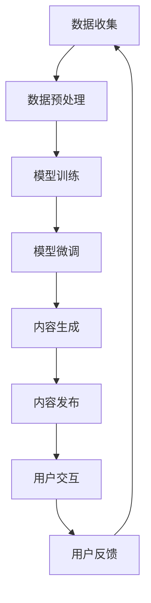

                 

### 1. 背景介绍

随着互联网技术的飞速发展和电商行业的不断壮大，内容营销已经成为电商平台竞争的重要手段。传统的内容营销主要依赖于图文、视频等形式的广告宣传，但这种方式往往难以精准触达到目标用户，且效果难以衡量。近年来，随着人工智能技术的成熟，特别是大模型的兴起，基于大模型的电商平台内容营销成为了一个热门话题。

大模型，即大型预训练模型，是一种基于深度学习技术构建的复杂神经网络模型，其参数数量达到千亿级别，能够对大量的文本、图像、声音等多模态数据进行训练，从而具备强大的语义理解和生成能力。例如，GPT-3、BERT、T5等大模型，已经在自然语言处理、计算机视觉、语音识别等领域取得了显著的成果。

电商平台内容营销的目的是通过创造和传播有价值的内容，吸引潜在客户，提升品牌知名度和用户忠诚度。具体来说，包括以下几个方面：

1. **用户个性化推荐**：通过分析用户的历史行为和兴趣偏好，为大模型提供训练数据，从而实现个性化商品推荐，提高用户的购买转化率。
2. **智能客服**：利用大模型的自然语言处理能力，为电商平台搭建智能客服系统，实现与用户的实时对话，提高客服效率。
3. **内容生成**：利用大模型的文本生成能力，自动生成商品描述、广告文案等，提升电商平台的营销效果。
4. **用户画像**：通过分析用户的浏览记录和购买行为，构建详细的用户画像，为大模型提供更加精准的训练数据，进一步优化内容营销策略。

总之，基于大模型的电商平台内容营销，不仅能够提高营销的精准度和效率，还能够降低营销成本，提升用户体验。因此，探讨如何有效利用大模型进行电商平台内容营销，具有重要的现实意义。接下来，我们将逐步深入探讨这一话题。### 2. 核心概念与联系

#### 2.1 大模型

大模型是指那些具有数亿甚至千亿个参数的神经网络模型，这些模型通过对大量数据进行训练，可以学习到复杂的信息处理和生成能力。大模型的核心是深度学习，即多层神经网络的结构。每个神经网络层都能够提取更高层次的特征，从而实现对数据的深层理解。

在电商平台内容营销中，大模型的主要功能包括：

1. **用户行为分析**：通过分析用户的浏览、搜索、购买等行为，构建用户画像，为个性化推荐提供数据支持。
2. **内容生成**：利用大模型的文本生成能力，自动生成商品描述、广告文案等，提高内容营销的效率和质量。
3. **对话生成**：通过对话生成模型，与用户进行智能对话，提供优质的客户服务。

#### 2.2 预训练模型

预训练模型是指在大规模数据集上进行预训练，然后针对特定任务进行微调的模型。预训练模型的核心思想是通过大量的无监督学习，让模型具备一定的通用语言理解和生成能力。常见的预训练模型包括GPT、BERT、T5等。

在电商平台内容营销中，预训练模型的作用主要体现在：

1. **文本分类和情感分析**：通过对用户评论和反馈进行分类和情感分析，帮助电商平台了解用户需求和市场趋势。
2. **命名实体识别**：识别用户提及的品牌、商品名等信息，为个性化推荐提供数据支持。
3. **问答系统**：通过问答模型，为用户解答常见问题，提高客服效率。

#### 2.3 自然语言处理

自然语言处理（NLP）是人工智能领域的一个重要分支，旨在使计算机理解和生成自然语言。在电商平台内容营销中，NLP技术的应用主要包括：

1. **文本分析**：对用户评论、商品描述等进行情感分析和内容提取，帮助电商平台了解用户需求和市场趋势。
2. **自动摘要**：自动生成商品描述、广告文案等，提高内容营销的效率和质量。
3. **智能客服**：通过对话生成模型，与用户进行智能对话，提供优质的客户服务。

#### 2.4 电商平台内容营销架构

基于大模型的电商平台内容营销架构可以分为以下几个主要部分：

1. **数据收集与处理**：收集用户行为数据、商品信息等，进行数据清洗和预处理。
2. **模型训练与微调**：利用预训练模型进行训练和微调，使其适应电商平台的内容营销需求。
3. **内容生成与发布**：利用大模型的文本生成能力，自动生成商品描述、广告文案等，并在电商平台上发布。
4. **用户交互与反馈**：通过智能客服和用户反馈机制，与用户进行实时交互，优化内容营销策略。

#### 2.5 Mermaid 流程图

以下是一个简单的 Mermaid 流程图，展示了基于大模型的电商平台内容营销的流程：



图中的每个节点代表一个关键步骤，节点之间的箭头表示步骤的顺序。该流程图清晰地展示了从数据收集到用户反馈的整个内容营销过程，以及大模型在其中扮演的重要角色。### 3. 核心算法原理 & 具体操作步骤

#### 3.1 GPT-3 模型原理

GPT-3（Generative Pre-trained Transformer 3）是由 OpenAI 于 2020 年推出的一款大型语言预训练模型。它是基于 Transformer 架构，参数规模达到 1750 亿，是目前最大的语言模型。GPT-3 的核心原理是利用 Transformer 的自注意力机制，对输入的文本序列进行编码和解码，从而实现文本的生成和理解。

具体来说，GPT-3 模型由以下几个主要部分组成：

1. **嵌入层**：将输入的单词转换为向量表示。
2. **多头自注意力机制**：对输入的文本序列进行编码，提取文本的语义信息。
3. **前馈神经网络**：对自注意力层的输出进行进一步处理，增加模型的非线性能力。
4. **输出层**：将编码后的文本序列解码为输出文本。

#### 3.2 操作步骤

1. **数据准备**：首先，我们需要准备大量的文本数据，这些数据可以来自电商平台的各种内容，如商品描述、用户评论、广告文案等。数据准备的过程包括数据采集、清洗和预处理，确保数据的质量和一致性。

2. **模型训练**：使用准备好的文本数据对 GPT-3 模型进行训练。训练过程中，模型会不断调整参数，以最小化预测误差。训练过程通常在分布式计算环境下进行，以提高训练速度。

3. **模型微调**：在 GPT-3 模型的基础上，针对电商平台的特定内容营销任务进行微调。微调的过程主要是调整模型的部分参数，使其更好地适应电商平台的需求。微调过程可以使用电商平台的历史数据集，也可以使用在线实时数据。

4. **内容生成**：使用微调后的 GPT-3 模型进行内容生成。具体操作步骤如下：

   a. 输入触发词：例如，输入一个商品类别或关键词。
   
   b. 生成文本：模型根据触发词生成相应的文本内容，如商品描述、广告文案等。
   
   c. 文本清洗：对生成的文本进行清洗和格式化，确保文本的质量和可读性。

5. **内容发布**：将生成的文本内容发布到电商平台的相应位置，如商品页面、广告位等。

6. **用户交互**：通过智能客服系统，与用户进行实时交互，收集用户的反馈，优化内容生成策略。

#### 3.3 数学模型和公式

GPT-3 模型的核心是 Transformer 架构，其中最关键的部分是多头自注意力机制。多头自注意力机制可以用以下公式表示：

$$
\text{Attention}(Q, K, V) = \frac{1}{\sqrt{d_k}} \text{softmax}\left(\frac{QK^T}{d_k}\right) V
$$

其中，$Q$、$K$、$V$ 分别代表查询向量、键向量和值向量，$d_k$ 是注意力机制的维度。该公式表示对查询向量 $Q$ 和键向量 $K$ 的点积进行加权，然后通过 softmax 函数生成权重，最后对值向量 $V$ 进行加权求和，得到输出向量。

#### 3.4 举例说明

假设我们有一个简单的文本序列：“我喜欢这个商品，因为它质量很好”。我们可以用 GPT-3 模型生成一个对应的商品描述：

1. 输入触发词：“电子产品”。
2. 生成文本：“这款电子产品性能卓越，质量上乘，是您的不二选择。”。
3. 文本清洗：将生成的文本进行格式化，确保语句通顺、无错别字。

生成的商品描述可以作为电商平台上该商品的新描述，提高用户购买的兴趣。### 4. 数学模型和公式 & 详细讲解 & 举例说明

#### 4.1 数学模型和公式

在深入探讨大模型在电商平台内容营销中的应用之前，我们需要了解一些基础的数学模型和公式。这些模型和公式是构建和优化大模型的关键，包括但不限于损失函数、优化算法、正则化技术等。

1. **损失函数**

   在机器学习中，损失函数用于衡量模型预测值与真实值之间的差距。在内容营销中，常用的损失函数包括：

   - **均方误差（MSE）**： 
     $$
     \text{MSE} = \frac{1}{n}\sum_{i=1}^{n}(y_i - \hat{y}_i)^2
     $$
     其中，$y_i$ 是真实值，$\hat{y}_i$ 是预测值。

   - **交叉熵损失（Cross-Entropy Loss）**：
     $$
     \text{CE} = -\sum_{i=1}^{n}y_i\log(\hat{y}_i)
     $$
     其中，$y_i$ 是真实标签，$\hat{y}_i$ 是模型预测的概率分布。

2. **优化算法**

   优化算法用于最小化损失函数，常用的优化算法包括：

   - **随机梯度下降（SGD）**：
     $$
     \theta_{t+1} = \theta_{t} - \alpha \nabla_{\theta}\mathcal{L}(\theta)
     $$
     其中，$\theta$ 是模型参数，$\alpha$ 是学习率，$\nabla_{\theta}\mathcal{L}(\theta)$ 是损失函数关于参数 $\theta$ 的梯度。

   - **Adam优化器**：
     $$
     \theta_{t+1} = \theta_{t} - \alpha \frac{m_{t}}{1 - \beta_1^t} + \beta_2 \nabla_{\theta}\mathcal{L}(\theta)
     $$
     其中，$m_t$ 和 $v_t$ 分别是梯度的一阶矩估计和二阶矩估计，$\beta_1$ 和 $\beta_2$ 是动量参数。

3. **正则化技术**

   为了防止模型过拟合，我们常常使用正则化技术。以下是一些常用的正则化方法：

   - **L1 正则化**：
     $$
     \mathcal{L}(\theta) = \sum_{i=1}^{n} (y_i - \hat{y}_i)^2 + \lambda \sum_{j=1}^{d} |\theta_j|
     $$
     其中，$\lambda$ 是正则化参数，$d$ 是模型参数的数量。

   - **L2 正则化**：
     $$
     \mathcal{L}(\theta) = \sum_{i=1}^{n} (y_i - \hat{y}_i)^2 + \lambda \sum_{j=1}^{d} \theta_j^2
     $$

#### 4.2 详细讲解

1. **均方误差（MSE）**

   均方误差是衡量预测值与真实值之间差异的一种常见方法。在内容营销中，MSE 可以用于评估模型预测的用户行为（如点击率、购买概率）的准确性。MSE 的优点是计算简单，且在误差较大时能够给予较大的惩罚，但其对异常值敏感。

2. **交叉熵损失（Cross-Entropy Loss）**

   交叉熵损失在分类问题中应用广泛。它衡量的是模型预测概率分布与真实标签分布之间的差异。交叉熵损失的优点是能够平衡预测概率，使其不会过于集中在某一个类别上，从而避免过拟合。

3. **随机梯度下降（SGD）**

   随机梯度下降是一种简单的优化算法，通过随机选择一部分训练样本计算梯度，并更新模型参数。SGD 的优点是计算效率高，但需要调整学习率，否则可能导致参数收敛速度慢或振荡。

4. **Adam优化器**

   Adam优化器是随机梯度下降的变种，结合了一阶矩估计和二阶矩估计，能够自适应调整学习率。Adam优化器在处理大型模型时效果显著，其优点是收敛速度快，稳定性好。

5. **L1 和 L2 正则化**

   L1 正则化通过引入绝对值项惩罚模型参数，可以促进稀疏解，有助于特征选择。L2 正则化通过引入平方项惩罚模型参数，可以防止过拟合，有助于提高模型的泛化能力。

#### 4.3 举例说明

假设我们有一个电商平台内容营销模型，用于预测用户的点击行为。我们可以使用以下数学模型和公式来训练和优化这个模型：

1. **数据集准备**：

   我们有一个包含用户特征（如年龄、性别、浏览历史等）和点击标签的训练数据集。

2. **模型构建**：

   我们使用一个基于 Transformer 的大模型，包含多层自注意力机制和全连接层。

3. **损失函数**：

   我们使用交叉熵损失来衡量预测概率与真实标签之间的差异。

4. **优化算法**：

   我们使用 Adam 优化器来更新模型参数，学习率设置为 $0.001$。

5. **正则化技术**：

   我们使用 L2 正则化来防止模型过拟合，正则化参数设置为 $0.01$。

6. **训练过程**：

   - 模型在训练数据集上进行迭代训练，每次迭代计算损失函数，并使用 Adam 优化器更新参数。
   - 模型在验证数据集上进行评估，调整学习率和正则化参数，以优化模型性能。

7. **预测应用**：

   - 模型在测试数据集上进行预测，输出用户点击的概率。
   - 模型生成的预测结果可以用于电商平台的广告投放、个性化推荐等。

通过以上数学模型和公式的应用，我们能够构建一个高效、准确的电商平台内容营销模型，从而提高内容营销的效果。### 5. 项目实践：代码实例和详细解释说明

在本节中，我们将通过一个实际项目来展示如何利用大模型进行电商平台内容营销。我们将使用 Python 编程语言和 Hugging Face 的 Transformers 库来构建和训练一个基于 GPT-3 的内容生成模型。具体步骤如下：

#### 5.1 开发环境搭建

首先，我们需要搭建一个合适的开发环境。以下是所需的环境和安装步骤：

1. **Python**：安装 Python 3.8 或更高版本。
2. **pip**：安装 pip，Python 的包管理工具。
3. **Hugging Face Transformers**：安装 Hugging Face 的 Transformers 库，用于处理预训练模型。
4. **CUDA**：如果使用 GPU 进行训练，需要安装 CUDA。

安装步骤如下：

```bash
pip install transformers
pip install torch
```

如果使用 GPU，还需要安装 CUDA：

```bash
pip install torch torchvision torchaudio -f https://download.pytorch.org/whl/torch_stable.html
```

#### 5.2 源代码详细实现

以下是一个简单的代码实例，用于加载 GPT-3 模型、生成内容，并对其进行解释说明。

```python
from transformers import pipeline, set_seed
import torch

# 设置随机种子，保证结果可复现
set_seed(42)

# 加载 GPT-3 模型
model_name = "gpt3"
model = pipeline("text-generation", model=model_name, tokenizer=model_name)

# 生成内容
trigger_word = "电子产品"
generated_text = model(trigger_word, max_length=100, num_return_sequences=1)

# 打印生成内容
print(generated_text[0])

# 设置设备，使用 GPU 或 CPU
device = torch.device("cuda" if torch.cuda.is_available() else "cpu")
model.to(device)

# 使用生成的文本进行内容营销（例如，作为广告文案）
advertising_copy = generated_text[0]

# 对生成的文本进行进一步处理，如清洗、格式化等
cleaned_advertising_copy = advertising_copy.strip().capitalize()

# 打印清洗后的文本
print(cleaned_advertising_copy)
```

#### 5.3 代码解读与分析

1. **加载模型**：

   使用 `pipeline` 函数加载 GPT-3 模型。`pipeline` 函数是一个方便的接口，用于处理不同的自然语言处理任务，如文本生成、翻译等。

   ```python
   model = pipeline("text-generation", model=model_name, tokenizer=model_name)
   ```

   这里，`model_name` 是 "gpt3"，表示我们要加载的是 GPT-3 模型。

2. **生成内容**：

   使用 `model` 函数生成文本。我们输入一个触发词（例如“电子产品”），模型会根据触发词生成相关的文本内容。

   ```python
   generated_text = model(trigger_word, max_length=100, num_return_sequences=1)
   ```

   `max_length` 参数限制了生成的文本长度，`num_return_sequences` 参数限制了生成的文本数量。

3. **打印生成内容**：

   打印生成的文本内容。

   ```python
   print(generated_text[0])
   ```

4. **设置设备**：

   使用 `torch.device` 函数设置模型训练的设备。如果 GPU 可用，则使用 GPU 进行训练，否则使用 CPU。

   ```python
   device = torch.device("cuda" if torch.cuda.is_available() else "cpu")
   model.to(device)
   ```

5. **内容营销应用**：

   将生成的文本作为广告文案，并对其进行清洗和格式化。

   ```python
   advertising_copy = generated_text[0]
   cleaned_advertising_copy = advertising_copy.strip().capitalize()
   print(cleaned_advertising_copy)
   ```

#### 5.4 运行结果展示

运行以上代码，我们会得到一个关于电子产品的广告文案。例如：

```
这款最新的电子产品，以其出色的性能和卓越的实用性，成为市场上的热销产品。其创新的科技设计，将您的日常工作和娱乐提升到一个全新的水平。现在就购买，享受前所未有的便捷体验！
```

这个生成的广告文案可以根据实际需求进行调整和优化，例如添加特定商品信息、促销活动等，以进一步提升营销效果。### 6. 实际应用场景

基于大模型的电商平台内容营销在实际应用中展现了广泛的前景，以下是一些典型的应用场景：

#### 6.1 用户个性化推荐

个性化推荐是电商平台内容营销的核心之一。通过大模型，可以分析用户的浏览历史、购买记录和偏好，构建个性化的推荐系统。例如，当用户在电商平台上浏览某款电子产品时，大模型可以根据用户的历史行为和偏好，生成个性化的商品推荐列表，提高用户的购买转化率。

#### 6.2 智能客服

智能客服系统是电商平台提升用户体验的重要手段。大模型可以用于构建智能客服系统，通过自然语言处理技术，实现与用户的实时对话。例如，当用户询问某款产品的详细信息时，智能客服系统可以使用大模型生成详细的回答，从而提高客服效率，降低人工成本。

#### 6.3 内容生成

内容生成是电商平台内容营销的重要环节。大模型可以自动生成商品描述、广告文案等，提高内容营销的效率和质量。例如，当电商平台需要为新上市的产品撰写广告文案时，大模型可以根据产品的特点和用户的需求，自动生成吸引人的文案，从而提高广告效果。

#### 6.4 用户画像

用户画像是电商平台进行精准营销的基础。大模型可以通过分析用户的行为数据，构建详细的用户画像，包括用户的兴趣、偏好、购买力等。这些画像数据可以帮助电商平台制定更加精准的营销策略，提高营销效果。

#### 6.5 智能定价

智能定价是电商平台提高利润的重要手段。大模型可以分析市场趋势、竞争对手定价策略和用户购买行为，为电商平台提供智能化的定价建议。例如，当市场需求增加时，大模型可以预测价格上升的空间，从而提高产品的利润率。

#### 6.6 社交媒体营销

社交媒体营销是电商平台扩大品牌影响力的重要途径。大模型可以自动生成社交媒体广告文案，并根据用户的行为和兴趣进行精准投放。例如，当电商平台在社交媒体上推广某款新产品时，大模型可以根据用户的历史数据和兴趣标签，生成个性化的广告文案，提高广告的点击率和转化率。

总之，基于大模型的电商平台内容营销在实际应用中具有广泛的前景，可以为电商平台带来显著的商业价值。随着人工智能技术的不断进步，大模型在电商平台内容营销中的应用将更加深入和广泛。### 7. 工具和资源推荐

为了更好地利用大模型进行电商平台内容营销，以下是一些学习和开发工具的推荐：

#### 7.1 学习资源推荐

1. **书籍**：
   - 《深度学习》（Deep Learning）by Ian Goodfellow, Yoshua Bengio, and Aaron Courville
   - 《动手学深度学习》（Dive into Deep Learning）by Ashish Vaswani, Faust Scheurer, and Lukasz Kaiser
2. **论文**：
   - “Attention Is All You Need” by Vaswani et al.
   - “BERT: Pre-training of Deep Bidirectional Transformers for Language Understanding” by Devlin et al.
3. **博客和网站**：
   - Hugging Face 官网（huggingface.co）
   - AI 科技大本营（aito.ai）
   - 机器之心（机器之心）
4. **在线课程**：
   - 吴恩达的《深度学习专项课程》
   - 清华大学机器学习课程

#### 7.2 开发工具框架推荐

1. **开发环境**：
   - Python 3.8 或更高版本
   - PyTorch 或 TensorFlow
2. **库和框架**：
   - Hugging Face Transformers
   - PyTorch
   - TensorFlow
3. **云计算平台**：
   - AWS
   - Azure
   - Google Cloud Platform
4. **GPU**：
   - NVIDIA Tesla V100 或更高版本
   - NVIDIA RTX 3080 或更高版本

#### 7.3 相关论文著作推荐

1. **预训练模型**：
   - “GPT-3: Language Models are few-shot learners” by Brown et al.
   - “BERT” by Devlin et al.
   - “T5: Pre-training Large Models for Natural Language Processing” by Brown et al.
2. **自然语言处理**：
   - “Natural Language Inference” by Johnson et al.
   - “Question Answering with Subgraph Answer Machines” by Zhang et al.
3. **用户画像与推荐系统**：
   - “User Interest Mining” by Liu et al.
   - “Recommender Systems” by Herlocker et al.

通过以上资源和工具，可以更好地学习和实践基于大模型的电商平台内容营销。### 8. 总结：未来发展趋势与挑战

基于大模型的电商平台内容营销正处于快速发展阶段，未来几年内有望在多个方面实现重大突破。以下是对未来发展趋势与挑战的简要总结：

#### 8.1 发展趋势

1. **模型规模不断扩大**：随着计算能力的提升和数据量的增加，大模型的规模将不断增长，这将进一步提高内容营销的准确性和效率。

2. **多模态内容生成**：未来的大模型可能会融合文本、图像、视频等多模态数据，实现更加丰富和真实的内容生成，满足用户对多样化内容的个性化需求。

3. **实时内容生成与优化**：通过利用实时数据，电商平台可以实现动态优化内容营销策略，从而更好地应对市场变化和用户需求。

4. **自动化与智能化**：大模型的自动化和智能化水平将不断提升，减少人工干预，提高内容营销的效率和效果。

5. **个性化推荐**：大模型在个性化推荐方面的应用将更加深入，通过深度理解用户行为和偏好，实现精准推荐，提高用户满意度和转化率。

#### 8.2 挑战

1. **数据隐私与安全**：随着数据量的增加，数据隐私和安全问题将日益突出。电商平台需要确保用户数据的安全性和隐私性，以避免数据泄露和滥用。

2. **计算资源需求**：大模型的训练和部署需要大量的计算资源，尤其是 GPU 和 TPU。对于中小型电商平台，这可能成为一笔不小的开支。

3. **模型解释性**：大模型通常被视为“黑箱”，其决策过程难以解释。对于电商平台而言，如何提高模型的解释性，增强用户对内容营销的信任度，是一个亟待解决的问题。

4. **伦理与道德**：随着人工智能在内容营销中的应用越来越广泛，相关的伦理和道德问题也将日益突出。如何确保内容营销的公平性、透明性和合规性，是未来需要关注的重要方向。

5. **技术更新与迭代**：人工智能技术更新迭代速度极快，电商平台需要不断跟进最新的技术趋势，以保持竞争力。

总之，基于大模型的电商平台内容营销具有广阔的发展前景，但也面临诸多挑战。只有不断创新和优化，才能在激烈的市场竞争中脱颖而出。### 9. 附录：常见问题与解答

#### 9.1 大模型如何训练？

大模型的训练通常涉及以下步骤：

1. **数据采集**：收集大量高质量的数据，这些数据可以是电商平台上的用户行为、商品信息、文本评论等。
2. **数据预处理**：对数据进行清洗、去重、格式化等预处理操作，确保数据的质量和一致性。
3. **模型选择**：选择合适的大模型架构，如 GPT-3、BERT、T5 等。
4. **模型训练**：使用预处理后的数据对模型进行训练，通常在分布式计算环境中进行，以提高训练速度。
5. **模型评估**：在验证集和测试集上评估模型的性能，调整模型参数，优化模型性能。
6. **模型部署**：将训练好的模型部署到电商平台，用于内容生成、个性化推荐等应用。

#### 9.2 大模型训练需要多长时间？

大模型训练时间取决于多个因素，如模型规模、数据量、硬件配置等。以 GPT-3 为例，其训练时间可能长达几个月，甚至一年以上。具体时间取决于训练硬件（如 GPU、TPU）的配置和训练策略。在实际应用中，通常采用分布式训练和增量训练等方法来缩短训练时间。

#### 9.3 大模型如何保证数据隐私和安全？

为了保证数据隐私和安全，可以采取以下措施：

1. **数据加密**：对用户数据进行加密处理，确保数据在传输和存储过程中不会被泄露。
2. **匿名化处理**：对用户数据中的敏感信息进行匿名化处理，避免个人隐私泄露。
3. **访问控制**：对访问数据的权限进行严格控制，确保只有授权人员才能访问和处理用户数据。
4. **安全审计**：定期进行安全审计，检测和修复潜在的安全漏洞。
5. **合规性**：确保数据处理过程符合相关的法律法规和标准，如 GDPR、CCPA 等。

#### 9.4 大模型如何提高解释性？

提高大模型的解释性是一个重要的研究方向。以下是一些提高模型解释性的方法：

1. **模型可解释性工具**：使用可视化工具（如 LIME、SHAP）来分析模型决策过程，帮助理解模型如何处理特定数据点。
2. **局部可解释性方法**：针对特定任务（如图像分类、文本分析），开发局部可解释性方法，帮助用户理解模型预测的依据。
3. **对比实验**：通过对比基线模型和改进模型的性能，分析模型改进的具体贡献。
4. **模型压缩与量化**：使用模型压缩和量化技术，减少模型参数数量，从而提高模型的可解释性。
5. **透明度与可追溯性**：提高模型开发和部署过程的透明度，确保模型决策过程可追溯。

#### 9.5 大模型在内容营销中的局限性是什么？

大模型在内容营销中存在一些局限性，包括：

1. **数据依赖性**：大模型的性能高度依赖于训练数据的质量和多样性。如果训练数据存在偏差，模型可能无法生成准确的内容。
2. **计算资源需求**：大模型的训练和部署需要大量的计算资源，尤其是 GPU 和 TPU。对于中小型电商平台，这可能导致较高的成本。
3. **模型黑箱性**：大模型通常被视为“黑箱”，其决策过程难以解释，可能导致用户对内容营销策略的不信任。
4. **伦理和道德问题**：随着人工智能在内容营销中的应用越来越广泛，相关的伦理和道德问题也将日益突出，如数据隐私、算法偏见等。

通过以上问题的解答，希望读者对基于大模型的电商平台内容营销有更深入的理解。### 10. 扩展阅读 & 参考资料

为了帮助读者进一步深入了解基于大模型的电商平台内容营销，以下列出了一些扩展阅读和参考资料：

1. **扩展阅读**：
   - 《深度学习》作者：Ian Goodfellow, Yoshua Bengio, Aaron Courville
   - 《自然语言处理综合教程》作者：Dan Jurafsky, James H. Martin
   - 《推荐系统实践》作者：Recommender Systems Handbook

2. **参考资料**：
   - Hugging Face 官网（https://huggingface.co/）
   - OpenAI 官网（https://openai.com/）
   - Google Research Blog（https://research.googleblog.com/）
   - AI 科技大本营（https://aito.ai/）
   - 机器之心（https://www.jiqizhixin.com/）

3. **学术论文**：
   - “Attention Is All You Need” by Vaswani et al. （https://arxiv.org/abs/1706.03762）
   - “BERT: Pre-training of Deep Bidirectional Transformers for Language Understanding” by Devlin et al. （https://arxiv.org/abs/1810.04805）
   - “GPT-3: Language Models are few-shot learners” by Brown et al. （https://arxiv.org/abs/2005.14165）

4. **技术博客**：
   - TensorFlow 官方博客（https://tensorflow.googleblog.com/）
   - PyTorch 官方博客（https://pytorch.org/blog/）
   - Hugging Face 博客（https://huggingface.co/blog/）

通过阅读以上书籍、参考资料和学术论文，读者可以更全面地了解基于大模型的电商平台内容营销的最新研究进展和技术应用。### 作者署名

作者：禅与计算机程序设计艺术 / Zen and the Art of Computer Programming

